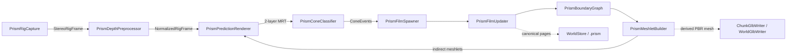

# Cone-PRISM-Q3 code graph

<!-- Generated by Tools/generate_code_graph.py; do not edit manually. -->

Source digest: `a0420d51ebfa5e7df63f4bde0a9e53a1a6700e53b925047ca6051fb4991d19b1`

Scope: 76 files, 1015 symbols, 791 functions/methods, 27 GPU kernels, 16 event links.

## Runtime data flow

## DAG to code

| Run | Status | Mapped files |
|---|---|---:|
| Q3-01 | done | 7 |
| Q3-02 | done | 7 |
| Q3-03 | done | 4 |
| Q3-04 | done | 3 |
| Q3-05 | done | 4 |
| Q3-06 | done | 3 |
| Q3-07 | done | 3 |
| Q3-08 | done | 2 |
| Q3-09 | done | 5 |
| Q3-10 | in_progress | 4 |
| Q3-11 | pending | 0 |
| Q3-12 | pending | 4 |
| Q3-13 | pending | 23 |
| Q3-14 | pending | 1 |
| Q3-15 | pending | 1 |
| Q3-16 | pending | 0 |
| Q3-17 | pending | 1 |
| Q3-18 | pending | 1 |
| Q3-19 | pending | 0 |
| Q3-20 | pending | 5 |
| Q3-21 | pending | 7 |
| Q3-22 | pending | 2 |

## Event links

- `EditorApplication.update` → `PollXAtlasBuilds` ([Editor/RoomScanSetupWizard.cs:2093](../../Editor/RoomScanSetupWizard.cs#L2093))
- `RoomScanPersistence.LoadCompleted` → `ApplyRenderMode` ([Runtime/Core/RoomScanner.cs:365](../../Runtime/Core/RoomScanner.cs#L365))
- `RoomAnchorManager.RoomReady` → `OnRoomAnchorReady` ([Runtime/Core/RoomScanner.cs:374](../../Runtime/Core/RoomScanner.cs#L374))
- `TextureRefinement.StatusChanged` → `statusHandler` ([Runtime/Core/RoomScanner.cs:1069](../../Runtime/Core/RoomScanner.cs#L1069))
- `TextureRefinement.StatusChanged` → `hqStatusHandler` ([Runtime/Core/RoomScanner.cs:1205](../../Runtime/Core/RoomScanner.cs#L1205))
- `RoomUnderstanding.AnchorsChanged` → `OnMrukAnchorsChanged` ([Runtime/Core/RoomScanner.cs:1525](../../Runtime/Core/RoomScanner.cs#L1525))
- `PrismPredictionRenderer.PredictionReady` → `OnPrediction` ([Runtime/Prism/Association/PrismConeClassifier.cs:87](../../Runtime/Prism/Association/PrismConeClassifier.cs#L87))
- `DepthCapture.RawStereoFrameReceived` → `OnRawStereoDepthFrame` ([Runtime/Prism/Capture/PrismRigCapture.cs:97](../../Runtime/Prism/Capture/PrismRigCapture.cs#L97))
- `PrismFilmUpdater.UpdateCompleted` → `OnFilmUpdateCompleted` ([Runtime/Prism/Geometry/PrismBoundaryGraph.cs:91](../../Runtime/Prism/Geometry/PrismBoundaryGraph.cs#L91))
- `PrismConeClassifier.EventsReady` → `OnConeEvents` ([Runtime/Prism/Geometry/PrismFilmSpawner.cs:66](../../Runtime/Prism/Geometry/PrismFilmSpawner.cs#L66))
- `PrismFilmSpawner.SpawnCompleted` → `OnConeEvents` ([Runtime/Prism/Geometry/PrismFilmUpdater.cs:103](../../Runtime/Prism/Geometry/PrismFilmUpdater.cs#L103))
- `PrismFilmSpawner.FilmsMutated` → `OnFilmsMutated` ([Runtime/Prism/Geometry/PrismMeshletBuilder.cs:74](../../Runtime/Prism/Geometry/PrismMeshletBuilder.cs#L74))
- `PrismDepthPreprocessor.FrameReady` → `OnDepthFrame` ([Runtime/Prism/Geometry/PrismPredictionRenderer.cs:79](../../Runtime/Prism/Geometry/PrismPredictionRenderer.cs#L79))
- `PrismRigCapture.FrameReady` → `OnRigFrame` ([Runtime/Prism/Preprocessing/PrismDepthPreprocessor.cs:143](../../Runtime/Prism/Preprocessing/PrismDepthPreprocessor.cs#L143))
- `RoomScanner.ScanAnchorCreated` → `OnScanAnchorCreated` ([Runtime/World/SubmapManager.cs:270](../../Runtime/World/SubmapManager.cs#L270))
- `RoomScanner.RenderModeChanged` → `OnRenderModeChanged` ([Runtime/World/SubmapManager.cs:271](../../Runtime/World/SubmapManager.cs#L271))

## Files and symbols

### `Editor/RoomScanSetupWizard.cs`

`AreFieldsAssigned` (method, L2381), `AssignCompute` (method, L1629), `BuildXAtlasPlugin` (method, L1816), `CheckAIDetectionAnyMissing` (method, L199), `CheckGSplatAnyMissing` (method, L190), `ConfigurePluginImporter` (method, L2150), `DeepFind` (method, L2404), `DrawAIDetectionOptionalStatus` (method, L198), `DrawAIDetectionShaderStatus` (method, L200), `DrawGSplatOptionalStatus` (method, L189), `DrawGSplatShaderStatus` (method, L191), `DrawVRProjectSection` (method, L207), `EndSection` (method, L2313), `EnsureDebugMenuAssets` (method, L2439), `EnsureOwnedQuestManifest` (method, L480), `EnsureQuestVRManifest` (method, L571), `EnsureRoomScanIdentityTransform` (method, L923), `EnsureVRInput` (method, L1528), `FindByName` (method, L2393), `FindComponentByTypeName` (method, L2370), `FindHostClang` (method, L1963), `FindMsvcCompiler` (method, L1995), `FindNdkClang` (method, L1924), `FindOrCreatePanelSettings` (method, L2486), `FixCleartextTraffic` (method, L714), `FixGameReadyModules` (method, L1251), `GetLanIp` (method, L2511), `GetOrCreateScanMaterial` (method, L1647), `LoadQuestManifestDocuments` (method, L455), `ManifestFeature` (struct, L373), `ManifestHasAllQuestVREntries` (method, L517), `ManifestHasCleartextTraffic` (method, L695), `MarkDirty` (method, L2418), `Open` (method, L83), `PollXAtlasBuilds` (method, L2096), `RefreshAIDetection` (method, L197), `RefreshGSplat` (method, L188), `RefreshVRProject` (method, L206), `RoomScanSetupWizard` (class, L22), `SceneRoots` (method, L2415), `SetAttribute` (method, L505), `SetBool` (method, L1565), `SetPanelRenderModeWorldSpace` (method, L2427), `SetupAIDetectionIfAvailable` (method, L202), `SetupEverything` (method, L2217), `SetupGSplatIfAvailable` (method, L193), `StartAsyncBuilds` (method, L2039), `WireAIDetectionComponents` (method, L201), `WireComponent` (method, L1725), `WireGSplatComponents` (method, L192)

### `Runtime/Core/RoomScanner.cs`

`AddExclusionZone` (method, L1034), `ApplyEnhancedMesh` (method, L1414), `ApplyHQTexture` (method, L1541), `ApplyRefinedAtlas` (method, L1435), `ApplyRefinedTexture` (method, L1483), `ApplyRenderMode` (method, L1896), `Awake` (method, L339), `BuildCoverage` (method, L1733), `BuildProgress` (method, L1759), `CacheComponents` (method, L388), `ClearAllDataAsync` (method, L819), `ClearScan` (method, L802), `CompleteRoomStartup` (method, L433), `CreateScanAnchorAsync` (method, L716), `CycleRenderMode` (method, L889), `DeleteActiveArtifact` (method, L1979), `DeleteEnhancedMesh` (method, L2021), `DeserializeRefinedMesh` (method, L1380), `EnsureRefinedMesh` (method, L1622), `EnsureRefinedRenderer` (method, L1639), `EnsureUnwrappedAsync` (method, L1553), `ExportPointCloudAsync` (method, L1006), `FreezeInView` (method, L940), `GetActiveCameraProvider` (method, L2098), `IsModeAvailable` (method, L921), `LoadDownloadedSplat` (method, L2053), `LoadPackageAsync` (method, L986), `LoadRefinedOnlyAsync` (method, L997), `OnDisable` (method, L440), `OnMrukAnchorsChanged` (method, L1535), `OnRoomAnchorReady` (method, L379), `PopulateSceneObjectRegistry` (method, L1512), `ProvideColorFrame` (method, L1830), `ReconstructUnwrapFromResult` (method, L1598), `ReleaseScanResources` (method, L779), `RemoveExclusionZone` (method, L1043), `RoomScanner` (class, L94), `RunServerTrainingAsync` (method, L2064), `SaveScanAsync` (method, L967), `ScanCoverage` (struct, L52), `ScanPhase` (enum, L37), `ScanProgress` (struct, L77), `ScanRenderMode` (enum, L16), `SerializeRefinedMesh` (method, L1353), `SetCameraProvider` (method, L1026), `SetRefinedWorldFromLocal` (method, L1665), `SetRenderMode` (method, L877), `SetSafeShaderDefaults` (method, L1818), `SetSceneObjectRegistry` (method, L1502), `SetupHeadExclusion` (method, L1713), `Start` (method, L347), `StartHQRefinement` (method, L1181), `StartMeshEnhancement` (method, L1290), `StartScanningAsync` (method, L546), `StartServerTraining` (method, L1011), `StartTextureRefinement` (method, L1057), `StopScanning` (method, L734), `SubscribeToAnchorsChanged` (method, L1521), `ToggleDebugMenu` (method, L1018), `ToggleScanning` (method, L764), `TryGetCameraIntrinsics` (method, L1677), `UnfreezeInView` (method, L953), `UnsubscribeFromAnchorsChanged` (method, L1528), `Update` (method, L450), `UpdatePlateauDetection` (method, L1785)

### `Runtime/Export/ChunkGlbExporter.cs`

`ChunkGlbExportFailure` (enum, L10), `ChunkGlbExportResult` (class, L21), `ChunkGlbExporter` (class, L36), `ClassifyPromotionFailure` (method, L338), `ExportRefinedAsync` (method, L60), `Failed` (method, L352), `Generate` (method, L148), `GeneratedFile` (class, L44), `PromotionResult` (class, L54), `SourceSet` (class, L38), `Stage` (method, L244), `TryDeleteDirectory` (method, L359), `TryFindCurrentArtifact` (method, L288), `TryResolveSources` (method, L255), `ValidatePreflight` (method, L317)

### `Runtime/Export/ChunkGlbWriter.cs`

`Align4` (method, L588), `Align4` (method, L590), `AppendAccessor` (method, L524), `AppendBufferView` (method, L545), `BuildJson` (method, L456), `BuildTangentAccumulators` (method, L315), `ChunkGlbExportData` (class, L11), `ChunkGlbWriteOptions` (class, L29), `ChunkGlbWriteResult` (class, L35), `ChunkGlbWriter` (class, L72), `ConvertVector` (method, L442), `EscapeJson` (method, L555), `FallbackTangent` (method, L445), `IsFinite` (method, L591), `IsFinite` (method, L594), `IsFinite` (method, L597), `JsonFloat` (method, L581), `Layout` (class, L600), `PadBinary` (method, L430), `TryCreate` (method, L618), `TryValidateTexture` (method, L296), `TryWrite` (method, L83), `Validate` (method, L231), `WriteIndices` (method, L417), `WriteNormals` (method, L365), `WritePositions` (method, L351), `WriteTangents` (method, L379), `WriteTexCoords` (method, L404)

### `Runtime/Export/DeterministicPngWriter.cs`

`Begin` (method, L279), `BuildTable` (method, L289), `Crc32` (class, L275), `DeterministicPngWriter` (class, L14), `End` (method, L281), `Fill` (method, L248), `FilteredRgbaSource` (class, L233), `TryGetEncodedLength` (method, L22), `TryWriteRgba8` (method, L51), `Update` (method, L282), `UpdateAdler` (method, L200), `ValidateDimensions` (method, L159), `WriteAndCrc` (method, L193), `WriteBigEndian` (method, L218), `WriteBigEndian` (method, L225), `WriteChunk` (method, L180)

### `Runtime/Export/GlbCompressionNegotiation.cs`

`Failure` (method, L125), `GlbCompressionNegotiator` (class, L46), `GlbCompressionRequest` (class, L12), `GlbCompressionRequirement` (enum, L6), `GlbCompressionRuntimeCapabilities` (class, L27), `GlbCompressionSelection` (class, L35), `Negotiate` (method, L51), `Resolve` (method, L103)

### `Runtime/Export/GlbExportController.cs`

`CopyImmutable` (method, L211), `End` (method, L200), `ExportActiveChunkAsync` (method, L55), `ExportWorldAsync` (method, L102), `Fail` (method, L193), `GlbExportController` (class, L21), `GlbUserExportResult` (class, L11), `MaterialOptions` (method, L179), `OnDestroy` (method, L48), `OnModuleInitialize` (method, L39), `SetStatus` (method, L205), `Succeed` (method, L186), `TryBegin` (method, L147)

### `Runtime/Export/WorldGlbExporter.cs`

`AppendMatrix` (method, L385), `BuildManifestJson` (method, L321), `EnsureFrozen` (method, L279), `EnsureWorldStillFrozen` (method, L288), `ExportAsync` (method, L65), `ExportedChunk` (class, L55), `Failed` (method, L418), `FrozenChunk` (class, L47), `ToLowerHex` (method, L410), `TryDeleteDirectory` (method, L430), `TryDeleteFile` (method, L423), `ValidatePreflight` (method, L215), `WorldGlbExportOptions` (class, L14), `WorldGlbExportResult` (class, L21), `WorldGlbExporter` (class, L43), `WriteDurableUtf8` (method, L401)

### `Runtime/Export/WorldGlbWriter.cs`

`Align4` (method, L502), `Align4` (method, L504), `AppendAccessor` (method, L471), `AppendBufferView` (method, L492), `AppendMatrix` (method, L454), `BuildJson` (method, L316), `ChunkName` (method, L443), `IsFinite` (method, L505), `IsFinite` (method, L507), `IsFinite` (method, L509), `QuaternionLengthSquared` (method, L511), `ReceiptRangeIsValid` (method, L313), `SourceLayout` (class, L56), `ToGltfMatrix` (method, L447), `TryValidateChunkGlb` (method, L256), `TryWrite` (method, L63), `Validate` (method, L193), `WorldGlbChunkInput` (class, L17), `WorldGlbWriteOptions` (class, L25), `WorldGlbWriteResult` (class, L35), `WorldGlbWriter` (class, L50)

### `Runtime/Prism/Association/ConeEventFrame.cs`

`CommitGpuWrite` (method, L158), `CommitGpuWrite` (method, L77), `ConeEventBufferRing` (class, L93), `ConeEventClass` (enum, L8), `ConeEventFrameLease` (class, L44), `ConeEventGpu` (struct, L21), `Destroy` (method, L214), `Dispose` (method, L186), `Dispose` (method, L79), `EnsureBuffers` (method, L197), `FencePassed` (method, L229), `Get` (method, L147), `NextGeneration` (method, L236), `Release` (method, L177), `Retain` (method, L171), `Retain` (method, L70), `Slot` (class, L96), `TryBegin` (method, L119)

### `Runtime/Prism/Association/PrismConeClassifier.cs`

`BindTextures` (method, L156), `CeilDiv` (method, L189), `OnDestroy` (method, L101), `OnPrediction` (method, L103), `PrismConeClassifier` (class, L13), `StartClassifying` (method, L71), `StopClassifying` (method, L90), `TryAcquireLatest` (method, L60)

### `Runtime/Prism/Calibration/ConeLutResources.cs`

`Acquire` (method, L118), `Build` (method, L157), `CeilDiv` (method, L244), `ConeLutLease` (class, L30), `ConeProjectionLut` (class, L11), `Create` (method, L108), `CreateTexture` (method, L198), `Destroy` (method, L187), `DestroyProjection` (method, L224), `DestroyTexture` (method, L233), `Dispose` (method, L52), `Get` (method, L148), `Get` (method, L43), `Release` (method, L139), `Retain` (method, L132), `Retain` (method, L45), `Retire` (method, L124), `RigConeLutSet` (class, L65)

### `Runtime/Prism/Calibration/ConeProjectionMath.cs`

`ConeProjectionMath` (class, L31), `MetricConeFootprint` (struct, L10), `RayAtImagePoint` (method, L108), `TryReproject` (method, L93), `TrySurfaceFootprint` (method, L38), `TryWorldToPixel` (method, L69)

### `Runtime/Prism/Calibration/RigCalibration.cs`

`Get` (method, L73), `IsCompatible` (method, L82), `Projection` (method, L117), `RigCalibration` (class, L45), `RigLensModel` (enum, L13), `RigProjection` (enum, L6), `RigProjectionCalibration` (struct, L19), `TryCreate` (method, L94)

### `Runtime/Prism/Capture/GpuTextureRing.cs`

`DestroySlot` (method, L266), `Dispose` (method, L180), `Dispose` (method, L44), `EnsureCompatibleTarget` (method, L218), `FencePassed` (method, L204), `GetTexture` (method, L156), `GetVolumeDepth` (method, L252), `GpuTextureLease` (class, L12), `GpuTextureRing` (class, L59), `IsSupportedDimension` (method, L261), `NextGeneration` (method, L264), `Release` (method, L168), `Retain` (method, L162), `Retain` (method, L36), `Slot` (class, L61), `TryCopy` (method, L88), `ValidateLease` (method, L194)

### `Runtime/Prism/Capture/PrismRigCapture.cs`

`CaptureRgb` (method, L172), `CommitCalibrationChange` (method, L287), `EnsureRuntimeObjects` (method, L161), `LateUpdate` (method, L124), `ObserveCalibrationSignature` (method, L270), `OnDestroy` (method, L148), `OnRawStereoDepthFrame` (method, L213), `PrismRigCapture` (class, L13), `PublishAvailableFrames` (method, L259), `ReportLocalRejection` (method, L366), `ResolveEye` (method, L310), `SetCalibrationSignature` (method, L276), `StartCapture` (method, L78), `StopCapture` (method, L103), `TryAcquireLatest` (method, L67)

### `Runtime/Prism/Capture/RawStereoDepthFrame.cs`

`RawStereoDepthFrame` (struct, L10)

### `Runtime/Prism/Capture/RigCalibrationMath.cs`

`Add` (method, L183), `Add` (method, L186), `Add` (method, L189), `CombineSignatures` (method, L76), `ConeRayAtPixel` (method, L89), `ConeRayReference` (struct, L10), `FromDepthFov` (method, L55), `FromPassthrough` (method, L31), `IntrinsicsToFov` (method, L154), `ProjectionDepth01FromViewZ` (method, L119), `RangeFromProjectionDepth01` (method, L137), `RayAtImagePoint` (method, L146), `RigCalibrationMath` (class, L8), `Signature` (method, L164), `ViewZFromProjectionDepth01` (method, L128)

### `Runtime/Prism/Capture/RigCaptureContracts.cs`

`AbsoluteDeltaNanoseconds` (method, L90), `DestinationFromSource` (method, L345), `Dispose` (method, L328), `Equals` (method, L104), `Equals` (method, L149), `Equals` (method, L155), `Equals` (method, L98), `FromUnixDateTime` (method, L83), `FromViews` (method, L239), `GetHashCode` (method, L106), `GetHashCode` (method, L157), `GpuImageView` (struct, L164), `IsFinite` (method, L210), `IsFinite` (method, L213), `Retain` (method, L318), `RigClockDomain` (enum, L29), `RigDepthEncoding` (enum, L20), `RigExtrinsicsSnapshot` (struct, L220), `RigEye` (enum, L7), `RigFrameRejectionReason` (enum, L39), `RigIntrinsics` (struct, L116), `RigPairingHealth` (struct, L254), `RigPoseMath` (class, L342), `RigStreamKind` (enum, L12), `RigTimestamp` (struct, L63), `StereoRigFrameLease` (class, L274), `ToString` (method, L110)

### `Runtime/Prism/Capture/RigClockMapper.cs`

`CreateRuntime` (method, L23), `RigClockMapper` (class, L10), `SecondsToNanoseconds` (method, L92), `TryCaptureAnchor` (method, L37), `TryMapXrTimestamp` (method, L68)

### `Runtime/Prism/Capture/RigFrameSynchronizer.cs`

`AbsoluteDelta` (method, L332), `AddDepth` (method, L140), `AddRgb` (method, L121), `Dispose` (method, L230), `Dispose` (method, L25), `Dispose` (method, L55), `DropOlderCalibration` (method, L291), `DropProvablyStaleRgbOrDepth` (method, L275), `FindNearestDepth` (method, L252), `Flush` (method, L223), `Midpoint` (method, L330), `MillisecondsToNanoseconds` (method, L327), `Reject` (method, L320), `RgbRigSample` (class, L6), `RigCaptureDiagnosticSnapshot` (struct, L62), `RigFrameSynchronizer` (class, L87), `StereoDepthRigSample` (class, L32), `TakeLease` (method, L18), `TakeLease` (method, L48), `TryDequeue` (method, L162), `ValidateIncoming` (method, L232)

### `Runtime/Prism/Geometry/ContactBoundaryPool.cs`

`ContactBoundaryFlags` (enum, L9), `ContactBoundaryHeaderGpu` (struct, L19), `ContactBoundaryPool` (class, L48), `Dispose` (method, L75), `NextPowerOfTwo` (method, L87)

### `Runtime/Prism/Geometry/ContactFilmPool.cs`

`ContactFilmFlags` (enum, L9), `ContactFilmHeaderGpu` (struct, L20), `ContactFilmPool` (class, L54), `Dispose` (method, L78)

### `Runtime/Prism/Geometry/ContactMeshletBuffers.cs`

`Allocate` (method, L62), `ContactMeshletBuffers` (class, L31), `ContactMeshletVertexGpu` (struct, L9), `Dispose` (method, L86), `EnsureCapacity` (method, L49), `MarkPublished` (method, L79), `SetChunkTransform` (method, L76)

### `Runtime/Prism/Geometry/PredictionFrame.cs`

`ArrayDescriptor` (method, L240), `CommitGpuWrite` (method, L131), `CommitGpuWrite` (method, L46), `Compatible` (method, L252), `CompatibleDepth` (method, L257), `CreateColor` (method, L210), `CreateDepth` (method, L225), `DestroySlot` (method, L269), `DestroyTexture` (method, L295), `Dispose` (method, L159), `Dispose` (method, L48), `EnsureTextures` (method, L170), `FencePassed` (method, L262), `Get` (method, L120), `NextGeneration` (method, L303), `PredictionFrameLease` (class, L8), `PredictionTargetRing` (class, L62), `Release` (method, L150), `Retain` (method, L144), `Retain` (method, L38), `Slot` (class, L65), `TryBegin` (method, L93)

### `Runtime/Prism/Geometry/PrismBoundaryGraph.cs`

`AllocateFrameBuffers` (method, L139), `BindAll` (method, L155), `CeilDiv` (method, L195), `DisposeFrameBuffers` (method, L181), `OnDestroy` (method, L101), `OnFilmUpdateCompleted` (method, L109), `PrismBoundaryGraph` (class, L14), `StartTracking` (method, L64), `StopTracking` (method, L94)

### `Runtime/Prism/Geometry/PrismFilmSpawner.cs`

`CeilDiv` (method, L131), `NotifyFilmsMutated` (method, L44), `OnConeEvents` (method, L83), `OnDestroy` (method, L76), `PoseMatrix` (method, L128), `PrismFilmSpawner` (class, L13), `SetChunkFrame` (method, L46), `StartSpawning` (method, L52), `StopSpawning` (method, L69)

### `Runtime/Prism/Geometry/PrismFilmUpdater.cs`

`Allocate` (method, L174), `BindPersistent` (method, L193), `CeilDiv` (method, L241), `DisposeBuffers` (method, L223), `OnConeEvents` (method, L119), `OnDestroy` (method, L113), `PoseMatrix` (method, L238), `PrismFilmUpdater` (class, L15), `SetChunkFrame` (method, L69), `StartUpdating` (method, L72), `StopUpdating` (method, L106)

### `Runtime/Prism/Geometry/PrismMeshletBuilder.cs`

`Bind` (method, L117), `OnDestroy` (method, L84), `OnFilmsMutated` (method, L93), `PrismMeshletBuilder` (class, L14), `StartBuilding` (method, L45), `StopBuilding` (method, L77)

### `Runtime/Prism/Geometry/PrismPredictionRenderer.cs`

`BindMeshlets` (method, L179), `BuildClipFromWorld` (method, L195), `OnDepthFrame` (method, L106), `OnDestroy` (method, L93), `PrismPredictionRenderer` (class, L14), `SetMrt` (method, L186), `StartRendering` (method, L54), `StopRendering` (method, L82), `TryAcquireLatest` (method, L43)

### `Runtime/Prism/Preprocessing/NormalizedDepthFrame.cs`

`CommitGpuWrite` (method, L160), `CommitGpuWrite` (method, L63), `Compatible` (method, L289), `CreateArrayTexture` (method, L240), `DestroySlot` (method, L297), `DestroyTexture` (method, L313), `Dispose` (method, L195), `Dispose` (method, L65), `EnsureTextures` (method, L209), `FencePassed` (method, L281), `GetBoundaryEvidence` (method, L157), `GetConsensusDepth` (method, L151), `GetFlags` (method, L148), `GetLocalNormal` (method, L154), `GetMetricDepth` (method, L145), `NextGeneration` (method, L324), `NormalizedDepthFlags` (enum, L9), `NormalizedDepthRing` (class, L82), `NormalizedRigFrameLease` (class, L22), `Release` (method, L183), `Retain` (method, L177), `Retain` (method, L55), `Slot` (class, L85), `TryBegin` (method, L111), `Validate` (method, L268)

### `Runtime/Prism/Preprocessing/PrismDepthPreprocessor.cs`

`Approximately` (method, L262), `BindSharedTextures` (method, L324), `CeilDiv` (method, L265), `DepthPreprocessDiagnosticSnapshot` (struct, L7), `DispatchConsensusNormalsAndBoundaries` (method, L268), `EnsureCalibration` (method, L234), `EnsureStatisticsBuffers` (method, L339), `FillIntrinsics` (method, L347), `OnDestroy` (method, L164), `OnRigFrame` (method, L166), `PoseMatrix` (method, L356), `PrismDepthPreprocessor` (class, L30), `StartProcessing` (method, L109), `StopProcessing` (method, L146), `TryAcquireLatest` (method, L98)

### `Runtime/Resources/Prism/ConeClassify.compute`

`BuildClassDispatchArguments` (gpu_function, L239), `ClassifyConeEvents` (gpu_function, L105), `ClearClassCounters` (gpu_function, L95), `ConeEvent` (struct, L25), `LoadRay` (gpu_function, L67), `LoadRayDx` (gpu_function, L73), `LoadRayDy` (gpu_function, L79), `PublishEvent` (gpu_function, L85), `BuildClassDispatchArguments` (gpu_kernel, L3), `ClassifyConeEvents` (gpu_kernel, L2), `ClearClassCounters` (gpu_kernel, L1)

### `Runtime/Resources/Prism/ConeLut.compute`

`BuildConeLut` (gpu_function, L18), `LocalRay` (gpu_function, L10), `BuildConeLut` (gpu_kernel, L1)

### `Runtime/Resources/Prism/ConeMath.hlsl`

`ConeProjectionDepthToViewZ` (gpu_function, L3), `ConeSurfaceFootprint` (gpu_function, L13)

### `Runtime/Resources/Prism/ContactBoundaryUpdate.compute`

`AccumulateBoundaryEvents` (gpu_function, L264), `AtomicAddScaled` (gpu_function, L127), `BoundaryHashEntry` (struct, L78), `BuildBoundarySolveArguments` (gpu_function, L300), `ClearBoundaryFrame` (gpu_function, L256), `ConeEvent` (struct, L6), `ContactBoundaryHeader` (struct, L56), `ContactFilmHeader` (struct, L28), `HashKey` (gpu_function, L116), `InitializeBoundaryState` (gpu_function, L231), `MarkDirty` (gpu_function, L135), `ResolveBoundary` (gpu_function, L148), `SolveDirtyBoundaries` (gpu_function, L307), `AccumulateBoundaryEvents` (gpu_kernel, L3), `BuildBoundarySolveArguments` (gpu_kernel, L4), `ClearBoundaryFrame` (gpu_kernel, L2), `InitializeBoundaryState` (gpu_kernel, L1), `SolveDirtyBoundaries` (gpu_kernel, L5)

### `Runtime/Resources/Prism/ContactFilmSpawn.compute`

`Compatible` (gpu_function, L92), `ConeEvent` (struct, L5), `ContactFilmHeader` (struct, L27), `LoadRay` (gpu_function, L86), `SolveSymmetric3x3` (gpu_function, L103), `SpawnContactFilms` (gpu_function, L120), `SpawnContactFilms` (gpu_kernel, L1)

### `Runtime/Resources/Prism/ContactFilmUpdate.compute`

`AccumulateBehindEvidence` (gpu_function, L300), `AccumulateMatchedFilms` (gpu_function, L162), `AtomicAddScaled` (gpu_function, L131), `BuildFilmSolveArguments` (gpu_function, L343), `CholeskySolve` (gpu_function, L350), `ClearFilmUpdateFrame` (gpu_function, L155), `ConeEvent` (struct, L10), `ContactFilmHeader` (struct, L32), `InformationG` (gpu_function, L116), `InformationH` (gpu_function, L100), `InitializeFilmUpdateState` (gpu_function, L138), `LoadRay` (gpu_function, L88), `SetInformationG` (gpu_function, L122), `SetInformationH` (gpu_function, L107), `SolveDirtyFilms` (gpu_function, L392), `UpperIndex` (gpu_function, L94), `AccumulateBehindEvidence` (gpu_kernel, L4), `AccumulateMatchedFilms` (gpu_kernel, L3), `BuildFilmSolveArguments` (gpu_kernel, L5), `ClearFilmUpdateFrame` (gpu_kernel, L2), `InitializeFilmUpdateState` (gpu_kernel, L1), `SolveDirtyFilms` (gpu_kernel, L6)

### `Runtime/Resources/Prism/DepthConsensusNormalBoundary.compute`

`BinCenter` (gpu_function, L65), `BoundaryEvidence` (gpu_function, L348), `ClearResidualHistogram` (gpu_function, L105), `DepthConsensus` (gpu_function, L112), `DepthPlaneFit` (gpu_function, L254), `InDepthBounds` (gpu_function, L75), `InitializeRangeSigma` (gpu_function, L97), `LoadRay` (gpu_function, L43), `LoadRgb` (gpu_function, L50), `LocallyStableDepth` (gpu_function, L80), `RangeBin` (gpu_function, L55), `RgbLuminanceAt` (gpu_function, L341), `SolveRangeSigma` (gpu_function, L189), `SolveSymmetric3x3` (gpu_function, L236), `if` (gpu_function, L169), `BoundaryEvidence` (gpu_kernel, L6), `ClearResidualHistogram` (gpu_kernel, L2), `DepthConsensus` (gpu_kernel, L3), `DepthPlaneFit` (gpu_kernel, L5), `InitializeRangeSigma` (gpu_kernel, L1), `SolveRangeSigma` (gpu_kernel, L4)

### `Runtime/Resources/Prism/DepthNormalize.compute`

`NormalizeStereoDepth` (gpu_function, L18), `NormalizeStereoDepth` (gpu_kernel, L1)

### `Runtime/Resources/Prism/MeshletBuild.compute`

`BuildAdaptiveFilmMeshlets` (gpu_function, L136), `BuildMeshDispatchArguments` (gpu_function, L129), `ChooseSubdivision` (gpu_function, L102), `ClearMeshletBuild` (gpu_function, L118), `ContactFilmHeader` (struct, L5), `ContactMeshletVertex` (struct, L33), `FinalizeMeshletDrawArguments` (gpu_function, L204), `Height` (gpu_function, L63), `Reserve` (gpu_function, L82), `SurfaceNormal` (gpu_function, L70), `BuildAdaptiveFilmMeshlets` (gpu_kernel, L3), `BuildMeshDispatchArguments` (gpu_kernel, L2), `ClearMeshletBuild` (gpu_kernel, L1), `FinalizeMeshletDrawArguments` (gpu_kernel, L4)

### `Runtime/Resources/Prism/PredictContactFilm.shader`

`ContactMeshletVertex` (struct, L18), `Frag` (gpu_function, L82), `PredictionOutput` (struct, L74), `Varyings` (struct, L41), `Vert` (gpu_function, L55)

### `Runtime/World/ChunkGpuSnapshotCapture.cs`

`CaptureAsync` (method, L25), `CaptureLiveMeshAsync` (method, L146), `ChunkGpuSnapshot` (class, L11), `ChunkGpuSnapshotCapture` (class, L22), `DisposeNativeWhenComplete` (method, L120), `ObserveWhenComplete` (method, L137), `ReadBufferAsync` (method, L184), `ReadTexture3DNativeAsync` (method, L218)

### `Runtime/World/ChunkKeyframeArchive.cs`

`ChunkKeyframeArchive` (class, L13), `CopyExact` (method, L215), `IsAllowedEntryName` (method, L198), `TryExtract` (method, L106), `TryWriteDirectory` (method, L20)

### `Runtime/World/ChunkRefinedArtifactCodec.cs`

`ChunkRefinedArtifactCodec` (class, L12), `IsFinite` (method, L302), `IsFinite` (method, L307), `IsFinite` (method, L312), `IsValidTextureSize` (method, L285), `TryReadMesh` (method, L70), `TryReadRgbaTexture` (method, L184), `TryValidateMesh` (method, L234), `TryValidateRgbaTexture` (method, L240), `TryWriteMesh` (method, L23), `TryWriteRgbaTexture` (method, L153), `ValidateMesh` (method, L247), `ValidateTexture` (method, L275)

### `Runtime/World/ChunkRefinedArtifactPublisher.cs`

`ChunkRefinedArtifactPublisher` (class, L22), `ChunkRefinedPublishResult` (class, L8), `Failure` (method, L187), `PublishAsync` (method, L32), `ReplaceRefinedArtifacts` (method, L164), `Stage` (method, L87), `StageResult` (class, L24), `ValidatePreflight` (method, L133)

### `Runtime/World/ChunkSnapshotCodec.cs`

`CanReadBoundedStream` (method, L312), `ChunkLiveMeshSnapshot` (class, L26), `ChunkSnapshotCodec` (class, L42), `ChunkVolumeSnapshot` (class, L12), `EnsureEndOfStream` (method, L335), `EnsureRemainingLength` (method, L329), `IsFinite` (method, L402), `IsFiniteBounds` (method, L393), `IsFinitePose` (method, L385), `ReadBounds` (method, L378), `ReadExact` (method, L341), `ReadPose` (method, L360), `TryExpectedVolumeLengths` (method, L290), `TryReadLiveMesh` (method, L174), `TryReadVolume` (method, L89), `TryValidateLiveMesh` (method, L256), `TryValidateVolume` (method, L227), `TryWriteLiveMesh` (method, L139), `TryWriteVolume` (method, L52), `WriteBounds` (method, L368), `WritePose` (method, L349)

### `Runtime/World/ChunkSnapshotPublisher.cs`

`ChunkSnapshotPublishResult` (class, L9), `ChunkSnapshotPublisher` (class, L24), `Failure` (method, L201), `PoseApproximately` (method, L195), `PublishAsync` (method, L34), `ReplaceSnapshotArtifacts` (method, L171), `StageResult` (class, L26), `StageSnapshot` (method, L99), `ValidatePreflight` (method, L146)

### `Runtime/World/InfiniteScanDiagnostics.cs`

`Capture` (method, L26), `FormatBytes` (method, L99), `InfiniteScanDiagnostics` (class, L23), `InfiniteScanStatus` (class, L9), `SaturatingAdd` (method, L96)

### `Runtime/World/InfiniteScanPerformanceTelemetry.cs`

`Format` (method, L13), `InfiniteScanPerformanceTelemetry` (class, L10)

### `Runtime/World/OverlapConstraintEstimator.cs`

`BoundedVariance` (method, L659), `BuildEquations` (method, L488), `ClampMagnitude` (method, L678), `Copy` (method, L330), `Equals` (method, L804), `Equals` (method, L809), `Estimate` (method, L370), `EstimateAsync` (method, L278), `EstimateAsync` (method, L360), `Failure` (method, L248), `FindNearest` (method, L754), `Finite` (method, L135), `Finite` (method, L140), `Finite` (method, L212), `Finite` (method, L62), `Finite` (method, L67), `Finite` (method, L709), `FinitePose` (method, L200), `GetHashCode` (method, L814), `HasEnoughOverlap` (method, L470), `IOverlapConstraintEstimator` (interface, L270), `Key` (method, L783), `NoneOverlapConstraintEstimator` (class, L275), `NormalAt` (method, L28), `NormalEquations` (class, L726), `Normalize` (method, L698), `OverlapConstraintEstimate` (class, L218), `OverlapPointCloud` (class, L14), `OverlapPointCloudBuilder` (class, L79), `OverlapRegistrationRequest` (class, L151), `PointAt` (method, L27), `PointToPlaneIcpEstimator` (class, L348), `PointToPlaneIcpSettings` (class, L287), `QuaternionFromRotationVector` (method, L686), `Range` (method, L335), `Sample` (struct, L714), `SelectSamples` (method, L542), `SourceSpatialIndex` (class, L734), `Success` (method, L255), `SwapRows` (method, L666), `TryCovariance` (method, L606), `TryCreate` (method, L176), `TryCreate` (method, L29), `TryCreate` (method, L81), `TrySolve` (method, L555), `TryValidate` (method, L304), `VoxelKey` (struct, L791)

### `Runtime/World/PersistedChunkMeshCache.cs`

`ApplyPose` (method, L432), `ArtifactLoadResult` (class, L28), `CacheEntry` (class, L18), `Clear` (method, L225), `Contains` (method, L45), `DestroyOwnedObject` (method, L461), `EnforceLimit` (method, L388), `Initialize` (method, L84), `IsFinite` (method, L438), `IsFinite` (method, L443), `IsLiveMeshMode` (method, L448), `IsSuppressed` (method, L46), `LateUpdate` (method, L427), `LoadArtifact` (method, L233), `LoadAsync` (method, L157), `OnDestroy` (method, L454), `PersistedChunkMeshCache` (class, L16), `RefreshTransforms` (method, L213), `Remove` (method, L413), `RestoreNearestAsync` (method, L176), `SetRenderMode` (method, L69), `SetSuppressed` (method, L54), `TryBuildMesh` (method, L257), `TryPromote` (method, L107), `TryReplaceRepresentation` (method, L366)

### `Runtime/World/PoseGraphConstraintFactory.cs`

`IsFinite` (method, L126), `IsFinitePose` (method, L114), `PoseGraphConstraintFactory` (class, L10), `TryCreate` (method, L12), `TryCreateFromEstimate` (method, L94)

### `Runtime/World/PoseGraphModel.cs`

`PoseGraphModel` (class, L10), `TryCreate` (method, L20), `TryGetWorldFromChunk` (method, L36), `TryPredictTargetWorldPose` (method, L100), `TrySetWorldFromChunk` (method, L52)

### `Runtime/World/PoseGraphOptimizer.cs`

`BuildEdges` (method, L261), `CalculateResidual` (method, L354), `ClampMagnitude` (method, L454), `CompareChunks` (method, L467), `DisjointSet` (class, L512), `EdgeResidual` (struct, L474), `EdgeWork` (class, L486), `Evaluate` (method, L312), `Find` (method, L525), `FiniteRange` (method, L586), `GetVariances` (method, L384), `Normalize` (method, L442), `NormalizedResidual` (method, L374), `PoseApproximately` (method, L461), `PoseGraphErrorMetrics` (struct, L639), `PoseGraphOptimizationSettings` (class, L553), `PoseGraphOptimizer` (class, L13), `PoseGraphPoseUpdate` (class, L624), `PoseGraphRejectedEdge` (class, L659), `PoseGraphSolution` (class, L593), `QuaternionFromRotationVector` (method, L430), `RobustWeight` (method, L365), `RotationVector` (method, L418), `SelectComponentRoots` (method, L282), `TryApplySolution` (method, L168), `TryOptimize` (method, L15), `TryValidate` (method, L566), `Union` (method, L535)

### `Runtime/World/PoseGraphRefinementCoordinator.cs`

`ContainsChunk` (method, L139), `Dispose` (method, L129), `Failure` (method, L134), `NextIcpEdgeId` (method, L153), `PoseGraphConstraintCommitter` (class, L174), `PoseGraphRefinementCoordinator` (class, L33), `PoseGraphRefinementResult` (class, L8), `RefineAsync` (method, L49), `TryAppend` (method, L176)

### `Runtime/World/PrismCanonicalChunkCodec.cs`

`LengthIs` (method, L164), `PrismCanonicalChunkCodec` (class, L27), `PrismCanonicalChunkSnapshot` (class, L9), `ReadBytes` (method, L173), `TryRead` (method, L80), `TryValidate` (method, L34), `TryWrite` (method, L41), `Validate` (method, L137), `ValidateCounts` (method, L157), `WriteBytes` (method, L167)

### `Runtime/World/PrismChunkPublisher.cs`

`Failure` (method, L119), `PrismChunkPublishResult` (class, L8), `PrismChunkPublisher` (class, L21), `PublishAsync` (method, L23), `ReplaceCanonical` (method, L106), `Validate` (method, L82)

### `Runtime/World/PrismGpuSnapshotCapture.cs`

`CaptureAsync` (method, L17), `PrismGpuSnapshotCapture` (class, L15), `RequestBytes` (method, L70)

### `Runtime/World/SubmapManager.cs`

`ApplyLargeWorldDefaults` (method, L128), `Awake` (method, L238), `BeginRestoreChunkKeyframes` (method, L1086), `CancelPendingRollover` (method, L497), `ChunkRefinementContext` (class, L14), `ConfigureChunkKeyframes` (method, L1033), `EmitWorldProfile` (method, L553), `FinalizeActiveChunkAsync` (method, L704), `FinalizeAndAdvanceAsync` (method, L624), `FindChunk` (method, L1026), `GetChunkKeyframeDirectory` (method, L1140), `GetChunkPublicationTail` (method, L1015), `IsCompatibleVolumeSnapshot` (method, L1225), `KeyframeRestoreResult` (class, L1269), `LoadVolumeArtifact` (method, L1152), `OnDestroy` (method, L275), `OnModuleInitialize` (method, L244), `OnRenderModeChanged` (method, L1080), `OnScanAnchorCreated` (method, L1044), `OnScanStarted` (method, L290), `OnScanStopped` (method, L317), `OverlapObservation` (class, L1246), `PersistFinalizedChunkAfterAsync` (method, L957), `PoseApproximately` (method, L1219), `PublicationKey` (method, L1021), `PublishRefinedArtifactsAsync` (method, L189), `QueueBackgroundPublication` (method, L938), `QueueOverlapRefinement` (method, L801), `RefineOverlapAfterAsync` (method, L818), `RefreshRuntimeGraphFrames` (method, L907), `ResetOverlapPipeline` (method, L922), `RestoreActiveVolumeAsync` (method, L576), `RestoreChunkKeyframesAsync` (method, L1115), `RestoreKeyframeArtifact` (method, L1176), `SetFinalizationStatus` (method, L1146), `SetPoseGraphStatus` (method, L933), `SubmapManager` (class, L30), `TryAttachWorld` (method, L380), `TryCaptureRefinementContext` (method, L148), `TryCompletePendingRollover` (method, L429), `TryCompletePendingRollover` (method, L434), `TryCompletePreparedRollover` (method, L751), `TryStartNewWorld` (method, L326), `Update` (method, L509), `VolumeArtifactLoadResult` (class, L1263), `WaitForRefinementReadyAsync` (method, L134)

### `Runtime/World/SubmapRolloverController.cs`

`ApplyLargeWorldDefaults` (method, L25), `CancelPending` (method, L369), `Component` (method, L447), `DominantBoundaryAxis` (method, L415), `FindReusableChunk` (method, L471), `IsFinite` (method, L515), `IsFinite` (method, L520), `IsInside` (method, L435), `IsOutside` (method, L441), `NextChunkId` (method, L459), `NextEdgeId` (method, L503), `SetComponent` (method, L452), `SubmapRolloverController` (class, L64), `SubmapRolloverRequest` (class, L46), `SubmapRolloverSettings` (class, L8), `TryCommitPending` (method, L233), `TryCommitPending` (method, L239), `TryCreate` (method, L529), `TryCreate` (method, L90), `TryGetThresholds` (method, L395), `TryObserveCamera` (method, L128), `ValidateSettings` (method, L374), `WorldSessionFactory` (class, L526)

### `Runtime/World/WorldManifest.cs`

`BoundsData` (struct, L124), `ChunkArtifactKind` (enum, L64), `ChunkArtifactRecord` (class, L85), `ChunkLifecycleState` (enum, L39), `ChunkRecord` (class, L51), `Equals` (method, L141), `Equals` (method, L146), `Equals` (method, L199), `Equals` (method, L204), `GetHashCode` (method, L151), `GetHashCode` (method, L209), `Inverse` (method, L185), `PoseGraphConstraintKind` (enum, L94), `PoseGraphEdgeRecord` (class, L110), `RigidPoseData` (struct, L163), `ToMatrix` (method, L175), `ToUnityBounds` (method, L136), `TransformPoint` (method, L180), `WorldManifest` (class, L27), `WorldSchema` (class, L11)

### `Runtime/World/WorldManifestJson.cs`

`TryDeserialize` (method, L12), `TrySerialize` (method, L63), `WorldManifestJson` (class, L10)

### `Runtime/World/WorldManifestValidator.cs`

`Add` (method, L14), `IsAsciiAlphaNumeric` (method, L396), `IsFinite` (method, L391), `ToString` (method, L22), `Validate` (method, L41), `ValidateArtifacts` (method, L111), `ValidateBounds` (method, L245), `ValidateCovariance` (method, L204), `ValidateEdges` (method, L152), `ValidateIdentifier` (method, L277), `ValidatePose` (method, L224), `ValidateRelativePath` (method, L339), `ValidateRevision` (method, L271), `ValidateSha256` (method, L372), `ValidateText` (method, L316), `ValidateTimestampPair` (method, L260), `WorldManifestValidator` (class, L36), `WorldValidationResult` (class, L6)

### `Runtime/World/WorldStore.cs`

`ArtifactEquals` (method, L528), `AtomicUtf8File` (class, L1025), `ChunkArtifactPromotion` (class, L759), `ChunkRevisionTransaction` (class, L540), `CombineContained` (method, L1157), `ComputeSha256` (method, L1198), `CopyDurable` (method, L1071), `Dispose` (method, L642), `Dispose` (method, L893), `GetChunkRevisionDirectory` (method, L330), `GetChunkWorkingDirectory` (method, L265), `GetTransactionDirectory` (method, L338), `GetWorldDirectory` (method, L253), `Hashing` (class, L1195), `IsAsciiAlphaNumeric` (method, L1188), `IsContained` (method, L1174), `IsFinite` (method, L1019), `IsLowerSha256` (method, L1209), `IsSafeIdentifier` (method, L1124), `IsSafeRelativePath` (method, L1138), `LegacyScanPackageInfo` (class, L915), `LegacyScanPackageReader` (class, L927), `MarkCommitted` (method, L660), `MarkCommitted` (method, L872), `MarkPayloadPromoted` (method, L655), `ReplaceOrMove` (method, L1081), `StoragePath` (class, L1121), `TryBeginChunkArtifactPromotion` (method, L208), `TryBeginChunkRevision` (method, L157), `TryCommit` (method, L632), `TryCommit` (method, L829), `TryCommitChunkArtifactPromotion` (method, L418), `TryCommitChunkRevision` (method, L346), `TryCommitManifest` (method, L40), `TryDelete` (method, L1113), `TryDeleteDirectory` (method, L901), `TryLoadManifest` (method, L108), `TryOpen` (method, L933), `TryPromotePayload` (method, L841), `TryReadManifestCandidate` (method, L490), `TryResolveVerifiedArtifact` (method, L278), `TryRollbackPayloadPromotion` (method, L666), `TryRollbackPayloadPromotion` (method, L879), `TryStage` (method, L680), `TryStageBytes` (method, L570), `TryStageFile` (method, L608), `TryStageStream` (method, L594), `TryWrite` (method, L1028), `ValidatePayloadLength` (method, L1012), `WorldManifestLoadSource` (enum, L10), `WorldStore` (class, L21), `WriteDurable` (method, L1063)

### `Tests/Editor/PrismPersistenceContractTests.cs`

`CanonicalSnapshotRejectsTrailingOrMismatchedPayload` (method, L43), `CanonicalSnapshotRoundTripsExactPosteriorBytes` (method, L11), `Pattern` (method, L63), `PrismPersistenceContractTests` (class, L8)

### `Tests/Editor/PrismRigContractTests.cs`

`CalibrationSignatureChangesWithConeGeometry` (method, L72), `ConeReferenceCarriesNormalizedRayJacobianAndSolidAngle` (method, L84), `DepthFovProducesDeliveredPixelIntrinsics` (method, L52), `FiniteConeFootprintExpandsWithRangeAndGrazingIncidence` (method, L121), `PrismRigContractTests` (class, L10), `ProjectionDepthNormalizesToViewZAndEuclideanConeRange` (method, L104), `UnixTimestampPreservesPcaMicrosecondTimeExactly` (method, L13), `XrClockAnchorFailsClosedWhenSamplingBracketIsTooWide` (method, L41), `XrClockAnchorUsesBracketMidpointAndCarriesUncertainty` (method, L26)

### `Tools/generate_code_graph.py`

`build_graph` (function, L203), `is_hlsl_definition` (function, L116), `line_of` (function, L100), `main` (function, L369), `matching_brace` (function, L104), `parse_symbols` (function, L138), `render_markdown` (function, L302), `source_files` (function, L90), `task_files` (function, L197)

### `Tools/validate_goal_state.py`

`fail` (function, L22), `main` (function, L27), `visit` (function, L85)

### `specka.md`

`ContactFilm` (struct, L138)

## Machine-readable graph

Full nodes, approximate intra-repository call edges, event links, and task/file ownership are in [`.codex/CODE_GRAPH.json`](../../.codex/CODE_GRAPH.json).
