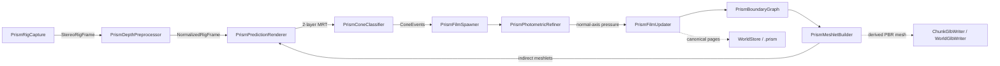

# Cone-PRISM-Q3 code graph

<!-- Generated by Tools/generate_code_graph.py; do not edit manually. -->

Source digest: `4e8ee130084c757568606fd814449cad855f4a40f96613a49d7e07c5bed1a4df`

Scope: 95 files, 1452 symbols, 1111 functions/methods, 81 GPU kernels, 23 event links.

## Runtime data flow

## DAG to code

| Run | Status | Mapped files |
|---|---|---:|
| Q3-01 | done | 7 |
| Q3-02 | done | 7 |
| Q3-03 | done | 4 |
| Q3-04 | done | 3 |
| Q3-05 | done | 4 |
| Q3-06 | done | 3 |
| Q3-07 | done | 3 |
| Q3-08 | done | 2 |
| Q3-09 | done | 5 |
| Q3-10 | done | 4 |
| Q3-11 | done | 5 |
| Q3-12 | done | 7 |
| Q3-13 | done | 27 |
| Q3-14 | in_progress | 4 |
| Q3-15 | pending | 3 |
| Q3-16 | pending | 3 |
| Q3-17 | pending | 1 |
| Q3-18 | pending | 1 |
| Q3-19 | pending | 0 |
| Q3-20 | pending | 5 |
| Q3-21 | pending | 7 |
| Q3-22 | pending | 2 |

## Event links

- `EditorApplication.update` → `PollXAtlasBuilds` ([Editor/RoomScanSetupWizard.cs:2101](../../Editor/RoomScanSetupWizard.cs#L2101))
- `RoomScanPersistence.LoadCompleted` → `ApplyRenderMode` ([Runtime/Core/RoomScanner.cs:383](../../Runtime/Core/RoomScanner.cs#L383))
- `RoomAnchorManager.RoomReady` → `OnRoomAnchorReady` ([Runtime/Core/RoomScanner.cs:392](../../Runtime/Core/RoomScanner.cs#L392))
- `TextureRefinement.StatusChanged` → `statusHandler` ([Runtime/Core/RoomScanner.cs:1107](../../Runtime/Core/RoomScanner.cs#L1107))
- `TextureRefinement.StatusChanged` → `hqStatusHandler` ([Runtime/Core/RoomScanner.cs:1243](../../Runtime/Core/RoomScanner.cs#L1243))
- `RoomUnderstanding.AnchorsChanged` → `OnMrukAnchorsChanged` ([Runtime/Core/RoomScanner.cs:1563](../../Runtime/Core/RoomScanner.cs#L1563))
- `PrismPredictionRenderer.PredictionReady` → `OnPrediction` ([Runtime/Prism/Association/PrismConeClassifier.cs:99](../../Runtime/Prism/Association/PrismConeClassifier.cs#L99))
- `DepthCapture.RawStereoFrameReceived` → `OnRawStereoDepthFrame` ([Runtime/Prism/Capture/PrismRigCapture.cs:91](../../Runtime/Prism/Capture/PrismRigCapture.cs#L91))
- `PrismFilmUpdater.UpdateCompleted` → `OnFilmUpdateCompleted` ([Runtime/Prism/Geometry/PrismBoundaryGraph.cs:139](../../Runtime/Prism/Geometry/PrismBoundaryGraph.cs#L139))
- `PrismBoundaryGraph.BoundariesUpdated` → `OnBoundariesUpdated` ([Runtime/Prism/Geometry/PrismDisplacementTopology.cs:237](../../Runtime/Prism/Geometry/PrismDisplacementTopology.cs#L237))
- `PrismConeClassifier.EventsReady` → `OnConeEvents` ([Runtime/Prism/Geometry/PrismFilmSpawner.cs:87](../../Runtime/Prism/Geometry/PrismFilmSpawner.cs#L87))
- `PrismFilmSpawner.SpawnCompleted` → `OnConeEvents` ([Runtime/Prism/Geometry/PrismFilmUpdater.cs:115](../../Runtime/Prism/Geometry/PrismFilmUpdater.cs#L115))
- `PrismFilmSpawner.FilmsMutated` → `OnFilmsMutated` ([Runtime/Prism/Geometry/PrismMeshletBuilder.cs:99](../../Runtime/Prism/Geometry/PrismMeshletBuilder.cs#L99))
- `PrismDepthPreprocessor.FrameReady` → `OnDepthFrame` ([Runtime/Prism/Geometry/PrismPredictionRenderer.cs:124](../../Runtime/Prism/Geometry/PrismPredictionRenderer.cs#L124))
- `RenderPipelineManager.beginCameraRendering` → `OnBeginCameraRendering` ([Runtime/Prism/Geometry/PrismWorldMeshletRenderer.cs:47](../../Runtime/Prism/Geometry/PrismWorldMeshletRenderer.cs#L47))
- `PrismDepthPreprocessor.FrameReady` → `ExecuteFrame` ([Runtime/Prism/PrismGpuWorkGraph.cs:58](../../Runtime/Prism/PrismGpuWorkGraph.cs#L58))
- `SubmapManager.RolloverRequested` → `OnRolloverRequested` ([Runtime/World/PrismChunkResidencyManager.cs:57](../../Runtime/World/PrismChunkResidencyManager.cs#L57))
- `SubmapManager.ActiveChunkChanged` → `OnActiveChunkChanged` ([Runtime/World/PrismChunkResidencyManager.cs:58](../../Runtime/World/PrismChunkResidencyManager.cs#L58))
- `SubmapManager.PoseGraphRefined` → `OnPoseGraphRefined` ([Runtime/World/PrismChunkResidencyManager.cs:59](../../Runtime/World/PrismChunkResidencyManager.cs#L59))
- `RoomScanner.ScanStarted` → `OnScanStarted` ([Runtime/World/PrismChunkResidencyManager.cs:60](../../Runtime/World/PrismChunkResidencyManager.cs#L60))
- `RoomScanner.ScanStopped` → `OnScanStopped` ([Runtime/World/PrismChunkResidencyManager.cs:61](../../Runtime/World/PrismChunkResidencyManager.cs#L61))
- `RoomScanner.ScanAnchorCreated` → `OnScanAnchorCreated` ([Runtime/World/SubmapManager.cs:267](../../Runtime/World/SubmapManager.cs#L267))
- `RoomScanner.RenderModeChanged` → `OnRenderModeChanged` ([Runtime/World/SubmapManager.cs:268](../../Runtime/World/SubmapManager.cs#L268))

## Files and symbols

### `Editor/RoomScanSetupWizard.cs`

`AreFieldsAssigned` (method, L2389), `AssignCompute` (method, L1637), `BuildXAtlasPlugin` (method, L1824), `CheckAIDetectionAnyMissing` (method, L201), `CheckGSplatAnyMissing` (method, L192), `ConfigurePluginImporter` (method, L2158), `DeepFind` (method, L2412), `DrawAIDetectionOptionalStatus` (method, L200), `DrawAIDetectionShaderStatus` (method, L202), `DrawGSplatOptionalStatus` (method, L191), `DrawGSplatShaderStatus` (method, L193), `DrawVRProjectSection` (method, L209), `EndSection` (method, L2321), `EnsureDebugMenuAssets` (method, L2447), `EnsureOwnedQuestManifest` (method, L482), `EnsureQuestVRManifest` (method, L573), `EnsureRoomScanIdentityTransform` (method, L925), `EnsureVRInput` (method, L1536), `FindByName` (method, L2401), `FindComponentByTypeName` (method, L2378), `FindHostClang` (method, L1971), `FindMsvcCompiler` (method, L2003), `FindNdkClang` (method, L1932), `FindOrCreatePanelSettings` (method, L2494), `FixCleartextTraffic` (method, L716), `FixGameReadyModules` (method, L1257), `GetLanIp` (method, L2519), `GetOrCreateScanMaterial` (method, L1655), `LoadQuestManifestDocuments` (method, L457), `ManifestFeature` (struct, L375), `ManifestHasAllQuestVREntries` (method, L519), `ManifestHasCleartextTraffic` (method, L697), `MarkDirty` (method, L2426), `Open` (method, L84), `PollXAtlasBuilds` (method, L2104), `RefreshAIDetection` (method, L199), `RefreshGSplat` (method, L190), `RefreshVRProject` (method, L208), `RoomScanSetupWizard` (class, L22), `SceneRoots` (method, L2423), `SetAttribute` (method, L507), `SetBool` (method, L1573), `SetPanelRenderModeWorldSpace` (method, L2435), `SetupAIDetectionIfAvailable` (method, L204), `SetupEverything` (method, L2225), `SetupGSplatIfAvailable` (method, L195), `StartAsyncBuilds` (method, L2047), `WireAIDetectionComponents` (method, L203), `WireComponent` (method, L1733), `WireGSplatComponents` (method, L194)

### `Runtime/Core/RoomScanner.cs`

`AddExclusionZone` (method, L1072), `ApplyEnhancedMesh` (method, L1452), `ApplyHQTexture` (method, L1579), `ApplyRefinedAtlas` (method, L1473), `ApplyRefinedTexture` (method, L1521), `ApplyRenderMode` (method, L1934), `Awake` (method, L357), `BuildCoverage` (method, L1771), `BuildProgress` (method, L1797), `CacheComponents` (method, L406), `ClearAllDataAsync` (method, L857), `ClearScan` (method, L840), `CompleteRoomStartup` (method, L477), `ConfigurePrismChunk` (method, L713), `CreateScanAnchorAsync` (method, L667), `CycleRenderMode` (method, L927), `DeleteActiveArtifact` (method, L2018), `DeleteEnhancedMesh` (method, L2060), `DeserializeRefinedMesh` (method, L1418), `EnsureRefinedMesh` (method, L1660), `EnsureRefinedRenderer` (method, L1677), `EnsureUnwrappedAsync` (method, L1591), `ExportPointCloudAsync` (method, L1044), `FreezeInView` (method, L978), `GetActiveCameraProvider` (method, L2137), `IsModeAvailable` (method, L959), `LoadDownloadedSplat` (method, L2092), `LoadPackageAsync` (method, L1024), `LoadRefinedOnlyAsync` (method, L1035), `OnDisable` (method, L484), `OnMrukAnchorsChanged` (method, L1573), `OnRoomAnchorReady` (method, L397), `PausePrismForResidency` (method, L702), `PopulateSceneObjectRegistry` (method, L1550), `PreparePrismPipeline` (method, L726), `ProvideColorFrame` (method, L1868), `ReconstructUnwrapFromResult` (method, L1636), `ReleaseScanResources` (method, L817), `RemoveExclusionZone` (method, L1081), `ResumePrismAfterResidency` (method, L708), `RoomScanner` (class, L94), `RunServerTrainingAsync` (method, L2103), `SaveScanAsync` (method, L1005), `ScanCoverage` (struct, L52), `ScanPhase` (enum, L37), `ScanProgress` (struct, L77), `ScanRenderMode` (enum, L16), `SerializeRefinedMesh` (method, L1391), `SetCameraProvider` (method, L1064), `SetRefinedWorldFromLocal` (method, L1703), `SetRenderMode` (method, L915), `SetSafeShaderDefaults` (method, L1856), `SetSceneObjectRegistry` (method, L1540), `SetupHeadExclusion` (method, L1751), `Start` (method, L365), `StartHQRefinement` (method, L1219), `StartMeshEnhancement` (method, L1328), `StartPrismCapture` (method, L766), `StartScanningAsync` (method, L552), `StartServerTraining` (method, L1049), `StartTextureRefinement` (method, L1095), `StopPrismPipeline` (method, L775), `StopScanning` (method, L685), `SubscribeToAnchorsChanged` (method, L1559), `ToggleDebugMenu` (method, L1056), `ToggleScanning` (method, L802), `TryGetCameraIntrinsics` (method, L1715), `UnfreezeInView` (method, L991), `UnsubscribeFromAnchorsChanged` (method, L1566), `Update` (method, L494), `UpdatePlateauDetection` (method, L1823)

### `Runtime/Export/ChunkGlbExporter.cs`

`ChunkGlbExportFailure` (enum, L10), `ChunkGlbExportResult` (class, L21), `ChunkGlbExporter` (class, L36), `ClassifyPromotionFailure` (method, L338), `ExportRefinedAsync` (method, L60), `Failed` (method, L352), `Generate` (method, L148), `GeneratedFile` (class, L44), `PromotionResult` (class, L54), `SourceSet` (class, L38), `Stage` (method, L244), `TryDeleteDirectory` (method, L359), `TryFindCurrentArtifact` (method, L288), `TryResolveSources` (method, L255), `ValidatePreflight` (method, L317)

### `Runtime/Export/ChunkGlbWriter.cs`

`Align4` (method, L588), `Align4` (method, L590), `AppendAccessor` (method, L524), `AppendBufferView` (method, L545), `BuildJson` (method, L456), `BuildTangentAccumulators` (method, L315), `ChunkGlbExportData` (class, L11), `ChunkGlbWriteOptions` (class, L29), `ChunkGlbWriteResult` (class, L35), `ChunkGlbWriter` (class, L72), `ConvertVector` (method, L442), `EscapeJson` (method, L555), `FallbackTangent` (method, L445), `IsFinite` (method, L591), `IsFinite` (method, L594), `IsFinite` (method, L597), `JsonFloat` (method, L581), `Layout` (class, L600), `PadBinary` (method, L430), `TryCreate` (method, L618), `TryValidateTexture` (method, L296), `TryWrite` (method, L83), `Validate` (method, L231), `WriteIndices` (method, L417), `WriteNormals` (method, L365), `WritePositions` (method, L351), `WriteTangents` (method, L379), `WriteTexCoords` (method, L404)

### `Runtime/Export/DeterministicPngWriter.cs`

`Begin` (method, L279), `BuildTable` (method, L289), `Crc32` (class, L275), `DeterministicPngWriter` (class, L14), `End` (method, L281), `Fill` (method, L248), `FilteredRgbaSource` (class, L233), `TryGetEncodedLength` (method, L22), `TryWriteRgba8` (method, L51), `Update` (method, L282), `UpdateAdler` (method, L200), `ValidateDimensions` (method, L159), `WriteAndCrc` (method, L193), `WriteBigEndian` (method, L218), `WriteBigEndian` (method, L225), `WriteChunk` (method, L180)

### `Runtime/Export/GlbCompressionNegotiation.cs`

`Failure` (method, L125), `GlbCompressionNegotiator` (class, L46), `GlbCompressionRequest` (class, L12), `GlbCompressionRequirement` (enum, L6), `GlbCompressionRuntimeCapabilities` (class, L27), `GlbCompressionSelection` (class, L35), `Negotiate` (method, L51), `Resolve` (method, L103)

### `Runtime/Export/GlbExportController.cs`

`CopyImmutable` (method, L211), `End` (method, L200), `ExportActiveChunkAsync` (method, L55), `ExportWorldAsync` (method, L102), `Fail` (method, L193), `GlbExportController` (class, L21), `GlbUserExportResult` (class, L11), `MaterialOptions` (method, L179), `OnDestroy` (method, L48), `OnModuleInitialize` (method, L39), `SetStatus` (method, L205), `Succeed` (method, L186), `TryBegin` (method, L147)

### `Runtime/Export/WorldGlbExporter.cs`

`AppendMatrix` (method, L385), `BuildManifestJson` (method, L321), `EnsureFrozen` (method, L279), `EnsureWorldStillFrozen` (method, L288), `ExportAsync` (method, L65), `ExportedChunk` (class, L55), `Failed` (method, L418), `FrozenChunk` (class, L47), `ToLowerHex` (method, L410), `TryDeleteDirectory` (method, L430), `TryDeleteFile` (method, L423), `ValidatePreflight` (method, L215), `WorldGlbExportOptions` (class, L14), `WorldGlbExportResult` (class, L21), `WorldGlbExporter` (class, L43), `WriteDurableUtf8` (method, L401)

### `Runtime/Export/WorldGlbWriter.cs`

`Align4` (method, L502), `Align4` (method, L504), `AppendAccessor` (method, L471), `AppendBufferView` (method, L492), `AppendMatrix` (method, L454), `BuildJson` (method, L316), `ChunkName` (method, L443), `IsFinite` (method, L505), `IsFinite` (method, L507), `IsFinite` (method, L509), `QuaternionLengthSquared` (method, L511), `ReceiptRangeIsValid` (method, L313), `SourceLayout` (class, L56), `ToGltfMatrix` (method, L447), `TryValidateChunkGlb` (method, L256), `TryWrite` (method, L63), `Validate` (method, L193), `WorldGlbChunkInput` (class, L17), `WorldGlbWriteOptions` (class, L25), `WorldGlbWriteResult` (class, L35), `WorldGlbWriter` (class, L50)

### `Runtime/Prism/Association/ConeEventFrame.cs`

`CommitGpuWrite` (method, L158), `CommitGpuWrite` (method, L77), `ConeEventBufferRing` (class, L93), `ConeEventClass` (enum, L8), `ConeEventFrameLease` (class, L44), `ConeEventGpu` (struct, L21), `Destroy` (method, L214), `Dispose` (method, L186), `Dispose` (method, L79), `EnsureBuffers` (method, L197), `FencePassed` (method, L229), `Get` (method, L147), `NextGeneration` (method, L236), `Release` (method, L177), `Retain` (method, L171), `Retain` (method, L70), `Slot` (class, L96), `TryBegin` (method, L119)

### `Runtime/Prism/Association/PrismConeClassifier.cs`

`BindCanonicalBoundaries` (method, L180), `BindTextures` (method, L192), `CeilDiv` (method, L225), `OnDestroy` (method, L116), `OnPrediction` (method, L118), `PrismConeClassifier` (class, L13), `StartClassifying` (method, L78), `StopClassifying` (method, L104), `TryAcquireLatest` (method, L67), `TryClassifyFrame` (method, L121)

### `Runtime/Prism/Calibration/ConeLutResources.cs`

`Acquire` (method, L118), `Build` (method, L157), `CeilDiv` (method, L244), `ConeLutLease` (class, L30), `ConeProjectionLut` (class, L11), `Create` (method, L108), `CreateTexture` (method, L198), `Destroy` (method, L187), `DestroyProjection` (method, L224), `DestroyTexture` (method, L233), `Dispose` (method, L52), `Get` (method, L148), `Get` (method, L43), `Release` (method, L139), `Retain` (method, L132), `Retain` (method, L45), `Retire` (method, L124), `RigConeLutSet` (class, L65)

### `Runtime/Prism/Calibration/ConeProjectionMath.cs`

`ConeProjectionMath` (class, L31), `MetricConeFootprint` (struct, L10), `RayAtImagePoint` (method, L108), `TryReproject` (method, L93), `TrySurfaceFootprint` (method, L38), `TryWorldToPixel` (method, L69)

### `Runtime/Prism/Calibration/RigCalibration.cs`

`Get` (method, L73), `IsCompatible` (method, L82), `Projection` (method, L117), `RigCalibration` (class, L45), `RigLensModel` (enum, L13), `RigProjection` (enum, L6), `RigProjectionCalibration` (struct, L19), `TryCreate` (method, L94)

### `Runtime/Prism/Capture/GpuTextureRing.cs`

`CopyOnGpu` (method, L315), `DestroySlot` (method, L360), `Dispose` (method, L204), `Dispose` (method, L50), `EnsureCompatibleTarget` (method, L242), `FencePassed` (method, L228), `GetTexture` (method, L180), `GetVolumeDepth` (method, L287), `GpuTextureCopyMode` (enum, L8), `GpuTextureLease` (class, L18), `GpuTextureRing` (class, L65), `IsSupportedDimension` (method, L296), `NextGeneration` (method, L358), `Release` (method, L192), `Retain` (method, L186), `Retain` (method, L42), `Slot` (class, L67), `TargetDimension` (method, L305), `TargetFormat` (method, L310), `TryCopy` (method, L112), `ValidateLease` (method, L218)

### `Runtime/Prism/Capture/PrismRigCapture.cs`

`CaptureRgb` (method, L170), `EnsureRuntimeObjects` (method, L155), `FreezeSessionIntrinsics` (method, L294), `LateUpdate` (method, L118), `OnDestroy` (method, L142), `OnRawStereoDepthFrame` (method, L223), `PrismRigCapture` (class, L13), `PublishAvailableFrames` (method, L284), `ReportLocalRejection` (method, L376), `ResolveEye` (method, L320), `StartCapture` (method, L72), `StopCapture` (method, L97), `TryAcquireLatest` (method, L61)

### `Runtime/Prism/Capture/RawStereoDepthFrame.cs`

`IsFinite` (method, L40), `IsFinite` (method, L48), `RawStereoDepthFrame` (struct, L10)

### `Runtime/Prism/Capture/RigCalibrationMath.cs`

`Add` (method, L187), `Add` (method, L190), `Add` (method, L193), `CombineSignatures` (method, L76), `ConeRayAtPixel` (method, L89), `ConeRayReference` (struct, L10), `FromDepthFov` (method, L55), `FromPassthrough` (method, L31), `IntrinsicsToFov` (method, L158), `ProjectionDepth01FromViewZ` (method, L119), `RangeFromProjectionDepth01` (method, L141), `RayAtImagePoint` (method, L150), `RigCalibrationMath` (class, L8), `Signature` (method, L168), `ViewZFromProjectionDepth01` (method, L130)

### `Runtime/Prism/Capture/RigCaptureContracts.cs`

`AbsoluteDeltaNanoseconds` (method, L91), `DestinationFromSource` (method, L388), `Dispose` (method, L371), `Equals` (method, L105), `Equals` (method, L150), `Equals` (method, L156), `Equals` (method, L99), `EquivalentRange` (method, L232), `FiniteRasterFar` (method, L246), `FromUnixDateTime` (method, L84), `FromViews` (method, L269), `GetHashCode` (method, L107), `GetHashCode` (method, L158), `GpuImageView` (struct, L165), `IsFinite` (method, L211), `IsFinite` (method, L214), `IsValid` (method, L225), `IsValidRange` (method, L227), `Retain` (method, L360), `RigClockDomain` (enum, L29), `RigDepthContract` (class, L223), `RigDepthEncoding` (enum, L20), `RigExtrinsicsSnapshot` (struct, L250), `RigEye` (enum, L7), `RigFrameRejectionReason` (enum, L39), `RigIntrinsics` (struct, L117), `RigPairingHealth` (struct, L284), `RigPoseMath` (class, L385), `RigStreamKind` (enum, L12), `RigTimestamp` (struct, L64), `StereoRigFrameLease` (class, L304), `ToString` (method, L111), `ViewMatches` (method, L238)

### `Runtime/Prism/Capture/RigClockMapper.cs`

`CreateRuntime` (method, L23), `RigClockMapper` (class, L10), `SecondsToNanoseconds` (method, L92), `TryCaptureAnchor` (method, L37), `TryMapXrTimestamp` (method, L68)

### `Runtime/Prism/Capture/RigFrameSynchronizer.cs`

`AbsoluteDelta` (method, L343), `AddDepth` (method, L153), `AddRgb` (method, L134), `Dispose` (method, L241), `Dispose` (method, L26), `Dispose` (method, L68), `DropOlderCalibration` (method, L302), `DropProvablyStaleRgbOrDepth` (method, L286), `FindNearestDepth` (method, L263), `Flush` (method, L234), `Midpoint` (method, L341), `MillisecondsToNanoseconds` (method, L338), `Reject` (method, L331), `RgbRigSample` (class, L7), `RigCaptureDiagnosticSnapshot` (struct, L75), `RigFrameSynchronizer` (class, L100), `StereoDepthRigSample` (class, L33), `TakeLease` (method, L19), `TakeLease` (method, L61), `TryDequeue` (method, L173), `ValidateIncoming` (method, L243)

### `Runtime/Prism/Geometry/ContactBoundaryPool.cs`

`ContactBoundaryFlags` (enum, L9), `ContactBoundaryHeaderGpu` (struct, L21), `ContactBoundaryPool` (class, L50), `Dispose` (method, L81), `NextPowerOfTwo` (method, L93)

### `Runtime/Prism/Geometry/ContactDisplacementPool.cs`

`ContactDisplacementPool` (class, L112), `ContactTopologyEvidenceGpu` (struct, L54), `DisplacementCellGpu` (struct, L39), `DisplacementPageFlags` (enum, L9), `DisplacementPageHeaderGpu` (struct, L19), `Dispose` (method, L161), `FilmMergeHashEntryGpu` (struct, L95), `TopologyMergeRecordGpu` (struct, L80), `TopologySplitRecordGpu` (struct, L69)

### `Runtime/Prism/Geometry/ContactFilmPool.cs`

`ContactFilmFlags` (enum, L9), `ContactFilmHeaderGpu` (struct, L24), `ContactFilmPool` (class, L58), `Dispose` (method, L82)

### `Runtime/Prism/Geometry/ContactMeshletBuffers.cs`

`Allocate` (method, L276), `ContactMeshletBuffers` (class, L204), `ContactMeshletDescriptorGpu` (struct, L27), `ContactMeshletGenerationBuffers` (class, L64), `ContactMeshletVertexGpu` (struct, L9), `ContactMeshletViewBuffers` (class, L158), `ContactMeshletViewLodGpu` (struct, L49), `CreateViewBuffers` (method, L251), `Dispose` (method, L133), `Dispose` (method, L186), `Dispose` (method, L270), `DisposeGenerations` (method, L290), `EnsureCapacity` (method, L230), `MarkPublishedRead` (method, L267), `MarkRead` (method, L127), `Publish` (method, L257), `SetChunkTransform` (method, L254), `TryBeginBuild` (method, L245)

### `Runtime/Prism/Geometry/PredictionFrame.cs`

`ArrayDescriptor` (method, L261), `CommitGpuWrite` (method, L133), `CommitGpuWrite` (method, L47), `Compatible` (method, L273), `CompatibleDepth` (method, L278), `CompatibleHiZ` (method, L283), `CreateColor` (method, L214), `CreateDepth` (method, L229), `CreateHiZ` (method, L244), `DestroySlot` (method, L296), `DestroyTexture` (method, L324), `Dispose` (method, L161), `Dispose` (method, L49), `EnsureTextures` (method, L172), `FencePassed` (method, L289), `Get` (method, L122), `NextGeneration` (method, L332), `PredictionFrameLease` (class, L8), `PredictionTargetRing` (class, L63), `Release` (method, L152), `Retain` (method, L146), `Retain` (method, L39), `Slot` (class, L66), `TryBegin` (method, L95)

### `Runtime/Prism/Geometry/PrismBoundaryGraph.cs`

`AllocateFrameBuffers` (method, L284), `BindFrame` (method, L238), `BindPersistent` (method, L300), `CeilDiv` (method, L352), `ConfigureFrame` (method, L222), `DispatchBoundaries` (method, L189), `DisposeFrameBuffers` (method, L331), `Intrinsics` (method, L345), `OnDestroy` (method, L177), `OnFilmUpdateCompleted` (method, L186), `PoseMatrix` (method, L349), `PrismBoundaryGraph` (class, L15), `RebuildCanonicalIndex` (method, L146), `SetChunkFrame` (method, L98), `StartTracking` (method, L101), `StopTracking` (method, L169)

### `Runtime/Prism/Geometry/PrismDisplacementTopology.cs`

`AllocateTransientBuffers` (method, L336), `BindPersistent` (method, L384), `BindTopology` (method, L440), `CeilDiv` (method, L589), `ConfigureFrame` (method, L309), `DispatchDisplacement` (method, L261), `DisposeTransientBuffers` (method, L548), `NextPowerOfTwo` (method, L592), `OnBoundariesUpdated` (method, L258), `OnDestroy` (method, L250), `PoseMatrix` (method, L586), `PrismDisplacementTopology` (class, L15), `RunTopologyAdaptation` (method, L520), `SetChunkFrame` (method, L169), `StartUpdating` (method, L172), `StopUpdating` (method, L242)

### `Runtime/Prism/Geometry/PrismFilmSpawner.cs`

`CeilDiv` (method, L219), `DispatchSpawn` (method, L111), `DisposeTileBuffers` (method, L208), `EnsureTileBuffers` (method, L194), `NotifyFilmsMutated` (method, L58), `OnConeEvents` (method, L108), `OnDestroy` (method, L100), `PoseMatrix` (method, L191), `PrismFilmSpawner` (class, L13), `SetChunkFrame` (method, L60), `StartSpawning` (method, L66), `StopSpawning` (method, L92)

### `Runtime/Prism/Geometry/PrismFilmUpdater.cs`

`Allocate` (method, L208), `BindPersistent` (method, L227), `CeilDiv` (method, L278), `DispatchUpdate` (method, L137), `DisposeBuffers` (method, L260), `OnConeEvents` (method, L134), `OnDestroy` (method, L128), `PoseMatrix` (method, L275), `PrismFilmUpdater` (class, L15), `SetChunkFrame` (method, L77), `StartUpdating` (method, L80), `StopUpdating` (method, L120)

### `Runtime/Prism/Geometry/PrismMeshletBuilder.cs`

`Bind` (method, L164), `BuildCurrent` (method, L129), `LateUpdate` (method, L117), `OnDestroy` (method, L112), `OnFilmsMutated` (method, L123), `PrismMeshletBuilder` (class, L14), `StartBuilding` (method, L66), `StopBuilding` (method, L104), `TryBuild` (method, L135)

### `Runtime/Prism/Geometry/PrismPredictionRenderer.cs`

`BindMeshlets` (method, L261), `BuildClipFromWorld` (method, L376), `BuildHiZ` (method, L331), `BuildView` (method, L278), `CeilDiv` (method, L364), `EnsureViewBuffers` (method, L269), `OnDepthFrame` (method, L156), `OnDestroy` (method, L143), `PrismPredictionRenderer` (class, L14), `SetMrt` (method, L367), `StartRendering` (method, L86), `StopRendering` (method, L129), `TryAcquireLatest` (method, L75), `TryRenderFrame` (method, L159)

### `Runtime/Prism/Geometry/PrismWorldMeshletRenderer.cs`

`Draw` (method, L117), `LateUpdate` (method, L81), `OnBeginCameraRendering` (method, L95), `OnDestroy` (method, L146), `OnDisable` (method, L49), `OnEnable` (method, L36), `PrismWorldMeshletRenderer` (class, L15), `RegisterResident` (method, L58), `RemoveResident` (method, L68), `Retire` (method, L140), `SetActive` (method, L52), `SetResidentTransform` (method, L74)

### `Runtime/Prism/Preprocessing/NormalizedDepthFrame.cs`

`CommitGpuWrite` (method, L160), `CommitGpuWrite` (method, L63), `Compatible` (method, L289), `CreateArrayTexture` (method, L240), `DestroySlot` (method, L297), `DestroyTexture` (method, L313), `Dispose` (method, L195), `Dispose` (method, L65), `EnsureTextures` (method, L209), `FencePassed` (method, L281), `GetBoundaryEvidence` (method, L157), `GetConsensusDepth` (method, L151), `GetFlags` (method, L148), `GetLocalNormal` (method, L154), `GetMetricDepth` (method, L145), `NextGeneration` (method, L324), `NormalizedDepthFlags` (enum, L9), `NormalizedDepthRing` (class, L82), `NormalizedRigFrameLease` (class, L22), `Release` (method, L183), `Retain` (method, L177), `Retain` (method, L55), `Slot` (class, L85), `TryBegin` (method, L111), `Validate` (method, L268)

### `Runtime/Prism/Preprocessing/PrismDepthPreprocessor.cs`

`BindSharedTextures` (method, L364), `CeilDiv` (method, L305), `DepthPreprocessDiagnosticSnapshot` (struct, L7), `DispatchConsensusNormalsAndBoundaries` (method, L308), `EnsureCalibration` (method, L250), `EnsureStatisticsBuffers` (method, L379), `FillIntrinsics` (method, L387), `MarkWorkGraphSubmitted` (method, L290), `OnDestroy` (method, L166), `PoseMatrix` (method, L396), `PrismDepthPreprocessor` (class, L30), `ProcessRigFrame` (method, L188), `StartProcessing` (method, L112), `StopProcessing` (method, L148), `TryAcquireLatest` (method, L101), `Update` (method, L175), `WorkGraphFencePassed` (method, L278)

### `Runtime/Prism/PrismGpuWorkGraph.cs`

`ExecuteFrame` (method, L71), `OnDestroy` (method, L69), `PrismGpuWorkGraph` (class, L14), `StartGraph` (method, L33), `StopGraph` (method, L61)

### `Runtime/Prism/Refinement/PrismPhotometricRefiner.cs`

`BindPersistent` (method, L373), `CaptureKeyframeAndUpdateFilmViews` (method, L419), `CeilDiv` (method, L507), `ConfigureFrame` (method, L316), `DispatchPhotometricPressure` (method, L194), `DisposeBuffers` (method, L467), `EnsureBuffers` (method, L236), `Intrinsics` (method, L497), `NextGeneration` (method, L504), `OnDestroy` (method, L192), `PhotometricPressureGpu` (struct, L10), `PoseMatrix` (method, L501), `PrismPhotometricRefiner` (class, L49), `ResetHistoryState` (method, L299), `SetChunkFrame` (method, L151), `ShouldCaptureKeyframe` (method, L408), `StartRefining` (method, L161), `StopRefining` (method, L182), `TemporalRgbViewGpu` (struct, L28), `UploadView` (method, L446)

### `Runtime/Resources/Prism/ChunkStage.compute`

`ClearFilmRemap` (gpu_function, L173), `ClearPageRemap` (gpu_function, L245), `ContactBoundaryHeader` (struct, L27), `ContactFilmHeader` (struct, L13), `ContactMeshletDescriptor` (struct, L68), `ContactMeshletVertex` (struct, L60), `ContactTopologyEvidence` (struct, L52), `CopyBasePages` (gpu_function, L299), `CopyMicroPages` (gpu_function, L328), `DisplacementCell` (struct, L45), `DisplacementPageHeader` (struct, L36), `FinalizeChunkStage` (gpu_function, L438), `IndexBasePages` (gpu_function, L256), `IndexMicroPages` (gpu_function, L277), `PatchFilmDisplacement` (gpu_function, L373), `PrepareChunkStage` (gpu_function, L140), `StageBoundaries` (gpu_function, L210), `StageFilms` (gpu_function, L180), `StageMeshlets` (gpu_function, L388), `ClearFilmRemap` (gpu_kernel, L2), `ClearPageRemap` (gpu_kernel, L5), `CopyBasePages` (gpu_kernel, L8), `CopyMicroPages` (gpu_kernel, L9), `FinalizeChunkStage` (gpu_kernel, L12), `IndexBasePages` (gpu_kernel, L6), `IndexMicroPages` (gpu_kernel, L7), `PatchFilmDisplacement` (gpu_kernel, L10), `PrepareChunkStage` (gpu_kernel, L1), `StageBoundaries` (gpu_kernel, L4), `StageFilms` (gpu_kernel, L3), `StageMeshlets` (gpu_kernel, L11)

### `Runtime/Resources/Prism/ConeClassify.compute`

`BoundaryCubic` (gpu_function, L136), `BoundaryDistance` (gpu_function, L145), `BoundaryHashEntry` (struct, L47), `BoundaryHashKey` (gpu_function, L125), `BuildClassDispatchArguments` (gpu_function, L358), `ClassifyConeEvents` (gpu_function, L221), `ClearClassCounters` (gpu_function, L211), `ConeEvent` (struct, L59), `ContactBoundaryHeader` (struct, L25), `HasCanonicalBoundary` (gpu_function, L163), `LoadRay` (gpu_function, L107), `LoadRayDx` (gpu_function, L113), `LoadRayDy` (gpu_function, L119), `PublishEvent` (gpu_function, L201), `BuildClassDispatchArguments` (gpu_kernel, L3), `ClassifyConeEvents` (gpu_kernel, L2), `ClearClassCounters` (gpu_kernel, L1)

### `Runtime/Resources/Prism/ConeLut.compute`

`BuildConeLut` (gpu_function, L18), `LocalRay` (gpu_function, L10), `BuildConeLut` (gpu_kernel, L1)

### `Runtime/Resources/Prism/ConeMath.hlsl`

`ConeProjectionDepthToViewZ` (gpu_function, L3), `ConeSurfaceFootprint` (gpu_function, L15)

### `Runtime/Resources/Prism/ContactBoundaryUpdate.compute`

`AccumulateBoundaryAbsence` (gpu_function, L662), `AccumulateBoundaryEvents` (gpu_function, L559), `AtomicAddScaled` (gpu_function, L251), `BoundaryHashEntry` (struct, L81), `BuildBoundarySolveArguments` (gpu_function, L699), `ClearBoundaryFrame` (gpu_function, L551), `ClearLoadedBoundaryHash` (gpu_function, L512), `ConeEvent` (struct, L9), `ContactBoundaryHeader` (struct, L59), `ContactFilmHeader` (struct, L31), `Cubic` (gpu_function, L226), `DistanceToCurve` (gpu_function, L233), `FindAdjacentFilm` (gpu_function, L466), `FindBoundary` (gpu_function, L272), `HashKey` (gpu_function, L143), `Height` (gpu_function, L190), `InitializeBoundaryState` (gpu_function, L490), `LoadDepthRay` (gpu_function, L154), `LoadRgb` (gpu_function, L160), `Luminance` (gpu_function, L167), `MarkDirty` (gpu_function, L259), `PointToUv` (gpu_function, L218), `RefineUvWithRgb` (gpu_function, L391), `RehashLoadedBoundaries` (gpu_function, L518), `ResolveBoundary` (gpu_function, L294), `SobelMagnitude` (gpu_function, L172), `SolveDirtyBoundaries` (gpu_function, L706), `SurfaceNormal` (gpu_function, L205), `SurfacePoint` (gpu_function, L197), `ViewBin` (gpu_function, L380), `AccumulateBoundaryAbsence` (gpu_kernel, L6), `AccumulateBoundaryEvents` (gpu_kernel, L5), `BuildBoundarySolveArguments` (gpu_kernel, L7), `ClearBoundaryFrame` (gpu_kernel, L4), `ClearLoadedBoundaryHash` (gpu_kernel, L2), `InitializeBoundaryState` (gpu_kernel, L1), `RehashLoadedBoundaries` (gpu_kernel, L3), `SolveDirtyBoundaries` (gpu_kernel, L8)

### `Runtime/Resources/Prism/ContactFilmPreview.shader`

`ContactMeshletVertex` (struct, L19), `Frag` (gpu_function, L54), `Varyings` (struct, L32), `Vert` (gpu_function, L40)

### `Runtime/Resources/Prism/ContactFilmSpawn.compute`

`BuildSpawnTileDispatchArguments` (gpu_function, L208), `ClearSpawnTileState` (gpu_function, L160), `CompactSpawnTiles` (gpu_function, L173), `Compatible` (gpu_function, L132), `ConeEvent` (struct, L8), `ContactFilmHeader` (struct, L30), `IsSpawnCandidate` (gpu_function, L112), `LoadRay` (gpu_function, L95), `SafeNormalize` (gpu_function, L101), `SolveSymmetric3x3` (gpu_function, L143), `SpawnContactFilms` (gpu_function, L215), `BuildSpawnTileDispatchArguments` (gpu_kernel, L3), `ClearSpawnTileState` (gpu_kernel, L1), `CompactSpawnTiles` (gpu_kernel, L2), `SpawnContactFilms` (gpu_kernel, L4)

### `Runtime/Resources/Prism/ContactFilmUpdate.compute`

`AccumulateBehindEvidence` (gpu_function, L340), `AccumulateMatchedFilms` (gpu_function, L202), `AccumulatePhotometricPressure` (gpu_function, L383), `AtomicAddScaled` (gpu_function, L171), `BuildFilmSolveArguments` (gpu_function, L457), `CholeskySolve` (gpu_function, L464), `ClearFilmUpdateFrame` (gpu_function, L195), `ConeEvent` (struct, L11), `ContactFilmHeader` (struct, L33), `InformationG` (gpu_function, L142), `InformationH` (gpu_function, L119), `InitializeFilmUpdateState` (gpu_function, L178), `LoadRay` (gpu_function, L107), `PhotometricPressure` (struct, L61), `SetInformationG` (gpu_function, L153), `SetInformationH` (gpu_function, L130), `SolveDirtyFilms` (gpu_function, L507), `UpperIndex` (gpu_function, L113), `AccumulateBehindEvidence` (gpu_kernel, L4), `AccumulateMatchedFilms` (gpu_kernel, L3), `AccumulatePhotometricPressure` (gpu_kernel, L5), `BuildFilmSolveArguments` (gpu_kernel, L6), `ClearFilmUpdateFrame` (gpu_kernel, L2), `InitializeFilmUpdateState` (gpu_kernel, L1), `SolveDirtyFilms` (gpu_kernel, L7)

### `Runtime/Resources/Prism/DepthConsensusNormalBoundary.compute`

`BinCenter` (gpu_function, L65), `BoundaryEvidence` (gpu_function, L354), `ClearResidualHistogram` (gpu_function, L105), `DepthConsensus` (gpu_function, L112), `DepthPlaneFit` (gpu_function, L254), `InDepthBounds` (gpu_function, L75), `InitializeRangeSigma` (gpu_function, L97), `LoadRay` (gpu_function, L43), `LoadRgb` (gpu_function, L50), `LocallyStableDepth` (gpu_function, L80), `RangeBin` (gpu_function, L55), `RgbLuminanceAt` (gpu_function, L347), `SolveRangeSigma` (gpu_function, L189), `SolveSymmetric3x3` (gpu_function, L236), `if` (gpu_function, L169), `BoundaryEvidence` (gpu_kernel, L6), `ClearResidualHistogram` (gpu_kernel, L2), `DepthConsensus` (gpu_kernel, L3), `DepthPlaneFit` (gpu_kernel, L5), `InitializeRangeSigma` (gpu_kernel, L1), `SolveRangeSigma` (gpu_kernel, L4)

### `Runtime/Resources/Prism/DepthNormalize.compute`

`NormalizeStereoDepth` (gpu_function, L18), `NormalizeStereoDepth` (gpu_kernel, L1)

### `Runtime/Resources/Prism/DisplacementTopology.compute`

`AccumulateDisplacement` (gpu_function, L421), `AllocateBasePages` (gpu_function, L334), `AllocateMicrotiles` (gpu_function, L579), `AtomicAddScaled` (gpu_function, L176), `BuildDisplacementArguments` (gpu_function, L383), `CellForPage` (gpu_function, L231), `ClearDisplacementFrame` (gpu_function, L321), `ConeEvent` (struct, L11), `ContactFilmHeader` (struct, L33), `ContactTopologyEvidence` (struct, L90), `DisplacementCell` (struct, L78), `DisplacementPageHeader` (struct, L61), `EmptyCell` (gpu_function, L184), `Height` (gpu_function, L169), `InitializeBasePages` (gpu_function, L400), `InitializeDisplacementState` (gpu_function, L303), `InitializeMicroPages` (gpu_function, L669), `IsMicroCell` (gpu_function, L192), `LoadCell` (gpu_function, L194), `LoadChild` (gpu_function, L211), `LoadRay` (gpu_function, L163), `MarkCellDirty` (gpu_function, L277), `MarkTopologyDirty` (gpu_function, L292), `PageHeaderIndex` (gpu_function, L226), `ResolveLeaf` (gpu_function, L238), `SolveDirtyDisplacement` (gpu_function, L509), `SolveTopologyEvidence` (gpu_function, L709), `StoreCell` (gpu_function, L203), `StoreChild` (gpu_function, L218), `AccumulateDisplacement` (gpu_kernel, L6), `AllocateBasePages` (gpu_kernel, L3), `AllocateMicrotiles` (gpu_kernel, L8), `BuildDisplacementArguments` (gpu_kernel, L4), `ClearDisplacementFrame` (gpu_kernel, L1), `InitializeBasePages` (gpu_kernel, L5), `InitializeDisplacementState` (gpu_kernel, L2), `InitializeMicroPages` (gpu_kernel, L9), `SolveDirtyDisplacement` (gpu_kernel, L7), `SolveTopologyEvidence` (gpu_kernel, L10)

### `Runtime/Resources/Prism/HiZRangePyramid.compute`

`CopyHiZLevelZero` (gpu_function, L9), `ReduceHiZLevel` (gpu_function, L19), `CopyHiZLevelZero` (gpu_kernel, L1), `ReduceHiZLevel` (gpu_kernel, L2)

### `Runtime/Resources/Prism/MeshletBuild.compute`

`BoundaryCubic` (gpu_function, L319), `BoundaryHashEntry` (struct, L89), `BoundaryHashKey` (gpu_function, L308), `BuildAdaptiveFilmMeshlets` (gpu_function, L492), `BuildMeshDispatchArguments` (gpu_function, L485), `CellTouchesPersistentBoundary` (gpu_function, L376), `ChooseSubdivision` (gpu_function, L443), `ClearMeshletBuild` (gpu_function, L469), `ClosestBoundaryPoint` (gpu_function, L328), `ContactBoundaryHeader` (struct, L67), `ContactFilmHeader` (struct, L5), `ContactMeshletDescriptor` (struct, L48), `ContactMeshletVertex` (struct, L33), `DisplacementCell` (struct, L115), `DisplacementMetrics` (gpu_function, L228), `DisplacementPageHeader` (struct, L98), `FinalizeMeshletDrawArguments` (gpu_function, L626), `Height` (gpu_function, L390), `LoadDisplacementCell` (gpu_function, L171), `LoadDisplacementChild` (gpu_function, L180), `Reserve` (gpu_function, L423), `ResolveDisplacementPage` (gpu_function, L187), `SampleDisplacement` (gpu_function, L280), `SurfaceNormal` (gpu_function, L398), `BuildAdaptiveFilmMeshlets` (gpu_kernel, L3), `BuildMeshDispatchArguments` (gpu_kernel, L2), `ClearMeshletBuild` (gpu_kernel, L1), `FinalizeMeshletDrawArguments` (gpu_kernel, L4)

### `Runtime/Resources/Prism/MeshletViewCull.compute`

`ClearMeshletView` (gpu_function, L148), `ContactMeshletDescriptor` (struct, L4), `ContactMeshletViewLod` (struct, L23), `CullMeshletView` (gpu_function, L158), `FinalizeMeshletView` (gpu_function, L241), `OccludedByHiZ` (gpu_function, L97), `ReserveVisibleIndices` (gpu_function, L57), `SelectAppearanceMip` (gpu_function, L138), `SelectGeometrySegments` (gpu_function, L117), `SphereInFrustum` (gpu_function, L78), `ClearMeshletView` (gpu_kernel, L1), `CullMeshletView` (gpu_kernel, L2), `FinalizeMeshletView` (gpu_kernel, L3)

### `Runtime/Resources/Prism/PhotometricFocus.compute`

`BuildPhotometricArguments` (gpu_function, L696), `BuildTemporalViewArguments` (gpu_function, L704), `ClearPhotometricFrame` (gpu_function, L491), `ConeEvent` (struct, L15), `ContactFilmHeader` (struct, L37), `CurrentLuma` (gpu_function, L144), `DecodeViewReference` (gpu_function, L356), `DepthFirstHitCompatible` (gpu_function, L219), `DescriptorCostCurrent` (gpu_function, L252), `DescriptorCostTemporal` (gpu_function, L311), `EmitPressure` (gpu_function, L416), `InitializePhotometricState` (gpu_function, L459), `InsertViewForFilm` (gpu_function, L745), `LoadCurrentRgb` (gpu_function, L137), `LoadDepthRay` (gpu_function, L213), `Luma` (gpu_function, L132), `NarrowStereoPressure` (gpu_function, L499), `PhotometricPressure` (struct, L65), `ProjectCurrentRgb` (gpu_function, L188), `ProjectPoint` (gpu_function, L173), `ProjectTemporalRgb` (gpu_function, L198), `SelectTemporalViews` (gpu_function, L784), `StereoCandidateCost` (gpu_function, L295), `TemporalCandidateCost` (gpu_function, L368), `TemporalFocusPressure` (gpu_function, L595), `TemporalLuma` (gpu_function, L157), `TemporalRgbView` (struct, L80), `ViewInformationScore` (gpu_function, L712), `BuildPhotometricArguments` (gpu_kernel, L5), `BuildTemporalViewArguments` (gpu_kernel, L6), `ClearPhotometricFrame` (gpu_kernel, L2), `InitializePhotometricState` (gpu_kernel, L1), `NarrowStereoPressure` (gpu_kernel, L3), `SelectTemporalViews` (gpu_kernel, L7), `TemporalFocusPressure` (gpu_kernel, L4)

### `Runtime/Resources/Prism/PredictContactFilm.shader`

`ContactMeshletVertex` (struct, L18), `Frag` (gpu_function, L82), `PredictionOutput` (struct, L74), `Varyings` (struct, L41), `Vert` (gpu_function, L55)

### `Runtime/Resources/Prism/RigImageCopy.compute`

`CopyProjectionDepthArray` (gpu_function, L13), `CopyProjectionDepthArray` (gpu_kernel, L1)

### `Runtime/Resources/Prism/TopologyAdapt.compute`

`AddTransformedInformation` (gpu_function, L946), `BoundaryDerivative3` (gpu_function, L614), `BoundaryHashEntry` (struct, L60), `BoundaryHashKey` (gpu_function, L360), `BoundaryPoint3` (gpu_function, L607), `BoundaryUv` (gpu_function, L587), `BoundaryUvDerivative` (gpu_function, L596), `BuildFilmMergeHash` (gpu_function, L829), `BuildMergeArguments` (gpu_function, L1222), `BuildTopologyAdaptArguments` (gpu_function, L510), `CellForPage` (gpu_function, L223), `ChildBasisTransform` (gpu_function, L286), `ClearFilmMergeHash` (gpu_function, L822), `ClearTopologyAdaptFrame` (gpu_function, L369), `ClearTopologyBoundaryHash` (gpu_function, L769), `ContactBoundaryHeader` (struct, L51), `ContactFilmHeader` (struct, L13), `ContactTopologyEvidence` (struct, L43), `DisplacementCell` (struct, L36), `DisplacementPageHeader` (struct, L27), `FilmCell` (gpu_function, L817), `FilmCellHash` (gpu_function, L808), `FilmMergeHashEntry` (struct, L80), `GeneralBasisTransform` (gpu_function, L917), `Height` (gpu_function, L195), `IncludeFilmBounds` (gpu_function, L900), `InitializeMergedDisplacement` (gpu_function, L1249), `InitializeSplitDisplacement` (gpu_function, L532), `IsMicroCell` (gpu_function, L202), `LoadCell` (gpu_function, L204), `LoadChild` (gpu_function, L211), `LoadG` (gpu_function, L169), `LoadH` (gpu_function, L158), `LockFilm` (gpu_function, L889), `MergeCompatible` (gpu_function, L860), `MergeCompatibleFilms` (gpu_function, L1038), `PageHeaderIndex` (gpu_function, L218), `QuadrantSupport` (gpu_function, L264), `RehashTopologyBoundaries` (gpu_function, L775), `ResolveLeaf` (gpu_function, L229), `SolveSix` (gpu_function, L997), `SourceDisplacement` (gpu_function, L1230), `SplitContactFilms` (gpu_function, L377), `StoreInformation` (gpu_function, L180), `TopologyMergeRecord` (struct, L73), `TopologySplitRecord` (struct, L65), `TransferSplitBoundaries` (gpu_function, L707), `TransformChildInformation` (gpu_function, L302), `TransformUvToChild` (gpu_function, L580), `UpperIndex` (gpu_function, L153), `UvQuadrant` (gpu_function, L622), `WriteSplitBoundary` (gpu_function, L627), `BuildFilmMergeHash` (gpu_kernel, L9), `BuildMergeArguments` (gpu_kernel, L11), `BuildTopologyAdaptArguments` (gpu_kernel, L3), `ClearFilmMergeHash` (gpu_kernel, L8), `ClearTopologyAdaptFrame` (gpu_kernel, L1), `ClearTopologyBoundaryHash` (gpu_kernel, L6), `InitializeMergedDisplacement` (gpu_kernel, L12), `InitializeSplitDisplacement` (gpu_kernel, L4), `MergeCompatibleFilms` (gpu_kernel, L10), `RehashTopologyBoundaries` (gpu_kernel, L7), `SplitContactFilms` (gpu_kernel, L2), `TransferSplitBoundaries` (gpu_kernel, L5)

### `Runtime/World/ChunkGpuSnapshotCapture.cs`

`CaptureAsync` (method, L25), `CaptureLiveMeshAsync` (method, L146), `ChunkGpuSnapshot` (class, L11), `ChunkGpuSnapshotCapture` (class, L22), `DisposeNativeWhenComplete` (method, L120), `ObserveWhenComplete` (method, L137), `ReadBufferAsync` (method, L184), `ReadTexture3DNativeAsync` (method, L218)

### `Runtime/World/ChunkKeyframeArchive.cs`

`ChunkKeyframeArchive` (class, L13), `CopyExact` (method, L215), `IsAllowedEntryName` (method, L198), `TryExtract` (method, L106), `TryWriteDirectory` (method, L20)

### `Runtime/World/ChunkRefinedArtifactCodec.cs`

`ChunkRefinedArtifactCodec` (class, L12), `IsFinite` (method, L302), `IsFinite` (method, L307), `IsFinite` (method, L312), `IsValidTextureSize` (method, L285), `TryReadMesh` (method, L70), `TryReadRgbaTexture` (method, L184), `TryValidateMesh` (method, L234), `TryValidateRgbaTexture` (method, L240), `TryWriteMesh` (method, L23), `TryWriteRgbaTexture` (method, L153), `ValidateMesh` (method, L247), `ValidateTexture` (method, L275)

### `Runtime/World/ChunkRefinedArtifactPublisher.cs`

`ChunkRefinedArtifactPublisher` (class, L22), `ChunkRefinedPublishResult` (class, L8), `Failure` (method, L187), `PublishAsync` (method, L32), `ReplaceRefinedArtifacts` (method, L164), `Stage` (method, L87), `StageResult` (class, L24), `ValidatePreflight` (method, L133)

### `Runtime/World/ChunkSnapshotCodec.cs`

`CanReadBoundedStream` (method, L312), `ChunkLiveMeshSnapshot` (class, L26), `ChunkSnapshotCodec` (class, L42), `ChunkVolumeSnapshot` (class, L12), `EnsureEndOfStream` (method, L335), `EnsureRemainingLength` (method, L329), `IsFinite` (method, L402), `IsFiniteBounds` (method, L393), `IsFinitePose` (method, L385), `ReadBounds` (method, L378), `ReadExact` (method, L341), `ReadPose` (method, L360), `TryExpectedVolumeLengths` (method, L290), `TryReadLiveMesh` (method, L174), `TryReadVolume` (method, L89), `TryValidateLiveMesh` (method, L256), `TryValidateVolume` (method, L227), `TryWriteLiveMesh` (method, L139), `TryWriteVolume` (method, L52), `WriteBounds` (method, L368), `WritePose` (method, L349)

### `Runtime/World/ChunkSnapshotPublisher.cs`

`ChunkSnapshotPublishResult` (class, L9), `ChunkSnapshotPublisher` (class, L24), `Failure` (method, L201), `PoseApproximately` (method, L195), `PublishAsync` (method, L34), `ReplaceSnapshotArtifacts` (method, L171), `StageResult` (class, L26), `StageSnapshot` (method, L99), `ValidatePreflight` (method, L146)

### `Runtime/World/InfiniteScanDiagnostics.cs`

`Capture` (method, L26), `FormatBytes` (method, L99), `InfiniteScanDiagnostics` (class, L23), `InfiniteScanStatus` (class, L9), `SaturatingAdd` (method, L96)

### `Runtime/World/InfiniteScanPerformanceTelemetry.cs`

`Format` (method, L13), `InfiniteScanPerformanceTelemetry` (class, L10)

### `Runtime/World/OverlapConstraintEstimator.cs`

`BoundedVariance` (method, L659), `BuildEquations` (method, L488), `ClampMagnitude` (method, L678), `Copy` (method, L330), `Equals` (method, L804), `Equals` (method, L809), `Estimate` (method, L370), `EstimateAsync` (method, L278), `EstimateAsync` (method, L360), `Failure` (method, L248), `FindNearest` (method, L754), `Finite` (method, L135), `Finite` (method, L140), `Finite` (method, L212), `Finite` (method, L62), `Finite` (method, L67), `Finite` (method, L709), `FinitePose` (method, L200), `GetHashCode` (method, L814), `HasEnoughOverlap` (method, L470), `IOverlapConstraintEstimator` (interface, L270), `Key` (method, L783), `NoneOverlapConstraintEstimator` (class, L275), `NormalAt` (method, L28), `NormalEquations` (class, L726), `Normalize` (method, L698), `OverlapConstraintEstimate` (class, L218), `OverlapPointCloud` (class, L14), `OverlapPointCloudBuilder` (class, L79), `OverlapRegistrationRequest` (class, L151), `PointAt` (method, L27), `PointToPlaneIcpEstimator` (class, L348), `PointToPlaneIcpSettings` (class, L287), `QuaternionFromRotationVector` (method, L686), `Range` (method, L335), `Sample` (struct, L714), `SelectSamples` (method, L542), `SourceSpatialIndex` (class, L734), `Success` (method, L255), `SwapRows` (method, L666), `TryCovariance` (method, L606), `TryCreate` (method, L176), `TryCreate` (method, L29), `TryCreate` (method, L81), `TrySolve` (method, L555), `TryValidate` (method, L304), `VoxelKey` (struct, L791)

### `Runtime/World/PersistedChunkMeshCache.cs`

`ApplyPose` (method, L432), `ArtifactLoadResult` (class, L28), `CacheEntry` (class, L18), `Clear` (method, L225), `Contains` (method, L45), `DestroyOwnedObject` (method, L461), `EnforceLimit` (method, L388), `Initialize` (method, L84), `IsFinite` (method, L438), `IsFinite` (method, L443), `IsLiveMeshMode` (method, L448), `IsSuppressed` (method, L46), `LateUpdate` (method, L427), `LoadArtifact` (method, L233), `LoadAsync` (method, L157), `OnDestroy` (method, L454), `PersistedChunkMeshCache` (class, L16), `RefreshTransforms` (method, L213), `Remove` (method, L413), `RestoreNearestAsync` (method, L176), `SetRenderMode` (method, L69), `SetSuppressed` (method, L54), `TryBuildMesh` (method, L257), `TryPromote` (method, L107), `TryReplaceRepresentation` (method, L366)

### `Runtime/World/PoseGraphConstraintFactory.cs`

`IsFinite` (method, L126), `IsFinitePose` (method, L114), `PoseGraphConstraintFactory` (class, L10), `TryCreate` (method, L12), `TryCreateFromEstimate` (method, L94)

### `Runtime/World/PoseGraphModel.cs`

`PoseGraphModel` (class, L10), `TryCreate` (method, L20), `TryGetWorldFromChunk` (method, L36), `TryPredictTargetWorldPose` (method, L100), `TrySetWorldFromChunk` (method, L52)

### `Runtime/World/PoseGraphOptimizer.cs`

`BuildEdges` (method, L261), `CalculateResidual` (method, L354), `ClampMagnitude` (method, L454), `CompareChunks` (method, L467), `DisjointSet` (class, L512), `EdgeResidual` (struct, L474), `EdgeWork` (class, L486), `Evaluate` (method, L312), `Find` (method, L525), `FiniteRange` (method, L586), `GetVariances` (method, L384), `Normalize` (method, L442), `NormalizedResidual` (method, L374), `PoseApproximately` (method, L461), `PoseGraphErrorMetrics` (struct, L639), `PoseGraphOptimizationSettings` (class, L553), `PoseGraphOptimizer` (class, L13), `PoseGraphPoseUpdate` (class, L624), `PoseGraphRejectedEdge` (class, L659), `PoseGraphSolution` (class, L593), `QuaternionFromRotationVector` (method, L430), `RobustWeight` (method, L365), `RotationVector` (method, L418), `SelectComponentRoots` (method, L282), `TryApplySolution` (method, L168), `TryOptimize` (method, L15), `TryValidate` (method, L566), `Union` (method, L535)

### `Runtime/World/PoseGraphRefinementCoordinator.cs`

`ContainsChunk` (method, L139), `Dispose` (method, L129), `Failure` (method, L134), `NextIcpEdgeId` (method, L153), `PoseGraphConstraintCommitter` (class, L174), `PoseGraphRefinementCoordinator` (class, L33), `PoseGraphRefinementResult` (class, L8), `RefineAsync` (method, L49), `TryAppend` (method, L176)

### `Runtime/World/PrismCanonicalChunkCodec.cs`

`Bytes` (method, L368), `LengthIs` (method, L370), `OpaqueLengthValid` (method, L373), `PrismCanonicalChunkCodec` (class, L54), `PrismCanonicalChunkSnapshot` (class, L13), `ReadBoundedBytes` (method, L397), `ReadBytes` (method, L389), `ReadExact` (method, L406), `ReadReferences` (method, L427), `ReadVersion2` (method, L260), `ReadVersion3` (method, L187), `RequireStride` (method, L376), `TryRead` (method, L144), `TryValidate` (method, L73), `TryWrite` (method, L80), `Validate` (method, L284), `ValidateCounts` (method, L350), `ValidateReferences` (method, L444), `WriteBytes` (method, L383), `WriteReferences` (method, L416)

### `Runtime/World/PrismChunkIdentity.cs`

`PrismChunkIdentity` (class, L6), `ToNumericId` (method, L8)

### `Runtime/World/PrismChunkPublisher.cs`

`Failure` (method, L121), `PrismChunkPublishResult` (class, L8), `PrismChunkPublisher` (class, L21), `PublishAsync` (method, L23), `ReplaceCanonical` (method, L108), `Validate` (method, L82)

### `Runtime/World/PrismChunkResidencyManager.cs`

`ActivateAfterAsync` (method, L243), `ActiveKey` (method, L385), `AwaitGpuIdleAsync` (method, L388), `BeginStage` (method, L132), `Bind` (method, L43), `LoadSnapshot` (method, L372), `OnActiveChunkChanged` (method, L223), `OnDestroy` (method, L66), `OnPoseGraphRefined` (method, L88), `OnRolloverRequested` (method, L82), `OnScanStarted` (method, L107), `OnScanStopped` (method, L101), `PrepareActiveChunkAsync` (method, L118), `PrismChunkResidencyManager` (class, L20), `PublishChunkAsync` (method, L181), `ResolveSnapshotAsync` (method, L310), `RetainRecent` (method, L331), `RetainWhenReadyAsync` (method, L206), `StageChunkAsync` (method, L159), `Start` (method, L41), `TouchRecent` (method, L365)

### `Runtime/World/PrismChunkSnapshotStager.cs`

`Bind` (method, L179), `CacheKernels` (method, L165), `Dispatch` (method, L257), `DispatchIndirect` (method, L274), `DisposeResources` (method, L284), `EnsureResources` (method, L128), `OnDestroy` (method, L282), `PrismChunkSnapshotStager` (class, L16), `Set` (method, L279), `StageAsync` (method, L88)

### `Runtime/World/PrismGpuSnapshotCapture.cs`

`CaptureAsync` (method, L17), `CaptureAsync` (method, L46), `CaptureCoreAsync` (method, L51), `CaptureStagedAsync` (method, L34), `CloneOrEmpty` (method, L219), `Concatenate` (method, L223), `Count` (method, L215), `PrismGpuSnapshotCapture` (class, L15), `RequestBytes` (method, L231)

### `Runtime/World/PrismGpuSnapshotRestore.cs`

`ClearInPlace` (method, L134), `ConfigureMeshletGeneration` (method, L199), `DivideRoundUp` (method, L196), `PrismGpuSnapshotRestore` (class, L14), `TryCreateMeshletCache` (method, L17), `TryRestoreInPlace` (method, L54), `Validate` (method, L155)

### `Runtime/World/SubmapManager.cs`

`ApplyLargeWorldDefaults` (method, L125), `Awake` (method, L235), `BeginRestoreChunkKeyframes` (method, L1251), `CancelPendingRollover` (method, L517), `ChunkRefinementContext` (class, L14), `ConfigureChunkKeyframes` (method, L1198), `EmitWorldProfile` (method, L568), `FinalizeActiveChunkAsync` (method, L871), `FinalizeActivePrismChunkAsync` (method, L695), `FinalizeAndAdvanceAsync` (method, L792), `FinalizePrismAndAdvanceAsync` (method, L639), `FindChunk` (method, L1191), `GetChunkKeyframeDirectory` (method, L1305), `GetChunkPublicationTail` (method, L1180), `IsCompatibleVolumeSnapshot` (method, L1390), `KeyframeRestoreResult` (class, L1434), `LoadVolumeArtifact` (method, L1317), `OnDestroy` (method, L272), `OnModuleInitialize` (method, L241), `OnRenderModeChanged` (method, L1245), `OnScanAnchorCreated` (method, L1209), `OnScanStarted` (method, L287), `OnScanStopped` (method, L314), `OverlapObservation` (class, L1411), `PersistFinalizedChunkAfterAsync` (method, L1122), `PersistPrismChunkAfterAsync` (method, L753), `PoseApproximately` (method, L1384), `PublicationKey` (method, L1186), `PublishRefinedArtifactsAsync` (method, L186), `QueueBackgroundPublication` (method, L1103), `QueueOverlapRefinement` (method, L968), `QueuePrismPublication` (method, L738), `RefineOverlapAfterAsync` (method, L985), `RefreshRuntimeGraphFrames` (method, L1074), `ResetOverlapPipeline` (method, L1087), `RestoreActiveVolumeAsync` (method, L591), `RestoreChunkKeyframesAsync` (method, L1280), `RestoreKeyframeArtifact` (method, L1341), `SetFinalizationStatus` (method, L1311), `SetPoseGraphStatus` (method, L1098), `SubmapManager` (class, L30), `TryAttachWorld` (method, L363), `TryCaptureRefinementContext` (method, L145), `TryCompletePendingRollover` (method, L406), `TryCompletePendingRollover` (method, L453), `TryCompletePreparedRollover` (method, L918), `TryCompletePrismRollover` (method, L411), `TryStartNewWorld` (method, L322), `Update` (method, L529), `VolumeArtifactLoadResult` (class, L1428), `WaitForRefinementReadyAsync` (method, L131)

### `Runtime/World/SubmapRolloverController.cs`

`ApplyLargeWorldDefaults` (method, L25), `CancelPending` (method, L369), `Component` (method, L447), `DominantBoundaryAxis` (method, L415), `FindReusableChunk` (method, L471), `IsFinite` (method, L515), `IsFinite` (method, L520), `IsInside` (method, L435), `IsOutside` (method, L441), `NextChunkId` (method, L459), `NextEdgeId` (method, L503), `SetComponent` (method, L452), `SubmapRolloverController` (class, L64), `SubmapRolloverRequest` (class, L46), `SubmapRolloverSettings` (class, L8), `TryCommitPending` (method, L233), `TryCommitPending` (method, L239), `TryCreate` (method, L529), `TryCreate` (method, L90), `TryGetThresholds` (method, L395), `TryObserveCamera` (method, L128), `ValidateSettings` (method, L374), `WorldSessionFactory` (class, L526)

### `Runtime/World/WorldManifest.cs`

`BoundsData` (struct, L124), `ChunkArtifactKind` (enum, L64), `ChunkArtifactRecord` (class, L85), `ChunkLifecycleState` (enum, L39), `ChunkRecord` (class, L51), `Equals` (method, L141), `Equals` (method, L146), `Equals` (method, L199), `Equals` (method, L204), `GetHashCode` (method, L151), `GetHashCode` (method, L209), `Inverse` (method, L185), `PoseGraphConstraintKind` (enum, L94), `PoseGraphEdgeRecord` (class, L110), `RigidPoseData` (struct, L163), `ToMatrix` (method, L175), `ToUnityBounds` (method, L136), `TransformPoint` (method, L180), `WorldManifest` (class, L27), `WorldSchema` (class, L11)

### `Runtime/World/WorldManifestJson.cs`

`TryDeserialize` (method, L12), `TrySerialize` (method, L63), `WorldManifestJson` (class, L10)

### `Runtime/World/WorldManifestValidator.cs`

`Add` (method, L14), `IsAsciiAlphaNumeric` (method, L396), `IsFinite` (method, L391), `ToString` (method, L22), `Validate` (method, L41), `ValidateArtifacts` (method, L111), `ValidateBounds` (method, L245), `ValidateCovariance` (method, L204), `ValidateEdges` (method, L152), `ValidateIdentifier` (method, L277), `ValidatePose` (method, L224), `ValidateRelativePath` (method, L339), `ValidateRevision` (method, L271), `ValidateSha256` (method, L372), `ValidateText` (method, L316), `ValidateTimestampPair` (method, L260), `WorldManifestValidator` (class, L36), `WorldValidationResult` (class, L6)

### `Runtime/World/WorldStore.cs`

`ArtifactEquals` (method, L528), `AtomicUtf8File` (class, L1025), `ChunkArtifactPromotion` (class, L759), `ChunkRevisionTransaction` (class, L540), `CombineContained` (method, L1157), `ComputeSha256` (method, L1198), `CopyDurable` (method, L1071), `Dispose` (method, L642), `Dispose` (method, L893), `GetChunkRevisionDirectory` (method, L330), `GetChunkWorkingDirectory` (method, L265), `GetTransactionDirectory` (method, L338), `GetWorldDirectory` (method, L253), `Hashing` (class, L1195), `IsAsciiAlphaNumeric` (method, L1188), `IsContained` (method, L1174), `IsFinite` (method, L1019), `IsLowerSha256` (method, L1209), `IsSafeIdentifier` (method, L1124), `IsSafeRelativePath` (method, L1138), `LegacyScanPackageInfo` (class, L915), `LegacyScanPackageReader` (class, L927), `MarkCommitted` (method, L660), `MarkCommitted` (method, L872), `MarkPayloadPromoted` (method, L655), `ReplaceOrMove` (method, L1081), `StoragePath` (class, L1121), `TryBeginChunkArtifactPromotion` (method, L208), `TryBeginChunkRevision` (method, L157), `TryCommit` (method, L632), `TryCommit` (method, L829), `TryCommitChunkArtifactPromotion` (method, L418), `TryCommitChunkRevision` (method, L346), `TryCommitManifest` (method, L40), `TryDelete` (method, L1113), `TryDeleteDirectory` (method, L901), `TryLoadManifest` (method, L108), `TryOpen` (method, L933), `TryPromotePayload` (method, L841), `TryReadManifestCandidate` (method, L490), `TryResolveVerifiedArtifact` (method, L278), `TryRollbackPayloadPromotion` (method, L666), `TryRollbackPayloadPromotion` (method, L879), `TryStage` (method, L680), `TryStageBytes` (method, L570), `TryStageFile` (method, L608), `TryStageStream` (method, L594), `TryWrite` (method, L1028), `ValidatePayloadLength` (method, L1012), `WorldManifestLoadSource` (enum, L10), `WorldStore` (class, L21), `WriteDurable` (method, L1063)

### `Tests/Editor/PrismMeshletContractTests.cs`

`DefaultMeshletBindingsRemainBelowStorageBindingLimit` (method, L27), `Load` (method, L100), `MeshletGpuAbiMatchesDeclaredStrides` (method, L16), `PrismMeshletContractTests` (class, L11), `ProductionMeshletPathContainsNoCpuReadback` (method, L84), `PublicationUsesDistinctFrontAndBackBuffers` (method, L65), `RequiredQ312ComputeKernelsImport` (method, L42)

### `Tests/Editor/PrismPersistenceContractTests.cs`

`CanonicalSnapshotRejectsTrailingOrMismatchedPayload` (method, L186), `CanonicalSnapshotRejectsUnsafeKeyframeReference` (method, L242), `CanonicalSnapshotRoundTripsExactPosteriorBytes` (method, L44), `ChunkGpuIdentityIsStableAndNonZero` (method, L176), `EmptyValidSnapshot` (method, L252), `InterruptedReplacementPreservesPriorDurableRevision` (method, L127), `Pattern` (method, L267), `PrismPersistenceContractTests` (class, L11), `RequiredQ313ChunkStageKernelsImport` (method, L14), `VersionTwoArtifactUpgradesMissingHierarchyToEmptyState` (method, L210), `WriteSection` (method, L261)

### `Tests/Editor/PrismRigContractTests.cs`

`CalibrationSignatureChangesWithConeGeometry` (method, L72), `ConeReferenceCarriesNormalizedRayJacobianAndSolidAngle` (method, L84), `DepthFovProducesDeliveredPixelIntrinsics` (method, L52), `FiniteConeFootprintExpandsWithRangeAndGrazingIncidence` (method, L121), `PrismRigContractTests` (class, L10), `ProjectionDepthNormalizesToViewZAndEuclideanConeRange` (method, L104), `UnixTimestampPreservesPcaMicrosecondTimeExactly` (method, L13), `XrClockAnchorFailsClosedWhenSamplingBracketIsTooWide` (method, L41), `XrClockAnchorUsesBracketMidpointAndCarriesUncertainty` (method, L26)

### `Tests/Editor/PrismTopologyContractTests.cs`

`DefaultSparseBuffersRemainBelowStorageBindingLimit` (method, L34), `FilmFlagsKeepOneSidedDetailAndRetiredParentsDistinct` (method, L89), `PrismTopologyContractTests` (class, L10), `RequiredQ311ComputeKernelsImport` (method, L58), `TopologyGpuAbiMatchesDeclaredStrides` (method, L15)

### `Tools/generate_code_graph.py`

`build_graph` (function, L203), `is_hlsl_definition` (function, L116), `line_of` (function, L100), `main` (function, L370), `matching_brace` (function, L104), `parse_symbols` (function, L138), `render_markdown` (function, L302), `source_files` (function, L90), `task_files` (function, L197)

### `Tools/validate_goal_state.py`

`fail` (function, L22), `main` (function, L27), `visit` (function, L85)

### `specka.md`

`ContactFilm` (struct, L138)

## Machine-readable graph

Full nodes, approximate intra-repository call edges, event links, and task/file ownership are in [`.codex/CODE_GRAPH.json`](../../.codex/CODE_GRAPH.json).
