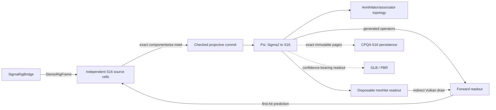

# Σ-PRISM-16 code graph

<!-- Generated by Tools/generate_code_graph.py; do not edit manually. -->

Source digest: `f8eefbe238e3c720583975a246d4f36354f8ea0e347ec65d9d09323b8abf12fc`

Scope: 113 files, 1612 symbols, 1309 functions/methods, 64 GPU kernels, 5 event links.

## Runtime data flow

## DAG to code

| Run | Status | Mapped files |
|---|---|---:|
| S4-00 | done | 36 |
| S4-01 | done | 7 |
| S4-02 | done | 6 |
| S4-03 | done | 4 |
| S4-04 | done | 0 |
| S4-05 | done | 1 |
| S4-06 | done | 0 |
| S4-07 | done | 1 |
| S4-08 | done | 3 |
| S4-09 | pending | 0 |
| S4-10 | pending | 0 |
| S4-11 | pending | 0 |
| S4-12 | pending | 0 |
| S4-13 | pending | 2 |

## Event links

- `AROcclusionManager.frameReceived` → `OnDepthFrame` ([Runtime/Core/DepthCapture.cs:220](../../Runtime/Core/DepthCapture.cs#L220))
- `RoomAnchorManager.RoomReady` → `OnRoomReady` ([Runtime/Core/RoomScanner.cs:134](../../Runtime/Core/RoomScanner.cs#L134))
- `RenderPipelineManager.endFrameRendering` → `EndFrameRendering` ([Runtime/SigmaPrism/SigmaGpuCompletion.cs:171](../../Runtime/SigmaPrism/SigmaGpuCompletion.cs#L171))
- `SigmaRenderer.PredictionReady` → `OnPredictionReady` ([Runtime/SigmaPrism/SigmaInverseController.cs:131](../../Runtime/SigmaPrism/SigmaInverseController.cs#L131))
- `DepthCapture.RawStereoFrameReceived` → `OnRawStereoDepthFrame` ([Runtime/SigmaPrism/SigmaRigBridge.cs:91](../../Runtime/SigmaPrism/SigmaRigBridge.cs#L91))

## Files and symbols

### `Editor/MetaVrManifestPostprocessor.cs`

`FindVersion` (method, L75), `MetaVrManifestPostprocessor` (class, L18), `OnPostGenerateGradleAndroidProject` (method, L22), `UpgradeGeneratedManifest` (method, L35)

### `Editor/RoomScanSetupWizard.Automation.cs`

`BuildQuestInfiniteScanSmokeApk` (method, L146), `PrepareQuestInfiniteScanSmokeProject` (method, L27), `PrepareSmokeProjectAsync` (method, L35), `RoomScanSetupWizard` (class, L23)

### `Editor/RoomScanSetupWizard.BuildProfile.cs`

`FindMetaQuestClassicProfile` (method, L151), `IsActiveProfileMetaQuest` (method, L193), `MetaQuestGuid` (method, L139), `ResolveBuildProfileApi` (method, L60), `RoomScanSetupWizard` (class, L41), `TryActivateMetaQuestProfile` (method, L216)

### `Editor/RoomScanSetupWizard.BuildingBlocks.cs`

`BlockSpec` (struct, L33), `EnsureRequiredBuildingBlocksAsync` (method, L201), `GetBlockDataReflective` (method, L183), `InstallBlockReflective` (method, L188), `ReadOvrManagerStartupPermFlag` (method, L109), `ResolveBuildingBlocksApi` (method, L136), `RoomScanSetupWizard` (class, L26), `WriteOvrManagerStartupPermFlag` (method, L115)

### `Editor/RoomScanSetupWizard.URP.cs`

`AllQualityLevelsUseUrp` (method, L50), `ApplyQuestFriendlyDefaults` (method, L177), `AssignToAllQualityLevels` (method, L216), `CreateURPPipelineAsset` (method, L112), `EnsureURPSetup` (method, L75), `RoomScanSetupWizard` (class, L35)

### `Editor/RoomScanSetupWizard.cs`

`AddGameReadyComponentsToRoot` (method, L97), `EnsureDebugMenuAssets` (method, L146), `EnsureQuestVRManifest` (method, L141), `EnsureVRInput` (method, L168), `FindOrCreatePanelSettings` (method, L248), `FixAROcclusion` (method, L81), `FixARSession` (method, L72), `FixDebugModules` (method, L117), `FixShaderWiring` (method, L134), `MarkDirty` (method, L262), `OnEnable` (method, L32), `OnGUI` (method, L34), `Open` (method, L28), `Refresh` (method, L62), `RoomScanSetupWizard` (class, L17), `SetBool` (method, L234), `SetPanelRenderModeWorldSpace` (method, L240), `WireComponent` (method, L204)

### `Editor/VRProjectBootstrap.cs`

`AnyFeatureEnabled` (method, L643), `Audit` (method, L84), `BuildChecks` (method, L201), `CheckResult` (enum, L36), `CheckSeverity` (enum, L35), `DescribeFeature` (method, L630), `DescribeLoaders` (method, L544), `DescribeTouchProfiles` (method, L667), `EnsureOpenXRLoader` (method, L590), `FixAllAsync` (method, L135), `GetOrCreateXRPerBuildTarget` (method, L564), `GetXRManager` (method, L553), `IsFeatureEnabled` (method, L637), `MakeArm64Check` (method, L419), `MakeMinSdkCheck` (method, L431), `MakeOpenXRFeatureCheck` (method, L616), `MakeOvrConfigEnumCheck` (method, L681), `MakeScriptingBackendCheck` (method, L405), `MakeStereoRenderingCheck` (method, L485), `MakeTargetSdkCheck` (method, L443), `MakeTextureCompressionAstcCheck` (method, L502), `MakeVulkanOnlyCheck` (method, L461), `MakeXRLoaderCheck` (method, L530), `RequireQuestScanningFeatures` (method, L100), `SetFeatureEnabled` (method, L650), `VRCheck` (class, L37), `VRProjectBootstrap` (class, L49)

### `Runtime/Camera/PassthroughCameraProvider.cs`

`ApplyConfiguration` (method, L206), `ConfigurationMatches` (method, L213), `CreateOwnedPca` (method, L191), `FindForEye` (method, L220), `OnDestroy` (method, L186), `PassthroughCameraProvider` (class, L24), `RequestCameraPermissionAsync` (method, L81), `StartCapture` (method, L108), `StopCapture` (method, L176)

### `Runtime/Core/ComputeKernelHelper.cs`

`ComputeKernelHelper` (struct, L9), `DispatchFit` (method, L36), `DispatchFit` (method, L44), `DispatchFit` (method, L54), `Set` (method, L21), `Set` (method, L26), `Set` (method, L31)

### `Runtime/Core/DepthCapture.cs`

`Awake` (method, L44), `CheckPermissionAndEnable` (method, L166), `DepthCapture` (class, L20), `EnsureArSession` (method, L157), `OnApplicationPause` (method, L90), `OnDepthFrame` (method, L126), `OnDestroy` (method, L105), `OnDisable` (method, L100), `ReleaseResources` (method, L83), `Start` (method, L49), `StartDepthCapture` (method, L69), `StopDepthCapture` (method, L77), `StopProvider` (method, L225), `SubscribeAndRun` (method, L211), `Update` (method, L113), `VerifyProviderAsync` (method, L185)

### `Runtime/Core/IRoomScanModule.cs`

`IRoomScanModule` (interface, L8)

### `Runtime/Core/RoomAnchorManager.cs`

`Awake` (method, L38), `ComputeRelocationMatrix` (method, L138), `ComputeRelocationMatrix` (method, L151), `DetachChildrenForReparent` (method, L374), `EraseSpatialAnchorAsync` (method, L343), `GetRoomLocalToWorld` (method, L130), `LoadSpatialAnchorAsync` (method, L282), `OnDestroy` (method, L69), `OnModuleInitialize` (method, L22), `OnSceneLoaded` (method, L77), `RoomAnchorManager` (class, L16), `StabilizeAnchorTransform` (method, L387), `Start` (method, L43)

### `Runtime/Core/RoomScanner.cs`

`Awake` (method, L89), `ClearAllDataAsync` (method, L285), `ClearScan` (method, L278), `CycleRenderMode` (method, L302), `EnsureScanAnchorAsync` (method, L317), `IsModeAvailable` (method, L312), `ObserveStart` (method, L264), `OnDestroy` (method, L155), `OnDisable` (method, L148), `OnRoomReady` (method, L138), `ReleaseScanResources` (method, L270), `RoomScanner` (class, L37), `ScanLifecycleState` (enum, L16), `ScanRenderMode` (enum, L10), `SetRenderMode` (method, L293), `Start` (method, L105), `StartScanningAsync` (method, L163), `StartScanningCoreAsync` (method, L177), `StopScanning` (method, L232), `ToggleDebugMenu` (method, L315), `ToggleScanning` (method, L254)

### `Runtime/Core/RoomSpaceRoot.cs`

`Adopt` (method, L186), `AdoptAtRoomOrigin` (method, L200), `AttachToRoot` (method, L226), `Awake` (method, L97), `OnDestroy` (method, L111), `Reframe` (method, L141), `RoomSpaceRoot` (class, L58), `SetAnchorOverride` (method, L278), `Update` (method, L116), `WaitForBindAsync` (method, L252)

### `Runtime/Core/XRRuntimeGuard.cs`

`XRRuntimeGuard` (class, L19)

### `Runtime/Resources/SigmaPrism/ConeLut.compute`

`BuildConeLut` (gpu_function, L19), `LocalRay` (gpu_function, L11), `BuildConeLut` (gpu_kernel, L1)

### `Runtime/Resources/SigmaPrism/ConeMath.hlsl`

`ConeProjectionDepthToViewZ` (gpu_function, L3), `ConeSurfaceFootprint` (gpu_function, L15)

### `Runtime/Resources/SigmaPrism/DepthNormalize.compute`

`NormalizeStereoDepth` (gpu_function, L18), `NormalizeStereoDepth` (gpu_kernel, L1)

### `Runtime/Resources/SigmaPrism/Generated/SigmaGeneratedTables.hlsl`

`SigmaConjugateSign` (gpu_function, L196), `SigmaHadamardSign` (gpu_function, L197), `SigmaMulBasisIndex` (gpu_function, L190), `SigmaMulBasisSign` (gpu_function, L192)

### `Runtime/Resources/SigmaPrism/RigImageCopy.compute`

`CopyProjectionDepthArray` (gpu_function, L13), `CopyProjectionDepthArray` (gpu_kernel, L1)

### `Runtime/Resources/SigmaPrism/Sedenion16.hlsl`

`SigmaApplyMagnitudeSign` (gpu_function, L122), `SigmaHadamardRow` (gpu_function, L675), `SigmaI64ShiftRightRaw` (gpu_function, L79), `SigmaLeftBasisAction` (gpu_function, L633), `SigmaMagnitudeFitsSigned` (gpu_function, L115), `SigmaQ48AddChecked` (gpu_function, L140), `SigmaQ48DivLower` (gpu_function, L623), `SigmaQ48DivNearestEven` (gpu_function, L618), `SigmaQ48DivRounded` (gpu_function, L577), `SigmaQ48DivUpper` (gpu_function, L628), `SigmaQ48DivideMagnitude` (gpu_function, L516), `SigmaQ48Mask` (gpu_function, L129), `SigmaQ48MulLower` (gpu_function, L309), `SigmaQ48MulNearestEven` (gpu_function, L304), `SigmaQ48MulRounded` (gpu_function, L274), `SigmaQ48MulUpper` (gpu_function, L314), `SigmaQ48NegateChecked` (gpu_function, L152), `SigmaQ48Select` (gpu_function, L134), `SigmaQ48ShiftLeftChecked` (gpu_function, L171), `SigmaQ48ShiftRightNearestEven` (gpu_function, L184), `SigmaQ48SubChecked` (gpu_function, L159), `SigmaQ48TryDivDyadic` (gpu_function, L325), `SigmaRightBasisAction` (gpu_function, L646), `SigmaRightSignedDyadAction` (gpu_function, L659), `SigmaU128` (struct, L209), `SigmaU32MultiplyWide` (gpu_function, L220), `SigmaU64AbsSigned` (gpu_function, L48), `SigmaU64Add` (gpu_function, L10), `SigmaU64AnyLowBits` (gpu_function, L92), `SigmaU64Bit` (gpu_function, L109), `SigmaU64DivideByU32` (gpu_function, L384), `SigmaU64Increment` (gpu_function, L21), `SigmaU64MultiplyWide` (gpu_function, L235), `SigmaU64NegateRaw` (gpu_function, L41), `SigmaU64ShiftLeftRaw` (gpu_function, L66), `SigmaU64ShiftRight` (gpu_function, L53), `SigmaU64Subtract` (gpu_function, L30), `SigmaU96DivideStep` (gpu_function, L443)

### `Runtime/Resources/SigmaPrism/SigmaCarrier.compute`

`AcknowledgeDirtyPages` (gpu_function, L210), `ClonePageGeneration` (gpu_function, L119), `CompactDirtyPages` (gpu_function, L191), `DeactivatePageGeneration` (gpu_function, L155), `InitializeGpuPool` (gpu_function, L95), `InitializeNullPage` (gpu_function, L70), `MarkPageDirty` (gpu_function, L164), `PublishPageGeneration` (gpu_function, L142), `ReleasePageSlot` (gpu_function, L175), `SigmaCarrierNullLane` (gpu_function, L41), `SigmaRequestedPageMetadata` (gpu_function, L52), `AcknowledgeDirtyPages` (gpu_kernel, L9), `ClonePageGeneration` (gpu_kernel, L3), `CompactDirtyPages` (gpu_kernel, L8), `DeactivatePageGeneration` (gpu_kernel, L6), `InitializeGpuPool` (gpu_kernel, L2), `InitializeNullPage` (gpu_kernel, L1), `MarkPageDirty` (gpu_kernel, L5), `PublishPageGeneration` (gpu_kernel, L4), `ReleasePageSlot` (gpu_kernel, L7)

### `Runtime/Resources/SigmaPrism/SigmaCarrierAbi.hlsl`

`SigmaCarrierPageMetaGpu` (struct, L16)

### `Runtime/Resources/SigmaPrism/SigmaCarrierCodec.compute`

`DecodePageBlocks` (gpu_function, L474), `EncodePageBlocks` (gpu_function, L320), `SigmaCodecAdd96` (gpu_function, L86), `SigmaCodecAddScaled` (gpu_function, L159), `SigmaCodecDecodeValue` (gpu_function, L290), `SigmaCodecExtractBits` (gpu_function, L183), `SigmaCodecFitsI64` (gpu_function, L108), `SigmaCodecInputIndex` (gpu_function, L69), `SigmaCodecLowMask` (gpu_function, L177), `SigmaCodecNullLane` (gpu_function, L48), `SigmaCodecOutputIndex` (gpu_function, L75), `SigmaCodecPageSample` (gpu_function, L60), `SigmaCodecReadSigned` (gpu_function, L249), `SigmaCodecReadWidth` (gpu_function, L242), `SigmaCodecResidual` (gpu_function, L114), `SigmaCodecSharedIndex` (gpu_function, L43), `SigmaCodecSignExtend96` (gpu_function, L81), `SigmaCodecSignedWidth` (gpu_function, L143), `SigmaCodecSubtract96` (gpu_function, L97), `SigmaCodecWriteDeltaLane` (gpu_function, L199), `if` (gpu_function, L126), `if` (gpu_function, L131), `if` (gpu_function, L302), `if` (gpu_function, L307), `if` (gpu_function, L437), `if` (gpu_function, L445), `if` (gpu_function, L458), `if` (gpu_function, L510), `if` (gpu_function, L531), `if` (gpu_function, L538), `DecodePageBlocks` (gpu_kernel, L2), `EncodePageBlocks` (gpu_kernel, L1)

### `Runtime/Resources/SigmaPrism/SigmaDirectCarrierPreview.shader`

`Attributes` (struct, L83), `PreviewContactColour` (gpu_function, L146), `PreviewContactVert` (gpu_function, L99), `SigmaPreviewBillboardCorner` (gpu_function, L67), `SigmaPreviewHash` (gpu_function, L48), `SigmaPreviewHue` (gpu_function, L77), `SigmaPreviewPageHash` (gpu_function, L57), `SigmaPreviewReadoutIndex` (gpu_function, L42), `Varyings` (struct, L89)

### `Runtime/Resources/SigmaPrism/SigmaExactCompare.hlsl`

`SigmaI64Less` (gpu_function, L18), `SigmaQ48Less` (gpu_function, L25), `SigmaQ48Max` (gpu_function, L35), `SigmaQ48Min` (gpu_function, L30), `SigmaU64Equal` (gpu_function, L7), `SigmaU64Less` (gpu_function, L13)

### `Runtime/Resources/SigmaPrism/SigmaForwardReadout.compute`

`BuildCarrierReadout` (gpu_function, L46), `CompactCurrentPages` (gpu_function, L86), `ResolveCarrierHalos` (gpu_function, L138), `SigmaReadoutI64Equal` (gpu_function, L121), `SigmaReadoutIncrementI64` (gpu_function, L126), `SigmaReadoutIndex` (gpu_function, L33), `SigmaReadoutPageVisible` (gpu_function, L38), `BuildCarrierReadout` (gpu_kernel, L1), `CompactCurrentPages` (gpu_kernel, L2), `ResolveCarrierHalos` (gpu_kernel, L3)

### `Runtime/Resources/SigmaPrism/SigmaFrameAbi.hlsl`

`SigmaDirtyEdgeGpu` (struct, L85), `SigmaFrameCandidateGpu` (struct, L62), `SigmaFrameDeltaGpu` (struct, L79), `SigmaFrameOutcomeGpu` (struct, L68), `SigmaFrameRevisionGpu` (struct, L91), `SigmaOwnedFrameGpu` (struct, L55), `SigmaPendingGaugeGpu` (struct, L73)

### `Runtime/Resources/SigmaPrism/SigmaFrameClosure.compute`

`AllocatePendingRoots` (gpu_function, L411), `BuildDirtyEdges` (gpu_function, L531), `BuildPendingEdges` (gpu_function, L253), `ClearFrameClosure` (gpu_function, L210), `ClearFrameClosureStorage` (gpu_function, L239), `FinalizePendingGauges` (gpu_function, L313), `RelaxPendingLabels` (gpu_function, L283), `ReserveFrameAllocation` (gpu_function, L394), `ResolveFrameTargets` (gpu_function, L469), `ScanPendingRootBlocks` (gpu_function, L360), `ScanPendingRootSupers` (gpu_function, L378), `ScanPendingRoots` (gpu_function, L342), `SigmaFrameAddU64` (gpu_function, L183), `SigmaFrameClosureEnabled` (gpu_function, L66), `SigmaFrameDepthBounds` (gpu_function, L112), `SigmaFrameOutcomeFlags` (gpu_function, L77), `SigmaFramePaddedWidth` (gpu_function, L189), `SigmaFramePendingActive` (gpu_function, L83), `SigmaFramePendingCompatible` (gpu_function, L138), `SigmaFrameResolved` (gpu_function, L71), `SigmaFrameRootCost` (gpu_function, L196), `SigmaFrameStateHasContact` (gpu_function, L104), `SigmaFrameStateLane` (gpu_function, L97), `AllocatePendingRoots` (gpu_kernel, L10), `BuildDirtyEdges` (gpu_kernel, L12), `BuildPendingEdges` (gpu_kernel, L3), `ClearFrameClosure` (gpu_kernel, L1), `ClearFrameClosureStorage` (gpu_kernel, L2), `FinalizePendingGauges` (gpu_kernel, L5), `RelaxPendingLabels` (gpu_kernel, L4), `ReserveFrameAllocation` (gpu_kernel, L9), `ResolveFrameTargets` (gpu_kernel, L11), `ScanPendingRootBlocks` (gpu_kernel, L7), `ScanPendingRootSupers` (gpu_kernel, L8), `ScanPendingRoots` (gpu_kernel, L6)

### `Runtime/Resources/SigmaPrism/SigmaFrameInverse.compute`

`BuildDepthSourceCells` (gpu_function, L340), `BuildFrameProposals` (gpu_function, L292), `BuildRgbSourceCells` (gpu_function, L468), `ClearFrameState` (gpu_function, L263), `CompactResolvedTargets` (gpu_function, L1083), `EvaluateCandidateMeets` (gpu_function, L821), `SigmaFrameBootstrapCoordinate` (gpu_function, L452), `SigmaFrameBuildNovelState` (gpu_function, L768), `SigmaFrameCandidateLess` (gpu_function, L235), `SigmaFrameCellAddress` (gpu_function, L128), `SigmaFrameEmptyCandidate` (gpu_function, L199), `SigmaFrameExactEnabled` (gpu_function, L115), `SigmaFrameFullBounds` (gpu_function, L120), `SigmaFrameLoadDepthJoint` (gpu_function, L414), `SigmaFrameLoadMetric` (gpu_function, L139), `SigmaFramePixel` (gpu_function, L133), `SigmaFramePredictionCandidate` (gpu_function, L209), `SigmaFrameProjectDepth` (gpu_function, L173), `SigmaFrameReferenceWorld` (gpu_function, L149), `SigmaFrameSameCandidate` (gpu_function, L253), `SigmaFrameSourceBounds` (gpu_function, L712), `SigmaFrameSourceProvenance` (gpu_function, L743), `SigmaFrameTransformRow` (gpu_function, L754), `if` (gpu_function, L723), `if` (gpu_function, L729), `if` (gpu_function, L872), `BuildDepthSourceCells` (gpu_kernel, L3), `BuildFrameProposals` (gpu_kernel, L2), `BuildRgbSourceCells` (gpu_kernel, L4), `ClearFrameState` (gpu_kernel, L1), `CompactResolvedTargets` (gpu_kernel, L6), `EvaluateCandidateMeets` (gpu_kernel, L5)

### `Runtime/Resources/SigmaPrism/SigmaFramePublish.compute`

`CloseFrameRevision` (gpu_function, L117), `CompactChangedPages` (gpu_function, L103), `FinalizePageVisibility` (gpu_function, L155), `PrepareFramePages` (gpu_function, L54), `PublishFrameRevision` (gpu_function, L181), `ScatterFrameDeltas` (gpu_function, L77), `SigmaFrameNullLane` (gpu_function, L43), `CloseFrameRevision` (gpu_kernel, L4), `CompactChangedPages` (gpu_kernel, L3), `FinalizePageVisibility` (gpu_kernel, L5), `PrepareFramePages` (gpu_kernel, L1), `PublishFrameRevision` (gpu_kernel, L6), `ScatterFrameDeltas` (gpu_kernel, L2)

### `Runtime/Resources/SigmaPrism/SigmaGeometryReadout.hlsl`

`SigmaGeometryReadoutExact` (gpu_function, L19), `SigmaGeometryReadoutPlan` (gpu_function, L39), `SigmaQ48ToReadoutFloat` (gpu_function, L5)

### `Runtime/Resources/SigmaPrism/SigmaIntrinsicTopology.compute`

`AccumulateTopologyEvidence` (gpu_function, L776), `BuildCellCutFlags` (gpu_function, L1021), `BuildSampleSupport` (gpu_function, L389), `BuildTopologyDispatchArgs` (gpu_function, L638), `BuildTransitionMeta` (gpu_function, L405), `BuildTransitionTau` (gpu_function, L531), `ClearTopologyCache` (gpu_function, L263), `ClearTopologyPage` (gpu_function, L281), `ClearTopologyWork` (gpu_function, L315), `CopyPriorTopologyPage` (gpu_function, L302), `EvaluateAssociatorCells` (gpu_function, L849), `FinalizeTransitionClasses` (gpu_function, L946), `MarkTopologyCandidates` (gpu_function, L582), `PublishTopologyPage` (gpu_function, L1067), `ScanAnnihilatorCatalog` (gpu_function, L651), `SigmaAddIndependentKey` (gpu_function, L231), `SigmaEvidenceChanged` (gpu_function, L219), `SigmaEvidenceDiscontinuity` (gpu_function, L206), `SigmaEvidenceHitMask` (gpu_function, L187), `SigmaEvidenceMode` (gpu_function, L155), `SigmaLoadDownState` (gpu_function, L146), `SigmaLoadRightState` (gpu_function, L137), `SigmaLoadTargetState` (gpu_function, L128), `SigmaLoadTransitionEndpoints` (gpu_function, L327), `SigmaNeighbourTransition` (gpu_function, L1002), `SigmaReadProposalEvidence` (gpu_function, L161), `SigmaTopologyCacheIndex` (gpu_function, L118), `SigmaTopologyCellIndex` (gpu_function, L123), `SigmaTopologyDownPageSlot` (gpu_function, L93), `SigmaTopologyDownPageValid` (gpu_function, L103), `SigmaTopologyRecordCuts` (gpu_function, L258), `SigmaTopologyRightPageSlot` (gpu_function, L88), `SigmaTopologyRightPageValid` (gpu_function, L98), `SigmaTopologyTargetPageSlot` (gpu_function, L83), `SigmaTopologyTransitionIndex` (gpu_function, L113), `SigmaTopologyWorkValid` (gpu_function, L108), `if` (gpu_function, L349), `if` (gpu_function, L372), `if` (gpu_function, L430), `if` (gpu_function, L509), `if` (gpu_function, L750), `if` (gpu_function, L806), `if` (gpu_function, L812), `AccumulateTopologyEvidence` (gpu_kernel, L11), `BuildCellCutFlags` (gpu_kernel, L14), `BuildSampleSupport` (gpu_kernel, L5), `BuildTopologyDispatchArgs` (gpu_kernel, L9), `BuildTransitionMeta` (gpu_kernel, L6), `BuildTransitionTau` (gpu_kernel, L7), `ClearTopologyCache` (gpu_kernel, L1), `ClearTopologyPage` (gpu_kernel, L2), `ClearTopologyWork` (gpu_kernel, L4), `CopyPriorTopologyPage` (gpu_kernel, L3), `EvaluateAssociatorCells` (gpu_kernel, L12), `FinalizeTransitionClasses` (gpu_kernel, L13), `MarkTopologyCandidates` (gpu_kernel, L8), `PublishTopologyPage` (gpu_kernel, L15), `ScanAnnihilatorCatalog` (gpu_kernel, L10)

### `Runtime/Resources/SigmaPrism/SigmaInverseAbi.hlsl`

`SigmaAdmissibleCell16` (struct, L97), `SigmaDepthCell3` (struct, L88), `SigmaInverseConflictGpu` (struct, L109), `SigmaQ48Bounds` (struct, L82), `SigmaRgbPhaseScheduledIndex` (gpu_function, L58), `SigmaRgbSampleScheduled` (gpu_function, L65), `SigmaRgbSourceBoundAddress` (gpu_function, L77), `SigmaRgbSourceCellAddress` (gpu_function, L72)

### `Runtime/Resources/SigmaPrism/SigmaInverseMath.hlsl`

`SigmaApplyGeometryTargets` (gpu_function, L319), `SigmaBuildDepthWorldCell` (gpu_function, L228), `SigmaBuildSupportedDepthProposal` (gpu_function, L389), `SigmaCalibrationValue` (gpu_function, L13), `SigmaClassifyFirstHitExact` (gpu_function, L185), `SigmaDepthHalfWidth` (gpu_function, L123), `SigmaInformationMassForWidth` (gpu_function, L162), `SigmaLiftNullDepthMeet` (gpu_function, L517), `SigmaMeetAxis` (gpu_function, L282), `SigmaPackSources` (gpu_function, L301), `SigmaPixelSlopeBounds` (gpu_function, L211), `SigmaPriorHalfWidth` (gpu_function, L139), `SigmaQ48AbsDifference` (gpu_function, L59), `SigmaQ48FromFloatNearestEven` (gpu_function, L34), `SigmaQ48FromUnsignedInteger` (gpu_function, L24), `SigmaQ48IntervalAdd` (gpu_function, L108), `SigmaQ48IntervalProduct` (gpu_function, L89), `SigmaQ48Midpoint` (gpu_function, L66), `SigmaQ48PointBounds` (gpu_function, L73), `SigmaQ48Positive` (gpu_function, L18), `SigmaQ48ScaleBounds` (gpu_function, L117), `SigmaQ48Widen` (gpu_function, L81), `SigmaRevalidateGeometryCandidate` (gpu_function, L346), `SigmaStrengthenCandidateMass` (gpu_function, L376)

### `Runtime/Resources/SigmaPrism/SigmaOperatorFixture.compute`

`AlgebraParity` (gpu_function, L75), `BasisTableParity` (gpu_function, L102), `CanonicalSelfTest` (gpu_function, L112), `NumericParity` (gpu_function, L26), `SigmaWriteNumeric` (gpu_function, L20), `AlgebraParity` (gpu_kernel, L2), `BasisTableParity` (gpu_kernel, L3), `CanonicalSelfTest` (gpu_kernel, L4), `NumericParity` (gpu_kernel, L1)

### `Runtime/Resources/SigmaPrism/SigmaOperatorPlan.hlsl`

`SigmaCanonicalMutationEnabled` (gpu_function, L7), `SigmaConjugatePlan` (gpu_function, L16), `SigmaGeometryGPlan` (gpu_function, L81), `SigmaHadamardBPlan` (gpu_function, L68), `SigmaHadamardButterfly` (gpu_function, L40), `SigmaHadamardButterflySafe` (gpu_function, L25), `SigmaHiddenFPlan` (gpu_function, L90), `SigmaProjectiveClamp` (gpu_function, L118), `SigmaProjectiveMeetLower` (gpu_function, L108), `SigmaProjectiveMeetUpper` (gpu_function, L113)

### `Runtime/Resources/SigmaPrism/SigmaPerformanceCounters.compute`

`AccumulateSigmaPerformanceCounters` (gpu_function, L40), `SigmaPerfSaturatingAdd` (gpu_function, L15), `SigmaPerfSaturatingMul` (gpu_function, L21), `SigmaPerfSum3` (gpu_function, L29), `AccumulateSigmaPerformanceCounters` (gpu_kernel, L1)

### `Runtime/Resources/SigmaPrism/SigmaPoseConsume.hlsl`

`SigmaPoseApplyVectorWorld` (gpu_function, L69), `SigmaPoseApplyWorld` (gpu_function, L95), `SigmaPoseQ48Float` (gpu_function, L13), `SigmaPoseRodriguesCoefficients` (gpu_function, L37), `SigmaPoseRotate` (gpu_function, L56), `SigmaPoseTwist` (gpu_function, L25), `SigmaPoseTwistPacked` (gpu_function, L19), `SigmaPoseUnapplyVectorWorld` (gpu_function, L82), `SigmaPoseUnapplyWorld` (gpu_function, L109)

### `Runtime/Resources/SigmaPrism/SigmaPoseGauge.compute`

`BuildCorrectedCalibration` (gpu_function, L525), `BuildPoseGaugePartials` (gpu_function, L378), `ReducePoseGauge` (gpu_function, L441), `SigmaPoseBuildCells` (gpu_function, L204), `SigmaPoseCross` (gpu_function, L112), `SigmaPoseDecodeNormal` (gpu_function, L75), `SigmaPoseDot` (gpu_function, L126), `SigmaPoseMaxIncrement` (gpu_function, L94), `SigmaPoseMetaPrior` (gpu_function, L87), `SigmaPosePointToReference` (gpu_function, L175), `SigmaPoseQ48VectorFromFloat` (gpu_function, L104), `SigmaPoseQuantizeCorrected` (gpu_function, L518), `SigmaPoseReduceShared` (gpu_function, L43), `SigmaPoseVectorNonZero` (gpu_function, L136), `SigmaPoseVectorToReference` (gpu_function, L146), `BuildCorrectedCalibration` (gpu_kernel, L3), `BuildPoseGaugePartials` (gpu_kernel, L1), `ReducePoseGauge` (gpu_kernel, L2)

### `Runtime/Resources/SigmaPrism/SigmaPredict.shader`

`ContactVert` (gpu_function, L187), `PredictionFrag` (gpu_function, L230), `PredictionOutput` (struct, L222), `PredictionVaryings` (struct, L71), `SigmaContactBillboardCorner` (gpu_function, L49), `SigmaContactNormalOptical` (gpu_function, L166), `SigmaEmptyPrediction` (gpu_function, L82), `SigmaEncodeOctahedral` (gpu_function, L59), `SigmaReadoutIndex` (gpu_function, L30), `SigmaStorePredictionIdentity` (gpu_function, L95), `SigmaTriangleCorner` (gpu_function, L36), `SurfaceVert` (gpu_function, L107)

### `Runtime/Resources/SigmaPrism/SigmaRgbInverseMath.hlsl`

`SigmaBuildRgbMeasurement` (gpu_function, L123), `SigmaProjectWorldToRgb` (gpu_function, L95), `SigmaRgbCalibrationValue` (gpu_function, L37), `SigmaRgbCeilHalfMagnitude` (gpu_function, L52), `SigmaRgbInequalityCoefficient` (gpu_function, L168), `SigmaRgbLoad` (gpu_function, L112), `SigmaRgbOperator` (gpu_function, L47), `SigmaRgbOperatorAddress` (gpu_function, L42), `SigmaRgbQuantizedComponent` (gpu_function, L61), `SigmaRgbQuantizedDirection` (gpu_function, L71), `SigmaRgbSignedOperator` (gpu_function, L161)

### `Runtime/Resources/SigmaPrism/SigmaStableScan.hlsl`

`SigmaStableExclusiveScan256` (gpu_function, L78), `SigmaStableExclusiveScan256Dual` (gpu_function, L13)

### `Runtime/Resources/SigmaPrism/SigmaTopologyAbi.hlsl`

`SigmaTopologyAnnihilatorId` (gpu_function, L45), `SigmaTopologyClass` (gpu_function, L40), `SigmaTopologyPack` (gpu_function, L51)

### `Runtime/Resources/SigmaPrism/SigmaTopologyMath.hlsl`

`SigmaAssociatorPlan` (gpu_function, L118), `SigmaDenseProductPlan` (gpu_function, L82), `SigmaLoadNullState` (gpu_function, L171), `SigmaRelativeAssociatorGate` (gpu_function, L164), `SigmaRelativeNearGate` (gpu_function, L157), `SigmaRightDyadL1` (gpu_function, L135), `SigmaS16L1` (gpu_function, L73), `SigmaStateHasContact` (gpu_function, L187), `SigmaTransitionPlan` (gpu_function, L110), `SigmaU128Add64` (gpu_function, L24), `SigmaU128Add` (gpu_function, L45), `SigmaU128Equal` (gpu_function, L11), `SigmaU128Less` (gpu_function, L16), `SigmaU128ShiftLeftSmall` (gpu_function, L58)

### `Runtime/RoomScanInputHandler.cs`

`AddBinding` (method, L64), `ClearAllBindings` (method, L88), `ExecuteAction` (method, L110), `RemoveBindingsForAction` (method, L72), `RemoveBindingsForButton` (method, L80), `RoomScanInputHandler` (class, L42), `ScanAction` (enum, L10), `ScanInputBinding` (class, L25), `Update` (method, L92)

### `Runtime/SigmaPrism/Calibration/ConeLutResources.cs`

`Acquire` (method, L122), `Build` (method, L161), `CeilDiv` (method, L254), `ConeLutLease` (class, L33), `ConeProjectionLut` (class, L11), `Create` (method, L112), `CreateTexture` (method, L207), `Destroy` (method, L196), `DestroyProjection` (method, L233), `DestroyTexture` (method, L243), `Dispose` (method, L55), `Get` (method, L152), `Get` (method, L46), `Release` (method, L143), `Retain` (method, L136), `Retain` (method, L48), `Retire` (method, L128), `RigConeLutSet` (class, L68)

### `Runtime/SigmaPrism/Calibration/ConeProjectionMath.cs`

`ConeProjectionMath` (class, L31), `MetricConeFootprint` (struct, L10), `RayAtImagePoint` (method, L108), `TryReproject` (method, L93), `TrySurfaceFootprint` (method, L38), `TryWorldToPixel` (method, L69)

### `Runtime/SigmaPrism/Calibration/RigCalibration.cs`

`Get` (method, L73), `IsCompatible` (method, L82), `Projection` (method, L117), `RigCalibration` (class, L45), `RigLensModel` (enum, L13), `RigProjection` (enum, L6), `RigProjectionCalibration` (struct, L19), `TryCreate` (method, L94)

### `Runtime/SigmaPrism/Capture/GpuTextureRing.cs`

`CopyOnGpu` (method, L373), `DestroySlot` (method, L418), `DestroyTexture` (method, L427), `Dispose` (method, L215), `Dispose` (method, L50), `EnsureCompatibleTarget` (method, L300), `GetTexture` (method, L191), `GetVolumeDepth` (method, L345), `GpuTextureCopyMode` (enum, L8), `GpuTextureLease` (class, L18), `GpuTextureRing` (class, L65), `IsSupportedDimension` (method, L354), `LatchCompletionFault` (method, L254), `NextGeneration` (method, L416), `PollCompletion` (method, L238), `Release` (method, L203), `Retain` (method, L197), `Retain` (method, L42), `RetireSlot` (method, L283), `Slot` (class, L67), `TargetDimension` (method, L363), `TargetFormat` (method, L368), `TryCopy` (method, L115), `TryDestroyRetiredSlot` (method, L265), `ValidateLease` (method, L228)

### `Runtime/SigmaPrism/Capture/RawStereoDepthFrame.cs`

`IsFinite` (method, L40), `IsFinite` (method, L48), `RawStereoDepthFrame` (struct, L10)

### `Runtime/SigmaPrism/Capture/RigCalibrationMath.cs`

`Add` (method, L187), `Add` (method, L190), `Add` (method, L193), `CombineSignatures` (method, L76), `ConeRayAtPixel` (method, L89), `ConeRayReference` (struct, L10), `FromDepthFov` (method, L55), `FromPassthrough` (method, L31), `IntrinsicsToFov` (method, L158), `ProjectionDepth01FromViewZ` (method, L119), `RangeFromProjectionDepth01` (method, L141), `RayAtImagePoint` (method, L150), `RigCalibrationMath` (class, L8), `Signature` (method, L168), `ViewZFromProjectionDepth01` (method, L130)

### `Runtime/SigmaPrism/Capture/RigCaptureContracts.cs`

`AbsoluteDeltaNanoseconds` (method, L91), `DestinationFromSource` (method, L388), `Dispose` (method, L371), `Equals` (method, L105), `Equals` (method, L150), `Equals` (method, L156), `Equals` (method, L99), `EquivalentRange` (method, L232), `FiniteRasterFar` (method, L246), `FromUnixDateTime` (method, L84), `FromViews` (method, L269), `GetHashCode` (method, L107), `GetHashCode` (method, L158), `GpuImageView` (struct, L165), `IsFinite` (method, L211), `IsFinite` (method, L214), `IsValid` (method, L225), `IsValidRange` (method, L227), `Retain` (method, L360), `RigClockDomain` (enum, L29), `RigDepthContract` (class, L223), `RigDepthEncoding` (enum, L20), `RigExtrinsicsSnapshot` (struct, L250), `RigEye` (enum, L7), `RigFrameRejectionReason` (enum, L39), `RigIntrinsics` (struct, L117), `RigPairingHealth` (struct, L284), `RigPoseMath` (class, L385), `RigStreamKind` (enum, L12), `RigTimestamp` (struct, L64), `StereoRigFrameLease` (class, L304), `ToString` (method, L111), `ViewMatches` (method, L238)

### `Runtime/SigmaPrism/Capture/RigClockMapper.cs`

`CreateRuntime` (method, L23), `RigClockMapper` (class, L10), `SecondsToNanoseconds` (method, L92), `TryCaptureAnchor` (method, L37), `TryMapXrTimestamp` (method, L68)

### `Runtime/SigmaPrism/Capture/RigFrameSynchronizer.cs`

`AbsoluteDelta` (method, L421), `AcceptReorderedTimestamp` (method, L308), `AddDepth` (method, L159), `AddRgb` (method, L135), `Compare` (method, L371), `Compare` (method, L382), `ContainsTimestamp` (method, L340), `ContainsTimestamp` (method, L344), `DepthTimestampComparer` (class, L377), `Dispose` (method, L235), `Dispose` (method, L26), `Dispose` (method, L68), `DropPastPublishedSamples` (method, L324), `FindEarliestCoherentTriplet` (method, L252), `Flush` (method, L228), `InsertSorted` (method, L348), `InsertSorted` (method, L358), `Midpoint` (method, L419), `MillisecondsToNanoseconds` (method, L416), `Reject` (method, L409), `RgbRigSample` (class, L7), `RgbTimestampComparer` (class, L367), `RigCaptureDiagnosticSnapshot` (struct, L75), `RigFrameSynchronizer` (class, L100), `StereoDepthRigSample` (class, L33), `TakeLease` (method, L19), `TakeLease` (method, L61), `TryDequeue` (method, L184), `ValidateIncoming` (method, L237)

### `Runtime/SigmaPrism/Generated/SigmaGeneratedAlgebra.cs`

`SigmaGeneratedAlgebra` (class, L6)

### `Runtime/SigmaPrism/Generated/SigmaGeneratedFrame.cs`

`SigmaDirtyEdgeGpu` (struct, L133), `SigmaFrameCandidateGpu` (struct, L106), `SigmaFrameCellFlags` (enum, L89), `SigmaFrameClaimKind` (enum, L45), `SigmaFrameDeltaGpu` (struct, L126), `SigmaFrameOutcomeFlags` (enum, L77), `SigmaFrameOutcomeGpu` (struct, L113), `SigmaFrameProposalKind` (enum, L31), `SigmaFrameRevisionGpu` (struct, L140), `SigmaFrameRevisionState` (enum, L69), `SigmaFrameSource` (enum, L23), `SigmaFrameTargetKind` (enum, L39), `SigmaFrameUInt2Gpu` (struct, L9), `SigmaFrameUInt4Gpu` (struct, L16), `SigmaGeneratedFrame` (class, L146), `SigmaOwnedFrameGpu` (struct, L99), `SigmaOwnedFrameState` (enum, L52), `SigmaPendingGaugeGpu` (struct, L119), `SigmaPendingGaugeState` (enum, L61)

### `Runtime/SigmaPrism/SigmaBackendCapabilities.cs`

`Lower` (method, L104), `LowerNode` (method, L132), `LowerReduction` (method, L178), `RequireCanonical` (method, L51), `RequiredPrimitive` (method, L67), `SigmaBackendCapabilityProfile` (class, L29), `SigmaExactPrimitive` (enum, L8), `SigmaHlslLowerer` (class, L102), `Supports` (method, L48)

### `Runtime/SigmaPrism/SigmaCarrier.cs`

`Abort` (method, L579), `AcknowledgeDirtyBatch` (method, L478), `AcquireGpuManagedPool` (method, L297), `BeginNextGeneration` (method, L384), `BeginNullGeneration` (method, L363), `BindPageMutation` (method, L665), `BindReadable` (method, L412), `BindWritable` (method, L538), `BindWritable` (method, L71), `CarrierSegment` (class, L754), `CollectCurrentPages` (method, L457), `CollectReadableSegments` (method, L447), `CompactDirtyPages` (method, L425), `ComputeSegmentPageCapacity` (method, L337), `Create` (method, L854), `CreateDirtyBatch` (method, L834), `CreateReadBatch` (method, L838), `DeactivateCurrent` (method, L682), `Dispose` (method, L601), `Dispose` (method, L842), `Dispose` (method, L92), `EnsureNoPendingCoordinate` (method, L698), `Equals` (method, L40), `Equals` (method, L44), `Equals` (method, L748), `Equals` (method, L750), `GetHashCode` (method, L46), `GetHashCode` (method, L752), `MarkDirty` (method, L498), `MarkReadoutChanged` (method, L804), `OnDestroy` (method, L621), `OnModuleInitialize` (method, L240), `OnScanStarted` (method, L287), `OnScanStopped` (method, L289), `PageGenerationKey` (struct, L736), `Publish` (method, L553), `Publish` (method, L81), `ReleaseSlot` (method, L827), `RequireAllocated` (method, L721), `RequireInitialized` (method, L730), `RequirePending` (method, L708), `ReserveAllForGpu` (method, L822), `ReserveGeneration` (method, L623), `SetUInt` (method, L695), `SigmaCarrier` (class, L159), `SigmaCarrierDirtyBatch` (struct, L101), `SigmaCarrierPageFlags` (enum, L8), `SigmaCarrierPageHandle` (struct, L15), `SigmaCarrierReadBatch` (struct, L126), `SigmaCarrierWriteLease` (class, L57), `ToString` (method, L48), `TryGetLatest` (method, L356), `TryReleaseRetiredGeneration` (method, L512), `TryReserveSlot` (method, L811)

### `Runtime/SigmaPrism/SigmaCarrierCodec.cs`

`AddScaled` (method, L636), `ComparePages` (method, L693), `CompareTo` (method, L28), `CopyBlock` (method, L102), `CopySamples` (method, L100), `DecodeAffine` (method, L520), `DecodeBlock` (method, L191), `DecodeConstant` (method, L508), `DecodeDelta` (method, L544), `DecodeNull` (method, L498), `DecodePage` (method, L245), `DecodeRaw` (method, L585), `DecodeSnapshot` (method, L326), `EncodeBlock` (method, L164), `EncodePage` (method, L204), `EncodeRaw` (method, L488), `EncodeSnapshot` (method, L296), `Equals` (method, L34), `Equals` (method, L37), `FloorDivide` (method, L700), `GetHashCode` (method, L39), `IsNull` (method, L360), `LeastSignificantBitReader` (class, L752), `LeastSignificantBitWriter` (class, L722), `Predictor` (method, L610), `Predictor` (method, L623), `ReadFingerprint` (method, L669), `ReadSigned` (method, L759), `ReadState` (method, L653), `Require` (method, L716), `ResolveAddress` (method, L148), `SigmaBlockMode` (enum, L8), `SigmaCarrierAddress` (struct, L42), `SigmaCarrierCodec` (class, L138), `SigmaCarrierPageCoordinate` (struct, L16), `SigmaDecodedPage` (class, L57), `SigmaEncodedBlock` (struct, L119), `SignedBitWidth` (method, L596), `StoreBlock` (method, L676), `ToArray` (method, L749), `ToString` (method, L40), `TryEncodeAffine` (method, L390), `TryEncodeConstant` (method, L371), `TryEncodeDelta` (method, L438), `ValidateBlock` (method, L707), `WriteFingerprint` (method, L661), `WriteSigned` (method, L727), `WriteState` (method, L647)

### `Runtime/SigmaPrism/SigmaDepthInverse.cs`

`ClassifyFirstHit` (method, L110), `FailedCandidate` (method, L329), `InformationMassForWidth` (method, L147), `MeetAndCommitSupported` (method, L167), `MeetAxis` (method, L310), `PriorHalfWidth` (method, L124), `SaturatingAdd` (method, L339), `SaturatingSubtract` (method, L336), `SigmaDepthAdmissibleCell` (struct, L26), `SigmaDepthCommitResult` (struct, L80), `SigmaDepthConflict` (struct, L56), `SigmaDepthInverse` (class, L102), `SigmaDepthSourceClass` (enum, L6), `SigmaFirstHitSector` (enum, L12)

### `Runtime/SigmaPrism/SigmaDiagnosticTelemetry.cs`

`AppendTo` (method, L296), `AppendTo` (method, L327), `AppendTo` (method, L395), `Batch` (class, L224), `BitsToFloat` (method, L410), `BufferKind` (enum, L212), `Complete` (method, L131), `Dispose` (method, L202), `FinalizeBatch` (method, L165), `FormatLogLine` (method, L547), `From` (method, L481), `IsDue` (method, L36), `IsFinite` (method, L413), `Request` (method, L114), `RequestFailed` (method, L479), `RequestRange` (method, L122), `SelectNextReadoutPage` (method, L178), `Set` (method, L259), `SigmaDiagnosticTelemetry` (class, L13), `SigmaReadoutVertexTelemetry` (struct, L340), `SigmaRuntimeTelemetrySnapshot` (class, L417), `SigmaRuntimeTimingTelemetry` (struct, L311), `SigmaStageLatencyTelemetry` (struct, L280), `Tick` (method, L39), `Word` (method, L198), `Word` (method, L585)

### `Runtime/SigmaPrism/SigmaExactBackendGate.cs`

`Bind` (method, L62), `Dispatch` (method, L45), `Dispose` (method, L70), `SigmaExactBackendGate` (class, L17), `SigmaExactBackendGateStatus` (enum, L6)

### `Runtime/SigmaPrism/SigmaFrameGraph.cs`

`BindCarrier` (method, L744), `BindClosureDepth` (method, L573), `BindClosureKernel` (method, L446), `BindEvaluate` (method, L726), `BindFootprintWindow` (method, L906), `BindFrameConstants` (method, L588), `BindProposal` (method, L624), `BindPublishKernel` (method, L517), `BindSourceOutputs` (method, L762), `BindSourceRead` (method, L795), `BindSourceReads` (method, L782), `CameraPose` (method, L18), `CeilDiv` (method, L903), `CreateBuffer` (method, L876), `Dispose` (method, L433), `FindKernels` (method, L880), `FromCamera` (method, L14), `Intrinsics` (method, L889), `Packed` (method, L893), `RecordClosureAndPublish` (method, L357), `RecordDepthSource` (method, L652), `RecordRgbSource` (method, L690), `RecordSourceAndResolve` (method, L239), `RequireAlive` (method, L913), `RequireSingleExecutionWindow` (method, L849), `SetFrameMatrices` (method, L813), `SigmaFrameGraph` (class, L129), `SigmaFrameInverseInput` (struct, L36), `SigmaFramePublicationTarget` (struct, L80), `SigmaRoomFrame` (class, L12), `Single` (method, L866), `TryAcquire` (method, L229)

### `Runtime/SigmaPrism/SigmaFrameResources.cs`

`AdditionalBytesFor` (method, L62), `BufferBytes` (method, L741), `ComputeSegmentRecordCapacity` (method, L610), `CreateBuffer` (method, L732), `Dispose` (method, L212), `Dispose` (method, L233), `Dispose` (method, L268), `Dispose` (method, L656), `Dispose` (method, L98), `EstimateSourceBytes` (method, L595), `FrameSlot` (struct, L778), `Get` (method, L223), `GetSources` (method, L623), `GrowTo` (method, L71), `Lower` (method, L203), `Provenance` (method, L210), `Release` (method, L636), `RequireAlive` (method, L109), `RequireAlive` (method, L726), `RequireSlot` (method, L715), `Retain` (method, L261), `Retain` (method, L629), `SigmaFrameBufferSegment` (struct, L14), `SigmaFrameMemoryProfile` (enum, L8), `SigmaFrameResources` (class, L287), `SigmaFrameSegmentedBuffer` (class, L35), `SigmaFrameSourceStorage` (class, L123), `SigmaOwnedFrameLease` (class, L242), `TryAcquireFrame` (method, L451), `TryEnsureCandidateCapacity` (method, L510), `TryEnsureClosureCapacity` (method, L549), `TryEnsureDirtyEdgeCapacity` (method, L543), `TryEnsurePendingGaugeCapacity` (method, L540), `TryEnsureRevisionCapacity` (method, L546), `TryGrow` (method, L701), `TryReserve` (method, L712), `UInt4` (method, L744), `Upper` (method, L206), `ValidateGeneratedAbi` (method, L747), `Validity` (method, L208)

### `Runtime/SigmaPrism/SigmaGaugeRefinement.cs`

`Apply` (method, L88), `ApplyInverse` (method, L120), `At` (method, L330), `AxisPreimage` (method, L351), `Equals` (method, L66), `Equals` (method, L71), `GetAxis` (method, L339), `GetHashCode` (method, L73), `HasProjectiveReproductionDemand` (method, L164), `MapRetainedSampleAxis` (method, L201), `Midpoint` (method, L321), `MidpointError` (method, L282), `OrientedToPage` (method, L376), `ProjectiveCoordinate` (method, L272), `SampleHalfGrid` (method, L289), `SetAxis` (method, L343), `SigmaGaugeAxis` (enum, L5), `SigmaGaugeDirection` (enum, L10), `SigmaGaugeMap` (struct, L23), `SigmaGaugeRefinement` (class, L84), `TargetBlocksForSourceBlock` (method, L240), `TerminalBandsAreNull` (method, L144), `TryMapRetainedSample` (method, L210), `ValidatePage` (method, L384)

### `Runtime/SigmaPrism/SigmaGeometryReadout.cs`

`LiftFixture` (method, L61), `SigmaGeometryReadout` (class, L23), `SigmaGeometrySample` (struct, L6), `TryRead` (method, L25)

### `Runtime/SigmaPrism/SigmaGpuCompletion.cs`

`EndFrameRendering` (method, L182), `EnsurePump` (method, L166), `Entry` (class, L92), `InsertAfterGraphicsWork` (method, L63), `Poll` (method, L147), `Poll` (method, L31), `Quarantine` (method, L133), `Quarantine` (method, L200), `RecordAfterAllWork` (method, L71), `ReleaseOnce` (method, L185), `RequireSupported` (method, L57), `Retire` (method, L105), `SigmaGpuCompletion` (class, L54), `SigmaGpuCompletionStatus` (enum, L8), `SigmaGpuCompletionTicket` (struct, L21), `SigmaGpuRetirement` (class, L90), `StopPump` (method, L174)

### `Runtime/SigmaPrism/SigmaGpuKernelTelemetry.cs`

`BeginLine` (method, L332), `CaptureAndLogFrame` (method, L163), `CountSamples` (method, L346), `DispatchComputeProfiled` (method, L72), `DispatchComputeProfiled` (method, L91), `DispatchIndirectProfiled` (method, L129), `DispatchIndirectProfiled` (method, L146), `DispatchProfiled` (method, L112), `Entry` (class, L20), `FindProfiledKernel` (method, L59), `FormatSample` (method, L335), `FullName` (method, L319), `NanosecondsToMilliseconds` (method, L359), `Register` (method, L240), `ReportRegistrationUnavailable` (method, L322), `RequireEntry` (method, L304), `Reset` (method, L45), `SigmaGpuKernelTelemetry` (class, L16)

### `Runtime/SigmaPrism/SigmaIntrinsicTopology.cs`

`CanonicalizeKeys` (method, L152), `EvaluateCell` (method, L61), `L1` (method, L144), `SigmaIntrinsicTopology` (class, L57), `SigmaIntrinsicTopologySignature` (struct, L13), `SigmaTopologyClass` (enum, L6)

### `Runtime/SigmaPrism/SigmaInverseController.cs`

`AbsNanoseconds` (method, L758), `Add` (method, L910), `AdvanceAge` (method, L995), `Begin` (method, L971), `BuildTrackingPriorEnvelope` (method, L523), `CaptureTimingTelemetry` (method, L218), `CeilDiv` (method, L790), `Complete` (method, L1027), `CountPendingTickets` (method, L717), `CreateArrayTexture` (method, L796), `CreateBuffer` (method, L793), `CreatePersistentResources` (method, L620), `DestroyTexture` (method, L826), `Dispose` (method, L1042), `ElapsedMilliseconds` (method, L996), `EnsureCalibration` (method, L595), `EnsureDirectGraph` (method, L232), `EnsureFrameResources` (method, L998), `EnsurePosePartials` (method, L1015), `FillCalibration` (method, L644), `FillRgbCalibration` (method, L681), `FindKernels` (method, L608), `FromRaw` (method, L895), `IndependenceKey` (method, L763), `IngressSlot` (class, L931), `LatchCompletionFault` (method, L372), `LateUpdate` (method, L166), `LatencyTracker` (class, L898), `MaxRigRotationResidual` (method, L582), `MaxRigTranslationResidual` (method, L569), `Mix` (method, L785), `NextRevision` (method, L741), `OnDestroy` (method, L837), `OnModuleInitialize` (method, L101), `OnPredictionReady` (method, L158), `OnScanStarted` (method, L136), `OnScanStopped` (method, L150), `Poll` (method, L992), `PollIngress` (method, L342), `RecordCorrectedCalibration` (method, L462), `RecordNormalize` (method, L383), `RecordPoseGauge` (method, L408), `ReleasePendingIngress` (method, L729), `Reset` (method, L922), `SaturatingAdd` (method, L761), `SetQ` (method, L749), `SetQRaw` (method, L752), `SetRgbQ` (method, L754), `SetRgbQRaw` (method, L756), `SigmaInverseController` (class, L22), `SigmaPackedQ48` (struct, L886), `SubmitIngress` (method, L250), `TrackLast` (method, L735), `TryGetFreeIngressSlot` (method, L699), `UploadExactCalibration` (method, L490), `UploadPosePrior` (method, L503)

### `Runtime/SigmaPrism/SigmaNumericDomain.cs`

`Clamp` (method, L291), `Contains` (method, L286), `DivideCeiling` (method, L231), `DivideFloor` (method, L220), `DivideNearestEven` (method, L207), `Equals` (method, L298), `Equals` (method, L301), `FromInteger` (method, L193), `FromRatio` (method, L196), `GetHashCode` (method, L303), `Intersect` (method, L288), `NormalizeDenominator` (method, L242), `QAbs` (method, L47), `QAdd` (method, L28), `QClamp` (method, L54), `QCompare` (method, L31), `QDiv` (method, L65), `QDivLower` (method, L83), `QDivUpper` (method, L92), `QIntegerSquareRoot` (method, L131), `QMidpoint` (method, L38), `QMul` (method, L62), `QMulLower` (method, L75), `QMulUpper` (method, L79), `QNegate` (method, L40), `QShiftLeft` (method, L99), `QShiftRight` (method, L107), `QShiftRightLower` (method, L115), `QShiftRightUpper` (method, L122), `QSub` (method, L30), `Quantize` (method, L158), `Quantize` (method, L191), `SigmaNumericDomain` (class, L10), `SigmaQ48Interval` (struct, L270), `ToDouble` (method, L206), `ToRawChecked` (method, L254), `ToString` (method, L308), `ValidateShift` (method, L261)

### `Runtime/SigmaPrism/SigmaOperatorPlan.cs`

`Add` (method, L162), `Build` (method, L220), `BuildAssociator` (method, L491), `BuildBasis` (method, L400), `BuildCodecPredicates` (method, L585), `BuildConjugation` (method, L390), `BuildHadamard` (method, L444), `BuildHadamardRow` (method, L466), `BuildProjectiveCommit` (method, L559), `BuildProjectiveMeet` (method, L544), `BuildReadout` (method, L454), `BuildSignedDyad` (method, L421), `BuildTransition` (method, L479), `BuildView` (method, L506), `CompareEqual` (method, L178), `CompareLess` (method, L174), `CompareLessEqual` (method, L176), `ComputeFingerprint` (method, L96), `ComputePlanBundleFingerprint` (method, L630), `Constant` (method, L151), `Contains` (method, L86), `Copy` (method, L251), `DenseProduct` (method, L606), `Evaluate` (method, L263), `EvaluateNode` (method, L290), `EvaluateS16` (method, L281), `FixedReduction` (method, L196), `Gather` (method, L141), `GatherState` (method, L598), `Intern` (method, L237), `InternCommutative` (method, L230), `IntervalDivLower` (method, L192), `IntervalDivUpper` (method, L194), `IntervalMulLower` (method, L188), `IntervalMulUpper` (method, L190), `LeftBasis` (method, L383), `LeftSignedDyad` (method, L388), `Mask` (method, L180), `Max` (method, L172), `Min` (method, L170), `Negate` (method, L160), `QDiv` (method, L168), `QMul` (method, L166), `RightBasis` (method, L385), `RightSignedDyad` (method, L386), `Select` (method, L182), `ShiftLeft` (method, L184), `ShiftRight` (method, L186), `SigmaOperatorEvaluator` (class, L260), `SigmaOperatorNode` (struct, L37), `SigmaOperatorOpcode` (enum, L9), `SigmaOperatorPlan` (class, L63), `SigmaOperatorPlanBuilder` (class, L125), `SigmaOperatorPlans` (class, L355), `Sign` (method, L154), `Sub` (method, L164)

### `Runtime/SigmaPrism/SigmaOperatorSet.cs`

`RequireCanonicalBackend` (method, L33), `SigmaOperatorSet` (class, L10)

### `Runtime/SigmaPrism/SigmaPoseGauge.cs`

`Apply` (method, L50), `Equals` (method, L74), `Equals` (method, L79), `FromGpu` (method, L40), `GetHashCode` (method, L81), `Identity` (method, L37), `MinimumMagnitude` (method, L84), `Raw` (method, L31), `Read` (method, L93), `SigmaPoseGaugeState` (struct, L12)

### `Runtime/SigmaPrism/SigmaPredictionFrame.cs`

`ArrayDescriptor` (method, L269), `CommitGpuWrite` (method, L158), `CommitGpuWrite` (method, L52), `Compatible` (method, L281), `CompatibleDepth` (method, L288), `CreateColor` (method, L232), `CreateDepth` (method, L252), `DestroySlot` (method, L372), `DestroyTexture` (method, L389), `Dispose` (method, L193), `Dispose` (method, L54), `EnsureTextures` (method, L206), `Get` (method, L147), `LatchCompletionFault` (method, L311), `NextGeneration` (method, L400), `PollCompletion` (method, L295), `Release` (method, L181), `Retain` (method, L175), `Retain` (method, L44), `RetireSlot` (method, L340), `SigmaPredictionFrameLease` (class, L12), `SigmaPredictionTargetRing` (class, L75), `Slot` (class, L77), `TryBegin` (method, L104), `TryDestroyRetiredSlot` (method, L322)

### `Runtime/SigmaPrism/SigmaRenderer.cs`

`BindBuild` (method, L408), `BindCompaction` (method, L429), `BindHaloResolve` (method, L452), `BuildClipFromWorld` (method, L538), `DestroyMaterial` (method, L652), `Dispose` (method, L730), `DrawSegments` (method, L467), `EnsureSegmentCaches` (method, L506), `LateUpdate` (method, L216), `Matches` (method, L724), `OnDestroy` (method, L605), `OnModuleInitialize` (method, L153), `OnScanStarted` (method, L203), `OnScanStopped` (method, L209), `PrepareReadoutCaches` (method, L387), `RenderDirectCarrierPreview` (method, L564), `RenderPrediction` (method, L308), `SegmentReadoutCache` (class, L662), `SetMrt` (method, L530), `SigmaRenderer` (class, L19), `TryAcquireLatest` (method, L142), `TryGetReadoutDiagnostics` (method, L114), `TryRecordPoseGaugePrediction` (method, L258), `TryRender` (method, L237), `TryRenderPoseGauge` (method, L246)

### `Runtime/SigmaPrism/SigmaRgbInverse.cs`

`BuildGeneratedViewMatrix` (method, L115), `BuildRatioInequalities` (method, L271), `CoalesceCertificates` (method, L204), `CompareTo` (method, L77), `ContractLessOrEqual` (method, L309), `CopyBounds` (method, L385), `EvaluateRow` (method, L355), `LinearInequality` (struct, L421), `Meet` (method, L190), `MinimizeProofSet` (method, L244), `Product` (method, L373), `SameCoalesceKey` (method, L397), `SigmaConstraintCertificate` (struct, L42), `SigmaRgbAdmissibleCell` (struct, L12), `SigmaRgbInverse` (class, L108), `SigmaRgbSourceClass` (enum, L6), `TryBuildCell` (method, L136), `ValidateDimensions` (method, L406)

### `Runtime/SigmaPrism/SigmaRgbViewCatalog.cs`

`CreateCanonical` (method, L43), `DecodeDirection` (method, L98), `EncodeDirection` (method, L91), `FingerprintOf` (method, L118), `QuantizeDirection` (method, L78), `RetainedSign` (method, L109), `SigmaRgbViewCatalog` (class, L16)

### `Runtime/SigmaPrism/SigmaRigBridge.cs`

`CaptureRgb` (method, L170), `EnsureRuntimeObjects` (method, L155), `FreezeSessionIntrinsics` (method, L294), `LateUpdate` (method, L118), `OnDestroy` (method, L142), `OnRawStereoDepthFrame` (method, L223), `PublishAvailableFrames` (method, L284), `ReportLocalRejection` (method, L376), `ResolveEye` (method, L320), `SigmaRigBridge` (class, L13), `StartCapture` (method, L72), `StopCapture` (method, L97), `TryAcquireLatest` (method, L61)

### `Runtime/SigmaPrism/SigmaS16.cs`

`Add` (method, L380), `Associator` (method, L336), `Basis` (method, L95), `BasisAction` (method, L385), `BasisProductIndex` (method, L227), `BasisProductSign` (method, L234), `Combine` (method, L416), `CombineDyad` (method, L401), `CompareTo` (method, L178), `Conjugate` (method, L241), `DenseReferenceMultiply` (method, L255), `Equals` (method, L118), `Equals` (method, L128), `Equals` (method, L188), `Equals` (method, L192), `FromArray` (method, L82), `GeometryReadout` (method, L315), `GetAnnihilatorAction` (method, L355), `GetHashCode` (method, L130), `GetHashCode` (method, L194), `GetZeroDivisorEntry` (method, L367), `HadamardB` (method, L290), `HadamardBT` (method, L298), `HadamardRow` (method, L300), `HiddenReadout` (method, L324), `L1RawChecked` (method, L345), `LeftBasisAction` (method, L272), `LeftSignedDyadAction` (method, L280), `RightBasisAction` (method, L276), `RightSignedDyadAction` (method, L285), `SigmaS16` (struct, L10), `SigmaS16Operators` (class, L218), `SigmaSignedDyad` (struct, L146), `SigmaZeroDivisorEntry` (struct, L201), `Subtract` (method, L383), `ToArray` (method, L104), `ToS16` (method, L170), `ToString` (method, L141), `Transition` (method, L333), `ValidateBasis` (method, L426)

### `Runtime/SigmaPrism/SigmaTopologyController.cs`

`AccumulateEvidencePage` (method, L381), `BindDirectAssociator` (method, L591), `BindDirectExecutionMode` (method, L798), `BindEvidence` (method, L660), `BindEvidenceView` (method, L670), `BindPageState` (method, L685), `BindTopologyNeighbours` (method, L710), `BuildGeneration` (method, L303), `BuildPage` (method, L449), `CeilDiv` (method, L851), `ClearPage` (method, L782), `CopyPrior` (method, L767), `CreateBuffer` (method, L847), `CreateSegmentCache` (method, L805), `Dispose` (method, L929), `EnsureSegmentViews` (method, L264), `FinishGaugeGeneration` (method, L350), `FullStereo` (method, L55), `GaugeRebuild` (method, L61), `Matches` (method, L924), `MergeEvidenceIdentity` (method, L635), `OnDestroy` (method, L861), `OnModuleInitialize` (method, L195), `OnScanStarted` (method, L261), `OnScanStopped` (method, L263), `PrepareGaugeGeneration` (method, L328), `Proposals` (method, L38), `Publish` (method, L99), `PublishBuiltGeneration` (method, L441), `RebuildCurrent` (method, L360), `RequireInitialized` (method, L854), `ResolveEvidenceIdentity` (method, L617), `ResolveNeighbour` (method, L736), `SetUInt` (method, L828), `SigmaTopologyBuildToken` (struct, L86), `SigmaTopologyController` (class, L138), `SigmaTopologyEvidenceView` (struct, L8), `SigmaTopologyGaugeBinding` (struct, L107), `SigmaTopologySegmentView` (struct, L66), `TopologySegmentCache` (class, L891), `TryGetCurrentTopology` (method, L753), `TryGetSegmentView` (method, L290), `TryOffset` (method, L831), `ValidateEvidenceCoordinate` (method, L607)

### `Runtime/SigmaPrism/SigmaTransitionCache.cs`

`Clear` (method, L104), `Equals` (method, L21), `Equals` (method, L26), `GetHashCode` (method, L28), `GetOrCompute` (method, L68), `SigmaTransitionCache` (class, L51), `SigmaTransitionKey` (struct, L6), `SigmaTransitionSignature` (struct, L31)

### `Runtime/UI/ControllerRayDriver.cs`

`Awake` (method, L51), `ChooseBestController` (method, L103), `ControllerRayDriver` (class, L14), `DrawLaser` (method, L200), `LateUpdate` (method, L88), `OnDestroy` (method, L94), `SetCursorColor` (method, L241), `SetupCursor` (method, L180), `SetupLineRenderer` (method, L166), `TryUpdateRayOrigin` (method, L125), `Update` (method, L78)

### `Runtime/UI/DebugMenuController.cs`

`Awake` (method, L36), `Bind` (method, L109), `DebugMenuController` (class, L9), `Hide` (method, L84), `OnEnable` (method, L43), `Query` (method, L91), `RefreshStatus` (method, L119), `Set` (method, L265), `SetStatus` (method, L271), `Show` (method, L76), `StatusKind` (enum, L293), `Toggle` (method, L70), `Update` (method, L56)

### `Runtime/UI/DebugMenuFollower.cs`

`ComputeTargetPosition` (method, L92), `DebugMenuFollower` (class, L11), `LateUpdate` (method, L38), `OnEnable` (method, L33), `SnapToView` (method, L75), `StopTracking` (method, L87)

### `Runtime/UI/VRDocumentRaycaster.cs`

`GetWorldRay` (method, L26), `VRDocumentRaycaster` (class, L19)

### `Runtime/Utils/Logger.cs`

`Error` (method, L42), `Info` (method, L30), `LogLevel` (enum, L7), `Logger` (class, L21), `Verbose` (method, L24), `Warning` (method, L36)

### `Tests/Editor/SigmaAlgebraOperatorTests.cs`

`BuildCseFixture` (method, L325), `CompareEntries` (method, L374), `CompleteGeneratedZeroDivisorCatalogIsExactAndNonZero` (method, L134), `CseMaskSelectAndCapabilityRefusalPreserveExactSemantics` (method, L261), `DeterministicState` (method, L338), `ExplicitAssociatorBracketingsAndFusedPlanAgree` (method, L183), `GeneratedBasisTableMatchesRecursiveCayleyDicksonExhaustively` (method, L86), `GeneratedFingerprintsAreStableAndBoundToCanonicalBundle` (method, L302), `GeneratedSparseBasisAndConjugationMatchDenseReference` (method, L110), `GeneratedTransitionHadamardAndReadoutPlansMatchReferences` (method, L198), `NumericDomainRegistryAndCheckedNearestEvenSemanticsAreExact` (method, L11), `OutwardIntervalArithmeticNeverExcludesExactValue` (method, L57), `SigmaAlgebraOperatorTests` (class, L8), `SignedDyadPlanUsesOnlyPermutationSignAndAddition` (method, L162), `TransitionCacheHitMissAndGenerationInvalidationAreExact` (method, L281)

### `Tests/Editor/SigmaCarrierTests.cs`

`AssertAddress` (method, L201), `BindCodec` (method, L349), `DirtyCompactionIsStableAndSegmentSizingRespectsBindingLimit` (method, L155), `EveryExactBlockModeIsCanonicalAndRoundTripsBitForBit` (method, L42), `MakeAffineBlock` (method, L235), `MakeConstantBlock` (method, L222), `MakeDeltaBlock` (method, L256), `MakeMixedPage` (method, L288), `MakeNullBlock` (method, L214), `MakeRawBlock` (method, L269), `PackPage` (method, L316), `PackedGpuCodecMatchesCanonicalCpuBytesAndDecodedState` (method, L88), `PageAndSortedSnapshotRestartAreByteIdentical` (method, L67), `SigmaCarrierTests` (class, L10), `SignedCarrierAddressingUsesMathematicalFloorAcrossZero` (method, L29), `StoreBlock` (method, L304), `UInt2` (struct, L13), `UInt4` (struct, L20), `WordsToLittleEndian` (method, L334)

### `Tests/Editor/SigmaDepthInverseTests.cs`

`Cell` (method, L139), `EmptyMeetPreservesExactGapProvenanceAndCanonicalBytes` (method, L70), `ExactMeetIsLeftRightOrderInvariantAndWeakEvidenceCannotPull` (method, L40), `FirstHitSectorsHaveExactCausalPartition` (method, L9), `IndependentNarrowSupportRaisesResistanceWithoutMovingReadout` (method, L93), `Interval` (method, L147), `Q` (method, L150), `SigmaDepthInverseTests` (class, L6), `SupportedState` (method, L136)

### `Tests/Editor/SigmaForwardReadoutTests.cs`

`BuildFoldedPage` (method, L291), `CreateColor` (method, L337), `CreateDepth` (method, L351), `Destroy` (method, L414), `DrawPrediction` (method, L386), `ExactLiftReadoutRoundTripsAndNullHasNoContact` (method, L52), `FillPatch` (method, L301), `GpuReadoutAndRasterSelectNearFoldWhileNullStaysEmpty` (method, L70), `MinPositiveDepth` (method, L372), `Pack` (method, L319), `PageMeta` (struct, L35), `SigmaForwardReadoutTests` (class, L11), `UInt2` (struct, L19), `UInt4` (struct, L26)

### `Tests/Editor/SigmaFrameInverseTests.cs`

`ArrayRenderTexture` (method, L654), `AssertMatrix` (method, L781), `AssertPublished` (method, L223), `BuildCpuOracle` (method, L254), `Candidate` (method, L387), `ClearPrediction` (method, L676), `ComposePose` (method, L791), `ConstrainedLaneCount` (method, L357), `Contains` (method, L383), `CurrentPage` (method, L236), `DepthCalibration` (method, L699), `Destroy` (method, L775), `DirectFramePublicationIsAtomicAndLayoutInvariant` (method, L178), `Dispose` (method, L553), `FrameFixture` (class, L398), `Intrinsics` (method, L606), `NormalizeDepth` (method, L634), `PageMeta` (struct, L43), `PageState` (method, L246), `PublicationSnapshot` (class, L69), `RawDepthTexture` (method, L622), `ReadSnapshot` (method, L576), `RgbCalibration` (method, L730), `RgbTexture` (method, L611), `RoomFrameKeepsCanonicalPoseStableAcrossAnchorCorrection` (method, L81), `Run` (method, L499), `RunPublished` (method, L513), `Set` (method, L745), `SigmaFrameInverseTests` (class, L11), `Signed` (method, L395), `Snapshot` (class, L58), `SourceKey` (method, L369), `UInt2` (struct, L27), `UInt4` (struct, L34), `WholeFrameFourSourceInverseIsExactAndPartitionInvariant` (method, L112)

### `Tests/Editor/SigmaFrameResourceTests.cs`

`GeneratedFrameAbiHasExactManagedStrides` (method, L21), `SigmaFrameResourceTests` (class, L9), `SourceStorageIsCompleteAndSegmentRangeNeverExceedsBinding` (method, L42), `UInt4` (struct, L12), `VulkanFixtureCompilesAllRecordsWithinEightUavs` (method, L59)

### `Tests/Editor/SigmaGpuLoweringTests.cs`

`AssertPacked` (method, L212), `CanonicalPacked32BackendGatePassesOnlyAfterGpuSelfTest` (method, L31), `LoadFixture` (method, L157), `MakeState` (method, L194), `Pack` (method, L203), `Packed32NumericLoweringMatchesCpuSemanticDomainBitForBit` (method, L40), `Packed32SparseAlgebraAndGeneratedBasisTableMatchCpuExactly` (method, L105), `SigmaGpuLoweringTests` (class, L9), `UInt2` (struct, L15), `UInt4` (struct, L22), `Unpack` (method, L209)

### `Tests/Editor/SigmaIntrinsicTopologyTests.cs`

`FindContactZeroDivisor` (method, L212), `GenerationPairCacheComputesOneTransitionAndInvalidatesEitherEnd` (method, L30), `Pack` (method, L232), `Scalar` (method, L229), `SigmaIntrinsicTopologyTests` (class, L11), `StableIndependentEvidencePromotesExactSingularity` (method, L53), `SyntheticH0SignaturesAreIntrinsicAndProximityIndependent` (method, L87), `ToBigInteger` (method, L250), `UInt2` (struct, L14), `UInt4` (struct, L21), `VulkanFixtureMatchesCpuFullCatalogAndIntegerGates` (method, L149)

### `Tests/Editor/SigmaPoseGaugeTests.cs`

`BuildDepthCalibration` (method, L374), `BuildPosePrior` (method, L363), `BuildPoseRays` (method, L293), `BuildRgbCalibration` (method, L402), `CreateArrayRenderTexture` (method, L431), `EncodeOctahedral` (method, L349), `ExactGpuResultSelectsMinimumMagnitudeMeetPoint` (method, L46), `FillPoseEye` (method, L319), `Float2` (struct, L30), `Float4` (struct, L37), `Matrix` (method, L290), `Pack` (method, L466), `Q` (method, L464), `SigmaPoseGaugeTests` (class, L11), `ToDouble` (method, L477), `UInt2` (struct, L14), `UInt4` (struct, L21), `Unpack` (method, L472), `Unpack` (method, L474), `UnresolvedMeetIsIdentityAndResolvedGaugePreservesRigExtrinsics` (method, L81), `VulkanPoseGaugeKernelIsPresent` (method, L110), `VulkanPoseKernelsSolveAndCorrectTheSameRigGauge` (method, L124)

### `Tests/Editor/SigmaRgbInverseTests.cs`

`BoxAround` (method, L257), `Certificate` (method, L195), `CertificateCoalescingAndMinimalProofAreDeterministic` (method, L140), `DifferentlyPhasedCellsSharpenByIntersectionNotSummation` (method, L169), `Direction` (method, L279), `ExactDirectionCatalogIsDeterministicAndHasFailClosedNullSlot` (method, L44), `FindObservableLane` (method, L228), `GeneratedViewMatrixEqualsExplicitBracketedSemanticOperator` (method, L11), `IncompatibleRgbDepthStyleCellStaysExplicitlyEmpty` (method, L123), `Interval` (method, L276), `LeftRightMeetIsExactAndSourceOrderInvariant` (method, L107), `Multiply` (method, L247), `PreservesNarrowMeet` (method, L184), `Q` (method, L282), `Q` (method, L70), `SevenInequalityContractionContainsKnownSolutionAndNarrowsBox` (method, L79), `SigmaRgbInverseTests` (class, L8), `UniformBox` (method, L268), `UnobservableAppearanceDenominatorContributesNoBound` (method, L62)

### `Tests/Editor/SigmaRigContractTests.cs`

`CalibrationSignatureChangesWithConeGeometry` (method, L70), `ConeReferenceCarriesRayDifferentialsAndSolidAngle` (method, L82), `DepthFovProducesDeliveredPixelIntrinsics` (method, L52), `FiniteConeFootprintExpandsWithRangeAndGrazingIncidence` (method, L101), `SigmaRigContractTests` (class, L10), `UnixTimestampPreservesSourceTimeExactly` (method, L13), `XrClockAnchorFailsClosedWhenSamplingBracketIsTooWide` (method, L41), `XrClockAnchorUsesBracketMidpointAndCarriesUncertainty` (method, L26)

### `Tools/generate_code_graph.py`

`build_graph` (function, L197), `is_hlsl_definition` (function, L110), `line_of` (function, L94), `main` (function, L363), `matching_brace` (function, L98), `parse_symbols` (function, L132), `render_markdown` (function, L296), `source_files` (function, L84), `task_files` (function, L191)

### `Tools/sigma/generate_sigma_operators.py`

`SigmaFrameUInt2Gpu` (struct, L626), `SigmaFrameUInt4Gpu` (struct, L633), `SigmaGeneratedAlgebra` (class, L378), `SigmaGeneratedFrame` (class, L644), `basis_product` (function, L107), `build_descriptor` (function, L157), `check_or_write` (function, L702), `chunks` (function, L349), `conjugate_sign` (function, L124), `cs_array` (function, L354), `dyads` (function, L132), `fingerprint_words` (function, L438), `frame_abi_descriptor` (function, L553), `hadamard_sign` (function, L128), `main` (function, L715), `multiply_dyads` (function, L140), `render_cs` (function, L363), `render_frame_cs` (function, L577), `render_frame_hlsl` (function, L659), `render_hlsl` (function, L481), `render_hlsl_layout` (function, L442), `sha256` (function, L152), `uint_array` (function, L538), `upper_snake` (function, L542), `validate_descriptor` (function, L323)

### `Tools/unity/validate_sigma_compute_uav.py`

`function_bodies` (function, L46), `main` (function, L100), `matching` (function, L34), `reachable_uavs` (function, L65), `strip_comments` (function, L29), `validate` (function, L82)

### `Tools/validate_goal_state.py`

`fail` (function, L23), `main` (function, L28), `visit` (function, L86)

## Machine-readable graph

Full nodes, approximate intra-repository call edges, event links, and task/file ownership are in [`.codex/CODE_GRAPH.json`](../../.codex/CODE_GRAPH.json).
