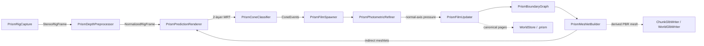

# Cone-PRISM-Q3 code graph

<!-- Generated by Tools/generate_code_graph.py; do not edit manually. -->

Source digest: `8e0061070c16a4e0c67dc80b9f3e80c2b3866c53bd8c61739e7dc6aeb4a99f40`

Scope: 191 files, 2664 symbols, 2105 functions/methods, 122 GPU kernels, 30 event links.

## Runtime data flow

## DAG to code

| Run | Status | Mapped files |
|---|---|---:|
| Q3-01 | done | 7 |
| Q3-02 | done | 7 |
| Q3-03 | done | 4 |
| Q3-04 | done | 3 |
| Q3-05 | done | 4 |
| Q3-06 | done | 3 |
| Q3-07 | done | 3 |
| Q3-08 | done | 2 |
| Q3-09 | done | 5 |
| Q3-10 | done | 4 |
| Q3-11 | in_progress | 5 |
| Q3-12 | pending | 7 |
| Q3-13 | pending | 32 |
| Q3-14 | pending | 4 |
| Q3-15 | pending | 6 |
| Q3-16 | pending | 3 |
| Q3-17 | pending | 2 |
| Q3-18 | pending | 2 |
| Q3-19 | pending | 0 |
| Q3-20 | pending | 7 |
| Q3-21 | pending | 7 |
| Q3-22 | pending | 2 |

## Event links

- `EditorApplication.update` → `PollXAtlasBuilds` ([Editor/RoomScanSetupWizard.cs:2101](../../Editor/RoomScanSetupWizard.cs#L2101))
- `AROcclusionManager.frameReceived` → `OnDepthFrame` ([Runtime/Core/DepthCapture.cs:314](../../Runtime/Core/DepthCapture.cs#L314))
- `AROcclusionManager.frameReceived` → `OnDepthFrame` ([Runtime/Core/DepthCapture.cs:337](../../Runtime/Core/DepthCapture.cs#L337))
- `RoomScanPersistence.LoadCompleted` → `ApplyRenderMode` ([Runtime/Core/RoomScanner.cs:408](../../Runtime/Core/RoomScanner.cs#L408))
- `RoomAnchorManager.RoomReady` → `OnRoomAnchorReady` ([Runtime/Core/RoomScanner.cs:417](../../Runtime/Core/RoomScanner.cs#L417))
- `TextureRefinement.StatusChanged` → `statusHandler` ([Runtime/Core/RoomScanner.cs:1211](../../Runtime/Core/RoomScanner.cs#L1211))
- `TextureRefinement.StatusChanged` → `hqStatusHandler` ([Runtime/Core/RoomScanner.cs:1347](../../Runtime/Core/RoomScanner.cs#L1347))
- `RoomUnderstanding.AnchorsChanged` → `OnMrukAnchorsChanged` ([Runtime/Core/RoomScanner.cs:1667](../../Runtime/Core/RoomScanner.cs#L1667))
- `SubmapManager.ChunkRevisionPublished` → `OnChunkRevisionPublished` ([Runtime/HeavyCompute/ChunkRefinementScheduler.cs:117](../../Runtime/HeavyCompute/ChunkRefinementScheduler.cs#L117))
- `ChunkRefinementScheduler.ArtifactPromoted` → `OnArtifactPromoted` ([Runtime/HeavyCompute/DiffSoupRendererCache.cs:69](../../Runtime/HeavyCompute/DiffSoupRendererCache.cs#L69))
- `SubmapManager.ActiveChunkChanged` → `OnActiveChunkChanged` ([Runtime/HeavyCompute/DiffSoupRendererCache.cs:72](../../Runtime/HeavyCompute/DiffSoupRendererCache.cs#L72))
- `RoomScanner.RenderModeChanged` → `SetRenderMode` ([Runtime/HeavyCompute/DiffSoupRendererCache.cs:77](../../Runtime/HeavyCompute/DiffSoupRendererCache.cs#L77))
- `RoomScanner.ColorFrameProvided` → `OnColorFrame` ([Runtime/Modules/KeyframeCollector.cs:82](../../Runtime/Modules/KeyframeCollector.cs#L82))
- `SceneObjectRegistry.ObjectAdded` → `OnObjectAdded` ([Runtime/Modules/SceneObjectVisualizer.cs:59](../../Runtime/Modules/SceneObjectVisualizer.cs#L59))
- `PrismPredictionRenderer.PredictionReady` → `OnPrediction` ([Runtime/Prism/Association/PrismConeClassifier.cs:111](../../Runtime/Prism/Association/PrismConeClassifier.cs#L111))
- `DepthCapture.RawStereoFrameReceived` → `OnRawStereoDepthFrame` ([Runtime/Prism/Capture/PrismRigCapture.cs:91](../../Runtime/Prism/Capture/PrismRigCapture.cs#L91))
- `PrismFilmUpdater.UpdateCompleted` → `OnFilmUpdateCompleted` ([Runtime/Prism/Geometry/PrismBoundaryGraph.cs:140](../../Runtime/Prism/Geometry/PrismBoundaryGraph.cs#L140))
- `PrismBoundaryGraph.BoundariesUpdated` → `OnBoundariesUpdated` ([Runtime/Prism/Geometry/PrismDisplacementTopology.cs:260](../../Runtime/Prism/Geometry/PrismDisplacementTopology.cs#L260))
- `PrismConeClassifier.EventsReady` → `OnConeEvents` ([Runtime/Prism/Geometry/PrismFilmSpawner.cs:87](../../Runtime/Prism/Geometry/PrismFilmSpawner.cs#L87))
- `PrismFilmSpawner.SpawnCompleted` → `OnConeEvents` ([Runtime/Prism/Geometry/PrismFilmUpdater.cs:119](../../Runtime/Prism/Geometry/PrismFilmUpdater.cs#L119))
- `PrismFilmSpawner.FilmsMutated` → `OnFilmsMutated` ([Runtime/Prism/Geometry/PrismMeshletBuilder.cs:109](../../Runtime/Prism/Geometry/PrismMeshletBuilder.cs#L109))
- `PrismDepthPreprocessor.FrameReady` → `OnDepthFrame` ([Runtime/Prism/Geometry/PrismPredictionRenderer.cs:124](../../Runtime/Prism/Geometry/PrismPredictionRenderer.cs#L124))
- `PrismDepthPreprocessor.FrameReady` → `ExecuteFrame` ([Runtime/Prism/PrismGpuWorkGraph.cs:58](../../Runtime/Prism/PrismGpuWorkGraph.cs#L58))
- `RoomScanner.RefinedMeshReady` → `OnReady` ([Runtime/Utils/RoomScanSession.cs:125](../../Runtime/Utils/RoomScanSession.cs#L125))
- `SubmapManager.RolloverRequested` → `OnRolloverRequested` ([Runtime/World/PrismChunkResidencyManager.cs:58](../../Runtime/World/PrismChunkResidencyManager.cs#L58))
- `SubmapManager.ActiveChunkChanged` → `OnActiveChunkChanged` ([Runtime/World/PrismChunkResidencyManager.cs:59](../../Runtime/World/PrismChunkResidencyManager.cs#L59))
- `SubmapManager.PoseGraphRefined` → `OnPoseGraphRefined` ([Runtime/World/PrismChunkResidencyManager.cs:60](../../Runtime/World/PrismChunkResidencyManager.cs#L60))
- `RoomScanner.ScanStopped` → `OnScanStopped` ([Runtime/World/PrismChunkResidencyManager.cs:61](../../Runtime/World/PrismChunkResidencyManager.cs#L61))
- `RoomScanner.ScanAnchorCreated` → `OnScanAnchorCreated` ([Runtime/World/SubmapManager.cs:267](../../Runtime/World/SubmapManager.cs#L267))
- `RoomScanner.RenderModeChanged` → `OnRenderModeChanged` ([Runtime/World/SubmapManager.cs:268](../../Runtime/World/SubmapManager.cs#L268))

## Files and symbols

### `Editor/GlbInteroperabilityFixtureBuilder.cs`

`Build` (method, L12), `GlbInteroperabilityFixtureBuilder` (class, L10), `WriteChunk` (method, L52)

### `Editor/MetaVrManifestPostprocessor.cs`

`FindVersion` (method, L75), `MetaVrManifestPostprocessor` (class, L18), `OnPostGenerateGradleAndroidProject` (method, L22), `UpgradeGeneratedManifest` (method, L35)

### `Editor/RoomScanSetupWizard.AIDetection.cs`

`AssignDepthProjectionShader` (method, L127), `AssignNmsShader` (method, L115), `CheckAIDetectionAnyMissing` (method, L53), `DrawAIDetectionOptionalStatus` (method, L41), `DrawAIDetectionShaderStatus` (method, L58), `RefreshAIDetection` (method, L22), `RoomScanSetupWizard` (class, L8), `SetupAIDetectionIfAvailable` (method, L83), `SetupAIDetectionModule` (method, L139), `WireAIDetectionComponent` (method, L92), `WireAIDetectionComponents` (method, L77)

### `Editor/RoomScanSetupWizard.Automation.cs`

`BuildQuestInfiniteScanSmokeApk` (method, L154), `PrepareQuestInfiniteScanSmokeProject` (method, L25), `PrepareSmokeProjectAsync` (method, L33), `RoomScanSetupWizard` (class, L21)

### `Editor/RoomScanSetupWizard.BuildProfile.cs`

`FindMetaQuestClassicProfile` (method, L151), `IsActiveProfileMetaQuest` (method, L193), `MetaQuestGuid` (method, L139), `ResolveBuildProfileApi` (method, L60), `RoomScanSetupWizard` (class, L41), `TryActivateMetaQuestProfile` (method, L216)

### `Editor/RoomScanSetupWizard.BuildingBlocks.cs`

`BlockSpec` (struct, L33), `EnsureRequiredBuildingBlocksAsync` (method, L201), `GetBlockDataReflective` (method, L183), `InstallBlockReflective` (method, L188), `ReadOvrManagerStartupPermFlag` (method, L109), `ResolveBuildingBlocksApi` (method, L136), `RoomScanSetupWizard` (class, L26), `WriteOvrManagerStartupPermFlag` (method, L115)

### `Editor/RoomScanSetupWizard.GSplat.cs`

`AddUGSRenderFeature` (method, L271), `CheckGSplatAnyMissing` (method, L66), `ConfigureServerUrl` (method, L151), `DrawGSplatOptionalStatus` (method, L42), `DrawGSplatShaderStatus` (method, L71), `FindActiveRendererData` (method, L212), `GetOrCreateSplatMaterial` (method, L189), `HasUGSRenderFeature` (method, L226), `IsDeferredRendering` (method, L239), `RefreshGSplat` (method, L29), `RoomScanSetupWizard` (class, L10), `SetDeferredRendering` (method, L248), `SetupGSplatIfAvailable` (method, L102), `SetupGSplatModule` (method, L111), `WireGSplatComponent` (method, L83), `WireGSplatComponents` (method, L78)

### `Editor/RoomScanSetupWizard.URP.cs`

`AllQualityLevelsUseUrp` (method, L50), `ApplyQuestFriendlyDefaults` (method, L177), `AssignToAllQualityLevels` (method, L216), `CreateURPPipelineAsset` (method, L112), `EnsureURPSetup` (method, L75), `RoomScanSetupWizard` (class, L35)

### `Editor/RoomScanSetupWizard.VRProject.cs`

`BuildTooltip` (method, L188), `DrawVRProjectSection` (method, L59), `RefreshVRProject` (method, L31), `RoomScanSetupWizard` (class, L13), `RunFixAsync` (method, L124), `SafeRead` (method, L193)

### `Editor/RoomScanSetupWizard.cs`

`AreFieldsAssigned` (method, L2389), `AssignCompute` (method, L1637), `BuildXAtlasPlugin` (method, L1824), `CheckAIDetectionAnyMissing` (method, L201), `CheckGSplatAnyMissing` (method, L192), `ConfigurePluginImporter` (method, L2158), `DeepFind` (method, L2412), `DrawAIDetectionOptionalStatus` (method, L200), `DrawAIDetectionShaderStatus` (method, L202), `DrawGSplatOptionalStatus` (method, L191), `DrawGSplatShaderStatus` (method, L193), `DrawVRProjectSection` (method, L209), `EndSection` (method, L2321), `EnsureDebugMenuAssets` (method, L2447), `EnsureOwnedQuestManifest` (method, L482), `EnsureQuestVRManifest` (method, L573), `EnsureRoomScanIdentityTransform` (method, L925), `EnsureVRInput` (method, L1536), `FindByName` (method, L2401), `FindComponentByTypeName` (method, L2378), `FindHostClang` (method, L1971), `FindMsvcCompiler` (method, L2003), `FindNdkClang` (method, L1932), `FindOrCreatePanelSettings` (method, L2494), `FixCleartextTraffic` (method, L716), `FixGameReadyModules` (method, L1257), `GetLanIp` (method, L2519), `GetOrCreateScanMaterial` (method, L1655), `LoadQuestManifestDocuments` (method, L457), `ManifestFeature` (struct, L375), `ManifestHasAllQuestVREntries` (method, L519), `ManifestHasCleartextTraffic` (method, L697), `MarkDirty` (method, L2426), `Open` (method, L84), `PollXAtlasBuilds` (method, L2104), `RefreshAIDetection` (method, L199), `RefreshGSplat` (method, L190), `RefreshVRProject` (method, L208), `RoomScanSetupWizard` (class, L22), `SceneRoots` (method, L2423), `SetAttribute` (method, L507), `SetBool` (method, L1573), `SetPanelRenderModeWorldSpace` (method, L2435), `SetupAIDetectionIfAvailable` (method, L204), `SetupEverything` (method, L2225), `SetupGSplatIfAvailable` (method, L195), `StartAsyncBuilds` (method, L2047), `WireAIDetectionComponents` (method, L203), `WireComponent` (method, L1733), `WireGSplatComponents` (method, L194)

### `Editor/RoomScannerEditor.cs`

`EnsureXAtlasPlugins` (method, L160), `OnInspectorGUI` (method, L27), `RoomScannerEditor` (class, L17)

### `Editor/VRProjectBootstrap.cs`

`AnyFeatureEnabled` (method, L643), `Audit` (method, L84), `BuildChecks` (method, L201), `CheckResult` (enum, L36), `CheckSeverity` (enum, L35), `DescribeFeature` (method, L630), `DescribeLoaders` (method, L544), `DescribeTouchProfiles` (method, L667), `EnsureOpenXRLoader` (method, L590), `FixAllAsync` (method, L135), `GetOrCreateXRPerBuildTarget` (method, L564), `GetXRManager` (method, L553), `IsFeatureEnabled` (method, L637), `MakeArm64Check` (method, L419), `MakeMinSdkCheck` (method, L431), `MakeOpenXRFeatureCheck` (method, L616), `MakeOvrConfigEnumCheck` (method, L681), `MakeScriptingBackendCheck` (method, L405), `MakeStereoRenderingCheck` (method, L485), `MakeTargetSdkCheck` (method, L443), `MakeTextureCompressionAstcCheck` (method, L502), `MakeVulkanOnlyCheck` (method, L461), `MakeXRLoaderCheck` (method, L530), `RequireQuestScanningFeatures` (method, L100), `SetFeatureEnabled` (method, L650), `VRCheck` (class, L37), `VRProjectBootstrap` (class, L49)

### `Runtime/Camera/ICameraProvider.cs`

`ICameraProvider` (interface, L10)

### `Runtime/Camera/PassthroughCameraProvider.cs`

`ApplyConfiguration` (method, L214), `ConfigurationMatches` (method, L221), `CreateOwnedPca` (method, L199), `FindForEye` (method, L228), `OnDestroy` (method, L194), `PassthroughCameraProvider` (class, L24), `RequestCameraPermissionAsync` (method, L89), `StartCapture` (method, L116), `StopCapture` (method, L184)

### `Runtime/Camera/WebCamProvider.cs`

`OnDestroy` (method, L71), `StartCapture` (method, L50), `StopCapture` (method, L65), `WebCamProvider` (class, L10)

### `Runtime/CameraDebugOverlay.cs`

`CameraDebugOverlay` (class, L10), `CreateCanvas` (method, L37), `LateUpdate` (method, L85), `OnDestroy` (method, L122), `Start` (method, L22)

### `Runtime/Core/ComputeKernelHelper.cs`

`ComputeKernelHelper` (struct, L9), `DispatchFit` (method, L36), `DispatchFit` (method, L44), `DispatchFit` (method, L54), `Set` (method, L21), `Set` (method, L26), `Set` (method, L31)

### `Runtime/Core/DepthCapture.cs`

`ApplyBilateralFilter` (method, L566), `Awake` (method, L177), `CacheTrackingSpaceTransform` (method, L230), `CalculateProjectionMatrix` (method, L690), `CheckPermissionAndEnable` (method, L263), `ComputeDilation` (method, L643), `ComputeNormals` (method, L622), `DepthCapture` (class, L21), `EnableOcclusion` (method, L285), `EnsureARSession` (method, L253), `HandleDeviceDepth` (method, L530), `HandleEditorSimulation` (method, L485), `OnApplicationPause` (method, L362), `OnDepthFrame` (method, L424), `OnDestroy` (method, L391), `OnDisable` (method, L382), `PublishRawStereoDepthFrame` (method, L454), `ReleaseResources` (method, L401), `SetGlobalShaderProperties` (method, L611), `SetRGBGuide` (method, L162), `SetVoxelParams` (method, L730), `Start` (method, L182), `StartDepthCapture` (method, L329), `StopDepthCapture` (method, L348), `TrackingToWorld` (method, L170), `Update` (method, L411), `UpdateDilationIfNeeded` (method, L479)

### `Runtime/Core/GPUMeshRenderer.cs`

`GPUMeshRenderer` (class, L10), `Initialize` (method, L41), `LateUpdate` (method, L59), `OnDisable` (method, L101), `SetWorldFromVolume` (method, L54), `TransformBounds` (method, L88), `UpdateBounds` (method, L49)

### `Runtime/Core/GPUSurfaceNets.cs`

`BindAllBuffers` (method, L346), `BindBuffer` (method, L383), `CeilDiv` (method, L419), `Dispose` (method, L388), `EnsureBuffers` (method, L136), `Extract` (method, L255), `GPUSurfaceNets` (class, L40), `GetVolumeBounds` (method, L324), `GpuSurfaceNetsMemoryPlan` (struct, L9), `InitTemporalState` (method, L229), `ResetTemporalState` (method, L248), `SetGlobalParams` (method, L330), `TryCreateMemoryPlan` (method, L194)

### `Runtime/Core/GpuResourceRetirementQueue.cs`

`DestroyOwned` (method, L78), `DrainCompleted` (method, L57), `Entry` (struct, L15), `GpuResourceRetirementQueue` (class, L13), `RetireAfterCurrentGpuWork` (method, L30)

### `Runtime/Core/IGSplatProvider.cs`

`IGSplatProvider` (interface, L12)

### `Runtime/Core/IRoomScanModule.cs`

`IRoomScanModule` (interface, L8)

### `Runtime/Core/MeshExtractor.cs`

`Awake` (method, L60), `DisposeOnly` (method, L190), `EnsureInitialized` (method, L97), `Extract` (method, L139), `Init` (method, L108), `MeshExtractor` (class, L12), `OnDestroy` (method, L102), `Reinitialize` (method, L206), `ResetTemporalState` (method, L179), `Start` (method, L65)

### `Runtime/Core/RoomAnchorManager.cs`

`Awake` (method, L38), `ComputeRelocationMatrix` (method, L138), `ComputeRelocationMatrix` (method, L151), `DetachChildrenForReparent` (method, L376), `EraseSpatialAnchorAsync` (method, L344), `GetRoomLocalToWorldForPersistence` (method, L130), `LoadSpatialAnchorAsync` (method, L282), `OnDestroy` (method, L69), `OnModuleInitialize` (method, L22), `OnSceneLoaded` (method, L77), `RoomAnchorManager` (class, L16), `StabilizeAnchorTransform` (method, L389), `Start` (method, L43)

### `Runtime/Core/RoomScanPersistence.cs`

`ArtifactType` (enum, L40), `Awake` (method, L129), `CleanupTmpPackage` (method, L1174), `ClearActivePackage` (method, L1092), `ClearAllPackagesAsync` (method, L1116), `ComputeArtifactRelocation` (method, L648), `CopyDirectoryContents` (method, L1225), `CreateTmpPackage` (method, L1145), `DeleteArtifactFromPackage` (method, L485), `DeletePackageAsync` (method, L1055), `FinalizeLoad` (method, L799), `FloatsToMatrix` (method, L205), `GetCurrentAnchorMatrix` (method, L1192), `HasAnyPackage` (method, L173), `ListPackages` (method, L165), `LoadAndApplyRefinedArtifactsAsync` (method, L660), `LoadAndApplySceneObjects` (method, L782), `LoadPackageAsync` (method, L823), `LoadRefinedOnlyAsync` (method, L1002), `LoadSceneObjects` (method, L551), `MainThreadAsyncAsTask` (method, L1419), `MatrixToFloats` (method, L194), `OnModuleInitialize` (method, L74), `PackageAnchorData` (class, L49), `ReadAnchorData` (method, L182), `ReadBinary` (method, L1282), `ReadManifest` (method, L141), `ReadMatrix4` (method, L1269), `ReadRefinedMesh` (method, L1364), `RelocateVertices` (method, L1355), `ResolveAnchorNowAsync` (method, L583), `RoomScanPersistence` (class, L65), `SaveArtifactAsync` (method, L391), `SaveSceneObjectsAsync` (method, L527), `SaveToNewPackageAsync` (method, L225), `SaveTriplanarOneAtATime` (method, L1317), `ScanPackageEntry` (class, L18), `ScanPackageManifest` (class, L35), `SwitchToUnityMainThreadAsync` (method, L1404), `TryDeleteFile` (method, L1219), `UpdateManifestFlags` (method, L1202), `WriteAnchorData` (method, L189), `WriteBinary` (method, L1238), `WriteManifest` (method, L156), `WriteMatrix4` (method, L1261), `WriteRefinedMesh` (method, L1337), `WriteSessionAnchorData` (method, L1160)

### `Runtime/Core/RoomScanner.cs`

`AddExclusionZone` (method, L1176), `ApplyEnhancedMesh` (method, L1556), `ApplyHQTexture` (method, L1683), `ApplyRefinedAtlas` (method, L1577), `ApplyRefinedTexture` (method, L1625), `ApplyRenderMode` (method, L2038), `Awake` (method, L382), `BuildCoverage` (method, L1875), `BuildProgress` (method, L1901), `CacheComponents` (method, L431), `ClearAllDataAsync` (method, L961), `ClearScan` (method, L944), `CompleteRoomStartup` (method, L502), `ConfigurePrismChunk` (method, L782), `CreateScanAnchorAsync` (method, L719), `CycleRenderMode` (method, L1031), `DeleteActiveArtifact` (method, L2122), `DeleteEnhancedMesh` (method, L2164), `DeserializeRefinedMesh` (method, L1522), `EnsureRefinedMesh` (method, L1764), `EnsureRefinedRenderer` (method, L1781), `EnsureUnwrappedAsync` (method, L1695), `ExportPointCloudAsync` (method, L1148), `FreezeInView` (method, L1082), `GetActiveCameraProvider` (method, L2241), `IsModeAvailable` (method, L1063), `LoadDownloadedSplat` (method, L2196), `LoadPackageAsync` (method, L1128), `LoadRefinedOnlyAsync` (method, L1139), `ObserveStart` (method, L897), `OnDisable` (method, L509), `OnMrukAnchorsChanged` (method, L1677), `OnRoomAnchorReady` (method, L422), `PausePrismForResidency` (method, L771), `PausePrismPipeline` (method, L850), `PopulateSceneObjectRegistry` (method, L1654), `PreparePrismPipeline` (method, L795), `ProvideColorFrame` (method, L1972), `ReconstructUnwrapFromResult` (method, L1740), `ReleaseScanResources` (method, L920), `RemoveExclusionZone` (method, L1185), `ResumePrismAfterResidency` (method, L777), `RoomScanner` (class, L107), `RunServerTrainingAsync` (method, L2207), `SaveScanAsync` (method, L1109), `ScanCoverage` (struct, L65), `ScanLifecycleState` (enum, L56), `ScanPhase` (enum, L37), `ScanProgress` (struct, L90), `ScanRenderMode` (enum, L16), `SerializeRefinedMesh` (method, L1495), `SetCameraProvider` (method, L1168), `SetRefinedWorldFromLocal` (method, L1807), `SetRenderMode` (method, L1019), `SetSafeShaderDefaults` (method, L1960), `SetSceneObjectRegistry` (method, L1644), `SetupHeadExclusion` (method, L1855), `ShutdownPrismPipeline` (method, L860), `Start` (method, L390), `StartHQRefinement` (method, L1323), `StartMeshEnhancement` (method, L1432), `StartPrismCapture` (method, L835), `StartScanningAsync` (method, L577), `StartScanningCoreAsync` (method, L590), `StartServerTraining` (method, L1153), `StartTextureRefinement` (method, L1199), `StopScanning` (method, L737), `SubscribeToAnchorsChanged` (method, L1663), `ToggleDebugMenu` (method, L1160), `ToggleScanning` (method, L885), `TryGetCameraIntrinsics` (method, L1819), `UnfreezeInView` (method, L1095), `UnsubscribeFromAnchorsChanged` (method, L1670), `Update` (method, L519), `UpdatePlateauDetection` (method, L1927)

### `Runtime/Core/RoomSpaceRoot.cs`

`Adopt` (method, L186), `AdoptAtRoomOrigin` (method, L200), `AttachToRoot` (method, L226), `Awake` (method, L97), `OnDestroy` (method, L111), `Reframe` (method, L141), `RoomSpaceRoot` (class, L58), `SetAnchorOverride` (method, L278), `Update` (method, L116), `WaitForBindAsync` (method, L252)

### `Runtime/Core/TsdfFusionPolicy.cs`

`BehindSurfaceBandMeters` (method, L153), `Fuse` (method, L24), `IsBehindSurfaceVisible` (method, L164), `IsFinite` (method, L184), `IsProjectedBehindSurfaceVisible` (method, L172), `ObservationQuality` (method, L140), `Rejected` (method, L338), `TsdfFusionDecision` (enum, L190), `TsdfFusionInput` (struct, L273), `TsdfFusionParameters` (struct, L205), `TsdfFusionPolicy` (class, L16), `TsdfFusionResult` (struct, L315)

### `Runtime/Core/VolumeIntegrator.cs`

`ApplyFusionPolicyConstants` (method, L485), `ApplyVolumeFrameShaderConstants` (method, L528), `Awake` (method, L218), `BakeRelocation` (method, L563), `CaptureDevelopmentTiming` (method, L875), `Clear` (method, L550), `CreateVolume` (method, L396), `DispatchCoverageCount` (method, L373), `EnsureCamFrameCopy` (method, L701), `FreezeInView` (method, L635), `InitKernels` (method, L246), `Integrate` (method, L781), `IsFinite` (method, L539), `LateUpdate` (method, L285), `LoadVolumes` (method, L931), `OnCoverageReadback` (method, L385), `OnDestroy` (method, L276), `ReallocateVolumes` (method, L335), `RebindKernelTextures` (method, L359), `RebindVolumeTextures` (method, L623), `ReleaseVolumes` (method, L296), `SetCameraData` (method, L685), `SetFrustumCameraUniforms` (method, L667), `SetShaderConstants` (method, L459), `SetupFrustumVolume` (method, L724), `Start` (method, L227), `TryCalculateActiveVolumeMemory` (method, L433), `TrySetWorldFromVolume` (method, L507), `UnfreezeInView` (method, L653), `VolumeIntegrator` (class, L18)

### `Runtime/Core/XRRuntimeGuard.cs`

`XRRuntimeGuard` (class, L19)

### `Runtime/Data/SceneObject.cs`

`SceneObject` (class, L20), `SceneObjectSource` (enum, L7)

### `Runtime/DepthDebugOverlay.cs`

`CreateCanvas` (method, L43), `DepthDebugOverlay` (class, L6), `LateUpdate` (method, L92), `OnDestroy` (method, L130), `Start` (method, L30)

### `Runtime/Detection/IDetectionModel.cs`

`Detection` (struct, L12), `IDetectionModel` (interface, L31)

### `Runtime/Export/ChunkGlbExporter.cs`

`ChunkGlbExportFailure` (enum, L10), `ChunkGlbExportResult` (class, L21), `ChunkGlbExporter` (class, L36), `ClassifyPromotionFailure` (method, L338), `ExportRefinedAsync` (method, L60), `Failed` (method, L352), `Generate` (method, L148), `GeneratedFile` (class, L44), `PromotionResult` (class, L54), `SourceSet` (class, L38), `Stage` (method, L244), `TryDeleteDirectory` (method, L359), `TryFindCurrentArtifact` (method, L288), `TryResolveSources` (method, L255), `ValidatePreflight` (method, L317)

### `Runtime/Export/ChunkGlbWriter.cs`

`Align4` (method, L588), `Align4` (method, L590), `AppendAccessor` (method, L524), `AppendBufferView` (method, L545), `BuildJson` (method, L456), `BuildTangentAccumulators` (method, L315), `ChunkGlbExportData` (class, L11), `ChunkGlbWriteOptions` (class, L29), `ChunkGlbWriteResult` (class, L35), `ChunkGlbWriter` (class, L72), `ConvertVector` (method, L442), `EscapeJson` (method, L555), `FallbackTangent` (method, L445), `IsFinite` (method, L591), `IsFinite` (method, L594), `IsFinite` (method, L597), `JsonFloat` (method, L581), `Layout` (class, L600), `PadBinary` (method, L430), `TryCreate` (method, L618), `TryValidateTexture` (method, L296), `TryWrite` (method, L83), `Validate` (method, L231), `WriteIndices` (method, L417), `WriteNormals` (method, L365), `WritePositions` (method, L351), `WriteTangents` (method, L379), `WriteTexCoords` (method, L404)

### `Runtime/Export/DeterministicPngWriter.cs`

`Begin` (method, L279), `BuildTable` (method, L289), `Crc32` (class, L275), `DeterministicPngWriter` (class, L14), `End` (method, L281), `Fill` (method, L248), `FilteredRgbaSource` (class, L233), `TryGetEncodedLength` (method, L22), `TryWriteRgba8` (method, L51), `Update` (method, L282), `UpdateAdler` (method, L200), `ValidateDimensions` (method, L159), `WriteAndCrc` (method, L193), `WriteBigEndian` (method, L218), `WriteBigEndian` (method, L225), `WriteChunk` (method, L180)

### `Runtime/Export/GlbCompressionNegotiation.cs`

`Failure` (method, L125), `GlbCompressionNegotiator` (class, L46), `GlbCompressionRequest` (class, L12), `GlbCompressionRequirement` (enum, L6), `GlbCompressionRuntimeCapabilities` (class, L27), `GlbCompressionSelection` (class, L35), `Negotiate` (method, L51), `Resolve` (method, L103)

### `Runtime/Export/GlbExportController.cs`

`CopyImmutable` (method, L211), `End` (method, L200), `ExportActiveChunkAsync` (method, L55), `ExportWorldAsync` (method, L102), `Fail` (method, L193), `GlbExportController` (class, L21), `GlbUserExportResult` (class, L11), `MaterialOptions` (method, L179), `OnDestroy` (method, L48), `OnModuleInitialize` (method, L39), `SetStatus` (method, L205), `Succeed` (method, L186), `TryBegin` (method, L147)

### `Runtime/Export/WorldGlbExporter.cs`

`AppendMatrix` (method, L385), `BuildManifestJson` (method, L321), `EnsureFrozen` (method, L279), `EnsureWorldStillFrozen` (method, L288), `ExportAsync` (method, L65), `ExportedChunk` (class, L55), `Failed` (method, L418), `FrozenChunk` (class, L47), `ToLowerHex` (method, L410), `TryDeleteDirectory` (method, L430), `TryDeleteFile` (method, L423), `ValidatePreflight` (method, L215), `WorldGlbExportOptions` (class, L14), `WorldGlbExportResult` (class, L21), `WorldGlbExporter` (class, L43), `WriteDurableUtf8` (method, L401)

### `Runtime/Export/WorldGlbWriter.cs`

`Align4` (method, L502), `Align4` (method, L504), `AppendAccessor` (method, L471), `AppendBufferView` (method, L492), `AppendMatrix` (method, L454), `BuildJson` (method, L316), `ChunkName` (method, L443), `IsFinite` (method, L505), `IsFinite` (method, L507), `IsFinite` (method, L509), `QuaternionLengthSquared` (method, L511), `ReceiptRangeIsValid` (method, L313), `SourceLayout` (class, L56), `ToGltfMatrix` (method, L447), `TryValidateChunkGlb` (method, L256), `TryWrite` (method, L63), `Validate` (method, L193), `WorldGlbChunkInput` (class, L17), `WorldGlbWriteOptions` (class, L25), `WorldGlbWriteResult` (class, L35), `WorldGlbWriter` (class, L50)

### `Runtime/HeavyCompute/ChunkBundleBuilder.cs`

`Build` (method, L37), `BuildInputManifest` (method, L162), `BundleFile` (class, L27), `ChunkBundleBuildResult` (class, L11), `ChunkBundleBuilder` (class, L23), `CollectFiles` (method, L112), `Describe` (method, L144), `Existing` (method, L239), `Failure` (method, L259), `FindPreferredMesh` (method, L229), `TryDeleteDirectoryExact` (method, L270), `TryDeleteFileExact` (method, L262), `WriteBytesEntry` (method, L209), `WriteDeterministicZip` (method, L194), `WriteFileEntry` (method, L218)

### `Runtime/HeavyCompute/ChunkRefinementScheduler.cs`

`ChunkRefinementScheduler` (class, L23), `FinalizePromotionFailure` (method, L422), `Find` (method, L460), `FindJob` (method, L458), `HeavyComputeBackendMode` (enum, L11), `IsCurrentRevision` (method, L294), `OnChunkRevisionPublished` (method, L286), `OnDestroy` (method, L123), `OnModuleInitialize` (method, L111), `PromoteAndNotifyAsync` (method, L334), `PumpAndNotifyAsync` (method, L256), `QueueChunkRevisionAsync` (method, L150), `ReconcileOneReadyArtifactAsync` (method, L324), `RetryPromotion` (method, L415), `TryCancel` (method, L203), `TryConfigureBeforeInitialization` (method, L69), `TryConfigureBeforeInitialization` (method, L75), `TryFindReadyForPromotion` (method, L304), `TryInitialize` (method, L229), `TryResolvePromotionContext` (method, L377), `TryRetry` (method, L216), `Update` (method, L132)

### `Runtime/HeavyCompute/DiffSoupArtifactImporter.cs`

`ByteArraysEqual` (method, L571), `DecodeUtf8Object` (method, L495), `DiffSoupArtifactData` (class, L97), `DiffSoupArtifactFile` (class, L26), `DiffSoupArtifactImportResult` (class, L108), `DiffSoupArtifactImporter` (class, L121), `DiffSoupArtifactManifest` (class, L60), `DiffSoupImportLimits` (class, L14), `DiffSoupMetadata` (class, L89), `DiffSoupMlpWeights` (class, L78), `DiffSoupModelDescription` (class, L45), `DiffSoupProducer` (class, L37), `FindRole` (method, L70), `HasJsonProperty` (method, L539), `HashEntry` (method, L474), `Hex` (method, L487), `Import` (method, L128), `IsFinite` (method, L578), `IsGitCommit` (method, L542), `ParseManifest` (method, L266), `ParseMetadata` (method, L410), `ParseMlp` (method, L389), `ParsePly` (method, L341), `ReadBounded` (method, L450), `ReadExact` (method, L461), `ReadUInt32BigEndian` (method, L567), `Sha256` (method, L481), `TryExpectedFile` (method, L512), `ValidateEntries` (method, L237), `ValidateFloatArray` (method, L530), `ValidateLimits` (method, L553), `ValidateManifestFiles` (method, L307), `ValidateMembership` (method, L331), `ValidatePng` (method, L432)

### `Runtime/HeavyCompute/DiffSoupArtifactPublisher.cs`

`DiffSoupArtifactPublishFailure` (enum, L9), `DiffSoupArtifactPublishResult` (class, L18), `DiffSoupArtifactPublisher` (class, L34), `Failure` (method, L170), `IsStale` (method, L164), `PublishAsync` (method, L41), `Stage` (method, L114), `StageResult` (class, L36), `ValidatePreflight` (method, L126)

### `Runtime/HeavyCompute/DiffSoupRendererCache.cs`

`ApplyEntryVisibility` (method, L409), `ApplyPose` (method, L444), `ApplyVisibility` (method, L404), `Clear` (method, L152), `Contains` (method, L56), `DestroyEntry` (method, L450), `DestroyOwnedObject` (method, L476), `DiffSoupRendererCache` (class, L17), `EnforceLimit` (method, L420), `Entry` (class, L19), `Initialize` (method, L57), `OnActiveChunkChanged` (method, L398), `OnArtifactPromoted` (method, L233), `OnDestroy` (method, L470), `RefreshTransforms` (method, L126), `Remove` (method, L137), `SetRenderMode` (method, L120), `TryBuildEntry` (method, L271), `TryBuildMesh` (method, L359), `TryDecodeLut` (method, L176), `TryGetEntryInfo` (method, L158), `TryPromote` (method, L83), `Unsubscribe` (method, L460), `ValidatePromotion` (method, L252)

### `Runtime/HeavyCompute/DiffSoupShaderContract.cs`

`Dense` (method, L246), `DiffSoupPackedMlp` (class, L6), `DiffSoupShaderContract` (class, L21), `EvaluateSh2` (method, L260), `IsFinite` (method, L301), `IsFinite` (method, L304), `IsFinite` (method, L306), `LevelSize` (method, L27), `PackBias16` (method, L239), `PackDense16` (method, L209), `PackDense3` (method, L225), `Sigmoid` (method, L286), `TriangularIndex` (method, L283), `TryEvaluate` (method, L175), `TryLutAddress` (method, L92), `TryPackMlp` (method, L151), `TryValidateRendererData` (method, L37), `ValidateArray` (method, L292)

### `Runtime/HeavyCompute/HeavyComputeContracts.cs`

`AppendBlob` (method, L460), `AppendKey` (method, L452), `AppendProperty` (method, L505), `AppendProperty` (method, L510), `AppendWarmStart` (method, L470), `AppendWarmStartCanonical` (method, L485), `BuildImmutableCanonicalJson` (method, L424), `BuildSubmissionJson` (method, L182), `Clone` (method, L49), `ComputeJobId` (method, L164), `ComputeRequestFingerprint` (method, L175), `Contains` (method, L545), `Contains` (method, L550), `HasTopLevelNull` (method, L555), `HeavyComputeBlobDescriptor` (class, L43), `HeavyComputeCapabilities` (class, L146), `HeavyComputeContract` (class, L160), `HeavyComputeJobKey` (class, L24), `HeavyComputeJobStatus` (class, L125), `HeavyComputeProtocol` (class, L9), `HeavyComputeRemoteState` (enum, L112), `HeavyComputeSubmission` (class, L71), `HeavyComputeWarmStart` (class, L63), `IsAlphaNumeric` (method, L534), `IsFinite` (method, L540), `IsLowerHexDigest` (method, L400), `IsProfile` (method, L529), `IsSafeIdentifier` (method, L411), `ParseRemoteState` (method, L386), `Sha256` (method, L516), `TryCreate` (method, L86), `TryParseCapabilities` (method, L281), `TryParseStatus` (method, L209), `TryValidateBlob` (method, L371), `TryValidateKey` (method, L359), `TryValidateSubmission` (method, L314)

### `Runtime/HeavyCompute/HeavyComputeQueue.cs`

`ApplyFailure` (method, L606), `ApplyRemoteStatus` (method, L569), `ApplySuperseded` (method, L629), `CloneDocument` (method, L398), `CloneItem` (method, L404), `DownloadAsync` (method, L523), `ExecuteStepAsync` (method, L483), `Find` (method, L376), `GetArtifactPath` (method, L85), `GetInputPath` (method, L84), `GetOwnedPath` (method, L382), `HeavyComputeJobScheduler` (class, L427), `HeavyComputeLocalState` (enum, L11), `HeavyComputeQueueDocument` (class, L50), `HeavyComputeQueueItem` (class, L26), `HeavyComputeQueueStore` (class, L60), `IsFinite` (method, L418), `PathsEqual` (method, L409), `PumpOnceAsync` (method, L443), `RelativeOwnedPath` (method, L389), `ResolveOwnedRelativePath` (method, L246), `Snapshot` (method, L87), `TryApply` (method, L182), `TryCancel` (method, L217), `TryDeleteExact` (method, L644), `TryEnqueue` (method, L93), `TryGetNextDue` (method, L159), `TryLoad` (method, L253), `TryPersist` (method, L306), `TryReadDocument` (method, L274), `TryRetry` (method, L231), `TryValidateDocument` (method, L317), `TryValidateItem` (method, L340)

### `Runtime/HeavyCompute/IHeavyComputeBackend.cs`

`CancelAsync` (method, L62), `CreateOrReplayAsync` (method, L48), `DownloadArtifactAsync` (method, L65), `EnqueueAsync` (method, L56), `GetCapabilitiesAsync` (method, L45), `GetStatusAsync` (method, L59), `HeavyComputeBackendException` (class, L7), `IHeavyComputeBackend` (interface, L19), `NoneHeavyComputeBackend` (class, L40), `UploadInputAsync` (method, L52)

### `Runtime/HeavyCompute/LanDiffSoupBackend.cs`

`CancelAsync` (method, L80), `CreateOrReplayAsync` (method, L41), `DownloadArtifactAsync` (method, L85), `EnqueueAsync` (method, L70), `GetCapabilitiesAsync` (method, L30), `GetStatusAsync` (method, L75), `LanDiffSoupBackend` (class, L15), `Permanent` (method, L223), `PostWithoutBody` (method, L212), `SendAsync` (method, L175), `SendJsonAsync` (method, L155), `SendStatusAsync` (method, L145), `TryDeleteExact` (method, L228), `TryNormalizeBaseUri` (method, L128), `UploadInputAsync` (method, L54), `Url` (method, L221)

### `Runtime/Modules/KeyframeCollector.cs`

`ClearInMemory` (method, L389), `ConfigureDirectory` (method, L142), `ConvertWorldPoseToFrame` (method, L377), `FindNextFrameId` (method, L395), `Finite` (method, L416), `KeyframeCollector` (class, L20), `OnColorFrame` (method, L159), `OnDestroy` (method, L165), `OnReadbackComplete` (method, L246), `QueueKeyframeWrite` (method, L278), `SaveCapturedKeyframe` (method, L345), `SetChunkContext` (method, L104), `SetExportDirectory` (method, L89), `ShouldCapture` (method, L234), `Start` (method, L73), `TrySaveKeyframe` (method, L176), `TryUpdateChunkWorldPose` (method, L126), `WaitForPendingWritesAsync` (method, L363)

### `Runtime/Modules/RoomUnderstanding.cs`

`ClassifyAnchor` (method, L439), `ClassifyFromMRUK` (method, L392), `ClassifyFromNormals` (method, L408), `EnsureRoom` (method, L313), `FindWallHorizontalRight` (method, L274), `GetAnchorLabel` (method, L289), `GetFloorPlane` (method, L122), `GetFurnitureBounds` (method, L136), `GetPerVertexSurfaceTypes` (method, L73), `GetSurfaceType` (method, L51), `GetWallPlanes` (method, L94), `IsFurniture` (method, L458), `IsWall` (method, L456), `OnAnchorCreated` (method, L373), `OnDestroy` (method, L387), `OnModuleInitialize` (method, L28), `OnRoomCreatedOrUpdated` (method, L360), `PopulateRegistry` (method, L165), `RefreshRoom` (method, L381), `RoomUnderstanding` (class, L25), `SubscribeToRoomEvents` (method, L328), `SurfaceType` (enum, L11), `UnsubscribeFromRoomEvents` (method, L344)

### `Runtime/Modules/SceneObjectRegistry.cs`

`Add` (method, L24), `AssociateMeshVertices` (method, L129), `Clear` (method, L182), `FindByLabel` (method, L57), `FindBySource` (method, L71), `FindBySurface` (method, L83), `FindClosest` (method, L95), `FindInRadius` (method, L112), `FromJson` (method, L213), `Relocate` (method, L158), `RemoveBySource` (method, L170), `SceneObjectRegistry` (class, L12), `SerializedRegistry` (class, L203), `ToJson` (method, L207), `TryGet` (method, L53), `Update` (method, L39), `UpdateCounts` (method, L190)

### `Runtime/Modules/SceneObjectVisualizer.cs`

`BillboardLabel` (class, L160), `CreateLabel` (method, L121), `CreateWireBox` (method, L78), `GetWireMaterial` (method, L133), `Hide` (method, L32), `Init` (method, L164), `LateUpdate` (method, L205), `OnDestroy` (method, L148), `OnObjectAdded` (method, L45), `Rebuild` (method, L51), `SceneObjectVisualizer` (class, L12), `SetShader` (method, L23), `Show` (method, L25), `SpawnAnnotation` (method, L64)

### `Runtime/Modules/TextureRefinement.cs`

`BakeAtlasCPUAsync` (method, L908), `BakeSingleKeyframe` (method, L1011), `BuildDepthBuffer` (method, L1104), `DenoiseAtlas` (method, L1256), `DilateAtlas` (method, L1306), `IsInFrustum` (method, L1098), `Keyframe` (struct, L292), `OnModuleInitialize` (method, L93), `ParseKeyframe` (method, L419), `ParseKeyframeManifest` (method, L387), `PrecomputeTriData` (method, L311), `ProjectToScreen` (method, L1085), `RasterizeDepthTriangle` (method, L1141), `RasterizeTriangle` (method, L1184), `ReadFileAsync` (method, L871), `ReadbackBytesAsync` (method, L191), `ReadbackComputeBufferAsync` (method, L880), `RefinedTextureResult` (struct, L23), `RelocateFramesJsonl` (method, L344), `SimplifyRefinedMeshAsync` (method, L1357), `TextureRefinement` (class, L43), `TriData` (struct, L303), `UnwrapMeshAsync` (method, L106), `UnwrapMeshAsync` (method, L116), `UnwrappedMeshResult` (struct, L10)

### `Runtime/Modules/TriplanarCache.cs`

`Awake` (method, L101), `BakeRelocation` (method, L251), `Clear` (method, L219), `CreateDepthRT` (method, L204), `CreateTextures` (method, L181), `CreateTriplanarRT` (method, L191), `DispatchBake` (method, L396), `EnsureCamCopy` (method, L471), `InitializeResources` (method, L135), `Load` (method, L538), `LoadDepth` (method, L549), `LoadDepthRT` (method, L604), `LoadRT` (method, L585), `LoadTex2D` (method, L377), `OnColorFrame` (method, L110), `OnDestroy` (method, L130), `OnModuleInitialize` (method, L105), `ReadDepthRTBytes` (method, L524), `ReadRTBytes` (method, L510), `ReleaseTexture` (method, L172), `ReleaseTextures` (method, L161), `Save` (method, L485), `SaveDepthRT` (method, L571), `SaveRT` (method, L557), `SetTriplanarEnabled` (method, L39), `Start` (method, L119), `TriplanarCache` (class, L14), `UpdateShaderGlobals` (method, L233)

### `Runtime/Modules/XAtlasWrapper.cs`

`ReadResult` (method, L189), `Result` (struct, L109), `SimplifyWithUVs` (method, L231), `Unwrap` (method, L127), `Unwrap` (method, L155), `UnwrapOptions` (struct, L62), `XAtlasWrapper` (class, L12)

### `Runtime/Prism/Association/ConeEventFrame.cs`

`CommitGpuWrite` (method, L159), `CommitGpuWrite` (method, L78), `ConeEventBufferRing` (class, L94), `ConeEventClass` (enum, L8), `ConeEventFrameLease` (class, L45), `ConeEventGpu` (struct, L21), `Destroy` (method, L215), `Dispose` (method, L187), `Dispose` (method, L80), `EnsureBuffers` (method, L198), `FencePassed` (method, L230), `Get` (method, L148), `NextGeneration` (method, L237), `Release` (method, L178), `Retain` (method, L172), `Retain` (method, L71), `Slot` (class, L97), `TryBegin` (method, L120)

### `Runtime/Prism/Association/PrismConeClassifier.cs`

`BindCanonicalBoundaries` (method, L200), `BindTextures` (method, L212), `CeilDiv` (method, L245), `OnDestroy` (method, L128), `OnPrediction` (method, L130), `PrismConeClassifier` (class, L13), `StartClassifying` (method, L90), `StopClassifying` (method, L116), `TryAcquireLatest` (method, L79), `TryClassifyFrame` (method, L133)

### `Runtime/Prism/Calibration/ConeLutResources.cs`

`Acquire` (method, L118), `Build` (method, L157), `CeilDiv` (method, L244), `ConeLutLease` (class, L30), `ConeProjectionLut` (class, L11), `Create` (method, L108), `CreateTexture` (method, L198), `Destroy` (method, L187), `DestroyProjection` (method, L224), `DestroyTexture` (method, L233), `Dispose` (method, L52), `Get` (method, L148), `Get` (method, L43), `Release` (method, L139), `Retain` (method, L132), `Retain` (method, L45), `Retire` (method, L124), `RigConeLutSet` (class, L65)

### `Runtime/Prism/Calibration/ConeProjectionMath.cs`

`ConeProjectionMath` (class, L31), `MetricConeFootprint` (struct, L10), `RayAtImagePoint` (method, L108), `TryReproject` (method, L93), `TrySurfaceFootprint` (method, L38), `TryWorldToPixel` (method, L69)

### `Runtime/Prism/Calibration/RigCalibration.cs`

`Get` (method, L73), `IsCompatible` (method, L82), `Projection` (method, L117), `RigCalibration` (class, L45), `RigLensModel` (enum, L13), `RigProjection` (enum, L6), `RigProjectionCalibration` (struct, L19), `TryCreate` (method, L94)

### `Runtime/Prism/Capture/GpuTextureRing.cs`

`CopyOnGpu` (method, L315), `DestroySlot` (method, L360), `Dispose` (method, L204), `Dispose` (method, L50), `EnsureCompatibleTarget` (method, L242), `FencePassed` (method, L228), `GetTexture` (method, L180), `GetVolumeDepth` (method, L287), `GpuTextureCopyMode` (enum, L8), `GpuTextureLease` (class, L18), `GpuTextureRing` (class, L65), `IsSupportedDimension` (method, L296), `NextGeneration` (method, L358), `Release` (method, L192), `Retain` (method, L186), `Retain` (method, L42), `Slot` (class, L67), `TargetDimension` (method, L305), `TargetFormat` (method, L310), `TryCopy` (method, L112), `ValidateLease` (method, L218)

### `Runtime/Prism/Capture/PrismRigCapture.cs`

`CaptureRgb` (method, L170), `EnsureRuntimeObjects` (method, L155), `FreezeSessionIntrinsics` (method, L294), `LateUpdate` (method, L118), `OnDestroy` (method, L142), `OnRawStereoDepthFrame` (method, L223), `PrismRigCapture` (class, L13), `PublishAvailableFrames` (method, L284), `ReportLocalRejection` (method, L376), `ResolveEye` (method, L320), `StartCapture` (method, L72), `StopCapture` (method, L97), `TryAcquireLatest` (method, L61)

### `Runtime/Prism/Capture/RawStereoDepthFrame.cs`

`IsFinite` (method, L40), `IsFinite` (method, L48), `RawStereoDepthFrame` (struct, L10)

### `Runtime/Prism/Capture/RigCalibrationMath.cs`

`Add` (method, L187), `Add` (method, L190), `Add` (method, L193), `CombineSignatures` (method, L76), `ConeRayAtPixel` (method, L89), `ConeRayReference` (struct, L10), `FromDepthFov` (method, L55), `FromPassthrough` (method, L31), `IntrinsicsToFov` (method, L158), `ProjectionDepth01FromViewZ` (method, L119), `RangeFromProjectionDepth01` (method, L141), `RayAtImagePoint` (method, L150), `RigCalibrationMath` (class, L8), `Signature` (method, L168), `ViewZFromProjectionDepth01` (method, L130)

### `Runtime/Prism/Capture/RigCaptureContracts.cs`

`AbsoluteDeltaNanoseconds` (method, L91), `DestinationFromSource` (method, L388), `Dispose` (method, L371), `Equals` (method, L105), `Equals` (method, L150), `Equals` (method, L156), `Equals` (method, L99), `EquivalentRange` (method, L232), `FiniteRasterFar` (method, L246), `FromUnixDateTime` (method, L84), `FromViews` (method, L269), `GetHashCode` (method, L107), `GetHashCode` (method, L158), `GpuImageView` (struct, L165), `IsFinite` (method, L211), `IsFinite` (method, L214), `IsValid` (method, L225), `IsValidRange` (method, L227), `Retain` (method, L360), `RigClockDomain` (enum, L29), `RigDepthContract` (class, L223), `RigDepthEncoding` (enum, L20), `RigExtrinsicsSnapshot` (struct, L250), `RigEye` (enum, L7), `RigFrameRejectionReason` (enum, L39), `RigIntrinsics` (struct, L117), `RigPairingHealth` (struct, L284), `RigPoseMath` (class, L385), `RigStreamKind` (enum, L12), `RigTimestamp` (struct, L64), `StereoRigFrameLease` (class, L304), `ToString` (method, L111), `ViewMatches` (method, L238)

### `Runtime/Prism/Capture/RigClockMapper.cs`

`CreateRuntime` (method, L23), `RigClockMapper` (class, L10), `SecondsToNanoseconds` (method, L92), `TryCaptureAnchor` (method, L37), `TryMapXrTimestamp` (method, L68)

### `Runtime/Prism/Capture/RigFrameSynchronizer.cs`

`AbsoluteDelta` (method, L421), `AcceptReorderedTimestamp` (method, L308), `AddDepth` (method, L159), `AddRgb` (method, L135), `Compare` (method, L371), `Compare` (method, L382), `ContainsTimestamp` (method, L340), `ContainsTimestamp` (method, L344), `DepthTimestampComparer` (class, L377), `Dispose` (method, L235), `Dispose` (method, L26), `Dispose` (method, L68), `DropPastPublishedSamples` (method, L324), `FindEarliestCoherentTriplet` (method, L252), `Flush` (method, L228), `InsertSorted` (method, L348), `InsertSorted` (method, L358), `Midpoint` (method, L419), `MillisecondsToNanoseconds` (method, L416), `Reject` (method, L409), `RgbRigSample` (class, L7), `RgbTimestampComparer` (class, L367), `RigCaptureDiagnosticSnapshot` (struct, L75), `RigFrameSynchronizer` (class, L100), `StereoDepthRigSample` (class, L33), `TakeLease` (method, L19), `TakeLease` (method, L61), `TryDequeue` (method, L184), `ValidateIncoming` (method, L237)

### `Runtime/Prism/Geometry/ContactBoundaryPool.cs`

`ContactBoundaryFlags` (enum, L9), `ContactBoundaryHeaderGpu` (struct, L28), `ContactBoundaryPool` (class, L57), `Dispose` (method, L88), `NextPowerOfTwo` (method, L100)

### `Runtime/Prism/Geometry/ContactDisplacementPool.cs`

`ContactDisplacementPool` (class, L118), `ContactTopologyEvidenceGpu` (struct, L60), `DisplacementCellGpu` (struct, L39), `DisplacementPageFlags` (enum, L9), `DisplacementPageHeaderGpu` (struct, L19), `Dispose` (method, L172), `FilmMergeHashEntryGpu` (struct, L101), `TopologyMergeRecordGpu` (struct, L86), `TopologySplitRecordGpu` (struct, L75)

### `Runtime/Prism/Geometry/ContactFilmPool.cs`

`ContactFilmFlags` (enum, L9), `ContactFilmHeaderGpu` (struct, L27), `ContactFilmPool` (class, L68), `Dispose` (method, L92)

### `Runtime/Prism/Geometry/ContactMeshletBuffers.cs`

`Allocate` (method, L280), `ContactMeshletBuffers` (class, L208), `ContactMeshletDescriptorGpu` (struct, L29), `ContactMeshletGenerationBuffers` (class, L66), `ContactMeshletVertexGpu` (struct, L9), `ContactMeshletViewBuffers` (class, L162), `ContactMeshletViewLodGpu` (struct, L51), `CreateViewBuffers` (method, L255), `Dispose` (method, L137), `Dispose` (method, L190), `Dispose` (method, L274), `DisposeGenerations` (method, L294), `EnsureCapacity` (method, L234), `MarkPublishedRead` (method, L271), `MarkRead` (method, L131), `Publish` (method, L261), `SetChunkTransform` (method, L258), `TryBeginBuild` (method, L249)

### `Runtime/Prism/Geometry/PredictionFrame.cs`

`ArrayDescriptor` (method, L261), `CommitGpuWrite` (method, L133), `CommitGpuWrite` (method, L47), `Compatible` (method, L273), `CompatibleDepth` (method, L278), `CompatibleHiZ` (method, L283), `CreateColor` (method, L214), `CreateDepth` (method, L229), `CreateHiZ` (method, L244), `DestroySlot` (method, L296), `DestroyTexture` (method, L324), `Dispose` (method, L161), `Dispose` (method, L49), `EnsureTextures` (method, L172), `FencePassed` (method, L289), `Get` (method, L122), `NextGeneration` (method, L332), `PredictionFrameLease` (class, L8), `PredictionTargetRing` (class, L63), `Release` (method, L152), `Retain` (method, L146), `Retain` (method, L39), `Slot` (class, L66), `TryBegin` (method, L95)

### `Runtime/Prism/Geometry/PrismBoundaryGraph.cs`

`AllocateFrameBuffers` (method, L285), `BindFrame` (method, L239), `BindPersistent` (method, L301), `CeilDiv` (method, L354), `ConfigureFrame` (method, L223), `DispatchBoundaries` (method, L190), `DisposeFrameBuffers` (method, L333), `Intrinsics` (method, L347), `OnDestroy` (method, L178), `OnFilmUpdateCompleted` (method, L187), `PoseMatrix` (method, L351), `PrismBoundaryGraph` (class, L15), `RebuildCanonicalIndex` (method, L147), `SetChunkFrame` (method, L99), `StartTracking` (method, L102), `StopTracking` (method, L170)

### `Runtime/Prism/Geometry/PrismDisplacementTopology.cs`

`AllocateTransientBuffers` (method, L380), `BindPersistent` (method, L438), `BindTopology` (method, L499), `CeilDiv` (method, L660), `ConfigureFrame` (method, L340), `DispatchDisplacement` (method, L284), `DisposeTransientBuffers` (method, L617), `NextPowerOfTwo` (method, L663), `OnBoundariesUpdated` (method, L281), `OnDestroy` (method, L273), `PoseMatrix` (method, L657), `PrismDisplacementTopology` (class, L15), `RunTopologyAdaptation` (method, L580), `SetChunkFrame` (method, L182), `StartUpdating` (method, L185), `StopUpdating` (method, L265)

### `Runtime/Prism/Geometry/PrismFilmSpawner.cs`

`CeilDiv` (method, L219), `DispatchSpawn` (method, L111), `DisposeTileBuffers` (method, L208), `EnsureTileBuffers` (method, L194), `NotifyFilmsMutated` (method, L58), `OnConeEvents` (method, L108), `OnDestroy` (method, L100), `PoseMatrix` (method, L191), `PrismFilmSpawner` (class, L13), `SetChunkFrame` (method, L60), `StartSpawning` (method, L66), `StopSpawning` (method, L92)

### `Runtime/Prism/Geometry/PrismFilmUpdater.cs`

`Allocate` (method, L216), `BindPersistent` (method, L235), `CeilDiv` (method, L288), `DispatchUpdate` (method, L141), `DisposeBuffers` (method, L270), `OnConeEvents` (method, L138), `OnDestroy` (method, L132), `PoseMatrix` (method, L285), `PrismFilmUpdater` (class, L15), `SetChunkFrame` (method, L81), `StartUpdating` (method, L84), `StopUpdating` (method, L124)

### `Runtime/Prism/Geometry/PrismMeshletBuilder.cs`

`Bind` (method, L188), `LateUpdate` (method, L128), `OnDestroy` (method, L123), `OnFilmsMutated` (method, L137), `PrismMeshletBuilder` (class, L15), `RequestBuild` (method, L154), `StartBuilding` (method, L74), `StopBuilding` (method, L115), `TryBuild` (method, L155)

### `Runtime/Prism/Geometry/PrismPredictionRenderer.cs`

`BindMeshlets` (method, L261), `BuildClipFromWorld` (method, L376), `BuildHiZ` (method, L331), `BuildView` (method, L278), `CeilDiv` (method, L364), `EnsureViewBuffers` (method, L269), `OnDepthFrame` (method, L156), `OnDestroy` (method, L143), `PrismPredictionRenderer` (class, L14), `SetMrt` (method, L367), `StartRendering` (method, L86), `StopRendering` (method, L129), `TryAcquireLatest` (method, L75), `TryRenderFrame` (method, L159)

### `Runtime/Prism/Geometry/PrismWorldMeshletRenderer.cs`

`Draw` (method, L106), `LateUpdate` (method, L85), `OnDestroy` (method, L144), `OnDisable` (method, L54), `OnEnable` (method, L42), `PrismWorldMeshletRenderer` (class, L20), `RegisterResident` (method, L62), `RemoveResident` (method, L72), `Retire` (method, L138), `SetActive` (method, L56), `SetResidentTransform` (method, L78)

### `Runtime/Prism/Preprocessing/NormalizedDepthFrame.cs`

`CommitGpuWrite` (method, L160), `CommitGpuWrite` (method, L63), `Compatible` (method, L289), `CreateArrayTexture` (method, L240), `DestroySlot` (method, L297), `DestroyTexture` (method, L313), `Dispose` (method, L195), `Dispose` (method, L65), `EnsureTextures` (method, L209), `FencePassed` (method, L281), `GetBoundaryEvidence` (method, L157), `GetConsensusDepth` (method, L151), `GetFlags` (method, L148), `GetLocalNormal` (method, L154), `GetMetricDepth` (method, L145), `NextGeneration` (method, L324), `NormalizedDepthFlags` (enum, L9), `NormalizedDepthRing` (class, L82), `NormalizedRigFrameLease` (class, L22), `Release` (method, L183), `Retain` (method, L177), `Retain` (method, L55), `Slot` (class, L85), `TryBegin` (method, L111), `Validate` (method, L268)

### `Runtime/Prism/Preprocessing/PrismDepthPreprocessor.cs`

`BindSharedTextures` (method, L364), `CeilDiv` (method, L305), `DepthPreprocessDiagnosticSnapshot` (struct, L7), `DispatchConsensusNormalsAndBoundaries` (method, L308), `EnsureCalibration` (method, L250), `EnsureStatisticsBuffers` (method, L379), `FillIntrinsics` (method, L387), `MarkWorkGraphSubmitted` (method, L290), `OnDestroy` (method, L166), `PoseMatrix` (method, L396), `PrismDepthPreprocessor` (class, L30), `ProcessRigFrame` (method, L188), `StartProcessing` (method, L112), `StopProcessing` (method, L148), `TryAcquireLatest` (method, L101), `Update` (method, L175), `WorkGraphFencePassed` (method, L278)

### `Runtime/Prism/PrismGpuWorkGraph.cs`

`ExecuteFrame` (method, L71), `OnDestroy` (method, L69), `PrismGpuWorkGraph` (class, L14), `StartGraph` (method, L33), `StopGraph` (method, L61)

### `Runtime/Prism/Refinement/PrismPhotometricRefiner.cs`

`BindPersistent` (method, L386), `CaptureKeyframeAndUpdateFilmViews` (method, L435), `CeilDiv` (method, L525), `ConfigureFrame` (method, L329), `DispatchPhotometricPressure` (method, L199), `DisposeBuffers` (method, L483), `EnsureBuffers` (method, L243), `Intrinsics` (method, L515), `NextGeneration` (method, L522), `OnDestroy` (method, L197), `PhotometricPressureGpu` (struct, L10), `PoseMatrix` (method, L519), `PrismPhotometricRefiner` (class, L49), `ResetHistoryState` (method, L312), `SetChunkFrame` (method, L155), `ShouldCaptureKeyframe` (method, L424), `StartRefining` (method, L165), `StopRefining` (method, L187), `TemporalRgbViewGpu` (struct, L28), `UploadView` (method, L462)

### `Runtime/Resources/Prism/ChunkStage.compute`

`ClearFilmRemap` (gpu_function, L175), `ClearPageRemap` (gpu_function, L247), `ContactBoundaryHeader` (struct, L28), `ContactFilmHeader` (struct, L13), `ContactMeshletDescriptor` (struct, L70), `ContactMeshletVertex` (struct, L62), `ContactTopologyEvidence` (struct, L54), `CopyBasePages` (gpu_function, L301), `CopyMicroPages` (gpu_function, L330), `DisplacementCell` (struct, L46), `DisplacementPageHeader` (struct, L37), `FinalizeChunkStage` (gpu_function, L440), `IndexBasePages` (gpu_function, L258), `IndexMicroPages` (gpu_function, L279), `PatchFilmDisplacement` (gpu_function, L375), `PrepareChunkStage` (gpu_function, L142), `StageBoundaries` (gpu_function, L212), `StageFilms` (gpu_function, L182), `StageMeshlets` (gpu_function, L390), `ClearFilmRemap` (gpu_kernel, L2), `ClearPageRemap` (gpu_kernel, L5), `CopyBasePages` (gpu_kernel, L8), `CopyMicroPages` (gpu_kernel, L9), `FinalizeChunkStage` (gpu_kernel, L12), `IndexBasePages` (gpu_kernel, L6), `IndexMicroPages` (gpu_kernel, L7), `PatchFilmDisplacement` (gpu_kernel, L10), `PrepareChunkStage` (gpu_kernel, L1), `StageBoundaries` (gpu_kernel, L4), `StageFilms` (gpu_kernel, L3), `StageMeshlets` (gpu_kernel, L11)

### `Runtime/Resources/Prism/ConeClassify.compute`

`BoundaryCubic` (gpu_function, L140), `BoundaryDistance` (gpu_function, L149), `BoundaryHashEntry` (struct, L47), `BoundaryHashKey` (gpu_function, L129), `BuildClassDispatchArguments` (gpu_function, L378), `ClassifyConeEvents` (gpu_function, L225), `ClearClassCounters` (gpu_function, L215), `ConeEvent` (struct, L59), `ContactBoundaryHeader` (struct, L25), `HasCanonicalBoundary` (gpu_function, L167), `LoadRay` (gpu_function, L111), `LoadRayDx` (gpu_function, L117), `LoadRayDy` (gpu_function, L123), `PublishEvent` (gpu_function, L205), `BuildClassDispatchArguments` (gpu_kernel, L3), `ClassifyConeEvents` (gpu_kernel, L2), `ClearClassCounters` (gpu_kernel, L1)

### `Runtime/Resources/Prism/ConeLut.compute`

`BuildConeLut` (gpu_function, L18), `LocalRay` (gpu_function, L10), `BuildConeLut` (gpu_kernel, L1)

### `Runtime/Resources/Prism/ConeMath.hlsl`

`ConeProjectionDepthToViewZ` (gpu_function, L3), `ConeSurfaceFootprint` (gpu_function, L15)

### `Runtime/Resources/Prism/ContactBoundaryUpdate.compute`

`AccumulateBoundaryAbsence` (gpu_function, L668), `AccumulateBoundaryEvents` (gpu_function, L565), `AtomicAddScaled` (gpu_function, L256), `BoundaryHashEntry` (struct, L84), `BuildBoundarySolveArguments` (gpu_function, L705), `ClearBoundaryFrame` (gpu_function, L557), `ClearLoadedBoundaryHash` (gpu_function, L518), `ConeEvent` (struct, L9), `ContactBoundaryHeader` (struct, L62), `ContactFilmHeader` (struct, L32), `Cubic` (gpu_function, L231), `DistanceToCurve` (gpu_function, L238), `FindAdjacentFilm` (gpu_function, L472), `FindBoundary` (gpu_function, L277), `HashKey` (gpu_function, L148), `Height` (gpu_function, L195), `InitializeBoundaryState` (gpu_function, L496), `LoadDepthRay` (gpu_function, L159), `LoadRgb` (gpu_function, L165), `Luminance` (gpu_function, L172), `MarkDirty` (gpu_function, L264), `PointToUv` (gpu_function, L223), `RefineUvWithRgb` (gpu_function, L397), `RehashLoadedBoundaries` (gpu_function, L524), `ResolveBoundary` (gpu_function, L299), `SobelMagnitude` (gpu_function, L177), `SolveDirtyBoundaries` (gpu_function, L712), `SurfaceNormal` (gpu_function, L210), `SurfacePoint` (gpu_function, L202), `ViewBin` (gpu_function, L386), `AccumulateBoundaryAbsence` (gpu_kernel, L6), `AccumulateBoundaryEvents` (gpu_kernel, L5), `BuildBoundarySolveArguments` (gpu_kernel, L7), `ClearBoundaryFrame` (gpu_kernel, L4), `ClearLoadedBoundaryHash` (gpu_kernel, L2), `InitializeBoundaryState` (gpu_kernel, L1), `RehashLoadedBoundaries` (gpu_kernel, L3), `SolveDirtyBoundaries` (gpu_kernel, L8)

### `Runtime/Resources/Prism/ContactFilmPreview.shader`

`ContactMeshletVertex` (struct, L31), `Frag` (gpu_function, L69), `Varyings` (struct, L45), `Vert` (gpu_function, L54)

### `Runtime/Resources/Prism/ContactFilmSpawn.compute`

`BuildSpawnTileDispatchArguments` (gpu_function, L212), `ClearSpawnTileState` (gpu_function, L164), `CompactSpawnTiles` (gpu_function, L177), `Compatible` (gpu_function, L136), `ConeEvent` (struct, L8), `ContactFilmHeader` (struct, L31), `IsSpawnCandidate` (gpu_function, L116), `LoadRay` (gpu_function, L99), `SafeNormalize` (gpu_function, L105), `SolveSymmetric3x3` (gpu_function, L147), `SpawnContactFilms` (gpu_function, L219), `BuildSpawnTileDispatchArguments` (gpu_kernel, L3), `ClearSpawnTileState` (gpu_kernel, L1), `CompactSpawnTiles` (gpu_kernel, L2), `SpawnContactFilms` (gpu_kernel, L4)

### `Runtime/Resources/Prism/ContactFilmUpdate.compute`

`AccumulateBehindEvidence` (gpu_function, L369), `AccumulateMatchedFilms` (gpu_function, L224), `AccumulatePhotometricPressure` (gpu_function, L449), `AtomicAddScaled` (gpu_function, L193), `BuildFilmSolveArguments` (gpu_function, L524), `CholeskySolve` (gpu_function, L531), `ClearFilmUpdateFrame` (gpu_function, L217), `ConeEvent` (struct, L11), `ContactFilmHeader` (struct, L34), `InformationG` (gpu_function, L164), `InformationH` (gpu_function, L141), `InitializeFilmUpdateState` (gpu_function, L200), `LoadRay` (gpu_function, L112), `PhotometricPressure` (struct, L64), `PreHitPressureViewBit` (gpu_function, L118), `SetInformationG` (gpu_function, L175), `SetInformationH` (gpu_function, L152), `SolveDirtyFilms` (gpu_function, L574), `UpperIndex` (gpu_function, L135), `if` (gpu_function, L769), `AccumulateBehindEvidence` (gpu_kernel, L4), `AccumulateMatchedFilms` (gpu_kernel, L3), `AccumulatePhotometricPressure` (gpu_kernel, L5), `BuildFilmSolveArguments` (gpu_kernel, L6), `ClearFilmUpdateFrame` (gpu_kernel, L2), `InitializeFilmUpdateState` (gpu_kernel, L1), `SolveDirtyFilms` (gpu_kernel, L7)

### `Runtime/Resources/Prism/DepthConsensusNormalBoundary.compute`

`BinCenter` (gpu_function, L65), `BoundaryEvidence` (gpu_function, L354), `ClearResidualHistogram` (gpu_function, L105), `DepthConsensus` (gpu_function, L112), `DepthPlaneFit` (gpu_function, L254), `InDepthBounds` (gpu_function, L75), `InitializeRangeSigma` (gpu_function, L97), `LoadRay` (gpu_function, L43), `LoadRgb` (gpu_function, L50), `LocallyStableDepth` (gpu_function, L80), `RangeBin` (gpu_function, L55), `RgbLuminanceAt` (gpu_function, L347), `SolveRangeSigma` (gpu_function, L189), `SolveSymmetric3x3` (gpu_function, L236), `if` (gpu_function, L169), `BoundaryEvidence` (gpu_kernel, L6), `ClearResidualHistogram` (gpu_kernel, L2), `DepthConsensus` (gpu_kernel, L3), `DepthPlaneFit` (gpu_kernel, L5), `InitializeRangeSigma` (gpu_kernel, L1), `SolveRangeSigma` (gpu_kernel, L4)

### `Runtime/Resources/Prism/DepthNormalize.compute`

`NormalizeStereoDepth` (gpu_function, L18), `NormalizeStereoDepth` (gpu_kernel, L1)

### `Runtime/Resources/Prism/DisplacementTopology.compute`

`AccumulateDisplacement` (gpu_function, L640), `AccumulateOccluderPreHitPressure` (gpu_function, L797), `AccumulatePreHitPressure` (gpu_function, L743), `AccumulatorBaseWordCapacity` (gpu_function, L203), `AllocateBasePages` (gpu_function, L434), `AllocateBasePagesBehind` (gpu_function, L483), `AllocateBasePagesOccluder` (gpu_function, L533), `AllocateMicrotiles` (gpu_function, L992), `AtomicAddScaled` (gpu_function, L260), `BootstrapSupport` (gpu_function, L278), `BuildDisplacementArguments` (gpu_function, L582), `CellForPage` (gpu_function, L323), `ClearDisplacementFrame` (gpu_function, L421), `ConeEvent` (struct, L15), `ContactFilmHeader` (struct, L38), `ContactTopologyEvidence` (struct, L99), `DisplacementCell` (struct, L85), `DisplacementPageHeader` (struct, L68), `EmptyCell` (gpu_function, L268), `Height` (gpu_function, L196), `InitializeBasePages` (gpu_function, L599), `InitializeDisplacementState` (gpu_function, L403), `InitializeMicroPages` (gpu_function, L1082), `InterlockedAddAccumulator` (gpu_function, L224), `InterlockedMaxAccumulator` (gpu_function, L233), `InterlockedMinAccumulator` (gpu_function, L242), `InterlockedOrAccumulator` (gpu_function, L251), `IsMicroCell` (gpu_function, L276), `LoadAccumulator` (gpu_function, L208), `LoadCell` (gpu_function, L286), `LoadChild` (gpu_function, L303), `LoadRay` (gpu_function, L177), `MarkCellDirty` (gpu_function, L377), `MarkTopologyDirty` (gpu_function, L392), `PageHeaderIndex` (gpu_function, L318), `PreHitPressureViewBit` (gpu_function, L183), `ResolveBaseCell` (gpu_function, L330), `ResolveLeaf` (gpu_function, L349), `SolveDirtyDisplacement` (gpu_function, L858), `SolveTopologyEvidence` (gpu_function, L1124), `StoreAccumulator` (gpu_function, L215), `StoreCell` (gpu_function, L295), `StoreChild` (gpu_function, L310), `if` (gpu_function, L925), `AccumulateDisplacement` (gpu_kernel, L8), `AccumulateOccluderPreHitPressure` (gpu_kernel, L10), `AccumulatePreHitPressure` (gpu_kernel, L9), `AllocateBasePages` (gpu_kernel, L3), `AllocateBasePagesBehind` (gpu_kernel, L4), `AllocateBasePagesOccluder` (gpu_kernel, L5), `AllocateMicrotiles` (gpu_kernel, L12), `BuildDisplacementArguments` (gpu_kernel, L6), `ClearDisplacementFrame` (gpu_kernel, L1), `InitializeBasePages` (gpu_kernel, L7), `InitializeDisplacementState` (gpu_kernel, L2), `InitializeMicroPages` (gpu_kernel, L13), `SolveDirtyDisplacement` (gpu_kernel, L11), `SolveTopologyEvidence` (gpu_kernel, L14)

### `Runtime/Resources/Prism/HiZRangePyramid.compute`

`CopyHiZLevelZero` (gpu_function, L9), `ReduceHiZLevel` (gpu_function, L19), `CopyHiZLevelZero` (gpu_kernel, L1), `ReduceHiZLevel` (gpu_kernel, L2)

### `Runtime/Resources/Prism/MeshletBuild.compute`

`BootstrapCoverage` (gpu_function, L335), `BootstrapCoverageCell` (gpu_function, L325), `BoundaryCubic` (gpu_function, L407), `BoundaryHashEntry` (struct, L92), `BoundaryHashKey` (gpu_function, L396), `BuildAdaptiveFilmMeshlets` (gpu_function, L606), `BuildElasticBoundaryMeshlets` (gpu_function, L840), `BuildMeshDispatchArguments` (gpu_function, L583), `CellTouchesPersistentBoundary` (gpu_function, L467), `ChooseSubdivision` (gpu_function, L534), `ClearMeshletBuild` (gpu_function, L566), `ClosestBoundaryPoint` (gpu_function, L416), `ConnectorNormal` (gpu_function, L811), `ContactBoundaryHeader` (struct, L70), `ContactFilmHeader` (struct, L6), `ContactMeshletDescriptor` (struct, L51), `ContactMeshletVertex` (struct, L36), `DisplacementCell` (struct, L118), `DisplacementMetrics` (gpu_function, L245), `DisplacementPageHeader` (struct, L101), `FilmPoint` (gpu_function, L802), `FinalizeMeshletDrawArguments` (gpu_function, L951), `Height` (gpu_function, L481), `LoadDisplacementCell` (gpu_function, L182), `LoadDisplacementChild` (gpu_function, L194), `ProjectToFilmUv` (gpu_function, L793), `Reserve` (gpu_function, L514), `ResolveDisplacementPage` (gpu_function, L204), `SampleDisplacement` (gpu_function, L297), `SurfaceCoverage` (gpu_function, L351), `SurfaceNormal` (gpu_function, L489), `if` (gpu_function, L664), `if` (gpu_function, L669), `BuildAdaptiveFilmMeshlets` (gpu_kernel, L3), `BuildElasticBoundaryMeshlets` (gpu_kernel, L4), `BuildMeshDispatchArguments` (gpu_kernel, L2), `ClearMeshletBuild` (gpu_kernel, L1), `FinalizeMeshletDrawArguments` (gpu_kernel, L5)

### `Runtime/Resources/Prism/MeshletViewCull.compute`

`ClearMeshletView` (gpu_function, L148), `ContactMeshletDescriptor` (struct, L4), `ContactMeshletViewLod` (struct, L23), `CullMeshletView` (gpu_function, L158), `FinalizeMeshletView` (gpu_function, L241), `OccludedByHiZ` (gpu_function, L97), `ReserveVisibleIndices` (gpu_function, L57), `SelectAppearanceMip` (gpu_function, L138), `SelectGeometrySegments` (gpu_function, L117), `SphereInFrustum` (gpu_function, L78), `ClearMeshletView` (gpu_kernel, L1), `CullMeshletView` (gpu_kernel, L2), `FinalizeMeshletView` (gpu_kernel, L3)

### `Runtime/Resources/Prism/PhotometricFocus.compute`

`BuildPhotometricArguments` (gpu_function, L723), `BuildTemporalViewArguments` (gpu_function, L731), `ClaimSurfaceCell` (gpu_function, L512), `ClearPhotometricFrame` (gpu_function, L497), `ClearRefinementClaims` (gpu_function, L505), `ConeEvent` (struct, L16), `ContactFilmHeader` (struct, L39), `CurrentLuma` (gpu_function, L150), `DecodeViewReference` (gpu_function, L362), `DepthFirstHitCompatible` (gpu_function, L225), `DescriptorCostCurrent` (gpu_function, L258), `DescriptorCostTemporal` (gpu_function, L317), `EmitPressure` (gpu_function, L422), `InitializePhotometricState` (gpu_function, L465), `InsertViewForFilm` (gpu_function, L772), `LoadCurrentRgb` (gpu_function, L143), `LoadDepthRay` (gpu_function, L219), `Luma` (gpu_function, L138), `NarrowStereoPressure` (gpu_function, L524), `PhotometricPressure` (struct, L69), `ProjectCurrentRgb` (gpu_function, L194), `ProjectPoint` (gpu_function, L179), `ProjectTemporalRgb` (gpu_function, L204), `SelectTemporalViews` (gpu_function, L811), `StereoCandidateCost` (gpu_function, L301), `TemporalCandidateCost` (gpu_function, L374), `TemporalFocusPressure` (gpu_function, L621), `TemporalLuma` (gpu_function, L163), `TemporalRgbView` (struct, L84), `ViewInformationScore` (gpu_function, L739), `BuildPhotometricArguments` (gpu_kernel, L6), `BuildTemporalViewArguments` (gpu_kernel, L7), `ClearPhotometricFrame` (gpu_kernel, L2), `ClearRefinementClaims` (gpu_kernel, L3), `InitializePhotometricState` (gpu_kernel, L1), `NarrowStereoPressure` (gpu_kernel, L4), `SelectTemporalViews` (gpu_kernel, L8), `TemporalFocusPressure` (gpu_kernel, L5)

### `Runtime/Resources/Prism/PredictContactFilm.shader`

`ContactMeshletVertex` (struct, L18), `Frag` (gpu_function, L82), `PredictionOutput` (struct, L74), `Varyings` (struct, L41), `Vert` (gpu_function, L55)

### `Runtime/Resources/Prism/RigImageCopy.compute`

`CopyProjectionDepthArray` (gpu_function, L13), `CopyProjectionDepthArray` (gpu_kernel, L1)

### `Runtime/Resources/Prism/TopologyAdapt.compute`

`AddTransformedInformation` (gpu_function, L991), `BootstrapCoverage` (gpu_function, L206), `BoundaryDerivative3` (gpu_function, L638), `BoundaryHashEntry` (struct, L63), `BoundaryHashKey` (gpu_function, L380), `BoundaryPoint3` (gpu_function, L631), `BoundaryUv` (gpu_function, L611), `BoundaryUvDerivative` (gpu_function, L620), `BuildFilmMergeHash` (gpu_function, L861), `BuildMergeArguments` (gpu_function, L1278), `BuildTopologyAdaptArguments` (gpu_function, L532), `CellForPage` (gpu_function, L237), `ChildBasisTransform` (gpu_function, L300), `ClearFilmMergeHash` (gpu_function, L846), `ClearTopologyAdaptFrame` (gpu_function, L389), `ClearTopologyBoundaryHash` (gpu_function, L793), `ContactBoundaryHeader` (struct, L54), `ContactFilmHeader` (struct, L14), `ContactTopologyEvidence` (struct, L46), `DisplacementCell` (struct, L38), `DisplacementPageHeader` (struct, L29), `FilmCell` (gpu_function, L841), `FilmCellHash` (gpu_function, L832), `FilmMergeHashEntry` (struct, L83), `GeneralBasisTransform` (gpu_function, L962), `Height` (gpu_function, L199), `IncludeFilmBounds` (gpu_function, L945), `InitializeMergedDisplacement` (gpu_function, L1326), `InitializeSplitDisplacement` (gpu_function, L554), `IsMicroCell` (gpu_function, L216), `LoadCell` (gpu_function, L218), `LoadChild` (gpu_function, L225), `LoadG` (gpu_function, L173), `LoadH` (gpu_function, L162), `LockFilm` (gpu_function, L934), `MergeCompatible` (gpu_function, L892), `MergeCompatibleFilms` (gpu_function, L1083), `PageHeaderIndex` (gpu_function, L232), `QuadrantSupport` (gpu_function, L278), `RehashTopologyBoundaries` (gpu_function, L799), `ResetFilmMergeWave` (gpu_function, L853), `ResolveLeaf` (gpu_function, L243), `SolveSix` (gpu_function, L1042), `SourceDisplacement` (gpu_function, L1286), `SplitContactFilms` (gpu_function, L397), `StoreInformation` (gpu_function, L184), `TopologyMergeRecord` (struct, L76), `TopologySplitRecord` (struct, L68), `TransferSplitBoundaries` (gpu_function, L731), `TransformChildInformation` (gpu_function, L316), `TransformUvToChild` (gpu_function, L604), `UpperIndex` (gpu_function, L157), `UvQuadrant` (gpu_function, L646), `WriteSplitBoundary` (gpu_function, L651), `if` (gpu_function, L1304), `BuildFilmMergeHash` (gpu_kernel, L10), `BuildMergeArguments` (gpu_kernel, L12), `BuildTopologyAdaptArguments` (gpu_kernel, L3), `ClearFilmMergeHash` (gpu_kernel, L9), `ClearTopologyAdaptFrame` (gpu_kernel, L1), `ClearTopologyBoundaryHash` (gpu_kernel, L6), `InitializeMergedDisplacement` (gpu_kernel, L13), `InitializeSplitDisplacement` (gpu_kernel, L4), `MergeCompatibleFilms` (gpu_kernel, L11), `RehashTopologyBoundaries` (gpu_kernel, L7), `ResetFilmMergeWave` (gpu_kernel, L8), `SplitContactFilms` (gpu_kernel, L2), `TransferSplitBoundaries` (gpu_kernel, L5)

### `Runtime/RoomScanInputHandler.cs`

`AddBinding` (method, L75), `ClearAllBindings` (method, L99), `ExecuteAction` (method, L121), `RemoveBindingsForAction` (method, L83), `RemoveBindingsForButton` (method, L91), `RoomScanInputHandler` (class, L49), `ScanAction` (enum, L10), `ScanInputBinding` (class, L32), `Update` (method, L103)

### `Runtime/Shaders/AtlasBakeCompute.compute`

`BakeAtlas` (gpu_function, L110), `BlendAccum` (gpu_function, L311), `BlendSeams` (gpu_function, L224), `BuildDepth` (gpu_function, L52), `ClearDepth` (gpu_function, L40), `PackedToLum` (gpu_function, L527), `ResolveBlend` (gpu_function, L428), `SampleLum` (gpu_function, L535), `SharpenAtlas` (gpu_function, L458), `SobelNormalMap` (gpu_function, L542), `BakeAtlas` (gpu_kernel, L3), `BlendAccum` (gpu_kernel, L5), `BlendSeams` (gpu_kernel, L4), `BuildDepth` (gpu_kernel, L2), `ClearDepth` (gpu_kernel, L1), `ResolveBlend` (gpu_kernel, L6), `SharpenAtlas` (gpu_kernel, L7), `SobelNormalMap` (gpu_kernel, L8)

### `Runtime/Shaders/BilateralDepthFilter.compute`

`BilateralFilter` (gpu_function, L18), `BilateralFilter` (gpu_kernel, L4)

### `Runtime/Shaders/DebugOverlay.shader`

`Attributes` (struct, L25), `Varyings` (struct, L32), `frag` (gpu_function, L53), `vert` (gpu_function, L43)

### `Runtime/Shaders/DepthDilation.compute`

`DilateDepthStep` (gpu_function, L40), `InitDepthDilation` (gpu_function, L13), `DilateDepthStep` (gpu_kernel, L38), `InitDepthDilation` (gpu_kernel, L11)

### `Runtime/Shaders/DepthKit.hlsl`

`gsDepthEyePos` (gpu_function, L17), `gsDepthHCStoNDC` (gpu_function, L50), `gsDepthHCStoWorldH` (gpu_function, L45), `gsDepthNDCToLinear` (gpu_function, L27), `gsDepthNDCtoHCS` (gpu_function, L55), `gsDepthNDCtoWorld` (gpu_function, L66), `gsDepthNormalSample` (gpu_function, L35), `gsDepthSample` (gpu_function, L22), `gsDepthWorldToHCS` (gpu_function, L40), `gsDepthWorldToNDC` (gpu_function, L60)

### `Runtime/Shaders/DepthNormals.compute`

`DepthNorm` (gpu_function, L7), `MonoRawDepthToStereo` (gpu_function, L39), `DepthNorm` (gpu_kernel, L5), `MonoRawDepthToStereo` (gpu_kernel, L37)

### `Runtime/Shaders/DepthVisualize.shader`

`appdata` (struct, L35), `frag` (gpu_function, L55), `v2f` (struct, L41), `vert` (gpu_function, L47)

### `Runtime/Shaders/DiffSoup.shader`

`Attributes` (struct, L47), `DiffSoupDepthFrag` (gpu_function, L251), `DiffSoupFrag` (gpu_function, L183), `DiffSoupVert` (gpu_function, L63), `EvaluateMlp` (gpu_function, L162), `EvaluateSh2` (gpu_function, L132), `IndexToCoord` (gpu_function, L88), `LevelSize` (gpu_function, L75), `Relu4` (gpu_function, L155), `SampleDiffSoupFeatures` (gpu_function, L93), `Sigmoid` (gpu_function, L157), `TriangularIndex` (gpu_function, L83), `Varyings` (struct, L54)

### `Runtime/Shaders/OcclusionMesh.shader`

`Attributes` (struct, L24), `Attributes` (struct, L65), `Attributes` (struct, L106), `Varyings` (struct, L30), `Varyings` (struct, L71), `Varyings` (struct, L112), `frag` (gpu_function, L127), `frag` (gpu_function, L45), `frag` (gpu_function, L86), `vert` (gpu_function, L118), `vert` (gpu_function, L36), `vert` (gpu_function, L77)

### `Runtime/Shaders/PersistedChunkVertexColor.shader`

`Attributes` (struct, L41), `Frag` (gpu_function, L71), `Varyings` (struct, L50), `Vert` (gpu_function, L59)

### `Runtime/Shaders/RefinedMesh.shader`

`Attributes` (struct, L27), `Attributes` (struct, L106), `Varyings` (struct, L36), `Varyings` (struct, L112), `frag` (gpu_function, L127), `frag` (gpu_function, L67), `vert` (gpu_function, L118), `vert` (gpu_function, L54)

### `Runtime/Shaders/ScanMeshVertexColor.shader`

`ApplyFreezeTint` (gpu_function, L111), `GPUVertex` (struct, L20), `GPUVertex` (struct, L217), `GPUVertex` (struct, L265), `IsVoxelFrozen` (gpu_function, L104), `SampleTriplanar` (gpu_function, L76), `SignedTriUV` (gpu_function, L71), `UnpackColor` (gpu_function, L30), `Varyings` (struct, L118), `Varyings` (struct, L228), `Varyings` (struct, L276), `WorldToVoxelUVW` (gpu_function, L64), `frag` (gpu_function, L151), `frag` (gpu_function, L245), `frag` (gpu_function, L295), `if` (gpu_function, L165), `vert` (gpu_function, L128), `vert` (gpu_function, L234), `vert` (gpu_function, L283)

### `Runtime/Shaders/SurfaceNetsExtract.compute`

`ApplySmooth` (gpu_function, L334), `BuildIndirectArgs` (gpu_function, L448), `BuildVertexDispatchArgs` (gpu_function, L259), `ClassifyAndEmit` (gpu_function, L172), `ClearCounters` (gpu_function, L160), `Flatten` (gpu_function, L90), `GPUVertex` (struct, L52), `GenerateIndices` (gpu_function, L430), `InitSmooth` (gpu_function, L272), `InitTemporal` (gpu_function, L462), `PackColor` (gpu_function, L110), `SampleSDF` (gpu_function, L148), `SampleSurfaceColor` (gpu_function, L118), `SmoothVertices` (gpu_function, L285), `TemporalBlend` (gpu_function, L350), `TryEmitQuad` (gpu_function, L392), `Unflatten` (gpu_function, L94), `VoxelCoordToWorld` (gpu_function, L105), `ApplySmooth` (gpu_kernel, L19), `BuildIndirectArgs` (gpu_kernel, L22), `BuildVertexDispatchArgs` (gpu_kernel, L16), `ClassifyAndEmit` (gpu_kernel, L15), `ClearCounters` (gpu_kernel, L13), `GenerateIndices` (gpu_kernel, L21), `InitSmooth` (gpu_kernel, L17), `InitTemporal` (gpu_kernel, L23), `SmoothVertices` (gpu_kernel, L18), `TemporalBlend` (gpu_kernel, L20)

### `Runtime/Shaders/TriplanarBake.compute`

`BakeTriplanar` (gpu_function, L75), `ClearTriplanar` (gpu_function, L61), `DilateTriplanar` (gpu_function, L279), `ForwardSplatRelocation` (gpu_function, L222), `ProjectToCameraUV` (gpu_function, L30), `RelocSignedTriUV` (gpu_function, L217), `SignedTriUV` (gpu_function, L46), `if` (gpu_function, L182), `if` (gpu_function, L239), `if` (gpu_function, L257), `if` (gpu_function, L265), `BakeTriplanar` (gpu_kernel, L73), `ClearTriplanar` (gpu_kernel, L59), `DilateTriplanar` (gpu_kernel, L274), `ForwardSplatRelocation` (gpu_kernel, L202)

### `Runtime/Shaders/TsdfFusionPolicy.hlsl`

`GsTsdfFusionResult` (struct, L38), `gsFuseTsdf` (gpu_function, L57), `gsFusionObservationQuality` (gpu_function, L49), `if` (gpu_function, L134), `if` (gpu_function, L78)

### `Runtime/Shaders/VolumeHelpers.hlsl`

`gsSampleDilatedDepth` (gpu_function, L48), `gsVoxelToWorld` (gpu_function, L21), `gsWorldToVoxel` (gpu_function, L33), `gsWorldToVoxelFloat` (gpu_function, L27), `gsWorldToVoxelUVW` (gpu_function, L41)

### `Runtime/Shaders/VolumeIntegration.compute`

`BakeRelocation` (gpu_function, L349), `Clear` (gpu_function, L145), `CountSurfaceCoverage` (gpu_function, L319), `FreezeInFrustum` (gpu_function, L278), `Integrate` (gpu_function, L168), `ProjectToCameraUV` (gpu_function, L42), `Prune` (gpu_function, L154), `TryEstimateExistingSurfaceNormal` (gpu_function, L95), `UnfreezeInFrustum` (gpu_function, L293), `UpdateSurfaceColor` (gpu_function, L68), `BakeRelocation` (gpu_kernel, L274), `Clear` (gpu_kernel, L143), `CountSurfaceCoverage` (gpu_kernel, L313), `FreezeInFrustum` (gpu_kernel, L276), `Integrate` (gpu_kernel, L166), `Prune` (gpu_kernel, L152), `UnfreezeInFrustum` (gpu_kernel, L277)

### `Runtime/UI/ControllerRayDriver.cs`

`Awake` (method, L43), `ChooseBestController` (method, L77), `ControllerRayDriver` (class, L13), `DrawLaser` (method, L162), `LateUpdate` (method, L64), `OnDestroy` (method, L69), `SetupCursor` (method, L143), `SetupLineRenderer` (method, L130), `Update` (method, L58), `UpdateRayOrigin` (method, L99)

### `Runtime/UI/DebugMenuController.cs`

`AddBadge` (method, L525), `Awake` (method, L74), `BindButtons` (method, L243), `CancelAndResetButton` (method, L860), `CreateScanEntry` (method, L429), `DebugMenuController` (class, L14), `EnsureGSplat` (method, L867), `EnsureGlbExporter` (method, L882), `FlashStatus` (method, L912), `FormatElapsed` (method, L833), `Hide` (method, L138), `OnEnable` (method, L84), `PopulateScanList` (method, L401), `QueryElements` (method, L149), `RefreshDisabledStates` (method, L769), `RefreshRefineView` (method, L662), `RefreshScanView` (method, L586), `RefreshStatus` (method, L536), `RefreshTrainingStatus` (method, L736), `RefreshWorldView` (method, L563), `ResetDeleteConfirmAfterDelay` (method, L904), `SelectNav` (method, L382), `SetButtonBusy` (method, L890), `SetButtonReady` (method, L897), `SetLabel` (method, L855), `SetNavAvailable` (method, L371), `Show` (method, L118), `ShowSavedScans` (method, L132), `Toggle` (method, L113), `Update` (method, L103), `UpdateFps` (method, L843), `UpdateModuleAvailability` (method, L356)

### `Runtime/UI/DebugMenuFollower.cs`

`ComputeTargetPosition` (method, L92), `DebugMenuFollower` (class, L11), `LateUpdate` (method, L38), `OnEnable` (method, L33), `SnapToView` (method, L75), `StopTracking` (method, L87)

### `Runtime/UI/VRDocumentRaycaster.cs`

`GetWorldRay` (method, L26), `VRDocumentRaycaster` (class, L19)

### `Runtime/Utils/Logger.cs`

`Error` (method, L42), `Info` (method, L30), `LogLevel` (enum, L7), `Logger` (class, L21), `Verbose` (method, L24), `Warning` (method, L36)

### `Runtime/Utils/PointCloudExporter.cs`

`ExistsIn` (method, L101), `ExportAsync` (method, L25), `PointCloudExporter` (class, L14), `WritePly` (method, L103)

### `Runtime/Utils/RoomScanSession.cs`

`Awake` (method, L38), `ClearAllScansAsync` (method, L198), `FinalizeScanAsync` (method, L110), `FreezeInView` (method, L87), `LoadAsync` (method, L154), `LoadLatestAsync` (method, L174), `OnDestroy` (method, L45), `ReleaseScanResources` (method, L208), `RequestCameraPermissionAsync` (method, L229), `RoomScanSession` (class, L29), `ScanResult` (struct, L11), `StartScanAsync` (method, L68), `UnfreezeInView` (method, L99), `Update` (method, L50)

### `Runtime/World/ChunkGpuSnapshotCapture.cs`

`CaptureAsync` (method, L25), `CaptureLiveMeshAsync` (method, L146), `ChunkGpuSnapshot` (class, L11), `ChunkGpuSnapshotCapture` (class, L22), `DisposeNativeWhenComplete` (method, L120), `ObserveWhenComplete` (method, L137), `ReadBufferAsync` (method, L184), `ReadTexture3DNativeAsync` (method, L218)

### `Runtime/World/ChunkKeyframeArchive.cs`

`ChunkKeyframeArchive` (class, L13), `CopyExact` (method, L215), `IsAllowedEntryName` (method, L198), `TryExtract` (method, L106), `TryWriteDirectory` (method, L20)

### `Runtime/World/ChunkRefinedArtifactCodec.cs`

`ChunkRefinedArtifactCodec` (class, L12), `IsFinite` (method, L302), `IsFinite` (method, L307), `IsFinite` (method, L312), `IsValidTextureSize` (method, L285), `TryReadMesh` (method, L70), `TryReadRgbaTexture` (method, L184), `TryValidateMesh` (method, L234), `TryValidateRgbaTexture` (method, L240), `TryWriteMesh` (method, L23), `TryWriteRgbaTexture` (method, L153), `ValidateMesh` (method, L247), `ValidateTexture` (method, L275)

### `Runtime/World/ChunkRefinedArtifactPublisher.cs`

`ChunkRefinedArtifactPublisher` (class, L22), `ChunkRefinedPublishResult` (class, L8), `Failure` (method, L187), `PublishAsync` (method, L32), `ReplaceRefinedArtifacts` (method, L164), `Stage` (method, L87), `StageResult` (class, L24), `ValidatePreflight` (method, L133)

### `Runtime/World/ChunkSnapshotCodec.cs`

`CanReadBoundedStream` (method, L312), `ChunkLiveMeshSnapshot` (class, L26), `ChunkSnapshotCodec` (class, L42), `ChunkVolumeSnapshot` (class, L12), `EnsureEndOfStream` (method, L335), `EnsureRemainingLength` (method, L329), `IsFinite` (method, L402), `IsFiniteBounds` (method, L393), `IsFinitePose` (method, L385), `ReadBounds` (method, L378), `ReadExact` (method, L341), `ReadPose` (method, L360), `TryExpectedVolumeLengths` (method, L290), `TryReadLiveMesh` (method, L174), `TryReadVolume` (method, L89), `TryValidateLiveMesh` (method, L256), `TryValidateVolume` (method, L227), `TryWriteLiveMesh` (method, L139), `TryWriteVolume` (method, L52), `WriteBounds` (method, L368), `WritePose` (method, L349)

### `Runtime/World/ChunkSnapshotPublisher.cs`

`ChunkSnapshotPublishResult` (class, L9), `ChunkSnapshotPublisher` (class, L24), `Failure` (method, L201), `PoseApproximately` (method, L195), `PublishAsync` (method, L34), `ReplaceSnapshotArtifacts` (method, L171), `StageResult` (class, L26), `StageSnapshot` (method, L99), `ValidatePreflight` (method, L146)

### `Runtime/World/InfiniteScanDiagnostics.cs`

`Capture` (method, L26), `FormatBytes` (method, L99), `InfiniteScanDiagnostics` (class, L23), `InfiniteScanStatus` (class, L9), `SaturatingAdd` (method, L96)

### `Runtime/World/InfiniteScanPerformanceTelemetry.cs`

`Format` (method, L13), `InfiniteScanPerformanceTelemetry` (class, L10)

### `Runtime/World/OverlapConstraintEstimator.cs`

`BoundedVariance` (method, L659), `BuildEquations` (method, L488), `ClampMagnitude` (method, L678), `Copy` (method, L330), `Equals` (method, L804), `Equals` (method, L809), `Estimate` (method, L370), `EstimateAsync` (method, L278), `EstimateAsync` (method, L360), `Failure` (method, L248), `FindNearest` (method, L754), `Finite` (method, L135), `Finite` (method, L140), `Finite` (method, L212), `Finite` (method, L62), `Finite` (method, L67), `Finite` (method, L709), `FinitePose` (method, L200), `GetHashCode` (method, L814), `HasEnoughOverlap` (method, L470), `IOverlapConstraintEstimator` (interface, L270), `Key` (method, L783), `NoneOverlapConstraintEstimator` (class, L275), `NormalAt` (method, L28), `NormalEquations` (class, L726), `Normalize` (method, L698), `OverlapConstraintEstimate` (class, L218), `OverlapPointCloud` (class, L14), `OverlapPointCloudBuilder` (class, L79), `OverlapRegistrationRequest` (class, L151), `PointAt` (method, L27), `PointToPlaneIcpEstimator` (class, L348), `PointToPlaneIcpSettings` (class, L287), `QuaternionFromRotationVector` (method, L686), `Range` (method, L335), `Sample` (struct, L714), `SelectSamples` (method, L542), `SourceSpatialIndex` (class, L734), `Success` (method, L255), `SwapRows` (method, L666), `TryCovariance` (method, L606), `TryCreate` (method, L176), `TryCreate` (method, L29), `TryCreate` (method, L81), `TrySolve` (method, L555), `TryValidate` (method, L304), `VoxelKey` (struct, L791)

### `Runtime/World/PersistedChunkMeshCache.cs`

`ApplyPose` (method, L432), `ArtifactLoadResult` (class, L28), `CacheEntry` (class, L18), `Clear` (method, L225), `Contains` (method, L45), `DestroyOwnedObject` (method, L461), `EnforceLimit` (method, L388), `Initialize` (method, L84), `IsFinite` (method, L438), `IsFinite` (method, L443), `IsLiveMeshMode` (method, L448), `IsSuppressed` (method, L46), `LateUpdate` (method, L427), `LoadArtifact` (method, L233), `LoadAsync` (method, L157), `OnDestroy` (method, L454), `PersistedChunkMeshCache` (class, L16), `RefreshTransforms` (method, L213), `Remove` (method, L413), `RestoreNearestAsync` (method, L176), `SetRenderMode` (method, L69), `SetSuppressed` (method, L54), `TryBuildMesh` (method, L257), `TryPromote` (method, L107), `TryReplaceRepresentation` (method, L366)

### `Runtime/World/PoseGraphConstraintFactory.cs`

`IsFinite` (method, L126), `IsFinitePose` (method, L114), `PoseGraphConstraintFactory` (class, L10), `TryCreate` (method, L12), `TryCreateFromEstimate` (method, L94)

### `Runtime/World/PoseGraphModel.cs`

`PoseGraphModel` (class, L10), `TryCreate` (method, L20), `TryGetWorldFromChunk` (method, L36), `TryPredictTargetWorldPose` (method, L100), `TrySetWorldFromChunk` (method, L52)

### `Runtime/World/PoseGraphOptimizer.cs`

`BuildEdges` (method, L261), `CalculateResidual` (method, L354), `ClampMagnitude` (method, L454), `CompareChunks` (method, L467), `DisjointSet` (class, L512), `EdgeResidual` (struct, L474), `EdgeWork` (class, L486), `Evaluate` (method, L312), `Find` (method, L525), `FiniteRange` (method, L586), `GetVariances` (method, L384), `Normalize` (method, L442), `NormalizedResidual` (method, L374), `PoseApproximately` (method, L461), `PoseGraphErrorMetrics` (struct, L639), `PoseGraphOptimizationSettings` (class, L553), `PoseGraphOptimizer` (class, L13), `PoseGraphPoseUpdate` (class, L624), `PoseGraphRejectedEdge` (class, L659), `PoseGraphSolution` (class, L593), `QuaternionFromRotationVector` (method, L430), `RobustWeight` (method, L365), `RotationVector` (method, L418), `SelectComponentRoots` (method, L282), `TryApplySolution` (method, L168), `TryOptimize` (method, L15), `TryValidate` (method, L566), `Union` (method, L535)

### `Runtime/World/PoseGraphRefinementCoordinator.cs`

`ContainsChunk` (method, L139), `Dispose` (method, L129), `Failure` (method, L134), `NextIcpEdgeId` (method, L153), `PoseGraphConstraintCommitter` (class, L174), `PoseGraphRefinementCoordinator` (class, L33), `PoseGraphRefinementResult` (class, L8), `RefineAsync` (method, L49), `TryAppend` (method, L176)

### `Runtime/World/PrismCanonicalChunkCodec.cs`

`Bytes` (method, L445), `LengthIs` (method, L447), `OpaqueLengthValid` (method, L450), `PrismCanonicalChunkCodec` (class, L55), `PrismCanonicalChunkSnapshot` (class, L13), `ReadBoundedBytes` (method, L522), `ReadBytes` (method, L466), `ReadExact` (method, L531), `ReadLegacyDisplacementCells` (method, L497), `ReadLegacyFilmHeaders` (method, L474), `ReadReferences` (method, L552), `ReadVersion2` (method, L337), `ReadVersion3` (method, L265), `ReadVersion4` (method, L192), `RequireStride` (method, L453), `TryRead` (method, L148), `TryValidate` (method, L77), `TryWrite` (method, L84), `Validate` (method, L361), `ValidateCounts` (method, L427), `ValidateReferences` (method, L569), `WriteBytes` (method, L460), `WriteReferences` (method, L541)

### `Runtime/World/PrismChunkIdentity.cs`

`PrismChunkIdentity` (class, L6), `ToNumericId` (method, L8)

### `Runtime/World/PrismChunkPublisher.cs`

`Failure` (method, L121), `PrismChunkPublishResult` (class, L8), `PrismChunkPublisher` (class, L21), `PublishAsync` (method, L23), `ReplaceCanonical` (method, L108), `Validate` (method, L82)

### `Runtime/World/PrismChunkResidencyManager.cs`

`ActivateAfterAsync` (method, L238), `ActiveKey` (method, L382), `AwaitGpuIdleAsync` (method, L385), `BeginStage` (method, L127), `Bind` (method, L44), `LoadSnapshot` (method, L369), `OnActiveChunkChanged` (method, L218), `OnDestroy` (method, L66), `OnPoseGraphRefined` (method, L87), `OnRolloverRequested` (method, L81), `OnScanStopped` (method, L100), `PrepareActiveChunkAsync` (method, L112), `PrismChunkResidencyManager` (class, L20), `PublishChunkAsync` (method, L176), `ResolveSnapshotAsync` (method, L307), `RetainRecent` (method, L328), `RetainWhenReadyAsync` (method, L201), `StageChunkAsync` (method, L154), `Start` (method, L42), `TouchRecent` (method, L362)

### `Runtime/World/PrismChunkSnapshotStager.cs`

`Bind` (method, L179), `CacheKernels` (method, L165), `Dispatch` (method, L257), `DispatchIndirect` (method, L274), `DisposeResources` (method, L284), `EnsureResources` (method, L128), `OnDestroy` (method, L282), `PrismChunkSnapshotStager` (class, L16), `Set` (method, L279), `StageAsync` (method, L88)

### `Runtime/World/PrismGpuSnapshotCapture.cs`

`CaptureAsync` (method, L17), `CaptureAsync` (method, L46), `CaptureCoreAsync` (method, L51), `CaptureStagedAsync` (method, L34), `CloneOrEmpty` (method, L219), `Concatenate` (method, L223), `Count` (method, L215), `PrismGpuSnapshotCapture` (class, L15), `RequestBytes` (method, L231)

### `Runtime/World/PrismGpuSnapshotRestore.cs`

`ClearInPlace` (method, L134), `ConfigureMeshletGeneration` (method, L200), `DivideRoundUp` (method, L197), `PrismGpuSnapshotRestore` (class, L14), `TryCreateMeshletCache` (method, L17), `TryRestoreInPlace` (method, L54), `Validate` (method, L156)

### `Runtime/World/SubmapManager.cs`

`ApplyLargeWorldDefaults` (method, L125), `Awake` (method, L235), `BeginRestoreChunkKeyframes` (method, L1251), `CancelPendingRollover` (method, L517), `ChunkRefinementContext` (class, L14), `ConfigureChunkKeyframes` (method, L1198), `EmitWorldProfile` (method, L568), `FinalizeActiveChunkAsync` (method, L871), `FinalizeActivePrismChunkAsync` (method, L695), `FinalizeAndAdvanceAsync` (method, L792), `FinalizePrismAndAdvanceAsync` (method, L639), `FindChunk` (method, L1191), `GetChunkKeyframeDirectory` (method, L1305), `GetChunkPublicationTail` (method, L1180), `IsCompatibleVolumeSnapshot` (method, L1390), `KeyframeRestoreResult` (class, L1434), `LoadVolumeArtifact` (method, L1317), `OnDestroy` (method, L272), `OnModuleInitialize` (method, L241), `OnRenderModeChanged` (method, L1245), `OnScanAnchorCreated` (method, L1209), `OnScanStarted` (method, L287), `OnScanStopped` (method, L314), `OverlapObservation` (class, L1411), `PersistFinalizedChunkAfterAsync` (method, L1122), `PersistPrismChunkAfterAsync` (method, L753), `PoseApproximately` (method, L1384), `PublicationKey` (method, L1186), `PublishRefinedArtifactsAsync` (method, L186), `QueueBackgroundPublication` (method, L1103), `QueueOverlapRefinement` (method, L968), `QueuePrismPublication` (method, L738), `RefineOverlapAfterAsync` (method, L985), `RefreshRuntimeGraphFrames` (method, L1074), `ResetOverlapPipeline` (method, L1087), `RestoreActiveVolumeAsync` (method, L591), `RestoreChunkKeyframesAsync` (method, L1280), `RestoreKeyframeArtifact` (method, L1341), `SetFinalizationStatus` (method, L1311), `SetPoseGraphStatus` (method, L1098), `SubmapManager` (class, L30), `TryAttachWorld` (method, L363), `TryCaptureRefinementContext` (method, L145), `TryCompletePendingRollover` (method, L406), `TryCompletePendingRollover` (method, L453), `TryCompletePreparedRollover` (method, L918), `TryCompletePrismRollover` (method, L411), `TryStartNewWorld` (method, L322), `Update` (method, L529), `VolumeArtifactLoadResult` (class, L1428), `WaitForRefinementReadyAsync` (method, L131)

### `Runtime/World/SubmapRolloverController.cs`

`ApplyLargeWorldDefaults` (method, L25), `CancelPending` (method, L369), `Component` (method, L447), `DominantBoundaryAxis` (method, L415), `FindReusableChunk` (method, L471), `IsFinite` (method, L515), `IsFinite` (method, L520), `IsInside` (method, L435), `IsOutside` (method, L441), `NextChunkId` (method, L459), `NextEdgeId` (method, L503), `SetComponent` (method, L452), `SubmapRolloverController` (class, L64), `SubmapRolloverRequest` (class, L46), `SubmapRolloverSettings` (class, L8), `TryCommitPending` (method, L233), `TryCommitPending` (method, L239), `TryCreate` (method, L529), `TryCreate` (method, L90), `TryGetThresholds` (method, L395), `TryObserveCamera` (method, L128), `ValidateSettings` (method, L374), `WorldSessionFactory` (class, L526)

### `Runtime/World/WorldManifest.cs`

`BoundsData` (struct, L124), `ChunkArtifactKind` (enum, L64), `ChunkArtifactRecord` (class, L85), `ChunkLifecycleState` (enum, L39), `ChunkRecord` (class, L51), `Equals` (method, L141), `Equals` (method, L146), `Equals` (method, L199), `Equals` (method, L204), `GetHashCode` (method, L151), `GetHashCode` (method, L209), `Inverse` (method, L185), `PoseGraphConstraintKind` (enum, L94), `PoseGraphEdgeRecord` (class, L110), `RigidPoseData` (struct, L163), `ToMatrix` (method, L175), `ToUnityBounds` (method, L136), `TransformPoint` (method, L180), `WorldManifest` (class, L27), `WorldSchema` (class, L11)

### `Runtime/World/WorldManifestJson.cs`

`TryDeserialize` (method, L12), `TrySerialize` (method, L63), `WorldManifestJson` (class, L10)

### `Runtime/World/WorldManifestValidator.cs`

`Add` (method, L14), `IsAsciiAlphaNumeric` (method, L396), `IsFinite` (method, L391), `ToString` (method, L22), `Validate` (method, L41), `ValidateArtifacts` (method, L111), `ValidateBounds` (method, L245), `ValidateCovariance` (method, L204), `ValidateEdges` (method, L152), `ValidateIdentifier` (method, L277), `ValidatePose` (method, L224), `ValidateRelativePath` (method, L339), `ValidateRevision` (method, L271), `ValidateSha256` (method, L372), `ValidateText` (method, L316), `ValidateTimestampPair` (method, L260), `WorldManifestValidator` (class, L36), `WorldValidationResult` (class, L6)

### `Runtime/World/WorldStore.cs`

`ArtifactEquals` (method, L528), `AtomicUtf8File` (class, L1025), `ChunkArtifactPromotion` (class, L759), `ChunkRevisionTransaction` (class, L540), `CombineContained` (method, L1157), `ComputeSha256` (method, L1198), `CopyDurable` (method, L1071), `Dispose` (method, L642), `Dispose` (method, L893), `GetChunkRevisionDirectory` (method, L330), `GetChunkWorkingDirectory` (method, L265), `GetTransactionDirectory` (method, L338), `GetWorldDirectory` (method, L253), `Hashing` (class, L1195), `IsAsciiAlphaNumeric` (method, L1188), `IsContained` (method, L1174), `IsFinite` (method, L1019), `IsLowerSha256` (method, L1209), `IsSafeIdentifier` (method, L1124), `IsSafeRelativePath` (method, L1138), `LegacyScanPackageInfo` (class, L915), `LegacyScanPackageReader` (class, L927), `MarkCommitted` (method, L660), `MarkCommitted` (method, L872), `MarkPayloadPromoted` (method, L655), `ReplaceOrMove` (method, L1081), `StoragePath` (class, L1121), `TryBeginChunkArtifactPromotion` (method, L208), `TryBeginChunkRevision` (method, L157), `TryCommit` (method, L632), `TryCommit` (method, L829), `TryCommitChunkArtifactPromotion` (method, L418), `TryCommitChunkRevision` (method, L346), `TryCommitManifest` (method, L40), `TryDelete` (method, L1113), `TryDeleteDirectory` (method, L901), `TryLoadManifest` (method, L108), `TryOpen` (method, L933), `TryPromotePayload` (method, L841), `TryReadManifestCandidate` (method, L490), `TryResolveVerifiedArtifact` (method, L278), `TryRollbackPayloadPromotion` (method, L666), `TryRollbackPayloadPromotion` (method, L879), `TryStage` (method, L680), `TryStageBytes` (method, L570), `TryStageFile` (method, L608), `TryStageStream` (method, L594), `TryWrite` (method, L1028), `ValidatePayloadLength` (method, L1012), `WorldManifestLoadSource` (enum, L10), `WorldStore` (class, L21), `WriteDurable` (method, L1063)

### `Tests/Editor/ChunkBundleBuilderTests.cs`

`BuilderProducesDeterministicRealQrsProtocolBundle` (method, L32), `ChunkBundleBuilderTests` (class, L13), `Jpeg32` (method, L144), `SetUp` (method, L18), `Snapshot` (method, L94), `TearDown` (method, L26), `WriteFloat` (method, L138)

### `Tests/Editor/ChunkGlbWriterTests.cs`

`AssertVector2` (method, L391), `AssertVector3` (method, L397), `AssertVector4` (method, L403), `ChunkGlbWriterTests` (class, L16), `CreateExportData` (method, L246), `CreateRefined` (method, L276), `CreateSnapshot` (method, L292), `DecodeStoredRgbaPng` (method, L338), `GlbFixture` (class, L426), `ParseGlb` (method, L323), `PngWriterCrossesStoredBlocksWithoutChangingRowOrder` (method, L164), `ReadSingle` (method, L409), `ReadUInt32Big` (method, L415), `ReadUInt32Little` (method, L412), `RefinedExporterPublishesIdempotentlyAndPreservesLastGoodOnConflict` (method, L182), `SetUp` (method, L21), `Sha256` (method, L419), `TearDown` (method, L29), `UIntBytes` (method, L316), `Write` (method, L237), `WriterIsDeterministicAndRejectsInvalidInputsBeforeWriting` (method, L119), `WriterProducesGoldenGlbLayoutCoordinatesTexturesAndHonestPbr` (method, L36)

### `Tests/Editor/ChunkKeyframeArchiveTests.cs`

`ArchiveRoundTripIsDeterministicAndExact` (method, L29), `ChunkKeyframeArchiveTests` (class, L9), `ExtractRejectsTraversalWithoutWritingOutsideStaging` (method, L65), `SetUp` (method, L14), `TearDown` (method, L22)

### `Tests/Editor/ChunkRefinedArtifactTests.cs`

`AssertVerified` (method, L170), `ChunkRefinedArtifactTests` (class, L11), `CodecsRejectCorruptCountsAndIndicesBeforePublication` (method, L61), `CodecsRoundTripMeshAtlasAndNormal` (method, L31), `CreateRefined` (method, L117), `CreateSnapshot` (method, L139), `Indices` (method, L163), `PublisherAddsAndReplacesRefinedSetWithoutDroppingMapperArtifacts` (method, L77), `SetUp` (method, L16), `TearDown` (method, L24)

### `Tests/Editor/ChunkSnapshotCodecTests.cs`

`ChunkSnapshotCodecTests` (class, L9), `Indices` (method, L109), `LiveMeshRoundTripRejectsOutOfRangeIndexAndTrailingBytes` (method, L44), `Pattern` (method, L101), `VolumeReaderRejectsDeclaredDimensionsBeforeLargeAllocation` (method, L85), `VolumeRoundTripPreservesFrameAndExactPayload` (method, L12)

### `Tests/Editor/ChunkSnapshotPublisherTests.cs`

`BackgroundPublicationFinishesFinalizingSourceAsPersisted` (method, L124), `ChunkSnapshotPublisherTests` (class, L10), `CreateSnapshot` (method, L148), `CreateWorld` (method, L138), `PublisherAtomicallyAddsVolumeAndMeshRevision` (method, L30), `PublisherIncludesKeyframesInSameAtomicRevision` (method, L68), `PublisherRejectsWrongFrameWithoutChangingManifest` (method, L50), `RevisitReplacesKeyframeArtifactWithMonotonicRevision` (method, L91), `SetUp` (method, L15), `TearDown` (method, L23)

### `Tests/Editor/DiffSoupArtifactTests.cs`

`ArtifactFixture` (class, L18), `AssertLastKnownGood` (method, L313), `AssertRejected` (method, L303), `BuildArtifact` (method, L337), `CreateSnapshot` (method, L527), `CreateSubmission` (method, L493), `Descriptor` (method, L424), `DiffSoupArtifactTests` (class, L16), `ImporterAcceptsCanonicalRendererPayload` (method, L42), `ImporterAcceptsOptionalActualCudaWorkerArtifact` (method, L94), `ImporterRejectsCorruptIndicesDimensionsVersionsAndOuterHash` (method, L60), `ImporterRejectsUnsafeOrUndeclaredZipMembership` (method, L83), `InvalidConflictingAndLateArtifactsKeepLastKnownGoodReference` (method, L168), `MeshBytes` (method, L448), `PngBytes` (method, L478), `PromotionTransactionCannotPublishAfterChunkAdvances` (method, L213), `PublisherPersistsContentAddressedArtifactIdempotently` (method, L137), `ReadyJob` (method, L511), `SchedulerReconcilesDownloadedArtifactAfterRestart` (method, L238), `SetUp` (method, L27), `Sha256` (method, L520), `TearDown` (method, L35), `UInt32Bytes` (method, L548), `WriteEntry` (method, L439)

### `Tests/Editor/DiffSoupRendererTests.cs`

`ActualCudaArtifactBuildsRendererAndMatchesUpstreamMlpGolden` (method, L154), `Artifact` (method, L373), `AssertAddress` (method, L307), `AssertColor` (method, L399), `Chunk` (method, L364), `CpuShaderContractMatchesPinnedUpstreamGoldenVector` (method, L16), `Data` (method, L329), `DiffSoupRendererTests` (class, L13), `LutAddressMatchesPinnedUpstreamSubdivisionGoldenVectors` (method, L36), `LutDecoderMatchesPillowAndWebGlFlipYFalseRowOrder` (method, L49), `PatternWeights` (method, L319), `Png` (method, L383), `RendererPromotionIsAtomicPoseAwareAndDisposesResources` (method, L71), `RendererRejectsMobileBufferAndLutCapacityViolations` (method, L138), `UnityGpuShaderMatchesCpuReferenceAtRenderedTriangleCenter` (method, L218)

### `Tests/Editor/HeavyComputeTests.cs`

`CancelAsync` (method, L320), `CreateOrReplayAsync` (method, L285), `CreateQueue` (method, L238), `Digest` (method, L259), `DownloadArtifactAsync` (method, L327), `EnqueueAsync` (method, L306), `GetCapabilitiesAsync` (method, L282), `GetStatusAsync` (method, L313), `HeavyComputeTests` (class, L13), `JobIdentityAndFingerprintMatchFrozenPythonGoldenVector` (method, L33), `LanLifecycleStreamsVerifiedArtifactAndSurvivesQueueRestart` (method, L73), `LanUrlRejectsCredentialsQueriesAndNonHttpSchemes` (method, L141), `NewerRevisionSupersedesLateResultBeforeDownload` (method, L96), `NoneBackendLeavesDurableJobOfflineWithoutNetworkWork` (method, L56), `OptInLanBackendCompletesRealProtocolV2Lifecycle` (method, L193), `RecordingBackend` (class, L266), `SchedulerBuildConfigurationIsOfflineByDefaultAndValidatesLanOrigin` (method, L155), `SetUp` (method, L18), `Status` (method, L338), `TearDown` (method, L26), `TransientFailureBacksOffAndRemainsRetryableAfterRestart` (method, L120), `UploadInputAsync` (method, L297)

### `Tests/Editor/KeyframeCollectorTests.cs`

`CameraWorldPoseConvertsExactlyIntoChunkLocalFrame` (method, L10), `KeyframeCollectorTests` (class, L7)

### `Tests/Editor/OperatorExperienceTests.cs`

`DiagnosticsAndOperatorUiExposeRequiredWorldSurfaces` (method, L36), `LargeWorldDefaultsAreExplicitIdempotentAndBounded` (method, L13), `OperatorExperienceTests` (class, L10), `ScanStartAndUiBindingContractsPreventReentrantSnapshotStaging` (method, L78), `WorldPerformanceTelemetryIsStableAndMachineReadable` (method, L61)

### `Tests/Editor/OverlapConstraintEstimatorTests.cs`

`CancellationDoesNotPublishPartialEstimate` (method, L120), `ConstraintFactoryRequiresPositiveCovarianceConfidenceAndProvenance` (method, L140), `CoordinatorDurablyCommitsIcpAndPublishesOptimizedTransforms` (method, L204), `CreateCoordinatorManifest` (method, L404), `CreateCornerClouds` (method, L305), `CreateCornerRequest` (method, L286), `CreateLiveMeshSnapshot` (method, L357), `CreateSmallCloud` (method, L390), `EstimateAsync` (method, L456), `FixedEstimator` (class, L447), `InsufficientOrNormalIncompatibleOverlapFailsClosed` (method, L74), `InvalidConstraintCommitRollsBackManifestExactly` (method, L264), `NoneBackendIsExplicitlyNonPublishing` (method, L169), `OverlapConstraintEstimatorTests` (class, L12), `PointToPlaneIcpIsDeterministicForIdenticalBoundedInput` (method, L50), `PointToPlaneIcpRecoversSixDofCornerAndProducesAuditableEdge` (method, L15), `Settings` (method, L337), `SurfaceNetsSnapshotConversionIsBoundedAndDeterministic` (method, L185), `WriteFloat` (method, L384)

### `Tests/Editor/PersistedChunkMeshCacheTests.cs`

`CacheBuildsLocalMeshAppliesChunkPoseAndEvictsFarthest` (method, L11), `CacheKeepsIndexedMeshUntilWireframeActuallyNeedsBarycentrics` (method, L59), `CreateChunk` (method, L92), `CreateSharedQuad` (method, L122), `CreateTriangle` (method, L103), `PersistedChunkMeshCacheTests` (class, L8), `WriteVertex` (method, L143)

### `Tests/Editor/PoseGraphOptimizerTests.cs`

`AddMeasured` (method, L240), `AssertPose` (method, L357), `AtomicApplyPersistsOnlyGraphPosesAndMetadataRevision` (method, L110), `CaptureStableChunkState` (method, L325), `Chunk` (method, L262), `Clone` (method, L341), `ClosedLoopReducesSe3ErrorKeepsRootAndIsDetached` (method, L32), `CovarianceAndConfidenceGivePreciseConstraintMoreInfluence` (method, L180), `CreateDriftedSquare` (method, L204), `DefaultCovariance` (method, L297), `DisconnectedComponentsEachKeepTheirOldestRoot` (method, L85), `DurableRevisionConflictRollsBackEveryInMemoryPoseAndTimestamp` (method, L152), `FindUpdate` (method, L313), `MakeEdge` (method, L251), `Pose` (method, L291), `PoseGraphOptimizerTests` (class, L10), `RepeatedOptimizationIsDeterministicAndRejectsGrossLoopWithProvenance` (method, L53), `Serialize` (method, L349), `SetUp` (method, L17), `Settings` (method, L302), `StalePoseLateInSolutionLeavesEveryEarlierPoseUntouched` (method, L135), `TearDown` (method, L25)

### `Tests/Editor/PrismMeshletContractTests.cs`

`DefaultMeshletBindingsRemainBelowStorageBindingLimit` (method, L27), `Load` (method, L102), `MeshletGpuAbiMatchesDeclaredStrides` (method, L16), `PrismMeshletContractTests` (class, L11), `ProductionMeshletPathContainsNoCpuReadback` (method, L86), `PublicationUsesDistinctFrontAndBackBuffers` (method, L67), `RequiredQ312ComputeKernelsImport` (method, L42)

### `Tests/Editor/PrismPersistenceContractTests.cs`

`CanonicalSnapshotRejectsTrailingOrMismatchedPayload` (method, L189), `CanonicalSnapshotRejectsUnsafeKeyframeReference` (method, L313), `CanonicalSnapshotRoundTripsExactPosteriorBytes` (method, L47), `ChunkGpuIdentityIsStableAndNonZero` (method, L179), `EmptyValidSnapshot` (method, L323), `InterruptedReplacementPreservesPriorDurableRevision` (method, L130), `Pattern` (method, L338), `PrismPersistenceContractTests` (class, L11), `RequiredQ313ChunkStageKernelsImport` (method, L17), `VersionThreeArtifactWidensContactDomainAndPressurePosterior` (method, L245), `VersionTwoArtifactUpgradesMissingHierarchyToEmptyState` (method, L213), `WriteSection` (method, L332)

### `Tests/Editor/PrismRigContractTests.cs`

`CalibrationSignatureChangesWithConeGeometry` (method, L72), `ConeReferenceCarriesNormalizedRayJacobianAndSolidAngle` (method, L84), `DepthFovProducesDeliveredPixelIntrinsics` (method, L52), `FiniteConeFootprintExpandsWithRangeAndGrazingIncidence` (method, L121), `PrismRigContractTests` (class, L10), `ProjectionDepthNormalizesToViewZAndEuclideanConeRange` (method, L104), `UnixTimestampPreservesPcaMicrosecondTimeExactly` (method, L13), `XrClockAnchorFailsClosedWhenSamplingBracketIsTooWide` (method, L41), `XrClockAnchorUsesBracketMidpointAndCarriesUncertainty` (method, L26)

### `Tests/Editor/PrismTopologyContractTests.cs`

`DefaultSparseBuffersRemainBelowStorageBindingLimit` (method, L34), `FilmFlagsKeepOneSidedDetailAndRetiredParentsDistinct` (method, L103), `PrismTopologyContractTests` (class, L10), `RequiredQ311ComputeKernelsImport` (method, L69), `TopologyGpuAbiMatchesDeclaredStrides` (method, L15)

### `Tests/Editor/SubmapRolloverTests.cs`

`BoundaryRolloverPreservesOverlapAndDoesNotOscillate` (method, L29), `CreateController` (method, L221), `CreateSettings` (method, L233), `EmergencyBoundaryAllowsSafeReverseBeforeRearm` (method, L89), `RealtimeCommitLeavesSourceFinalizingAndActivatesTargetImmediately` (method, L119), `RepeatedRolloverKeepsOneResidentVolumeAndMonotonicGraph` (method, L140), `SetUp` (method, L14), `SubmapRolloverTests` (class, L9), `TearDown` (method, L22), `TwentyAlternatingRevisitsKeepBothChunksRecoverable` (method, L167), `WorldFactoryNeverOverwritesAnExistingWorld` (method, L208)

### `Tests/Editor/TsdfFusionPolicyTests.cs`

`ApplyGpuDefaults` (method, L364), `CorrectedBackBand_IsPhysicalAndDoesNotAllocateAnotherVolume` (method, L245), `FarThenNear_BetterCloseObservationRefinesInsteadOfLocking` (method, L37), `GpuFusionInput` (struct, L387), `GpuFusionOutput` (struct, L416), `GpuPolicyMatchesCpuReference` (method, L284), `GrazingAngle_CannotSeedOrErodeFrontFacingSurface` (method, L56), `Input` (method, L355), `IsWithinBackBand` (method, L349), `LowerQualityConsistentSampleMayConvergeButCannotMoveStableSurface` (method, L98), `NearThenFar_DistantObservationCannotPullStableSurface` (method, L20), `NoisyDepth_OutliersAreRejectedWhileSmallNoiseConverges` (method, L218), `NormalizeTsdf` (method, L427), `ObliqueSurface_RepeatedProvisionalSamplesEventuallyBecomeMeshable` (method, L76), `Observe` (method, L452), `OccludedObservation_NeverSeedsOrChangesSurface` (method, L178), `Revisit_ConsistentSameSideSamplesCanStillImproveStableSurface` (method, L199), `SeedAndStabilize` (method, L432), `SyntheticVoxel` (class, L444), `ThinWall_FrontAndBackStayDistinctAndOppositeFaceCannotOverwrite` (method, L115), `TsdfFusionPolicyTests` (class, L11)

### `Tests/Editor/WorldGlbExporterTests.cs`

`CompressionNegotiationRequiresProbeAndConsumerDeclaration` (method, L150), `MatrixJson` (method, L235), `MonolithicWriterStreamsChunkBinsAndAppliesPoseExactlyOnce` (method, L34), `ReadBinary` (method, L229), `ReadJson` (method, L218), `SetUp` (method, L19), `ShardedExporterCommitsManifestChunksAndBoundedFallbackAtomically` (method, L91), `TearDown` (method, L27), `WorldGlbExporterTests` (class, L14), `WriteChunk` (method, L209)

### `Tests/Editor/WorldManifestTests.cs`

`CreateValidManifest` (method, L110), `EdgeDirectionPredictsWorldFromTarget` (method, L93), `JsonReaderRejectsMalformedAndUnsupportedDocuments` (method, L31), `JsonRoundTripPreservesIdentifiersAndTransformDirections` (method, L11), `PoseUpdateChangesOnlyWorldPoseAndGraphRevision` (method, L68), `ValidatorRejectsDuplicateIdsUnsafePathsAndInvalidQuaternion` (method, L50), `WorldManifestTests` (class, L8)

### `Tests/Editor/WorldStoreTests.cs`

`ChunkRevisionPublishesPayloadBeforeAtomicManifestReference` (method, L74), `CreateManifest` (method, L222), `LegacyV1PackageHeaderLoadsWithoutMutatingPackage` (method, L202), `ManifestCommitKeepsBackupAndIgnoresInterruptedPendingFile` (method, L30), `RejectedChunkManifestDoesNotPublishPayloadDirectory` (method, L114), `SetUp` (method, L15), `StoreRejectsChangedOrStaleManifestRevision` (method, L135), `StreamedArtifactIsVerifiedAndTamperingIsRejected` (method, L158), `TearDown` (method, L23), `WorldStoreTests` (class, L10), `WriteLegacyScan` (method, L252)

### `Tools/generate_code_graph.py`

`build_graph` (function, L202), `is_hlsl_definition` (function, L115), `line_of` (function, L99), `main` (function, L369), `matching_brace` (function, L103), `parse_symbols` (function, L137), `render_markdown` (function, L301), `source_files` (function, L89), `task_files` (function, L196)

### `Tools/unity/analyze_quest_profile.py`

`ProfileError` (class, L48), `_marker_values` (function, L52), `_pss_kib` (function, L122), `_typed` (function, L67), `_write_csv` (function, L115), `analyze` (function, L133), `main` (function, L193), `parse_log` (function, L84)

### `Tools/unity/tests/test_analyze_quest_profile.py`

`AnalyzeQuestProfileTests` (class, L15), `test_correlates_chunk_growth_frame_time_and_bounded_residency` (function, L18), `test_fails_closed_on_missing_or_malformed_markers` (function, L58)

### `Tools/validate_goal_state.py`

`fail` (function, L22), `main` (function, L27), `visit` (function, L85)

### `specka.md`

`ContactFilm` (struct, L150), `LatentFrontierSegment` (struct, L277), `ManifoldLink` (struct, L268), `PressureManifoldHeader` (struct, L260)

## Machine-readable graph

Full nodes, approximate intra-repository call edges, event links, and task/file ownership are in [`.codex/CODE_GRAPH.json`](../../.codex/CODE_GRAPH.json).
