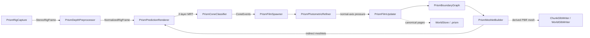

# Cone-PRISM-Q3 code graph

<!-- Generated by Tools/generate_code_graph.py; do not edit manually. -->

Source digest: `bb6fc9b1fb2e826e9d1162816d5178957ca662006670ae26ae2fd9b9b40ee45e`

Scope: 162 files, 2237 symbols, 1670 functions/methods, 189 GPU kernels, 17 event links.

## Runtime data flow

## DAG to code

| Run | Status | Mapped files |
|---|---|---:|
| Q3-01 | done | 7 |
| Q3-02 | done | 7 |
| Q3-03 | done | 4 |
| Q3-04 | done | 3 |
| Q3-05 | done | 4 |
| Q3-06 | done | 3 |
| Q3-07 | pending | 3 |
| Q3-08 | pending | 2 |
| Q3-09 | pending | 5 |
| Q3-10 | pending | 6 |
| Q3-11 | pending | 7 |
| Q3-12 | pending | 8 |
| Q3-13 | pending | 29 |
| Q3-14 | pending | 4 |
| Q3-15 | pending | 8 |
| Q3-15.5 | pending | 0 |
| Q3-15.6 | in_progress | 0 |
| Q3-16 | pending | 4 |
| Q3-17 | pending | 2 |
| Q3-18 | pending | 2 |
| Q3-19 | pending | 0 |
| Q3-20 | pending | 7 |
| Q3-21 | pending | 8 |
| Q3-22 | pending | 2 |

## Event links

- `AROcclusionManager.frameReceived` → `OnDepthFrame` ([Runtime/Core/DepthCapture.cs:220](../../Runtime/Core/DepthCapture.cs#L220))
- `RoomAnchorManager.RoomReady` → `OnRoomAnchorReady` ([Runtime/Core/RoomScanner.cs:235](../../Runtime/Core/RoomScanner.cs#L235))
- `RoomUnderstanding.AnchorsChanged` → `OnMrukAnchorsChanged` ([Runtime/Core/RoomScanner.cs:816](../../Runtime/Core/RoomScanner.cs#L816))
- `SceneObjectRegistry.ObjectAdded` → `OnObjectAdded` ([Runtime/Modules/SceneObjectVisualizer.cs:59](../../Runtime/Modules/SceneObjectVisualizer.cs#L59))
- `PrismPredictionRenderer.PredictionReady` → `OnPrediction` ([Runtime/Prism/Association/PrismConeClassifier.cs:128](../../Runtime/Prism/Association/PrismConeClassifier.cs#L128))
- `DepthCapture.RawStereoFrameReceived` → `OnRawStereoDepthFrame` ([Runtime/Prism/Capture/PrismRigCapture.cs:91](../../Runtime/Prism/Capture/PrismRigCapture.cs#L91))
- `PrismFilmUpdater.UpdateCompleted` → `OnFilmUpdateCompleted` ([Runtime/Prism/Geometry/PrismBoundaryGraph.cs:147](../../Runtime/Prism/Geometry/PrismBoundaryGraph.cs#L147))
- `PrismBoundaryGraph.BoundariesUpdated` → `OnBoundariesUpdated` ([Runtime/Prism/Geometry/PrismDisplacementTopology.cs:213](../../Runtime/Prism/Geometry/PrismDisplacementTopology.cs#L213))
- `PrismConeClassifier.EventsReady` → `OnConeEvents` ([Runtime/Prism/Geometry/PrismFilmSpawner.cs:213](../../Runtime/Prism/Geometry/PrismFilmSpawner.cs#L213))
- `PrismFilmSpawner.SpawnCompleted` → `OnConeEvents` ([Runtime/Prism/Geometry/PrismFilmUpdater.cs:132](../../Runtime/Prism/Geometry/PrismFilmUpdater.cs#L132))
- `PrismFilmSpawner.FilmsMutated` → `OnFilmsMutated` ([Runtime/Prism/Geometry/PrismMeshletBuilder.cs:234](../../Runtime/Prism/Geometry/PrismMeshletBuilder.cs#L234))
- `PrismDepthPreprocessor.FrameReady` → `OnDepthFrame` ([Runtime/Prism/Geometry/PrismPredictionRenderer.cs:124](../../Runtime/Prism/Geometry/PrismPredictionRenderer.cs#L124))
- `PrismDepthPreprocessor.FrameReady` → `ExecuteFrame` ([Runtime/Prism/PrismGpuWorkGraph.cs:61](../../Runtime/Prism/PrismGpuWorkGraph.cs#L61))
- `SubmapManager.RolloverRequested` → `OnRolloverRequested` ([Runtime/World/PrismChunkResidencyManager.cs:60](../../Runtime/World/PrismChunkResidencyManager.cs#L60))
- `SubmapManager.ActiveChunkChanged` → `OnActiveChunkChanged` ([Runtime/World/PrismChunkResidencyManager.cs:61](../../Runtime/World/PrismChunkResidencyManager.cs#L61))
- `RoomScanner.ScanStopped` → `OnScanStopped` ([Runtime/World/PrismChunkResidencyManager.cs:62](../../Runtime/World/PrismChunkResidencyManager.cs#L62))
- `RoomScanner.ScanAnchorCreated` → `OnScanAnchorCreated` ([Runtime/World/SubmapManager.cs:113](../../Runtime/World/SubmapManager.cs#L113))

## Files and symbols

### `Editor/GlbInteroperabilityFixtureBuilder.cs`

`Build` (method, L12), `GlbInteroperabilityFixtureBuilder` (class, L10), `WriteChunk` (method, L52)

### `Editor/MetaVrManifestPostprocessor.cs`

`FindVersion` (method, L75), `MetaVrManifestPostprocessor` (class, L18), `OnPostGenerateGradleAndroidProject` (method, L22), `UpgradeGeneratedManifest` (method, L35)

### `Editor/RoomScanSetupWizard.AIDetection.cs`

`AssignDepthProjectionShader` (method, L127), `AssignNmsShader` (method, L115), `CheckAIDetectionAnyMissing` (method, L53), `DrawAIDetectionOptionalStatus` (method, L41), `DrawAIDetectionShaderStatus` (method, L58), `RefreshAIDetection` (method, L22), `RoomScanSetupWizard` (class, L8), `SetupAIDetectionIfAvailable` (method, L83), `SetupAIDetectionModule` (method, L139), `WireAIDetectionComponent` (method, L92), `WireAIDetectionComponents` (method, L77)

### `Editor/RoomScanSetupWizard.Automation.cs`

`BuildQuestInfiniteScanSmokeApk` (method, L124), `PrepareQuestInfiniteScanSmokeProject` (method, L24), `PrepareSmokeProjectAsync` (method, L32), `RoomScanSetupWizard` (class, L20)

### `Editor/RoomScanSetupWizard.BuildProfile.cs`

`FindMetaQuestClassicProfile` (method, L151), `IsActiveProfileMetaQuest` (method, L193), `MetaQuestGuid` (method, L139), `ResolveBuildProfileApi` (method, L60), `RoomScanSetupWizard` (class, L41), `TryActivateMetaQuestProfile` (method, L216)

### `Editor/RoomScanSetupWizard.BuildingBlocks.cs`

`BlockSpec` (struct, L33), `EnsureRequiredBuildingBlocksAsync` (method, L201), `GetBlockDataReflective` (method, L183), `InstallBlockReflective` (method, L188), `ReadOvrManagerStartupPermFlag` (method, L109), `ResolveBuildingBlocksApi` (method, L136), `RoomScanSetupWizard` (class, L26), `WriteOvrManagerStartupPermFlag` (method, L115)

### `Editor/RoomScanSetupWizard.URP.cs`

`AllQualityLevelsUseUrp` (method, L50), `ApplyQuestFriendlyDefaults` (method, L177), `AssignToAllQualityLevels` (method, L216), `CreateURPPipelineAsset` (method, L112), `EnsureURPSetup` (method, L75), `RoomScanSetupWizard` (class, L35)

### `Editor/RoomScanSetupWizard.VRProject.cs`

`BuildTooltip` (method, L188), `DrawVRProjectSection` (method, L59), `RefreshVRProject` (method, L31), `RoomScanSetupWizard` (class, L13), `RunFixAsync` (method, L124), `SafeRead` (method, L193)

### `Editor/RoomScanSetupWizard.cs`

`AreFieldsAssigned` (method, L1587), `CheckAIDetectionAnyMissing` (method, L154), `DeepFind` (method, L1610), `DrawAIDetectionOptionalStatus` (method, L153), `DrawAIDetectionShaderStatus` (method, L155), `DrawVRProjectSection` (method, L162), `EndSection` (method, L1519), `EnsureDebugMenuAssets` (method, L1645), `EnsureOwnedQuestManifest` (method, L406), `EnsureQuestVRManifest` (method, L497), `EnsureRoomScanIdentityTransform` (method, L731), `EnsureVRInput` (method, L1279), `FindByName` (method, L1599), `FindComponentByTypeName` (method, L1576), `FindOrCreatePanelSettings` (method, L1692), `FixGameReadyModules` (method, L1028), `LoadQuestManifestDocuments` (method, L381), `ManifestFeature` (struct, L327), `ManifestHasAllQuestVREntries` (method, L443), `MarkDirty` (method, L1624), `Open` (method, L72), `RefreshAIDetection` (method, L152), `RefreshVRProject` (method, L161), `RoomScanSetupWizard` (class, L21), `SceneRoots` (method, L1621), `SetAttribute` (method, L431), `SetBool` (method, L1316), `SetPanelRenderModeWorldSpace` (method, L1633), `SetupAIDetectionIfAvailable` (method, L157), `SetupEverything` (method, L1438), `WireAIDetectionComponents` (method, L156), `WireComponent` (method, L1382)

### `Editor/RoomScannerEditor.cs`

`OnInspectorGUI` (method, L26), `RoomScannerEditor` (class, L16)

### `Editor/VRProjectBootstrap.cs`

`AnyFeatureEnabled` (method, L643), `Audit` (method, L84), `BuildChecks` (method, L201), `CheckResult` (enum, L36), `CheckSeverity` (enum, L35), `DescribeFeature` (method, L630), `DescribeLoaders` (method, L544), `DescribeTouchProfiles` (method, L667), `EnsureOpenXRLoader` (method, L590), `FixAllAsync` (method, L135), `GetOrCreateXRPerBuildTarget` (method, L564), `GetXRManager` (method, L553), `IsFeatureEnabled` (method, L637), `MakeArm64Check` (method, L419), `MakeMinSdkCheck` (method, L431), `MakeOpenXRFeatureCheck` (method, L616), `MakeOvrConfigEnumCheck` (method, L681), `MakeScriptingBackendCheck` (method, L405), `MakeStereoRenderingCheck` (method, L485), `MakeTargetSdkCheck` (method, L443), `MakeTextureCompressionAstcCheck` (method, L502), `MakeVulkanOnlyCheck` (method, L461), `MakeXRLoaderCheck` (method, L530), `RequireQuestScanningFeatures` (method, L100), `SetFeatureEnabled` (method, L650), `VRCheck` (class, L37), `VRProjectBootstrap` (class, L49)

### `Runtime/Camera/ICameraProvider.cs`

`ICameraProvider` (interface, L10)

### `Runtime/Camera/PassthroughCameraProvider.cs`

`ApplyConfiguration` (method, L214), `ConfigurationMatches` (method, L221), `CreateOwnedPca` (method, L199), `FindForEye` (method, L228), `OnDestroy` (method, L194), `PassthroughCameraProvider` (class, L24), `RequestCameraPermissionAsync` (method, L89), `StartCapture` (method, L116), `StopCapture` (method, L184)

### `Runtime/Camera/WebCamProvider.cs`

`OnDestroy` (method, L71), `StartCapture` (method, L50), `StopCapture` (method, L65), `WebCamProvider` (class, L10)

### `Runtime/CameraDebugOverlay.cs`

`CameraDebugOverlay` (class, L10), `CreateCanvas` (method, L37), `LateUpdate` (method, L85), `OnDestroy` (method, L122), `Start` (method, L22)

### `Runtime/Core/ComputeKernelHelper.cs`

`ComputeKernelHelper` (struct, L9), `DispatchFit` (method, L36), `DispatchFit` (method, L44), `DispatchFit` (method, L54), `Set` (method, L21), `Set` (method, L26), `Set` (method, L31)

### `Runtime/Core/DepthCapture.cs`

`Awake` (method, L44), `CheckPermissionAndEnable` (method, L166), `DepthCapture` (class, L20), `EnsureArSession` (method, L157), `OnApplicationPause` (method, L90), `OnDepthFrame` (method, L126), `OnDestroy` (method, L105), `OnDisable` (method, L100), `ReleaseResources` (method, L83), `Start` (method, L49), `StartDepthCapture` (method, L69), `StopDepthCapture` (method, L77), `StopProvider` (method, L225), `SubscribeAndRun` (method, L211), `Update` (method, L113), `VerifyProviderAsync` (method, L185)

### `Runtime/Core/GpuResourceRetirementQueue.cs`

`DestroyOwned` (method, L140), `DrainAndWait` (method, L114), `DrainCompleted` (method, L91), `Entry` (struct, L15), `GpuResourceRetirementQueue` (class, L13), `Release` (method, L132), `RetireAfterCurrentGpuWork` (method, L39), `RetireAfterCurrentGpuWork` (method, L66)

### `Runtime/Core/IRoomScanModule.cs`

`IRoomScanModule` (interface, L8)

### `Runtime/Core/RoomAnchorManager.cs`

`Awake` (method, L38), `ComputeRelocationMatrix` (method, L138), `ComputeRelocationMatrix` (method, L151), `DetachChildrenForReparent` (method, L376), `EraseSpatialAnchorAsync` (method, L344), `GetRoomLocalToWorldForPersistence` (method, L130), `LoadSpatialAnchorAsync` (method, L282), `OnDestroy` (method, L69), `OnModuleInitialize` (method, L22), `OnSceneLoaded` (method, L77), `RoomAnchorManager` (class, L16), `StabilizeAnchorTransform` (method, L389), `Start` (method, L43)

### `Runtime/Core/RoomScanner.cs`

`ApplyRenderMode` (method, L840), `Awake` (method, L204), `CacheComponents` (method, L249), `ClearAllDataAsync` (method, L704), `ClearScan` (method, L687), `CompleteRoomStartup` (method, L316), `ConfigurePrismChunk` (method, L531), `CreateScanAnchorAsync` (method, L470), `CycleRenderMode` (method, L753), `GetActiveCameraProvider` (method, L851), `IsModeAvailable` (method, L767), `ObserveStart` (method, L650), `OnDisable` (method, L323), `OnMrukAnchorsChanged` (method, L826), `OnRoomAnchorReady` (method, L240), `PausePrismForResidency` (method, L520), `PausePrismPipeline` (method, L603), `PopulateSceneObjectRegistry` (method, L803), `PreparePrismPipeline` (method, L545), `ReleaseScanResources` (method, L671), `ResumePrismAfterResidency` (method, L526), `RoomScanner` (class, L44), `ScanLifecycleState` (enum, L28), `ScanRenderMode` (enum, L13), `SetCameraProvider` (method, L787), `SetRenderMode` (method, L737), `SetSafeShaderDefaults` (method, L832), `SetSceneObjectRegistry` (method, L793), `ShutdownPrismPipeline` (method, L613), `Start` (method, L212), `StartPrismCapture` (method, L588), `StartScanningAsync` (method, L383), `StartScanningCoreAsync` (method, L396), `StopScanning` (method, L486), `SubscribeToAnchorsChanged` (method, L812), `ToggleDebugMenu` (method, L779), `ToggleScanning` (method, L638), `UnsubscribeFromAnchorsChanged` (method, L819), `Update` (method, L331)

### `Runtime/Core/RoomSpaceRoot.cs`

`Adopt` (method, L186), `AdoptAtRoomOrigin` (method, L200), `AttachToRoot` (method, L226), `Awake` (method, L97), `OnDestroy` (method, L111), `Reframe` (method, L141), `RoomSpaceRoot` (class, L58), `SetAnchorOverride` (method, L278), `Update` (method, L116), `WaitForBindAsync` (method, L252)

### `Runtime/Core/XRRuntimeGuard.cs`

`XRRuntimeGuard` (class, L19)

### `Runtime/Data/SceneObject.cs`

`SceneObject` (class, L20), `SceneObjectSource` (enum, L7)

### `Runtime/DepthDebugOverlay.cs`

`CreateCanvas` (method, L43), `DepthDebugOverlay` (class, L6), `LateUpdate` (method, L92), `OnDestroy` (method, L130), `Start` (method, L30)

### `Runtime/Detection/IDetectionModel.cs`

`Detection` (struct, L12), `IDetectionModel` (interface, L31)

### `Runtime/Export/ChunkGlbExporter.cs`

`ChunkGlbExportFailure` (enum, L10), `ChunkGlbExportResult` (class, L21), `ChunkGlbExporter` (class, L36), `ClassifyPromotionFailure` (method, L338), `ExportRefinedAsync` (method, L60), `Failed` (method, L352), `Generate` (method, L148), `GeneratedFile` (class, L44), `PromotionResult` (class, L54), `SourceSet` (class, L38), `Stage` (method, L244), `TryDeleteDirectory` (method, L359), `TryFindCurrentArtifact` (method, L288), `TryResolveSources` (method, L255), `ValidatePreflight` (method, L317)

### `Runtime/Export/ChunkGlbWriter.cs`

`Align4` (method, L588), `Align4` (method, L590), `AppendAccessor` (method, L524), `AppendBufferView` (method, L545), `BuildJson` (method, L456), `BuildTangentAccumulators` (method, L315), `ChunkGlbExportData` (class, L11), `ChunkGlbWriteOptions` (class, L29), `ChunkGlbWriteResult` (class, L35), `ChunkGlbWriter` (class, L72), `ConvertVector` (method, L442), `EscapeJson` (method, L555), `FallbackTangent` (method, L445), `IsFinite` (method, L591), `IsFinite` (method, L594), `IsFinite` (method, L597), `JsonFloat` (method, L581), `Layout` (class, L600), `PadBinary` (method, L430), `TryCreate` (method, L618), `TryValidateTexture` (method, L296), `TryWrite` (method, L83), `Validate` (method, L231), `WriteIndices` (method, L417), `WriteNormals` (method, L365), `WritePositions` (method, L351), `WriteTangents` (method, L379), `WriteTexCoords` (method, L404)

### `Runtime/Export/DeterministicPngWriter.cs`

`Begin` (method, L279), `BuildTable` (method, L289), `Crc32` (class, L275), `DeterministicPngWriter` (class, L14), `End` (method, L281), `Fill` (method, L248), `FilteredRgbaSource` (class, L233), `TryGetEncodedLength` (method, L22), `TryWriteRgba8` (method, L51), `Update` (method, L282), `UpdateAdler` (method, L200), `ValidateDimensions` (method, L159), `WriteAndCrc` (method, L193), `WriteBigEndian` (method, L218), `WriteBigEndian` (method, L225), `WriteChunk` (method, L180)

### `Runtime/Export/GlbCompressionNegotiation.cs`

`Failure` (method, L125), `GlbCompressionNegotiator` (class, L46), `GlbCompressionRequest` (class, L12), `GlbCompressionRequirement` (enum, L6), `GlbCompressionRuntimeCapabilities` (class, L27), `GlbCompressionSelection` (class, L35), `Negotiate` (method, L51), `Resolve` (method, L103)

### `Runtime/Export/GlbExportController.cs`

`CopyImmutable` (method, L211), `End` (method, L200), `ExportActiveChunkAsync` (method, L55), `ExportWorldAsync` (method, L102), `Fail` (method, L193), `GlbExportController` (class, L21), `GlbUserExportResult` (class, L11), `MaterialOptions` (method, L179), `OnDestroy` (method, L48), `OnModuleInitialize` (method, L39), `SetStatus` (method, L205), `Succeed` (method, L186), `TryBegin` (method, L147)

### `Runtime/Export/RefinedTextureResult.cs`

`RefinedTextureResult` (struct, L9)

### `Runtime/Export/WorldGlbExporter.cs`

`AppendMatrix` (method, L385), `BuildManifestJson` (method, L321), `EnsureFrozen` (method, L279), `EnsureWorldStillFrozen` (method, L288), `ExportAsync` (method, L65), `ExportedChunk` (class, L55), `Failed` (method, L418), `FrozenChunk` (class, L47), `ToLowerHex` (method, L410), `TryDeleteDirectory` (method, L430), `TryDeleteFile` (method, L423), `ValidatePreflight` (method, L215), `WorldGlbExportOptions` (class, L14), `WorldGlbExportResult` (class, L21), `WorldGlbExporter` (class, L43), `WriteDurableUtf8` (method, L401)

### `Runtime/Export/WorldGlbWriter.cs`

`Align4` (method, L502), `Align4` (method, L504), `AppendAccessor` (method, L471), `AppendBufferView` (method, L492), `AppendMatrix` (method, L454), `BuildJson` (method, L316), `ChunkName` (method, L443), `IsFinite` (method, L505), `IsFinite` (method, L507), `IsFinite` (method, L509), `QuaternionLengthSquared` (method, L511), `ReceiptRangeIsValid` (method, L313), `SourceLayout` (class, L56), `ToGltfMatrix` (method, L447), `TryValidateChunkGlb` (method, L256), `TryWrite` (method, L63), `Validate` (method, L193), `WorldGlbChunkInput` (class, L17), `WorldGlbWriteOptions` (class, L25), `WorldGlbWriteResult` (class, L35), `WorldGlbWriter` (class, L50)

### `Runtime/Modules/KeyframeCollector.cs`

`ClearInMemory` (method, L372), `ConfigureDirectory` (method, L137), `ConvertWorldPoseToFrame` (method, L360), `FindNextFrameId` (method, L378), `Finite` (method, L399), `KeyframeCollector` (class, L20), `OnReadbackComplete` (method, L229), `QueueKeyframeWrite` (method, L261), `SaveCapturedKeyframe` (method, L328), `SetChunkContext` (method, L99), `SetExportDirectory` (method, L84), `ShouldCapture` (method, L217), `Start` (method, L71), `TrySaveKeyframe` (method, L159), `TryUpdateChunkWorldPose` (method, L121), `WaitForPendingWritesAsync` (method, L346)

### `Runtime/Modules/RoomUnderstanding.cs`

`ClassifyAnchor` (method, L439), `ClassifyFromMRUK` (method, L392), `ClassifyFromNormals` (method, L408), `EnsureRoom` (method, L313), `FindWallHorizontalRight` (method, L274), `GetAnchorLabel` (method, L289), `GetFloorPlane` (method, L122), `GetFurnitureBounds` (method, L136), `GetPerVertexSurfaceTypes` (method, L73), `GetSurfaceType` (method, L51), `GetWallPlanes` (method, L94), `IsFurniture` (method, L458), `IsWall` (method, L456), `OnAnchorCreated` (method, L373), `OnDestroy` (method, L387), `OnModuleInitialize` (method, L28), `OnRoomCreatedOrUpdated` (method, L360), `PopulateRegistry` (method, L165), `RefreshRoom` (method, L381), `RoomUnderstanding` (class, L25), `SubscribeToRoomEvents` (method, L328), `SurfaceType` (enum, L11), `UnsubscribeFromRoomEvents` (method, L344)

### `Runtime/Modules/SceneObjectRegistry.cs`

`Add` (method, L24), `AssociateMeshVertices` (method, L129), `Clear` (method, L182), `FindByLabel` (method, L57), `FindBySource` (method, L71), `FindBySurface` (method, L83), `FindClosest` (method, L95), `FindInRadius` (method, L112), `FromJson` (method, L213), `Relocate` (method, L158), `RemoveBySource` (method, L170), `SceneObjectRegistry` (class, L12), `SerializedRegistry` (class, L203), `ToJson` (method, L207), `TryGet` (method, L53), `Update` (method, L39), `UpdateCounts` (method, L190)

### `Runtime/Modules/SceneObjectVisualizer.cs`

`BillboardLabel` (class, L160), `CreateLabel` (method, L121), `CreateWireBox` (method, L78), `GetWireMaterial` (method, L133), `Hide` (method, L32), `Init` (method, L164), `LateUpdate` (method, L205), `OnDestroy` (method, L148), `OnObjectAdded` (method, L45), `Rebuild` (method, L51), `SceneObjectVisualizer` (class, L12), `SetShader` (method, L23), `Show` (method, L25), `SpawnAnnotation` (method, L64)

### `Runtime/Prism/Association/ConeEventFrame.cs`

`CommitGpuWrite` (method, L159), `CommitGpuWrite` (method, L78), `ConeEventBufferRing` (class, L94), `ConeEventClass` (enum, L8), `ConeEventFrameLease` (class, L45), `ConeEventGpu` (struct, L21), `Destroy` (method, L215), `Dispose` (method, L187), `Dispose` (method, L80), `EnsureBuffers` (method, L198), `FencePassed` (method, L230), `Get` (method, L148), `NextGeneration` (method, L237), `Release` (method, L178), `Retain` (method, L172), `Retain` (method, L71), `Slot` (class, L97), `TryBegin` (method, L120)

### `Runtime/Prism/Association/PrismConeClassifier.cs`

`BindCanonicalBoundaries` (method, L226), `BindTextures` (method, L238), `CeilDiv` (method, L271), `OnDestroy` (method, L145), `OnPrediction` (method, L147), `PrismConeClassifier` (class, L13), `StartClassifying` (method, L103), `StopClassifying` (method, L133), `TryAcquireLatest` (method, L92), `TryClassifyFrame` (method, L150)

### `Runtime/Prism/Calibration/ConeLutResources.cs`

`Acquire` (method, L118), `Build` (method, L157), `CeilDiv` (method, L244), `ConeLutLease` (class, L30), `ConeProjectionLut` (class, L11), `Create` (method, L108), `CreateTexture` (method, L198), `Destroy` (method, L187), `DestroyProjection` (method, L224), `DestroyTexture` (method, L233), `Dispose` (method, L52), `Get` (method, L148), `Get` (method, L43), `Release` (method, L139), `Retain` (method, L132), `Retain` (method, L45), `Retire` (method, L124), `RigConeLutSet` (class, L65)

### `Runtime/Prism/Calibration/ConeProjectionMath.cs`

`ConeProjectionMath` (class, L31), `MetricConeFootprint` (struct, L10), `RayAtImagePoint` (method, L108), `TryReproject` (method, L93), `TrySurfaceFootprint` (method, L38), `TryWorldToPixel` (method, L69)

### `Runtime/Prism/Calibration/RigCalibration.cs`

`Get` (method, L73), `IsCompatible` (method, L82), `Projection` (method, L117), `RigCalibration` (class, L45), `RigLensModel` (enum, L13), `RigProjection` (enum, L6), `RigProjectionCalibration` (struct, L19), `TryCreate` (method, L94)

### `Runtime/Prism/Capture/GpuTextureRing.cs`

`CopyOnGpu` (method, L315), `DestroySlot` (method, L360), `Dispose` (method, L204), `Dispose` (method, L50), `EnsureCompatibleTarget` (method, L242), `FencePassed` (method, L228), `GetTexture` (method, L180), `GetVolumeDepth` (method, L287), `GpuTextureCopyMode` (enum, L8), `GpuTextureLease` (class, L18), `GpuTextureRing` (class, L65), `IsSupportedDimension` (method, L296), `NextGeneration` (method, L358), `Release` (method, L192), `Retain` (method, L186), `Retain` (method, L42), `Slot` (class, L67), `TargetDimension` (method, L305), `TargetFormat` (method, L310), `TryCopy` (method, L112), `ValidateLease` (method, L218)

### `Runtime/Prism/Capture/PrismRigCapture.cs`

`CaptureRgb` (method, L170), `EnsureRuntimeObjects` (method, L155), `FreezeSessionIntrinsics` (method, L294), `LateUpdate` (method, L118), `OnDestroy` (method, L142), `OnRawStereoDepthFrame` (method, L223), `PrismRigCapture` (class, L13), `PublishAvailableFrames` (method, L284), `ReportLocalRejection` (method, L376), `ResolveEye` (method, L320), `StartCapture` (method, L72), `StopCapture` (method, L97), `TryAcquireLatest` (method, L61)

### `Runtime/Prism/Capture/RawStereoDepthFrame.cs`

`IsFinite` (method, L40), `IsFinite` (method, L48), `RawStereoDepthFrame` (struct, L10)

### `Runtime/Prism/Capture/RigCalibrationMath.cs`

`Add` (method, L187), `Add` (method, L190), `Add` (method, L193), `CombineSignatures` (method, L76), `ConeRayAtPixel` (method, L89), `ConeRayReference` (struct, L10), `FromDepthFov` (method, L55), `FromPassthrough` (method, L31), `IntrinsicsToFov` (method, L158), `ProjectionDepth01FromViewZ` (method, L119), `RangeFromProjectionDepth01` (method, L141), `RayAtImagePoint` (method, L150), `RigCalibrationMath` (class, L8), `Signature` (method, L168), `ViewZFromProjectionDepth01` (method, L130)

### `Runtime/Prism/Capture/RigCaptureContracts.cs`

`AbsoluteDeltaNanoseconds` (method, L91), `DestinationFromSource` (method, L388), `Dispose` (method, L371), `Equals` (method, L105), `Equals` (method, L150), `Equals` (method, L156), `Equals` (method, L99), `EquivalentRange` (method, L232), `FiniteRasterFar` (method, L246), `FromUnixDateTime` (method, L84), `FromViews` (method, L269), `GetHashCode` (method, L107), `GetHashCode` (method, L158), `GpuImageView` (struct, L165), `IsFinite` (method, L211), `IsFinite` (method, L214), `IsValid` (method, L225), `IsValidRange` (method, L227), `Retain` (method, L360), `RigClockDomain` (enum, L29), `RigDepthContract` (class, L223), `RigDepthEncoding` (enum, L20), `RigExtrinsicsSnapshot` (struct, L250), `RigEye` (enum, L7), `RigFrameRejectionReason` (enum, L39), `RigIntrinsics` (struct, L117), `RigPairingHealth` (struct, L284), `RigPoseMath` (class, L385), `RigStreamKind` (enum, L12), `RigTimestamp` (struct, L64), `StereoRigFrameLease` (class, L304), `ToString` (method, L111), `ViewMatches` (method, L238)

### `Runtime/Prism/Capture/RigClockMapper.cs`

`CreateRuntime` (method, L23), `RigClockMapper` (class, L10), `SecondsToNanoseconds` (method, L92), `TryCaptureAnchor` (method, L37), `TryMapXrTimestamp` (method, L68)

### `Runtime/Prism/Capture/RigFrameSynchronizer.cs`

`AbsoluteDelta` (method, L421), `AcceptReorderedTimestamp` (method, L308), `AddDepth` (method, L159), `AddRgb` (method, L135), `Compare` (method, L371), `Compare` (method, L382), `ContainsTimestamp` (method, L340), `ContainsTimestamp` (method, L344), `DepthTimestampComparer` (class, L377), `Dispose` (method, L235), `Dispose` (method, L26), `Dispose` (method, L68), `DropPastPublishedSamples` (method, L324), `FindEarliestCoherentTriplet` (method, L252), `Flush` (method, L228), `InsertSorted` (method, L348), `InsertSorted` (method, L358), `Midpoint` (method, L419), `MillisecondsToNanoseconds` (method, L416), `Reject` (method, L409), `RgbRigSample` (class, L7), `RgbTimestampComparer` (class, L367), `RigCaptureDiagnosticSnapshot` (struct, L75), `RigFrameSynchronizer` (class, L100), `StereoDepthRigSample` (class, L33), `TakeLease` (method, L19), `TakeLease` (method, L61), `TryDequeue` (method, L184), `ValidateIncoming` (method, L237)

### `Runtime/Prism/Geometry/ContactBoundaryPool.cs`

`BoundaryCurveCacheGpu` (struct, L105), `BoundaryCurveTopologyFlags` (enum, L25), `BoundaryCurveTopologyGpu` (struct, L69), `ContactBoundaryFlags` (enum, L9), `ContactBoundaryHeaderGpu` (struct, L39), `ContactBoundaryPool` (class, L132), `Dispose` (method, L169), `NextPowerOfTwo` (method, L185)

### `Runtime/Prism/Geometry/ContactDisplacementPool.cs`

`ContactDisplacementPool` (class, L125), `ContactTopologyEvidenceGpu` (struct, L60), `DisplacementCellGpu` (struct, L39), `DisplacementPageFlags` (enum, L9), `DisplacementPageHeaderGpu` (struct, L19), `Dispose` (method, L179), `TopologyBoundarySplitPlanGpu` (struct, L106), `TopologySplitRecordGpu` (struct, L75)

### `Runtime/Prism/Geometry/ContactFilmPool.cs`

`ContactFilmFlags` (enum, L9), `ContactFilmHeaderGpu` (struct, L27), `ContactFilmPool` (class, L94), `ContactFilmSlotFlags` (enum, L65), `ContactFilmSlotStateGpu` (struct, L80), `Dispose` (method, L141)

### `Runtime/Prism/Geometry/ContactMeshletBuffers.cs`

`Allocate` (method, L417), `ContactFilmMeshletRangeGpu` (struct, L148), `ContactMeshletBuffers` (class, L326), `ContactMeshletDescriptorFlags` (enum, L26), `ContactMeshletDescriptorGpu` (struct, L111), `ContactMeshletGenerationBuffers` (class, L171), `ContactMeshletVertexFlags` (enum, L15), `ContactMeshletVertexGpu` (struct, L48), `ContactMeshletViewBuffers` (class, L280), `ContactMeshletViewFlags` (enum, L38), `ContactMeshletViewLodGpu` (struct, L133), `CreateViewBuffers` (method, L385), `Dispose` (method, L253), `Dispose` (method, L308), `Dispose` (method, L411), `DisposeGenerations` (method, L431), `EnsureCapacity` (method, L354), `MarkPublishedMutation` (method, L401), `MarkPublishedRead` (method, L408), `MarkRead` (method, L247), `PackNormal` (method, L67), `Publish` (method, L391), `SetChunkTransform` (method, L388), `TryBeginBuild` (method, L372), `TryBeginPublishedWrite` (method, L378), `UnpackNormal` (method, L89)

### `Runtime/Prism/Geometry/PredictionFrame.cs`

`ArrayDescriptor` (method, L261), `CommitGpuWrite` (method, L133), `CommitGpuWrite` (method, L47), `Compatible` (method, L273), `CompatibleDepth` (method, L278), `CompatibleHiZ` (method, L283), `CreateColor` (method, L214), `CreateDepth` (method, L229), `CreateHiZ` (method, L244), `DestroySlot` (method, L296), `DestroyTexture` (method, L324), `Dispose` (method, L161), `Dispose` (method, L49), `EnsureTextures` (method, L172), `FencePassed` (method, L289), `Get` (method, L122), `NextGeneration` (method, L332), `PredictionFrameLease` (class, L8), `PredictionTargetRing` (class, L63), `Release` (method, L152), `Retain` (method, L146), `Retain` (method, L39), `Slot` (class, L66), `TryBegin` (method, L95)

### `Runtime/Prism/Geometry/PressureManifoldPool.cs`

`ContinuationEvidenceFlags` (enum, L100), `ContinuationEvidenceGpu` (struct, L262), `CrossChunkTopologyPortalFlags` (enum, L63), `CrossChunkTopologyPortalGpu` (struct, L331), `Dispose` (method, L520), `ElasticChartStateGpu` (struct, L289), `EvidenceAlignedSplitPlanGpu` (struct, L304), `FilmMembershipFlags` (enum, L43), `FilmMembershipGpu` (struct, L145), `FrontierLoopFlags` (enum, L88), `FrontierLoopGpu` (struct, L237), `NextPowerOfTwo` (method, L598), `PressureManifoldDiagnostic` (enum, L12), `PressureManifoldFlags` (enum, L33), `PressureManifoldHeaderGpu` (struct, L115), `PressureManifoldPool` (class, L361), `SupportContourPageGpu` (struct, L187), `SupportContourSegmentGpu` (struct, L167), `SurfaceHalfEdgeFlags` (enum, L75), `SurfaceHalfEdgeGpu` (struct, L206), `SurfaceHalfEdgeRelation` (enum, L52)

### `Runtime/Prism/Geometry/PrismBoundaryGraph.cs`

`AllocateFrameBuffers` (method, L292), `BindFrame` (method, L246), `BindPersistent` (method, L308), `CeilDiv` (method, L361), `ConfigureFrame` (method, L230), `DispatchBoundaries` (method, L197), `DisposeFrameBuffers` (method, L340), `Intrinsics` (method, L354), `OnDestroy` (method, L185), `OnFilmUpdateCompleted` (method, L194), `PoseMatrix` (method, L358), `PrismBoundaryGraph` (class, L15), `RebuildCanonicalIndex` (method, L154), `SetChunkFrame` (method, L106), `StartTracking` (method, L109), `StopTracking` (method, L177)

### `Runtime/Prism/Geometry/PrismDisplacementTopology.cs`

`AllocateTransientBuffers` (method, L366), `BindPersistent` (method, L407), `CeilDiv` (method, L553), `ConfigureFrame` (method, L325), `DispatchDisplacement` (method, L237), `DisposeTransientBuffers` (method, L520), `FindKernels` (method, L295), `OnBoundariesUpdated` (method, L234), `OnDestroy` (method, L226), `PoseMatrix` (method, L550), `PrismDisplacementTopology` (class, L15), `SetChunkFrame` (method, L180), `StartUpdating` (method, L183), `StopUpdating` (method, L218)

### `Runtime/Prism/Geometry/PrismEvidenceAlignedSplitter.cs`

`BindResources` (method, L196), `CeilDiv` (method, L332), `DispatchSplits` (method, L145), `FindKernels` (method, L178), `PrismEvidenceAlignedSplitter` (class, L14), `StartSplitting` (method, L114), `StopSplitting` (method, L143)

### `Runtime/Prism/Geometry/PrismFilmSpawner.cs`

`CeilDiv` (method, L707), `CeilLog2` (method, L710), `CompactAndFitComponents` (method, L569), `DispatchComponentReduction` (method, L471), `DispatchSpawn` (method, L241), `DisposeCandidateBuffers` (method, L674), `DisposeTileBuffers` (method, L625), `EnsureCandidateBuffers` (method, L640), `EnsureTileBuffers` (method, L609), `FindComponentKernels` (method, L435), `LateUpdate` (method, L236), `NextPowerOfTwo` (method, L722), `NotifyFilmsMutated` (method, L166), `OnConeEvents` (method, L238), `OnDestroy` (method, L226), `PoseMatrix` (method, L606), `PrismFilmSpawner` (class, L13), `SetChunkFrame` (method, L168), `StartSpawning` (method, L174), `StopSpawning` (method, L218), `UIntBuffer` (method, L671)

### `Runtime/Prism/Geometry/PrismFilmUpdater.cs`

`Allocate` (method, L232), `BindPersistent` (method, L251), `CeilDiv` (method, L311), `DispatchUpdate` (method, L154), `DisposeBuffers` (method, L293), `OnConeEvents` (method, L151), `OnDestroy` (method, L145), `PoseMatrix` (method, L308), `PrismFilmUpdater` (class, L15), `SetChunkFrame` (method, L94), `StartUpdating` (method, L97), `StopUpdating` (method, L137)

### `Runtime/Prism/Geometry/PrismMeshletBuilder.cs`

`Bind` (method, L402), `DispatchMaterialization` (method, L387), `EnsurePlanBuffers` (method, L701), `LateUpdate` (method, L263), `OnDestroy` (method, L248), `OnFilmsMutated` (method, L272), `PrismMeshletBuilder` (class, L15), `RequestBuild` (method, L289), `StartBuilding` (method, L169), `StopBuilding` (method, L240), `TryBuild` (method, L290), `TryIncrementalPublication` (method, L343), `TryInitialPublication` (method, L308)

### `Runtime/Prism/Geometry/PrismPredictionRenderer.cs`

`BindMeshlets` (method, L272), `BuildClipFromWorld` (method, L387), `BuildHiZ` (method, L342), `BuildView` (method, L289), `CeilDiv` (method, L375), `EnsureViewBuffers` (method, L280), `OnDepthFrame` (method, L156), `OnDestroy` (method, L143), `PrismPredictionRenderer` (class, L14), `SetMrt` (method, L378), `StartRendering` (method, L86), `StopRendering` (method, L129), `TryAcquireLatest` (method, L75), `TryRenderFrame` (method, L159)

### `Runtime/Prism/Geometry/PrismPressureManifoldAtlas.cs`

`BindBoundaryCurveResources` (method, L686), `BindContourResources` (method, L533), `BindElasticResources` (method, L771), `BindHalfEdgeResources` (method, L594), `BindPortalResources` (method, L849), `CeilDiv` (method, L921), `CeilLog2` (method, L924), `DispatchAtlas` (method, L318), `FindKernels` (method, L449), `OnDestroy` (method, L295), `PrepareRestoredResidency` (method, L308), `PrismPressureManifoldAtlas` (class, L14), `ResetEmptyResidency` (method, L297), `SetChunkFrame` (method, L290), `StartAtlas` (method, L230), `StopAtlas` (method, L283)

### `Runtime/Prism/Geometry/PrismWorldMeshletRenderer.cs`

`CollectRetired` (method, L299), `CreateMaterial` (method, L339), `DestroyResource` (method, L368), `DispatchViewCull` (method, L207), `DisposeView` (method, L318), `Draw` (method, L170), `EnsureDisabledHiZ` (method, L325), `EnsureView` (method, L269), `LateUpdate` (method, L154), `OnDestroy` (method, L346), `OnEnable` (method, L87), `PrismWorldMeshletRenderer` (class, L17), `RegisterResident` (method, L131), `RemoveResident` (method, L141), `Render` (method, L283), `Retire` (method, L312), `SetActive` (method, L125), `SetResidentTransform` (method, L147)

### `Runtime/Prism/Preprocessing/NormalizedDepthFrame.cs`

`CommitGpuWrite` (method, L160), `CommitGpuWrite` (method, L63), `Compatible` (method, L289), `CreateArrayTexture` (method, L240), `DestroySlot` (method, L297), `DestroyTexture` (method, L313), `Dispose` (method, L195), `Dispose` (method, L65), `EnsureTextures` (method, L209), `FencePassed` (method, L281), `GetBoundaryEvidence` (method, L157), `GetConsensusDepth` (method, L151), `GetFlags` (method, L148), `GetLocalNormal` (method, L154), `GetMetricDepth` (method, L145), `NextGeneration` (method, L324), `NormalizedDepthFlags` (enum, L9), `NormalizedDepthRing` (class, L82), `NormalizedRigFrameLease` (class, L22), `Release` (method, L183), `Retain` (method, L177), `Retain` (method, L55), `Slot` (class, L85), `TryBegin` (method, L111), `Validate` (method, L268)

### `Runtime/Prism/Preprocessing/PrismDepthPreprocessor.cs`

`BindSharedTextures` (method, L381), `CacheCalibrationUniforms` (method, L413), `CeilDiv` (method, L328), `ComputeMotionUncertainty` (method, L434), `DepthPreprocessDiagnosticSnapshot` (struct, L7), `DispatchConsensusNormalsAndBoundaries` (method, L331), `EnsureCalibration` (method, L271), `EnsureStatisticsBuffers` (method, L396), `FillIntrinsics` (method, L404), `MarkWorkGraphSubmitted` (method, L313), `OnDestroy` (method, L187), `PoseMatrix` (method, L468), `PrismDepthPreprocessor` (class, L30), `ProcessRigFrame` (method, L209), `StartProcessing` (method, L131), `StopProcessing` (method, L167), `TryAcquireLatest` (method, L120), `Update` (method, L196), `WorkGraphFencePassed` (method, L301)

### `Runtime/Prism/PrismGpuWorkGraph.cs`

`ExecuteFrame` (method, L74), `OnDestroy` (method, L72), `PrismGpuWorkGraph` (class, L14), `StartGraph` (method, L34), `StopGraph` (method, L64)

### `Runtime/Prism/Refinement/PrismInformationGainKeyframeIngress.cs`

`BindCommon` (method, L187), `CeilDiv` (method, L262), `Dispatch` (method, L130), `Dispose` (method, L240), `DisposeBuffers` (method, L248), `Ensure` (method, L90), `FindKernels` (method, L227), `PrismInformationGainKeyframeIngress` (class, L12), `Reset` (method, L114), `SetCapacities` (method, L221)

### `Runtime/Prism/Refinement/PrismPhotometricRefiner.cs`

`BindPersistent` (method, L401), `CeilDiv` (method, L483), `ConfigureFrame` (method, L340), `DispatchPhotometricPressure` (method, L203), `DisposeBuffers` (method, L445), `EnsureBuffers` (method, L251), `Intrinsics` (method, L476), `LateUpdate` (method, L195), `OnDestroy` (method, L197), `PhotometricPressureGpu` (struct, L10), `PoseMatrix` (method, L480), `PrismPhotometricRefiner` (class, L49), `ResetHistoryState` (method, L325), `SetChunkFrame` (method, L155), `StartRefining` (method, L164), `StopRefining` (method, L187), `TemporalRgbViewGpu` (struct, L28)

### `Runtime/Resources/Prism/BoundaryCurveAtlasAbi.hlsl`

`AtlasContactBoundaryHeader` (struct, L3), `BoundaryCurveCache` (struct, L27), `BoundaryCurveTopology` (struct, L12)

### `Runtime/Resources/Prism/BoundaryCurveUpdate.compute`

`ActiveEdge` (gpu_function, L113), `BoundaryHashEntry` (struct, L8), `BoundaryHashKey` (gpu_function, L67), `ClaimBoundaryHalfEdges` (gpu_function, L252), `ClearHalfEdgeBoundaryClaims` (gpu_function, L246), `CommitBoundaryCurves` (gpu_function, L314), `FillCurveCache` (gpu_function, L192), `FilmPoint` (gpu_function, L76), `FilmUv` (gpu_function, L81), `FindBoundaryHalfEdge` (gpu_function, L135), `HashCell` (gpu_function, L53), `InsertBoundaryHash` (gpu_function, L220), `PointSegmentDistance` (gpu_function, L127), `Segment` (gpu_function, L190), `UvCubic` (gpu_function, L104), `WorldCell` (gpu_function, L62), `WorldControl` (gpu_function, L89), `WorldCubic` (gpu_function, L95), `if` (gpu_function, L439), `ClaimBoundaryHalfEdges` (gpu_kernel, L2), `ClearHalfEdgeBoundaryClaims` (gpu_kernel, L1), `CommitBoundaryCurves` (gpu_kernel, L3)

### `Runtime/Resources/Prism/ChunkStage.compute`

`ClearFilmRemap` (gpu_function, L182), `ClearPageRemap` (gpu_function, L281), `ContactBoundaryHeader` (struct, L28), `ContactFilmHeader` (struct, L13), `ContactMeshletDescriptor` (struct, L64), `ContactTopologyEvidence` (struct, L54), `CopyBasePages` (gpu_function, L335), `CopyMicroPages` (gpu_function, L364), `DisplacementCell` (struct, L46), `DisplacementPageHeader` (struct, L37), `FilmSlotState` (struct, L74), `FinalizeChunkStage` (gpu_function, L471), `IndexBasePages` (gpu_function, L292), `IndexMicroPages` (gpu_function, L313), `PatchFilmDisplacement` (gpu_function, L409), `PrepareChunkStage` (gpu_function, L147), `StageBoundaries` (gpu_function, L250), `StageFilms` (gpu_function, L189), `StageMeshlets` (gpu_function, L424), `ClearFilmRemap` (gpu_kernel, L2), `ClearPageRemap` (gpu_kernel, L5), `CopyBasePages` (gpu_kernel, L8), `CopyMicroPages` (gpu_kernel, L9), `FinalizeChunkStage` (gpu_kernel, L12), `IndexBasePages` (gpu_kernel, L6), `IndexMicroPages` (gpu_kernel, L7), `PatchFilmDisplacement` (gpu_kernel, L10), `PrepareChunkStage` (gpu_kernel, L1), `StageBoundaries` (gpu_kernel, L4), `StageFilms` (gpu_kernel, L3), `StageMeshlets` (gpu_kernel, L11)

### `Runtime/Resources/Prism/ChunkTopologyStage.compute`

`PrepareTopologyStage` (gpu_function, L68), `StageBoundaryTopology` (gpu_function, L172), `StageContourPages` (gpu_function, L131), `StageContourTopology` (gpu_function, L143), `StageCrossChunkPortals` (gpu_function, L187), `StageFilmTopology` (gpu_function, L106), `StageFrontierLoops` (gpu_function, L163), `StageManifoldHeaders` (gpu_function, L98), `StagedFilmIsActive` (gpu_function, L60), `PrepareTopologyStage` (gpu_kernel, L1), `StageBoundaryTopology` (gpu_kernel, L7), `StageContourPages` (gpu_kernel, L4), `StageContourTopology` (gpu_kernel, L5), `StageCrossChunkPortals` (gpu_kernel, L8), `StageFilmTopology` (gpu_kernel, L3), `StageFrontierLoops` (gpu_kernel, L6), `StageManifoldHeaders` (gpu_kernel, L2)

### `Runtime/Resources/Prism/ConeClassify.compute`

`BoundaryCubic` (gpu_function, L144), `BoundaryDistance` (gpu_function, L153), `BoundaryHashEntry` (struct, L47), `BoundaryHashKey` (gpu_function, L133), `BuildClassDispatchArguments` (gpu_function, L398), `ClassifyConeEvents` (gpu_function, L229), `ClearClassCounters` (gpu_function, L219), `ConeEvent` (struct, L59), `ContactBoundaryHeader` (struct, L25), `HasCanonicalBoundary` (gpu_function, L171), `LoadRay` (gpu_function, L115), `LoadRayDx` (gpu_function, L121), `LoadRayDy` (gpu_function, L127), `PublishEvent` (gpu_function, L209), `BuildClassDispatchArguments` (gpu_kernel, L3), `ClassifyConeEvents` (gpu_kernel, L2), `ClearClassCounters` (gpu_kernel, L1)

### `Runtime/Resources/Prism/ConeLut.compute`

`BuildConeLut` (gpu_function, L18), `LocalRay` (gpu_function, L10), `BuildConeLut` (gpu_kernel, L1)

### `Runtime/Resources/Prism/ConeMath.hlsl`

`ConeProjectionDepthToViewZ` (gpu_function, L3), `ConeSurfaceFootprint` (gpu_function, L15)

### `Runtime/Resources/Prism/ContactBoundaryUpdate.compute`

`AccumulateBoundaryAbsence` (gpu_function, L648), `AccumulateBoundaryEvents` (gpu_function, L543), `AtomicAddScaled` (gpu_function, L257), `BoundaryHashEntry` (struct, L84), `BuildBoundarySolveArguments` (gpu_function, L685), `ClearBoundaryFrame` (gpu_function, L535), `ClearLoadedBoundaryHash` (gpu_function, L496), `ConeEvent` (struct, L9), `ContactBoundaryHeader` (struct, L62), `ContactFilmHeader` (struct, L32), `Cubic` (gpu_function, L232), `DistanceToCurve` (gpu_function, L239), `FindBoundary` (gpu_function, L278), `HashKey` (gpu_function, L149), `Height` (gpu_function, L196), `InitializeBoundaryState` (gpu_function, L473), `LoadDepthRay` (gpu_function, L160), `LoadRgb` (gpu_function, L166), `Luminance` (gpu_function, L173), `MarkDirty` (gpu_function, L265), `PointToUv` (gpu_function, L224), `RefineUvWithRgb` (gpu_function, L398), `RehashLoadedBoundaries` (gpu_function, L502), `ResolveBoundary` (gpu_function, L300), `SobelMagnitude` (gpu_function, L178), `SolveDirtyBoundaries` (gpu_function, L694), `SurfaceNormal` (gpu_function, L211), `SurfacePoint` (gpu_function, L203), `ViewBin` (gpu_function, L387), `AccumulateBoundaryAbsence` (gpu_kernel, L6), `AccumulateBoundaryEvents` (gpu_kernel, L5), `BuildBoundarySolveArguments` (gpu_kernel, L7), `ClearBoundaryFrame` (gpu_kernel, L4), `ClearLoadedBoundaryHash` (gpu_kernel, L2), `InitializeBoundaryState` (gpu_kernel, L1), `RehashLoadedBoundaries` (gpu_kernel, L3), `SolveDirtyBoundaries` (gpu_kernel, L8)

### `Runtime/Resources/Prism/ContactChartSplit.compute`

`ContactTopologyEvidence` (struct, L4), `CreateChild` (gpu_function, L133), `CreateEvidenceAlignedChildren` (gpu_function, L185), `LoadG` (gpu_function, L45), `LoadH` (gpu_function, L36), `PartitionInformation` (gpu_function, L95), `PartitionSupportMask` (gpu_function, L77), `StoreG` (gpu_function, L65), `StoreH` (gpu_function, L54), `UpperIndex` (gpu_function, L31), `CreateEvidenceAlignedChildren` (gpu_kernel, L1)

### `Runtime/Resources/Prism/ContactComponentReduce.compute`

`AccumulateComponentExtents` (gpu_function, L406), `AccumulateComponentMoments` (gpu_function, L338), `AccumulateComponentPosterior` (gpu_function, L460), `AtomicAddPosterior` (gpu_function, L143), `BuildComponentDispatchArguments` (gpu_function, L331), `BuildComponentHash` (gpu_function, L260), `CandidateCell` (gpu_function, L105), `CandidateCount` (gpu_function, L87), `CholeskySolve` (gpu_function, L186), `ClearComponentPosterior` (gpu_function, L451), `ClearComponentProducts` (gpu_function, L242), `CompactComponentRoots` (gpu_function, L320), `Compatible` (gpu_function, L107), `ConeEvent` (struct, L22), `ContactFilmHeader` (struct, L32), `EvaluateComponentModel` (gpu_function, L591), `ExpandRejectedComponents` (gpu_function, L605), `FinalizeComponentExtents` (gpu_function, L431), `FinalizeComponentFrames` (gpu_function, L370), `HashCell` (gpu_function, L96), `HookComponentGraph` (gpu_function, L273), `InformationH` (gpu_function, L155), `Parent` (gpu_function, L126), `PosteriorValue` (gpu_function, L150), `PrepareComponentReduction` (gpu_function, L229), `RootAfterConvergence` (gpu_function, L131), `SafeNormalize` (gpu_function, L89), `SetInformationG` (gpu_function, L174), `SetInformationH` (gpu_function, L163), `ShortcutComponentParents` (gpu_function, L308), `SolveComponentPosterior` (gpu_function, L522), `UpperIndex` (gpu_function, L138), `AccumulateComponentExtents` (gpu_kernel, L10), `AccumulateComponentMoments` (gpu_kernel, L8), `AccumulateComponentPosterior` (gpu_kernel, L13), `BuildComponentDispatchArguments` (gpu_kernel, L7), `BuildComponentHash` (gpu_kernel, L3), `ClearComponentPosterior` (gpu_kernel, L12), `ClearComponentProducts` (gpu_kernel, L2), `CompactComponentRoots` (gpu_kernel, L6), `EvaluateComponentModel` (gpu_kernel, L15), `ExpandRejectedComponents` (gpu_kernel, L16), `FinalizeComponentExtents` (gpu_kernel, L11), `FinalizeComponentFrames` (gpu_kernel, L9), `HookComponentGraph` (gpu_kernel, L4), `PrepareComponentReduction` (gpu_kernel, L1), `ShortcutComponentParents` (gpu_kernel, L5), `SolveComponentPosterior` (gpu_kernel, L14)

### `Runtime/Resources/Prism/ContactFilmDepth.shader`

`Frag` (gpu_function, L55), `Varyings` (struct, L25), `Vert` (gpu_function, L36)

### `Runtime/Resources/Prism/ContactFilmPreview.shader`

`Frag` (gpu_function, L65), `Varyings` (struct, L37), `Vert` (gpu_function, L47)

### `Runtime/Resources/Prism/ContactFilmSpawn.compute`

`BuildSpawnTileDispatchArguments` (gpu_function, L278), `CandidatePublication` (struct, L71), `ClearCandidatePixelOwners` (gpu_function, L302), `ClearSpawnCandidates` (gpu_function, L285), `ClearSpawnTileState` (gpu_function, L230), `CompactSpawnTiles` (gpu_function, L243), `Compatible` (gpu_function, L202), `ConeEvent` (struct, L18), `ContactFilmHeader` (struct, L41), `EmitSpawnCandidates` (gpu_function, L309), `EnsurePressureManifold` (gpu_function, L807), `FilmSlotState` (struct, L79), `FinalizePressureManifoldCounts` (gpu_function, L1012), `IsSpawnCandidate` (gpu_function, L182), `LoadRay` (gpu_function, L165), `MapCandidatePixels` (gpu_function, L737), `ReserveCandidatePublication` (gpu_function, L859), `SafeNormalize` (gpu_function, L171), `SolveSymmetric3x3` (gpu_function, L213), `WriteCanonicalFilms` (gpu_function, L966), `WriteCanonicalMembership` (gpu_function, L987), `BuildSpawnTileDispatchArguments` (gpu_kernel, L3), `ClearCandidatePixelOwners` (gpu_kernel, L5), `ClearSpawnCandidates` (gpu_kernel, L4), `ClearSpawnTileState` (gpu_kernel, L1), `CompactSpawnTiles` (gpu_kernel, L2), `EmitSpawnCandidates` (gpu_kernel, L6), `EnsurePressureManifold` (gpu_kernel, L8), `FinalizePressureManifoldCounts` (gpu_kernel, L12), `MapCandidatePixels` (gpu_kernel, L7), `ReserveCandidatePublication` (gpu_kernel, L9), `WriteCanonicalFilms` (gpu_kernel, L10), `WriteCanonicalMembership` (gpu_kernel, L11)

### `Runtime/Resources/Prism/ContactFilmUpdate.compute`

`AccumulateBehindEvidence` (gpu_function, L433), `AccumulateMatchedFilms` (gpu_function, L282), `AccumulatePhotometricPressure` (gpu_function, L514), `AtomicAddScaled` (gpu_function, L251), `BuildFilmSolveArguments` (gpu_function, L597), `CholeskySolve` (gpu_function, L604), `ClearFilmUpdateFrame` (gpu_function, L275), `ConeEvent` (struct, L11), `ContactFilmHeader` (struct, L34), `FilmSlotState` (struct, L64), `InformationG` (gpu_function, L222), `InformationH` (gpu_function, L199), `InitializeFilmUpdateState` (gpu_function, L258), `LoadRay` (gpu_function, L127), `MarkCanonicalMeshletDirty` (gpu_function, L177), `PhotometricPressure` (struct, L72), `PhysicalInformationWeight` (gpu_function, L170), `PositiveContactViewBit` (gpu_function, L150), `PreHitPressureViewBit` (gpu_function, L133), `SetInformationG` (gpu_function, L233), `SetInformationH` (gpu_function, L210), `SolveDirtyFilms` (gpu_function, L647), `UpperIndex` (gpu_function, L193), `if` (gpu_function, L851), `AccumulateBehindEvidence` (gpu_kernel, L4), `AccumulateMatchedFilms` (gpu_kernel, L3), `AccumulatePhotometricPressure` (gpu_kernel, L5), `BuildFilmSolveArguments` (gpu_kernel, L6), `ClearFilmUpdateFrame` (gpu_kernel, L2), `InitializeFilmUpdateState` (gpu_kernel, L1), `SolveDirtyFilms` (gpu_kernel, L7)

### `Runtime/Resources/Prism/ContactMeshletVertexAbi.hlsl`

`ContactMeshletCoverage` (gpu_function, L108), `ContactMeshletFilmId` (gpu_function, L93), `ContactMeshletFlags` (gpu_function, L98), `ContactMeshletSidedness` (gpu_function, L103), `ContactMeshletSignNotZero` (gpu_function, L16), `ContactMeshletVertex` (struct, L7), `ContactMeshletWithFilmId` (gpu_function, L87), `PackContactMeshletFilmMaterial` (gpu_function, L78), `PackContactMeshletHalf2` (gpu_function, L64), `PackContactMeshletNormal` (gpu_function, L35), `PackContactMeshletSnorm16x2` (gpu_function, L21), `UnpackContactMeshletHalf2` (gpu_function, L70), `UnpackContactMeshletNormal` (gpu_function, L50), `UnpackContactMeshletSnorm16x2` (gpu_function, L28)

### `Runtime/Resources/Prism/CrossChunkPortalUpdate.compute`

`ActiveMeasuredSegment` (gpu_function, L69), `BootstrapManifoldIdentity` (gpu_function, L264), `BootstrapPortalGhosts` (gpu_function, L290), `BuildPortalReconcileArguments` (gpu_function, L306), `ClearPortalPlans` (gpu_function, L133), `CommitPortalPairs` (gpu_function, L190), `ContactViewState` (gpu_function, L84), `ExistingPortal` (gpu_function, L104), `FilmPoint` (gpu_function, L79), `HashCell` (gpu_function, L90), `PlanPortalCandidates` (gpu_function, L139), `PreparePortalBootstrap` (gpu_function, L256), `PreparePortalExport` (gpu_function, L121), `ReconcilePortalGhosts` (gpu_function, L313), `ReservePortalPairs` (gpu_function, L171), `SegmentDomain` (gpu_function, L64), `WorldCell` (gpu_function, L99), `BootstrapManifoldIdentity` (gpu_kernel, L7), `BootstrapPortalGhosts` (gpu_kernel, L8), `BuildPortalReconcileArguments` (gpu_kernel, L9), `ClearPortalPlans` (gpu_kernel, L2), `CommitPortalPairs` (gpu_kernel, L5), `PlanPortalCandidates` (gpu_kernel, L3), `PreparePortalBootstrap` (gpu_kernel, L6), `PreparePortalExport` (gpu_kernel, L1), `ReconcilePortalGhosts` (gpu_kernel, L10), `ReservePortalPairs` (gpu_kernel, L4)

### `Runtime/Resources/Prism/DepthConsensusNormalBoundary.compute`

`BinCenter` (gpu_function, L70), `BoundaryEvidence` (gpu_function, L452), `ClearResidualHistogram` (gpu_function, L127), `ContactRangeSigma` (gpu_function, L80), `DepthConsensus` (gpu_function, L134), `DepthPlaneFit` (gpu_function, L369), `FitPlaneScale` (gpu_function, L281), `InDepthBounds` (gpu_function, L97), `InitializeRangeSigma` (gpu_function, L119), `LoadRay` (gpu_function, L48), `LoadRgb` (gpu_function, L55), `LocallyStableDepth` (gpu_function, L102), `RangeBin` (gpu_function, L60), `RgbLuminanceAt` (gpu_function, L445), `SolveRangeSigma` (gpu_function, L214), `SolveSymmetric3x3` (gpu_function, L263), `if` (gpu_function, L194), `BoundaryEvidence` (gpu_kernel, L6), `ClearResidualHistogram` (gpu_kernel, L2), `DepthConsensus` (gpu_kernel, L3), `DepthPlaneFit` (gpu_kernel, L5), `InitializeRangeSigma` (gpu_kernel, L1), `SolveRangeSigma` (gpu_kernel, L4)

### `Runtime/Resources/Prism/DepthNormalize.compute`

`NormalizeStereoDepth` (gpu_function, L18), `NormalizeStereoDepth` (gpu_kernel, L1)

### `Runtime/Resources/Prism/DisplacementChartSplit.compute`

`CachedSegment` (gpu_function, L52), `ChildHandle` (gpu_function, L100), `DisplacementCell` (struct, L13), `DisplacementPageHeader` (struct, L5), `InitializeSplitDisplacement` (gpu_function, L157), `LoadCell` (gpu_function, L106), `SampleHierarchy` (gpu_function, L113), `SegmentSignedDistance` (gpu_function, L61), `SplitDistance` (gpu_function, L74), `InitializeSplitDisplacement` (gpu_kernel, L1)

### `Runtime/Resources/Prism/DisplacementTopology.compute`

`AccumulateDisplacement` (gpu_function, L722), `AccumulateOccluderPreHitPressure` (gpu_function, L934), `AccumulatePreHitPressure` (gpu_function, L879), `AccumulateTopologyEvidence` (gpu_function, L810), `AccumulatorBaseWordCapacity` (gpu_function, L216), `AllocateBasePages` (gpu_function, L516), `AllocateBasePagesBehind` (gpu_function, L565), `AllocateBasePagesOccluder` (gpu_function, L615), `AllocateMicrotiles` (gpu_function, L1130), `AtomicAddScaled` (gpu_function, L273), `AtomicAddTopologyScaled` (gpu_function, L281), `BootstrapSupport` (gpu_function, L299), `BuildDisplacementArguments` (gpu_function, L664), `CellForPage` (gpu_function, L358), `ClearDisplacementFrame` (gpu_function, L503), `ConeEvent` (struct, L16), `ContactFilmHeader` (struct, L39), `ContactTopologyEvidence` (struct, L100), `DisplacementCell` (struct, L86), `DisplacementPageHeader` (struct, L69), `EmptyCell` (gpu_function, L289), `Height` (gpu_function, L209), `InitializeBasePages` (gpu_function, L681), `InitializeDisplacementState` (gpu_function, L485), `InitializeMicroPages` (gpu_function, L1220), `InterlockedAddAccumulator` (gpu_function, L237), `InterlockedMaxAccumulator` (gpu_function, L246), `InterlockedMinAccumulator` (gpu_function, L255), `InterlockedOrAccumulator` (gpu_function, L264), `IsMicroCell` (gpu_function, L297), `LoadAccumulator` (gpu_function, L221), `LoadCell` (gpu_function, L307), `LoadCellRead` (gpu_function, L316), `LoadChild` (gpu_function, L331), `LoadChildRead` (gpu_function, L338), `LoadRay` (gpu_function, L190), `MarkCellDirty` (gpu_function, L459), `MarkTopologyDirty` (gpu_function, L474), `PageHeaderIndex` (gpu_function, L353), `PreHitPressureViewBit` (gpu_function, L196), `ResolveBaseCell` (gpu_function, L365), `ResolveBaseCellRead` (gpu_function, L384), `ResolveLeaf` (gpu_function, L403), `ResolveLeafRead` (gpu_function, L431), `SolveDirtyDisplacement` (gpu_function, L996), `SolveTopologyEvidence` (gpu_function, L1266), `StoreAccumulator` (gpu_function, L228), `StoreCell` (gpu_function, L323), `StoreChild` (gpu_function, L345), `if` (gpu_function, L1063), `AccumulateDisplacement` (gpu_kernel, L8), `AccumulateOccluderPreHitPressure` (gpu_kernel, L11), `AccumulatePreHitPressure` (gpu_kernel, L10), `AccumulateTopologyEvidence` (gpu_kernel, L9), `AllocateBasePages` (gpu_kernel, L3), `AllocateBasePagesBehind` (gpu_kernel, L4), `AllocateBasePagesOccluder` (gpu_kernel, L5), `AllocateMicrotiles` (gpu_kernel, L13), `BuildDisplacementArguments` (gpu_kernel, L6), `ClearDisplacementFrame` (gpu_kernel, L1), `InitializeBasePages` (gpu_kernel, L7), `InitializeDisplacementState` (gpu_kernel, L2), `InitializeMicroPages` (gpu_kernel, L14), `SolveDirtyDisplacement` (gpu_kernel, L12), `SolveTopologyEvidence` (gpu_kernel, L15)

### `Runtime/Resources/Prism/ElasticIslandSolve.compute`

`AccumulateElasticConstraints` (gpu_function, L158), `AccumulateEquation` (gpu_function, L75), `AccumulatePortalConstraints` (gpu_function, L246), `AccumulateTarget` (gpu_function, L94), `ActiveFilmCount` (gpu_function, L51), `BuildElasticDispatchArguments` (gpu_function, L118), `ClearElasticAccumulators` (gpu_function, L147), `FilmSlotState` (struct, L13), `FixedValue` (gpu_function, L69), `HalfEdgeDomain` (gpu_function, L56), `InformationH` (gpu_function, L61), `InitializeElasticStates` (gpu_function, L127), `MarkFilmDirty` (gpu_function, L298), `SolveElasticChartCorrections` (gpu_function, L311), `if` (gpu_function, L105), `AccumulateElasticConstraints` (gpu_kernel, L4), `AccumulatePortalConstraints` (gpu_kernel, L5), `BuildElasticDispatchArguments` (gpu_kernel, L1), `ClearElasticAccumulators` (gpu_kernel, L3), `InitializeElasticStates` (gpu_kernel, L2), `SolveElasticChartCorrections` (gpu_kernel, L6)

### `Runtime/Resources/Prism/EvidenceAlignedSplitPlan.compute`

`AccumulateBoundarySplitProposals` (gpu_function, L179), `ActiveFilmCount` (gpu_function, L81), `BimodalSeparator` (gpu_function, L229), `BoundarySegment` (gpu_function, L83), `BuildEvidenceAlignedSplitPlans` (gpu_function, L270), `ClearSplitPlanning` (gpu_function, L161), `ComponentFractions` (gpu_function, L208), `ContactTopologyEvidence` (struct, L23), `Coverage` (gpu_function, L92), `DisplacementCell` (struct, L16), `DisplacementPageHeader` (struct, L8), `FilmSlotState` (struct, L31), `ProposeBoundary` (gpu_function, L125), `ReserveFilmSlot` (gpu_function, L327), `ReserveSplitTransactions` (gpu_function, L369), `ReturnFilmSlot` (gpu_function, L357), `SignedLine` (gpu_function, L203), `ValidParent` (gpu_function, L116), `AccumulateBoundarySplitProposals` (gpu_kernel, L2), `BuildEvidenceAlignedSplitPlans` (gpu_kernel, L3), `ClearSplitPlanning` (gpu_kernel, L1), `ReserveSplitTransactions` (gpu_kernel, L4)

### `Runtime/Resources/Prism/HiZRangePyramid.compute`

`CopyHiZLevelZero` (gpu_function, L9), `ReduceHiZLevel` (gpu_function, L19), `CopyHiZLevelZero` (gpu_kernel, L1), `ReduceHiZLevel` (gpu_kernel, L2)

### `Runtime/Resources/Prism/InformationGainKeyframes.compute`

`BeginKeyframeEvaluation` (gpu_function, L238), `ClearActiveFilmGain` (gpu_function, L249), `CommitKeyframeMetadata` (gpu_function, L364), `CommitKeyframePixels` (gpu_function, L352), `ConeEvent` (struct, L14), `ContactFilmHeader` (struct, L24), `EvaluateVisibleFilmGain` (gpu_function, L258), `FinalizeKeyframeDecision` (gpu_function, L296), `InitializeKeyframeIngress` (gpu_function, L223), `LoadRgb` (gpu_function, L124), `Luma` (gpu_function, L119), `PositiveContactViewBit` (gpu_function, L160), `ProjectRgb` (gpu_function, L131), `ReduceFrameInformationGain` (gpu_function, L278), `SafeNormalize` (gpu_function, L113), `TemporalRgbView` (struct, L39), `TextureQuality` (gpu_function, L145), `VisibleContactGain` (gpu_function, L178), `BeginKeyframeEvaluation` (gpu_kernel, L2), `ClearActiveFilmGain` (gpu_kernel, L3), `CommitKeyframeMetadata` (gpu_kernel, L8), `CommitKeyframePixels` (gpu_kernel, L7), `EvaluateVisibleFilmGain` (gpu_kernel, L4), `FinalizeKeyframeDecision` (gpu_kernel, L6), `InitializeKeyframeIngress` (gpu_kernel, L1), `ReduceFrameInformationGain` (gpu_kernel, L5)

### `Runtime/Resources/Prism/ManifoldHalfEdgeUpdate.compute`

`AccumulateFilmTopologyValidity` (gpu_function, L626), `ActiveSegment` (gpu_function, L75), `AssignFrontierLoops` (gpu_function, L565), `BuildFrontierEndpointHash` (gpu_function, L361), `BuildHalfEdgeArguments` (gpu_function, L120), `BuildHalfEdgeSpatialHash` (gpu_function, L200), `ClearHalfEdgeDerivedState` (gpu_function, L159), `ClearHalfEdgeHashState` (gpu_function, L141), `ContactViewState` (gpu_function, L106), `CreateFrontierLoops` (gpu_function, L543), `FilmPoint` (gpu_function, L70), `FinalizeFilmTopologyValidity` (gpu_function, L677), `FinalizeFrontierLoops` (gpu_function, L602), `FindLoopRoot` (gpu_function, L112), `FindOuterNeighbour` (gpu_function, L445), `HashCell` (gpu_function, L92), `HookFrontierComponents` (gpu_function, L521), `InitializeFrontierComponents` (gpu_function, L511), `LinkOrderedEdges` (gpu_function, L462), `MaterializeMeasuredHalfEdges` (gpu_function, L181), `OrderOuterHalfEdges` (gpu_function, L382), `ProveHalfEdgeTwins` (gpu_function, L217), `SegmentDomain` (gpu_function, L65), `ShortcutFrontierComponents` (gpu_function, L535), `SpliceConfirmedTwins` (gpu_function, L481), `WorldCell` (gpu_function, L101), `if` (gpu_function, L654), `AccumulateFilmTopologyValidity` (gpu_kernel, L16), `AssignFrontierLoops` (gpu_kernel, L14), `BuildFrontierEndpointHash` (gpu_kernel, L7), `BuildHalfEdgeArguments` (gpu_kernel, L1), `BuildHalfEdgeSpatialHash` (gpu_kernel, L5), `ClearHalfEdgeDerivedState` (gpu_kernel, L3), `ClearHalfEdgeHashState` (gpu_kernel, L2), `CreateFrontierLoops` (gpu_kernel, L13), `FinalizeFilmTopologyValidity` (gpu_kernel, L17), `FinalizeFrontierLoops` (gpu_kernel, L15), `HookFrontierComponents` (gpu_kernel, L11), `InitializeFrontierComponents` (gpu_kernel, L10), `MaterializeMeasuredHalfEdges` (gpu_kernel, L4), `OrderOuterHalfEdges` (gpu_kernel, L8), `ProveHalfEdgeTwins` (gpu_kernel, L6), `ShortcutFrontierComponents` (gpu_kernel, L12), `SpliceConfirmedTwins` (gpu_kernel, L9)

### `Runtime/Resources/Prism/MeshletBuild.compute`

`AddMeshletBuildGroupOffsets` (gpu_function, L1387), `BootstrapCoverage` (gpu_function, L588), `BootstrapCoverageCell` (gpu_function, L578), `BoundaryCurveCache` (struct, L107), `BoundaryHashEntry` (struct, L95), `BoundaryHashKey` (gpu_function, L652), `BoundarySignedDistance` (gpu_function, L758), `BuildFilmCount` (gpu_function, L280), `BuildFilmIndex` (gpu_function, L286), `BuildFilmMeshletBoundaryTriangles` (gpu_function, L2019), `BuildFilmMeshletRegularTriangles` (gpu_function, L1835), `BuildFilmMeshletSeams` (gpu_function, L1877), `BuildFilmMeshletVertices` (gpu_function, L1564), `BuildMeshDispatchArguments` (gpu_function, L1041), `BuildSeamVertex` (gpu_function, L1862), `BuildSurfaceVertex` (gpu_function, L1505), `CachedBoundarySegment` (gpu_function, L663), `CachedBoundarySide` (gpu_function, L672), `CellTouchesPersistentBoundary` (gpu_function, L744), `ChooseSubdivision` (gpu_function, L968), `ClassifyMaterialTriangle` (gpu_function, L863), `ClearMeshletBuild` (gpu_function, L1022), `ClipTriangle` (gpu_function, L1665), `ClosestBoundaryPoint` (gpu_function, L691), `ClosestPointOnUvSegment` (gpu_function, L681), `CommitDirtyMeshletBuild` (gpu_function, L1099), `CommitFullMeshletRepack` (gpu_function, L1451), `ContactBoundaryHeader` (struct, L73), `ContactFilmHeader` (struct, L21), `ContactMeshletDescriptor` (struct, L54), `CountMeshletBuildPlans` (gpu_function, L1142), `CutIntersection` (gpu_function, L1531), `DisplacementCell` (struct, L132), `DisplacementMetrics` (gpu_function, L430), `DisplacementPageHeader` (struct, L115), `EmitBoundaryMaterialTriangle` (gpu_function, L1758), `EmitRegularMaterialTriangle` (gpu_function, L1702), `FilmMeshletRange` (struct, L166), `FilmSlotState` (struct, L175), `FilmTopologyPublishable` (gpu_function, L292), `FinalizeDirtyMeshletFilms` (gpu_function, L1472), `FinalizeFilmMeshletDescriptors` (gpu_function, L2046), `FinalizeMeshletDrawArguments` (gpu_function, L2151), `Height` (gpu_function, L893), `LoadDisplacementCell` (gpu_function, L367), `LoadDisplacementChild` (gpu_function, L379), `LoadMeshletBuildContext` (gpu_function, L1546), `MaterialClassCounts` (gpu_function, L832), `MeshletBuildPlan` (struct, L146), `NonDegenerateCutScalar` (gpu_function, L842), `OwnedConfirmedSeam` (gpu_function, L305), `PrepareDirtyMeshletBuild` (gpu_function, L1058), `PrepareFullMeshletRepack` (gpu_function, L1121), `RecoverPreviousMeshletGeneration` (gpu_function, L2124), `Reserve` (gpu_function, L948), `ReservedIndexCount` (gpu_function, L1015), `ReservedSubdivision` (gpu_function, L1000), `ReservedVertexCount` (gpu_function, L1006), `ResolveDisplacementPage` (gpu_function, L389), `SampleDisplacement` (gpu_function, L482), `ScanMeshletBuildGroups` (gpu_function, L1365), `ScanMeshletBuildPlans` (gpu_function, L1329), `StableSurfaceSampleId` (gpu_function, L1494), `StorePolygonIndices` (gpu_function, L1690), `StoreTriangle` (gpu_function, L1539), `SurfaceCoverage` (gpu_function, L604), `SurfaceNormal` (gpu_function, L908), `SurfacePosition` (gpu_function, L939), `TriangleBoundaryCut` (gpu_function, L850), `TriangleClassAt` (gpu_function, L1616), `TriangleCoordinates` (gpu_function, L1644), `TriangleMask` (gpu_function, L825), `TrianglePrefixAt` (gpu_function, L1623), `ValidateDirtyMeshletBuild` (gpu_function, L1072), `ValidateMeshletBuild` (gpu_function, L1402), `if` (gpu_function, L1782), `if` (gpu_function, L1815), `AddMeshletBuildGroupOffsets` (gpu_kernel, L6), `BuildFilmMeshletBoundaryTriangles` (gpu_kernel, L10), `BuildFilmMeshletRegularTriangles` (gpu_kernel, L9), `BuildFilmMeshletSeams` (gpu_kernel, L11), `BuildFilmMeshletVertices` (gpu_kernel, L8), `BuildMeshDispatchArguments` (gpu_kernel, L2), `ClearMeshletBuild` (gpu_kernel, L1), `CommitDirtyMeshletBuild` (gpu_kernel, L18), `CommitFullMeshletRepack` (gpu_kernel, L20), `CountMeshletBuildPlans` (gpu_kernel, L3), `FinalizeDirtyMeshletFilms` (gpu_kernel, L17), `FinalizeFilmMeshletDescriptors` (gpu_kernel, L12), `FinalizeMeshletDrawArguments` (gpu_kernel, L14), `PrepareDirtyMeshletBuild` (gpu_kernel, L15), `PrepareFullMeshletRepack` (gpu_kernel, L19), `RecoverPreviousMeshletGeneration` (gpu_kernel, L13), `ScanMeshletBuildGroups` (gpu_kernel, L5), `ScanMeshletBuildPlans` (gpu_kernel, L4), `ValidateDirtyMeshletBuild` (gpu_kernel, L16), `ValidateMeshletBuild` (gpu_kernel, L7)

### `Runtime/Resources/Prism/MeshletViewCull.compute`

`ClearMeshletView` (gpu_function, L149), `ContactMeshletDescriptor` (struct, L4), `ContactMeshletViewLod` (struct, L23), `CullMeshletView` (gpu_function, L159), `FinalizeMeshletView` (gpu_function, L243), `OccludedByHiZ` (gpu_function, L98), `ReserveVisibleIndices` (gpu_function, L58), `SelectAppearanceMip` (gpu_function, L139), `SelectGeometrySegments` (gpu_function, L118), `SphereInFrustum` (gpu_function, L79), `ClearMeshletView` (gpu_kernel, L1), `CullMeshletView` (gpu_kernel, L2), `FinalizeMeshletView` (gpu_kernel, L3)

### `Runtime/Resources/Prism/PhotometricFocus.compute`

`BuildPhotometricArguments` (gpu_function, L729), `BuildTemporalViewArguments` (gpu_function, L737), `ClaimSurfaceCell` (gpu_function, L517), `ClearPhotometricFrame` (gpu_function, L502), `ClearRefinementClaims` (gpu_function, L510), `ConeEvent` (struct, L16), `ContactFilmHeader` (struct, L39), `CurrentLuma` (gpu_function, L155), `DecodeViewReference` (gpu_function, L367), `DepthFirstHitCompatible` (gpu_function, L230), `DescriptorCostCurrent` (gpu_function, L263), `DescriptorCostTemporal` (gpu_function, L322), `EmitPressure` (gpu_function, L427), `InitializePhotometricState` (gpu_function, L470), `InsertViewForFilm` (gpu_function, L778), `LoadCurrentRgb` (gpu_function, L148), `LoadDepthRay` (gpu_function, L224), `Luma` (gpu_function, L143), `NarrowStereoPressure` (gpu_function, L529), `PhotometricPressure` (struct, L69), `ProjectCurrentRgb` (gpu_function, L199), `ProjectPoint` (gpu_function, L184), `ProjectTemporalRgb` (gpu_function, L209), `SelectTemporalViews` (gpu_function, L818), `StereoCandidateCost` (gpu_function, L306), `TemporalCandidateCost` (gpu_function, L379), `TemporalFocusPressure` (gpu_function, L626), `TemporalLuma` (gpu_function, L168), `TemporalRgbView` (struct, L84), `ViewInformationScore` (gpu_function, L745), `BuildPhotometricArguments` (gpu_kernel, L6), `BuildTemporalViewArguments` (gpu_kernel, L7), `ClearPhotometricFrame` (gpu_kernel, L2), `ClearRefinementClaims` (gpu_kernel, L3), `InitializePhotometricState` (gpu_kernel, L1), `NarrowStereoPressure` (gpu_kernel, L4), `SelectTemporalViews` (gpu_kernel, L8), `TemporalFocusPressure` (gpu_kernel, L5)

### `Runtime/Resources/Prism/PredictContactFilm.shader`

`Frag` (gpu_function, L75), `PredictionOutput` (struct, L67), `Varyings` (struct, L27), `Vert` (gpu_function, L42)

### `Runtime/Resources/Prism/PressureManifoldAtlasAbi.hlsl`

`AtlasContactFilmHeader` (struct, L3), `AtlasFilmMembership` (struct, L29), `AtlasPressureManifoldHeader` (struct, L18), `ContinuationEvidence` (struct, L73), `CrossChunkTopologyPortal` (struct, L108), `ElasticChartState` (struct, L89), `EvidenceAlignedSplitPlan` (struct, L95), `FrontierLoop` (struct, L64), `SupportContourPage` (struct, L45), `SupportContourSegment` (struct, L37), `SurfaceHalfEdge` (struct, L51)

### `Runtime/Resources/Prism/PublishChartSplit.compute`

`ActiveChildState` (gpu_function, L47), `CommitEvidenceAlignedSplits` (gpu_function, L138), `CommitOne` (gpu_function, L104), `DisplacementPageHeader` (struct, L10), `FilmSlotState` (struct, L5), `ReturnFilmSlot` (gpu_function, L57), `ValidateEvidenceAlignedSplits` (gpu_function, L69), `CommitEvidenceAlignedSplits` (gpu_kernel, L2), `ValidateEvidenceAlignedSplits` (gpu_kernel, L1)

### `Runtime/Resources/Prism/RigImageCopy.compute`

`CopyProjectionDepthArray` (gpu_function, L13), `CopyProjectionDepthArray` (gpu_kernel, L1)

### `Runtime/Resources/Prism/SupportContourExtract.compute`

`BootstrapCoverage` (gpu_function, L93), `BuildFilmDirtyImportArguments` (gpu_function, L216), `BuildFilmDirtyTailArguments` (gpu_function, L233), `BuildSupportContourArguments` (gpu_function, L252), `CaseEdges` (gpu_function, L161), `CaseSegmentCount` (gpu_function, L142), `CommitSupportContourPages` (gpu_function, L347), `ContourSlot` (gpu_function, L187), `CountSupportContourSegments` (gpu_function, L261), `Coverage` (gpu_function, L114), `DirtyCount` (gpu_function, L72), `DisplacementCell` (struct, L25), `DisplacementPageHeader` (struct, L17), `DomainSupportWindow` (gpu_function, L102), `EdgePoint` (gpu_function, L148), `EnqueueTopologyFilm` (gpu_function, L74), `FinalizeTopologyDirtyFlags` (gpu_function, L519), `ImportFilmDirtyTopology` (gpu_function, L225), `ImportFilmDirtyTopologyTail` (gpu_function, L244), `InitializeSupportContourAtlas` (gpu_function, L201), `PreflightSupportContourPages` (gpu_function, L310), `QueueElasticTopologyChanges` (gpu_function, L536), `ResetRestoredTopologyTransient` (gpu_function, L551), `ResetTopologyDirtyQueue` (gpu_function, L529), `WriteSupportContourSegments` (gpu_function, L420), `if` (gpu_function, L371), `BuildFilmDirtyImportArguments` (gpu_kernel, L2), `BuildFilmDirtyTailArguments` (gpu_kernel, L4), `BuildSupportContourArguments` (gpu_kernel, L6), `CommitSupportContourPages` (gpu_kernel, L9), `CountSupportContourSegments` (gpu_kernel, L7), `FinalizeTopologyDirtyFlags` (gpu_kernel, L11), `ImportFilmDirtyTopology` (gpu_kernel, L3), `ImportFilmDirtyTopologyTail` (gpu_kernel, L5), `InitializeSupportContourAtlas` (gpu_kernel, L1), `PreflightSupportContourPages` (gpu_kernel, L8), `QueueElasticTopologyChanges` (gpu_kernel, L13), `ResetRestoredTopologyTransient` (gpu_kernel, L14), `ResetTopologyDirtyQueue` (gpu_kernel, L12), `WriteSupportContourSegments` (gpu_kernel, L10)

### `Runtime/Resources/Prism/SurfaceChartGeometry.hlsl`

`AtlasBilinearDisplacement` (gpu_function, L61), `AtlasDisplacementCell` (struct, L14), `AtlasDisplacementPageHeader` (struct, L7), `AtlasElasticHeight` (gpu_function, L211), `AtlasLoadDisplacementCell` (gpu_function, L44), `AtlasLoadDisplacementChild` (gpu_function, L54), `AtlasQuadraticHeight` (gpu_function, L204), `AtlasResolveDisplacementPage` (gpu_function, L134), `AtlasSampleDisplacement` (gpu_function, L182), `AtlasSampleLineageHierarchy` (gpu_function, L87), `AtlasSurfaceNormal` (gpu_function, L234), `AtlasSurfacePoint` (gpu_function, L222)

### `Runtime/RoomScanInputHandler.cs`

`AddBinding` (method, L64), `ClearAllBindings` (method, L88), `ExecuteAction` (method, L110), `RemoveBindingsForAction` (method, L72), `RemoveBindingsForButton` (method, L80), `RoomScanInputHandler` (class, L42), `ScanAction` (enum, L10), `ScanInputBinding` (class, L25), `Update` (method, L92)

### `Runtime/Shaders/DebugOverlay.shader`

`Attributes` (struct, L25), `Varyings` (struct, L32), `frag` (gpu_function, L53), `vert` (gpu_function, L43)

### `Runtime/Shaders/DepthVisualize.shader`

`appdata` (struct, L35), `frag` (gpu_function, L55), `v2f` (struct, L41), `vert` (gpu_function, L47)

### `Runtime/UI/ControllerRayDriver.cs`

`Awake` (method, L43), `ChooseBestController` (method, L77), `ControllerRayDriver` (class, L13), `DrawLaser` (method, L162), `LateUpdate` (method, L64), `OnDestroy` (method, L69), `SetupCursor` (method, L143), `SetupLineRenderer` (method, L130), `Update` (method, L58), `UpdateRayOrigin` (method, L99)

### `Runtime/UI/DebugMenuController.cs`

`Awake` (method, L48), `BindOnce` (method, L121), `DebugMenuController` (class, L13), `EnsureExporter` (method, L226), `Hide` (method, L88), `OnEnable` (method, L54), `QueryElements` (method, L95), `RefreshStatus` (method, L173), `SelectView` (method, L161), `Set` (method, L243), `Show` (method, L80), `Toggle` (method, L74), `Update` (method, L68), `UpdateFps` (method, L233)

### `Runtime/UI/DebugMenuFollower.cs`

`ComputeTargetPosition` (method, L92), `DebugMenuFollower` (class, L11), `LateUpdate` (method, L38), `OnEnable` (method, L33), `SnapToView` (method, L75), `StopTracking` (method, L87)

### `Runtime/UI/VRDocumentRaycaster.cs`

`GetWorldRay` (method, L26), `VRDocumentRaycaster` (class, L19)

### `Runtime/Utils/Logger.cs`

`Error` (method, L42), `Info` (method, L30), `LogLevel` (enum, L7), `Logger` (class, L21), `Verbose` (method, L24), `Warning` (method, L36)

### `Runtime/World/ChunkKeyframeArchive.cs`

`ChunkKeyframeArchive` (class, L13), `CopyExact` (method, L215), `IsAllowedEntryName` (method, L198), `TryExtract` (method, L106), `TryWriteDirectory` (method, L20)

### `Runtime/World/ChunkRefinedArtifactCodec.cs`

`ChunkRefinedArtifactCodec` (class, L12), `IsFinite` (method, L302), `IsFinite` (method, L307), `IsFinite` (method, L312), `IsValidTextureSize` (method, L285), `TryReadMesh` (method, L70), `TryReadRgbaTexture` (method, L184), `TryValidateMesh` (method, L234), `TryValidateRgbaTexture` (method, L240), `TryWriteMesh` (method, L23), `TryWriteRgbaTexture` (method, L153), `ValidateMesh` (method, L247), `ValidateTexture` (method, L275)

### `Runtime/World/ChunkRefinedArtifactPublisher.cs`

`ChunkRefinedArtifactPublisher` (class, L22), `ChunkRefinedPublishResult` (class, L8), `Failure` (method, L187), `PublishAsync` (method, L32), `ReplaceRefinedArtifacts` (method, L164), `Stage` (method, L87), `StageResult` (class, L24), `ValidatePreflight` (method, L133)

### `Runtime/World/InfiniteScanDiagnostics.cs`

`Capture` (method, L25), `FormatBytes` (method, L74), `InfiniteScanDiagnostics` (class, L22), `InfiniteScanStatus` (class, L8), `SaturatingAdd` (method, L71)

### `Runtime/World/InfiniteScanPerformanceTelemetry.cs`

`Format` (method, L13), `InfiniteScanPerformanceTelemetry` (class, L10)

### `Runtime/World/OverlapConstraintEstimator.cs`

`BoundedVariance` (method, L667), `BuildEquations` (method, L496), `ClampMagnitude` (method, L686), `ContactMeshSnapshot` (class, L15), `Copy` (method, L338), `Equals` (method, L812), `Equals` (method, L817), `Estimate` (method, L378), `EstimateAsync` (method, L286), `EstimateAsync` (method, L368), `Failure` (method, L256), `FindNearest` (method, L762), `Finite` (method, L143), `Finite` (method, L148), `Finite` (method, L220), `Finite` (method, L717), `Finite` (method, L73), `Finite` (method, L78), `FinitePose` (method, L208), `GetHashCode` (method, L822), `HasEnoughOverlap` (method, L478), `IOverlapConstraintEstimator` (interface, L278), `Key` (method, L791), `NoneOverlapConstraintEstimator` (class, L283), `NormalAt` (method, L39), `NormalEquations` (class, L734), `Normalize` (method, L706), `OverlapConstraintEstimate` (class, L226), `OverlapPointCloud` (class, L25), `OverlapPointCloudBuilder` (class, L89), `OverlapRegistrationRequest` (class, L159), `PointAt` (method, L38), `PointToPlaneIcpEstimator` (class, L356), `PointToPlaneIcpSettings` (class, L295), `QuaternionFromRotationVector` (method, L694), `Range` (method, L343), `Sample` (struct, L722), `SelectSamples` (method, L550), `SourceSpatialIndex` (class, L742), `Success` (method, L263), `SwapRows` (method, L674), `TryCovariance` (method, L614), `TryCreate` (method, L184), `TryCreate` (method, L40), `TryCreate` (method, L91), `TrySolve` (method, L563), `TryValidate` (method, L312), `VoxelKey` (struct, L799)

### `Runtime/World/PoseGraphConstraintFactory.cs`

`IsFinite` (method, L126), `IsFinitePose` (method, L114), `PoseGraphConstraintFactory` (class, L10), `TryCreate` (method, L12), `TryCreateFromEstimate` (method, L94)

### `Runtime/World/PoseGraphModel.cs`

`PoseGraphModel` (class, L10), `TryCreate` (method, L20), `TryGetWorldFromChunk` (method, L36), `TryPredictTargetWorldPose` (method, L100), `TrySetWorldFromChunk` (method, L52)

### `Runtime/World/PoseGraphOptimizer.cs`

`BuildEdges` (method, L261), `CalculateResidual` (method, L354), `ClampMagnitude` (method, L454), `CompareChunks` (method, L467), `DisjointSet` (class, L512), `EdgeResidual` (struct, L474), `EdgeWork` (class, L486), `Evaluate` (method, L312), `Find` (method, L525), `FiniteRange` (method, L586), `GetVariances` (method, L384), `Normalize` (method, L442), `NormalizedResidual` (method, L374), `PoseApproximately` (method, L461), `PoseGraphErrorMetrics` (struct, L639), `PoseGraphOptimizationSettings` (class, L553), `PoseGraphOptimizer` (class, L13), `PoseGraphPoseUpdate` (class, L624), `PoseGraphRejectedEdge` (class, L659), `PoseGraphSolution` (class, L593), `QuaternionFromRotationVector` (method, L430), `RobustWeight` (method, L365), `RotationVector` (method, L418), `SelectComponentRoots` (method, L282), `TryApplySolution` (method, L168), `TryOptimize` (method, L15), `TryValidate` (method, L566), `Union` (method, L535)

### `Runtime/World/PoseGraphRefinementCoordinator.cs`

`ContainsChunk` (method, L139), `Dispose` (method, L129), `Failure` (method, L134), `NextIcpEdgeId` (method, L153), `PoseGraphConstraintCommitter` (class, L174), `PoseGraphRefinementCoordinator` (class, L33), `PoseGraphRefinementResult` (class, L8), `RefineAsync` (method, L49), `TryAppend` (method, L176)

### `Runtime/World/PrismCanonicalChunkCodec.cs`

`Bytes` (method, L594), `LengthIs` (method, L596), `OpaqueLengthValid` (method, L599), `PrismCanonicalChunkCodec` (class, L83), `PrismCanonicalChunkSnapshot` (class, L13), `ReadBoundedBytes` (method, L625), `ReadBytes` (method, L616), `ReadCounts` (method, L418), `ReadExact` (method, L635), `ReadReferences` (method, L657), `RequireStride` (method, L602), `RequireStrides` (method, L357), `TryRead` (method, L192), `TryValidate` (method, L113), `TryWrite` (method, L120), `Validate` (method, L442), `ValidateCounts` (method, L557), `ValidateReferences` (method, L676), `WriteBytes` (method, L610), `WriteCounts` (method, L394), `WriteReferences` (method, L645), `WriteStrides` (method, L335)

### `Runtime/World/PrismChunkIdentity.cs`

`PrismChunkIdentity` (class, L6), `ToNumericId` (method, L8)

### `Runtime/World/PrismChunkPublisher.cs`

`Failure` (method, L121), `PrismChunkPublishResult` (class, L8), `PrismChunkPublisher` (class, L21), `PublishAsync` (method, L23), `ReplaceCanonical` (method, L108), `Validate` (method, L82)

### `Runtime/World/PrismChunkResidencyManager.cs`

`ActivateAfterAsync` (method, L234), `ActiveKey` (method, L392), `AwaitGpuIdleAsync` (method, L395), `BeginStage` (method, L118), `Bind` (method, L46), `LoadSnapshot` (method, L379), `OnActiveChunkChanged` (method, L211), `OnDestroy` (method, L67), `OnRolloverRequested` (method, L81), `OnScanStopped` (method, L91), `PrepareActiveChunkAsync` (method, L103), `PrismChunkResidencyManager` (class, L20), `PublishChunkAsync` (method, L169), `ResolveSnapshotAsync` (method, L317), `RetainRecent` (method, L338), `RetainWhenReadyAsync` (method, L194), `StageChunkAsync` (method, L147), `Start` (method, L44), `TouchRecent` (method, L372)

### `Runtime/World/PrismChunkSnapshotStager.cs`

`Bind` (method, L351), `BindTopology` (method, L449), `BootstrapTargetTopology` (method, L300), `CacheKernels` (method, L197), `Dispatch` (method, L432), `DispatchIndirect` (method, L528), `DispatchTopology` (method, L519), `DisposeResources` (method, L548), `EnsureResources` (method, L157), `ExportCrossChunkPortals` (method, L238), `LateUpdate` (method, L540), `OnDestroy` (method, L542), `PrismChunkSnapshotStager` (class, L16), `Set` (method, L533), `SetTopology` (method, L536), `StageAsync` (method, L104)

### `Runtime/World/PrismChunkTopologyTransition.cs`

`FromRequest` (method, L34), `PrismChunkTopologyTransition` (struct, L12)

### `Runtime/World/PrismGpuSnapshotCapture.cs`

`CaptureAsync` (method, L17), `CaptureCoreAsync` (method, L43), `CaptureStagedAsync` (method, L33), `CloneOrEmpty` (method, L321), `Concatenate` (method, L325), `Count` (method, L317), `PrismGpuSnapshotCapture` (class, L15), `RequestBytes` (method, L333)

### `Runtime/World/PrismGpuSnapshotRestore.cs`

`ClearInPlace` (method, L164), `ConfigureMeshletGeneration` (method, L255), `DivideRoundUp` (method, L252), `PrismGpuSnapshotRestore` (class, L14), `TryCreateMeshletCache` (method, L17), `TryRestoreInPlace` (method, L54), `Validate` (method, L198)

### `Runtime/World/SubmapManager.cs`

`ApplyLargeWorldDefaults` (method, L99), `BeginRestoreChunkKeyframes` (method, L539), `CancelPendingRollover` (method, L260), `ConfigureChunkKeyframes` (method, L492), `EmitWorldProfile` (method, L307), `FinalizeActivePrismChunkAsync` (method, L378), `FinalizePrismAndAdvanceAsync` (method, L322), `FindChunk` (method, L485), `GetChunkKeyframeDirectory` (method, L593), `GetChunkPublicationTail` (method, L475), `KeyframeRestoreResult` (class, L648), `OnDestroy` (method, L116), `OnModuleInitialize` (method, L105), `OnScanAnchorCreated` (method, L503), `OnScanStarted` (method, L124), `OnScanStopped` (method, L151), `PersistPrismChunkAfterAsync` (method, L436), `PublicationKey` (method, L480), `QueuePrismPublication` (method, L421), `RestoreChunkKeyframesAsync` (method, L568), `RestoreKeyframeArtifact` (method, L605), `SetFinalizationStatus` (method, L599), `SubmapManager` (class, L17), `TryAttachWorld` (method, L191), `TryCompletePendingRollover` (method, L216), `TryCompletePrismRollover` (method, L221), `TryStartNewWorld` (method, L159), `Update` (method, L268), `WaitForStablePublicationAsync` (method, L79)

### `Runtime/World/SubmapRolloverController.cs`

`ApplyLargeWorldDefaults` (method, L25), `CancelPending` (method, L369), `Component` (method, L447), `DominantBoundaryAxis` (method, L415), `FindReusableChunk` (method, L471), `IsFinite` (method, L515), `IsFinite` (method, L520), `IsInside` (method, L435), `IsOutside` (method, L441), `NextChunkId` (method, L459), `NextEdgeId` (method, L503), `SetComponent` (method, L452), `SubmapRolloverController` (class, L65), `SubmapRolloverRequest` (class, L46), `SubmapRolloverSettings` (class, L8), `TryCommitPending` (method, L233), `TryCommitPending` (method, L239), `TryCreate` (method, L529), `TryCreate` (method, L90), `TryGetThresholds` (method, L395), `TryObserveCamera` (method, L128), `ValidateSettings` (method, L374), `WorldSessionFactory` (class, L526)

### `Runtime/World/WorldManifest.cs`

`BoundsData` (struct, L121), `ChunkArtifactKind` (enum, L64), `ChunkArtifactRecord` (class, L82), `ChunkLifecycleState` (enum, L39), `ChunkRecord` (class, L51), `Equals` (method, L138), `Equals` (method, L143), `Equals` (method, L196), `Equals` (method, L201), `GetHashCode` (method, L148), `GetHashCode` (method, L206), `Inverse` (method, L182), `PoseGraphConstraintKind` (enum, L91), `PoseGraphEdgeRecord` (class, L107), `RigidPoseData` (struct, L160), `ToMatrix` (method, L172), `ToUnityBounds` (method, L133), `TransformPoint` (method, L177), `WorldManifest` (class, L27), `WorldSchema` (class, L11)

### `Runtime/World/WorldManifestJson.cs`

`TryDeserialize` (method, L12), `TrySerialize` (method, L63), `WorldManifestJson` (class, L10)

### `Runtime/World/WorldManifestValidator.cs`

`Add` (method, L14), `IsAsciiAlphaNumeric` (method, L396), `IsFinite` (method, L391), `ToString` (method, L22), `Validate` (method, L41), `ValidateArtifacts` (method, L111), `ValidateBounds` (method, L245), `ValidateCovariance` (method, L204), `ValidateEdges` (method, L152), `ValidateIdentifier` (method, L277), `ValidatePose` (method, L224), `ValidateRelativePath` (method, L339), `ValidateRevision` (method, L271), `ValidateSha256` (method, L372), `ValidateText` (method, L316), `ValidateTimestampPair` (method, L260), `WorldManifestValidator` (class, L36), `WorldValidationResult` (class, L6)

### `Runtime/World/WorldStore.cs`

`ArtifactEquals` (method, L527), `AtomicUtf8File` (class, L908), `ChunkArtifactPromotion` (class, L758), `ChunkRevisionTransaction` (class, L539), `CombineContained` (method, L1040), `ComputeSha256` (method, L1081), `CopyDurable` (method, L954), `Dispose` (method, L641), `Dispose` (method, L892), `GetChunkRevisionDirectory` (method, L329), `GetChunkWorkingDirectory` (method, L264), `GetTransactionDirectory` (method, L337), `GetWorldDirectory` (method, L252), `Hashing` (class, L1078), `IsAsciiAlphaNumeric` (method, L1071), `IsContained` (method, L1057), `IsLowerSha256` (method, L1092), `IsSafeIdentifier` (method, L1007), `IsSafeRelativePath` (method, L1021), `MarkCommitted` (method, L659), `MarkCommitted` (method, L871), `MarkPayloadPromoted` (method, L654), `ReplaceOrMove` (method, L964), `StoragePath` (class, L1004), `TryBeginChunkArtifactPromotion` (method, L207), `TryBeginChunkRevision` (method, L156), `TryCommit` (method, L631), `TryCommit` (method, L828), `TryCommitChunkArtifactPromotion` (method, L417), `TryCommitChunkRevision` (method, L345), `TryCommitManifest` (method, L39), `TryDelete` (method, L996), `TryDeleteDirectory` (method, L900), `TryLoadManifest` (method, L107), `TryPromotePayload` (method, L840), `TryReadManifestCandidate` (method, L489), `TryResolveVerifiedArtifact` (method, L277), `TryRollbackPayloadPromotion` (method, L665), `TryRollbackPayloadPromotion` (method, L878), `TryStage` (method, L679), `TryStageBytes` (method, L569), `TryStageFile` (method, L607), `TryStageStream` (method, L593), `TryWrite` (method, L911), `WorldManifestLoadSource` (enum, L9), `WorldStore` (class, L20), `WriteDurable` (method, L946)

### `Tests/Editor/ChunkGlbWriterTests.cs`

`AssertVector2` (method, L376), `AssertVector3` (method, L382), `AssertVector4` (method, L388), `ChunkGlbWriterTests` (class, L16), `CreateCanonicalSnapshot` (method, L292), `CreateExportData` (method, L246), `CreateRefined` (method, L276), `DecodeStoredRgbaPng` (method, L323), `GlbFixture` (class, L411), `ParseGlb` (method, L308), `PngWriterCrossesStoredBlocksWithoutChangingRowOrder` (method, L164), `ReadSingle` (method, L394), `ReadUInt32Big` (method, L400), `ReadUInt32Little` (method, L397), `RefinedExporterPublishesIdempotentlyAndPreservesLastGoodOnConflict` (method, L182), `SetUp` (method, L21), `Sha256` (method, L404), `TearDown` (method, L29), `Write` (method, L237), `WriterIsDeterministicAndRejectsInvalidInputsBeforeWriting` (method, L119), `WriterProducesGoldenGlbLayoutCoordinatesTexturesAndHonestPbr` (method, L36)

### `Tests/Editor/ChunkKeyframeArchiveTests.cs`

`ArchiveRoundTripIsDeterministicAndExact` (method, L29), `ChunkKeyframeArchiveTests` (class, L9), `ExtractRejectsTraversalWithoutWritingOutsideStaging` (method, L65), `SetUp` (method, L14), `TearDown` (method, L22)

### `Tests/Editor/ChunkRefinedArtifactTests.cs`

`AssertVerified` (method, L139), `ChunkRefinedArtifactTests` (class, L11), `CodecsRejectCorruptCountsAndIndicesBeforePublication` (method, L61), `CodecsRoundTripMeshAtlasAndNormal` (method, L31), `CreateRefined` (method, L117), `PublisherAddsAndReplacesRefinedSetWithoutDroppingMapperArtifacts` (method, L77), `SetUp` (method, L16), `TearDown` (method, L24)

### `Tests/Editor/KeyframeCollectorTests.cs`

`CameraWorldPoseConvertsExactlyIntoChunkLocalFrame` (method, L10), `KeyframeCollectorTests` (class, L7)

### `Tests/Editor/OperatorExperienceTests.cs`

`DiagnosticsAndOperatorUiExposeRequiredWorldSurfaces` (method, L34), `LargeWorldDefaultsAreExplicitIdempotentAndBounded` (method, L12), `OperatorExperienceTests` (class, L9), `ScanStartAndUiBindingContractsPreventReentrantSnapshotStaging` (method, L77), `WorldPerformanceTelemetryIsStableAndMachineReadable` (method, L60)

### `Tests/Editor/OverlapConstraintEstimatorTests.cs`

`CancellationDoesNotPublishPartialEstimate` (method, L121), `ConstraintFactoryRequiresPositiveCovarianceConfidenceAndProvenance` (method, L141), `ContactMeshletSnapshotConversionIsBoundedAndDeterministic` (method, L186), `CoordinatorDurablyCommitsIcpAndPublishesOptimizedTransforms` (method, L205), `CreateCoordinatorManifest` (method, L403), `CreateCornerClouds` (method, L306), `CreateCornerRequest` (method, L287), `CreateLiveMeshSnapshot` (method, L358), `CreateSmallCloud` (method, L389), `EstimateAsync` (method, L455), `FixedEstimator` (class, L446), `InsufficientOrNormalIncompatibleOverlapFailsClosed` (method, L75), `InvalidConstraintCommitRollsBackManifestExactly` (method, L265), `NoneBackendIsExplicitlyNonPublishing` (method, L170), `OverlapConstraintEstimatorTests` (class, L13), `PointToPlaneIcpIsDeterministicForIdenticalBoundedInput` (method, L51), `PointToPlaneIcpRecoversSixDofCornerAndProducesAuditableEdge` (method, L16), `Settings` (method, L338), `WriteFloat` (method, L377), `WriteUInt` (method, L383)

### `Tests/Editor/PoseGraphOptimizerTests.cs`

`AddMeasured` (method, L240), `AssertPose` (method, L357), `AtomicApplyPersistsOnlyGraphPosesAndMetadataRevision` (method, L110), `CaptureStableChunkState` (method, L325), `Chunk` (method, L262), `Clone` (method, L341), `ClosedLoopReducesSe3ErrorKeepsRootAndIsDetached` (method, L32), `CovarianceAndConfidenceGivePreciseConstraintMoreInfluence` (method, L180), `CreateDriftedSquare` (method, L204), `DefaultCovariance` (method, L297), `DisconnectedComponentsEachKeepTheirOldestRoot` (method, L85), `DurableRevisionConflictRollsBackEveryInMemoryPoseAndTimestamp` (method, L152), `FindUpdate` (method, L313), `MakeEdge` (method, L251), `Pose` (method, L291), `PoseGraphOptimizerTests` (class, L10), `RepeatedOptimizationIsDeterministicAndRejectsGrossLoopWithProvenance` (method, L53), `Serialize` (method, L349), `SetUp` (method, L17), `Settings` (method, L302), `StalePoseLateInSolutionLeavesEveryEarlierPoseUntouched` (method, L135), `TearDown` (method, L25)

### `Tests/Editor/PrismMeshletContractTests.cs`

`DefaultMeshletBindingsRemainBelowStorageBindingLimit` (method, L27), `Load` (method, L106), `MeshletGpuAbiMatchesDeclaredStrides` (method, L16), `PrismMeshletContractTests` (class, L11), `ProductionMeshletPathContainsNoCpuReadback` (method, L90), `PublicationUsesDistinctFrontAndBackBuffers` (method, L71), `RequiredQ312ComputeKernelsImport` (method, L42)

### `Tests/Editor/PrismPersistenceContractTests.cs`

`CanonicalSnapshotRejectsTrailingPayload` (method, L90), `CanonicalSnapshotRejectsUnsafeKeyframeReference` (method, L107), `EmptySnapshot` (method, L212), `Pattern` (method, L226), `PopulatedSnapshot` (method, L117), `PreAtlasVersionSixLayoutIsRejected` (method, L71), `PrismPersistenceContractTests` (class, L10), `RectangleEraSchemasAreRejectedInsteadOfInventingFrontiers` (method, L51), `SchemaSixRoundTripsCanonicalAtlasWithoutFabrication` (method, L13)

### `Tests/Editor/PrismRigContractTests.cs`

`CalibrationSignatureChangesWithConeGeometry` (method, L72), `ConeReferenceCarriesNormalizedRayJacobianAndSolidAngle` (method, L84), `DepthFovProducesDeliveredPixelIntrinsics` (method, L52), `FiniteConeFootprintExpandsWithRangeAndGrazingIncidence` (method, L121), `PrismRigContractTests` (class, L10), `ProjectionDepthNormalizesToViewZAndEuclideanConeRange` (method, L104), `UnixTimestampPreservesPcaMicrosecondTimeExactly` (method, L13), `XrClockAnchorFailsClosedWhenSamplingBracketIsTooWide` (method, L41), `XrClockAnchorUsesBracketMidpointAndCarriesUncertainty` (method, L26)

### `Tests/Editor/PrismTopologyContractTests.cs`

`AssertKernels` (method, L275), `AtlasWorkGraphKernelsImport` (method, L66), `BoundaryCurveIsSharedAndCachedBeforeMaterialization` (method, L202), `CanonicalAtlasAbiMatchesDeclaredStrides` (method, L18), `CanonicalSplitFollowsEvidenceAndCreatesTwoHypotheses` (method, L215), `ChunkStagePreservesGlobalManifoldAndPortalTopology` (method, L230), `ContinuationsRequireIndependentPhysicalEvidence` (method, L190), `DefaultAtlasBindingsFitQuestVulkanStorageLimit` (method, L40), `KeyframesAreSelectedByGpuInformationGain` (method, L244), `MeasuredSupportCreatesContoursAndLatentStateNeverPredicts` (method, L152), `MeshPublicationUsesPerFilmAtlasValidityAndProvenSeams` (method, L172), `NextPowerOfTwo` (method, L291), `PressureDiagnosticAbiIsStable` (method, L259), `PrismTopologyContractTests` (class, L11), `RectangleFrontierOntologyIsAbsent` (method, L104), `RuntimeRoot` (method, L288), `Source` (method, L285), `SpawnPublishesOneCoordinateConsistentComponentPosterior` (method, L130)

### `Tests/Editor/SubmapRolloverTests.cs`

`BoundaryRolloverPreservesOverlapAndDoesNotOscillate` (method, L29), `CreateController` (method, L220), `CreateSettings` (method, L232), `EmergencyBoundaryAllowsSafeReverseBeforeRearm` (method, L89), `RealtimeCommitLeavesSourceFinalizingAndActivatesTargetImmediately` (method, L119), `RepeatedRolloverKeepsOneResidentVolumeAndMonotonicGraph` (method, L140), `SetUp` (method, L14), `SubmapRolloverTests` (class, L9), `TearDown` (method, L22), `TwentyAlternatingRevisitsKeepBothChunksRecoverable` (method, L166), `WorldFactoryNeverOverwritesAnExistingWorld` (method, L207)

### `Tests/Editor/WorldGlbExporterTests.cs`

`CompressionNegotiationRequiresProbeAndConsumerDeclaration` (method, L151), `MatrixJson` (method, L236), `MonolithicWriterStreamsChunkBinsAndAppliesPoseExactlyOnce` (method, L34), `ReadBinary` (method, L230), `ReadJson` (method, L219), `SetUp` (method, L19), `ShardedExporterCommitsManifestChunksAndBoundedFallbackAtomically` (method, L91), `TearDown` (method, L27), `WorldGlbExporterTests` (class, L14), `WriteChunk` (method, L210)

### `Tests/Editor/WorldManifestTests.cs`

`CreateValidManifest` (method, L110), `EdgeDirectionPredictsWorldFromTarget` (method, L93), `JsonReaderRejectsMalformedAndUnsupportedDocuments` (method, L31), `JsonRoundTripPreservesIdentifiersAndTransformDirections` (method, L11), `PoseUpdateChangesOnlyWorldPoseAndGraphRevision` (method, L68), `ValidatorRejectsDuplicateIdsUnsafePathsAndInvalidQuaternion` (method, L50), `WorldManifestTests` (class, L8)

### `Tests/Editor/WorldStoreTests.cs`

`ChunkRevisionPublishesPayloadBeforeAtomicManifestReference` (method, L74), `CreateManifest` (method, L200), `ManifestCommitKeepsBackupAndIgnoresInterruptedPendingFile` (method, L30), `RejectedChunkManifestDoesNotPublishPayloadDirectory` (method, L114), `SetUp` (method, L15), `StoreRejectsChangedOrStaleManifestRevision` (method, L135), `StreamedArtifactIsVerifiedAndTamperingIsRejected` (method, L158), `TearDown` (method, L23), `WorldStoreTests` (class, L10)

### `Tools/generate_code_graph.py`

`build_graph` (function, L202), `is_hlsl_definition` (function, L115), `line_of` (function, L99), `main` (function, L369), `matching_brace` (function, L103), `parse_symbols` (function, L137), `render_markdown` (function, L301), `source_files` (function, L89), `task_files` (function, L196)

### `Tools/unity/validate_prism_compute_uav.py`

`function_bodies` (function, L46), `main` (function, L100), `matching` (function, L34), `reachable_uavs` (function, L65), `strip_comments` (function, L29), `validate` (function, L82)

### `Tools/validate_goal_state.py`

`fail` (function, L22), `main` (function, L27), `visit` (function, L85)

### `specka.md`

`ContactFilm` (struct, L190), `ContinuationEvidence` (struct, L325), `CrossChunkTopologyPortal` (struct, L332), `FrontierLoop` (struct, L320), `PressureManifoldHeader` (struct, L301), `SupportContourArc` (struct, L315), `SurfaceHalfEdge` (struct, L308)

## Machine-readable graph

Full nodes, approximate intra-repository call edges, event links, and task/file ownership are in [`.codex/CODE_GRAPH.json`](../../.codex/CODE_GRAPH.json).
