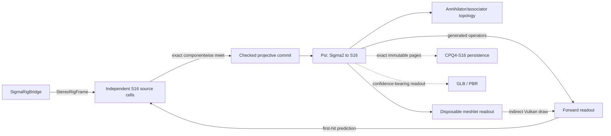

# Σ-PRISM-16 code graph

<!-- Generated by Tools/generate_code_graph.py; do not edit manually. -->

Source digest: `39909bdbb6eba099b6ab1937a6c74c5734ea0a2c9fdcd01a59768f39c72326ec`

Scope: 114 files, 1644 symbols, 1346 functions/methods, 69 GPU kernels, 5 event links.

## Runtime data flow

## DAG to code

| Run | Status | Mapped files |
|---|---|---:|
| S4-00 | done | 37 |
| S4-01 | done | 7 |
| S4-02 | done | 6 |
| S4-03 | done | 4 |
| S4-04 | done | 0 |
| S4-05 | done | 1 |
| S4-06 | done | 0 |
| S4-07 | done | 3 |
| S4-08 | in_progress | 3 |
| S4-09 | pending | 0 |
| S4-10 | pending | 0 |
| S4-11 | pending | 0 |
| S4-12 | pending | 0 |
| S4-13 | pending | 0 |

## Event links

- `AROcclusionManager.frameReceived` → `OnDepthFrame` ([Runtime/Core/DepthCapture.cs:220](../../Runtime/Core/DepthCapture.cs#L220))
- `RoomAnchorManager.RoomReady` → `OnRoomReady` ([Runtime/Core/RoomScanner.cs:134](../../Runtime/Core/RoomScanner.cs#L134))
- `SigmaRenderer.PredictionReady` → `OnPredictionReady` ([Runtime/SigmaPrism/SigmaInverseController.cs:197](../../Runtime/SigmaPrism/SigmaInverseController.cs#L197))
- `RenderPipelineManager.endCameraRendering` → `OnEndCameraRendering` ([Runtime/SigmaPrism/SigmaRenderer.cs:164](../../Runtime/SigmaPrism/SigmaRenderer.cs#L164))
- `DepthCapture.RawStereoFrameReceived` → `OnRawStereoDepthFrame` ([Runtime/SigmaPrism/SigmaRigBridge.cs:91](../../Runtime/SigmaPrism/SigmaRigBridge.cs#L91))

## Files and symbols

### `Editor/MetaVrManifestPostprocessor.cs`

`FindVersion` (method, L75), `MetaVrManifestPostprocessor` (class, L18), `OnPostGenerateGradleAndroidProject` (method, L22), `UpgradeGeneratedManifest` (method, L35)

### `Editor/RoomScanSetupWizard.Automation.cs`

`BuildQuestInfiniteScanSmokeApk` (method, L146), `PrepareQuestInfiniteScanSmokeProject` (method, L27), `PrepareSmokeProjectAsync` (method, L35), `RoomScanSetupWizard` (class, L23)

### `Editor/RoomScanSetupWizard.BuildProfile.cs`

`FindMetaQuestClassicProfile` (method, L151), `IsActiveProfileMetaQuest` (method, L193), `MetaQuestGuid` (method, L139), `ResolveBuildProfileApi` (method, L60), `RoomScanSetupWizard` (class, L41), `TryActivateMetaQuestProfile` (method, L216)

### `Editor/RoomScanSetupWizard.BuildingBlocks.cs`

`BlockSpec` (struct, L33), `EnsureRequiredBuildingBlocksAsync` (method, L201), `GetBlockDataReflective` (method, L183), `InstallBlockReflective` (method, L188), `ReadOvrManagerStartupPermFlag` (method, L109), `ResolveBuildingBlocksApi` (method, L136), `RoomScanSetupWizard` (class, L26), `WriteOvrManagerStartupPermFlag` (method, L115)

### `Editor/RoomScanSetupWizard.URP.cs`

`AllQualityLevelsUseUrp` (method, L50), `ApplyQuestFriendlyDefaults` (method, L177), `AssignToAllQualityLevels` (method, L216), `CreateURPPipelineAsset` (method, L112), `EnsureURPSetup` (method, L75), `RoomScanSetupWizard` (class, L35)

### `Editor/RoomScanSetupWizard.cs`

`AddGameReadyComponentsToRoot` (method, L97), `EnsureDebugMenuAssets` (method, L146), `EnsureQuestVRManifest` (method, L141), `EnsureVRInput` (method, L168), `FindOrCreatePanelSettings` (method, L248), `FixAROcclusion` (method, L81), `FixARSession` (method, L72), `FixDebugModules` (method, L117), `FixShaderWiring` (method, L134), `MarkDirty` (method, L262), `OnEnable` (method, L32), `OnGUI` (method, L34), `Open` (method, L28), `Refresh` (method, L62), `RoomScanSetupWizard` (class, L17), `SetBool` (method, L234), `SetPanelRenderModeWorldSpace` (method, L240), `WireComponent` (method, L204)

### `Editor/VRProjectBootstrap.cs`

`AnyFeatureEnabled` (method, L643), `Audit` (method, L84), `BuildChecks` (method, L201), `CheckResult` (enum, L36), `CheckSeverity` (enum, L35), `DescribeFeature` (method, L630), `DescribeLoaders` (method, L544), `DescribeTouchProfiles` (method, L667), `EnsureOpenXRLoader` (method, L590), `FixAllAsync` (method, L135), `GetOrCreateXRPerBuildTarget` (method, L564), `GetXRManager` (method, L553), `IsFeatureEnabled` (method, L637), `MakeArm64Check` (method, L419), `MakeMinSdkCheck` (method, L431), `MakeOpenXRFeatureCheck` (method, L616), `MakeOvrConfigEnumCheck` (method, L681), `MakeScriptingBackendCheck` (method, L405), `MakeStereoRenderingCheck` (method, L485), `MakeTargetSdkCheck` (method, L443), `MakeTextureCompressionAstcCheck` (method, L502), `MakeVulkanOnlyCheck` (method, L461), `MakeXRLoaderCheck` (method, L530), `RequireQuestScanningFeatures` (method, L100), `SetFeatureEnabled` (method, L650), `VRCheck` (class, L37), `VRProjectBootstrap` (class, L49)

### `Runtime/Camera/PassthroughCameraProvider.cs`

`ApplyConfiguration` (method, L206), `ConfigurationMatches` (method, L213), `CreateOwnedPca` (method, L191), `FindForEye` (method, L220), `OnDestroy` (method, L186), `PassthroughCameraProvider` (class, L24), `RequestCameraPermissionAsync` (method, L81), `StartCapture` (method, L108), `StopCapture` (method, L176)

### `Runtime/Core/ComputeKernelHelper.cs`

`ComputeKernelHelper` (struct, L9), `DispatchFit` (method, L36), `DispatchFit` (method, L44), `DispatchFit` (method, L54), `Set` (method, L21), `Set` (method, L26), `Set` (method, L31)

### `Runtime/Core/DepthCapture.cs`

`Awake` (method, L44), `CheckPermissionAndEnable` (method, L166), `DepthCapture` (class, L20), `EnsureArSession` (method, L157), `OnApplicationPause` (method, L90), `OnDepthFrame` (method, L126), `OnDestroy` (method, L105), `OnDisable` (method, L100), `ReleaseResources` (method, L83), `Start` (method, L49), `StartDepthCapture` (method, L69), `StopDepthCapture` (method, L77), `StopProvider` (method, L225), `SubscribeAndRun` (method, L211), `Update` (method, L113), `VerifyProviderAsync` (method, L185)

### `Runtime/Core/GpuResourceRetirementQueue.cs`

`DestroyOwned` (method, L140), `DrainAndWait` (method, L114), `DrainCompleted` (method, L91), `Entry` (struct, L15), `GpuResourceRetirementQueue` (class, L13), `Release` (method, L132), `RetireAfterCurrentGpuWork` (method, L39), `RetireAfterCurrentGpuWork` (method, L66)

### `Runtime/Core/IRoomScanModule.cs`

`IRoomScanModule` (interface, L8)

### `Runtime/Core/RoomAnchorManager.cs`

`Awake` (method, L38), `ComputeRelocationMatrix` (method, L138), `ComputeRelocationMatrix` (method, L151), `DetachChildrenForReparent` (method, L374), `EraseSpatialAnchorAsync` (method, L343), `GetRoomLocalToWorld` (method, L130), `LoadSpatialAnchorAsync` (method, L282), `OnDestroy` (method, L69), `OnModuleInitialize` (method, L22), `OnSceneLoaded` (method, L77), `RoomAnchorManager` (class, L16), `StabilizeAnchorTransform` (method, L387), `Start` (method, L43)

### `Runtime/Core/RoomScanner.cs`

`Awake` (method, L89), `ClearAllDataAsync` (method, L274), `ClearScan` (method, L267), `CreateScanAnchorAsync` (method, L306), `CycleRenderMode` (method, L291), `IsModeAvailable` (method, L301), `ObserveStart` (method, L253), `OnDestroy` (method, L155), `OnDisable` (method, L148), `OnRoomReady` (method, L138), `ReleaseScanResources` (method, L259), `RoomScanner` (class, L37), `ScanLifecycleState` (enum, L16), `ScanRenderMode` (enum, L10), `SetRenderMode` (method, L282), `Start` (method, L105), `StartScanningAsync` (method, L163), `StartScanningCoreAsync` (method, L177), `StopScanning` (method, L221), `ToggleDebugMenu` (method, L304), `ToggleScanning` (method, L243)

### `Runtime/Core/RoomSpaceRoot.cs`

`Adopt` (method, L186), `AdoptAtRoomOrigin` (method, L200), `AttachToRoot` (method, L226), `Awake` (method, L97), `OnDestroy` (method, L111), `Reframe` (method, L141), `RoomSpaceRoot` (class, L58), `SetAnchorOverride` (method, L278), `Update` (method, L116), `WaitForBindAsync` (method, L252)

### `Runtime/Core/XRRuntimeGuard.cs`

`XRRuntimeGuard` (class, L19)

### `Runtime/Resources/SigmaPrism/ConeLut.compute`

`BuildConeLut` (gpu_function, L19), `LocalRay` (gpu_function, L11), `BuildConeLut` (gpu_kernel, L1)

### `Runtime/Resources/SigmaPrism/ConeMath.hlsl`

`ConeProjectionDepthToViewZ` (gpu_function, L3), `ConeSurfaceFootprint` (gpu_function, L15)

### `Runtime/Resources/SigmaPrism/DepthNormalize.compute`

`NormalizeStereoDepth` (gpu_function, L18), `NormalizeStereoDepth` (gpu_kernel, L1)

### `Runtime/Resources/SigmaPrism/Generated/SigmaGeneratedTables.hlsl`

`SigmaConjugateSign` (gpu_function, L196), `SigmaHadamardSign` (gpu_function, L197), `SigmaMulBasisIndex` (gpu_function, L190), `SigmaMulBasisSign` (gpu_function, L192)

### `Runtime/Resources/SigmaPrism/RigImageCopy.compute`

`CopyProjectionDepthArray` (gpu_function, L13), `CopyProjectionDepthArray` (gpu_kernel, L1)

### `Runtime/Resources/SigmaPrism/Sedenion16.hlsl`

`SigmaApplyMagnitudeSign` (gpu_function, L122), `SigmaHadamardRow` (gpu_function, L550), `SigmaI64ShiftRightRaw` (gpu_function, L79), `SigmaLeftBasisAction` (gpu_function, L508), `SigmaMagnitudeFitsSigned` (gpu_function, L115), `SigmaQ48AddChecked` (gpu_function, L140), `SigmaQ48DivLower` (gpu_function, L498), `SigmaQ48DivNearestEven` (gpu_function, L493), `SigmaQ48DivRounded` (gpu_function, L382), `SigmaQ48DivUpper` (gpu_function, L503), `SigmaQ48Mask` (gpu_function, L129), `SigmaQ48MulLower` (gpu_function, L309), `SigmaQ48MulNearestEven` (gpu_function, L304), `SigmaQ48MulRounded` (gpu_function, L274), `SigmaQ48MulUpper` (gpu_function, L314), `SigmaQ48NegateChecked` (gpu_function, L152), `SigmaQ48Select` (gpu_function, L134), `SigmaQ48ShiftLeftChecked` (gpu_function, L171), `SigmaQ48ShiftRightNearestEven` (gpu_function, L184), `SigmaQ48SubChecked` (gpu_function, L159), `SigmaQ48TryDivDyadic` (gpu_function, L325), `SigmaRightBasisAction` (gpu_function, L521), `SigmaRightSignedDyadAction` (gpu_function, L534), `SigmaU128` (struct, L209), `SigmaU32MultiplyWide` (gpu_function, L220), `SigmaU64AbsSigned` (gpu_function, L48), `SigmaU64Add` (gpu_function, L10), `SigmaU64AnyLowBits` (gpu_function, L92), `SigmaU64Bit` (gpu_function, L109), `SigmaU64Increment` (gpu_function, L21), `SigmaU64MultiplyWide` (gpu_function, L235), `SigmaU64NegateRaw` (gpu_function, L41), `SigmaU64ShiftLeftRaw` (gpu_function, L66), `SigmaU64ShiftRight` (gpu_function, L53), `SigmaU64Subtract` (gpu_function, L30)

### `Runtime/Resources/SigmaPrism/SigmaCarrier.compute`

`AcknowledgeDirtyPages` (gpu_function, L233), `ClonePageGeneration` (gpu_function, L121), `CompactDirtyPages` (gpu_function, L193), `DeactivatePageGeneration` (gpu_function, L157), `InitializeGpuPool` (gpu_function, L97), `InitializeNullPage` (gpu_function, L72), `MarkPageDirty` (gpu_function, L166), `PublishPageGeneration` (gpu_function, L144), `ReleasePageSlot` (gpu_function, L177), `SigmaCarrierNullLane` (gpu_function, L43), `SigmaRequestedPageMetadata` (gpu_function, L54), `AcknowledgeDirtyPages` (gpu_kernel, L9), `ClonePageGeneration` (gpu_kernel, L3), `CompactDirtyPages` (gpu_kernel, L8), `DeactivatePageGeneration` (gpu_kernel, L6), `InitializeGpuPool` (gpu_kernel, L2), `InitializeNullPage` (gpu_kernel, L1), `MarkPageDirty` (gpu_kernel, L5), `PublishPageGeneration` (gpu_kernel, L4), `ReleasePageSlot` (gpu_kernel, L7)

### `Runtime/Resources/SigmaPrism/SigmaCarrierAbi.hlsl`

`SigmaCarrierPageMetaGpu` (struct, L16)

### `Runtime/Resources/SigmaPrism/SigmaCarrierCodec.compute`

`DecodePageBlocks` (gpu_function, L474), `EncodePageBlocks` (gpu_function, L320), `SigmaCodecAdd96` (gpu_function, L86), `SigmaCodecAddScaled` (gpu_function, L159), `SigmaCodecDecodeValue` (gpu_function, L290), `SigmaCodecExtractBits` (gpu_function, L183), `SigmaCodecFitsI64` (gpu_function, L108), `SigmaCodecInputIndex` (gpu_function, L69), `SigmaCodecLowMask` (gpu_function, L177), `SigmaCodecNullLane` (gpu_function, L48), `SigmaCodecOutputIndex` (gpu_function, L75), `SigmaCodecPageSample` (gpu_function, L60), `SigmaCodecReadSigned` (gpu_function, L249), `SigmaCodecReadWidth` (gpu_function, L242), `SigmaCodecResidual` (gpu_function, L114), `SigmaCodecSharedIndex` (gpu_function, L43), `SigmaCodecSignExtend96` (gpu_function, L81), `SigmaCodecSignedWidth` (gpu_function, L143), `SigmaCodecSubtract96` (gpu_function, L97), `SigmaCodecWriteDeltaLane` (gpu_function, L199), `if` (gpu_function, L126), `if` (gpu_function, L131), `if` (gpu_function, L302), `if` (gpu_function, L307), `if` (gpu_function, L437), `if` (gpu_function, L445), `if` (gpu_function, L458), `if` (gpu_function, L510), `if` (gpu_function, L531), `if` (gpu_function, L538), `DecodePageBlocks` (gpu_kernel, L2), `EncodePageBlocks` (gpu_kernel, L1)

### `Runtime/Resources/SigmaPrism/SigmaConstraintLedger.compute`

`ClearProofTransaction` (gpu_function, L368), `CommitRawProof` (gpu_function, L827), `FinalizeProofPage` (gpu_function, L561), `ReduceProofSources` (gpu_function, L417), `SigmaCandidateBound` (gpu_function, L94), `SigmaCertificateLess` (gpu_function, L104), `SigmaClearCandidate` (gpu_function, L84), `SigmaComputeCandidateMeet` (gpu_function, L197), `SigmaFullBounds` (gpu_function, L56), `SigmaIndependentCoordinateMask` (gpu_function, L166), `SigmaLoadPriorCertificates` (gpu_function, L245), `SigmaMaskBit` (gpu_function, L69), `SigmaPopCount64` (gpu_function, L64), `SigmaProofEqualsSource` (gpu_function, L329), `SigmaProofSourceBoundAddress` (gpu_function, L405), `SigmaProofSourceMetaAddress` (gpu_function, L398), `SigmaProofSourceScratchIndex` (gpu_function, L392), `SigmaRemoveCandidate` (gpu_function, L149), `SigmaSameCoalesceKey` (gpu_function, L158), `SigmaSameProofResult` (gpu_function, L227), `SigmaSetCandidateBound` (gpu_function, L99), `SigmaSetMaskBit` (gpu_function, L76), `SigmaSourceCell` (gpu_function, L280), `SigmaSwapCandidates` (gpu_function, L128), `ClearProofTransaction` (gpu_kernel, L1), `CommitRawProof` (gpu_kernel, L4), `FinalizeProofPage` (gpu_kernel, L3), `ReduceProofSources` (gpu_kernel, L2)

### `Runtime/Resources/SigmaPrism/SigmaConstraintLedgerAbi.hlsl`

`SigmaCertificateAddress` (gpu_function, L109), `SigmaCertificateBoundAddress` (gpu_function, L115), `SigmaConstraintBlockAddress` (gpu_function, L121), `SigmaConstraintBlockGpu` (struct, L50), `SigmaConstraintCertificateGpu` (struct, L41), `SigmaGaugeDemandGpu` (struct, L60), `SigmaProofBlockForPageSample` (gpu_function, L126), `SigmaProofLocalForPageSample` (gpu_function, L133), `SigmaProofPageSample` (gpu_function, L140), `SigmaProofSampleGpu` (struct, L95), `SigmaProofStatusAddress` (gpu_function, L104), `SigmaRawFrameRecordGpu` (struct, L80), `SigmaRawObservationTileGpu` (struct, L69), `SigmaRawRetentionRequestGpu` (struct, L87)

### `Runtime/Resources/SigmaPrism/SigmaConstraintPrior.hlsl`

`SigmaApplyConstraintPrior` (gpu_function, L19), `SigmaCertificateContainsSample` (gpu_function, L12)

### `Runtime/Resources/SigmaPrism/SigmaDirectCarrierPreview.shader`

`Attributes` (struct, L52), `PreviewColour` (gpu_function, L131), `PreviewDepth` (gpu_function, L124), `PreviewVert` (gpu_function, L67), `SigmaPreviewReadoutIndex` (gpu_function, L33), `SigmaPreviewTriangleCorner` (gpu_function, L39), `Varyings` (struct, L58)

### `Runtime/Resources/SigmaPrism/SigmaExactCompare.hlsl`

`SigmaI64Less` (gpu_function, L18), `SigmaQ48Less` (gpu_function, L25), `SigmaQ48Max` (gpu_function, L35), `SigmaQ48Min` (gpu_function, L30), `SigmaU64Equal` (gpu_function, L7), `SigmaU64Less` (gpu_function, L13)

### `Runtime/Resources/SigmaPrism/SigmaForwardReadout.compute`

`BuildCarrierReadout` (gpu_function, L40), `CompactCurrentPages` (gpu_function, L83), `ResolveCarrierHalos` (gpu_function, L167), `SigmaReadoutI64Equal` (gpu_function, L148), `SigmaReadoutIncrementI64` (gpu_function, L153), `SigmaReadoutIndex` (gpu_function, L35), `BuildCarrierReadout` (gpu_kernel, L1), `CompactCurrentPages` (gpu_kernel, L2), `ResolveCarrierHalos` (gpu_kernel, L3)

### `Runtime/Resources/SigmaPrism/SigmaGaugeAbi.hlsl`

`SigmaGaugeBlock` (gpu_function, L32), `SigmaGaugeBlockX` (gpu_function, L29), `SigmaGaugeBlockY` (gpu_function, L31), `SigmaGaugeMapRetainedCoordinate` (gpu_function, L58), `SigmaGaugeMapSourceSample` (gpu_function, L73), `SigmaGaugeOrientedCoordinate` (gpu_function, L40), `SigmaGaugePageCoordinate` (gpu_function, L49), `SigmaGaugeRawCloneGpu` (struct, L25), `SigmaGaugeRequestGpu` (struct, L16), `SigmaGaugeSourceAxisBlock` (gpu_function, L33)

### `Runtime/Resources/SigmaPrism/SigmaGaugeDemand.compute`

`BuildGaugeCoordinateCandidates` (gpu_function, L207), `FinalizeGaugeDemand` (gpu_function, L400), `SigmaGaugeCandidateAddress` (gpu_function, L47), `SigmaGaugeDemandBetter` (gpu_function, L113), `SigmaGaugeDistanceToInterval` (gpu_function, L103), `SigmaGaugeFullBounds` (gpu_function, L39), `SigmaGaugeMidpoint` (gpu_function, L94), `SigmaGaugeProjectiveCoordinate` (gpu_function, L174), `SigmaGaugeSharedPairCoversTriple` (gpu_function, L131), `SigmaGaugeSourceLane` (gpu_function, L53), `BuildGaugeCoordinateCandidates` (gpu_kernel, L1), `FinalizeGaugeDemand` (gpu_kernel, L2)

### `Runtime/Resources/SigmaPrism/SigmaGaugeRefinement.compute`

`BuildGaugeBlockFacts` (gpu_function, L194), `ClearGaugeTopologyPrior` (gpu_function, L754), `ClearGaugeTransaction` (gpu_function, L321), `CloneGaugeRawTiles` (gpu_function, L445), `FinalizeGaugeRawChains` (gpu_function, L529), `SelectGaugeRequest` (gpu_function, L256), `SigmaGaugeActiveRequest` (gpu_function, L59), `SigmaGaugeBandIsFree` (gpu_function, L137), `SigmaGaugeBandIsTopologySafe` (gpu_function, L152), `SigmaGaugeCandidateBetter` (gpu_function, L244), `SigmaGaugeFindSpan` (gpu_function, L166), `SigmaGaugeLoadNull` (gpu_function, L79), `SigmaGaugeLoadSource` (gpu_function, L344), `SigmaGaugeMaskBit` (gpu_function, L553), `SigmaGaugeMidpoint` (gpu_function, L128), `SigmaGaugeSetMaskBit` (gpu_function, L559), `SigmaGaugeStateAddress` (gpu_function, L74), `SigmaGaugeStateIsNull` (gpu_function, L95), `SigmaGaugeStoreTarget` (gpu_function, L352), `SigmaGaugeTargetTransitionAffected` (gpu_function, L107), `TransformGaugeProof` (gpu_function, L565), `TransformGaugeState` (gpu_function, L360), `TransportGaugeTopologyPrior` (gpu_function, L770), `ValidateGaugeTopology` (gpu_function, L825), `ValidateGaugeTransform` (gpu_function, L715), `BuildGaugeBlockFacts` (gpu_kernel, L1), `ClearGaugeTopologyPrior` (gpu_kernel, L9), `ClearGaugeTransaction` (gpu_kernel, L3), `CloneGaugeRawTiles` (gpu_kernel, L5), `FinalizeGaugeRawChains` (gpu_kernel, L6), `SelectGaugeRequest` (gpu_kernel, L2), `TransformGaugeProof` (gpu_kernel, L7), `TransformGaugeState` (gpu_kernel, L4), `TransportGaugeTopologyPrior` (gpu_kernel, L10), `ValidateGaugeTopology` (gpu_kernel, L11), `ValidateGaugeTransform` (gpu_kernel, L8)

### `Runtime/Resources/SigmaPrism/SigmaGeometryReadout.hlsl`

`SigmaGeometryReadoutExact` (gpu_function, L19), `SigmaGeometryReadoutPlan` (gpu_function, L39), `SigmaQ48ToReadoutFloat` (gpu_function, L5)

### `Runtime/Resources/SigmaPrism/SigmaIntrinsicTopology.compute`

`AccumulateTopologyEvidence` (gpu_function, L909), `BuildCellCutFlags` (gpu_function, L1154), `BuildSampleSupport` (gpu_function, L501), `BuildTopologyDispatchArgs` (gpu_function, L771), `BuildTransitionMeta` (gpu_function, L517), `BuildTransitionTau` (gpu_function, L643), `ClearTopologyCache` (gpu_function, L375), `ClearTopologyPage` (gpu_function, L393), `ClearTopologyWork` (gpu_function, L427), `CopyPriorTopologyPage` (gpu_function, L414), `EvaluateAssociatorCells` (gpu_function, L982), `FinalizeTransitionClasses` (gpu_function, L1079), `MarkTopologyCandidates` (gpu_function, L694), `PublishTopologyPage` (gpu_function, L1200), `ResolveLiveTopologyNeighbours` (gpu_function, L165), `ScanAnnihilatorCatalog` (gpu_function, L784), `SigmaAddIndependentKey` (gpu_function, L343), `SigmaEvidenceChanged` (gpu_function, L331), `SigmaEvidenceDiscontinuity` (gpu_function, L318), `SigmaEvidenceHitMask` (gpu_function, L299), `SigmaEvidenceMode` (gpu_function, L262), `SigmaLoadDownState` (gpu_function, L253), `SigmaLoadRightState` (gpu_function, L244), `SigmaLoadTargetState` (gpu_function, L235), `SigmaLoadTransitionEndpoints` (gpu_function, L439), `SigmaNeighbourTransition` (gpu_function, L1135), `SigmaReadProposalEvidence` (gpu_function, L268), `SigmaTopologyCacheIndex` (gpu_function, L225), `SigmaTopologyCellIndex` (gpu_function, L230), `SigmaTopologyDownPageSlot` (gpu_function, L115), `SigmaTopologyDownPageValid` (gpu_function, L128), `SigmaTopologyI64Equal` (gpu_function, L146), `SigmaTopologyIncrementI64` (gpu_function, L151), `SigmaTopologyLiveNeighbourSlots` (gpu_function, L104), `SigmaTopologyLiveWorkValid` (gpu_function, L135), `SigmaTopologyRecordCuts` (gpu_function, L370), `SigmaTopologyRightPageSlot` (gpu_function, L109), `SigmaTopologyRightPageValid` (gpu_function, L121), `SigmaTopologyTargetPageSlot` (gpu_function, L98), `SigmaTopologyTransitionIndex` (gpu_function, L220), `if` (gpu_function, L461), `if` (gpu_function, L484), `if` (gpu_function, L542), `if` (gpu_function, L621), `if` (gpu_function, L883), `if` (gpu_function, L939), `if` (gpu_function, L945), `AccumulateTopologyEvidence` (gpu_kernel, L11), `BuildCellCutFlags` (gpu_kernel, L14), `BuildSampleSupport` (gpu_kernel, L5), `BuildTopologyDispatchArgs` (gpu_kernel, L9), `BuildTransitionMeta` (gpu_kernel, L6), `BuildTransitionTau` (gpu_kernel, L7), `ClearTopologyCache` (gpu_kernel, L1), `ClearTopologyPage` (gpu_kernel, L2), `ClearTopologyWork` (gpu_kernel, L4), `CopyPriorTopologyPage` (gpu_kernel, L3), `EvaluateAssociatorCells` (gpu_kernel, L12), `FinalizeTransitionClasses` (gpu_kernel, L13), `MarkTopologyCandidates` (gpu_kernel, L8), `PublishTopologyPage` (gpu_kernel, L15), `ResolveLiveTopologyNeighbours` (gpu_kernel, L16), `ScanAnnihilatorCatalog` (gpu_kernel, L10)

### `Runtime/Resources/SigmaPrism/SigmaInverse.compute`

`ClassifyDepthFrame` (gpu_function, L332), `ClearInverseFrame` (gpu_function, L313), `EvaluateDepthMeetFixture` (gpu_function, L687), `EvaluateNullDepthMeetFixture` (gpu_function, L746), `PromoteGaugePage` (gpu_function, L581), `SigmaAppendEvidence` (gpu_function, L287), `SigmaBuildMatchedEyeCell` (gpu_function, L232), `SigmaCaptureDepthRaw` (gpu_function, L121), `SigmaCaptureRgbRaw` (gpu_function, L98), `SigmaDepthWorldPointCandidate` (gpu_function, L189), `SigmaFirstHitSectorForPixel` (gpu_function, L201), `SigmaPackPixel16` (gpu_function, L86), `SigmaPackSourceNibbles` (gpu_function, L261), `SigmaPackUnorm4x8Exact` (gpu_function, L91), `SigmaPredictionHasContact` (gpu_function, L157), `SigmaPredictionMatchesSample` (gpu_function, L216), `SigmaProjectWorldToPixel` (gpu_function, L163), `SigmaWriteProofSample` (gpu_function, L134), `SolveAndCommitPage` (gpu_function, L419), `ClassifyDepthFrame` (gpu_kernel, L2), `ClearInverseFrame` (gpu_kernel, L1), `EvaluateDepthMeetFixture` (gpu_kernel, L5), `EvaluateNullDepthMeetFixture` (gpu_kernel, L6), `PromoteGaugePage` (gpu_kernel, L4), `SolveAndCommitPage` (gpu_kernel, L3)

### `Runtime/Resources/SigmaPrism/SigmaInverseAbi.hlsl`

`SigmaAdmissibleCell16` (struct, L97), `SigmaDepthCell3` (struct, L88), `SigmaInverseConflictGpu` (struct, L109), `SigmaQ48Bounds` (struct, L82), `SigmaRgbPhaseScheduledIndex` (gpu_function, L58), `SigmaRgbSampleScheduled` (gpu_function, L65), `SigmaRgbSourceBoundAddress` (gpu_function, L77), `SigmaRgbSourceCellAddress` (gpu_function, L72)

### `Runtime/Resources/SigmaPrism/SigmaInverseMath.hlsl`

`SigmaApplyGeometryTargets` (gpu_function, L319), `SigmaBuildDepthWorldCell` (gpu_function, L228), `SigmaBuildSupportedDepthProposal` (gpu_function, L389), `SigmaCalibrationValue` (gpu_function, L13), `SigmaClassifyFirstHitExact` (gpu_function, L185), `SigmaDepthHalfWidth` (gpu_function, L123), `SigmaInformationMassForWidth` (gpu_function, L162), `SigmaLiftNullDepthMeet` (gpu_function, L517), `SigmaMeetAxis` (gpu_function, L282), `SigmaPackSources` (gpu_function, L301), `SigmaPixelSlopeBounds` (gpu_function, L211), `SigmaPriorHalfWidth` (gpu_function, L139), `SigmaQ48AbsDifference` (gpu_function, L59), `SigmaQ48FromFloatNearestEven` (gpu_function, L34), `SigmaQ48FromUnsignedInteger` (gpu_function, L24), `SigmaQ48IntervalAdd` (gpu_function, L108), `SigmaQ48IntervalProduct` (gpu_function, L89), `SigmaQ48Midpoint` (gpu_function, L66), `SigmaQ48PointBounds` (gpu_function, L73), `SigmaQ48Positive` (gpu_function, L18), `SigmaQ48ScaleBounds` (gpu_function, L117), `SigmaQ48Widen` (gpu_function, L81), `SigmaRevalidateGeometryCandidate` (gpu_function, L346), `SigmaStrengthenCandidateMass` (gpu_function, L376)

### `Runtime/Resources/SigmaPrism/SigmaInverseWorkAbi.hlsl`

`SigmaInverseWorkGpu` (struct, L21), `SigmaInverseWorkImageX` (gpu_function, L27), `SigmaInverseWorkImageY` (gpu_function, L32)

### `Runtime/Resources/SigmaPrism/SigmaInverseWorkGraph.compute`

`ClearInverseWorkGraph` (gpu_function, L127), `CommitInverseTransactions` (gpu_function, L404), `CompactInverseWork` (gpu_function, L155), `PlanRawReservations` (gpu_function, L320), `PrepareInverseTransactions` (gpu_function, L255), `SigmaCompactMorton` (gpu_function, L98), `SigmaPairFree` (gpu_function, L116), `SigmaSignedMortonLimb` (gpu_function, L109), `SigmaWorkNullLane` (gpu_function, L63), `SigmaWorkPrefix` (gpu_function, L74), `ClearInverseWorkGraph` (gpu_kernel, L1), `CommitInverseTransactions` (gpu_kernel, L5), `CompactInverseWork` (gpu_kernel, L2), `PlanRawReservations` (gpu_kernel, L4), `PrepareInverseTransactions` (gpu_kernel, L3)

### `Runtime/Resources/SigmaPrism/SigmaOperatorFixture.compute`

`AlgebraParity` (gpu_function, L75), `BasisTableParity` (gpu_function, L102), `CanonicalSelfTest` (gpu_function, L112), `NumericParity` (gpu_function, L26), `SigmaWriteNumeric` (gpu_function, L20), `AlgebraParity` (gpu_kernel, L2), `BasisTableParity` (gpu_kernel, L3), `CanonicalSelfTest` (gpu_kernel, L4), `NumericParity` (gpu_kernel, L1)

### `Runtime/Resources/SigmaPrism/SigmaOperatorPlan.hlsl`

`SigmaCanonicalMutationEnabled` (gpu_function, L7), `SigmaConjugatePlan` (gpu_function, L16), `SigmaGeometryGPlan` (gpu_function, L81), `SigmaHadamardBPlan` (gpu_function, L68), `SigmaHadamardButterfly` (gpu_function, L40), `SigmaHadamardButterflySafe` (gpu_function, L25), `SigmaHiddenFPlan` (gpu_function, L90), `SigmaProjectiveClamp` (gpu_function, L118), `SigmaProjectiveMeetLower` (gpu_function, L108), `SigmaProjectiveMeetUpper` (gpu_function, L113)

### `Runtime/Resources/SigmaPrism/SigmaPoseConsume.hlsl`

`SigmaPoseApplyVectorWorld` (gpu_function, L69), `SigmaPoseApplyWorld` (gpu_function, L95), `SigmaPoseQ48Float` (gpu_function, L13), `SigmaPoseRodriguesCoefficients` (gpu_function, L37), `SigmaPoseRotate` (gpu_function, L56), `SigmaPoseTwist` (gpu_function, L25), `SigmaPoseTwistPacked` (gpu_function, L19), `SigmaPoseUnapplyVectorWorld` (gpu_function, L82), `SigmaPoseUnapplyWorld` (gpu_function, L109)

### `Runtime/Resources/SigmaPrism/SigmaPoseGauge.compute`

`BuildCorrectedCalibration` (gpu_function, L509), `BuildPoseGaugePartials` (gpu_function, L362), `ReducePoseGauge` (gpu_function, L425), `SigmaPoseBuildCells` (gpu_function, L204), `SigmaPoseCross` (gpu_function, L112), `SigmaPoseDecodeNormal` (gpu_function, L75), `SigmaPoseDot` (gpu_function, L126), `SigmaPoseMaxIncrement` (gpu_function, L94), `SigmaPoseMetaPrior` (gpu_function, L87), `SigmaPosePointToReference` (gpu_function, L175), `SigmaPoseQ48VectorFromFloat` (gpu_function, L104), `SigmaPoseQuantizeCorrected` (gpu_function, L502), `SigmaPoseReduceShared` (gpu_function, L43), `SigmaPoseVectorNonZero` (gpu_function, L136), `SigmaPoseVectorToReference` (gpu_function, L146), `BuildCorrectedCalibration` (gpu_kernel, L3), `BuildPoseGaugePartials` (gpu_kernel, L1), `ReducePoseGauge` (gpu_kernel, L2)

### `Runtime/Resources/SigmaPrism/SigmaPredict.shader`

`Frag` (gpu_function, L152), `PredictionOutput` (struct, L144), `SigmaEncodeOctahedral` (gpu_function, L54), `SigmaReadoutIndex` (gpu_function, L35), `SigmaTriangleCorner` (gpu_function, L41), `Varyings` (struct, L66), `Vert` (gpu_function, L77)

### `Runtime/Resources/SigmaPrism/SigmaRgbInverseMath.hlsl`

`SigmaAccumulateIndependentKey` (gpu_function, L216), `SigmaBuildRgbMeasurement` (gpu_function, L124), `SigmaJointMeetCoordinate` (gpu_function, L194), `SigmaProjectWorldToRgb` (gpu_function, L96), `SigmaRevalidateJointCandidate` (gpu_function, L227), `SigmaRgbCalibrationValue` (gpu_function, L38), `SigmaRgbCeilHalfMagnitude` (gpu_function, L53), `SigmaRgbInequalityCoefficient` (gpu_function, L169), `SigmaRgbLoad` (gpu_function, L113), `SigmaRgbOperator` (gpu_function, L48), `SigmaRgbOperatorAddress` (gpu_function, L43), `SigmaRgbQuantizedComponent` (gpu_function, L62), `SigmaRgbQuantizedDirection` (gpu_function, L72), `SigmaRgbSignedOperator` (gpu_function, L162), `SigmaSolveJointCells` (gpu_function, L257)

### `Runtime/Resources/SigmaPrism/SigmaRgbSourceCells.compute`

`BuildRgbSourceCells` (gpu_function, L121), `SigmaApplyRgbConstraintPriorLane` (gpu_function, L23), `SigmaRgbCombineLaneValidity` (gpu_function, L107), `SigmaRgbPhaseSample` (gpu_function, L99), `BuildRgbSourceCells` (gpu_kernel, L1)

### `Runtime/Resources/SigmaPrism/SigmaTopologyAbi.hlsl`

`SigmaTopologyAnnihilatorId` (gpu_function, L45), `SigmaTopologyClass` (gpu_function, L40), `SigmaTopologyPack` (gpu_function, L51)

### `Runtime/Resources/SigmaPrism/SigmaTopologyMath.hlsl`

`SigmaAssociatorPlan` (gpu_function, L118), `SigmaDenseProductPlan` (gpu_function, L82), `SigmaLoadNullState` (gpu_function, L171), `SigmaRelativeAssociatorGate` (gpu_function, L164), `SigmaRelativeNearGate` (gpu_function, L157), `SigmaRightDyadL1` (gpu_function, L135), `SigmaS16L1` (gpu_function, L73), `SigmaStateHasContact` (gpu_function, L187), `SigmaTransitionPlan` (gpu_function, L110), `SigmaU128Add64` (gpu_function, L24), `SigmaU128Add` (gpu_function, L45), `SigmaU128Equal` (gpu_function, L11), `SigmaU128Less` (gpu_function, L16), `SigmaU128ShiftLeftSmall` (gpu_function, L58)

### `Runtime/RoomScanInputHandler.cs`

`AddBinding` (method, L64), `ClearAllBindings` (method, L88), `ExecuteAction` (method, L110), `RemoveBindingsForAction` (method, L72), `RemoveBindingsForButton` (method, L80), `RoomScanInputHandler` (class, L42), `ScanAction` (enum, L10), `ScanInputBinding` (class, L25), `Update` (method, L92)

### `Runtime/SigmaPrism/Calibration/ConeLutResources.cs`

`Acquire` (method, L122), `Build` (method, L161), `CeilDiv` (method, L254), `ConeLutLease` (class, L33), `ConeProjectionLut` (class, L11), `Create` (method, L112), `CreateTexture` (method, L207), `Destroy` (method, L196), `DestroyProjection` (method, L233), `DestroyTexture` (method, L243), `Dispose` (method, L55), `Get` (method, L152), `Get` (method, L46), `Release` (method, L143), `Retain` (method, L136), `Retain` (method, L48), `Retire` (method, L128), `RigConeLutSet` (class, L68)

### `Runtime/SigmaPrism/Calibration/ConeProjectionMath.cs`

`ConeProjectionMath` (class, L31), `MetricConeFootprint` (struct, L10), `RayAtImagePoint` (method, L108), `TryReproject` (method, L93), `TrySurfaceFootprint` (method, L38), `TryWorldToPixel` (method, L69)

### `Runtime/SigmaPrism/Calibration/RigCalibration.cs`

`Get` (method, L73), `IsCompatible` (method, L82), `Projection` (method, L117), `RigCalibration` (class, L45), `RigLensModel` (enum, L13), `RigProjection` (enum, L6), `RigProjectionCalibration` (struct, L19), `TryCreate` (method, L94)

### `Runtime/SigmaPrism/Capture/GpuTextureRing.cs`

`CopyOnGpu` (method, L351), `DestroySlot` (method, L396), `Dispose` (method, L215), `Dispose` (method, L50), `EnsureCompatibleTarget` (method, L278), `GetTexture` (method, L191), `GetVolumeDepth` (method, L323), `GpuTextureCopyMode` (enum, L8), `GpuTextureLease` (class, L18), `GpuTextureRing` (class, L65), `IsSupportedDimension` (method, L332), `LatchCompletionFault` (method, L254), `NextGeneration` (method, L394), `PollCompletion` (method, L238), `Release` (method, L203), `Retain` (method, L197), `Retain` (method, L42), `Slot` (class, L67), `TargetDimension` (method, L341), `TargetFormat` (method, L346), `TryCopy` (method, L115), `TryDestroyRetiredSlot` (method, L265), `ValidateLease` (method, L228)

### `Runtime/SigmaPrism/Capture/RawStereoDepthFrame.cs`

`IsFinite` (method, L40), `IsFinite` (method, L48), `RawStereoDepthFrame` (struct, L10)

### `Runtime/SigmaPrism/Capture/RigCalibrationMath.cs`

`Add` (method, L187), `Add` (method, L190), `Add` (method, L193), `CombineSignatures` (method, L76), `ConeRayAtPixel` (method, L89), `ConeRayReference` (struct, L10), `FromDepthFov` (method, L55), `FromPassthrough` (method, L31), `IntrinsicsToFov` (method, L158), `ProjectionDepth01FromViewZ` (method, L119), `RangeFromProjectionDepth01` (method, L141), `RayAtImagePoint` (method, L150), `RigCalibrationMath` (class, L8), `Signature` (method, L168), `ViewZFromProjectionDepth01` (method, L130)

### `Runtime/SigmaPrism/Capture/RigCaptureContracts.cs`

`AbsoluteDeltaNanoseconds` (method, L91), `DestinationFromSource` (method, L388), `Dispose` (method, L371), `Equals` (method, L105), `Equals` (method, L150), `Equals` (method, L156), `Equals` (method, L99), `EquivalentRange` (method, L232), `FiniteRasterFar` (method, L246), `FromUnixDateTime` (method, L84), `FromViews` (method, L269), `GetHashCode` (method, L107), `GetHashCode` (method, L158), `GpuImageView` (struct, L165), `IsFinite` (method, L211), `IsFinite` (method, L214), `IsValid` (method, L225), `IsValidRange` (method, L227), `Retain` (method, L360), `RigClockDomain` (enum, L29), `RigDepthContract` (class, L223), `RigDepthEncoding` (enum, L20), `RigExtrinsicsSnapshot` (struct, L250), `RigEye` (enum, L7), `RigFrameRejectionReason` (enum, L39), `RigIntrinsics` (struct, L117), `RigPairingHealth` (struct, L284), `RigPoseMath` (class, L385), `RigStreamKind` (enum, L12), `RigTimestamp` (struct, L64), `StereoRigFrameLease` (class, L304), `ToString` (method, L111), `ViewMatches` (method, L238)

### `Runtime/SigmaPrism/Capture/RigClockMapper.cs`

`CreateRuntime` (method, L23), `RigClockMapper` (class, L10), `SecondsToNanoseconds` (method, L92), `TryCaptureAnchor` (method, L37), `TryMapXrTimestamp` (method, L68)

### `Runtime/SigmaPrism/Capture/RigFrameSynchronizer.cs`

`AbsoluteDelta` (method, L421), `AcceptReorderedTimestamp` (method, L308), `AddDepth` (method, L159), `AddRgb` (method, L135), `Compare` (method, L371), `Compare` (method, L382), `ContainsTimestamp` (method, L340), `ContainsTimestamp` (method, L344), `DepthTimestampComparer` (class, L377), `Dispose` (method, L235), `Dispose` (method, L26), `Dispose` (method, L68), `DropPastPublishedSamples` (method, L324), `FindEarliestCoherentTriplet` (method, L252), `Flush` (method, L228), `InsertSorted` (method, L348), `InsertSorted` (method, L358), `Midpoint` (method, L419), `MillisecondsToNanoseconds` (method, L416), `Reject` (method, L409), `RgbRigSample` (class, L7), `RgbTimestampComparer` (class, L367), `RigCaptureDiagnosticSnapshot` (struct, L75), `RigFrameSynchronizer` (class, L100), `StereoDepthRigSample` (class, L33), `TakeLease` (method, L19), `TakeLease` (method, L61), `TryDequeue` (method, L184), `ValidateIncoming` (method, L237)

### `Runtime/SigmaPrism/Generated/SigmaGeneratedAlgebra.cs`

`SigmaGeneratedAlgebra` (class, L6)

### `Runtime/SigmaPrism/SigmaBackendCapabilities.cs`

`Lower` (method, L104), `LowerNode` (method, L132), `LowerReduction` (method, L178), `RequireCanonical` (method, L51), `RequiredPrimitive` (method, L67), `SigmaBackendCapabilityProfile` (class, L29), `SigmaExactPrimitive` (enum, L8), `SigmaHlslLowerer` (class, L102), `Supports` (method, L48)

### `Runtime/SigmaPrism/SigmaCarrier.cs`

`Abort` (method, L579), `AcknowledgeDirtyBatch` (method, L478), `AcquireGpuManagedPool` (method, L297), `BeginNextGeneration` (method, L384), `BeginNullGeneration` (method, L363), `BindPageMutation` (method, L665), `BindReadable` (method, L412), `BindWritable` (method, L538), `BindWritable` (method, L71), `CarrierSegment` (class, L754), `CollectCurrentPages` (method, L457), `CollectReadableSegments` (method, L447), `CompactDirtyPages` (method, L425), `ComputeSegmentPageCapacity` (method, L337), `Create` (method, L854), `CreateDirtyBatch` (method, L834), `CreateReadBatch` (method, L838), `DeactivateCurrent` (method, L682), `Dispose` (method, L601), `Dispose` (method, L842), `Dispose` (method, L92), `EnsureNoPendingCoordinate` (method, L698), `Equals` (method, L40), `Equals` (method, L44), `Equals` (method, L748), `Equals` (method, L750), `GetHashCode` (method, L46), `GetHashCode` (method, L752), `MarkDirty` (method, L498), `MarkReadoutChanged` (method, L804), `OnDestroy` (method, L621), `OnModuleInitialize` (method, L240), `OnScanStarted` (method, L287), `OnScanStopped` (method, L289), `PageGenerationKey` (struct, L736), `Publish` (method, L553), `Publish` (method, L81), `ReleaseSlot` (method, L827), `RequireAllocated` (method, L721), `RequireInitialized` (method, L730), `RequirePending` (method, L708), `ReserveAllForGpu` (method, L822), `ReserveGeneration` (method, L623), `SetUInt` (method, L695), `SigmaCarrier` (class, L159), `SigmaCarrierDirtyBatch` (struct, L101), `SigmaCarrierPageFlags` (enum, L8), `SigmaCarrierPageHandle` (struct, L15), `SigmaCarrierReadBatch` (struct, L126), `SigmaCarrierWriteLease` (class, L57), `ToString` (method, L48), `TryGetLatest` (method, L356), `TryReleaseRetiredGeneration` (method, L512), `TryReserveSlot` (method, L811)

### `Runtime/SigmaPrism/SigmaCarrierCodec.cs`

`AddScaled` (method, L636), `ComparePages` (method, L693), `CompareTo` (method, L28), `CopyBlock` (method, L102), `CopySamples` (method, L100), `DecodeAffine` (method, L520), `DecodeBlock` (method, L191), `DecodeConstant` (method, L508), `DecodeDelta` (method, L544), `DecodeNull` (method, L498), `DecodePage` (method, L245), `DecodeRaw` (method, L585), `DecodeSnapshot` (method, L326), `EncodeBlock` (method, L164), `EncodePage` (method, L204), `EncodeRaw` (method, L488), `EncodeSnapshot` (method, L296), `Equals` (method, L34), `Equals` (method, L37), `FloorDivide` (method, L700), `GetHashCode` (method, L39), `IsNull` (method, L360), `LeastSignificantBitReader` (class, L752), `LeastSignificantBitWriter` (class, L722), `Predictor` (method, L610), `Predictor` (method, L623), `ReadFingerprint` (method, L669), `ReadSigned` (method, L759), `ReadState` (method, L653), `Require` (method, L716), `ResolveAddress` (method, L148), `SigmaBlockMode` (enum, L8), `SigmaCarrierAddress` (struct, L42), `SigmaCarrierCodec` (class, L138), `SigmaCarrierPageCoordinate` (struct, L16), `SigmaDecodedPage` (class, L57), `SigmaEncodedBlock` (struct, L119), `SignedBitWidth` (method, L596), `StoreBlock` (method, L676), `ToArray` (method, L749), `ToString` (method, L40), `TryEncodeAffine` (method, L390), `TryEncodeConstant` (method, L371), `TryEncodeDelta` (method, L438), `ValidateBlock` (method, L707), `WriteFingerprint` (method, L661), `WriteSigned` (method, L727), `WriteState` (method, L647)

### `Runtime/SigmaPrism/SigmaConstraintLedger.cs`

`Abort` (method, L697), `AbortGauge` (method, L626), `BeginFrame` (method, L282), `BeginGaugePage` (method, L473), `BeginPage` (method, L303), `BindCommon` (method, L784), `BindGaugeReadOnly` (method, L449), `BindGaugeSource` (method, L537), `BindGaugeSourceReadOnly` (method, L455), `BindGaugeTarget` (method, L549), `BindInverse` (method, L344), `BindReadOnly` (method, L358), `BindReadOnly` (method, L376), `CertificateOffsetForSlot` (method, L718), `CloseFrame` (method, L708), `CreateBuffer` (method, L874), `DecodeCertificateSlot` (method, L721), `DecodeSourceSlot` (method, L772), `DescendingStack` (method, L878), `Dispose` (method, L1025), `Dispose` (method, L1058), `Dispose` (method, L1100), `Dispose` (method, L731), `From` (method, L898), `From` (method, L922), `From` (method, L958), `High` (method, L1004), `Intrinsics` (method, L997), `Low` (method, L1002), `MarkDisposed` (method, L1024), `MarkDisposed` (method, L1057), `MarkDisposed` (method, L1099), `MarkPublished` (method, L1052), `MarkPublished` (method, L1094), `Prepare` (method, L333), `Publish` (method, L663), `PublishGauge` (method, L593), `ReadStatus` (method, L638), `Reduce` (method, L387), `ReleaseProofSlot` (method, L797), `ReleaseRawChain` (method, L814), `ReleaseUnusedReservation` (method, L833), `RequireAlive` (method, L868), `RequireGaugePage` (method, L859), `RequirePage` (method, L850), `SigmaConstraintLedger` (class, L70), `SigmaGaugeProofLease` (class, L1065), `SigmaGaugeRawClonePlan` (struct, L47), `SigmaProofFrameLease` (class, L1007), `SigmaProofMutationFlags` (enum, L11), `SigmaProofPageLease` (class, L1027), `SigmaProofPageStatus` (struct, L19), `SigmaRawFrameRecordGpu` (struct, L936), `SigmaRawPairingHealthGpu` (struct, L912), `SigmaRawTimestampGpu` (struct, L888), `StageGpuFrame` (method, L270), `TryReleaseFrame` (method, L842), `ValidateForPublication` (method, L653), `ValidateGaugeForPublication` (method, L564), `World` (method, L993)

### `Runtime/SigmaPrism/SigmaDepthInverse.cs`

`ClassifyFirstHit` (method, L110), `FailedCandidate` (method, L329), `InformationMassForWidth` (method, L147), `MeetAndCommitSupported` (method, L167), `MeetAxis` (method, L310), `PriorHalfWidth` (method, L124), `SaturatingAdd` (method, L339), `SaturatingSubtract` (method, L336), `SigmaDepthAdmissibleCell` (struct, L26), `SigmaDepthCommitResult` (struct, L80), `SigmaDepthConflict` (struct, L56), `SigmaDepthInverse` (class, L102), `SigmaDepthSourceClass` (enum, L6), `SigmaFirstHitSector` (enum, L12)

### `Runtime/SigmaPrism/SigmaExactBackendGate.cs`

`Bind` (method, L62), `Dispatch` (method, L45), `Dispose` (method, L70), `SigmaExactBackendGate` (class, L17), `SigmaExactBackendGateStatus` (enum, L6)

### `Runtime/SigmaPrism/SigmaGaugeController.cs`

`BeginTransform` (method, L308), `BindGaugeTopology` (method, L455), `BindProofSource` (method, L495), `BindProofTarget` (method, L505), `BindRequestIndex` (method, L438), `BindState` (method, L471), `BindTopology` (method, L483), `BindTransactionCommon` (method, L429), `Buffer` (method, L538), `BuildRequests` (method, L220), `CeilDiv` (method, L535), `Dispose` (method, L548), `Dispose` (method, L597), `EnsureRawCapacity` (method, L515), `MarkPublished` (method, L591), `PublishProof` (method, L421), `ReadStatus` (method, L378), `RequireAlive` (method, L542), `SetUInt` (method, L532), `SigmaGaugeController` (class, L145), `SigmaGaugeRequestGpu` (struct, L10), `SigmaGaugeSelection` (struct, L66), `SigmaGaugeTransaction` (class, L568), `SigmaGaugeTransactionStatus` (struct, L83), `ToMap` (method, L59), `TransportTopologyPrior` (method, L401), `TryReadBestRequest` (method, L261), `ValidateProofForPublication` (method, L425), `ValidateTopology` (method, L382), `Word` (method, L135)

### `Runtime/SigmaPrism/SigmaGaugeRefinement.cs`

`Apply` (method, L88), `ApplyInverse` (method, L120), `At` (method, L330), `AxisPreimage` (method, L351), `Equals` (method, L66), `Equals` (method, L71), `GetAxis` (method, L339), `GetHashCode` (method, L73), `HasProjectiveReproductionDemand` (method, L164), `MapRetainedSampleAxis` (method, L201), `Midpoint` (method, L321), `MidpointError` (method, L282), `OrientedToPage` (method, L376), `ProjectiveCoordinate` (method, L272), `SampleHalfGrid` (method, L289), `SetAxis` (method, L343), `SigmaGaugeAxis` (enum, L5), `SigmaGaugeDirection` (enum, L10), `SigmaGaugeMap` (struct, L23), `SigmaGaugeRefinement` (class, L84), `TargetBlocksForSourceBlock` (method, L240), `TerminalBandsAreNull` (method, L144), `TryMapRetainedSample` (method, L210), `ValidatePage` (method, L384)

### `Runtime/SigmaPrism/SigmaGeometryReadout.cs`

`LiftFixture` (method, L61), `SigmaGeometryReadout` (class, L23), `SigmaGeometrySample` (struct, L6), `TryRead` (method, L25)

### `Runtime/SigmaPrism/SigmaGpuCompletion.cs`

`InsertAfterGraphicsWork` (method, L62), `Poll` (method, L30), `RecordAfterAllWork` (method, L70), `RequireSupported` (method, L56), `SigmaGpuCompletion` (class, L53), `SigmaGpuCompletionStatus` (enum, L7), `SigmaGpuCompletionTicket` (struct, L20)

### `Runtime/SigmaPrism/SigmaIntrinsicTopology.cs`

`CanonicalizeKeys` (method, L152), `EvaluateCell` (method, L61), `L1` (method, L144), `SigmaIntrinsicTopology` (class, L57), `SigmaIntrinsicTopologySignature` (struct, L13), `SigmaTopologyClass` (enum, L6)

### `Runtime/SigmaPrism/SigmaInverseController.cs`

`AbsNanoseconds` (method, L1093), `BindExactCommon` (method, L805), `BindFrameConstants` (method, L872), `BindGaugeDemand` (method, L726), `BindInverseMutation` (method, L745), `BindInverseWork` (method, L796), `BindLedger` (method, L702), `BindWorkGraph` (method, L670), `BuildTrackingPriorEnvelope` (method, L1021), `CeilDiv` (method, L1385), `CreateArrayTexture` (method, L1402), `CreateBuffer` (method, L1395), `CreateIndirectBuffer` (method, L1399), `CreatePersistentResources` (method, L1268), `DestroyTexture` (method, L1432), `Dispose` (method, L1507), `EnsureBlockBuffers` (method, L1125), `EnsureCalibration` (method, L1099), `EnsureFrameResources` (method, L1111), `EnsurePosePartials` (method, L1138), `FillCalibration` (method, L1158), `FillRgbCalibration` (method, L1194), `FindKernels` (method, L1237), `FromRaw` (method, L1487), `GpuResident` (method, L1540), `GpuSubmission` (class, L1490), `IndependenceKey` (method, L1360), `IntrinsicsVector` (method, L1357), `LateUpdate` (method, L237), `MaxRigRotationResidual` (method, L1080), `MaxRigTranslationResidual` (method, L1067), `Mix` (method, L1380), `NextPowerOfTwo` (method, L1388), `NextRevision` (method, L1337), `OnDestroy` (method, L1443), `OnModuleInitialize` (method, L157), `OnPredictionReady` (method, L224), `OnScanStarted` (method, L202), `OnScanStopped` (method, L215), `Poll` (method, L1505), `PoseMatrix` (method, L1354), `RecordClearAndClassify` (method, L367), `RecordCorrectedCalibration` (method, L994), `RecordGaugePromote` (method, L514), `RecordMatchedSolve` (method, L503), `RecordNormalize` (method, L903), `RecordPoseGauge` (method, L925), `RecordPrepareTransactions` (method, L455), `RecordProofClear` (method, L462), `RecordProofCommit` (method, L649), `RecordProofGaugeDemand` (method, L623), `RecordProofRawCommit` (method, L593), `RecordProofReduce` (method, L545), `RecordRawPlan` (method, L525), `RecordRgbSource` (method, L479), `RecordWorkCompaction` (method, L431), `SaturatingAdd` (method, L1096), `SetFrameMatrices` (method, L1210), `SetQ` (method, L1345), `SetQRaw` (method, L1348), `SetRgbQ` (method, L1350), `SetRgbQRaw` (method, L1352), `SigmaInverseController` (class, L22), `SigmaInverseDiagnosticSnapshot` (struct, L1516), `SigmaPackedQ48` (struct, L1478), `SubmitGpuGraph` (method, L283), `UploadExactCalibration` (method, L1148)

### `Runtime/SigmaPrism/SigmaNumericDomain.cs`

`Clamp` (method, L291), `Contains` (method, L286), `DivideCeiling` (method, L231), `DivideFloor` (method, L220), `DivideNearestEven` (method, L207), `Equals` (method, L298), `Equals` (method, L301), `FromInteger` (method, L193), `FromRatio` (method, L196), `GetHashCode` (method, L303), `Intersect` (method, L288), `NormalizeDenominator` (method, L242), `QAbs` (method, L47), `QAdd` (method, L28), `QClamp` (method, L54), `QCompare` (method, L31), `QDiv` (method, L65), `QDivLower` (method, L83), `QDivUpper` (method, L92), `QIntegerSquareRoot` (method, L131), `QMidpoint` (method, L38), `QMul` (method, L62), `QMulLower` (method, L75), `QMulUpper` (method, L79), `QNegate` (method, L40), `QShiftLeft` (method, L99), `QShiftRight` (method, L107), `QShiftRightLower` (method, L115), `QShiftRightUpper` (method, L122), `QSub` (method, L30), `Quantize` (method, L158), `Quantize` (method, L191), `SigmaNumericDomain` (class, L10), `SigmaQ48Interval` (struct, L270), `ToDouble` (method, L206), `ToRawChecked` (method, L254), `ToString` (method, L308), `ValidateShift` (method, L261)

### `Runtime/SigmaPrism/SigmaOperatorPlan.cs`

`Add` (method, L162), `Build` (method, L220), `BuildAssociator` (method, L491), `BuildBasis` (method, L400), `BuildCodecPredicates` (method, L585), `BuildConjugation` (method, L390), `BuildHadamard` (method, L444), `BuildHadamardRow` (method, L466), `BuildProjectiveCommit` (method, L559), `BuildProjectiveMeet` (method, L544), `BuildReadout` (method, L454), `BuildSignedDyad` (method, L421), `BuildTransition` (method, L479), `BuildView` (method, L506), `CompareEqual` (method, L178), `CompareLess` (method, L174), `CompareLessEqual` (method, L176), `ComputeFingerprint` (method, L96), `ComputePlanBundleFingerprint` (method, L630), `Constant` (method, L151), `Contains` (method, L86), `Copy` (method, L251), `DenseProduct` (method, L606), `Evaluate` (method, L263), `EvaluateNode` (method, L290), `EvaluateS16` (method, L281), `FixedReduction` (method, L196), `Gather` (method, L141), `GatherState` (method, L598), `Intern` (method, L237), `InternCommutative` (method, L230), `IntervalDivLower` (method, L192), `IntervalDivUpper` (method, L194), `IntervalMulLower` (method, L188), `IntervalMulUpper` (method, L190), `LeftBasis` (method, L383), `LeftSignedDyad` (method, L388), `Mask` (method, L180), `Max` (method, L172), `Min` (method, L170), `Negate` (method, L160), `QDiv` (method, L168), `QMul` (method, L166), `RightBasis` (method, L385), `RightSignedDyad` (method, L386), `Select` (method, L182), `ShiftLeft` (method, L184), `ShiftRight` (method, L186), `SigmaOperatorEvaluator` (class, L260), `SigmaOperatorNode` (struct, L37), `SigmaOperatorOpcode` (enum, L9), `SigmaOperatorPlan` (class, L63), `SigmaOperatorPlanBuilder` (class, L125), `SigmaOperatorPlans` (class, L355), `Sign` (method, L154), `Sub` (method, L164)

### `Runtime/SigmaPrism/SigmaOperatorSet.cs`

`RequireCanonicalBackend` (method, L33), `SigmaOperatorSet` (class, L10)

### `Runtime/SigmaPrism/SigmaPoseGauge.cs`

`Apply` (method, L50), `Equals` (method, L74), `Equals` (method, L79), `FromGpu` (method, L40), `GetHashCode` (method, L81), `Identity` (method, L37), `MinimumMagnitude` (method, L84), `Raw` (method, L31), `Read` (method, L93), `SigmaPoseGaugeState` (struct, L12)

### `Runtime/SigmaPrism/SigmaPredictionFrame.cs`

`ArrayDescriptor` (method, L266), `CommitGpuWrite` (method, L155), `CommitGpuWrite` (method, L49), `Compatible` (method, L278), `CompatibleDepth` (method, L285), `CreateColor` (method, L229), `CreateDepth` (method, L249), `DestroySlot` (method, L332), `DestroyTexture` (method, L349), `Dispose` (method, L190), `Dispose` (method, L51), `EnsureTextures` (method, L203), `Get` (method, L144), `LatchCompletionFault` (method, L308), `NextGeneration` (method, L360), `PollCompletion` (method, L292), `Release` (method, L178), `Retain` (method, L172), `Retain` (method, L41), `SigmaPredictionFrameLease` (class, L12), `SigmaPredictionTargetRing` (class, L72), `Slot` (class, L74), `TryBegin` (method, L101), `TryDestroyRetiredSlot` (method, L319)

### `Runtime/SigmaPrism/SigmaRenderer.cs`

`BindBuild` (method, L368), `BindCompaction` (method, L389), `BindHaloResolve` (method, L410), `BuildClipFromWorld` (method, L490), `Dispose` (method, L681), `DrawSegments` (method, L425), `EnsureSegmentCaches` (method, L458), `LateUpdate` (method, L180), `Matches` (method, L675), `OnDestroy` (method, L575), `OnEndCameraRendering` (method, L518), `OnModuleInitialize` (method, L121), `OnScanStarted` (method, L167), `OnScanStopped` (method, L173), `PrepareReadoutCaches` (method, L348), `RecordDirectPreview` (method, L545), `RenderPrediction` (method, L272), `SegmentReadoutCache` (class, L613), `SetMrt` (method, L482), `SigmaRenderer` (class, L18), `TryAcquireLatest` (method, L110), `TryRecordPoseGaugePrediction` (method, L226), `TryRender` (method, L199), `TryRenderPoseGauge` (method, L208)

### `Runtime/SigmaPrism/SigmaRgbInverse.cs`

`BuildGeneratedViewMatrix` (method, L115), `BuildRatioInequalities` (method, L271), `CoalesceCertificates` (method, L204), `CompareTo` (method, L77), `ContractLessOrEqual` (method, L309), `CopyBounds` (method, L385), `EvaluateRow` (method, L355), `LinearInequality` (struct, L421), `Meet` (method, L190), `MinimizeProofSet` (method, L244), `Product` (method, L373), `SameCoalesceKey` (method, L397), `SigmaConstraintCertificate` (struct, L42), `SigmaRgbAdmissibleCell` (struct, L12), `SigmaRgbInverse` (class, L108), `SigmaRgbSourceClass` (enum, L6), `TryBuildCell` (method, L136), `ValidateDimensions` (method, L406)

### `Runtime/SigmaPrism/SigmaRgbViewCatalog.cs`

`CreateCanonical` (method, L43), `DecodeDirection` (method, L98), `EncodeDirection` (method, L91), `FingerprintOf` (method, L118), `QuantizeDirection` (method, L78), `RetainedSign` (method, L109), `SigmaRgbViewCatalog` (class, L16)

### `Runtime/SigmaPrism/SigmaRigBridge.cs`

`CaptureRgb` (method, L170), `EnsureRuntimeObjects` (method, L155), `FreezeSessionIntrinsics` (method, L294), `LateUpdate` (method, L118), `OnDestroy` (method, L142), `OnRawStereoDepthFrame` (method, L223), `PublishAvailableFrames` (method, L284), `ReportLocalRejection` (method, L376), `ResolveEye` (method, L320), `SigmaRigBridge` (class, L13), `StartCapture` (method, L72), `StopCapture` (method, L97), `TryAcquireLatest` (method, L61)

### `Runtime/SigmaPrism/SigmaS16.cs`

`Add` (method, L380), `Associator` (method, L336), `Basis` (method, L95), `BasisAction` (method, L385), `BasisProductIndex` (method, L227), `BasisProductSign` (method, L234), `Combine` (method, L416), `CombineDyad` (method, L401), `CompareTo` (method, L178), `Conjugate` (method, L241), `DenseReferenceMultiply` (method, L255), `Equals` (method, L118), `Equals` (method, L128), `Equals` (method, L188), `Equals` (method, L192), `FromArray` (method, L82), `GeometryReadout` (method, L315), `GetAnnihilatorAction` (method, L355), `GetHashCode` (method, L130), `GetHashCode` (method, L194), `GetZeroDivisorEntry` (method, L367), `HadamardB` (method, L290), `HadamardBT` (method, L298), `HadamardRow` (method, L300), `HiddenReadout` (method, L324), `L1RawChecked` (method, L345), `LeftBasisAction` (method, L272), `LeftSignedDyadAction` (method, L280), `RightBasisAction` (method, L276), `RightSignedDyadAction` (method, L285), `SigmaS16` (struct, L10), `SigmaS16Operators` (class, L218), `SigmaSignedDyad` (struct, L146), `SigmaZeroDivisorEntry` (struct, L201), `Subtract` (method, L383), `ToArray` (method, L104), `ToS16` (method, L170), `ToString` (method, L141), `Transition` (method, L333), `ValidateBasis` (method, L426)

### `Runtime/SigmaPrism/SigmaTopologyController.cs`

`AccumulateEvidencePage` (method, L661), `BindDirectAssociator` (method, L871), `BindDirectExecutionMode` (method, L1078), `BindEvidence` (method, L940), `BindEvidenceView` (method, L950), `BindGpuEvidence` (method, L543), `BindGpuLiveCommon` (method, L484), `BindLiveAssociator` (method, L560), `BindPageState` (method, L965), `BindTopologyNeighbours` (method, L990), `BuildGeneration` (method, L583), `BuildPage` (method, L729), `CeilDiv` (method, L1132), `ClearPage` (method, L1062), `CopyPrior` (method, L1047), `CreateBuffer` (method, L1128), `CreateSegmentCache` (method, L1086), `Dispose` (method, L1212), `EnsureSegmentViews` (method, L269), `FinishGaugeGeneration` (method, L630), `FullStereo` (method, L55), `GaugeRebuild` (method, L61), `Matches` (method, L1207), `MergeEvidenceIdentity` (method, L915), `OnDestroy` (method, L1142), `OnModuleInitialize` (method, L195), `OnScanStarted` (method, L266), `OnScanStopped` (method, L268), `PrepareGaugeGeneration` (method, L608), `Proposals` (method, L38), `Publish` (method, L99), `PublishBuiltGeneration` (method, L721), `RebuildCurrent` (method, L640), `RecordGpuInverseTopology` (method, L315), `RequireInitialized` (method, L1135), `ResolveEvidenceIdentity` (method, L897), `ResolveNeighbour` (method, L1016), `SetUInt` (method, L1109), `SigmaTopologyBuildToken` (struct, L86), `SigmaTopologyController` (class, L138), `SigmaTopologyEvidenceView` (struct, L8), `SigmaTopologyGaugeBinding` (struct, L107), `SigmaTopologySegmentView` (struct, L66), `TopologySegmentCache` (class, L1174), `TryGetCurrentTopology` (method, L1033), `TryGetSegmentView` (method, L295), `TryOffset` (method, L1112), `ValidateEvidenceCoordinate` (method, L887)

### `Runtime/SigmaPrism/SigmaTransitionCache.cs`

`Clear` (method, L104), `Equals` (method, L21), `Equals` (method, L26), `GetHashCode` (method, L28), `GetOrCompute` (method, L68), `SigmaTransitionCache` (class, L51), `SigmaTransitionKey` (struct, L6), `SigmaTransitionSignature` (struct, L31)

### `Runtime/UI/ControllerRayDriver.cs`

`Awake` (method, L51), `ChooseBestController` (method, L103), `ControllerRayDriver` (class, L14), `DrawLaser` (method, L200), `LateUpdate` (method, L88), `OnDestroy` (method, L94), `SetCursorColor` (method, L241), `SetupCursor` (method, L180), `SetupLineRenderer` (method, L166), `TryUpdateRayOrigin` (method, L125), `Update` (method, L78)

### `Runtime/UI/DebugMenuController.cs`

`Awake` (method, L36), `Bind` (method, L109), `DebugMenuController` (class, L9), `Hide` (method, L84), `OnEnable` (method, L43), `Query` (method, L91), `RefreshStatus` (method, L119), `Set` (method, L222), `SetStatus` (method, L228), `Show` (method, L76), `StatusKind` (enum, L250), `Toggle` (method, L70), `Update` (method, L56)

### `Runtime/UI/DebugMenuFollower.cs`

`ComputeTargetPosition` (method, L92), `DebugMenuFollower` (class, L11), `LateUpdate` (method, L38), `OnEnable` (method, L33), `SnapToView` (method, L75), `StopTracking` (method, L87)

### `Runtime/UI/VRDocumentRaycaster.cs`

`GetWorldRay` (method, L26), `VRDocumentRaycaster` (class, L19)

### `Runtime/Utils/Logger.cs`

`Error` (method, L42), `Info` (method, L30), `LogLevel` (enum, L7), `Logger` (class, L21), `Verbose` (method, L24), `Warning` (method, L36)

### `Tests/Editor/SigmaAlgebraOperatorTests.cs`

`BuildCseFixture` (method, L325), `CompareEntries` (method, L374), `CompleteGeneratedZeroDivisorCatalogIsExactAndNonZero` (method, L134), `CseMaskSelectAndCapabilityRefusalPreserveExactSemantics` (method, L261), `DeterministicState` (method, L338), `ExplicitAssociatorBracketingsAndFusedPlanAgree` (method, L183), `GeneratedBasisTableMatchesRecursiveCayleyDicksonExhaustively` (method, L86), `GeneratedFingerprintsAreStableAndBoundToCanonicalBundle` (method, L302), `GeneratedSparseBasisAndConjugationMatchDenseReference` (method, L110), `GeneratedTransitionHadamardAndReadoutPlansMatchReferences` (method, L198), `NumericDomainRegistryAndCheckedNearestEvenSemanticsAreExact` (method, L11), `OutwardIntervalArithmeticNeverExcludesExactValue` (method, L57), `SigmaAlgebraOperatorTests` (class, L8), `SignedDyadPlanUsesOnlyPermutationSignAndAddition` (method, L162), `TransitionCacheHitMissAndGenerationInvalidationAreExact` (method, L281)

### `Tests/Editor/SigmaCarrierTests.cs`

`AssertAddress` (method, L201), `BindCodec` (method, L349), `DirtyCompactionIsStableAndSegmentSizingRespectsBindingLimit` (method, L155), `EveryExactBlockModeIsCanonicalAndRoundTripsBitForBit` (method, L42), `MakeAffineBlock` (method, L235), `MakeConstantBlock` (method, L222), `MakeDeltaBlock` (method, L256), `MakeMixedPage` (method, L288), `MakeNullBlock` (method, L214), `MakeRawBlock` (method, L269), `PackPage` (method, L316), `PackedGpuCodecMatchesCanonicalCpuBytesAndDecodedState` (method, L88), `PageAndSortedSnapshotRestartAreByteIdentical` (method, L67), `SigmaCarrierTests` (class, L10), `SignedCarrierAddressingUsesMathematicalFloorAcrossZero` (method, L29), `StoreBlock` (method, L304), `UInt2` (struct, L13), `UInt4` (struct, L20), `WordsToLittleEndian` (method, L334)

### `Tests/Editor/SigmaConstraintLedgerTests.cs`

`AssertBound` (method, L567), `Bound` (method, L552), `BoundsGpu` (struct, L54), `CertificateArenaFitsTheFrozenQuestMetadataBudget` (method, L151), `CertificateGpu` (struct, L114), `CertificateOffsetsRoundTripWithoutPageOrBlockPhysics` (method, L170), `ConstraintBlockGpu` (struct, L123), `DepthCellGpu` (struct, L61), `DepthSample` (method, L506), `GaugeDemandGpu` (struct, L130), `GaugeDepthSample` (method, L526), `GpuGaugeDemandRequiresIndependentAcceptedReadoutFailure` (method, L287), `GpuLedgerOwnsFocusedTransactionKernels` (method, L186), `GpuReducerEmitsOneExactMinimalDepthCertificate` (method, L203), `IndependenceIsProvenPerSharedS16Coordinate` (method, L262), `InverseWorkGpu` (struct, L46), `LedgerFixture` (class, L573), `NonuniformFiniteFootprintsRemainReplayableAsRawTile` (method, L239), `Pack` (method, L558), `PackState` (method, L545), `ProofSampleGpu` (struct, L98), `RawRetentionRequestGpu` (struct, L145), `RawTileGpu` (struct, L138), `RgbCellGpu` (struct, L73), `RunReducer` (method, L382), `SigmaConstraintLedgerTests` (class, L9), `UInt2` (struct, L16), `UInt4` (struct, L29), `Unpack` (method, L561), `Unpack` (method, L564)

### `Tests/Editor/SigmaDepthInverseTests.cs`

`BuildFixtureCalibration` (method, L325), `Cell` (method, L281), `EmptyMeetPreservesExactGapProvenanceAndCanonicalBytes` (method, L89), `ExactMeetIsLeftRightOrderInvariantAndWeakEvidenceCannotPull` (method, L59), `FirstHitSectorsHaveExactCausalPartition` (method, L28), `GpuDepthMeetMatchesCpuProjectiveCommitBitForBit` (method, L157), `IndependentNarrowSupportRaisesResistanceWithoutMovingReadout` (method, L112), `Interval` (method, L289), `NullPromotionRequiresIndependentNonEmptyStereoMeet` (method, L219), `Pack` (method, L294), `Pack` (method, L348), `PackCellMetadata` (method, L317), `PackCells` (method, L302), `Q` (method, L292), `SigmaDepthInverseTests` (class, L9), `SupportedState` (method, L277), `UInt2` (struct, L12), `UInt4` (struct, L19), `Unpack` (method, L354)

### `Tests/Editor/SigmaForwardReadoutTests.cs`

`BuildFoldedPage` (method, L282), `CreateColor` (method, L328), `CreateDepth` (method, L342), `Destroy` (method, L405), `DrawPrediction` (method, L377), `ExactLiftReadoutRoundTripsAndNullHasNoContact` (method, L52), `FillPatch` (method, L292), `GpuReadoutAndRasterSelectNearFoldWhileNullStaysEmpty` (method, L70), `MinPositiveDepth` (method, L363), `Pack` (method, L310), `PageMeta` (struct, L35), `SigmaForwardReadoutTests` (class, L11), `UInt2` (struct, L19), `UInt4` (struct, L26)

### `Tests/Editor/SigmaGaugeRefinementTests.cs`

`AssertPackedPage` (method, L399), `AssertTransportedCertificate` (method, L382), `BindProof` (method, L349), `BindState` (method, L336), `BindTopology` (method, L370), `BoundsGpu` (struct, L54), `BuildPage` (method, L435), `CertificateGpu` (struct, L61), `ConstraintBlockGpu` (struct, L70), `ExactSeparableGaugeRoundTripsEveryCanonicalLane` (method, L80), `GaugeRequestGpu` (struct, L45), `GaugeRequiresTwoExactNullTailBands` (method, L107), `Pack` (method, L411), `Pack` (method, L421), `RawProofBlockTransportUsesOnlyActualMappedSamples` (method, L122), `ReproductionDemandRequiresIndependentProofAndExactExcess` (method, L138), `SigmaGaugeRefinementTests` (class, L9), `UInt2` (struct, L15), `UInt4` (struct, L28), `Unpack` (method, L424), `Value` (method, L458), `VulkanGaugeMatchesOracleAndTransportsProofAndSingularity` (method, L166)

### `Tests/Editor/SigmaGpuLoweringTests.cs`

`AssertPacked` (method, L212), `CanonicalPacked32BackendGatePassesOnlyAfterGpuSelfTest` (method, L31), `LoadFixture` (method, L157), `MakeState` (method, L194), `Pack` (method, L203), `Packed32NumericLoweringMatchesCpuSemanticDomainBitForBit` (method, L40), `Packed32SparseAlgebraAndGeneratedBasisTableMatchCpuExactly` (method, L105), `SigmaGpuLoweringTests` (class, L9), `UInt2` (struct, L15), `UInt4` (struct, L22), `Unpack` (method, L209)

### `Tests/Editor/SigmaIntrinsicTopologyTests.cs`

`FindContactZeroDivisor` (method, L212), `GenerationPairCacheComputesOneTransitionAndInvalidatesEitherEnd` (method, L30), `Pack` (method, L232), `Scalar` (method, L229), `SigmaIntrinsicTopologyTests` (class, L11), `StableIndependentEvidencePromotesExactSingularity` (method, L53), `SyntheticH0SignaturesAreIntrinsicAndProximityIndependent` (method, L87), `ToBigInteger` (method, L250), `UInt2` (struct, L14), `UInt4` (struct, L21), `VulkanFixtureMatchesCpuFullCatalogAndIntegerGates` (method, L149)

### `Tests/Editor/SigmaPoseGaugeTests.cs`

`BuildDepthCalibration` (method, L374), `BuildPosePrior` (method, L363), `BuildPoseRays` (method, L293), `BuildRgbCalibration` (method, L402), `CreateArrayRenderTexture` (method, L431), `EncodeOctahedral` (method, L349), `ExactGpuResultSelectsMinimumMagnitudeMeetPoint` (method, L46), `FillPoseEye` (method, L319), `Float2` (struct, L30), `Float4` (struct, L37), `Matrix` (method, L290), `Pack` (method, L466), `Q` (method, L464), `SigmaPoseGaugeTests` (class, L11), `ToDouble` (method, L477), `UInt2` (struct, L14), `UInt4` (struct, L21), `Unpack` (method, L472), `Unpack` (method, L474), `UnresolvedMeetIsIdentityAndResolvedGaugePreservesRigExtrinsics` (method, L81), `VulkanPoseGaugeKernelIsPresent` (method, L110), `VulkanPoseKernelsSolveAndCorrectTheSameRigGauge` (method, L124)

### `Tests/Editor/SigmaRgbInverseTests.cs`

`BoxAround` (method, L257), `Certificate` (method, L195), `CertificateCoalescingAndMinimalProofAreDeterministic` (method, L140), `DifferentlyPhasedCellsSharpenByIntersectionNotSummation` (method, L169), `Direction` (method, L279), `ExactDirectionCatalogIsDeterministicAndHasFailClosedNullSlot` (method, L44), `FindObservableLane` (method, L228), `GeneratedViewMatrixEqualsExplicitBracketedSemanticOperator` (method, L11), `IncompatibleRgbDepthStyleCellStaysExplicitlyEmpty` (method, L123), `Interval` (method, L276), `LeftRightMeetIsExactAndSourceOrderInvariant` (method, L107), `Multiply` (method, L247), `PreservesNarrowMeet` (method, L184), `Q` (method, L282), `Q` (method, L70), `SevenInequalityContractionContainsKnownSolutionAndNarrowsBox` (method, L79), `SigmaRgbInverseTests` (class, L8), `UniformBox` (method, L268), `UnobservableAppearanceDenominatorContributesNoBound` (method, L62)

### `Tests/Editor/SigmaRigContractTests.cs`

`CalibrationSignatureChangesWithConeGeometry` (method, L70), `ConeReferenceCarriesRayDifferentialsAndSolidAngle` (method, L82), `DepthFovProducesDeliveredPixelIntrinsics` (method, L52), `FiniteConeFootprintExpandsWithRangeAndGrazingIncidence` (method, L101), `SigmaRigContractTests` (class, L10), `UnixTimestampPreservesSourceTimeExactly` (method, L13), `XrClockAnchorFailsClosedWhenSamplingBracketIsTooWide` (method, L41), `XrClockAnchorUsesBracketMidpointAndCarriesUncertainty` (method, L26)

### `Tools/generate_code_graph.py`

`build_graph` (function, L197), `is_hlsl_definition` (function, L110), `line_of` (function, L94), `main` (function, L363), `matching_brace` (function, L98), `parse_symbols` (function, L132), `render_markdown` (function, L296), `source_files` (function, L84), `task_files` (function, L191)

### `Tools/sigma/generate_sigma_operators.py`

`SigmaGeneratedAlgebra` (class, L249), `basis_product` (function, L28), `build_descriptor` (function, L78), `check_or_write` (function, L376), `chunks` (function, L221), `conjugate_sign` (function, L45), `cs_array` (function, L226), `dyads` (function, L53), `fingerprint_words` (function, L293), `hadamard_sign` (function, L49), `main` (function, L389), `multiply_dyads` (function, L61), `render_cs` (function, L235), `render_hlsl` (function, L319), `render_hlsl_layout` (function, L297), `sha256` (function, L73), `validate_descriptor` (function, L195)

### `Tools/unity/validate_sigma_compute_uav.py`

`function_bodies` (function, L46), `main` (function, L100), `matching` (function, L34), `reachable_uavs` (function, L65), `strip_comments` (function, L29), `validate` (function, L82)

### `Tools/validate_goal_state.py`

`fail` (function, L23), `main` (function, L28), `visit` (function, L86)

## Machine-readable graph

Full nodes, approximate intra-repository call edges, event links, and task/file ownership are in [`.codex/CODE_GRAPH.json`](../../.codex/CODE_GRAPH.json).
