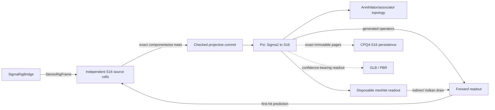

# Σ-PRISM-16 code graph

<!-- Generated by Tools/generate_code_graph.py; do not edit manually. -->

Source digest: `df0e105d231005ce95d741791fd15c6b918495eab1998216f5adbe1b3b552bd3`

Scope: 119 files, 2858 symbols, 2413 functions/methods, 42 GPU kernels, 6 event links.

## Runtime data flow

## DAG to code

| Run | Status | Mapped files |
|---|---|---:|
| S4-00 | done | 38 |
| S4-01 | done | 8 |
| S4-02 | done | 10 |
| S4-03 | done | 4 |
| S4-04 | done | 0 |
| S4-05 | done | 0 |
| S4-06 | done | 0 |
| S4-07 | done | 0 |
| S4-08 | in_progress | 3 |
| S4-09 | pending | 0 |
| S4-10 | pending | 2 |
| S4-11 | pending | 0 |
| S4-12 | pending | 0 |
| S4-13 | pending | 2 |

## Event links

- `AROcclusionManager.frameReceived` → `OnDepthFrame` ([Runtime/Core/DepthCapture.cs:246](../../Runtime/Core/DepthCapture.cs#L246))
- `OVRManager.TrackingLost` → `HandleTrackingLost` ([Runtime/Core/RoomAnchorManager.cs:49](../../Runtime/Core/RoomAnchorManager.cs#L49))
- `OVRManager.TrackingAcquired` → `HandleTrackingAcquired` ([Runtime/Core/RoomAnchorManager.cs:50](../../Runtime/Core/RoomAnchorManager.cs#L50))
- `RenderPipelineManager.endFrameRendering` → `EndFrameRendering` ([Runtime/SigmaPrism/SigmaGpuCompletion.cs:265](../../Runtime/SigmaPrism/SigmaGpuCompletion.cs#L265))
- `Aggregate.TotalNanoseconds` → `nanoseconds` ([Runtime/SigmaPrism/SigmaGpuKernelTelemetry.cs:363](../../Runtime/SigmaPrism/SigmaGpuKernelTelemetry.cs#L363))
- `DepthCapture.RawStereoFrameReceived` → `OnRawStereoDepthFrame` ([Runtime/SigmaPrism/SigmaRigBridge.cs:120](../../Runtime/SigmaPrism/SigmaRigBridge.cs#L120))

## Files and symbols

### `Editor/MetaVrManifestPostprocessor.cs`

`FindVersion` (method, L75), `MetaVrManifestPostprocessor` (class, L18), `OnPostGenerateGradleAndroidProject` (method, L22), `UpgradeGeneratedManifest` (method, L35)

### `Editor/RoomScanSetupWizard.Automation.cs`

`BuildQuestInfiniteScanSmokeApk` (method, L145), `PrepareQuestInfiniteScanSmokeProject` (method, L27), `PrepareSmokeProjectAsync` (method, L35), `RoomScanSetupWizard` (class, L23)

### `Editor/RoomScanSetupWizard.BuildProfile.cs`

`FindMetaQuestClassicProfile` (method, L151), `IsActiveProfileMetaQuest` (method, L193), `MetaQuestGuid` (method, L139), `ResolveBuildProfileApi` (method, L60), `RoomScanSetupWizard` (class, L41), `TryActivateMetaQuestProfile` (method, L216)

### `Editor/RoomScanSetupWizard.BuildingBlocks.cs`

`BlockSpec` (struct, L34), `EnsurePcaForEye` (method, L449), `EnsureRequiredBuildingBlocksAsync` (method, L202), `GetBlockDataReflective` (method, L184), `InstallBlockReflective` (method, L189), `ReadOvrManagerStartupPermFlag` (method, L110), `ResolveBuildingBlocksApi` (method, L137), `RoomScanSetupWizard` (class, L27), `WriteOvrManagerStartupPermFlag` (method, L116)

### `Editor/RoomScanSetupWizard.URP.cs`

`AllQualityLevelsUseUrp` (method, L50), `ApplyQuestFriendlyDefaults` (method, L177), `AssignToAllQualityLevels` (method, L216), `CreateURPPipelineAsset` (method, L112), `EnsureURPSetup` (method, L75), `RoomScanSetupWizard` (class, L35)

### `Editor/RoomScanSetupWizard.cs`

`AddGameReadyComponentsToRoot` (method, L97), `EnsureDebugMenuAssets` (method, L145), `EnsureQuestVRManifest` (method, L140), `EnsureVRInput` (method, L167), `FindOrCreatePanelSettings` (method, L247), `FixAROcclusion` (method, L81), `FixARSession` (method, L72), `FixDebugModules` (method, L116), `FixShaderWiring` (method, L133), `MarkDirty` (method, L261), `OnEnable` (method, L32), `OnGUI` (method, L34), `Open` (method, L28), `Refresh` (method, L62), `RoomScanSetupWizard` (class, L17), `SetBool` (method, L233), `SetPanelRenderModeWorldSpace` (method, L239), `WireComponent` (method, L203)

### `Editor/VRProjectBootstrap.cs`

`AnyFeatureEnabled` (method, L643), `Audit` (method, L84), `BuildChecks` (method, L201), `CheckResult` (enum, L36), `CheckSeverity` (enum, L35), `DescribeFeature` (method, L630), `DescribeLoaders` (method, L544), `DescribeTouchProfiles` (method, L667), `EnsureOpenXRLoader` (method, L590), `FixAllAsync` (method, L135), `GetOrCreateXRPerBuildTarget` (method, L564), `GetXRManager` (method, L553), `IsFeatureEnabled` (method, L637), `MakeArm64Check` (method, L419), `MakeMinSdkCheck` (method, L431), `MakeOpenXRFeatureCheck` (method, L616), `MakeOvrConfigEnumCheck` (method, L681), `MakeScriptingBackendCheck` (method, L405), `MakeStereoRenderingCheck` (method, L485), `MakeTargetSdkCheck` (method, L443), `MakeTextureCompressionAstcCheck` (method, L502), `MakeVulkanOnlyCheck` (method, L461), `MakeXRLoaderCheck` (method, L530), `RequireQuestScanningFeatures` (method, L100), `SetFeatureEnabled` (method, L650), `VRCheck` (class, L37), `VRProjectBootstrap` (class, L49)

### `Runtime/Camera/PassthroughCameraProvider.cs`

`ApplyConfiguration` (method, L206), `ConfigurationMatches` (method, L213), `CreateOwnedPca` (method, L191), `FindForEye` (method, L220), `OnDestroy` (method, L186), `PassthroughCameraProvider` (class, L24), `RequestCameraPermissionAsync` (method, L81), `StartCapture` (method, L108), `StopCapture` (method, L176)

### `Runtime/Core/ComputeKernelHelper.cs`

`ComputeKernelHelper` (struct, L9), `DispatchFit` (method, L36), `DispatchFit` (method, L44), `DispatchFit` (method, L54), `Set` (method, L21), `Set` (method, L26), `Set` (method, L31)

### `Runtime/Core/DepthCapture.cs`

`Awake` (method, L46), `CheckPermissionAndEnable` (method, L192), `DepthCapture` (class, L20), `EnsureArSession` (method, L183), `OnApplicationPause` (method, L106), `OnDepthFrame` (method, L143), `OnDestroy` (method, L121), `OnDisable` (method, L116), `ReleaseResources` (method, L98), `RequestNextDepthFrame` (method, L84), `Start` (method, L51), `StartDepthCapture` (method, L71), `StopDepthCapture` (method, L91), `StopProvider` (method, L251), `SubscribeAndRun` (method, L237), `Update` (method, L129), `VerifyProviderAsync` (method, L211)

### `Runtime/Core/IRoomScanModule.cs`

`IRoomScanModule` (interface, L8)

### `Runtime/Core/RoomAnchorManager.cs`

`Awake` (method, L41), `ComputeRelocationMatrix` (method, L74), `DetachChildrenForReparent` (method, L384), `EncodeSpatialAnchorUuid` (method, L157), `EraseSpatialAnchorAsync` (method, L345), `HandleTrackingAcquired` (method, L464), `HandleTrackingLost` (method, L456), `IsStablePoseStep` (method, L35), `LoadSpatialAnchorAsync` (method, L246), `OnApplicationPause` (method, L490), `OnDestroy` (method, L60), `OnDisable` (method, L52), `OnEnable` (method, L46), `OnModuleInitialize` (method, L26), `PersistSpatialAnchorUuid` (method, L449), `RevalidateTrackingAfterResume` (method, L470), `RoomAnchorManager` (class, L17), `TryDecodeSpatialAnchorUuid` (method, L164), `TryGetPersistedSpatialAnchorUuid` (method, L141), `WaitForSpatialAnchorReadyAsync` (method, L328), `WaitForStableTrackedAnchor` (method, L414), `WaitForTrackedAnchor` (method, L393)

### `Runtime/Core/RoomScanner.cs`

`Awake` (method, L94), `ClearAllDataAsync` (method, L335), `ClearAllDataCoreAsync` (method, L355), `ClearScan` (method, L328), `CycleRenderMode` (method, L387), `EnsureScanAnchorAsync` (method, L402), `InitializeModulesAsync` (method, L127), `IsModeAvailable` (method, L397), `MayCreateNewSpatialAnchor` (method, L301), `NextScanAdmissionTime` (method, L298), `ObserveModuleInitialization` (method, L153), `ObserveStart` (method, L314), `OnDestroy` (method, L184), `OnDisable` (method, L179), `ReleaseScanResources` (method, L320), `RoomScanner` (class, L36), `ScanLifecycleState` (enum, L16), `ScanRenderMode` (enum, L10), `SetRenderMode` (method, L378), `Start` (method, L114), `StartScanningAsync` (method, L192), `StartScanningCoreAsync` (method, L206), `StopScanning` (method, L275), `ToggleDebugMenu` (method, L400), `ToggleScanning` (method, L304), `Update` (method, L159)

### `Runtime/Core/RoomSpaceRoot.cs`

`Adopt` (method, L186), `AdoptAtRoomOrigin` (method, L200), `AttachToRoot` (method, L226), `Awake` (method, L97), `OnDestroy` (method, L111), `Reframe` (method, L141), `RoomSpaceRoot` (class, L58), `SetAnchorOverride` (method, L278), `Update` (method, L116), `WaitForBindAsync` (method, L252)

### `Runtime/Core/XRRuntimeGuard.cs`

`XRRuntimeGuard` (class, L19)

### `Runtime/Resources/SigmaPrism/ConeLut.compute`

`BuildConeLut` (gpu_function, L19), `LocalRay` (gpu_function, L11), `BuildConeLut` (gpu_kernel, L1)

### `Runtime/Resources/SigmaPrism/ConeMath.hlsl`

`ConeProjectionDepthToViewZ` (gpu_function, L3), `ConeSurfaceFootprint` (gpu_function, L15)

### `Runtime/Resources/SigmaPrism/DepthNormalize.compute`

`NormalizeStereoDepth` (gpu_function, L18), `NormalizeStereoDepth` (gpu_kernel, L1)

### `Runtime/Resources/SigmaPrism/Generated/SigmaGeneratedMerkabaProgram.hlsl`

`SigmaMerkabaAccumulateNativeStitchClass` (gpu_function, L1445), `SigmaMerkabaAssembleInstrumentTangent` (gpu_function, L636), `SigmaMerkabaAssociatorCoefficient` (gpu_function, L307), `SigmaMerkabaBasisAssociatorActionCoefficient` (gpu_function, L313), `SigmaMerkabaBasisAssociatorSource` (gpu_function, L322), `SigmaMerkabaBasisSign` (gpu_function, L302), `SigmaMerkabaBoundaryEnvelopesContact` (gpu_function, L1162), `SigmaMerkabaBuildDirectionalAction` (gpu_function, L1111), `SigmaMerkabaBuildInstrumentRowPermutation` (gpu_function, L599), `SigmaMerkabaCanOmitQueryRegion` (gpu_function, L1140), `SigmaMerkabaCanonicalAggregateFactorClass` (gpu_function, L1281), `SigmaMerkabaCanonicalClosureClass` (gpu_function, L1394), `SigmaMerkabaCanonicalCompareDirectedPrefix` (gpu_function, L1347), `SigmaMerkabaCanonicalCompareDirectedSuffix` (gpu_function, L1362), `SigmaMerkabaCanonicalCompareHex64` (gpu_function, L1251), `SigmaMerkabaCanonicalCompareI32` (gpu_function, L1239), `SigmaMerkabaCanonicalCompareReceipt256` (gpu_function, L1258), `SigmaMerkabaCanonicalCompareU32` (gpu_function, L1216), `SigmaMerkabaCanonicalDirectionalClass` (gpu_function, L1386), `SigmaMerkabaCanonicalEvaluateAssociatorLane` (gpu_function, L1322), `SigmaMerkabaCanonicalEvaluateLinkLane` (gpu_function, L1297), `SigmaMerkabaCanonicalFactorClassFromNonzero` (gpu_function, L1274), `SigmaMerkabaCanonicalRelationClass` (gpu_function, L1404), `SigmaMerkabaCeilEighth` (gpu_function, L716), `SigmaMerkabaChartOrbitRepresentative` (gpu_function, L1563), `SigmaMerkabaClassifyPointNativeStitchPair` (gpu_function, L1419), `SigmaMerkabaClassifyZeroDivisor` (gpu_function, L1152), `SigmaMerkabaCommonCharacterCoefficient` (gpu_function, L500), `SigmaMerkabaComposeChartD4` (gpu_function, L1550), `SigmaMerkabaDecodeDefaultLane` (gpu_function, L1146), `SigmaMerkabaEvaluateAssociatorProfileDeltaLane` (gpu_function, L342), `SigmaMerkabaEvaluateCommonMode` (gpu_function, L523), `SigmaMerkabaEvaluateEyeCharacterSeed` (gpu_function, L554), `SigmaMerkabaEvaluateFreshBoundaryRelation` (gpu_function, L904), `SigmaMerkabaEvaluateNativeStitchLink` (gpu_function, L1185), `SigmaMerkabaEvaluateShadow` (gpu_function, L461), `SigmaMerkabaFinalizeNativeStitchSet` (gpu_function, L1455), `SigmaMerkabaGaugeLess` (gpu_function, L1087), `SigmaMerkabaGaugeMortonLess` (gpu_function, L1073), `SigmaMerkabaGaugeSignedMorton` (gpu_function, L1058), `SigmaMerkabaGaugeSpread16` (gpu_function, L1049), `SigmaMerkabaGaugeZigZag` (gpu_function, L1030), `SigmaMerkabaInstrumentCompareSwap` (gpu_function, L582), `SigmaMerkabaIntegerCeil` (gpu_function, L710), `SigmaMerkabaIntegerFloor` (gpu_function, L686), `SigmaMerkabaInverseChartD4` (gpu_function, L1557), `SigmaMerkabaIsZEmpty` (gpu_function, L1006), `SigmaMerkabaLiftCommonModeLane` (gpu_function, L516), `SigmaMerkabaLiftShadow` (gpu_function, L480), `SigmaMerkabaMultiplyDualCoefficient` (gpu_function, L452), `SigmaMerkabaMultiplyDyadic` (gpu_function, L387), `SigmaMerkabaMultiplyShadowCoefficient` (gpu_function, L443), `SigmaMerkabaNativeBoundarySectorAddress` (gpu_function, L1177), `SigmaMerkabaPlaquetteHolonomy` (gpu_function, L369), `SigmaMerkabaRecoverCentredLeaves` (gpu_function, L534), `SigmaMerkabaRecoverUnitCode` (gpu_function, L567), `SigmaMerkabaResolveAdjacentOrbitFrame` (gpu_function, L1569), `SigmaMerkabaResolveFreshBranch` (gpu_function, L944), `SigmaMerkabaScaleBasisAssociatorLane` (gpu_function, L328), `SigmaMerkabaScaleCommonCharacter` (gpu_function, L505), `SigmaMerkabaSectorChartCandidateDirection` (gpu_function, L1583), `SigmaMerkabaSelectAtCommon` (gpu_function, L722), `SigmaMerkabaSelectFreshComplete` (gpu_function, L769), `SigmaMerkabaSelectFreshTangent` (gpu_function, L861), `SigmaMerkabaShadowNumerator` (gpu_function, L377), `SigmaMerkabaSignTransport` (gpu_function, L364), `SigmaMerkabaSplitDyadicGauge` (gpu_function, L1015), `SigmaMerkabaTransformChartCellLower` (gpu_function, L1597), `if` (gpu_function, L889)

### `Runtime/Resources/SigmaPrism/Generated/SigmaGeneratedTables.hlsl`

`SigmaConjugateSign` (gpu_function, L196), `SigmaHadamardSign` (gpu_function, L197), `SigmaMulBasisIndex` (gpu_function, L190), `SigmaMulBasisSign` (gpu_function, L192)

### `Runtime/Resources/SigmaPrism/RigImageCopy.compute`

`CopyProjectionDepthArray` (gpu_function, L13), `CopyProjectionDepthArray` (gpu_kernel, L1)

### `Runtime/Resources/SigmaPrism/Sedenion16.hlsl`

`SigmaApplyMagnitudeSign` (gpu_function, L121), `SigmaHadamardRow` (gpu_function, L732), `SigmaI64ShiftRightRaw` (gpu_function, L79), `SigmaLeftBasisAction` (gpu_function, L690), `SigmaMagnitudeFitsSigned` (gpu_function, L114), `SigmaQ48AddChecked` (gpu_function, L139), `SigmaQ48DivLower` (gpu_function, L680), `SigmaQ48DivNearestEven` (gpu_function, L675), `SigmaQ48DivRounded` (gpu_function, L622), `SigmaQ48DivUpper` (gpu_function, L685), `SigmaQ48DivideMagnitude` (gpu_function, L555), `SigmaQ48Mask` (gpu_function, L128), `SigmaQ48MulBounds` (gpu_function, L326), `SigmaQ48MulLower` (gpu_function, L312), `SigmaQ48MulNearestEven` (gpu_function, L307), `SigmaQ48MulRounded` (gpu_function, L277), `SigmaQ48MulUpper` (gpu_function, L317), `SigmaQ48NegateChecked` (gpu_function, L151), `SigmaQ48Select` (gpu_function, L133), `SigmaQ48ShiftLeftChecked` (gpu_function, L170), `SigmaQ48ShiftRightNearestEven` (gpu_function, L184), `SigmaQ48SubChecked` (gpu_function, L158), `SigmaQ48TryDivDyadic` (gpu_function, L362), `SigmaRightBasisAction` (gpu_function, L703), `SigmaRightSignedDyadAction` (gpu_function, L716), `SigmaU128` (struct, L212), `SigmaU32MultiplyWide` (gpu_function, L223), `SigmaU64AbsSigned` (gpu_function, L48), `SigmaU64Add` (gpu_function, L10), `SigmaU64AnyLowBits` (gpu_function, L93), `SigmaU64Bit` (gpu_function, L108), `SigmaU64DivideByU32` (gpu_function, L423), `SigmaU64Increment` (gpu_function, L21), `SigmaU64MultiplyWide` (gpu_function, L238), `SigmaU64NegateRaw` (gpu_function, L41), `SigmaU64ShiftLeftRaw` (gpu_function, L66), `SigmaU64ShiftRight` (gpu_function, L53), `SigmaU64Subtract` (gpu_function, L30), `SigmaU96DivideStep` (gpu_function, L482), `if` (gpu_function, L193)

### `Runtime/Resources/SigmaPrism/SigmaCarrier.compute`

`ApplyResidencyUpdates` (gpu_function, L239), `InitializeGpuPool` (gpu_function, L34), `InitializeResidencyIndex` (gpu_function, L224), `ResolveResidencyQueries` (gpu_function, L407), `SigmaCarrierNullLane` (gpu_function, L27), `SigmaResidencyDenseSlot` (gpu_function, L126), `SigmaResidencyInitializeLocatorEntry` (gpu_function, L181), `SigmaResidencyLocatorByteAddress` (gpu_function, L63), `SigmaResidencyLocatorKeyEqual` (gpu_function, L80), `SigmaResidencyLocatorLoad` (gpu_function, L68), `SigmaResidencyLocatorStore` (gpu_function, L74), `SigmaResidencyStoreDenseSlots` (gpu_function, L146), `SigmaResidencyStoreLocatorValue` (gpu_function, L159), `SigmaResidencyUpdateValid` (gpu_function, L99), `ApplyResidencyUpdates` (gpu_kernel, L3), `InitializeGpuPool` (gpu_kernel, L1), `InitializeResidencyIndex` (gpu_kernel, L2), `ResolveResidencyQueries` (gpu_kernel, L4)

### `Runtime/Resources/SigmaPrism/SigmaCarrierAbi.hlsl`

`SigmaCarrierPageMetaGpu` (struct, L31), `SigmaCarrierRepresentationAddress` (gpu_function, L52), `SigmaCarrierSameLogicalPage` (gpu_function, L59), `SigmaCarrierVisibleAtRoot` (gpu_function, L69)

### `Runtime/Resources/SigmaPrism/SigmaCarrierCodec.compute`

`CompactDirtyPages` (gpu_function, L490), `DecodePageBlocks` (gpu_function, L731), `EncodeDirtyPageBlocks` (gpu_function, L519), `EncodePageBlocks` (gpu_function, L336), `SigmaCodecAdd96` (gpu_function, L102), `SigmaCodecAddScaled` (gpu_function, L175), `SigmaCodecDecodeValue` (gpu_function, L306), `SigmaCodecExtractBits` (gpu_function, L199), `SigmaCodecFitsI64` (gpu_function, L124), `SigmaCodecInputIndex` (gpu_function, L78), `SigmaCodecInputIndexForSlot` (gpu_function, L84), `SigmaCodecLowMask` (gpu_function, L193), `SigmaCodecNullLane` (gpu_function, L64), `SigmaCodecOutputIndex` (gpu_function, L91), `SigmaCodecPageSample` (gpu_function, L69), `SigmaCodecReadSigned` (gpu_function, L265), `SigmaCodecReadWidth` (gpu_function, L258), `SigmaCodecResidual` (gpu_function, L130), `SigmaCodecSharedIndex` (gpu_function, L59), `SigmaCodecSignExtend96` (gpu_function, L97), `SigmaCodecSignedWidth` (gpu_function, L159), `SigmaCodecSubtract96` (gpu_function, L113), `SigmaCodecWriteDeltaLane` (gpu_function, L215), `StageDirtyPageRepresentation` (gpu_function, L707), `if` (gpu_function, L142), `if` (gpu_function, L147), `if` (gpu_function, L318), `if` (gpu_function, L323), `if` (gpu_function, L453), `if` (gpu_function, L461), `if` (gpu_function, L474), `if` (gpu_function, L634), `if` (gpu_function, L642), `if` (gpu_function, L694), `if` (gpu_function, L768), `if` (gpu_function, L789), `if` (gpu_function, L796), `CompactDirtyPages` (gpu_kernel, L3), `DecodePageBlocks` (gpu_kernel, L2), `EncodeDirtyPageBlocks` (gpu_kernel, L4), `EncodePageBlocks` (gpu_kernel, L1), `StageDirtyPageRepresentation` (gpu_kernel, L5)

### `Runtime/Resources/SigmaPrism/SigmaDirectCarrierPreview.shader`

`Attributes` (struct, L49), `PreviewContactColour` (gpu_function, L102), `PreviewContactVert` (gpu_function, L64), `SigmaPreviewBillboardCorner` (gpu_function, L39), `Varyings` (struct, L55)

### `Runtime/Resources/SigmaPrism/SigmaExactCompare.hlsl`

`SigmaI64Less` (gpu_function, L18), `SigmaQ48Less` (gpu_function, L25), `SigmaQ48Max` (gpu_function, L35), `SigmaQ48Min` (gpu_function, L30), `SigmaU64Equal` (gpu_function, L7), `SigmaU64Less` (gpu_function, L13)

### `Runtime/Resources/SigmaPrism/SigmaForwardReadout.hlsl`

`BuildPureEyeReadout` (gpu_function, L156), `SigmaReadoutDot3` (gpu_function, L40), `SigmaReadoutEvaluateEye` (gpu_function, L82), `SigmaReadoutEyeComponent` (gpu_function, L35), `SigmaReadoutEyePair` (gpu_function, L30), `SigmaReadoutLoadState` (gpu_function, L71), `SigmaReadoutVisibleAtRoot` (gpu_function, L50)

### `Runtime/Resources/SigmaPrism/SigmaFrameAbi.hlsl`

`SigmaNativeFieldRevisionGpu` (struct, L134), `SigmaNativeFrameGpu` (struct, L80), `SigmaNativeGaugeDeltaGpu` (struct, L118), `SigmaNativeObservationGpu` (struct, L88), `SigmaNativeReverseWorkGpu` (struct, L95), `SigmaNativeStateDeltaGpu` (struct, L102), `SigmaUnresolvedConstraintGpu` (struct, L125)

### `Runtime/Resources/SigmaPrism/SigmaGeometryReadout.hlsl`

`SigmaPureEyeReadoutGpu` (struct, L14), `SigmaQ48ToReadoutFloat` (gpu_function, L21)

### `Runtime/Resources/SigmaPrism/SigmaInverseAbi.hlsl`

`SigmaQ48Bounds` (struct, L23)

### `Runtime/Resources/SigmaPrism/SigmaInverseMath.hlsl`

`SigmaCalibrationValue` (gpu_function, L11), `SigmaDepthHalfWidth` (gpu_function, L64), `SigmaPriorHalfWidth` (gpu_function, L80), `SigmaQ48AbsDifference` (gpu_function, L48), `SigmaQ48FromFloatNearestEven` (gpu_function, L19), `SigmaQ48Widen` (gpu_function, L55), `if` (gpu_function, L30)

### `Runtime/Resources/SigmaPrism/SigmaNativeContract.compute`

`ContractNativeQuery` (gpu_function, L2453), `SigmaN4ChartDirection` (gpu_function, L1415), `SigmaN4ContractBoundaryCandidate` (gpu_function, L1137), `SigmaN4ContractStoreNoStitch` (gpu_function, L1121), `SigmaN4TileAnchorDecode` (gpu_function, L1279), `SigmaN4TileAnchorEncode` (gpu_function, L1274), `SigmaN4TileApplyChartFrame` (gpu_function, L1758), `SigmaN4TileBoundaryHeader` (gpu_function, L1400), `SigmaN4TileBoundaryIndex` (gpu_function, L1378), `SigmaN4TileBuildWeightedComponents` (gpu_function, L1955), `SigmaN4TileCanonicalComponentAddress` (gpu_function, L1219), `SigmaN4TileCanonicalImageAddress` (gpu_function, L1225), `SigmaN4TileCertificate` (gpu_function, L1481), `SigmaN4TileCertificateReduce` (gpu_function, L1494), `SigmaN4TileChartAssigned` (gpu_function, L1713), `SigmaN4TileChartOverlapHash` (gpu_function, L1896), `SigmaN4TileChartTransformAssigned` (gpu_function, L1741), `SigmaN4TileChartTransformFrame` (gpu_function, L1753), `SigmaN4TileChartTransformPosition` (gpu_function, L1746), `SigmaN4TileClose` (gpu_function, L2363), `SigmaN4TileCompactCanonicalInput` (gpu_function, L2320), `SigmaN4TileCompareAnchor` (gpu_function, L1339), `SigmaN4TileCompareSignedDyadic` (gpu_function, L1305), `SigmaN4TileComponentAddress` (gpu_function, L1212), `SigmaN4TileComposeChartTransform` (gpu_function, L1767), `SigmaN4TileComposeChartTransforms` (gpu_function, L1811), `SigmaN4TileD4EquivalenceMask` (gpu_function, L2119), `SigmaN4TileFinalizeComponents` (gpu_function, L2145), `SigmaN4TileFootprintAddress` (gpu_function, L1200), `SigmaN4TileFootprintValid` (gpu_function, L1241), `SigmaN4TileGlobalFootprint` (gpu_function, L1231), `SigmaN4TileHookTransform` (gpu_function, L1854), `SigmaN4TileIdentityChartTransform` (gpu_function, L1790), `SigmaN4TileInverseChartTransform` (gpu_function, L1780), `SigmaN4TileMeetSupports` (gpu_function, L1537), `SigmaN4TileNeighbour` (gpu_function, L1426), `SigmaN4TileOfferForestEdge` (gpu_function, L1874), `SigmaN4TileOrbitTransform` (gpu_function, L1796), `SigmaN4TilePackAnchorOrbits` (gpu_function, L1285), `SigmaN4TilePackChart` (gpu_function, L1707), `SigmaN4TilePackChartTransform` (gpu_function, L1725), `SigmaN4TilePackedChartEqual` (gpu_function, L1891), `SigmaN4TileRejectDistinctChartOverlaps` (gpu_function, L1907), `SigmaN4TileRelativeChartTransform` (gpu_function, L1819), `SigmaN4TileResolvedEdge` (gpu_function, L1408), `SigmaN4TileSetOrbitTransform` (gpu_function, L1802), `SigmaN4TileSortSupports` (gpu_function, L1443), `SigmaN4TileStoreCertificate` (gpu_function, L1488), `SigmaN4TileStructuralCertificateEqual` (gpu_function, L1507), `SigmaN4TileSupportAddress` (gpu_function, L1205), `SigmaN4TileSupportKey` (gpu_function, L1259), `SigmaN4TileUnpackAnchorOrbit` (gpu_function, L1294), `SigmaN4TileUnpackChartCoordinate` (gpu_function, L1718), `SigmaN5ContractSourceRepresentation` (gpu_function, L75), `SigmaN5ContractSourceState` (gpu_function, L67), `SigmaNativeFreshEntryValid` (gpu_function, L256), `SigmaNativeFreshEvidenceAddress` (gpu_function, L227), `SigmaNativeFreshFinalize` (gpu_function, L2375), `SigmaNativeFreshLiftFootprint` (gpu_function, L1112), `SigmaNativeFreshLiftLegacyBranch` (gpu_function, L1104), `SigmaNativeFreshLiftSource` (gpu_function, L301), `SigmaNativeFreshLoad2` (gpu_function, L236), `SigmaNativeFreshLoad4` (gpu_function, L244), `SigmaNativeFreshModeMask` (gpu_function, L291), `SigmaNativeFreshPermutationAxis` (gpu_function, L264), `SigmaNativeFreshPermutationMode` (gpu_function, L273), `SigmaNativeFreshQ48Equal` (gpu_function, L251), `SigmaNativeFreshTeamAxisAddress` (gpu_function, L217), `SigmaNativeFreshTeamEyeAddress` (gpu_function, L222), `SigmaNativeFreshTeamLaneAddress` (gpu_function, L207), `SigmaNativeFreshTeamLeafAddress` (gpu_function, L212), `if` (gpu_function, L1020), `if` (gpu_function, L1028), `if` (gpu_function, L1048), `if` (gpu_function, L368), `if` (gpu_function, L758), `ContractNativeQuery` (gpu_kernel, L4)

### `Runtime/Resources/SigmaPrism/SigmaNativeFrame.compute`

`BuildNativeObservation` (gpu_function, L1062), `CloseAndPublishNativeRevision` (gpu_function, L6406), `PrepareNativeCanonicalRuns` (gpu_function, L5446), `PrepareNativeCanonicalSeed` (gpu_function, L5361), `PrepareNativeCanonicalSelect` (gpu_function, L5476), `PrepareNativeComponentOrder` (gpu_function, L5609), `PrepareNativePage` (gpu_function, L6253), `PrepareNativeRefinementPlan` (gpu_function, L5736), `PrepareNativeRefinementProof` (gpu_function, L5545), `PrepareNativeRefinementScan` (gpu_function, L5667), `PrepareNativeRevision` (gpu_function, L5765), `ScatterNativeState` (gpu_function, L6319), `SigmaN4PublishAccumulateComponentFresh` (gpu_function, L5242), `SigmaN4PublishActiveSupport` (gpu_function, L3949), `SigmaN4PublishActiveSupportAddress` (gpu_function, L1337), `SigmaN4PublishActiveSupportListOffset` (gpu_function, L1330), `SigmaN4PublishAffineCompose` (gpu_function, L1148), `SigmaN4PublishAnchorAt` (gpu_function, L3046), `SigmaN4PublishAnchorFootprintLess` (gpu_function, L3226), `SigmaN4PublishAnchorKeyLess` (gpu_function, L3003), `SigmaN4PublishAppendRefinementChild` (gpu_function, L3868), `SigmaN4PublishAppendRefinementMember` (gpu_function, L1642), `SigmaN4PublishAppendRelocation` (gpu_function, L3965), `SigmaN4PublishBeginWideStage` (gpu_function, L4762), `SigmaN4PublishBoundaryIndex` (gpu_function, L2427), `SigmaN4PublishBuildComponentBlockSummaries` (gpu_function, L5257), `SigmaN4PublishBuildDelta` (gpu_function, L3750), `SigmaN4PublishBuildRefinementDelta` (gpu_function, L3788), `SigmaN4PublishCandidateAnchorLess` (gpu_function, L3249), `SigmaN4PublishCanonicalKeyAddress` (gpu_function, L2206), `SigmaN4PublishCanonicalMergeRunCount` (gpu_function, L5105), `SigmaN4PublishCanonicalMergeRunSize` (gpu_function, L5099), `SigmaN4PublishCanonicalMergedRunLowerBound` (gpu_function, L5111), `SigmaN4PublishCanonicalRunCount` (gpu_function, L4793), `SigmaN4PublishCanonicalRunLowerBound` (gpu_function, L5076), `SigmaN4PublishCanonicalRunSize` (gpu_function, L4785), `SigmaN4PublishCertificateEqual` (gpu_function, L1373), `SigmaN4PublishChart` (gpu_function, L1315), `SigmaN4PublishChartCore` (gpu_function, L1228), `SigmaN4PublishChildOrderLoad` (gpu_function, L4058), `SigmaN4PublishChildOrderStore` (gpu_function, L4066), `SigmaN4PublishCollectParallelEdges` (gpu_function, L2592), `SigmaN4PublishCompareBoundary` (gpu_function, L2458), `SigmaN4PublishCompareCanonicalEntries` (gpu_function, L4986), `SigmaN4PublishCompareCell` (gpu_function, L2393), `SigmaN4PublishCompareComponentCellEntries` (gpu_function, L2780), `SigmaN4PublishCompareComponentCellStreams` (gpu_function, L2694), `SigmaN4PublishCompareComponentEdgeStreams` (gpu_function, L2734), `SigmaN4PublishCompareD4Images` (gpu_function, L4910), `SigmaN4PublishCompareEdgeStreams` (gpu_function, L2526), `SigmaN4PublishCompareParallelD4PairAt` (gpu_function, L2660), `SigmaN4PublishCompareParallelEncodedEdge` (gpu_function, L2579), `SigmaN4PublishComparePreparedCoordinateKey` (gpu_function, L2351), `SigmaN4PublishCompareReceipt128` (gpu_function, L2382), `SigmaN4PublishCompareRefinementCandidates` (gpu_function, L4266), `SigmaN4PublishCompareSignedDyadic` (gpu_function, L2969), `SigmaN4PublishComponentAddress` (gpu_function, L1118), `SigmaN4PublishComponentBlockCount` (gpu_function, L3494), `SigmaN4PublishComponentCellRunBound` (gpu_function, L2904), `SigmaN4PublishComponentMergeLowerBound` (gpu_function, L2824), `SigmaN4PublishComponentRunCount` (gpu_function, L2801), `SigmaN4PublishComputeOldTarget` (gpu_function, L4665), `SigmaN4PublishComputeRefinementChildTarget` (gpu_function, L4694), `SigmaN4PublishCoordinate` (gpu_function, L2127), `SigmaN4PublishCurrentEqual` (gpu_function, L3824), `SigmaN4PublishD4Compose` (gpu_function, L1143), `SigmaN4PublishD4PairImages` (gpu_function, L2645), `SigmaN4PublishD4PairIndex` (gpu_function, L4855), `SigmaN4PublishD4PairReceipt` (gpu_function, L4872), `SigmaN4PublishD4Vector` (gpu_function, L1136), `SigmaN4PublishDeltaLane` (gpu_function, L6307), `SigmaN4PublishFinalizeComponentPrefixes` (gpu_function, L3506), `SigmaN4PublishFinalizeComponentSummary` (gpu_function, L5331), `SigmaN4PublishFindCoordinateRepresentative` (gpu_function, L1929), `SigmaN4PublishFindRoot` (gpu_function, L1166), `SigmaN4PublishFinishRefinementBlockScan` (gpu_function, L4465), `SigmaN4PublishFinishRefinementMember` (gpu_function, L1962), `SigmaN4PublishFlushWideStage` (gpu_function, L4772), `SigmaN4PublishFootprintValid` (gpu_function, L1185), `SigmaN4PublishFreshBitsetAddress` (gpu_function, L4081), `SigmaN4PublishFreshBitsetWordCount` (gpu_function, L4073), `SigmaN4PublishFreshBlockAddress` (gpu_function, L4086), `SigmaN4PublishFreshInclusive` (gpu_function, L4589), `SigmaN4PublishGaugeEqual` (gpu_function, L4134), `SigmaN4PublishImageAddress` (gpu_function, L1124), `SigmaN4PublishInitializeD4Pairs` (gpu_function, L4861), `SigmaN4PublishInitializeRefinementLeader` (gpu_function, L1748), `SigmaN4PublishLoadBorderPartial` (gpu_function, L3207), `SigmaN4PublishLoadCanonicalKey` (gpu_function, L2292), `SigmaN4PublishLoadComponentMergeEntry` (gpu_function, L2808), `SigmaN4PublishLoadFinalImage` (gpu_function, L1743), `SigmaN4PublishLoadGlobalTransform` (gpu_function, L1158), `SigmaN4PublishLoadParallelImage` (gpu_function, L4800), `SigmaN4PublishLoadRefinementMember` (gpu_function, L1630), `SigmaN4PublishLoadStageState` (gpu_function, L4742), `SigmaN4PublishLogicalCapacity` (gpu_function, L4018), `SigmaN4PublishMaterializeSelected` (gpu_function, L5202), `SigmaN4PublishMeetParentCertificateCore` (gpu_function, L1433), `SigmaN4PublishMergeBorderPartial` (gpu_function, L3271), `SigmaN4PublishMergeCanonicalRunsAt` (gpu_function, L5132), `SigmaN4PublishMinD4PairReceipt` (gpu_function, L4884), `SigmaN4PublishNeighbour` (gpu_function, L2445), `SigmaN4PublishNextPowerOfTwo` (gpu_function, L3472), `SigmaN4PublishPackedActiveIndex` (gpu_function, L1398), `SigmaN4PublishParallelChildBound` (gpu_function, L4652), `SigmaN4PublishParallelEdgeTargetRank` (gpu_function, L2556), `SigmaN4PublishParallelRank` (gpu_function, L4842), `SigmaN4PublishParentCertificateMeetWord` (gpu_function, L1520), `SigmaN4PublishPlanAddress` (gpu_function, L1130), `SigmaN4PublishPrepareRefinementCandidates` (gpu_function, L4170), `SigmaN4PublishRankComponentAt` (gpu_function, L2928), `SigmaN4PublishReduceRefinementMember` (gpu_function, L1781), `SigmaN4PublishRefinedBitsetAddress` (gpu_function, L4039), `SigmaN4PublishRefinedBitsetWordCount` (gpu_function, L4034), `SigmaN4PublishRefinedBlockPrefixAddress` (gpu_function, L4045), `SigmaN4PublishRefinedInclusive` (gpu_function, L4555), `SigmaN4PublishRefinementArenaLogicalCapacity` (gpu_function, L4030), `SigmaN4PublishRefinementCandidateKey` (gpu_function, L4247), `SigmaN4PublishRefinementChildKey` (gpu_function, L4114), `SigmaN4PublishRefinementChildOrderAddress` (gpu_function, L4051), `SigmaN4PublishRefinementCoordinateRepresentative` (gpu_function, L1715), `SigmaN4PublishRefinementCoordinateSlot` (gpu_function, L1669), `SigmaN4PublishRefinementGroupAddress` (gpu_function, L1582), `SigmaN4PublishRefinementMemberRecordBase` (gpu_function, L1593), `SigmaN4PublishRefinementMemberStorageValid` (gpu_function, L1597), `SigmaN4PublishRefinementPreStatus` (gpu_function, L1851), `SigmaN4PublishRefinementRepresentative` (gpu_function, L1345), `SigmaN4PublishRefinementRunLowerBound` (gpu_function, L4623), `SigmaN4PublishRefinementScratchAddress` (gpu_function, L1571), `SigmaN4PublishRefinementScratchValid` (gpu_function, L1736), `SigmaN4PublishResidentPagePlanCapacity` (gpu_function, L4010), `SigmaN4PublishRootOfNode` (gpu_function, L3018), `SigmaN4PublishSameRefinementCoordinate` (gpu_function, L1649), `SigmaN4PublishScanRefinementBlock` (gpu_function, L4363), `SigmaN4PublishSeedBorderBlock` (gpu_function, L3296), `SigmaN4PublishSeedTile` (gpu_function, L3099), `SigmaN4PublishSelectComponentD4` (gpu_function, L5158), `SigmaN4PublishSelectedBounds` (gpu_function, L1898), `SigmaN4PublishSelectedCoordinate` (gpu_function, L2165), `SigmaN4PublishSetAnchor` (gpu_function, L3058), `SigmaN4PublishSigned64` (gpu_function, L2102), `SigmaN4PublishSignedOrderKey` (gpu_function, L1388), `SigmaN4PublishSignedOrderValue` (gpu_function, L1393), `SigmaN4PublishSortCanonicalRun` (gpu_function, L5010), `SigmaN4PublishSortComponentRun` (gpu_function, L2844), `SigmaN4PublishSortRefinementRun` (gpu_function, L4303), `SigmaN4PublishSourceLogical` (gpu_function, L4092), `SigmaN4PublishSourceLowerBound` (gpu_function, L4140), `SigmaN4PublishSourceSampleInRange` (gpu_function, L1220), `SigmaN4PublishStateEqual` (gpu_function, L1361), `SigmaN4PublishStaticExclusion` (gpu_function, L1322), `SigmaN4PublishStoreBorderPartial` (gpu_function, L3190), `SigmaN4PublishStoreCanonicalKeyImage` (gpu_function, L2214), `SigmaN4PublishStoreComponentMergeEntry` (gpu_function, L2816), `SigmaN4PublishStoreParallelImage` (gpu_function, L4923), `SigmaN4PublishStoreParallelRank` (gpu_function, L4813), `SigmaN4PublishStoreRefinementMember` (gpu_function, L1603), `SigmaN4PublishStoreSeedComponent` (gpu_function, L3071), `SigmaN4PublishStoreStageState` (gpu_function, L4752), `SigmaN4PublishStructuralCertificateCompatible` (gpu_function, L1403), `SigmaN4PublishSupportLocator` (gpu_function, L1204), `SigmaN4PublishTileComponentAddress` (gpu_function, L1111), `SigmaN4PublishTileFootprintAddress` (gpu_function, L1105), `SigmaN4PublishTileGlobalFootprint` (gpu_function, L3037), `SigmaN4PublishTileHeaderAddress` (gpu_function, L1099), `SigmaN4PublishTransformedCoordinate` (gpu_function, L2108), `SigmaN4PublishValidateParentCertificateMeet` (gpu_function, L1513), `SigmaN4PublishVisibleSlot` (gpu_function, L3607), `SigmaN5PredictionPageRequestAddress` (gpu_function, L476), `SigmaN5PredictionPageRequestKeyEqual` (gpu_function, L483), `SigmaN5PublishBindPagePlanSource` (gpu_function, L3710), `SigmaN5PublishFindOrClaimPagePlan` (gpu_function, L3687), `SigmaN5PublishFindPagePlan` (gpu_function, L3669), `SigmaN5PublishLogicalPage` (gpu_function, L3661), `SigmaN5PublishSourceLogicalAddress` (gpu_function, L3734), `SigmaN5RecordPredictionPageRequest` (gpu_function, L497), `SigmaN5ResolveResidentPrediction` (gpu_function, L577), `SigmaN5SourceMetadata` (gpu_function, L138), `SigmaN5SourceRepresentation` (gpu_function, L157), `SigmaN5SourceSlotDecode` (gpu_function, L120), `SigmaN5SourceState` (gpu_function, L149), `SigmaN5TargetGlobalSlot` (gpu_function, L132), `SigmaNativeBuildFullFrameFootprints` (gpu_function, L750), `SigmaNativeCompletionAddress` (gpu_function, L294), `SigmaNativeCurrentPrediction` (gpu_function, L628), `SigmaNativeDepthRayCenter` (gpu_function, L331), `SigmaNativeDepthRayDx` (gpu_function, L337), `SigmaNativeDepthRayDy` (gpu_function, L343), `SigmaNativeDepthSlopeBounds` (gpu_function, L349), `SigmaNativeFootprintEvidenceAddress` (gpu_function, L722), `SigmaNativeObservationProvenance` (gpu_function, L734), `SigmaNativeOpticalBoundsFromSamples` (gpu_function, L439), `SigmaNativeProjectRgb` (gpu_function, L413), `SigmaNativeProjectionDepthBounds` (gpu_function, L378), `SigmaNativeQ48FromFloat` (gpu_function, L321), `SigmaNativeRgbCalibrationValue` (gpu_function, L326), `SigmaNativeRgbLoad` (gpu_function, L433), `SigmaNativeRoomRayComponent` (gpu_function, L362), `SigmaNativeSampleBoundaryCorner` (gpu_function, L355), `SigmaNativeStoreFootprintEvidence` (gpu_function, L727), `SigmaNativeWriteCompletion4` (gpu_function, L299), `SigmaNativeWriteCompletionFrame` (gpu_function, L306), `if` (gpu_function, L1479), `if` (gpu_function, L1487), `if` (gpu_function, L1533), `if` (gpu_function, L1541), `if` (gpu_function, L2247), `if` (gpu_function, L2252), `if` (gpu_function, L2257), `if` (gpu_function, L2262), `if` (gpu_function, L2267), `if` (gpu_function, L2272), `if` (gpu_function, L2311), `if` (gpu_function, L2316), `if` (gpu_function, L2321), `if` (gpu_function, L2326), `if` (gpu_function, L2331), `if` (gpu_function, L2336), `if` (gpu_function, L4204), `if` (gpu_function, L4569), `if` (gpu_function, L4603), `if` (gpu_function, L4936), `if` (gpu_function, L4943), `if` (gpu_function, L4950), `if` (gpu_function, L4957), `if` (gpu_function, L4964), `if` (gpu_function, L4971), `if` (gpu_function, L5823), `if` (gpu_function, L6204), `if` (gpu_function, L6222), `if` (gpu_function, L6376), `BuildNativeObservation` (gpu_kernel, L4), `CloseAndPublishNativeRevision` (gpu_kernel, L15), `PrepareNativeCanonicalRuns` (gpu_kernel, L6), `PrepareNativeCanonicalSeed` (gpu_kernel, L5), `PrepareNativeCanonicalSelect` (gpu_kernel, L7), `PrepareNativeComponentOrder` (gpu_kernel, L9), `PrepareNativePage` (gpu_kernel, L13), `PrepareNativeRefinementPlan` (gpu_kernel, L11), `PrepareNativeRefinementProof` (gpu_kernel, L8), `PrepareNativeRefinementScan` (gpu_kernel, L10), `PrepareNativeRevision` (gpu_kernel, L12), `ScatterNativeState` (gpu_kernel, L14)

### `Runtime/Resources/SigmaPrism/SigmaNativeMath.hlsl`

`SigmaNativeAggregateFactorClass` (gpu_function, L129), `SigmaNativeArrayIsZero` (gpu_function, L53), `SigmaNativeEvaluateRelationGroup` (gpu_function, L548), `SigmaNativeEvaluateState` (gpu_function, L110), `SigmaNativeEvaluateStateAtRows` (gpu_function, L72), `SigmaNativeGroupClassifyFactor` (gpu_function, L430), `SigmaNativeGroupFactorValue` (gpu_function, L269), `SigmaNativeGroupProduct` (gpu_function, L228), `SigmaNativeGroupProductLeft` (gpu_function, L191), `SigmaNativeGroupProductRight` (gpu_function, L203), `SigmaNativeGroupStoreProduct` (gpu_function, L214), `SigmaNativeGroupU128Less` (gpu_function, L543), `SigmaNativeHashGroupFactor` (gpu_function, L528), `SigmaNativeHashS16` (gpu_function, L142), `SigmaNativeLoadState` (gpu_function, L47), `SigmaNativePointInInterval` (gpu_function, L122), `SigmaNativeSignedU256Add` (gpu_function, L361), `SigmaNativeStateIsZero` (gpu_function, L62), `SigmaNativeU128AddCarry` (gpu_function, L291), `SigmaNativeU128LessInitialized` (gpu_function, L328), `SigmaNativeU128MultiplyU32` (gpu_function, L418), `SigmaNativeU128Subtract` (gpu_function, L275), `SigmaNativeU256Add` (gpu_function, L311), `SigmaNativeU256AddShifted128` (gpu_function, L401), `SigmaNativeU256Less` (gpu_function, L340), `SigmaNativeU256Subtract` (gpu_function, L349), `SigmaU128Add64` (gpu_function, L17), `SigmaU128Equal` (gpu_function, L12), `if` (gpu_function, L409), `if` (gpu_function, L509), `if` (gpu_function, L514)

### `Runtime/Resources/SigmaPrism/SigmaNativeQuery.compute`

`EvaluateNativeRelation` (gpu_function, L1391), `SigmaN4Affine` (gpu_function, L819), `SigmaN4AffineCompose` (gpu_function, L847), `SigmaN4AffineEqual` (gpu_function, L866), `SigmaN4AffineIdentity` (gpu_function, L825), `SigmaN4AffineInverse` (gpu_function, L857), `SigmaN4BoundaryFactor` (gpu_function, L186), `SigmaN4BoundaryReceiptAddress` (gpu_function, L132), `SigmaN4ChartDirection` (gpu_function, L878), `SigmaN4ChartOrbitRepresentative` (gpu_function, L872), `SigmaN4ClassifyBoundaryFactors` (gpu_function, L222), `SigmaN4CountBoundaryResult` (gpu_function, L150), `SigmaN4CrossBoundaryCount` (gpu_function, L945), `SigmaN4D4Compose` (gpu_function, L837), `SigmaN4D4Inverse` (gpu_function, L842), `SigmaN4D4Vector` (gpu_function, L830), `SigmaN4DecodeBoundary` (gpu_function, L161), `SigmaN4DecodeCrossBoundary` (gpu_function, L951), `SigmaN4DirectRightToLeft` (gpu_function, L904), `SigmaN4EvaluateCompactedBoundary` (gpu_function, L548), `SigmaN4EvaluateImplicitBoundary` (gpu_function, L305), `SigmaN4FindGlobalRoot` (gpu_function, L1001), `SigmaN4FindTileSupport` (gpu_function, L582), `SigmaN4FootprintAddress` (gpu_function, L127), `SigmaN4GlobalCanonicalComponentAddress` (gpu_function, L807), `SigmaN4GlobalCanonicalImageAddress` (gpu_function, L813), `SigmaN4GlobalCertificateCompatible` (gpu_function, L634), `SigmaN4GlobalCertificateReduce` (gpu_function, L619), `SigmaN4GlobalGeometryClose` (gpu_function, L1035), `SigmaN4GlobalNode` (gpu_function, L930), `SigmaN4GlobalParentAddress` (gpu_function, L796), `SigmaN4GlobalRootLink` (gpu_function, L1020), `SigmaN4GlobalTransformAddress` (gpu_function, L801), `SigmaN4LoadChartState` (gpu_function, L896), `SigmaN4LoadGlobalMeta` (gpu_function, L84), `SigmaN4LoadGlobalState` (gpu_function, L95), `SigmaN4LoadGlobalTransform` (gpu_function, L987), `SigmaN4ReduceActiveSupport` (gpu_function, L650), `SigmaN4ResolveAdjacentFrame` (gpu_function, L887), `SigmaN4SignedU128Add` (gpu_function, L192), `SigmaN4StoreBoundaryReceipt` (gpu_function, L138), `SigmaN4StoreGlobalMeta` (gpu_function, L89), `SigmaN4StoreGlobalState` (gpu_function, L100), `SigmaN4StoreGlobalTransform` (gpu_function, L994), `SigmaN4TileComponentAddress` (gpu_function, L789), `SigmaN4TileFootprintAddress` (gpu_function, L783), `SigmaN4TileHeaderAddress` (gpu_function, L570), `SigmaN4TileSupportAddress` (gpu_function, L575), `EvaluateNativeRelation` (gpu_kernel, L3)

### `Runtime/Resources/SigmaPrism/SigmaOperatorFixture.compute`

`AlgebraParity` (gpu_function, L75), `BasisTableParity` (gpu_function, L102), `CanonicalSelfTest` (gpu_function, L112), `NumericParity` (gpu_function, L26), `SigmaWriteNumeric` (gpu_function, L20), `AlgebraParity` (gpu_kernel, L2), `BasisTableParity` (gpu_kernel, L3), `CanonicalSelfTest` (gpu_kernel, L4), `NumericParity` (gpu_kernel, L1)

### `Runtime/Resources/SigmaPrism/SigmaOperatorPlan.hlsl`

`SigmaCanonicalMutationEnabled` (gpu_function, L7), `SigmaConjugatePlan` (gpu_function, L16), `SigmaGeometryGPlan` (gpu_function, L81), `SigmaHadamardBPlan` (gpu_function, L68), `SigmaHadamardButterfly` (gpu_function, L40), `SigmaHadamardButterflySafe` (gpu_function, L25), `SigmaHiddenFPlan` (gpu_function, L90), `SigmaProjectiveClamp` (gpu_function, L118), `SigmaProjectiveMeetLower` (gpu_function, L108), `SigmaProjectiveMeetUpper` (gpu_function, L113)

### `Runtime/Resources/SigmaPrism/SigmaPoseConsume.hlsl`

`SigmaPoseApplyVectorWorld` (gpu_function, L71), `SigmaPoseApplyWorld` (gpu_function, L97), `SigmaPoseQ48Float` (gpu_function, L13), `SigmaPoseRodriguesCoefficients` (gpu_function, L37), `SigmaPoseRotate` (gpu_function, L58), `SigmaPoseTwist` (gpu_function, L25), `SigmaPoseTwistPacked` (gpu_function, L19), `SigmaPoseUnapplyVectorWorld` (gpu_function, L84), `SigmaPoseUnapplyWorld` (gpu_function, L114)

### `Runtime/Resources/SigmaPrism/SigmaPoseGauge.compute`

`BuildCorrectedCalibration` (gpu_function, L525), `BuildPoseGaugePartials` (gpu_function, L378), `ReducePoseGauge` (gpu_function, L441), `SigmaPoseBuildCells` (gpu_function, L204), `SigmaPoseCross` (gpu_function, L112), `SigmaPoseDecodeNormal` (gpu_function, L75), `SigmaPoseDot` (gpu_function, L126), `SigmaPoseMaxIncrement` (gpu_function, L94), `SigmaPoseMetaPrior` (gpu_function, L87), `SigmaPosePointToReference` (gpu_function, L175), `SigmaPoseQ48VectorFromFloat` (gpu_function, L104), `SigmaPoseQuantizeCorrected` (gpu_function, L518), `SigmaPoseReduceShared` (gpu_function, L43), `SigmaPoseVectorNonZero` (gpu_function, L136), `SigmaPoseVectorToReference` (gpu_function, L146), `BuildCorrectedCalibration` (gpu_kernel, L3), `BuildPoseGaugePartials` (gpu_kernel, L1), `ReducePoseGauge` (gpu_kernel, L2)

### `Runtime/Resources/SigmaPrism/SigmaPredict.shader`

`ContactVert` (gpu_function, L67), `PredictionFrag` (gpu_function, L117), `PredictionOutput` (struct, L109), `PredictionVaryings` (struct, L57), `SigmaBillboardCorner` (gpu_function, L35), `SigmaEncodeOctahedral` (gpu_function, L45)

### `Runtime/Resources/SigmaPrism/SigmaResidencyAbi.hlsl`

`SigmaResidencyHashKey` (gpu_function, L96), `SigmaResidencyHashWord` (gpu_function, L87), `SigmaResidencyKeyEqual` (gpu_function, L145), `SigmaResidencyStateHasSlot` (gpu_function, L114), `SigmaResidencyStateValid` (gpu_function, L109), `SigmaResidencyTransitionAllowed` (gpu_function, L123), `SigmaResidencyUpdateGpu` (struct, L55), `SigmaResidentSlotGpu` (struct, L71)

### `Runtime/Resources/SigmaPrism/SigmaStableScan.hlsl`

`SigmaStableExclusiveScan256` (gpu_function, L78), `SigmaStableExclusiveScan256Dual` (gpu_function, L13)

### `Runtime/RoomScanInputHandler.cs`

`AddBinding` (method, L61), `ClearAllBindings` (method, L85), `ExecuteAction` (method, L107), `RemoveBindingsForAction` (method, L69), `RemoveBindingsForButton` (method, L77), `RoomScanInputHandler` (class, L42), `ScanAction` (enum, L10), `ScanInputBinding` (class, L25), `Update` (method, L89)

### `Runtime/SigmaPrism/Calibration/ConeLutResources.cs`

`Acquire` (method, L126), `Build` (method, L165), `CeilDiv` (method, L266), `ConeLutLease` (class, L34), `ConeProjectionLut` (class, L12), `Create` (method, L114), `CreateTexture` (method, L219), `Destroy` (method, L208), `DestroyProjection` (method, L245), `DestroyTexture` (method, L255), `Dispose` (method, L56), `Get` (method, L156), `Get` (method, L47), `Release` (method, L147), `Retain` (method, L140), `Retain` (method, L49), `Retire` (method, L132), `RigConeLutSet` (class, L69)

### `Runtime/SigmaPrism/Calibration/ConeProjectionMath.cs`

`ConeProjectionMath` (class, L31), `MetricConeFootprint` (struct, L10), `RayAtImagePoint` (method, L108), `TryReproject` (method, L93), `TrySurfaceFootprint` (method, L38), `TryWorldToPixel` (method, L69)

### `Runtime/SigmaPrism/Calibration/RigCalibration.cs`

`Get` (method, L73), `IsCompatible` (method, L82), `Projection` (method, L117), `RigCalibration` (class, L45), `RigLensModel` (enum, L13), `RigProjection` (enum, L6), `RigProjectionCalibration` (struct, L19), `TryCreate` (method, L94)

### `Runtime/SigmaPrism/Capture/GpuTextureRing.cs`

`CommitSubmittedSlot` (method, L309), `DestroySlot` (method, L504), `DestroyTexture` (method, L513), `Dispose` (method, L240), `Dispose` (method, L50), `EnsureCompatibleTarget` (method, L383), `GetTexture` (method, L216), `GetVolumeDepth` (method, L428), `GpuTextureCopyMode` (enum, L8), `GpuTextureLease` (class, L18), `GpuTextureRing` (class, L65), `IsSupportedDimension` (method, L437), `LatchCompletionFault` (method, L337), `NextGeneration` (method, L502), `PollCompletion` (method, L321), `RecordCopyOnGpu` (method, L456), `Release` (method, L228), `Retain` (method, L222), `Retain` (method, L42), `RetireSlot` (method, L366), `Slot` (class, L67), `TargetDimension` (method, L446), `TargetFormat` (method, L451), `TryCopy` (method, L115), `TryCopyPair` (method, L154), `TryDestroyRetiredSlot` (method, L348), `TrySelectSlot` (method, L263), `ValidateLease` (method, L253)

### `Runtime/SigmaPrism/Capture/RawStereoDepthFrame.cs`

`IsFinite` (method, L40), `IsFinite` (method, L48), `RawStereoDepthFrame` (struct, L10)

### `Runtime/SigmaPrism/Capture/RigCalibrationMath.cs`

`Add` (method, L187), `Add` (method, L190), `Add` (method, L193), `CombineSignatures` (method, L76), `ConeRayAtPixel` (method, L89), `ConeRayReference` (struct, L10), `FromDepthFov` (method, L55), `FromPassthrough` (method, L31), `IntrinsicsToFov` (method, L158), `ProjectionDepth01FromViewZ` (method, L119), `RangeFromProjectionDepth01` (method, L141), `RayAtImagePoint` (method, L150), `RigCalibrationMath` (class, L8), `Signature` (method, L168), `ViewZFromProjectionDepth01` (method, L130)

### `Runtime/SigmaPrism/Capture/RigCaptureContracts.cs`

`AbsoluteDelta` (method, L147), `AbsoluteDeltaNanoseconds` (method, L215), `DestinationFromSource` (method, L512), `Dispose` (method, L495), `Equals` (method, L223), `Equals` (method, L229), `Equals` (method, L274), `Equals` (method, L280), `EquivalentRange` (method, L356), `FiniteRasterFar` (method, L370), `FromUnixDateTime` (method, L208), `FromViews` (method, L393), `GetHashCode` (method, L231), `GetHashCode` (method, L282), `GpuImageView` (struct, L289), `IsFinite` (method, L335), `IsFinite` (method, L338), `IsValid` (method, L349), `IsValidRange` (method, L351), `Match` (method, L94), `Retain` (method, L484), `RigCaptureDiagnosticSnapshot` (struct, L163), `RigClockDomain` (enum, L29), `RigDepthContract` (class, L347), `RigDepthEncoding` (enum, L20), `RigExtrinsicsSnapshot` (struct, L374), `RigEye` (enum, L7), `RigFrameRejectionReason` (enum, L39), `RigIntrinsics` (struct, L241), `RigLatestSnapshotMatch` (enum, L59), `RigLatestSnapshotMatchResult` (struct, L66), `RigLatestSnapshotMatcher` (class, L92), `RigPairingHealth` (struct, L408), `RigPoseMath` (class, L509), `RigStreamKind` (enum, L12), `RigTimestamp` (struct, L188), `SaturatingAdd` (method, L153), `StereoRigFrameLease` (class, L428), `ToString` (method, L235), `ViewMatches` (method, L362)

### `Runtime/SigmaPrism/Capture/RigClockMapper.cs`

`CreateRuntime` (method, L23), `RigClockMapper` (class, L10), `SecondsToNanoseconds` (method, L92), `TryCaptureAnchor` (method, L37), `TryMapXrTimestamp` (method, L68)

### `Runtime/SigmaPrism/Generated/SigmaGeneratedAlgebra.cs`

`SigmaGeneratedAlgebra` (class, L6)

### `Runtime/SigmaPrism/Generated/SigmaGeneratedFrame.cs`

`CertificateInterval` (method, L328), `CertificateRaw` (method, L325), `CertificateWordEqual` (method, L321), `SigmaFrameUInt2Gpu` (struct, L9), `SigmaFrameUInt4Gpu` (struct, L16), `SigmaGeneratedFrame` (class, L184), `SigmaNativeCertificateFlags` (enum, L75), `SigmaNativeColdReason` (enum, L52), `SigmaNativeConstraintProofFlags` (enum, L83), `SigmaNativeDeltaFlags` (enum, L106), `SigmaNativeFieldRevisionGpu` (struct, L177), `SigmaNativeFirstHitRole` (enum, L36), `SigmaNativeFrameDisposition` (enum, L42), `SigmaNativeFrameGpu` (struct, L118), `SigmaNativeGaugeCellFlags` (enum, L68), `SigmaNativeGaugeDeltaGpu` (struct, L159), `SigmaNativeLeafKind` (enum, L29), `SigmaNativeObservationFlags` (enum, L93), `SigmaNativeObservationGpu` (struct, L126), `SigmaNativeReverseWorkGpu` (struct, L134), `SigmaNativeRevisionState` (enum, L61), `SigmaNativeSensorSide` (enum, L23), `SigmaNativeStateDeltaGpu` (struct, L142), `SigmaUnresolvedConstraintGpu` (struct, L167), `TryMeetLocalityCertificates` (method, L227)

### `Runtime/SigmaPrism/Generated/SigmaGeneratedQuerySupport.cs`

`SigmaGeneratedQuerySupport` (class, L6)

### `Runtime/SigmaPrism/SigmaBackendCapabilities.cs`

`Lower` (method, L104), `LowerNode` (method, L132), `LowerReduction` (method, L178), `RequireCanonical` (method, L51), `RequiredPrimitive` (method, L67), `SigmaBackendCapabilityProfile` (class, L29), `SigmaExactPrimitive` (enum, L8), `SigmaHlslLowerer` (class, L102), `Supports` (method, L48)

### `Runtime/SigmaPrism/SigmaCarrier.cs`

`AcquireGpuManagedPool` (method, L336), `CarrierRetirementCompletion` (class, L516), `CarrierSegment` (class, L571), `CollectReadableSegments` (method, L379), `ComputeSegmentPageCapacity` (method, L396), `Create` (method, L611), `CreateReadBatch` (method, L484), `CreateResidentBanks` (method, L499), `Dispose` (method, L417), `Dispose` (method, L602), `GetResidentBank` (method, L365), `Initialize` (method, L465), `OnDestroy` (method, L463), `OnModuleInitialize` (method, L276), `OnScanStarted` (method, L333), `OnScanStopped` (method, L335), `Poll` (method, L529), `PrepareDurableStoreAsync` (method, L180), `RebuildPagerFromDurableResidentSnapshot` (method, L214), `RequireInitialized` (method, L510), `SelectEmptyDurableAsync` (method, L234), `SelectNativeTargetBank` (method, L373), `SigmaCarrier` (class, L83), `SigmaCarrierPageHandle` (struct, L15), `SigmaCarrierReadBatch` (struct, L33), `SigmaCarrierRuntimeState` (class, L10), `TryGetLatest` (method, L389)

### `Runtime/SigmaPrism/SigmaCarrierCodec.cs`

`AddScaled` (method, L1253), `ComparePages` (method, L1310), `CompareTo` (method, L28), `CopyBlock` (method, L183), `CopyRepresentation` (method, L173), `CopySamples` (method, L157), `CopyWords` (method, L82), `DecodeAffine` (method, L1110), `DecodeBlock` (method, L398), `DecodeConstant` (method, L1098), `DecodeDelta` (method, L1134), `DecodeNull` (method, L1088), `DecodePage` (method, L640), `DecodeRaw` (method, L1175), `DecodeSnapshot` (method, L906), `EncodeBlock` (method, L371), `EncodePage` (method, L411), `EncodePageFromBlocks` (method, L421), `EncodePageFromBlocksCore` (method, L549), `EncodePageFromStagedBlocks` (method, L443), `EncodeRaw` (method, L1078), `EncodeSnapshot` (method, L872), `Equals` (method, L34), `Equals` (method, L37), `FingerprintWord0` (method, L275), `FloorDivide` (method, L1317), `FromPage` (method, L328), `GetHashCode` (method, L39), `IsNull` (method, L950), `LeastSignificantBitReader` (class, L1369), `LeastSignificantBitWriter` (class, L1339), `Predictor` (method, L1227), `Predictor` (method, L1240), `ReadFingerprint` (method, L1286), `ReadPageHeader` (method, L728), `ReadSigned` (method, L1376), `ReadState` (method, L1270), `RepresentationAt` (method, L167), `Require` (method, L1333), `ResolveAddress` (method, L355), `SampleAt` (method, L159), `SigmaBlockMode` (enum, L8), `SigmaCarrierAddress` (struct, L42), `SigmaCarrierCodec` (class, L345), `SigmaCarrierPageCoordinate` (struct, L16), `SigmaCarrierRepresentationRecord` (struct, L64), `SigmaDecodedPage` (class, L84), `SigmaEncodedBlock` (struct, L279), `SigmaEncodedPageHeader` (struct, L298), `SignedBitWidth` (method, L1213), `SkipExact` (method, L1206), `StoreBlock` (method, L1293), `ToArray` (method, L1366), `ToString` (method, L40), `TryEncodeAffine` (method, L980), `TryEncodeConstant` (method, L961), `TryEncodeDelta` (method, L1028), `ValidateBlock` (method, L1324), `ValidateDeltaPayloadFraming` (method, L1186), `ValidateRepresentation` (method, L199), `ValidateRepresentationStateCoverage` (method, L231), `ValidateStagedRepresentationAndCoverage` (method, L470), `WriteFingerprint` (method, L1278), `WritePackedWords` (method, L614), `WriteSigned` (method, L1344), `WriteState` (method, L1264)

### `Runtime/SigmaPrism/SigmaCarrierPager.cs`

`AcquireLease` (method, L966), `Begin` (method, L147), `Begin` (method, L92), `BeginAdoptDurableSnapshot` (method, L635), `BeginAdoptDurableSnapshot` (method, L640), `BeginPublishAbsent` (method, L614), `BeginRehydrate` (method, L482), `BeginRehydrate` (method, L550), `BuildColdIndexUpdates` (method, L1049), `BuildEvictionUpdate` (method, L1075), `BuildLoadedUpdates` (method, L1058), `BuildRetirementBatches` (method, L1001), `CollectResidentKeys` (method, L919), `CompleteActivity` (method, L1215), `CompleteReadback` (method, L239), `CompletionPassed` (method, L1372), `DecodePending` (method, L1082), `DecrementLease` (method, L1406), `Dispose` (method, L130), `Dispose` (method, L1442), `Dispose` (method, L1450), `Dispose` (method, L265), `Equals` (method, L47), `Equals` (method, L50), `FindPair` (method, L1317), `FindPhysicalPair` (method, L1305), `FinishEviction` (method, L1196), `FinishLoad` (method, L1170), `FreePairCountInSegment` (method, L429), `GetHashCode` (method, L52), `ISigmaColdBatchOperation` (interface, L15), `ISigmaColdUploadBackend` (interface, L18), `ISigmaResidencyCompletion` (interface, L11), `ISigmaResidencyUpdateBackend` (interface, L24), `IncrementLease` (method, L1387), `LifetimeGate` (method, L1356), `NativeOperation` (class, L121), `NextResidentGeneration` (method, L1352), `Operation` (class, L165), `PackDecodedPages` (method, L1102), `PageLease` (class, L1429), `PendingPage` (class, L297), `PendingTarget` (method, L1291), `PhysicalPairKey` (method, L1314), `Poll` (method, L128), `Poll` (method, L192), `Poll` (method, L736), `Poll` (method, L83), `PollDecode` (method, L1146), `Quarantine` (method, L1226), `ReleasePendingBeforeGpu` (method, L1245), `ReservePair` (method, L1275), `ResidentPair` (class, L277), `ResultGpu` (struct, L170), `RetirementBatch` (class, L305), `SelectLoadTarget` (method, L1262), `SelectNativeTarget` (method, L462), `SetLastReader` (method, L976), `SetLastWriter` (method, L982), `SigmaCarrierPager` (class, L275), `SigmaCompletedResidencyCompletion` (class, L76), `SigmaGraphicsResidencyUpdateBackend` (class, L137), `SigmaNativeColdUploadBackend` (class, L89), `SigmaPagerActivity` (enum, L62), `SigmaResidencyLeaseKind` (enum, L55), `SigmaResidentPairAddress` (struct, L30), `StartAdoption` (method, L1043), `StartNextRetirementBatch` (method, L1036), `StateOf` (method, L988), `ThrowIfDisposed` (method, L1465), `TryBeginAnyEviction` (method, L847), `TryBeginAnyEviction` (method, L850), `TryBeginEviction` (method, L795), `TryBeginNativeTargetEviction` (method, L872), `TryGetResidentAppendTail` (method, L1325), `TryTakeCompletedEviction` (method, L932), `TryTakeCompletedEviction` (method, L940), `TryTakeCompletedLoad` (method, L954)

### `Runtime/SigmaPrism/SigmaCarrierPersistence.cs`

`AdvanceSourceOrCommit` (method, L430), `Begin` (method, L159), `BeginCommit` (method, L347), `Dispose` (method, L496), `ElapsedMilliseconds` (method, L474), `ForgetResidentPair` (method, L118), `ForgetResidentPair` (method, L121), `PhysicalPairKey` (method, L471), `Poll` (method, L188), `PollCommit` (method, L360), `PollEncode` (method, L268), `PollValidation` (method, L311), `RememberResidentPage` (method, L134), `RemoveSupersededCoordinate` (method, L440), `SigmaCarrierPersistence` (class, L42), `SigmaDurableActivity` (enum, L10), `SigmaDurablePublication` (struct, L19), `StartEncodeBatch` (method, L239), `ThrowIfDisposed` (method, L506), `TryTakePublication` (method, L215), `ValidationBatch` (struct, L482)

### `Runtime/SigmaPrism/SigmaCarrierResidency.cs`

`AttachCarrierBank` (method, L364), `Bind` (method, L523), `ComputeLocatorCapacity` (method, L256), `Create` (method, L157), `DispatchApplyImmediate` (method, L494), `DispatchResolveImmediate` (method, L500), `Dispose` (method, L506), `Equals` (method, L56), `Equals` (method, L61), `GetHashCode` (method, L63), `Groups` (method, L555), `Hash` (method, L273), `HashWord` (method, L285), `InitializeImmediate` (method, L516), `PackBatch` (method, L456), `RecordApply` (method, L384), `RequireCarrierBank` (method, L547), `ResetDisposableIndex` (method, L358), `SigmaCarrierResidencyAbi` (class, L209), `SigmaCarrierResidencyResources` (class, L303), `SigmaResidencyKey` (struct, L38), `SigmaResidencyOperation` (enum, L30), `SigmaResidencyResult` (enum, L19), `SigmaResidencyState` (enum, L9), `SigmaResidencyUpdate` (struct, L66), `SigmaResidencyUpdateGpu` (struct, L139), `SigmaResidentSlotGpu` (struct, L190), `StateHasSlot` (method, L226), `ThrowIfDisposed` (method, L559), `ToGpu` (method, L133), `TransitionAllowed` (method, L233), `UploadBatch` (method, L378), `ValidateAttachedBank` (method, L424)

### `Runtime/SigmaPrism/SigmaDiagnosticTelemetry.cs`

`AppendTo` (method, L21), `AppendTo` (method, L52), `FormatLogLine` (method, L149), `From` (method, L121), `SigmaRuntimeTelemetrySnapshot` (class, L72), `SigmaRuntimeTimingTelemetry` (struct, L36), `SigmaStageLatencyTelemetry` (struct, L6)

### `Runtime/SigmaPrism/SigmaDurableStore.cs`

`AbortObjectBatch` (method, L1801), `AdvanceHeadRecordIndex` (method, L2162), `AtomicReplace` (method, L2386), `BatchEntry` (struct, L1163), `BeginObjectBatch` (method, L1776), `BytesEqual` (method, L1120), `BytesEqual` (method, L2368), `Commit` (method, L1506), `CommitAsync` (method, L1472), `CommitMilliseconds` (method, L2378), `CompareBytes` (method, L1130), `CompareTo` (method, L84), `CompleteObjectBatch` (method, L1785), `Compute` (method, L30), `ComputeLogicalExtent` (method, L1907), `Create` (method, L271), `Decode` (method, L323), `Decode` (method, L468), `Decode` (method, L568), `Decode` (method, L685), `Decode` (method, L740), `DecodeManifest` (method, L2229), `DecodeVerifiedPageBytes` (method, L622), `Dispose` (method, L1367), `Encode` (method, L297), `Encode` (method, L457), `Encode` (method, L553), `Encode` (method, L665), `Encode` (method, L727), `EncodeInternal` (method, L1006), `EncodeLeaf` (method, L1046), `EncodeManifest` (method, L2217), `EnumeratePageRecords` (method, L1880), `Equals` (method, L484), `Equals` (method, L488), `Equals` (method, L78), `Equals` (method, L81), `ExactSummaryFlags` (method, L261), `FromBytes` (method, L47), `FromDirectCodecVerifiedStage` (method, L1243), `FromHeader` (method, L239), `FromHeader` (method, L542), `FromPage` (method, L228), `FromPage` (method, L533), `FromStagedBlocks` (method, L249), `GetHashCode` (method, L490), `GetHashCode` (method, L83), `ISigmaDurableObjectStore` (interface, L760), `Inject` (method, L2274), `InternalNode` (struct, L1145), `InvalidateHeadInventory` (method, L2186), `IsSupportSummaryVerified` (method, L1946), `KeyBytes` (method, L1089), `LeafNode` (struct, L1152), `LoadHead` (method, L2032), `NativeClose` (method, L2453), `NativeFsync` (method, L2449), `NativeOpen` (method, L2447), `NativeRename` (method, L2445), `NativeSyncFileSystem` (method, L2451), `Nibble` (method, L1114), `ObjectKind` (method, L1097), `ObjectPath` (method, L2267), `PagesEqual` (method, L2330), `Parse` (method, L37), `PinHead` (method, L1459), `PublishHead` (method, L2246), `Put` (method, L1717), `Put` (method, L967), `PutManifest` (method, L2195), `Read` (method, L70), `ReadInternal` (method, L1026), `ReadLeaf` (method, L1060), `ReadU64` (method, L113), `ReadVerified` (method, L1081), `RebuildQuerySupportIndex` (method, L2050), `ReleaseRoot` (method, L2020), `Require` (method, L1140), `Require` (method, L127), `Require` (method, L2455), `Require` (method, L432), `Require` (method, L492), `Require` (method, L636), `Require` (method, L717), `Require` (method, L754), `RequireOwner` (method, L1361), `SelectEmpty` (method, L1479), `SelectEmptyAsync` (method, L1476), `SelectPredictionSupport` (method, L1455), `Set` (method, L827), `SetBatch` (method, L838), `SetBatchAt` (method, L908), `SetHeadInventory` (method, L2141), `SigmaDurableCommitRequest` (class, L1270), `SigmaDurableCommitResult` (struct, L1329), `SigmaDurableCommitStatistics` (struct, L1293), `SigmaDurableFailurePoint` (enum, L1179), `SigmaDurableHash` (struct, L10), `SigmaDurableHead` (class, L723), `SigmaDurableObjectKind` (enum, L770), `SigmaDurablePageRecord` (class, L498), `SigmaDurablePageUpdate` (class, L1194), `SigmaDurableRootLease` (class, L1345), `SigmaDurableRootObject` (class, L642), `SigmaDurableSchema` (class, L133), `SigmaDurableStore` (class, L1381), `SigmaQuerySupportFlags` (enum, L162), `SigmaQuerySupportReceipt` (struct, L438), `SigmaQuerySupportSummary` (struct, L168), `SigmaSparseMapUpdate` (struct, L802), `SigmaSparseMerkleMap` (class, L822), `SigmaSparseUpdateResult` (struct, L787), `SigmaSparseValueKind` (enum, L781), `SyncDirectory` (method, L2398), `SyncFileSystem` (method, L2420), `ToBytes` (method, L56), `ToString` (method, L95), `TryGet` (method, L866), `TryGetPageRecord` (method, L1807), `TryGetPageRecord` (method, L1836), `TryRead` (method, L1704), `TryReadCanonicalPage` (method, L1867), `TryReadQuerySupportSummary` (method, L1950), `TryReadUnresolvedFrontier` (method, L1988), `Validate` (method, L375), `Validate` (method, L397), `Validate` (method, L404), `ValidateCanonicalPageStage` (method, L2277), `ValidateCanonicalPageStageHeader` (method, L2293), `ValidateManifest` (method, L2208), `ValidatePageBytes` (method, L595), `ValidateReachable` (method, L2071), `ValidateSupportStage` (method, L2311), `ValidateVerifiedPageObjectBytes` (method, L606), `VerifyAt` (method, L975), `VerifyReachable` (method, L890), `Visit` (method, L899), `VisitAt` (method, L990), `WordsEqual` (method, L2360), `Write` (method, L64), `WriteOrderedI64` (method, L1107), `WriteU64` (method, L121)

### `Runtime/SigmaPrism/SigmaExactBackendGate.cs`

`Bind` (method, L62), `Dispatch` (method, L45), `Dispose` (method, L70), `SigmaExactBackendGate` (class, L17), `SigmaExactBackendGateStatus` (enum, L6)

### `Runtime/SigmaPrism/SigmaExactConstraintJournal.cs`

`AcknowledgeDurable` (method, L470), `AcquireSegment` (method, L1059), `Add` (method, L392), `AddDecodedEntry` (method, L583), `AddDecodedRaw` (method, L570), `AddRaw` (method, L533), `BuildCanonicalBytes` (method, L129), `BuildKey` (method, L297), `BuildRawContextBytes` (method, L149), `Cancel` (method, L989), `CanonicalBytes` (method, L92), `CertificateEntry` (method, L643), `Clear` (method, L524), `CompareTo` (method, L359), `Complete` (method, L967), `CompleteNative` (method, L936), `CompleteNativeFailure` (method, L959), `CountKind` (method, L599), `CountRawEvidence` (method, L607), `Decode` (method, L788), `Decode` (method, L793), `DecodeCanonical` (method, L489), `DecodeCore` (method, L802), `Dispose` (method, L1045), `EncodeCanonical` (method, L421), `EncodeDurableCanonical` (method, L439), `Entry` (class, L620), `Equal` (method, L318), `Equals` (method, L347), `Equals` (method, L356), `FlushOpenAfterGpuIdle` (method, L1012), `FormatLogLine` (method, L175), `From` (method, L246), `FromCanonicalBytes` (method, L119), `FromPersisted` (method, L261), `GetHashCode` (method, L358), `NoBroaderThan` (method, L75), `Raw` (method, L209), `RawEntry` (method, L638), `Read2` (method, L224), `Read4` (method, L228), `Read` (method, L181), `Read` (method, L684), `ReadWord` (method, L729), `RecycleIfComplete` (method, L1080), `Require` (method, L615), `Require` (method, L869), `Reservation` (struct, L893), `Reserve` (method, L913), `Reset` (method, L1107), `SameContextAndIndependence` (method, L70), `SameWords` (method, L288), `Segment` (class, L1096), `SigmaConstraintAdmission` (enum, L10), `SigmaConstraintByteKey` (class, L328), `SigmaConstraintDurabilityAck` (struct, L752), `SigmaConstraintDurabilitySnapshot` (struct, L737), `SigmaConstraintEntryKind` (enum, L17), `SigmaExactConstraintCertificate` (class, L234), `SigmaExactConstraintJournal` (class, L377), `SigmaExactConstraintRecord` (class, L28), `SigmaNativeCompletionRecord` (class, L771), `SigmaNativeCompletionTransfer` (class, L883), `Snapshot` (method, L273), `Snapshot` (method, L659), `ThrowIfDisposed` (method, L1089), `TransferResult` (struct, L1116), `TryCreateCertificate` (method, L94), `TryDequeue` (method, L1027), `TryMeet` (method, L276), `WithCertificate` (method, L648), `WithoutRaw` (method, L657), `Write` (method, L212), `Write` (method, L217), `Write` (method, L322), `Write` (method, L662), `WriteWord` (method, L722)

### `Runtime/SigmaPrism/SigmaGeometryReadout.cs`

`LiftFixture` (method, L100), `SigmaExactGeometrySample` (struct, L23), `SigmaGeometryReadout` (class, L45), `SigmaGeometrySample` (struct, L6), `TryRead` (method, L47), `TryReadExact` (method, L61)

### `Runtime/SigmaPrism/SigmaGpuCompletion.cs`

`EndFrameRendering` (method, L276), `EnsurePump` (method, L260), `Entry` (class, L156), `InsertAfterGraphicsWork` (method, L104), `Poll` (method, L241), `Poll` (method, L58), `Quarantine` (method, L227), `Quarantine` (method, L294), `RecordAfterAllWork` (method, L112), `RecordCrossQueueFence` (method, L123), `ReleaseOnce` (method, L279), `RequireBackgroundComputeSupported` (method, L92), `RequireSupported` (method, L86), `Retire` (method, L169), `Retire` (method, L197), `SigmaGpuCompletion` (class, L83), `SigmaGpuCompletionPoll` (method, L8), `SigmaGpuCompletionStatus` (enum, L10), `SigmaGpuCompletionTicket` (struct, L23), `SigmaGpuRetirement` (class, L154), `StopPump` (method, L268), `WaitOnCrossQueueFence` (method, L134)

### `Runtime/SigmaPrism/SigmaGpuKernelTelemetry.cs`

`Aggregate` (class, L33), `ArmNative` (method, L507), `BeginProfiledSubmission` (method, L128), `Cancel` (method, L532), `Cancel` (method, L552), `CancelNative` (method, L475), `CancelNative` (method, L509), `CancelSingleSubmission` (method, L199), `CaptureAndLogFrame` (method, L274), `CompleteProfiledSubmission` (method, L192), `ComputeLinearDispatchGrid` (method, L262), `DispatchComputeProfiled` (method, L208), `DispatchComputeProfiled` (method, L214), `DispatchComputeProfiled` (method, L227), `DispatchComputeProfiled` (method, L235), `EndProfiledSubmission` (method, L177), `Entry` (class, L27), `EventId` (method, L521), `EventId` (method, L550), `FindProfiledKernel` (method, L83), `Finish` (method, L403), `GetEventIdNative` (method, L513), `GetRenderEventFuncNative` (method, L511), `IsAvailableNative` (method, L505), `LogResults` (method, L342), `LogSeriesResults` (method, L420), `Maximum` (method, L458), `Native` (class, L494), `Observe` (method, L304), `Percentile` (method, L448), `ReadNative` (method, L515), `RecordDispatchEvent` (method, L331), `RecordProfileBegin` (method, L153), `RecordProfileEnd` (method, L165), `RequestSingleSubmission` (method, L106), `RequestSubmissionSeries` (method, L111), `Reset` (method, L69), `ResetSeries` (method, L466), `SeriesAggregate` (class, L40), `SetProfilingEnabledForTests` (method, L568), `SigmaGpuKernelTelemetry` (class, L14), `State` (enum, L18), `TryArm` (method, L522), `TryArm` (method, L551), `TryRead` (method, L538), `TryRead` (method, L553), `ValidateDirectDispatchDimensions` (method, L249), `Warn` (method, L485)

### `Runtime/SigmaPrism/SigmaInverseController.cs`

`AbsNanoseconds` (method, L2368), `Add` (method, L2518), `AddDurableNeighbour` (method, L512), `AddRequiredAppendTail` (method, L482), `AdvanceAge` (method, L2697), `Begin` (method, L2597), `BeginEvictionOrRehydrate` (method, L1669), `BeginNextRehydrateOrReplay` (method, L1678), `BeginNextStartupRestoreBatch` (method, L1498), `BeginNextSupportPrefetchLoad` (method, L605), `BeginReplay` (method, L2652), `BeginStartupRestore` (method, L1361), `BuildTrackingPriorEnvelope` (method, L2127), `CapacityEvictionsRequired` (method, L1913), `CapacityFreshPairCount` (method, L1890), `CapacityRootAndFrontierAreAlreadyDurable` (method, L1441), `CaptureTimingTelemetry` (method, L637), `CeilDiv` (method, L2400), `ClassifyFrameCompletion` (method, L2803), `ClearDurableWorldAsync` (method, L257), `ColdContinuationKind` (enum, L43), `ColdContinuationPhase` (enum, L53), `CompareResidencyKeys` (method, L1712), `Complete` (method, L2744), `CompleteDurableFrontier` (method, L1537), `CompleteDurablePublication` (method, L1527), `CountCompletionTickets` (method, L2333), `CreateArrayTexture` (method, L2406), `CreateBuffer` (method, L2403), `CreateDirectGraph` (method, L669), `CreatePersistentResources` (method, L2228), `DestroyTexture` (method, L2436), `Dispose` (method, L2763), `DrainCompletionTransfers` (method, L988), `DurableFrontierBytes` (method, L1409), `ElapsedMilliseconds` (method, L2698), `EnsureCalibration` (method, L2199), `EnsureDirectGraph` (method, L651), `EnsureFrameResources` (method, L2715), `EnsurePosePartials` (method, L2732), `FillCalibration` (method, L2260), `FillRgbCalibration` (method, L2297), `FindAwaitingDispositionSlot` (method, L1869), `FindKernels` (method, L2216), `FromRaw` (method, L2503), `HasInFlightIngress` (method, L1962), `IndependenceKey` (method, L2373), `IngressSlot` (class, L2539), `IsCapacityContinuationReceipt` (method, L1883), `LatchCompletionFault` (method, L1972), `LateUpdate` (method, L297), `LatencyTracker` (class, L2506), `LoadDurableConstraintJournal` (method, L1398), `MarkNativeComplete` (method, L2700), `MaxRigRotationResidual` (method, L2186), `MaxRigTranslationResidual` (method, L2173), `Mix` (method, L2395), `NextRevision` (method, L2351), `OnDestroy` (method, L2447), `OnModuleInitialize` (method, L191), `OnScanStarted` (method, L232), `OnScanStopped` (method, L250), `PinResidentBank` (method, L906), `Poll` (method, L2678), `PollDurabilityAndContinuation` (method, L1173), `PollIngress` (method, L940), `PollStartupRestore` (method, L1458), `PollSupportPrefetch` (method, L533), `PublishRestoredRoot` (method, L1514), `RecordCorrectedCalibration` (method, L2061), `RecordNormalize` (method, L1982), `RecordPoseGauge` (method, L2007), `ReleaseResidencyLeases` (method, L930), `ReleaseTransientInputs` (method, L2792), `ReplayInput` (method, L2641), `Reset` (method, L2530), `ResetColdContinuation` (method, L1722), `ResetSupportBackpressureLog` (method, L505), `ResolvePredictionRequests` (method, L1546), `SaturatingAdd` (method, L2371), `ScheduledObservationReady` (method, L185), `SetQ` (method, L2359), `SetQRaw` (method, L2362), `SetRgbQ` (method, L2364), `SetRgbQRaw` (method, L2366), `SigmaFrameCompletionDisposition` (enum, L12), `SigmaInverseController` (class, L31), `SigmaPackedQ48` (struct, L2494), `SubmitIngress` (method, L689), `SupportPrefetchPhase` (enum, L66), `TrackLast` (method, L2345), `TryClassifyColdContinuationReceipt` (method, L1930), `TryGetFreeIngressSlot` (method, L2315), `TryPreparePredictionSupport` (method, L350), `TryReadCompletion` (method, L2681), `TryReplayRetainedObservation` (method, L1737), `TryScheduleLatestObservation` (method, L319), `TryUseAlreadyDurableCapacityRoot` (method, L1421), `UploadExactCalibration` (method, L2089), `UploadPosePrior` (method, L2105)

### `Runtime/SigmaPrism/SigmaNativeFrameGraph.cs`

`BindContract` (method, L840), `BindFrameKernels` (method, L581), `BindRelation` (method, L945), `BuildContractConstants` (method, L1118), `BuildFrameConstants` (method, L1040), `BuildProvenanceReceipt` (method, L1250), `BuildQueryConstants` (method, L1168), `CameraPose` (method, L49), `CreateNativeCloseJob` (method, L399), `Dispose` (method, L187), `Dispose` (method, L574), `FromCamera` (method, L45), `Intrinsics` (method, L1238), `OpticalTransfer` (method, L1242), `RecordNativeCloseCommit` (method, L303), `Release` (method, L572), `RequirePhysicalDepth` (method, L31), `Set` (method, L1214), `Set` (method, L1226), `SigmaNativeFrameGraph` (class, L203), `SigmaNativeFrameInput` (struct, L62), `SigmaNativeFrameLease` (class, L172), `SigmaNativeQuestAperture` (class, L15), `SigmaRoomFrame` (class, L42), `ToSensorPixel` (method, L22), `TryAcquire` (method, L289), `WriteViewReceipt` (method, L1274)

### `Runtime/SigmaPrism/SigmaNativeFrameResources.cs`

`Bytes` (method, L362), `CreateUInt4Buffer` (method, L329), `Dispose` (method, L276), `Dispose` (method, L428), `InitializeRelationDescriptors` (method, L300), `NextPowerOfTwo` (method, L337), `Release` (method, L420), `RoundUp` (method, L345), `SigmaNativeFrameResources` (class, L375), `SigmaNativeFrameSlotResources` (class, L13), `TryLease` (method, L404), `UInt2` (method, L333), `UInt4` (struct, L367)

### `Runtime/SigmaPrism/SigmaNativeVulkanColdEncode.cs`

`BuildConservativeSupportSummary` (method, L512), `BuildPageUpdates` (method, L419), `CancelJob` (method, L120), `CancelJob` (method, L146), `ColdEncodeJob` (class, L161), `Create` (method, L59), `CreateJob` (method, L118), `CreateJob` (method, L144), `DestroyJob` (method, L136), `DestroyJob` (method, L156), `Dispose` (method, L354), `EventId` (method, L140), `EventId` (method, L158), `GetAbiVersion` (method, L114), `GetEventId` (method, L125), `GetMaximumPages` (method, L116), `GetRenderEventFunc` (method, L123), `JoinSigned` (method, L553), `JoinUnsigned` (method, L550), `Native` (class, L108), `NativeDescriptor` (struct, L27), `NativeResultDescriptor` (struct, L42), `Poll` (method, L191), `PollJob` (method, L127), `PollJob` (method, L147), `ReadBlocks` (method, L455), `ReadNativeResult` (method, L276), `ReadPageHeader` (method, L482), `ReadResult` (method, L133), `ReadResult` (method, L152), `ReadResultInfo` (method, L130), `ReadResultInfo` (method, L154), `Record` (method, L173), `Release` (method, L102), `SigmaColdEncodedBatch` (class, L377), `SigmaNativeVulkanColdEncode` (class, L15), `SigmaStagedDurablePage` (struct, L558), `TakeResult` (method, L265), `ValidateDirectCodecStage` (method, L522)

### `Runtime/SigmaPrism/SigmaNativeVulkanColdUpload.cs`

`CancelJob` (method, L267), `CancelJob` (method, L284), `ColdUploadJob` (class, L295), `Create` (method, L181), `Create` (method, L73), `CreateJob` (method, L265), `CreateJob` (method, L282), `Dense` (method, L95), `DestroyJob` (method, L276), `DestroyJob` (method, L290), `Dispose` (method, L388), `EventId` (method, L279), `EventId` (method, L292), `FingerprintWord0` (method, L58), `FromPage` (method, L27), `GetAbiVersion` (method, L263), `GetEventId` (method, L272), `GetRenderEventFunc` (method, L270), `Native` (class, L257), `NativeDescriptor` (struct, L161), `Poll` (method, L323), `PollJob` (method, L274), `PollJob` (method, L285), `Record` (method, L306), `Release` (method, L251), `SigmaCarrierPageMetadataGpu` (struct, L9), `SigmaColdDecodedBatch` (class, L122), `SigmaColdUploadPageGpu` (struct, L64), `SigmaNativeVulkanColdUpload` (class, L151)

### `Runtime/SigmaPrism/SigmaNativeVulkanExecutor.cs`

`CancelBeforeExecution` (method, L708), `CancelJob` (method, L329), `CancelJob` (method, L378), `CreateJob` (method, L174), `CreateJob` (method, L326), `CreateJob` (method, L376), `DestroyJob` (method, L351), `DestroyJob` (method, L397), `Dispose` (method, L740), `Equals` (method, L699), `Equals` (method, L703), `EventId` (method, L372), `EventId` (method, L399), `Float4` (method, L792), `Float` (method, L815), `GetAbiVersionNative` (method, L324), `GetEventIdNative` (method, L333), `GetHashCode` (method, L705), `GetRenderEventFuncNative` (method, L331), `Int` (method, L776), `IsAvailableNative` (method, L322), `Join` (method, L681), `LogTimings` (method, L290), `Matrix` (method, L800), `Native` (class, L315), `NativeJobDescriptor` (struct, L137), `Poll` (method, L458), `PollJob` (method, L335), `PollJob` (method, L379), `PredictionPageRequestKey` (struct, L684), `ReadCompletion` (method, L344), `ReadCompletion` (method, L393), `ReadPredictionPageRequests` (method, L348), `ReadPredictionPageRequests` (method, L395), `ReadTimings` (method, L340), `ReadTimings` (method, L385), `RecordPrepare` (method, L425), `RecordSubmit` (method, L441), `ReleaseActive` (method, L284), `RequireAvailable` (method, L160), `Resource` (enum, L54), `SigmaNativeConstantBlock` (class, L763), `SigmaNativeVulkanExecutor` (class, L44), `SigmaNativeVulkanJob` (class, L402), `SigmaPredictionPageRequest` (struct, L19), `SigmaPredictionPageRequestFlags` (enum, L10), `Std140UIntArray` (method, L808), `SubmitNextSlice` (method, L338), `SubmitNextSlice` (method, L384), `TryDecodePredictionPageRequests` (method, L622), `TryLogTimings` (method, L725), `TryReadCompletion` (method, L581), `TryReadPredictionPageRequests` (method, L602), `UInt2` (method, L778), `UInt4` (method, L784), `UInt` (method, L773), `Write32` (method, L818)

### `Runtime/SigmaPrism/SigmaNativeVulkanReadout.cs`

`CancelJob` (method, L115), `CancelJob` (method, L132), `Create` (method, L35), `CreateJob` (method, L112), `CreateJob` (method, L130), `DestroyJob` (method, L124), `DestroyJob` (method, L138), `Dispose` (method, L243), `EventId` (method, L127), `EventId` (method, L140), `GetAbiVersion` (method, L110), `GetEventId` (method, L120), `GetRenderEventFunc` (method, L118), `Native` (class, L104), `NativeDescriptor` (struct, L23), `Poll` (method, L178), `PollJob` (method, L122), `PollJob` (method, L133), `ReadoutJob` (class, L143), `Record` (method, L161), `Release` (method, L98), `SigmaNativeVulkanReadout` (class, L13)

### `Runtime/SigmaPrism/SigmaNumericDomain.cs`

`Clamp` (method, L312), `Contains` (method, L307), `DivideCeiling` (method, L252), `DivideFloor` (method, L241), `DivideNearestEven` (method, L228), `Equals` (method, L319), `Equals` (method, L322), `FromInteger` (method, L214), `FromRatio` (method, L217), `GetHashCode` (method, L324), `Intersect` (method, L309), `NormalizeDenominator` (method, L263), `QAbs` (method, L47), `QAdd` (method, L28), `QClamp` (method, L54), `QCompare` (method, L31), `QDiv` (method, L65), `QDivLower` (method, L83), `QDivUpper` (method, L92), `QIntegerSquareRoot` (method, L131), `QMidpoint` (method, L38), `QMul` (method, L62), `QMulLower` (method, L75), `QMulUpper` (method, L79), `QNegate` (method, L40), `QShiftLeft` (method, L99), `QShiftRight` (method, L107), `QShiftRightLower` (method, L115), `QShiftRightUpper` (method, L122), `QSub` (method, L30), `Quantize` (method, L158), `Quantize` (method, L212), `QuantizeDirected` (method, L172), `QuantizeLower` (method, L166), `QuantizeUpper` (method, L170), `SigmaNumericDomain` (class, L10), `SigmaQ48Interval` (struct, L291), `ToDouble` (method, L227), `ToRawChecked` (method, L275), `ToString` (method, L329), `ValidateShift` (method, L282)

### `Runtime/SigmaPrism/SigmaOperatorPlan.cs`

`Add` (method, L162), `Build` (method, L220), `BuildAssociator` (method, L491), `BuildBasis` (method, L400), `BuildCodecPredicates` (method, L585), `BuildConjugation` (method, L390), `BuildHadamard` (method, L444), `BuildHadamardRow` (method, L466), `BuildProjectiveCommit` (method, L559), `BuildProjectiveMeet` (method, L544), `BuildReadout` (method, L454), `BuildSignedDyad` (method, L421), `BuildTransition` (method, L479), `BuildView` (method, L506), `CompareEqual` (method, L178), `CompareLess` (method, L174), `CompareLessEqual` (method, L176), `ComputeFingerprint` (method, L96), `ComputePlanBundleFingerprint` (method, L630), `Constant` (method, L151), `Contains` (method, L86), `Copy` (method, L251), `DenseProduct` (method, L606), `Evaluate` (method, L263), `EvaluateNode` (method, L290), `EvaluateS16` (method, L281), `FixedReduction` (method, L196), `Gather` (method, L141), `GatherState` (method, L598), `Intern` (method, L237), `InternCommutative` (method, L230), `IntervalDivLower` (method, L192), `IntervalDivUpper` (method, L194), `IntervalMulLower` (method, L188), `IntervalMulUpper` (method, L190), `LeftBasis` (method, L383), `LeftSignedDyad` (method, L388), `Mask` (method, L180), `Max` (method, L172), `Min` (method, L170), `Negate` (method, L160), `QDiv` (method, L168), `QMul` (method, L166), `RightBasis` (method, L385), `RightSignedDyad` (method, L386), `Select` (method, L182), `ShiftLeft` (method, L184), `ShiftRight` (method, L186), `SigmaOperatorEvaluator` (class, L260), `SigmaOperatorNode` (struct, L37), `SigmaOperatorOpcode` (enum, L9), `SigmaOperatorPlan` (class, L63), `SigmaOperatorPlanBuilder` (class, L125), `SigmaOperatorPlans` (class, L355), `Sign` (method, L154), `Sub` (method, L164)

### `Runtime/SigmaPrism/SigmaOperatorSet.cs`

`RequireCanonicalBackend` (method, L33), `SigmaOperatorSet` (class, L10)

### `Runtime/SigmaPrism/SigmaPoseGauge.cs`

`Apply` (method, L50), `Equals` (method, L74), `Equals` (method, L79), `FromGpu` (method, L40), `GetHashCode` (method, L81), `Identity` (method, L37), `MinimumMagnitude` (method, L84), `Raw` (method, L31), `Read` (method, L93), `SigmaPoseGaugeState` (struct, L12)

### `Runtime/SigmaPrism/SigmaPredictionFrame.cs`

`ArrayDescriptor` (method, L303), `CommitGpuWrite` (method, L180), `CommitGpuWrite` (method, L196), `CommitGpuWrite` (method, L59), `CommitGpuWrite` (method, L61), `Compatible` (method, L315), `CompatibleDepth` (method, L322), `CreateColor` (method, L266), `CreateDepth` (method, L286), `DestroySlot` (method, L406), `DestroyTexture` (method, L423), `Dispose` (method, L227), `Dispose` (method, L64), `EnsureTextures` (method, L240), `Get` (method, L169), `LatchCompletionFault` (method, L345), `NextGeneration` (method, L434), `PollCompletion` (method, L329), `Preallocate` (method, L114), `Release` (method, L215), `Retain` (method, L209), `Retain` (method, L51), `RetireSlot` (method, L374), `SigmaPredictionAcquireResult` (enum, L8), `SigmaPredictionFrameLease` (class, L19), `SigmaPredictionTargetRing` (class, L85), `Slot` (class, L87), `TryBegin` (method, L123), `TryDestroyRetiredSlot` (method, L356)

### `Runtime/SigmaPrism/SigmaQuerySupportIndex.cs`

`Balance` (method, L515), `Clear` (method, L381), `CompareKeys` (method, L567), `CompareTo` (method, L332), `Entry` (class, L344), `Equals` (method, L53), `Equals` (method, L58), `GetHashCode` (method, L60), `Height` (method, L563), `Include` (method, L209), `Include` (method, L40), `IncludeFrustum` (method, L225), `Insert` (method, L476), `Intersects` (method, L35), `Midpoint` (method, L341), `Minimum` (method, L509), `Node` (class, L351), `Query` (method, L414), `Rebuild` (method, L392), `Remove` (method, L492), `RemoveNoLock` (method, L466), `RotateLeft` (method, L533), `RotateRight` (method, L541), `SigmaQ48Bounds3` (struct, L17), `SigmaQuerySupportBoundsKind` (enum, L7), `SigmaQuerySupportIndex` (class, L316), `SigmaQuerySupportPlan` (class, L71), `SpatialKey` (struct, L318), `SummarizeBlocks` (method, L88), `SummarizePage` (method, L76), `ToKey` (method, L565), `TryBuildSensorQueryBounds` (method, L128), `TryBuildSensorQueryBounds` (method, L144), `TryBuildSensorQueryBoundsForAperture` (method, L155), `Union` (method, L44), `Update` (method, L549), `Upsert` (method, L407), `UpsertNoLock` (method, L445)

### `Runtime/SigmaPrism/SigmaRenderer.cs`

`BuildClipFromWorld` (method, L610), `BuildReadoutConstants` (method, L445), `CommitScannerTransaction` (method, L360), `CompleteWithoutFence` (method, L849), `DestroyMaterial` (method, L729), `Dispose` (method, L780), `Dispose` (method, L862), `DrawSegments` (method, L476), `EnsureSegmentCaches` (method, L553), `LateUpdate` (method, L221), `MarkBackSubmitted` (method, L820), `MarkInitialized` (method, L778), `Matches` (method, L856), `NextReadoutRevision` (method, L544), `OnDestroy` (method, L678), `OnModuleInitialize` (method, L144), `OnScanStarted` (method, L190), `OnScanStopped` (method, L195), `PollBack` (method, L831), `PublishBack` (method, L836), `ReadoutGeneration` (class, L739), `RecordPoseGaugePrediction` (method, L279), `RecordScannerPrediction` (method, L312), `RenderDirectCarrierPreview` (method, L633), `ResetDisposableReadoutAfterClear` (method, L202), `RetireSegmentCache` (method, L577), `SegmentReadoutCache` (class, L789), `SetMrt` (method, L602), `SigmaRenderer` (class, L19), `TryAcquireLatest` (method, L133), `TryAcquirePoseGaugePrediction` (method, L257), `TryAcquireScannerPrediction` (method, L230), `TryGetReadoutDiagnostics` (method, L104), `TryPublishReadoutCaches` (method, L509), `TrySubmitReadout` (method, L380), `WriteReadoutQ` (method, L472)

### `Runtime/SigmaPrism/SigmaRigBridge.cs`

`AcknowledgeConsumed` (method, L91), `ArmNextObservation` (method, L425), `BorrowedRgbDescriptor` (struct, L553), `CaptureRgbMetadata` (method, L204), `ClearPendingDepthMetadata` (method, L444), `DiscardPendingDepth` (method, L433), `EnsureRuntimeObjects` (method, L192), `FreezeSessionIntrinsics` (method, L452), `IsFinite` (method, L580), `LateUpdate` (method, L153), `MillisecondsToNanoseconds` (method, L550), `OnDestroy` (method, L181), `OnRawStereoDepthFrame` (method, L261), `ReportLocalRejection` (method, L544), `ResolveEye` (method, L485), `SigmaRigBridge` (class, L15), `StartCapture` (method, L101), `StopCapture` (method, L132), `ToOwned` (method, L576), `TryAcquireLatest` (method, L75), `TryPublishPendingDepth` (method, L358)

### `Runtime/SigmaPrism/SigmaS16.cs`

`Add` (method, L385), `Associator` (method, L341), `Basis` (method, L95), `BasisAction` (method, L390), `BasisProductIndex` (method, L232), `BasisProductSign` (method, L239), `Combine` (method, L421), `CombineDyad` (method, L406), `CompareTo` (method, L178), `Conjugate` (method, L246), `DenseReferenceMultiply` (method, L260), `Equals` (method, L118), `Equals` (method, L128), `Equals` (method, L188), `Equals` (method, L192), `FromArray` (method, L82), `GeometryReadout` (method, L320), `GetAnnihilatorAction` (method, L360), `GetHashCode` (method, L130), `GetHashCode` (method, L194), `GetZeroDivisorEntry` (method, L372), `HadamardB` (method, L295), `HadamardBT` (method, L303), `HadamardRow` (method, L305), `HiddenReadout` (method, L329), `L1RawChecked` (method, L350), `LeftBasisAction` (method, L277), `LeftSignedDyadAction` (method, L285), `RightBasisAction` (method, L281), `RightSignedDyadAction` (method, L290), `SigmaS16` (struct, L10), `SigmaS16Operators` (class, L218), `SigmaSignedDyad` (struct, L146), `SigmaZeroDivisorEntry` (struct, L201), `Subtract` (method, L388), `ToArray` (method, L104), `ToS16` (method, L170), `ToString` (method, L141), `Transition` (method, L338), `ValidateBasis` (method, L431)

### `Runtime/UI/ControllerRayDriver.cs`

`Awake` (method, L51), `ChooseRightController` (method, L104), `ControllerRayDriver` (class, L14), `DrawLaser` (method, L187), `LateUpdate` (method, L89), `OnDestroy` (method, L95), `SetCursorColor` (method, L228), `SetupCursor` (method, L167), `SetupLineRenderer` (method, L153), `TryUpdateRayOrigin` (method, L112), `Update` (method, L79)

### `Runtime/UI/DebugMenuController.cs`

`Awake` (method, L36), `Bind` (method, L111), `DebugMenuController` (class, L9), `Hide` (method, L84), `OnEnable` (method, L43), `Query` (method, L93), `RefreshStatus` (method, L127), `Set` (method, L254), `SetStatus` (method, L260), `Show` (method, L76), `StatusKind` (enum, L282), `Toggle` (method, L70), `Update` (method, L56)

### `Runtime/UI/DebugMenuFollower.cs`

`ComputeTargetPosition` (method, L73), `ControllerPanelPosition` (method, L67), `DebugMenuFollower` (class, L10), `FaceView` (method, L77), `LateUpdate` (method, L32), `OnEnable` (method, L27), `SnapToLeftController` (method, L48), `SnapToView` (method, L61), `StopTracking` (method, L62), `TryGetLeftControllerPosition` (method, L85)

### `Runtime/UI/VRDocumentRaycaster.cs`

`GetWorldRay` (method, L26), `VRDocumentRaycaster` (class, L19)

### `Runtime/Utils/Logger.cs`

`Error` (method, L42), `Info` (method, L30), `LogLevel` (enum, L7), `Logger` (class, L21), `Verbose` (method, L24), `Warning` (method, L36)

### `Tests/Editor/DebugMenuUxTests.cs`

`DebugMenuUxTests` (class, L10), `HidingMenuCannotStopScanOrHideReadout` (method, L36), `MenuUsesLeftAnchorLeftToggleAndRightPointer` (method, L13), `SourceOf` (method, L51)

### `Tests/Editor/SigmaAlgebraOperatorTests.cs`

`BuildCseFixture` (method, L308), `CompareEntries` (method, L357), `CompleteGeneratedZeroDivisorCatalogIsExactAndNonZero` (method, L134), `CseMaskSelectAndCapabilityRefusalPreserveExactSemantics` (method, L265), `DeterministicState` (method, L321), `ExplicitAssociatorBracketingsAndFusedPlanAgree` (method, L183), `GeneratedBasisTableMatchesRecursiveCayleyDicksonExhaustively` (method, L86), `GeneratedFingerprintsAreStableAndBoundToCanonicalBundle` (method, L285), `GeneratedSparseBasisAndConjugationMatchDenseReference` (method, L110), `GeneratedTransitionHadamardAndReadoutPlansMatchReferences` (method, L198), `NumericDomainRegistryAndCheckedNearestEvenSemanticsAreExact` (method, L11), `OutwardIntervalArithmeticNeverExcludesExactValue` (method, L57), `SigmaAlgebraOperatorTests` (class, L8), `SignedDyadPlanUsesOnlyPermutationSignAndAddition` (method, L162)

### `Tests/Editor/SigmaCarrierPagerTests.cs`

`AssertColdIndex` (method, L425), `Begin` (method, L623), `Begin` (method, L640), `CommitAdditional` (method, L567), `Complete` (method, L600), `CompleteLoad` (method, L444), `CompleteLoad` (method, L545), `CorruptObject` (method, L730), `Create` (method, L500), `CreateLoaded` (method, L535), `DeletePageBlob` (method, L575), `Dispose` (method, L586), `Dispose` (method, L615), `EveryLifetimeLeaseAndGpuCompletionBlocksSlotReuse` (method, L84), `FakeUpdateBackend` (class, L633), `FakeUploadBackend` (class, L617), `Fault` (method, L605), `FaultedGpuCompletionQuarantinesInsteadOfRecycling` (method, L125), `Fixture` (class, L472), `MakePage` (method, L705), `MakeUpdate` (method, L667), `ManualOperation` (class, L593), `MissingDurablePageBlobQuarantinesLoadAndPreservesHead` (method, L248), `MissingStaleOrCorruptSummaryNeverOmitsColdLoad` (method, L199), `PartialAppendTailPinsNativeTargetAndItsEvictionBank` (method, L353), `PendingColdOwnerDefersResourceRetirementUntilCompletion` (method, L139), `Poll` (method, L610), `ProtectedResidentGenerationCannotBeSelectedForEviction` (method, L159), `RehydratePublishesLocatorLastAndRetainsPinnedRoot` (method, L13), `SigmaCarrierPagerTests` (class, L10), `StaleRootLoadCannotSatisfyNewRootContext` (method, L221), `SubmissionUncertaintyQuarantinesReservedPairAndRootUnpins` (method, L178), `SummaryKind` (enum, L464), `Target` (method, L657), `Target` (method, L661), `TwoBindingBanksShareOneCacheAndFreeOneWholeNativeTarget` (method, L272), `WaitUntil` (method, L437)

### `Tests/Editor/SigmaCarrierTests.cs`

`ApplyResidency` (method, L478), `AssertAddress` (method, L539), `BindCodec` (method, L729), `CertificateGenerationIsPageMetadataNotCertificateIdentityPayload` (method, L142), `CopyBlock` (method, L684), `DefaultBackingIsZEmptyAndStateWithoutGaugeIsRejected` (method, L67), `DenseSlot` (method, L416), `Dispose` (method, L531), `EveryExactBlockModeIsCanonicalAndRoundTripsBitForBit` (method, L42), `ExplicitAbsentAndUnindexedColdRemainDifferent` (method, L441), `FindProbeCollision` (method, L491), `LocatorPublishesDenseSlotBeforeHotForwardState` (method, L355), `MakeAffineBlock` (method, L573), `MakeConstantBlock` (method, L560), `MakeDeltaBlock` (method, L594), `MakeMixedSamples` (method, L626), `MakeNullBlock` (method, L552), `MakeRawBlock` (method, L607), `MakeRepresentedPage` (method, L639), `PackPage` (method, L696), `PackedGpuCodecMatchesCanonicalCpuBytesAndDecodedState` (method, L156), `PageAndSortedSnapshotRestartAreByteIdentical` (method, L89), `ResidencyAbiHasOneExactForwardAndOneDenseReverseLayout` (method, L266), `ResidencyCarrierBank` (class, L510), `SegmentSizingRespectsBindingLimitAndGenerationPairs` (method, L221), `SigmaCarrierTests` (class, L10), `SignedCarrierAddressingUsesMathematicalFloorAcrossZero` (method, L29), `SparseGpuLocatorUsesFullKeysAcrossProbeCollisions` (method, L290), `State` (method, L665), `StoreBlock` (method, L672), `UInt2` (struct, L13), `UInt4` (struct, L20), `WordsToLittleEndian` (method, L714)

### `Tests/Editor/SigmaDurableStoreTests.cs`

`AffineBlock` (method, L1264), `ConstantBlock` (method, L1252), `DeleteDirectory` (method, L1381), `DeliberateImmutableObjectHashCollisionFailsClosedOnFullBytes` (method, L186), `DeltaBlock` (method, L1283), `DirectoryBytes` (method, L1364), `DirectoryOpenFlagsMatchAndroidArmAndLinuxAbis` (method, L30), `DirtyOnlyTransactionWritesBoundedCowAndNoChangeWritesNothing` (method, L659), `DurableGeometryUpdate` (method, L1077), `DurableUpdate` (method, L1059), `EncodeBlocksOnGpu` (method, L1200), `Equal` (method, L1433), `EveryCrashBoundaryRecoversOnlyPriorOrCompleteNextRoot` (method, L796), `ExplicitEmptyHeadPublishesLastAndKeepsPinnedPriorRootValid` (method, L1008), `FlattenRepresentation` (method, L1175), `GaugeOnlyAndMultiPageRevisionsPublishAtomicallyAtHeadLast` (method, L868), `GeneratedQuerySupportPlanPinsPredictionWitnessAndFailClosedLaw` (method, L515), `GeometryPage` (method, L1094), `GpuStagedBlocksAssembleExactCanonicalMixedPageBytes` (method, L255), `Hash` (method, L1356), `MakeFullMixedRepresentedPage` (method, L1143), `MakeOneSamplePage` (method, L1117), `MakeRecord` (method, L1041), `MakeRecord` (method, L1047), `MakeSmallRepresentedPage` (method, L1129), `MemoryObjectStore` (class, L1386), `MetadataOnlyGpuStagePreservesExactPageWithoutDecodedPage` (method, L321), `MissingOrUnverifiedSupportIsAlwaysConservative` (method, L409), `MixedSamples` (method, L1188), `NullBlock` (method, L1249), `Pack` (method, L1326), `PageRecordValidatesCompleteCanonicalBlobAndFullLogicalKey` (method, L204), `PhysicalUpdateOrderCannotChangeCanonicalDurableRoot` (method, L912), `ProductionObjectStoreRejectsDeliberatePageBlobCollision` (method, L848), `Put` (method, L1415), `QuerySupportHullIsExactAcrossPageAndStagedCodecSpellings` (method, L532), `QuerySupportSummaryPinsFullPageKeyAndAllFingerprints` (method, L424), `RawBlock` (method, L1291), `RehydrateMetadataKeepsStateAndPageGenerationsDistinct` (method, L236), `Representation` (method, L1155), `ResetReadCount` (method, L1399), `RestartCachesVerifiedHeadInventoryAndNativeExtent` (method, L376), `RestartRebuildsColdSupportIndexWithoutDecodingWholePages` (method, L622), `RootHeadAndPageRecordAreCanonicalAndFingerprintPinned` (method, L43), `SigmaDurableStoreTests` (class, L11), `SparseCowBatchWritesSharedPrefixesOnceAndMatchesExactRoot` (method, L145), `SparseCowMapUsesFullSignedKeyAndOnlyOneBoundedPath` (method, L81), `SparseSupportIndexIsIncrementalCollisionSafeAndConservative` (method, L567), `State` (method, L1308), `StoreBlock` (method, L1315), `TemporaryDirectory` (method, L1373), `TenThousandNoChangeRevisitsCreateNoDurableGrowth` (method, L967), `TryRead` (method, L1400), `UInt2` (struct, L14), `UInt4` (struct, L21), `UnresolvedFrontierAdvancesHeadAtSelectedRevisionOnly` (method, L729), `VerifiedGeometryEmptySummaryIsOmittedButMissingIsConservative` (method, L473), `WordsToLittleEndian` (method, L1342)

### `Tests/Editor/SigmaForwardReadoutTests.cs`

`CompleteCodeState` (method, L233), `CreateColor` (method, L315), `CreateDepth` (method, L329), `Destroy` (method, L392), `DrawPrediction` (method, L364), `ExactLiftReadoutRoundTripsAndNullHasNoContact` (method, L54), `ExactProjectionZ` (method, L245), `GpuPureReadoutPreservesFullCodeNullMetadataAndFirstHit` (method, L81), `MinPositiveDepth` (method, L350), `Pack` (method, L296), `PageMeta` (struct, L33), `PureReadout` (struct, L72), `SegmentReadoutCacheOwnsExactlyTwoNonAliasedGenerations` (method, L257), `SigmaForwardReadoutTests` (class, L11), `UInt2` (struct, L17), `UInt4` (struct, L24)

### `Tests/Editor/SigmaGpuLoweringTests.cs`

`AssertPacked` (method, L212), `CanonicalPacked32BackendGatePassesOnlyAfterGpuSelfTest` (method, L31), `LoadFixture` (method, L157), `MakeState` (method, L194), `Pack` (method, L203), `Packed32NumericLoweringMatchesCpuSemanticDomainBitForBit` (method, L40), `Packed32SparseAlgebraAndGeneratedBasisTableMatchCpuExactly` (method, L105), `SigmaGpuLoweringTests` (class, L9), `UInt2` (struct, L15), `UInt4` (struct, L22), `Unpack` (method, L209)

### `Tests/Editor/SigmaMerkabaProgramTests.cs`

`AuthorityBoundaryAndExecutableIrAreFrozen` (method, L25), `Buffer` (method, L1922), `CertificateMinimizerIsExactBoundedAndCouplingAware` (method, L1103), `Common` (method, L776), `CompleteAssociatorBasisProfileReconstructsEveryS16Context` (method, L152), `ConstructiveCaptureBoundaryBuildsCalibratedEightLeafPair` (method, L627), `ConstructiveModalStitchingUsesAbstractWitnessesAndD4ChartGauge` (method, L230), `DirectionalActionCarriesIntervalsAndStopsAtFirstHit` (method, L1040), `ExactZeroDivisorAndOneLsbResidualDoNotAlias` (method, L1286), `Factor` (method, L1893), `FreshAdmissionIsGeneratedFromShadowPreimageNotProposedState` (method, L1209), `FreshCompleteLiftRetainsAbsoluteSensorCodeCommonMode` (method, L748), `GaugeLess` (method, L1863), `GaugeSplitTransportCollapseAndNormalizationAreConstructive` (method, L1133), `GeneratedFiniteDyadicAndD4LoweringsMatchSemanticReference` (method, L1311), `GeneratedHlslMatchesCpuTablesIrAndDirectionalAction` (method, L1531), `GeneratedReverseDescriptorsRetainZeroBranchesAndSceneDisjunction` (method, L1067), `Join` (method, L1860), `MerkabaCommonDualIsShadowNullAndPreservesTangentLift` (method, L813), `NativeSectorChartOrbit` (method, L1817), `Permutations` (method, L1899), `Permute` (method, L1907), `PriorCompleteCorrectionPreservesUnrelatedHiddenS16Mode` (method, L844), `QuerySupportSummaryMatchesIndependentExhaustiveEvaluation` (method, L1006), `ResolveAdjacentFrameReference` (method, L1824), `ShadowKernelDefaultAndExactFactorClassesFailClosed` (method, L952), `SigmaMerkabaProgramTests` (class, L13), `SignedMorton` (method, L1873), `SignedXorAssociatorDiffractionMetricAndHolonomyAreExact` (method, L884), `Tangent` (method, L760), `UInt4` (struct, L16)

### `Tests/Editor/SigmaMerkabaSemanticOracle.cs`

`AddOutward` (method, L1372), `AggregateFactorClasses` (method, L1489), `BuildQuery` (method, L371), `CanOmit` (method, L452), `ComputeFingerprint` (method, L602), `ComputeRawInformationNormSquare` (method, L1475), `ComputeTransferFingerprint` (method, L154), `Contains` (method, L598), `ContractJoint` (method, L1280), `ContractNativeQuery` (method, L1213), `DeriveIdentityPreservingTransport` (method, L1539), `DivideOutward` (method, L1405), `DotPoint` (method, L1447), `EmptyOptical` (method, L1459), `Equals` (method, L531), `Equals` (method, L539), `Equals` (method, L557), `Equals` (method, L559), `Equals` (method, L576), `Equals` (method, L578), `Equals` (method, L671), `Equals` (method, L676), `Equals` (method, L719), `Equals` (method, L727), `EvaluateAndReduce` (method, L1101), `EvaluateAndReduceEyePair` (method, L1111), `EvaluateMerkabaShadow` (method, L846), `EvaluateNativeQuery` (method, L1071), `EvaluateNativeQuery` (method, L1076), `EvaluateNativeRelation` (method, L1315), `EvaluateNativeRelation` (method, L1320), `FindAnnihilator` (method, L1507), `FreshStateSatisfiesInstrumentEye` (method, L1044), `GetHashCode` (method, L541), `GetHashCode` (method, L561), `GetHashCode` (method, L580), `GetHashCode` (method, L678), `GetHashCode` (method, L729), `Hull` (method, L1431), `IsExactIdentityFreshOpticalLaw` (method, L1028), `MultiplyOutward` (method, L1384), `Negate` (method, L1531), `NormalizeFactor` (method, L1462), `Overlaps` (method, L1440), `Point` (method, L1457), `ProvenStrictlyBefore` (method, L1443), `ReduceNativeQuery` (method, L1128), `ReduceNativeQuery` (method, L1133), `RelationPermitsClosure` (method, L1500), `RequireForwardExpression` (method, L1551), `RequireIntrinsicRelationExpression` (method, L1581), `RequireReverseExpression` (method, L1567), `SameGaugeCell` (method, L1546), `SelectNativeQuerySupport` (method, L837), `SigmaMerkabaSemanticOracle` (class, L826), `SigmaNativeCoherentQueryContext` (struct, L233), `SigmaNativeContractBranch` (struct, L756), `SigmaNativeContractResult` (class, L799), `SigmaNativeContribution` (struct, L463), `SigmaNativeDebugRequest` (enum, L17), `SigmaNativeDeltaWitness` (struct, L563), `SigmaNativeEyePairQuery` (class, L253), `SigmaNativeEyePairShadow` (struct, L544), `SigmaNativeFreshObservationBranch` (struct, L293), `SigmaNativeNearSingularLaw` (struct, L582), `SigmaNativeOracleCell` (struct, L387), `SigmaNativeOracleQuery` (class, L168), `SigmaNativeOracleResolution` (enum, L10), `SigmaNativePhotometricChannelLaw` (class, L45), `SigmaNativePhotometricLaw` (class, L90), `SigmaNativePhotometricSegment` (struct, L23), `SigmaNativePreimageCandidate` (struct, L732), `SigmaNativeQuerySupportSummary` (struct, L429), `SigmaNativeRelationFactor` (struct, L645), `SigmaNativeRelationInput` (struct, L612), `SigmaNativeRelationWitness` (struct, L681), `SigmaNativeSceneShadow` (struct, L493), `SubtractOutward` (method, L1378), `SumOutward` (method, L1427), `SummarizeCell` (method, L828), `TryApply` (method, L121), `TryAssembleQueries` (method, L352), `TryBuildFreshShadowBranch` (method, L916), `TryPullBackFreshQuery` (method, L971), `TryResolveFreshBaseAdmission` (method, L864), `TrySignedAxisRow` (method, L1001)

### `Tests/Editor/SigmaNativeFrameTests.cs`

`BindPublication` (method, L4111), `BuildLocalityCertificate` (method, L3934), `BuildObservationWritesEveryLogicalRoiFootprintOnGpu` (method, L826), `CanonicalSeedPreservesGlobalCloseUnresolvedCounterReceipt` (method, L1371), `CapacityContinuationNeverEvictsProtectedWorkingSet` (method, L3339), `CapacityContinuationReservesEveryNewLogicalPagePair` (method, L3316), `CapacityContinuationSkipsOnlyAnExactDurableRootAndFrontier` (method, L3351), `CertificateDifference` (method, L4498), `CertifiedConstraintRecord` (method, L4395), `ClearPublicationLocator` (method, L4318), `CompactedBoundaryOrderIsExecutionOnlyAcrossAllResults` (method, L1266), `Compare` (method, L5257), `CompletionClassificationRejectsWrongNonzeroGpuRevision` (method, L3229), `CompletionTransferBatchesWithoutBecomingIngressOwnership` (method, L3203), `ConstraintRecord` (method, L4365), `CornerFirstBoundaryEnvelopePreservesExactSideUnion` (method, L526), `Count` (method, L4060), `CreatePublicationLocator` (method, L21), `CutEUsesDirectedWitnessWhenD4CellStreamsTie` (method, L3648), `DestroyPublicationLocator` (method, L31), `DirectionModeMask` (method, L4479), `DispatchCutE` (method, L4079), `EmptyPredictionRequestReceiptIsExactAndCurrentOrphansFail` (method, L288), `Equals` (method, L5245), `Equals` (method, L5248), `EvictedLocatorMakesStaleMetadataPairAvailableForReplay` (method, L2920), `ExactConstraintJournalMinimizesWithoutBranchIdentity` (method, L2983), `FaultedDispositionStillUsesItsFaultReceipt` (method, L3285), `FeasibleCurrentStateIsBytePreservedAndDoesNotClonePage` (method, L2570), `FindGaugeSample` (method, L4963), `Flatten` (method, L5007), `Flatten` (method, L5018), `From` (method, L5239), `FullFrameLinearDispatchGridIsQuestLegalAndBijective` (method, L393), `GaugeKey` (struct, L5218), `GaugeKeyComparer` (class, L5253), `GetHashCode` (method, L5250), `InsertPublicationLocator` (method, L4280), `LiveGraphIsOneBoundedNativeCloseAndLegacyAbiIsAbsent` (method, L38), `LiveScratchOwnsOneFullFrameArenaAndOneTerminalJournal` (method, L589), `LoadShader` (method, L3820), `LocalityCertificateBoundsTenThousandRevisitsAndIsOrderIndependent` (method, L3025), `LocalityCertificateMeetsCommonModeWithoutOverwritingRelation` (method, L3172), `LocalityCertificatePreservesViewDiversityAndRawContradiction` (method, L3092), `N42NativeCloseIsFramePacedAcrossSevenFixedSlices` (method, L231), `N42NativeCloseUsesDonorOwnedOneWayQueueDependency` (method, L123), `NativeMatrixConstantBlockMatchesReflectedRowMajorAbi` (method, L348), `Packed` (method, L5031), `PackedInterval` (method, L5037), `PageMeta` (struct, L5310), `PageVisibleAtRoot` (method, L4261), `PersistAndReload` (method, L4455), `PreRootFaultLeavesStateGaugeCertificateAndRootUntouched` (method, L2680), `PrepareNativePageClonesExactSourceFromSecondBindingBank` (method, L2352), `PrepareRefinementScratch` (method, L4799), `PrepareRevisionMutationArenasAreOutputOnlyAfterScan` (method, L794), `ProductionBoundaryPlaneMatchesAcceptedGeneratedStitch` (method, L1053), `ProductionGlobalCloseJoinsTilesAndRejectsInconsistentCycle` (method, L1880), `ProductionTileCloseMatchesBoundedN2ClosureAndMeets256Hits` (method, L1416), `ProvenFreshAdmissionPublishesExactlyOneRoot` (method, L2246), `PublishedCertificateDeltaCountIsNotACompletionFault` (method, L3249), `PublishedMetadataTracksStateGenerationSeparately` (method, L372), `Q2` (method, L5088), `Q4` (method, L4490), `QuestApertureMapsRoiToPhysicalSensorWithoutIdentityLeak` (method, L663), `QuestCaptureConfigurationIsSerializedAndCalibrationOwned` (method, L718), `QuestCardinalityCutsRetainTheirBoundedOwnership` (method, L435), `ReadAssetSource` (method, L5106), `ReadCertificate` (method, L4995), `ReadPageMeta` (method, L4955), `ReadState` (method, L4985), `RefinementAtFullPageBoundarySpillsIntoNextLogicalPage` (method, L3509), `RefinementCopiesTheCompletePriorBeforeAddingDetail` (method, L3419), `RefinementMultiplicityAndParentMeetArePermutationInvariant` (method, L3461), `RefinementSnapshot` (class, L5172), `RefinementStep` (struct, L5157), `RefreshPublicationLocator` (method, L4234), `ReloadedCertificateMeetsLikeUninterruptedCertificate` (method, L3138), `RepeatedRefinementNormalizesIndependentlyOfSplitOrder` (method, L3384), `ResidentPairCapacityFailsClosedBeforeCloneOrScatter` (method, L2792), `RunRefinementSequence` (method, L4510), `RunStaticExclusion` (method, L3968), `ScatterConsumesMutationCountInsteadOfResidentWorldExtent` (method, L2459), `SeedBoundaryWorklist` (method, L5064), `SeedSingleFootprintClosedCutE` (method, L3833), `SetEqualCertificates` (method, L4342), `SetValidNextCertificate` (method, L4325), `SigmaNativeFrameTests` (class, L15), `SignedMorton` (method, L5270), `Slice` (method, L4069), `StateWithLane0` (method, L3961), `StaticExclusionSnapshot` (class, L5194), `StereoStaticExclusionPublishesOnlyZEmptyAtTheSameGauge` (method, L2660), `ToRaw` (method, L5231), `ToString` (method, L5251), `U4` (method, L5094), `UInt2` (struct, L5294), `UInt2Buffer` (method, L5100), `UInt4` (struct, L5301), `UInt4Buffer` (method, L5103), `UIntBuffer` (method, L5097), `WriteEnvelope` (method, L5053), `WriteRepresentationCell` (method, L4916), `WriteState` (method, L5045), `ZeroArrayRenderTexture` (method, L5113), `ZeroRenderTexture` (method, L5138)

### `Tests/Editor/SigmaNativeOracleTests.cs`

`AssertFreshGpuMatchesCpu` (method, L2236), `AssertGpuRelationsMatchCpu` (method, L2570), `AssertGpuShadowEqual` (method, L3406), `AssertGpuShadowMatchesCpu` (method, L3426), `Axis` (method, L3225), `BuildPhotometricQuery` (method, L3142), `Candidate` (method, L2971), `Cell` (method, L2990), `CpuCandidate` (method, L2977), `DirectionalMouldCorrectsNearSupportAndNeverActsBehindHit` (method, L388), `EmptyOptical` (method, L3230), `EntryPointIndex` (method, L3398), `EntryPointIndex` (method, L3402), `Equals` (method, L35), `Equals` (method, L37), `EvaluateRelationWindows` (method, L2684), `ExactInformationAndPhotometricLawPreventWeakRevisitDegradation` (method, L484), `ExecutionWindowsAndOrderAreInvisibleAndScratchIsTestOnly` (method, L680), `Factor` (method, L3234), `FootprintTeamsAreByteIdenticalToIsolatedEvaluationAcrossOrder` (method, L1828), `FreshAbsoluteIntervalBoxRetainsItsFeasibleCompletePreimageOnGpu` (method, L368), `FreshBaseAdmissionStartsAtCoherentObservationAndMatchesVulkan` (method, L225), `FreshContractMarksOnlyExactStereoPreHitForStaticExclusion` (method, L441), `FreshObservation` (method, L3008), `GaugeRefinementRelationsAndCoupledShadowModesRemainOneField` (method, L553), `GetHashCode` (method, L39), `GpuFootprintLiftReceipt` (class, L97), `GpuFreshAdmission` (class, L72), `GpuShadow` (class, L41), `HashS16` (method, L3344), `Kernels` (method, L740), `Law` (method, L3174), `LeftQuery` (method, L3116), `LoadShader` (method, L3443), `OracleGpuGraphIsFixedParallelAndCardinalityInvariant` (method, L722), `Pack` (method, L3366), `PackGaugeCoordinate` (method, L3255), `PackGaugeMetadata` (method, L3263), `PackInstrumentCodes` (method, L3109), `PackInterval` (method, L3295), `PackKeys` (method, L3247), `PackPhotometricLaw` (method, L3303), `PackRelationPlan` (method, L3281), `PackRows` (method, L3359), `PackStates` (method, L3363), `PackU256` (method, L3372), `PiecewiseLaw` (method, L3196), `Point` (method, L3228), `Query` (method, L3128), `Raw` (method, L3232), `ReduceWindows` (method, L2939), `RelationFor` (method, L2985), `ReverseKeepsUnionAndResolvesOnlyUniqueOrCommonDelta` (method, L161), `RightQuery` (method, L3122), `RunGpuContractOverflow` (method, L2254), `RunGpuEyePair` (method, L2710), `RunGpuFootprintLift` (method, L1872), `RunGpuFreshAdmission` (method, L2019), `RunGpuQuery` (method, L2702), `RunGpuQuerySet` (method, L2717), `SigmaNativeOracleTests` (class, L14), `SparseSupportIndexMatchesExhaustiveMixedRefinedAndNonresidentWorlds` (method, L642), `State` (method, L2994), `StateRaw` (method, L2997), `Summary` (method, L3238), `UInt2` (struct, L22), `UInt4` (struct, L29), `Unpack` (method, L3392), `UnpackKey` (method, L3395), `VulkanBoundedQueryMatrixMatchesCpuAcrossRepresentationAndOrder` (method, L1541), `VulkanConstructiveStitchSetMatchesGeneratedCpuAuthority` (method, L802), `VulkanExportDebugAndEyePairExecuteDistinctGeneratedSemantics` (method, L1610), `VulkanFieldEntrypointsGroupRefinedU64SupportsBeforeReduction` (method, L1493), `VulkanQueryContractOverflowAndWindowingMatchCpuOracle` (method, L1398), `VulkanReducerHandlesMoreThan64AndSignalsBoundedColdContinuation` (method, L1693), `VulkanRelationWorklistMatchesBoundedCartesianCpuCorpus` (method, L1742), `WholeQueryReductionOwnsFirstHitDisjunctionAndDefault` (method, L114)

### `Tests/Editor/SigmaPoseGaugeTests.cs`

`BuildDepthCalibration` (method, L374), `BuildPosePrior` (method, L363), `BuildPoseRays` (method, L293), `BuildRgbCalibration` (method, L402), `CreateArrayRenderTexture` (method, L431), `EncodeOctahedral` (method, L349), `ExactGpuResultSelectsMinimumMagnitudeMeetPoint` (method, L46), `FillPoseEye` (method, L319), `Float2` (struct, L30), `Float4` (struct, L37), `Matrix` (method, L290), `Pack` (method, L466), `Q` (method, L464), `SigmaPoseGaugeTests` (class, L11), `ToDouble` (method, L477), `UInt2` (struct, L14), `UInt4` (struct, L21), `Unpack` (method, L472), `Unpack` (method, L474), `UnresolvedMeetIsIdentityAndResolvedGaugePreservesRigExtrinsics` (method, L81), `VulkanPoseGaugeKernelIsPresent` (method, L110), `VulkanPoseKernelsSolveAndCorrectTheSameRigGauge` (method, L124)

### `Tests/Editor/SigmaRigContractTests.cs`

`AnchorReadinessRequiresTranslationAndRotationStability` (method, L193), `CalibrationSignatureChangesWithConeGeometry` (method, L71), `ConeReferenceCarriesRayDifferentialsAndSolidAngle` (method, L83), `DepthFovProducesDeliveredPixelIntrinsics` (method, L53), `DepthIngressArmsExactlyOneFutureOwnedSnapshot` (method, L127), `DurableRoomContentCannotAcquireAnUnrelatedNewAnchor` (method, L183), `DurableSupportQueryEnclosesNativeRoiFrustaAndPosePrior` (method, L207), `FiniteConeFootprintExpandsWithRangeAndGrazingIncidence` (method, L102), `FixedScanCadenceIsFiveHertzAndNeverCatchesUp` (method, L150), `LatestPcaPairMatchesOwnedDepthWithoutFusingFourLeaves` (method, L272), `LatestPcaPairWaitsThenExpiresAnUnmatchableDepthSnapshot` (method, L301), `ScanAdmissionRequiresAnEmptyTerminalNativePipeline` (method, L262), `SigmaRigContractTests` (class, L11), `SpatialAnchorSelectorRoundTripsAndRejectsInvalidIdentity` (method, L166), `TimestampAtMilliseconds` (method, L326), `UnixTimestampPreservesSourceTimeExactly` (method, L14), `XrClockAnchorFailsClosedWhenSamplingBracketIsTooWide` (method, L42), `XrClockAnchorUsesBracketMidpointAndCarriesUncertainty` (method, L27)

### `Tools/generate_code_graph.py`

`build_graph` (function, L197), `is_hlsl_definition` (function, L110), `line_of` (function, L94), `main` (function, L363), `matching_brace` (function, L98), `parse_symbols` (function, L132), `render_markdown` (function, L296), `source_files` (function, L84), `task_files` (function, L191)

### `Tools/sigma/generate_sigma_operators.py`

`SigmaAssembledSensorEye` (struct, L3206), `SigmaBoundaryNativeInput` (struct, L3054), `SigmaCanonicalTokenWriter` (class, L3506), `SigmaCertificateFactor` (struct, L2660), `SigmaChartD4Transform` (struct, L2706), `SigmaComponentNormalForm` (class, L4651), `SigmaDefaultBackingKind` (enum, L2572), `SigmaDirectionalActionWitness` (struct, L2642), `SigmaExactFactorClass` (enum, L2565), `SigmaFootprintSupportDisposition` (enum, L2736), `SigmaFrameUInt2Gpu` (struct, L8064), `SigmaFrameUInt4Gpu` (struct, L8071), `SigmaFreshAdmissionStatus` (enum, L2579), `SigmaFreshBaseAdmission` (struct, L3273), `SigmaFreshFootprintSample` (class, L2827), `SigmaFreshShadowBranch` (struct, L3240), `SigmaGaugeCell` (struct, L2690), `SigmaGeneratedAlgebra` (class, L2226), `SigmaGeneratedFrame` (class, L8082), `SigmaGeneratedMerkabaProgram` (class, L3291), `SigmaImplicitBoundaryRef` (struct, L2798), `SigmaInstrumentEyeBoundary` (class, L3134), `SigmaInstrumentFootprint` (struct, L3104), `SigmaInstrumentLeafKind` (enum, L3089), `SigmaInstrumentOpticalTransfer` (enum, L3097), `SigmaMerkabaEntryPoint` (struct, L2628), `SigmaMerkabaExpression` (struct, L2608), `SigmaMerkabaIrNode` (struct, L2585), `SigmaMerkabaIrOpcode` (enum, L2533), `SigmaMerkabaRelationClass` (enum, L2547), `SigmaMerkabaReverseRule` (enum, L2542), `SigmaMerkabaValueKind` (enum, L2537), `SigmaMinimizedFactor` (struct, L2682), `SigmaNativeBoundarySector` (enum, L2754), `SigmaNativeQueryClaim` (enum, L2558), `SigmaResolvedStitch` (struct, L2980), `SigmaSampleBoundarySide` (enum, L2729), `SigmaStitchBoundaryEnvelope` (struct, L2779), `SigmaStitchContactBranch` (struct, L2761), `SigmaStitchLocality` (struct, L3023), `SigmaStitchNativeContext` (struct, L2858), `SigmaStitchPattern` (struct, L3066), `SigmaStitchRelationReceipt` (struct, L2872), `SigmaStitchResolution` (enum, L2744), `SigmaStitchWitnessSet` (class, L2997), `action_expression` (function, L487), `add_expression` (function, L360), `add_node` (function, L343), `assignment_orbit` (function, L1517), `associator_expression` (function, L390), `basis_product` (function, L154), `build_descriptor` (function, L1995), `build_executable_merkaba_ir` (function, L292), `build_merkaba_descriptor` (function, L1598), `certificate_minimizer_proof` (function, L947), `check_or_write` (function, L8272), `chunks` (function, L2197), `collapse_once` (function, L1032), `common_mode` (function, L1214), `conjugate_sign` (function, L171), `constructive_stitch_authority_proof` (function, L1368), `cs_array` (function, L2202), `default_representation_proof` (function, L860), `determinant` (function, L2431), `diffraction_expression` (function, L406), `diffraction_matrix` (function, L216), `direction` (function, L2435), `dyads` (function, L179), `evaluate_actual_associator` (function, L729), `file_sha256` (function, L204), `fingerprint_words` (function, L2286), `forward` (function, L1201), `frame_abi_descriptor` (function, L7948), `fresh_admission_expression` (function, L529), `fresh_base_admission_proof` (function, L1128), `fresh_boundary_relation` (function, L1229), `fresh_support_set_expression` (function, L554), `gauge_expression` (function, L518), `gauge_transport_proof` (function, L1019), `hadamard_sign` (function, L175), `information_metric` (function, L273), `input_s16` (function, L381), `interpret_forward` (function, L881), `interval_add` (function, L649), `interval_mul` (function, L644), `interval_sub` (function, L652), `MerkabaDirectionalActionParity` (gpu_kernel, L7416), `MerkabaDyadicParity` (gpu_kernel, L7421), `MerkabaFiniteChartParity` (gpu_kernel, L7422), `MerkabaFreshAdmissionParity` (gpu_kernel, L7417), `MerkabaGaugeParity` (gpu_kernel, L7419), `MerkabaInstrumentBoundaryParity` (gpu_kernel, L7418), `MerkabaMatrixAndIrParity` (gpu_kernel, L7415), `MerkabaProgramParity` (gpu_kernel, L7414), `MerkabaStitchSetParity` (gpu_kernel, L7420), `lift` (function, L1193), `lift_common` (function, L1186), `lift_tangent` (function, L1173), `link_factor_expression` (function, L412), `main` (function, L8285), `matrix_multiply` (function, L265), `merkaba_common_character` (function, L237), `merkaba_shadow_numerator` (function, L231), `minimize` (function, L957), `multiply_dyads` (function, L187), `multiply_s16` (function, L716), `nearest_even` (function, L1134), `normalize` (function, L1047), `normalized_associator_expression` (function, L430), `optical_expression` (function, L500), `plaquette_expression` (function, L444), `qmul` (function, L1145), `query_support_exhaustive_proof` (function, L800), `read_json` (function, L208), `recover_leaves` (function, L1222), `render_authority_manifest` (function, L7862), `render_cs` (function, L2211), `render_frame_cs` (function, L8003), `render_frame_hlsl` (function, L8216), `render_hlsl` (function, L2329), `render_hlsl_layout` (function, L2290), `render_merkaba_cs` (function, L2470), `render_merkaba_fixture` (function, L7409), `render_merkaba_hlsl` (function, L5958), `reverse_complete_tree_proof` (function, L637), `reverse_expression` (function, L476), `reverse_mul` (function, L655), `select_tangent` (function, L1151), `sha256` (function, L199), `shadow_expression` (function, L460), `sigma_chart_assignment_orbit` (function, L2398), `sigma_chart_d4_tables` (function, L2404), `signed_morton` (function, L243), `split` (function, L1027), `transform_direction` (function, L1510), `transpose` (function, L261), `uint_array` (function, L7933), `upper_snake` (function, L7937), `validate_descriptor` (function, L2171), `zig_zag` (function, L247)

### `Tools/sigma/generate_sigma_query_support.py`

`SigmaGeneratedQuerySupport` (class, L51), `main` (function, L67), `render` (function, L15)

### `Tools/unity/compile_sigma_quest_shaders.py`

`main` (function, L32), `require` (function, L19), `run` (function, L26)

### `Tools/unity/generate_sigma_native_executor_shaders.py`

`Pipeline` (class, L26), `compile_pipeline` (function, L271), `emit` (function, L353), `emit_pipeline_family` (function, L327), `main` (function, L384), `parse_binding` (function, L235), `parse_size` (function, L242), `require` (function, L194), `resource_id` (function, L207), `run` (function, L201), `validate_frame_matrix_abi` (function, L249)

### `Tools/unity/validate_sigma_compute_uav.py`

`function_bodies` (function, L46), `main` (function, L100), `matching` (function, L34), `reachable_uavs` (function, L65), `strip_comments` (function, L29), `validate` (function, L82)

### `Tools/unity/validate_sigma_quest_compute.py`

`FunctionBody` (class, L63), `calls` (function, L105), `contains_sync_surface` (function, L150), `control_blocks` (function, L126), `function_bodies` (function, L84), `main` (function, L340), `matching` (function, L72), `preprocess` (function, L157), `shared_bytes` (function, L175), `strip_comments` (function, L67), `sync_reachable` (function, L110), `validate_dispatch_graph` (function, L187), `validate_generated_names` (function, L313), `validate_kernel_sets` (function, L211), `validate_shared_memory` (function, L247), `validate_sync_control` (function, L273), `validate_thread_shapes` (function, L226), `validate_uavs` (function, L331)

### `Tools/validate_goal_state.py`

`fail` (function, L23), `main` (function, L28), `visit` (function, L86)

## Machine-readable graph

Full nodes, approximate intra-repository call edges, event links, and task/file ownership are in [`.codex/CODE_GRAPH.json`](../../.codex/CODE_GRAPH.json).
