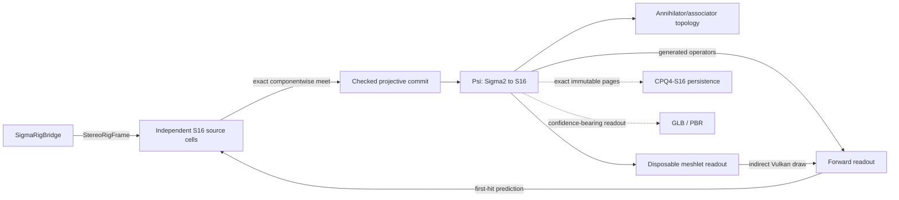

# Σ-PRISM-16 code graph

<!-- Generated by Tools/generate_code_graph.py; do not edit manually. -->

Source digest: `5145590babb5c73b197631a09fbc3e6658bd8e7474a32e026c8dec3381791378`

Scope: 63 files, 650 symbols, 546 functions/methods, 7 GPU kernels, 3 event links.

## Runtime data flow

## DAG to code

| Run | Status | Mapped files |
|---|---|---:|
| S4-00 | done | 37 |
| S4-01 | done | 7 |
| S4-02 | in_progress | 0 |
| S4-03 | pending | 1 |
| S4-04 | pending | 0 |
| S4-05 | pending | 1 |
| S4-06 | pending | 0 |
| S4-07 | pending | 0 |
| S4-08 | pending | 0 |
| S4-09 | pending | 0 |
| S4-10 | pending | 0 |
| S4-11 | pending | 0 |
| S4-12 | pending | 0 |
| S4-13 | pending | 0 |

## Event links

- `AROcclusionManager.frameReceived` → `OnDepthFrame` ([Runtime/Core/DepthCapture.cs:220](../../Runtime/Core/DepthCapture.cs#L220))
- `RoomAnchorManager.RoomReady` → `OnRoomReady` ([Runtime/Core/RoomScanner.cs:118](../../Runtime/Core/RoomScanner.cs#L118))
- `DepthCapture.RawStereoFrameReceived` → `OnRawStereoDepthFrame` ([Runtime/SigmaPrism/SigmaRigBridge.cs:91](../../Runtime/SigmaPrism/SigmaRigBridge.cs#L91))

## Files and symbols

### `Editor/MetaVrManifestPostprocessor.cs`

`FindVersion` (method, L75), `MetaVrManifestPostprocessor` (class, L18), `OnPostGenerateGradleAndroidProject` (method, L22), `UpgradeGeneratedManifest` (method, L35)

### `Editor/RoomScanSetupWizard.Automation.cs`

`BuildQuestInfiniteScanSmokeApk` (method, L120), `PrepareQuestInfiniteScanSmokeProject` (method, L24), `PrepareSmokeProjectAsync` (method, L32), `RoomScanSetupWizard` (class, L20)

### `Editor/RoomScanSetupWizard.BuildProfile.cs`

`FindMetaQuestClassicProfile` (method, L151), `IsActiveProfileMetaQuest` (method, L193), `MetaQuestGuid` (method, L139), `ResolveBuildProfileApi` (method, L60), `RoomScanSetupWizard` (class, L41), `TryActivateMetaQuestProfile` (method, L216)

### `Editor/RoomScanSetupWizard.BuildingBlocks.cs`

`BlockSpec` (struct, L33), `EnsureRequiredBuildingBlocksAsync` (method, L201), `GetBlockDataReflective` (method, L183), `InstallBlockReflective` (method, L188), `ReadOvrManagerStartupPermFlag` (method, L109), `ResolveBuildingBlocksApi` (method, L136), `RoomScanSetupWizard` (class, L26), `WriteOvrManagerStartupPermFlag` (method, L115)

### `Editor/RoomScanSetupWizard.URP.cs`

`AllQualityLevelsUseUrp` (method, L50), `ApplyQuestFriendlyDefaults` (method, L177), `AssignToAllQualityLevels` (method, L216), `CreateURPPipelineAsset` (method, L112), `EnsureURPSetup` (method, L75), `RoomScanSetupWizard` (class, L35)

### `Editor/RoomScanSetupWizard.cs`

`AddGameReadyComponentsToRoot` (method, L94), `EnsureDebugMenuAssets` (method, L137), `EnsureQuestVRManifest` (method, L132), `EnsureVRInput` (method, L159), `FindOrCreatePanelSettings` (method, L206), `FixAROcclusion` (method, L78), `FixARSession` (method, L69), `FixDebugModules` (method, L110), `FixShaderWiring` (method, L126), `MarkDirty` (method, L220), `OnEnable` (method, L29), `OnGUI` (method, L31), `Open` (method, L25), `Refresh` (method, L59), `RoomScanSetupWizard` (class, L17), `SetBool` (method, L192), `SetPanelRenderModeWorldSpace` (method, L198), `WireComponent` (method, L181)

### `Editor/VRProjectBootstrap.cs`

`AnyFeatureEnabled` (method, L643), `Audit` (method, L84), `BuildChecks` (method, L201), `CheckResult` (enum, L36), `CheckSeverity` (enum, L35), `DescribeFeature` (method, L630), `DescribeLoaders` (method, L544), `DescribeTouchProfiles` (method, L667), `EnsureOpenXRLoader` (method, L590), `FixAllAsync` (method, L135), `GetOrCreateXRPerBuildTarget` (method, L564), `GetXRManager` (method, L553), `IsFeatureEnabled` (method, L637), `MakeArm64Check` (method, L419), `MakeMinSdkCheck` (method, L431), `MakeOpenXRFeatureCheck` (method, L616), `MakeOvrConfigEnumCheck` (method, L681), `MakeScriptingBackendCheck` (method, L405), `MakeStereoRenderingCheck` (method, L485), `MakeTargetSdkCheck` (method, L443), `MakeTextureCompressionAstcCheck` (method, L502), `MakeVulkanOnlyCheck` (method, L461), `MakeXRLoaderCheck` (method, L530), `RequireQuestScanningFeatures` (method, L100), `SetFeatureEnabled` (method, L650), `VRCheck` (class, L37), `VRProjectBootstrap` (class, L49)

### `Runtime/Camera/PassthroughCameraProvider.cs`

`ApplyConfiguration` (method, L206), `ConfigurationMatches` (method, L213), `CreateOwnedPca` (method, L191), `FindForEye` (method, L220), `OnDestroy` (method, L186), `PassthroughCameraProvider` (class, L24), `RequestCameraPermissionAsync` (method, L81), `StartCapture` (method, L108), `StopCapture` (method, L176)

### `Runtime/Core/ComputeKernelHelper.cs`

`ComputeKernelHelper` (struct, L9), `DispatchFit` (method, L36), `DispatchFit` (method, L44), `DispatchFit` (method, L54), `Set` (method, L21), `Set` (method, L26), `Set` (method, L31)

### `Runtime/Core/DepthCapture.cs`

`Awake` (method, L44), `CheckPermissionAndEnable` (method, L166), `DepthCapture` (class, L20), `EnsureArSession` (method, L157), `OnApplicationPause` (method, L90), `OnDepthFrame` (method, L126), `OnDestroy` (method, L105), `OnDisable` (method, L100), `ReleaseResources` (method, L83), `Start` (method, L49), `StartDepthCapture` (method, L69), `StopDepthCapture` (method, L77), `StopProvider` (method, L225), `SubscribeAndRun` (method, L211), `Update` (method, L113), `VerifyProviderAsync` (method, L185)

### `Runtime/Core/GpuResourceRetirementQueue.cs`

`DestroyOwned` (method, L140), `DrainAndWait` (method, L114), `DrainCompleted` (method, L91), `Entry` (struct, L15), `GpuResourceRetirementQueue` (class, L13), `Release` (method, L132), `RetireAfterCurrentGpuWork` (method, L39), `RetireAfterCurrentGpuWork` (method, L66)

### `Runtime/Core/IRoomScanModule.cs`

`IRoomScanModule` (interface, L8)

### `Runtime/Core/RoomAnchorManager.cs`

`Awake` (method, L38), `ComputeRelocationMatrix` (method, L138), `ComputeRelocationMatrix` (method, L151), `DetachChildrenForReparent` (method, L374), `EraseSpatialAnchorAsync` (method, L343), `GetRoomLocalToWorld` (method, L130), `LoadSpatialAnchorAsync` (method, L282), `OnDestroy` (method, L69), `OnModuleInitialize` (method, L22), `OnSceneLoaded` (method, L77), `RoomAnchorManager` (class, L16), `StabilizeAnchorTransform` (method, L387), `Start` (method, L43)

### `Runtime/Core/RoomScanner.cs`

`Awake` (method, L77), `ClearAllDataAsync` (method, L259), `ClearScan` (method, L252), `CreateScanAnchorAsync` (method, L288), `CycleRenderMode` (method, L276), `IsModeAvailable` (method, L283), `ObserveStart` (method, L238), `OnDestroy` (method, L139), `OnDisable` (method, L132), `OnRoomReady` (method, L122), `ReleaseScanResources` (method, L244), `RoomScanner` (class, L33), `ScanLifecycleState` (enum, L16), `ScanRenderMode` (enum, L10), `SetRenderMode` (method, L267), `Start` (method, L89), `StartScanningAsync` (method, L147), `StartScanningCoreAsync` (method, L161), `StopScanning` (method, L206), `ToggleDebugMenu` (method, L286), `ToggleScanning` (method, L228)

### `Runtime/Core/RoomSpaceRoot.cs`

`Adopt` (method, L186), `AdoptAtRoomOrigin` (method, L200), `AttachToRoot` (method, L226), `Awake` (method, L97), `OnDestroy` (method, L111), `Reframe` (method, L141), `RoomSpaceRoot` (class, L58), `SetAnchorOverride` (method, L278), `Update` (method, L116), `WaitForBindAsync` (method, L252)

### `Runtime/Core/XRRuntimeGuard.cs`

`XRRuntimeGuard` (class, L19)

### `Runtime/Resources/SigmaPrism/ConeLut.compute`

`BuildConeLut` (gpu_function, L18), `LocalRay` (gpu_function, L10), `BuildConeLut` (gpu_kernel, L1)

### `Runtime/Resources/SigmaPrism/ConeMath.hlsl`

`ConeProjectionDepthToViewZ` (gpu_function, L3), `ConeSurfaceFootprint` (gpu_function, L15)

### `Runtime/Resources/SigmaPrism/DepthNormalize.compute`

`NormalizeStereoDepth` (gpu_function, L18), `NormalizeStereoDepth` (gpu_kernel, L1)

### `Runtime/Resources/SigmaPrism/Generated/SigmaGeneratedTables.hlsl`

`SigmaConjugateSign` (gpu_function, L200), `SigmaHadamardSign` (gpu_function, L201), `SigmaMulBasisIndex` (gpu_function, L194), `SigmaMulBasisSign` (gpu_function, L196)

### `Runtime/Resources/SigmaPrism/RigImageCopy.compute`

`CopyProjectionDepthArray` (gpu_function, L13), `CopyProjectionDepthArray` (gpu_kernel, L1)

### `Runtime/Resources/SigmaPrism/Sedenion16.hlsl`

`SigmaApplyMagnitudeSign` (gpu_function, L133), `SigmaHadamardRow` (gpu_function, L478), `SigmaI64Less` (gpu_function, L19), `SigmaI64ShiftRightRaw` (gpu_function, L93), `SigmaLeftBasisAction` (gpu_function, L436), `SigmaMagnitudeFitsSigned` (gpu_function, L126), `SigmaQ48AddChecked` (gpu_function, L166), `SigmaQ48DivLower` (gpu_function, L426), `SigmaQ48DivNearestEven` (gpu_function, L421), `SigmaQ48DivRounded` (gpu_function, L356), `SigmaQ48DivUpper` (gpu_function, L431), `SigmaQ48Less` (gpu_function, L151), `SigmaQ48Mask` (gpu_function, L140), `SigmaQ48Max` (gpu_function, L161), `SigmaQ48Min` (gpu_function, L156), `SigmaQ48MulLower` (gpu_function, L324), `SigmaQ48MulNearestEven` (gpu_function, L319), `SigmaQ48MulRounded` (gpu_function, L289), `SigmaQ48MulUpper` (gpu_function, L329), `SigmaQ48NegateChecked` (gpu_function, L178), `SigmaQ48Select` (gpu_function, L145), `SigmaQ48ShiftLeftChecked` (gpu_function, L197), `SigmaQ48ShiftRightNearestEven` (gpu_function, L210), `SigmaQ48SubChecked` (gpu_function, L185), `SigmaRightBasisAction` (gpu_function, L449), `SigmaRightSignedDyadAction` (gpu_function, L462), `SigmaU128` (struct, L235), `SigmaU128Bit` (gpu_function, L334), `SigmaU128SetBit` (gpu_function, L344), `SigmaU64AbsSigned` (gpu_function, L64), `SigmaU64Add` (gpu_function, L26), `SigmaU64AnyLowBits` (gpu_function, L106), `SigmaU64Bit` (gpu_function, L120), `SigmaU64Equal` (gpu_function, L9), `SigmaU64Increment` (gpu_function, L37), `SigmaU64Less` (gpu_function, L14), `SigmaU64MultiplyWide` (gpu_function, L240), `SigmaU64NegateRaw` (gpu_function, L57), `SigmaU64ShiftLeftRaw` (gpu_function, L81), `SigmaU64ShiftRight` (gpu_function, L69), `SigmaU64Subtract` (gpu_function, L46)

### `Runtime/Resources/SigmaPrism/SigmaOperatorFixture.compute`

`AlgebraParity` (gpu_function, L75), `BasisTableParity` (gpu_function, L102), `CanonicalSelfTest` (gpu_function, L112), `NumericParity` (gpu_function, L26), `SigmaWriteNumeric` (gpu_function, L20), `AlgebraParity` (gpu_kernel, L2), `BasisTableParity` (gpu_kernel, L3), `CanonicalSelfTest` (gpu_kernel, L4), `NumericParity` (gpu_kernel, L1)

### `Runtime/Resources/SigmaPrism/SigmaOperatorPlan.hlsl`

`SigmaCanonicalMutationEnabled` (gpu_function, L7), `SigmaConjugatePlan` (gpu_function, L16), `SigmaGeometryGPlan` (gpu_function, L33), `SigmaHadamardBPlan` (gpu_function, L25), `SigmaHiddenFPlan` (gpu_function, L42), `SigmaProjectiveClamp` (gpu_function, L61), `SigmaProjectiveMeetLower` (gpu_function, L51), `SigmaProjectiveMeetUpper` (gpu_function, L56)

### `Runtime/RoomScanInputHandler.cs`

`AddBinding` (method, L64), `ClearAllBindings` (method, L88), `ExecuteAction` (method, L110), `RemoveBindingsForAction` (method, L72), `RemoveBindingsForButton` (method, L80), `RoomScanInputHandler` (class, L42), `ScanAction` (enum, L10), `ScanInputBinding` (class, L25), `Update` (method, L92)

### `Runtime/SigmaPrism/Calibration/ConeLutResources.cs`

`Acquire` (method, L118), `Build` (method, L157), `CeilDiv` (method, L244), `ConeLutLease` (class, L30), `ConeProjectionLut` (class, L11), `Create` (method, L108), `CreateTexture` (method, L198), `Destroy` (method, L187), `DestroyProjection` (method, L224), `DestroyTexture` (method, L233), `Dispose` (method, L52), `Get` (method, L148), `Get` (method, L43), `Release` (method, L139), `Retain` (method, L132), `Retain` (method, L45), `Retire` (method, L124), `RigConeLutSet` (class, L65)

### `Runtime/SigmaPrism/Calibration/ConeProjectionMath.cs`

`ConeProjectionMath` (class, L31), `MetricConeFootprint` (struct, L10), `RayAtImagePoint` (method, L108), `TryReproject` (method, L93), `TrySurfaceFootprint` (method, L38), `TryWorldToPixel` (method, L69)

### `Runtime/SigmaPrism/Calibration/RigCalibration.cs`

`Get` (method, L73), `IsCompatible` (method, L82), `Projection` (method, L117), `RigCalibration` (class, L45), `RigLensModel` (enum, L13), `RigProjection` (enum, L6), `RigProjectionCalibration` (struct, L19), `TryCreate` (method, L94)

### `Runtime/SigmaPrism/Capture/GpuTextureRing.cs`

`CopyOnGpu` (method, L315), `DestroySlot` (method, L360), `Dispose` (method, L204), `Dispose` (method, L50), `EnsureCompatibleTarget` (method, L242), `FencePassed` (method, L228), `GetTexture` (method, L180), `GetVolumeDepth` (method, L287), `GpuTextureCopyMode` (enum, L8), `GpuTextureLease` (class, L18), `GpuTextureRing` (class, L65), `IsSupportedDimension` (method, L296), `NextGeneration` (method, L358), `Release` (method, L192), `Retain` (method, L186), `Retain` (method, L42), `Slot` (class, L67), `TargetDimension` (method, L305), `TargetFormat` (method, L310), `TryCopy` (method, L112), `ValidateLease` (method, L218)

### `Runtime/SigmaPrism/Capture/RawStereoDepthFrame.cs`

`IsFinite` (method, L40), `IsFinite` (method, L48), `RawStereoDepthFrame` (struct, L10)

### `Runtime/SigmaPrism/Capture/RigCalibrationMath.cs`

`Add` (method, L187), `Add` (method, L190), `Add` (method, L193), `CombineSignatures` (method, L76), `ConeRayAtPixel` (method, L89), `ConeRayReference` (struct, L10), `FromDepthFov` (method, L55), `FromPassthrough` (method, L31), `IntrinsicsToFov` (method, L158), `ProjectionDepth01FromViewZ` (method, L119), `RangeFromProjectionDepth01` (method, L141), `RayAtImagePoint` (method, L150), `RigCalibrationMath` (class, L8), `Signature` (method, L168), `ViewZFromProjectionDepth01` (method, L130)

### `Runtime/SigmaPrism/Capture/RigCaptureContracts.cs`

`AbsoluteDeltaNanoseconds` (method, L91), `DestinationFromSource` (method, L388), `Dispose` (method, L371), `Equals` (method, L105), `Equals` (method, L150), `Equals` (method, L156), `Equals` (method, L99), `EquivalentRange` (method, L232), `FiniteRasterFar` (method, L246), `FromUnixDateTime` (method, L84), `FromViews` (method, L269), `GetHashCode` (method, L107), `GetHashCode` (method, L158), `GpuImageView` (struct, L165), `IsFinite` (method, L211), `IsFinite` (method, L214), `IsValid` (method, L225), `IsValidRange` (method, L227), `Retain` (method, L360), `RigClockDomain` (enum, L29), `RigDepthContract` (class, L223), `RigDepthEncoding` (enum, L20), `RigExtrinsicsSnapshot` (struct, L250), `RigEye` (enum, L7), `RigFrameRejectionReason` (enum, L39), `RigIntrinsics` (struct, L117), `RigPairingHealth` (struct, L284), `RigPoseMath` (class, L385), `RigStreamKind` (enum, L12), `RigTimestamp` (struct, L64), `StereoRigFrameLease` (class, L304), `ToString` (method, L111), `ViewMatches` (method, L238)

### `Runtime/SigmaPrism/Capture/RigClockMapper.cs`

`CreateRuntime` (method, L23), `RigClockMapper` (class, L10), `SecondsToNanoseconds` (method, L92), `TryCaptureAnchor` (method, L37), `TryMapXrTimestamp` (method, L68)

### `Runtime/SigmaPrism/Capture/RigFrameSynchronizer.cs`

`AbsoluteDelta` (method, L421), `AcceptReorderedTimestamp` (method, L308), `AddDepth` (method, L159), `AddRgb` (method, L135), `Compare` (method, L371), `Compare` (method, L382), `ContainsTimestamp` (method, L340), `ContainsTimestamp` (method, L344), `DepthTimestampComparer` (class, L377), `Dispose` (method, L235), `Dispose` (method, L26), `Dispose` (method, L68), `DropPastPublishedSamples` (method, L324), `FindEarliestCoherentTriplet` (method, L252), `Flush` (method, L228), `InsertSorted` (method, L348), `InsertSorted` (method, L358), `Midpoint` (method, L419), `MillisecondsToNanoseconds` (method, L416), `Reject` (method, L409), `RgbRigSample` (class, L7), `RgbTimestampComparer` (class, L367), `RigCaptureDiagnosticSnapshot` (struct, L75), `RigFrameSynchronizer` (class, L100), `StereoDepthRigSample` (class, L33), `TakeLease` (method, L19), `TakeLease` (method, L61), `TryDequeue` (method, L184), `ValidateIncoming` (method, L237)

### `Runtime/SigmaPrism/Generated/SigmaGeneratedAlgebra.cs`

`SigmaGeneratedAlgebra` (class, L6)

### `Runtime/SigmaPrism/SigmaBackendCapabilities.cs`

`Lower` (method, L104), `LowerNode` (method, L132), `LowerReduction` (method, L178), `RequireCanonical` (method, L51), `RequiredPrimitive` (method, L67), `SigmaBackendCapabilityProfile` (class, L29), `SigmaExactPrimitive` (enum, L8), `SigmaHlslLowerer` (class, L102), `Supports` (method, L48)

### `Runtime/SigmaPrism/SigmaExactBackendGate.cs`

`Bind` (method, L46), `Dispatch` (method, L31), `Dispose` (method, L54), `SigmaExactBackendGate` (class, L11)

### `Runtime/SigmaPrism/SigmaNumericDomain.cs`

`Clamp` (method, L283), `Contains` (method, L278), `DivideCeiling` (method, L223), `DivideFloor` (method, L212), `DivideNearestEven` (method, L199), `Equals` (method, L290), `Equals` (method, L293), `FromInteger` (method, L185), `FromRatio` (method, L188), `GetHashCode` (method, L295), `Intersect` (method, L280), `NormalizeDenominator` (method, L234), `QAbs` (method, L39), `QAdd` (method, L28), `QClamp` (method, L46), `QCompare` (method, L31), `QDiv` (method, L57), `QDivLower` (method, L75), `QDivUpper` (method, L84), `QIntegerSquareRoot` (method, L123), `QMul` (method, L54), `QMulLower` (method, L67), `QMulUpper` (method, L71), `QNegate` (method, L32), `QShiftLeft` (method, L91), `QShiftRight` (method, L99), `QShiftRightLower` (method, L107), `QShiftRightUpper` (method, L114), `QSub` (method, L30), `Quantize` (method, L150), `Quantize` (method, L183), `SigmaNumericDomain` (class, L10), `SigmaQ48Interval` (struct, L262), `ToDouble` (method, L198), `ToRawChecked` (method, L246), `ToString` (method, L300), `ValidateShift` (method, L253)

### `Runtime/SigmaPrism/SigmaOperatorPlan.cs`

`Add` (method, L162), `Build` (method, L220), `BuildAssociator` (method, L491), `BuildBasis` (method, L400), `BuildCodecPredicates` (method, L585), `BuildConjugation` (method, L390), `BuildHadamard` (method, L444), `BuildHadamardRow` (method, L466), `BuildProjectiveCommit` (method, L559), `BuildProjectiveMeet` (method, L544), `BuildReadout` (method, L454), `BuildSignedDyad` (method, L421), `BuildTransition` (method, L479), `BuildView` (method, L506), `CompareEqual` (method, L178), `CompareLess` (method, L174), `CompareLessEqual` (method, L176), `ComputeFingerprint` (method, L96), `ComputePlanBundleFingerprint` (method, L630), `Constant` (method, L151), `Contains` (method, L86), `Copy` (method, L251), `DenseProduct` (method, L606), `Evaluate` (method, L263), `EvaluateNode` (method, L290), `EvaluateS16` (method, L281), `FixedReduction` (method, L196), `Gather` (method, L141), `GatherState` (method, L598), `Intern` (method, L237), `InternCommutative` (method, L230), `IntervalDivLower` (method, L192), `IntervalDivUpper` (method, L194), `IntervalMulLower` (method, L188), `IntervalMulUpper` (method, L190), `LeftBasis` (method, L383), `LeftSignedDyad` (method, L388), `Mask` (method, L180), `Max` (method, L172), `Min` (method, L170), `Negate` (method, L160), `QDiv` (method, L168), `QMul` (method, L166), `RightBasis` (method, L385), `RightSignedDyad` (method, L386), `Select` (method, L182), `ShiftLeft` (method, L184), `ShiftRight` (method, L186), `SigmaOperatorEvaluator` (class, L260), `SigmaOperatorNode` (struct, L37), `SigmaOperatorOpcode` (enum, L9), `SigmaOperatorPlan` (class, L63), `SigmaOperatorPlanBuilder` (class, L125), `SigmaOperatorPlans` (class, L355), `Sign` (method, L154), `Sub` (method, L164)

### `Runtime/SigmaPrism/SigmaOperatorSet.cs`

`RequireCanonicalBackend` (method, L33), `SigmaOperatorSet` (class, L10)

### `Runtime/SigmaPrism/SigmaRigBridge.cs`

`CaptureRgb` (method, L170), `EnsureRuntimeObjects` (method, L155), `FreezeSessionIntrinsics` (method, L294), `LateUpdate` (method, L118), `OnDestroy` (method, L142), `OnRawStereoDepthFrame` (method, L223), `PublishAvailableFrames` (method, L284), `ReportLocalRejection` (method, L376), `ResolveEye` (method, L320), `SigmaRigBridge` (class, L13), `StartCapture` (method, L72), `StopCapture` (method, L97), `TryAcquireLatest` (method, L61)

### `Runtime/SigmaPrism/SigmaS16.cs`

`Add` (method, L380), `Associator` (method, L336), `Basis` (method, L95), `BasisAction` (method, L385), `BasisProductIndex` (method, L227), `BasisProductSign` (method, L234), `Combine` (method, L416), `CombineDyad` (method, L401), `CompareTo` (method, L178), `Conjugate` (method, L241), `DenseReferenceMultiply` (method, L255), `Equals` (method, L118), `Equals` (method, L128), `Equals` (method, L188), `Equals` (method, L192), `FromArray` (method, L82), `GeometryReadout` (method, L315), `GetAnnihilatorAction` (method, L355), `GetHashCode` (method, L130), `GetHashCode` (method, L194), `GetZeroDivisorEntry` (method, L367), `HadamardB` (method, L290), `HadamardBT` (method, L298), `HadamardRow` (method, L300), `HiddenReadout` (method, L324), `L1RawChecked` (method, L345), `LeftBasisAction` (method, L272), `LeftSignedDyadAction` (method, L280), `RightBasisAction` (method, L276), `RightSignedDyadAction` (method, L285), `SigmaS16` (struct, L10), `SigmaS16Operators` (class, L218), `SigmaSignedDyad` (struct, L146), `SigmaZeroDivisorEntry` (struct, L201), `Subtract` (method, L383), `ToArray` (method, L104), `ToS16` (method, L170), `ToString` (method, L141), `Transition` (method, L333), `ValidateBasis` (method, L426)

### `Runtime/SigmaPrism/SigmaTransitionCache.cs`

`Clear` (method, L104), `Equals` (method, L21), `Equals` (method, L26), `GetHashCode` (method, L28), `GetOrCompute` (method, L68), `SigmaTransitionCache` (class, L51), `SigmaTransitionKey` (struct, L6), `SigmaTransitionSignature` (struct, L31)

### `Runtime/UI/ControllerRayDriver.cs`

`Awake` (method, L43), `ChooseBestController` (method, L77), `ControllerRayDriver` (class, L13), `DrawLaser` (method, L162), `LateUpdate` (method, L64), `OnDestroy` (method, L69), `SetupCursor` (method, L143), `SetupLineRenderer` (method, L130), `Update` (method, L58), `UpdateRayOrigin` (method, L99)

### `Runtime/UI/DebugMenuController.cs`

`Awake` (method, L29), `Bind` (method, L96), `DebugMenuController` (class, L8), `Hide` (method, L76), `OnEnable` (method, L35), `Query` (method, L83), `RefreshStatus` (method, L106), `Set` (method, L148), `Show` (method, L68), `Toggle` (method, L62), `Update` (method, L48)

### `Runtime/UI/DebugMenuFollower.cs`

`ComputeTargetPosition` (method, L92), `DebugMenuFollower` (class, L11), `LateUpdate` (method, L38), `OnEnable` (method, L33), `SnapToView` (method, L75), `StopTracking` (method, L87)

### `Runtime/UI/VRDocumentRaycaster.cs`

`GetWorldRay` (method, L26), `VRDocumentRaycaster` (class, L19)

### `Runtime/Utils/Logger.cs`

`Error` (method, L42), `Info` (method, L30), `LogLevel` (enum, L7), `Logger` (class, L21), `Verbose` (method, L24), `Warning` (method, L36)

### `Tests/Editor/SigmaAlgebraOperatorTests.cs`

`BuildCseFixture` (method, L325), `CompareEntries` (method, L374), `CompleteGeneratedZeroDivisorCatalogIsExactAndNonZero` (method, L134), `CseMaskSelectAndCapabilityRefusalPreserveExactSemantics` (method, L261), `DeterministicState` (method, L338), `ExplicitAssociatorBracketingsAndFusedPlanAgree` (method, L183), `GeneratedBasisTableMatchesRecursiveCayleyDicksonExhaustively` (method, L86), `GeneratedFingerprintsAreStableAndBoundToCanonicalBundle` (method, L302), `GeneratedSparseBasisAndConjugationMatchDenseReference` (method, L110), `GeneratedTransitionHadamardAndReadoutPlansMatchReferences` (method, L198), `NumericDomainRegistryAndCheckedNearestEvenSemanticsAreExact` (method, L11), `OutwardIntervalArithmeticNeverExcludesExactValue` (method, L57), `SigmaAlgebraOperatorTests` (class, L8), `SignedDyadPlanUsesOnlyPermutationSignAndAddition` (method, L162), `TransitionCacheHitMissAndGenerationInvalidationAreExact` (method, L281)

### `Tests/Editor/SigmaGpuLoweringTests.cs`

`AssertPacked` (method, L212), `CanonicalPacked32BackendGatePassesOnlyAfterGpuSelfTest` (method, L31), `LoadFixture` (method, L157), `MakeState` (method, L194), `Pack` (method, L203), `Packed32NumericLoweringMatchesCpuSemanticDomainBitForBit` (method, L40), `Packed32SparseAlgebraAndGeneratedBasisTableMatchCpuExactly` (method, L105), `SigmaGpuLoweringTests` (class, L9), `UInt2` (struct, L15), `UInt4` (struct, L22), `Unpack` (method, L209)

### `Tests/Editor/SigmaRigContractTests.cs`

`CalibrationSignatureChangesWithConeGeometry` (method, L70), `ConeReferenceCarriesRayDifferentialsAndSolidAngle` (method, L82), `DepthFovProducesDeliveredPixelIntrinsics` (method, L52), `FiniteConeFootprintExpandsWithRangeAndGrazingIncidence` (method, L101), `SigmaRigContractTests` (class, L10), `UnixTimestampPreservesSourceTimeExactly` (method, L13), `XrClockAnchorFailsClosedWhenSamplingBracketIsTooWide` (method, L41), `XrClockAnchorUsesBracketMidpointAndCarriesUncertainty` (method, L26)

### `Tools/generate_code_graph.py`

`build_graph` (function, L197), `is_hlsl_definition` (function, L110), `line_of` (function, L94), `main` (function, L363), `matching_brace` (function, L98), `parse_symbols` (function, L132), `render_markdown` (function, L296), `source_files` (function, L84), `task_files` (function, L191)

### `Tools/sigma/generate_sigma_operators.py`

`SigmaGeneratedAlgebra` (class, L247), `basis_product` (function, L26), `build_descriptor` (function, L76), `check_or_write` (function, L360), `chunks` (function, L219), `conjugate_sign` (function, L43), `cs_array` (function, L224), `dyads` (function, L51), `fingerprint_words` (function, L291), `hadamard_sign` (function, L47), `main` (function, L373), `multiply_dyads` (function, L59), `render_cs` (function, L233), `render_hlsl` (function, L295), `sha256` (function, L71), `validate_descriptor` (function, L193)

### `Tools/unity/validate_sigma_compute_uav.py`

`function_bodies` (function, L46), `main` (function, L100), `matching` (function, L34), `reachable_uavs` (function, L65), `strip_comments` (function, L29), `validate` (function, L82)

### `Tools/validate_goal_state.py`

`fail` (function, L23), `main` (function, L28), `visit` (function, L86)

## Machine-readable graph

Full nodes, approximate intra-repository call edges, event links, and task/file ownership are in [`.codex/CODE_GRAPH.json`](../../.codex/CODE_GRAPH.json).
