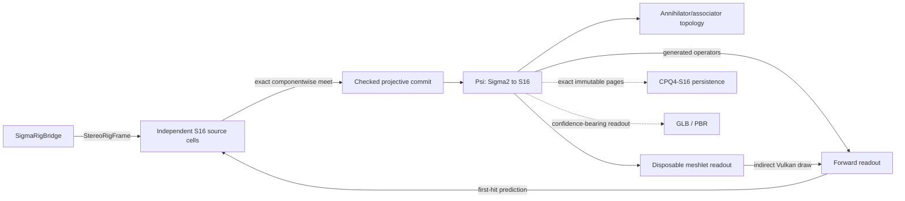

# Σ-PRISM-16 code graph

<!-- Generated by Tools/generate_code_graph.py; do not edit manually. -->

Source digest: `a6761512d3fc14076c4a5d909b88019cbd49a033deeb12c50c41fed47f1b1c11`

Scope: 103 files, 1972 symbols, 1650 functions/methods, 37 GPU kernels, 5 event links.

## Runtime data flow

## DAG to code

| Run | Status | Mapped files |
|---|---|---:|
| S4-00 | done | 36 |
| S4-01 | done | 7 |
| S4-02 | done | 6 |
| S4-03 | done | 4 |
| S4-04 | done | 0 |
| S4-05 | done | 0 |
| S4-06 | done | 0 |
| S4-07 | done | 0 |
| S4-08 | in_progress | 3 |
| S4-09 | pending | 0 |
| S4-10 | pending | 0 |
| S4-11 | pending | 0 |
| S4-12 | pending | 0 |
| S4-13 | pending | 2 |

## Event links

- `AROcclusionManager.frameReceived` → `OnDepthFrame` ([Runtime/Core/DepthCapture.cs:220](../../Runtime/Core/DepthCapture.cs#L220))
- `RenderPipelineManager.endFrameRendering` → `EndFrameRendering` ([Runtime/SigmaPrism/SigmaGpuCompletion.cs:171](../../Runtime/SigmaPrism/SigmaGpuCompletion.cs#L171))
- `Aggregate.TotalNanoseconds` → `nanoseconds` ([Runtime/SigmaPrism/SigmaGpuKernelTelemetry.cs:315](../../Runtime/SigmaPrism/SigmaGpuKernelTelemetry.cs#L315))
- `SigmaRenderer.PredictionReady` → `OnPredictionReady` ([Runtime/SigmaPrism/SigmaInverseController.cs:140](../../Runtime/SigmaPrism/SigmaInverseController.cs#L140))
- `DepthCapture.RawStereoFrameReceived` → `OnRawStereoDepthFrame` ([Runtime/SigmaPrism/SigmaRigBridge.cs:91](../../Runtime/SigmaPrism/SigmaRigBridge.cs#L91))

## Files and symbols

### `Editor/MetaVrManifestPostprocessor.cs`

`FindVersion` (method, L75), `MetaVrManifestPostprocessor` (class, L18), `OnPostGenerateGradleAndroidProject` (method, L22), `UpgradeGeneratedManifest` (method, L35)

### `Editor/RoomScanSetupWizard.Automation.cs`

`BuildQuestInfiniteScanSmokeApk` (method, L145), `PrepareQuestInfiniteScanSmokeProject` (method, L27), `PrepareSmokeProjectAsync` (method, L35), `RoomScanSetupWizard` (class, L23)

### `Editor/RoomScanSetupWizard.BuildProfile.cs`

`FindMetaQuestClassicProfile` (method, L151), `IsActiveProfileMetaQuest` (method, L193), `MetaQuestGuid` (method, L139), `ResolveBuildProfileApi` (method, L60), `RoomScanSetupWizard` (class, L41), `TryActivateMetaQuestProfile` (method, L216)

### `Editor/RoomScanSetupWizard.BuildingBlocks.cs`

`BlockSpec` (struct, L33), `EnsureRequiredBuildingBlocksAsync` (method, L201), `GetBlockDataReflective` (method, L183), `InstallBlockReflective` (method, L188), `ReadOvrManagerStartupPermFlag` (method, L109), `ResolveBuildingBlocksApi` (method, L136), `RoomScanSetupWizard` (class, L26), `WriteOvrManagerStartupPermFlag` (method, L115)

### `Editor/RoomScanSetupWizard.URP.cs`

`AllQualityLevelsUseUrp` (method, L50), `ApplyQuestFriendlyDefaults` (method, L177), `AssignToAllQualityLevels` (method, L216), `CreateURPPipelineAsset` (method, L112), `EnsureURPSetup` (method, L75), `RoomScanSetupWizard` (class, L35)

### `Editor/RoomScanSetupWizard.cs`

`AddGameReadyComponentsToRoot` (method, L97), `EnsureDebugMenuAssets` (method, L145), `EnsureQuestVRManifest` (method, L140), `EnsureVRInput` (method, L167), `FindOrCreatePanelSettings` (method, L247), `FixAROcclusion` (method, L81), `FixARSession` (method, L72), `FixDebugModules` (method, L116), `FixShaderWiring` (method, L133), `MarkDirty` (method, L261), `OnEnable` (method, L32), `OnGUI` (method, L34), `Open` (method, L28), `Refresh` (method, L62), `RoomScanSetupWizard` (class, L17), `SetBool` (method, L233), `SetPanelRenderModeWorldSpace` (method, L239), `WireComponent` (method, L203)

### `Editor/VRProjectBootstrap.cs`

`AnyFeatureEnabled` (method, L643), `Audit` (method, L84), `BuildChecks` (method, L201), `CheckResult` (enum, L36), `CheckSeverity` (enum, L35), `DescribeFeature` (method, L630), `DescribeLoaders` (method, L544), `DescribeTouchProfiles` (method, L667), `EnsureOpenXRLoader` (method, L590), `FixAllAsync` (method, L135), `GetOrCreateXRPerBuildTarget` (method, L564), `GetXRManager` (method, L553), `IsFeatureEnabled` (method, L637), `MakeArm64Check` (method, L419), `MakeMinSdkCheck` (method, L431), `MakeOpenXRFeatureCheck` (method, L616), `MakeOvrConfigEnumCheck` (method, L681), `MakeScriptingBackendCheck` (method, L405), `MakeStereoRenderingCheck` (method, L485), `MakeTargetSdkCheck` (method, L443), `MakeTextureCompressionAstcCheck` (method, L502), `MakeVulkanOnlyCheck` (method, L461), `MakeXRLoaderCheck` (method, L530), `RequireQuestScanningFeatures` (method, L100), `SetFeatureEnabled` (method, L650), `VRCheck` (class, L37), `VRProjectBootstrap` (class, L49)

### `Runtime/Camera/PassthroughCameraProvider.cs`

`ApplyConfiguration` (method, L206), `ConfigurationMatches` (method, L213), `CreateOwnedPca` (method, L191), `FindForEye` (method, L220), `OnDestroy` (method, L186), `PassthroughCameraProvider` (class, L24), `RequestCameraPermissionAsync` (method, L81), `StartCapture` (method, L108), `StopCapture` (method, L176)

### `Runtime/Core/ComputeKernelHelper.cs`

`ComputeKernelHelper` (struct, L9), `DispatchFit` (method, L36), `DispatchFit` (method, L44), `DispatchFit` (method, L54), `Set` (method, L21), `Set` (method, L26), `Set` (method, L31)

### `Runtime/Core/DepthCapture.cs`

`Awake` (method, L44), `CheckPermissionAndEnable` (method, L166), `DepthCapture` (class, L20), `EnsureArSession` (method, L157), `OnApplicationPause` (method, L90), `OnDepthFrame` (method, L126), `OnDestroy` (method, L105), `OnDisable` (method, L100), `ReleaseResources` (method, L83), `Start` (method, L49), `StartDepthCapture` (method, L69), `StopDepthCapture` (method, L77), `StopProvider` (method, L225), `SubscribeAndRun` (method, L211), `Update` (method, L113), `VerifyProviderAsync` (method, L185)

### `Runtime/Core/IRoomScanModule.cs`

`IRoomScanModule` (interface, L8)

### `Runtime/Core/RoomAnchorManager.cs`

`Awake` (method, L30), `ComputeRelocationMatrix` (method, L49), `DetachChildrenForReparent` (method, L268), `EraseSpatialAnchorAsync` (method, L237), `LoadSpatialAnchorAsync` (method, L176), `OnDestroy` (method, L35), `OnModuleInitialize` (method, L23), `RoomAnchorManager` (class, L17), `StabilizeAnchorTransform` (method, L281)

### `Runtime/Core/RoomScanner.cs`

`Awake` (method, L85), `ClearAllDataAsync` (method, L269), `ClearScan` (method, L262), `CycleRenderMode` (method, L286), `EnsureScanAnchorAsync` (method, L301), `IsModeAvailable` (method, L296), `ObserveStart` (method, L248), `OnDestroy` (method, L139), `OnDisable` (method, L134), `ReleaseScanResources` (method, L254), `RoomScanner` (class, L36), `ScanLifecycleState` (enum, L16), `ScanRenderMode` (enum, L10), `SetRenderMode` (method, L277), `Start` (method, L105), `StartScanningAsync` (method, L147), `StartScanningCoreAsync` (method, L161), `StopScanning` (method, L216), `ToggleDebugMenu` (method, L299), `ToggleScanning` (method, L238)

### `Runtime/Core/RoomSpaceRoot.cs`

`Adopt` (method, L186), `AdoptAtRoomOrigin` (method, L200), `AttachToRoot` (method, L226), `Awake` (method, L97), `OnDestroy` (method, L111), `Reframe` (method, L141), `RoomSpaceRoot` (class, L58), `SetAnchorOverride` (method, L278), `Update` (method, L116), `WaitForBindAsync` (method, L252)

### `Runtime/Core/XRRuntimeGuard.cs`

`XRRuntimeGuard` (class, L19)

### `Runtime/Resources/SigmaPrism/ConeLut.compute`

`BuildConeLut` (gpu_function, L19), `LocalRay` (gpu_function, L11), `BuildConeLut` (gpu_kernel, L1)

### `Runtime/Resources/SigmaPrism/ConeMath.hlsl`

`ConeProjectionDepthToViewZ` (gpu_function, L3), `ConeSurfaceFootprint` (gpu_function, L15)

### `Runtime/Resources/SigmaPrism/DepthNormalize.compute`

`NormalizeStereoDepth` (gpu_function, L18), `NormalizeStereoDepth` (gpu_kernel, L1)

### `Runtime/Resources/SigmaPrism/Generated/SigmaGeneratedMerkabaProgram.hlsl`

`SigmaMerkabaAccumulateNativeStitchClass` (gpu_function, L1071), `SigmaMerkabaAssembleInstrumentTangent` (gpu_function, L468), `SigmaMerkabaAssociatorCoefficient` (gpu_function, L307), `SigmaMerkabaBasisAssociatorActionCoefficient` (gpu_function, L313), `SigmaMerkabaBasisAssociatorSource` (gpu_function, L322), `SigmaMerkabaBasisSign` (gpu_function, L302), `SigmaMerkabaBoundaryEnvelopesContact` (gpu_function, L788), `SigmaMerkabaBuildDirectionalAction` (gpu_function, L737), `SigmaMerkabaBuildInstrumentRowPermutation` (gpu_function, L431), `SigmaMerkabaCanOmitQueryRegion` (gpu_function, L766), `SigmaMerkabaCanonicalAggregateFactorClass` (gpu_function, L907), `SigmaMerkabaCanonicalClosureClass` (gpu_function, L1020), `SigmaMerkabaCanonicalCompareDirectedPrefix` (gpu_function, L973), `SigmaMerkabaCanonicalCompareDirectedSuffix` (gpu_function, L988), `SigmaMerkabaCanonicalCompareHex64` (gpu_function, L877), `SigmaMerkabaCanonicalCompareI32` (gpu_function, L865), `SigmaMerkabaCanonicalCompareReceipt256` (gpu_function, L884), `SigmaMerkabaCanonicalCompareU32` (gpu_function, L842), `SigmaMerkabaCanonicalDirectionalClass` (gpu_function, L1012), `SigmaMerkabaCanonicalEvaluateAssociatorLane` (gpu_function, L948), `SigmaMerkabaCanonicalEvaluateLinkLane` (gpu_function, L923), `SigmaMerkabaCanonicalFactorClassFromNonzero` (gpu_function, L900), `SigmaMerkabaCanonicalRelationClass` (gpu_function, L1030), `SigmaMerkabaClassifyPointNativeStitchPair` (gpu_function, L1045), `SigmaMerkabaClassifyZeroDivisor` (gpu_function, L778), `SigmaMerkabaDecodeDefaultLane` (gpu_function, L772), `SigmaMerkabaEvaluateAssociatorProfileDeltaLane` (gpu_function, L342), `SigmaMerkabaEvaluateFreshBoundaryRelation` (gpu_function, L553), `SigmaMerkabaEvaluateNativeStitchLink` (gpu_function, L811), `SigmaMerkabaEvaluateShadow` (gpu_function, L382), `SigmaMerkabaFinalizeNativeStitchSet` (gpu_function, L1081), `SigmaMerkabaGaugeLess` (gpu_function, L713), `SigmaMerkabaGaugeMortonLess` (gpu_function, L699), `SigmaMerkabaGaugeSignedMorton` (gpu_function, L684), `SigmaMerkabaGaugeSpread16` (gpu_function, L675), `SigmaMerkabaGaugeZigZag` (gpu_function, L656), `SigmaMerkabaInstrumentCompareSwap` (gpu_function, L414), `SigmaMerkabaIsZEmpty` (gpu_function, L632), `SigmaMerkabaLiftShadow` (gpu_function, L398), `SigmaMerkabaNativeBoundarySectorAddress` (gpu_function, L803), `SigmaMerkabaPlaquetteHolonomy` (gpu_function, L369), `SigmaMerkabaResolveFreshBranch` (gpu_function, L593), `SigmaMerkabaScaleBasisAssociatorLane` (gpu_function, L328), `SigmaMerkabaSectorChartCandidateDirection` (gpu_function, L1170), `SigmaMerkabaSelectFreshTangent` (gpu_function, L510), `SigmaMerkabaShadowNumerator` (gpu_function, L377), `SigmaMerkabaSignTransport` (gpu_function, L364), `SigmaMerkabaSplitDyadicGauge` (gpu_function, L641), `SigmaMerkabaTransformChartCellLower` (gpu_function, L1184), `if` (gpu_function, L538)

### `Runtime/Resources/SigmaPrism/Generated/SigmaGeneratedTables.hlsl`

`SigmaConjugateSign` (gpu_function, L196), `SigmaHadamardSign` (gpu_function, L197), `SigmaMulBasisIndex` (gpu_function, L190), `SigmaMulBasisSign` (gpu_function, L192)

### `Runtime/Resources/SigmaPrism/RigImageCopy.compute`

`CopyProjectionDepthArray` (gpu_function, L13), `CopyProjectionDepthArray` (gpu_kernel, L1)

### `Runtime/Resources/SigmaPrism/Sedenion16.hlsl`

`SigmaApplyMagnitudeSign` (gpu_function, L121), `SigmaHadamardRow` (gpu_function, L732), `SigmaI64ShiftRightRaw` (gpu_function, L79), `SigmaLeftBasisAction` (gpu_function, L690), `SigmaMagnitudeFitsSigned` (gpu_function, L114), `SigmaQ48AddChecked` (gpu_function, L139), `SigmaQ48DivLower` (gpu_function, L680), `SigmaQ48DivNearestEven` (gpu_function, L675), `SigmaQ48DivRounded` (gpu_function, L622), `SigmaQ48DivUpper` (gpu_function, L685), `SigmaQ48DivideMagnitude` (gpu_function, L555), `SigmaQ48Mask` (gpu_function, L128), `SigmaQ48MulBounds` (gpu_function, L326), `SigmaQ48MulLower` (gpu_function, L312), `SigmaQ48MulNearestEven` (gpu_function, L307), `SigmaQ48MulRounded` (gpu_function, L277), `SigmaQ48MulUpper` (gpu_function, L317), `SigmaQ48NegateChecked` (gpu_function, L151), `SigmaQ48Select` (gpu_function, L133), `SigmaQ48ShiftLeftChecked` (gpu_function, L170), `SigmaQ48ShiftRightNearestEven` (gpu_function, L184), `SigmaQ48SubChecked` (gpu_function, L158), `SigmaQ48TryDivDyadic` (gpu_function, L362), `SigmaRightBasisAction` (gpu_function, L703), `SigmaRightSignedDyadAction` (gpu_function, L716), `SigmaU128` (struct, L212), `SigmaU32MultiplyWide` (gpu_function, L223), `SigmaU64AbsSigned` (gpu_function, L48), `SigmaU64Add` (gpu_function, L10), `SigmaU64AnyLowBits` (gpu_function, L93), `SigmaU64Bit` (gpu_function, L108), `SigmaU64DivideByU32` (gpu_function, L423), `SigmaU64Increment` (gpu_function, L21), `SigmaU64MultiplyWide` (gpu_function, L238), `SigmaU64NegateRaw` (gpu_function, L41), `SigmaU64ShiftLeftRaw` (gpu_function, L66), `SigmaU64ShiftRight` (gpu_function, L53), `SigmaU64Subtract` (gpu_function, L30), `SigmaU96DivideStep` (gpu_function, L482), `if` (gpu_function, L193)

### `Runtime/Resources/SigmaPrism/SigmaCarrier.compute`

`InitializeGpuPool` (gpu_function, L23), `SigmaCarrierNullLane` (gpu_function, L16), `InitializeGpuPool` (gpu_kernel, L1)

### `Runtime/Resources/SigmaPrism/SigmaCarrierAbi.hlsl`

`SigmaCarrierPageMetaGpu` (struct, L30), `SigmaCarrierRepresentationAddress` (gpu_function, L49), `SigmaCarrierSameLogicalPage` (gpu_function, L56), `SigmaCarrierVisibleAtRoot` (gpu_function, L66)

### `Runtime/Resources/SigmaPrism/SigmaCarrierCodec.compute`

`DecodePageBlocks` (gpu_function, L467), `EncodePageBlocks` (gpu_function, L313), `SigmaCodecAdd96` (gpu_function, L79), `SigmaCodecAddScaled` (gpu_function, L152), `SigmaCodecDecodeValue` (gpu_function, L283), `SigmaCodecExtractBits` (gpu_function, L176), `SigmaCodecFitsI64` (gpu_function, L101), `SigmaCodecInputIndex` (gpu_function, L62), `SigmaCodecLowMask` (gpu_function, L170), `SigmaCodecNullLane` (gpu_function, L48), `SigmaCodecOutputIndex` (gpu_function, L68), `SigmaCodecPageSample` (gpu_function, L53), `SigmaCodecReadSigned` (gpu_function, L242), `SigmaCodecReadWidth` (gpu_function, L235), `SigmaCodecResidual` (gpu_function, L107), `SigmaCodecSharedIndex` (gpu_function, L43), `SigmaCodecSignExtend96` (gpu_function, L74), `SigmaCodecSignedWidth` (gpu_function, L136), `SigmaCodecSubtract96` (gpu_function, L90), `SigmaCodecWriteDeltaLane` (gpu_function, L192), `if` (gpu_function, L119), `if` (gpu_function, L124), `if` (gpu_function, L295), `if` (gpu_function, L300), `if` (gpu_function, L430), `if` (gpu_function, L438), `if` (gpu_function, L451), `if` (gpu_function, L503), `if` (gpu_function, L524), `if` (gpu_function, L531), `DecodePageBlocks` (gpu_kernel, L2), `EncodePageBlocks` (gpu_kernel, L1)

### `Runtime/Resources/SigmaPrism/SigmaDirectCarrierPreview.shader`

`Attributes` (struct, L90), `PreviewContactColour` (gpu_function, L147), `PreviewContactVert` (gpu_function, L105), `SigmaPreviewBillboardCorner` (gpu_function, L80), `SigmaPreviewHash` (gpu_function, L47), `SigmaPreviewPageHash` (gpu_function, L56), `SigmaPreviewPalette` (gpu_function, L65), `SigmaPreviewReadoutIndex` (gpu_function, L41), `Varyings` (struct, L96)

### `Runtime/Resources/SigmaPrism/SigmaExactCompare.hlsl`

`SigmaI64Less` (gpu_function, L18), `SigmaQ48Less` (gpu_function, L25), `SigmaQ48Max` (gpu_function, L35), `SigmaQ48Min` (gpu_function, L30), `SigmaU64Equal` (gpu_function, L7), `SigmaU64Less` (gpu_function, L13)

### `Runtime/Resources/SigmaPrism/SigmaForwardReadout.compute`

`BuildCarrierReadout` (gpu_function, L54), `CompactCurrentPages` (gpu_function, L94), `ResolveCarrierHalos` (gpu_function, L151), `SigmaReadoutI64Equal` (gpu_function, L134), `SigmaReadoutIncrementI64` (gpu_function, L139), `SigmaReadoutIndex` (gpu_function, L35), `SigmaReadoutPageVisible` (gpu_function, L40), `BuildCarrierReadout` (gpu_kernel, L1), `CompactCurrentPages` (gpu_kernel, L2), `ResolveCarrierHalos` (gpu_kernel, L3)

### `Runtime/Resources/SigmaPrism/SigmaFrameAbi.hlsl`

`SigmaNativeFieldRevisionGpu` (struct, L134), `SigmaNativeFrameGpu` (struct, L80), `SigmaNativeGaugeDeltaGpu` (struct, L118), `SigmaNativeObservationGpu` (struct, L88), `SigmaNativeReverseWorkGpu` (struct, L95), `SigmaNativeStateDeltaGpu` (struct, L102), `SigmaUnresolvedConstraintGpu` (struct, L125)

### `Runtime/Resources/SigmaPrism/SigmaGeometryReadout.hlsl`

`SigmaGeometryReadoutExact` (gpu_function, L19), `SigmaGeometryReadoutPlan` (gpu_function, L39), `SigmaQ48ToReadoutFloat` (gpu_function, L5)

### `Runtime/Resources/SigmaPrism/SigmaInverseAbi.hlsl`

`SigmaQ48Bounds` (struct, L23)

### `Runtime/Resources/SigmaPrism/SigmaInverseMath.hlsl`

`SigmaCalibrationValue` (gpu_function, L11), `SigmaDepthHalfWidth` (gpu_function, L64), `SigmaPriorHalfWidth` (gpu_function, L80), `SigmaQ48AbsDifference` (gpu_function, L48), `SigmaQ48FromFloatNearestEven` (gpu_function, L19), `SigmaQ48Widen` (gpu_function, L55), `if` (gpu_function, L30)

### `Runtime/Resources/SigmaPrism/SigmaNativeContract.compute`

`ContractNativeQuery` (gpu_function, L1692), `SigmaN4ChartAssignmentOrbit` (gpu_function, L861), `SigmaN4ChartDirection` (gpu_function, L890), `SigmaN4ChartFrameDeterminant` (gpu_function, L884), `SigmaN4ChartOrbitRepresentative` (gpu_function, L870), `SigmaN4ResolveAdjacentFrame` (gpu_function, L901), `SigmaN4TileBoundaryHeader` (gpu_function, L846), `SigmaN4TileBoundaryIndex` (gpu_function, L824), `SigmaN4TileBuildComponents` (gpu_function, L1210), `SigmaN4TileCertificate` (gpu_function, L977), `SigmaN4TileCertificateReduce` (gpu_function, L990), `SigmaN4TileChartAssigned` (gpu_function, L1274), `SigmaN4TileChartEqual` (gpu_function, L1324), `SigmaN4TileChartFrame` (gpu_function, L1276), `SigmaN4TileChartProposal` (gpu_function, L1277), `SigmaN4TileClose` (gpu_function, L1600), `SigmaN4TileComponentAddress` (gpu_function, L775), `SigmaN4TileD4Equivalent` (gpu_function, L1428), `SigmaN4TileFinalizeComponents` (gpu_function, L1462), `SigmaN4TileFindRoot` (gpu_function, L1200), `SigmaN4TileFootprintAddress` (gpu_function, L763), `SigmaN4TileFootprintValid` (gpu_function, L791), `SigmaN4TileGlobalFootprint` (gpu_function, L782), `SigmaN4TileMeetSupports` (gpu_function, L1032), `SigmaN4TileNeighbour` (gpu_function, L929), `SigmaN4TilePackChart` (gpu_function, L1268), `SigmaN4TileResolvedEdge` (gpu_function, L854), `SigmaN4TileSolveOrbit` (gpu_function, L1329), `SigmaN4TileSortSupports` (gpu_function, L946), `SigmaN4TileStoreCertificate` (gpu_function, L984), `SigmaN4TileStructuralCertificateEqual` (gpu_function, L1002), `SigmaN4TileSupportAddress` (gpu_function, L768), `SigmaN4TileSupportKey` (gpu_function, L809), `SigmaNativeFreshEntryValid` (gpu_function, L169), `SigmaNativeFreshEvidenceAddress` (gpu_function, L140), `SigmaNativeFreshFinalize` (gpu_function, L1614), `SigmaNativeFreshLiftFootprint` (gpu_function, L752), `SigmaNativeFreshLiftLegacyBranch` (gpu_function, L745), `SigmaNativeFreshLiftSource` (gpu_function, L247), `SigmaNativeFreshLiftWeight` (gpu_function, L213), `SigmaNativeFreshLoad2` (gpu_function, L149), `SigmaNativeFreshLoad4` (gpu_function, L157), `SigmaNativeFreshModeMask` (gpu_function, L203), `SigmaNativeFreshPermutationAxis` (gpu_function, L177), `SigmaNativeFreshPermutationMode` (gpu_function, L185), `SigmaNativeFreshQ48Equal` (gpu_function, L164), `SigmaNativeFreshReduceAnd` (gpu_function, L219), `SigmaNativeFreshReduceOr` (gpu_function, L233), `if` (gpu_function, L307), `if` (gpu_function, L670), `if` (gpu_function, L677), `if` (gpu_function, L694), `ContractNativeQuery` (gpu_kernel, L4)

### `Runtime/Resources/SigmaPrism/SigmaNativeFrame.compute`

`BuildNativeObservation` (gpu_function, L761), `CloseAndPublishNativeRevision` (gpu_function, L5724), `PrepareNativeCanonicalRuns` (gpu_function, L5080), `PrepareNativeCanonicalSeed` (gpu_function, L4985), `PrepareNativeCanonicalSelect` (gpu_function, L5097), `PrepareNativeComponentOrder` (gpu_function, L5180), `PrepareNativePage` (gpu_function, L5625), `PrepareNativeRefinementPlan` (gpu_function, L5255), `PrepareNativeRefinementProof` (gpu_function, L5151), `PrepareNativeRefinementScan` (gpu_function, L5213), `PrepareNativeRevision` (gpu_function, L5268), `ScatterNativeState` (gpu_function, L5670), `SigmaN4PublishAcceptFirstImage` (gpu_function, L2885), `SigmaN4PublishActiveSupport` (gpu_function, L3480), `SigmaN4PublishActiveSupportAddress` (gpu_function, L1030), `SigmaN4PublishActiveSupportListOffset` (gpu_function, L1023), `SigmaN4PublishAffineCompose` (gpu_function, L852), `SigmaN4PublishAppendRefinementChild` (gpu_function, L3407), `SigmaN4PublishAppendRelocation` (gpu_function, L3496), `SigmaN4PublishApplyParentCertificateMeet` (gpu_function, L1205), `SigmaN4PublishApplyRefinementCertificateMeets` (gpu_function, L1636), `SigmaN4PublishBeginWideStage` (gpu_function, L4546), `SigmaN4PublishBoundaryIndex` (gpu_function, L1929), `SigmaN4PublishBuildAnchors` (gpu_function, L2334), `SigmaN4PublishBuildCandidate` (gpu_function, L2655), `SigmaN4PublishBuildComponentOrder` (gpu_function, L3099), `SigmaN4PublishBuildDelta` (gpu_function, L3301), `SigmaN4PublishBuildRefinementDelta` (gpu_function, L3339), `SigmaN4PublishBuildRefinementGroups` (gpu_function, L1212), `SigmaN4PublishBuildRefinementTargetPlan` (gpu_function, L3784), `SigmaN4PublishCacheSelectedCoordinates` (gpu_function, L2937), `SigmaN4PublishCanonicalRunCount` (gpu_function, L4577), `SigmaN4PublishCanonicalRunLowerBound` (gpu_function, L4855), `SigmaN4PublishCanonicalRunSize` (gpu_function, L4569), `SigmaN4PublishCertificateEqual` (gpu_function, L1057), `SigmaN4PublishChart` (gpu_function, L1008), `SigmaN4PublishChartCore` (gpu_function, L921), `SigmaN4PublishChildLowerBound` (gpu_function, L3737), `SigmaN4PublishChildOrderLoad` (gpu_function, L3554), `SigmaN4PublishChildOrderStore` (gpu_function, L3562), `SigmaN4PublishChildRadixDigit` (gpu_function, L3628), `SigmaN4PublishCollectEdges` (gpu_function, L2090), `SigmaN4PublishCollectParallelEdges` (gpu_function, L2188), `SigmaN4PublishCompareBoundary` (gpu_function, L1958), `SigmaN4PublishCompareCanonicalEntries` (gpu_function, L4772), `SigmaN4PublishCompareCell` (gpu_function, L1816), `SigmaN4PublishCompareComponents` (gpu_function, L2287), `SigmaN4PublishCompareCoordinateKey` (gpu_function, L1774), `SigmaN4PublishCompareD4Images` (gpu_function, L4696), `SigmaN4PublishCompareEdgeStreams` (gpu_function, L2126), `SigmaN4PublishCompareEncodedEdge` (gpu_function, L2052), `SigmaN4PublishCompareParallelD4PairAt` (gpu_function, L2256), `SigmaN4PublishCompareParallelEncodedEdge` (gpu_function, L2175), `SigmaN4PublishCompareReceipt128` (gpu_function, L1807), `SigmaN4PublishCompareRefinementCandidates` (gpu_function, L4188), `SigmaN4PublishCompareSelectedCell` (gpu_function, L1896), `SigmaN4PublishCompareSelectedCoordinateKey` (gpu_function, L1850), `SigmaN4PublishCompleteRefinementTargetPlan` (gpu_function, L3835), `SigmaN4PublishComponentAddress` (gpu_function, L806), `SigmaN4PublishCoordinate` (gpu_function, L1706), `SigmaN4PublishCurrentEqual` (gpu_function, L3375), `SigmaN4PublishD4Compose` (gpu_function, L831), `SigmaN4PublishD4PairImages` (gpu_function, L2241), `SigmaN4PublishD4PairIndex` (gpu_function, L4638), `SigmaN4PublishD4PairReceipt` (gpu_function, L4658), `SigmaN4PublishD4Vector` (gpu_function, L824), `SigmaN4PublishDeltaLane` (gpu_function, L5658), `SigmaN4PublishEdgeTargetRank` (gpu_function, L2026), `SigmaN4PublishFindRoot` (gpu_function, L870), `SigmaN4PublishFinishParallelCanonical` (gpu_function, L4878), `SigmaN4PublishFinishRefinementBlockScan` (gpu_function, L4339), `SigmaN4PublishFlushWideStage` (gpu_function, L4556), `SigmaN4PublishFootprintValid` (gpu_function, L889), `SigmaN4PublishFreshBlockAddress` (gpu_function, L3575), `SigmaN4PublishFreshCount` (gpu_function, L3034), `SigmaN4PublishFreshInclusive` (gpu_function, L4407), `SigmaN4PublishFreshPrefixAddress` (gpu_function, L3567), `SigmaN4PublishFreshWidth` (gpu_function, L3066), `SigmaN4PublishGaugeEqual` (gpu_function, L3622), `SigmaN4PublishImageAddress` (gpu_function, L812), `SigmaN4PublishInitializeD4Pairs` (gpu_function, L4647), `SigmaN4PublishLoadGlobalTransform` (gpu_function, L862), `SigmaN4PublishLoadParallelImage` (gpu_function, L4583), `SigmaN4PublishLoadStageState` (gpu_function, L4526), `SigmaN4PublishLogicalCapacity` (gpu_function, L3538), `SigmaN4PublishMapOldTarget` (gpu_function, L4451), `SigmaN4PublishMapRefinementChild` (gpu_function, L4475), `SigmaN4PublishMaterializeSelected` (gpu_function, L4951), `SigmaN4PublishMeetParentCertificateCore` (gpu_function, L1121), `SigmaN4PublishMinD4PairReceipt` (gpu_function, L4670), `SigmaN4PublishNeighbour` (gpu_function, L1945), `SigmaN4PublishNextPowerOfTwo` (gpu_function, L2970), `SigmaN4PublishPackedActiveIndex` (gpu_function, L1082), `SigmaN4PublishPackedChild` (gpu_function, L1087), `SigmaN4PublishParallelChildBound` (gpu_function, L4438), `SigmaN4PublishParallelEdgeTargetRank` (gpu_function, L2152), `SigmaN4PublishParallelRank` (gpu_function, L4625), `SigmaN4PublishPlanAddress` (gpu_function, L818), `SigmaN4PublishPrepareCandidateImage` (gpu_function, L2877), `SigmaN4PublishPrepareRefinementCandidates` (gpu_function, L4099), `SigmaN4PublishRadixDigit` (gpu_function, L2548), `SigmaN4PublishRadixNibble64` (gpu_function, L2541), `SigmaN4PublishRadixSort` (gpu_function, L2570), `SigmaN4PublishRefinedInclusive` (gpu_function, L4400), `SigmaN4PublishRefinementChildKey` (gpu_function, L3602), `SigmaN4PublishRefinementRepresentative` (gpu_function, L1035), `SigmaN4PublishRefinementRunLowerBound` (gpu_function, L4415), `SigmaN4PublishResolvedOutgoingEdge` (gpu_function, L2065), `SigmaN4PublishScanRefinementBlock` (gpu_function, L4274), `SigmaN4PublishSelectCandidate` (gpu_function, L2696), `SigmaN4PublishSelectParallelD4` (gpu_function, L4925), `SigmaN4PublishSelectedCoordinate` (gpu_function, L1733), `SigmaN4PublishSigned64` (gpu_function, L1687), `SigmaN4PublishSignedOrderKey` (gpu_function, L1072), `SigmaN4PublishSignedOrderValue` (gpu_function, L1077), `SigmaN4PublishSortCanonicalRun` (gpu_function, L4796), `SigmaN4PublishSortComponents` (gpu_function, L2977), `SigmaN4PublishSortRefinementChildren` (gpu_function, L3645), `SigmaN4PublishSortRefinementRun` (gpu_function, L4216), `SigmaN4PublishSourceLogical` (gpu_function, L3581), `SigmaN4PublishSourceLowerBound` (gpu_function, L3757), `SigmaN4PublishStateEqual` (gpu_function, L1045), `SigmaN4PublishStaticExclusion` (gpu_function, L1015), `SigmaN4PublishStoreParallelImage` (gpu_function, L4709), `SigmaN4PublishStoreParallelRank` (gpu_function, L4596), `SigmaN4PublishStoreStageState` (gpu_function, L4536), `SigmaN4PublishStructuralCertificateCompatible` (gpu_function, L1092), `SigmaN4PublishSupportLocator` (gpu_function, L908), `SigmaN4PublishTargetTempAddress` (gpu_function, L3548), `SigmaN4PublishTargetWorkAddress` (gpu_function, L3543), `SigmaN4PublishTileComponentAddress` (gpu_function, L799), `SigmaN4PublishTileFootprintAddress` (gpu_function, L793), `SigmaN4PublishTileHeaderAddress` (gpu_function, L787), `SigmaN4PublishTransformedCoordinate` (gpu_function, L1692), `SigmaN4PublishValidateParentCertificateMeet` (gpu_function, L1198), `SigmaN4PublishVisibleSlot` (gpu_function, L3284), `SigmaNativeBuildFullFrameFootprints` (gpu_function, L519), `SigmaNativeCompletionAddress` (gpu_function, L197), `SigmaNativeCurrentPrediction` (gpu_function, L435), `SigmaNativeDepthRayCenter` (gpu_function, L234), `SigmaNativeDepthRayDx` (gpu_function, L240), `SigmaNativeDepthRayDy` (gpu_function, L246), `SigmaNativeDepthSlopeBounds` (gpu_function, L252), `SigmaNativeFootprintEvidenceAddress` (gpu_function, L492), `SigmaNativeManifestationBoundaryEnvelope` (gpu_function, L321), `SigmaNativeObservationProvenance` (gpu_function, L504), `SigmaNativeOpticalBoundsFromSamples` (gpu_function, L398), `SigmaNativeProjectRgb` (gpu_function, L372), `SigmaNativeProjectionDepthBounds` (gpu_function, L286), `SigmaNativeQ48FromFloat` (gpu_function, L224), `SigmaNativeRgbCalibrationValue` (gpu_function, L229), `SigmaNativeRgbLoad` (gpu_function, L392), `SigmaNativeRoomRayComponent` (gpu_function, L270), `SigmaNativeSampleBoundaryRay` (gpu_function, L258), `SigmaNativeStoreFootprintEvidence` (gpu_function, L497), `SigmaNativeWriteCompletion4` (gpu_function, L202), `SigmaNativeWriteCompletionFrame` (gpu_function, L209), `if` (gpu_function, L1165), `if` (gpu_function, L1172), `if` (gpu_function, L1623), `if` (gpu_function, L4722), `if` (gpu_function, L4729), `if` (gpu_function, L4736), `if` (gpu_function, L4743), `if` (gpu_function, L4750), `if` (gpu_function, L4757), `if` (gpu_function, L5583), `if` (gpu_function, L5594), `BuildNativeObservation` (gpu_kernel, L4), `CloseAndPublishNativeRevision` (gpu_kernel, L15), `PrepareNativeCanonicalRuns` (gpu_kernel, L6), `PrepareNativeCanonicalSeed` (gpu_kernel, L5), `PrepareNativeCanonicalSelect` (gpu_kernel, L7), `PrepareNativeComponentOrder` (gpu_kernel, L9), `PrepareNativePage` (gpu_kernel, L13), `PrepareNativeRefinementPlan` (gpu_kernel, L11), `PrepareNativeRefinementProof` (gpu_kernel, L8), `PrepareNativeRefinementScan` (gpu_kernel, L10), `PrepareNativeRevision` (gpu_kernel, L12), `ScatterNativeState` (gpu_kernel, L14)

### `Runtime/Resources/SigmaPrism/SigmaNativeMath.hlsl`

`SigmaNativeAggregateFactorClass` (gpu_function, L139), `SigmaNativeArrayIsZero` (gpu_function, L61), `SigmaNativeEvaluateRelationGroup` (gpu_function, L558), `SigmaNativeEvaluateState` (gpu_function, L120), `SigmaNativeEvaluateStateAtRows` (gpu_function, L80), `SigmaNativeGroupClassifyFactor` (gpu_function, L440), `SigmaNativeGroupFactorValue` (gpu_function, L279), `SigmaNativeGroupProduct` (gpu_function, L238), `SigmaNativeGroupProductLeft` (gpu_function, L201), `SigmaNativeGroupProductRight` (gpu_function, L213), `SigmaNativeGroupStoreProduct` (gpu_function, L224), `SigmaNativeGroupU128Less` (gpu_function, L553), `SigmaNativeHashGroupFactor` (gpu_function, L538), `SigmaNativeHashS16` (gpu_function, L152), `SigmaNativeLoadState` (gpu_function, L55), `SigmaNativePointInInterval` (gpu_function, L132), `SigmaNativeShadowWeight` (gpu_function, L46), `SigmaNativeSignedU256Add` (gpu_function, L371), `SigmaNativeStateIsZero` (gpu_function, L70), `SigmaNativeU128AddCarry` (gpu_function, L301), `SigmaNativeU128LessInitialized` (gpu_function, L338), `SigmaNativeU128MultiplyU32` (gpu_function, L428), `SigmaNativeU128Subtract` (gpu_function, L285), `SigmaNativeU256Add` (gpu_function, L321), `SigmaNativeU256AddShifted128` (gpu_function, L411), `SigmaNativeU256Less` (gpu_function, L350), `SigmaNativeU256Subtract` (gpu_function, L359), `SigmaU128Add64` (gpu_function, L17), `SigmaU128Equal` (gpu_function, L12), `if` (gpu_function, L419), `if` (gpu_function, L519), `if` (gpu_function, L524)

### `Runtime/Resources/SigmaPrism/SigmaNativeQuery.compute`

`EvaluateNativeRelation` (gpu_function, L1286), `SigmaN4Affine` (gpu_function, L747), `SigmaN4AffineCompose` (gpu_function, L805), `SigmaN4AffineEqual` (gpu_function, L824), `SigmaN4AffineIdentity` (gpu_function, L753), `SigmaN4AffineInverse` (gpu_function, L815), `SigmaN4BoundaryFactor` (gpu_function, L165), `SigmaN4BoundaryReceiptAddress` (gpu_function, L122), `SigmaN4ChartAssignmentOrbit` (gpu_function, L830), `SigmaN4ChartDirection` (gpu_function, L859), `SigmaN4ChartFrameDeterminant` (gpu_function, L853), `SigmaN4ChartOrbitRepresentative` (gpu_function, L839), `SigmaN4ClassifyBoundaryFactors` (gpu_function, L201), `SigmaN4CrossBoundaryCount` (gpu_function, L943), `SigmaN4D4Compose` (gpu_function, L765), `SigmaN4D4Inverse` (gpu_function, L786), `SigmaN4D4Vector` (gpu_function, L758), `SigmaN4DecodeBoundary` (gpu_function, L140), `SigmaN4DecodeCrossBoundary` (gpu_function, L949), `SigmaN4DirectRightToLeft` (gpu_function, L902), `SigmaN4EvaluateImplicitBoundary` (gpu_function, L284), `SigmaN4FindGlobalRoot` (gpu_function, L999), `SigmaN4FindTileSupport` (gpu_function, L525), `SigmaN4FootprintAddress` (gpu_function, L117), `SigmaN4GlobalCertificateCompatible` (gpu_function, L576), `SigmaN4GlobalCertificateReduce` (gpu_function, L562), `SigmaN4GlobalGeometryClose` (gpu_function, L1033), `SigmaN4GlobalNode` (gpu_function, L928), `SigmaN4GlobalParentAddress` (gpu_function, L736), `SigmaN4GlobalRootLink` (gpu_function, L1018), `SigmaN4GlobalTransformAddress` (gpu_function, L741), `SigmaN4LoadChartState` (gpu_function, L894), `SigmaN4LoadGlobalMeta` (gpu_function, L76), `SigmaN4LoadGlobalState` (gpu_function, L87), `SigmaN4LoadGlobalTransform` (gpu_function, L985), `SigmaN4ReduceActiveSupport` (gpu_function, L592), `SigmaN4ResolveAdjacentFrame` (gpu_function, L868), `SigmaN4SignedU128Add` (gpu_function, L171), `SigmaN4StoreBoundaryReceipt` (gpu_function, L128), `SigmaN4StoreGlobalMeta` (gpu_function, L81), `SigmaN4StoreGlobalState` (gpu_function, L92), `SigmaN4StoreGlobalTransform` (gpu_function, L992), `SigmaN4TileComponentAddress` (gpu_function, L729), `SigmaN4TileFootprintAddress` (gpu_function, L723), `SigmaN4TileHeaderAddress` (gpu_function, L513), `SigmaN4TileSupportAddress` (gpu_function, L518), `EvaluateNativeRelation` (gpu_kernel, L3)

### `Runtime/Resources/SigmaPrism/SigmaOperatorFixture.compute`

`AlgebraParity` (gpu_function, L75), `BasisTableParity` (gpu_function, L102), `CanonicalSelfTest` (gpu_function, L112), `NumericParity` (gpu_function, L26), `SigmaWriteNumeric` (gpu_function, L20), `AlgebraParity` (gpu_kernel, L2), `BasisTableParity` (gpu_kernel, L3), `CanonicalSelfTest` (gpu_kernel, L4), `NumericParity` (gpu_kernel, L1)

### `Runtime/Resources/SigmaPrism/SigmaOperatorPlan.hlsl`

`SigmaCanonicalMutationEnabled` (gpu_function, L7), `SigmaConjugatePlan` (gpu_function, L16), `SigmaGeometryGPlan` (gpu_function, L81), `SigmaHadamardBPlan` (gpu_function, L68), `SigmaHadamardButterfly` (gpu_function, L40), `SigmaHadamardButterflySafe` (gpu_function, L25), `SigmaHiddenFPlan` (gpu_function, L90), `SigmaProjectiveClamp` (gpu_function, L118), `SigmaProjectiveMeetLower` (gpu_function, L108), `SigmaProjectiveMeetUpper` (gpu_function, L113)

### `Runtime/Resources/SigmaPrism/SigmaPoseConsume.hlsl`

`SigmaPoseApplyVectorWorld` (gpu_function, L71), `SigmaPoseApplyWorld` (gpu_function, L97), `SigmaPoseQ48Float` (gpu_function, L13), `SigmaPoseRodriguesCoefficients` (gpu_function, L37), `SigmaPoseRotate` (gpu_function, L58), `SigmaPoseTwist` (gpu_function, L25), `SigmaPoseTwistPacked` (gpu_function, L19), `SigmaPoseUnapplyVectorWorld` (gpu_function, L84), `SigmaPoseUnapplyWorld` (gpu_function, L114)

### `Runtime/Resources/SigmaPrism/SigmaPoseGauge.compute`

`BuildCorrectedCalibration` (gpu_function, L525), `BuildPoseGaugePartials` (gpu_function, L378), `ReducePoseGauge` (gpu_function, L441), `SigmaPoseBuildCells` (gpu_function, L204), `SigmaPoseCross` (gpu_function, L112), `SigmaPoseDecodeNormal` (gpu_function, L75), `SigmaPoseDot` (gpu_function, L126), `SigmaPoseMaxIncrement` (gpu_function, L94), `SigmaPoseMetaPrior` (gpu_function, L87), `SigmaPosePointToReference` (gpu_function, L175), `SigmaPoseQ48VectorFromFloat` (gpu_function, L104), `SigmaPoseQuantizeCorrected` (gpu_function, L518), `SigmaPoseReduceShared` (gpu_function, L43), `SigmaPoseVectorNonZero` (gpu_function, L136), `SigmaPoseVectorToReference` (gpu_function, L146), `BuildCorrectedCalibration` (gpu_kernel, L3), `BuildPoseGaugePartials` (gpu_kernel, L1), `ReducePoseGauge` (gpu_kernel, L2)

### `Runtime/Resources/SigmaPrism/SigmaPredict.shader`

`ContactVert` (gpu_function, L107), `PredictionFrag` (gpu_function, L152), `PredictionOutput` (struct, L144), `PredictionVaryings` (struct, L63), `SigmaBillboardCorner` (gpu_function, L41), `SigmaContactNormal` (gpu_function, L87), `SigmaEmptyPrediction` (gpu_function, L74), `SigmaEncodeOctahedral` (gpu_function, L51), `SigmaReadoutIndex` (gpu_function, L35)

### `Runtime/Resources/SigmaPrism/SigmaStableScan.hlsl`

`SigmaStableExclusiveScan256` (gpu_function, L78), `SigmaStableExclusiveScan256Dual` (gpu_function, L13)

### `Runtime/RoomScanInputHandler.cs`

`AddBinding` (method, L61), `ClearAllBindings` (method, L85), `ExecuteAction` (method, L107), `RemoveBindingsForAction` (method, L69), `RemoveBindingsForButton` (method, L77), `RoomScanInputHandler` (class, L42), `ScanAction` (enum, L10), `ScanInputBinding` (class, L25), `Update` (method, L89)

### `Runtime/SigmaPrism/Calibration/ConeLutResources.cs`

`Acquire` (method, L122), `Build` (method, L161), `CeilDiv` (method, L254), `ConeLutLease` (class, L33), `ConeProjectionLut` (class, L11), `Create` (method, L112), `CreateTexture` (method, L207), `Destroy` (method, L196), `DestroyProjection` (method, L233), `DestroyTexture` (method, L243), `Dispose` (method, L55), `Get` (method, L152), `Get` (method, L46), `Release` (method, L143), `Retain` (method, L136), `Retain` (method, L48), `Retire` (method, L128), `RigConeLutSet` (class, L68)

### `Runtime/SigmaPrism/Calibration/ConeProjectionMath.cs`

`ConeProjectionMath` (class, L31), `MetricConeFootprint` (struct, L10), `RayAtImagePoint` (method, L108), `TryReproject` (method, L93), `TrySurfaceFootprint` (method, L38), `TryWorldToPixel` (method, L69)

### `Runtime/SigmaPrism/Calibration/RigCalibration.cs`

`Get` (method, L73), `IsCompatible` (method, L82), `Projection` (method, L117), `RigCalibration` (class, L45), `RigLensModel` (enum, L13), `RigProjection` (enum, L6), `RigProjectionCalibration` (struct, L19), `TryCreate` (method, L94)

### `Runtime/SigmaPrism/Capture/GpuTextureRing.cs`

`CopyOnGpu` (method, L373), `DestroySlot` (method, L418), `DestroyTexture` (method, L427), `Dispose` (method, L215), `Dispose` (method, L50), `EnsureCompatibleTarget` (method, L300), `GetTexture` (method, L191), `GetVolumeDepth` (method, L345), `GpuTextureCopyMode` (enum, L8), `GpuTextureLease` (class, L18), `GpuTextureRing` (class, L65), `IsSupportedDimension` (method, L354), `LatchCompletionFault` (method, L254), `NextGeneration` (method, L416), `PollCompletion` (method, L238), `Release` (method, L203), `Retain` (method, L197), `Retain` (method, L42), `RetireSlot` (method, L283), `Slot` (class, L67), `TargetDimension` (method, L363), `TargetFormat` (method, L368), `TryCopy` (method, L115), `TryDestroyRetiredSlot` (method, L265), `ValidateLease` (method, L228)

### `Runtime/SigmaPrism/Capture/RawStereoDepthFrame.cs`

`IsFinite` (method, L40), `IsFinite` (method, L48), `RawStereoDepthFrame` (struct, L10)

### `Runtime/SigmaPrism/Capture/RigCalibrationMath.cs`

`Add` (method, L187), `Add` (method, L190), `Add` (method, L193), `CombineSignatures` (method, L76), `ConeRayAtPixel` (method, L89), `ConeRayReference` (struct, L10), `FromDepthFov` (method, L55), `FromPassthrough` (method, L31), `IntrinsicsToFov` (method, L158), `ProjectionDepth01FromViewZ` (method, L119), `RangeFromProjectionDepth01` (method, L141), `RayAtImagePoint` (method, L150), `RigCalibrationMath` (class, L8), `Signature` (method, L168), `ViewZFromProjectionDepth01` (method, L130)

### `Runtime/SigmaPrism/Capture/RigCaptureContracts.cs`

`AbsoluteDeltaNanoseconds` (method, L91), `DestinationFromSource` (method, L388), `Dispose` (method, L371), `Equals` (method, L105), `Equals` (method, L150), `Equals` (method, L156), `Equals` (method, L99), `EquivalentRange` (method, L232), `FiniteRasterFar` (method, L246), `FromUnixDateTime` (method, L84), `FromViews` (method, L269), `GetHashCode` (method, L107), `GetHashCode` (method, L158), `GpuImageView` (struct, L165), `IsFinite` (method, L211), `IsFinite` (method, L214), `IsValid` (method, L225), `IsValidRange` (method, L227), `Retain` (method, L360), `RigClockDomain` (enum, L29), `RigDepthContract` (class, L223), `RigDepthEncoding` (enum, L20), `RigExtrinsicsSnapshot` (struct, L250), `RigEye` (enum, L7), `RigFrameRejectionReason` (enum, L39), `RigIntrinsics` (struct, L117), `RigPairingHealth` (struct, L284), `RigPoseMath` (class, L385), `RigStreamKind` (enum, L12), `RigTimestamp` (struct, L64), `StereoRigFrameLease` (class, L304), `ToString` (method, L111), `ViewMatches` (method, L238)

### `Runtime/SigmaPrism/Capture/RigClockMapper.cs`

`CreateRuntime` (method, L23), `RigClockMapper` (class, L10), `SecondsToNanoseconds` (method, L92), `TryCaptureAnchor` (method, L37), `TryMapXrTimestamp` (method, L68)

### `Runtime/SigmaPrism/Capture/RigFrameSynchronizer.cs`

`AbsoluteDelta` (method, L421), `AcceptReorderedTimestamp` (method, L308), `AddDepth` (method, L159), `AddRgb` (method, L135), `Compare` (method, L371), `Compare` (method, L382), `ContainsTimestamp` (method, L340), `ContainsTimestamp` (method, L344), `DepthTimestampComparer` (class, L377), `Dispose` (method, L235), `Dispose` (method, L26), `Dispose` (method, L68), `DropPastPublishedSamples` (method, L324), `FindEarliestCoherentTriplet` (method, L252), `Flush` (method, L228), `InsertSorted` (method, L348), `InsertSorted` (method, L358), `Midpoint` (method, L419), `MillisecondsToNanoseconds` (method, L416), `Reject` (method, L409), `RgbRigSample` (class, L7), `RgbTimestampComparer` (class, L367), `RigCaptureDiagnosticSnapshot` (struct, L75), `RigFrameSynchronizer` (class, L100), `StereoDepthRigSample` (class, L33), `TakeLease` (method, L19), `TakeLease` (method, L61), `TryDequeue` (method, L184), `ValidateIncoming` (method, L237)

### `Runtime/SigmaPrism/Generated/SigmaGeneratedAlgebra.cs`

`SigmaGeneratedAlgebra` (class, L6)

### `Runtime/SigmaPrism/Generated/SigmaGeneratedFrame.cs`

`CertificateInterval` (method, L308), `CertificateRaw` (method, L305), `CertificateWordEqual` (method, L301), `SigmaFrameUInt2Gpu` (struct, L9), `SigmaFrameUInt4Gpu` (struct, L16), `SigmaGeneratedFrame` (class, L184), `SigmaNativeCertificateFlags` (enum, L75), `SigmaNativeColdReason` (enum, L52), `SigmaNativeConstraintProofFlags` (enum, L83), `SigmaNativeDeltaFlags` (enum, L106), `SigmaNativeFieldRevisionGpu` (struct, L177), `SigmaNativeFirstHitRole` (enum, L36), `SigmaNativeFrameDisposition` (enum, L42), `SigmaNativeFrameGpu` (struct, L118), `SigmaNativeGaugeCellFlags` (enum, L68), `SigmaNativeGaugeDeltaGpu` (struct, L159), `SigmaNativeLeafKind` (enum, L29), `SigmaNativeObservationFlags` (enum, L93), `SigmaNativeObservationGpu` (struct, L126), `SigmaNativeReverseWorkGpu` (struct, L134), `SigmaNativeRevisionState` (enum, L61), `SigmaNativeSensorSide` (enum, L23), `SigmaNativeStateDeltaGpu` (struct, L142), `SigmaUnresolvedConstraintGpu` (struct, L167), `TryMeetLocalityCertificates` (method, L227)

### `Runtime/SigmaPrism/SigmaBackendCapabilities.cs`

`Lower` (method, L104), `LowerNode` (method, L132), `LowerReduction` (method, L178), `RequireCanonical` (method, L51), `RequiredPrimitive` (method, L67), `SigmaBackendCapabilityProfile` (class, L29), `SigmaExactPrimitive` (enum, L8), `SigmaHlslLowerer` (class, L102), `Supports` (method, L48)

### `Runtime/SigmaPrism/SigmaCarrier.cs`

`AcquireGpuManagedPool` (method, L138), `CarrierSegment` (class, L251), `CollectReadableSegments` (method, L159), `ComputeSegmentPageCapacity` (method, L176), `Create` (method, L291), `CreateReadBatch` (method, L233), `Dispose` (method, L197), `Dispose` (method, L282), `Initialize` (method, L214), `OnDestroy` (method, L212), `OnModuleInitialize` (method, L101), `OnScanStarted` (method, L135), `OnScanStopped` (method, L137), `RequireInitialized` (method, L245), `SigmaCarrier` (class, L59), `SigmaCarrierPageHandle` (struct, L7), `SigmaCarrierReadBatch` (struct, L24), `TryGetLatest` (method, L169)

### `Runtime/SigmaPrism/SigmaCarrierCodec.cs`

`AddScaled` (method, L846), `ComparePages` (method, L903), `CompareTo` (method, L28), `CopyBlock` (method, L168), `CopyRepresentation` (method, L159), `CopySamples` (method, L157), `CopyWords` (method, L82), `DecodeAffine` (method, L730), `DecodeBlock` (method, L339), `DecodeConstant` (method, L718), `DecodeDelta` (method, L754), `DecodeNull` (method, L708), `DecodePage` (method, L411), `DecodeRaw` (method, L795), `DecodeSnapshot` (method, L526), `EncodeBlock` (method, L312), `EncodePage` (method, L352), `EncodeRaw` (method, L698), `EncodeSnapshot` (method, L492), `Equals` (method, L34), `Equals` (method, L37), `FingerprintWord0` (method, L263), `FloorDivide` (method, L910), `GetHashCode` (method, L39), `IsNull` (method, L570), `LeastSignificantBitReader` (class, L962), `LeastSignificantBitWriter` (class, L932), `Predictor` (method, L820), `Predictor` (method, L833), `ReadFingerprint` (method, L879), `ReadSigned` (method, L969), `ReadState` (method, L863), `Require` (method, L926), `ResolveAddress` (method, L296), `SigmaBlockMode` (enum, L8), `SigmaCarrierAddress` (struct, L42), `SigmaCarrierCodec` (class, L286), `SigmaCarrierPageCoordinate` (struct, L16), `SigmaCarrierRepresentationRecord` (struct, L64), `SigmaDecodedPage` (class, L84), `SigmaEncodedBlock` (struct, L267), `SignedBitWidth` (method, L806), `StoreBlock` (method, L886), `ToArray` (method, L959), `ToString` (method, L40), `TryEncodeAffine` (method, L600), `TryEncodeConstant` (method, L581), `TryEncodeDelta` (method, L648), `ValidateBlock` (method, L917), `ValidateRepresentation` (method, L184), `ValidateRepresentationStateCoverage` (method, L216), `WriteFingerprint` (method, L871), `WriteSigned` (method, L937), `WriteState` (method, L857)

### `Runtime/SigmaPrism/SigmaDiagnosticTelemetry.cs`

`AppendTo` (method, L21), `AppendTo` (method, L52), `FormatLogLine` (method, L136), `From` (method, L111), `SigmaRuntimeTelemetrySnapshot` (class, L72), `SigmaRuntimeTimingTelemetry` (struct, L36), `SigmaStageLatencyTelemetry` (struct, L6)

### `Runtime/SigmaPrism/SigmaExactBackendGate.cs`

`Bind` (method, L62), `Dispatch` (method, L45), `Dispose` (method, L70), `SigmaExactBackendGate` (class, L17), `SigmaExactBackendGateStatus` (enum, L6)

### `Runtime/SigmaPrism/SigmaExactConstraintJournal.cs`

`AcknowledgeDurable` (method, L843), `AcquireSegment` (method, L1322), `Add` (method, L714), `AddDecodedEntry` (method, L905), `AddDecodedRaw` (method, L892), `AddPersistedEntry` (method, L832), `AddRaw` (method, L854), `ApplyShardDelta` (method, L214), `BucketName` (method, L286), `BuildCanonicalBytes` (method, L450), `BuildKey` (method, L618), `BuildRawContextBytes` (method, L470), `Cancel` (method, L1249), `CanonicalBytes` (method, L413), `CertificateEntry` (method, L965), `Clear` (method, L798), `Coalesce` (method, L241), `CompareTo` (method, L680), `CompleteReadback` (method, L1341), `CountKind` (method, L921), `CountRawEvidence` (method, L929), `Decode` (method, L1094), `DecodeCanonical` (method, L763), `Dispose` (method, L108), `Dispose` (method, L1307), `EncodeBucket` (method, L255), `EncodeCanonical` (method, L745), `EnsureShardStore` (method, L188), `Entry` (class, L942), `Equal` (method, L639), `Equals` (method, L668), `Equals` (method, L677), `FlushOpenAfterGpuIdle` (method, L1271), `FormatLogLine` (method, L496), `From` (method, L567), `FromCanonicalBytes` (method, L440), `FromPersisted` (method, L582), `GetHashCode` (method, L679), `IsShardMarker` (method, L311), `Load` (method, L55), `LoadShards` (method, L173), `MarkerBytes` (method, L303), `NoBroaderThan` (method, L396), `Raw` (method, L530), `RawEntry` (method, L960), `Read2` (method, L545), `Read4` (method, L549), `Read` (method, L1006), `Read` (method, L502), `ReadBucket` (method, L268), `ReadWord` (method, L1051), `RecordSealedReadback` (method, L1228), `Require` (method, L1161), `Require` (method, L338), `Require` (method, L937), `Reservation` (struct, L1185), `Reserve` (method, L1205), `Reset` (method, L1407), `SameContextAndIndependence` (method, L391), `SameWords` (method, L609), `Segment` (class, L1397), `SigmaConstraintAdmission` (enum, L12), `SigmaConstraintByteKey` (class, L649), `SigmaConstraintEntryKind` (enum, L19), `SigmaConstraintJournalDelta` (struct, L1059), `SigmaExactConstraintCertificate` (class, L555), `SigmaExactConstraintJournal` (class, L698), `SigmaExactConstraintRecord` (class, L349), `SigmaExactConstraintStore` (class, L31), `SigmaNativeCompletionRecord` (class, L1077), `SigmaNativeCompletionTransfer` (class, L1175), `Snapshot` (method, L594), `Snapshot` (method, L981), `SnapshotEntries` (method, L820), `Stage` (method, L80), `TakePendingDeltas` (method, L806), `ThrowIfDisposed` (method, L1390), `TransferResult` (struct, L1415), `TryCreateCertificate` (method, L415), `TryDequeue` (method, L1289), `TryGetFault` (method, L99), `TryMeet` (method, L597), `WithCertificate` (method, L970), `WithoutRaw` (method, L979), `Write` (method, L533), `Write` (method, L538), `Write` (method, L643), `Write` (method, L984), `WriteAtomic` (method, L319), `WritePending` (method, L120), `WriteWord` (method, L1044)

### `Runtime/SigmaPrism/SigmaGeometryReadout.cs`

`LiftFixture` (method, L61), `SigmaGeometryReadout` (class, L23), `SigmaGeometrySample` (struct, L6), `TryRead` (method, L25)

### `Runtime/SigmaPrism/SigmaGpuCompletion.cs`

`EndFrameRendering` (method, L182), `EnsurePump` (method, L166), `Entry` (class, L92), `InsertAfterGraphicsWork` (method, L63), `Poll` (method, L147), `Poll` (method, L31), `Quarantine` (method, L133), `Quarantine` (method, L200), `RecordAfterAllWork` (method, L71), `ReleaseOnce` (method, L185), `RequireSupported` (method, L57), `Retire` (method, L105), `SigmaGpuCompletion` (class, L54), `SigmaGpuCompletionStatus` (enum, L8), `SigmaGpuCompletionTicket` (struct, L21), `SigmaGpuRetirement` (class, L90), `StopPump` (method, L174)

### `Runtime/SigmaPrism/SigmaGpuKernelTelemetry.cs`

`Aggregate` (class, L33), `ArmNative` (method, L380), `BeginProfiledSubmission` (method, L102), `Cancel` (method, L405), `Cancel` (method, L425), `CancelNative` (method, L348), `CancelNative` (method, L382), `CancelSingleSubmission` (method, L172), `CaptureAndLogFrame` (method, L231), `CompleteProfiledSubmission` (method, L165), `ComputeLinearDispatchGrid` (method, L219), `DispatchComputeProfiled` (method, L180), `DispatchComputeProfiled` (method, L192), `EndProfiledSubmission` (method, L150), `Entry` (class, L27), `EventId` (method, L394), `EventId` (method, L423), `FindProfiledKernel` (method, L71), `Finish` (method, L341), `GetEventIdNative` (method, L386), `GetRenderEventFuncNative` (method, L384), `IsAvailableNative` (method, L378), `LogResults` (method, L294), `Native` (class, L367), `Observe` (method, L258), `ReadNative` (method, L388), `RecordDispatchEvent` (method, L283), `RecordProfileBegin` (method, L126), `RecordProfileEnd` (method, L138), `RequestSingleSubmission` (method, L94), `Reset` (method, L58), `SetProfilingEnabledForTests` (method, L441), `SigmaGpuKernelTelemetry` (class, L14), `State` (enum, L18), `TryArm` (method, L395), `TryArm` (method, L424), `TryRead` (method, L411), `TryRead` (method, L426), `ValidateDirectDispatchDimensions` (method, L206), `Warn` (method, L358)

### `Runtime/SigmaPrism/SigmaInverseController.cs`

`AbsNanoseconds` (method, L838), `Add` (method, L1000), `AdvanceAge` (method, L1090), `Begin` (method, L1061), `BuildTrackingPriorEnvelope` (method, L603), `CaptureTimingTelemetry` (method, L213), `CeilDiv` (method, L870), `ClassifyFrameCompletion` (method, L1163), `Complete` (method, L1122), `CountCompletionTickets` (method, L797), `CreateArrayTexture` (method, L876), `CreateBuffer` (method, L873), `CreatePersistentResources` (method, L700), `DestroyTexture` (method, L906), `Dispose` (method, L1132), `DrainCompletionTransfers` (method, L383), `ElapsedMilliseconds` (method, L1091), `EnsureCalibration` (method, L675), `EnsureDirectGraph` (method, L227), `EnsureFrameResources` (method, L1093), `EnsurePosePartials` (method, L1110), `FillCalibration` (method, L724), `FillRgbCalibration` (method, L761), `FindKernels` (method, L688), `FromRaw` (method, L985), `HasInFlightIngress` (method, L442), `IndependenceKey` (method, L843), `IngressSlot` (class, L1021), `LatchCompletionFault` (method, L452), `LateUpdate` (method, L177), `LatencyTracker` (class, L988), `MaxRigRotationResidual` (method, L662), `MaxRigTranslationResidual` (method, L649), `Mix` (method, L865), `NextRevision` (method, L821), `OnDestroy` (method, L917), `OnModuleInitialize` (method, L106), `OnPredictionReady` (method, L169), `OnScanStarted` (method, L145), `OnScanStopped` (method, L161), `Poll` (method, L1082), `PollIngress` (method, L352), `RecordCorrectedCalibration` (method, L542), `RecordNormalize` (method, L463), `RecordPoseGauge` (method, L488), `ReleasePendingIngress` (method, L809), `ReleaseTransientInputs` (method, L1152), `Reset` (method, L1012), `SaturatingAdd` (method, L841), `SetQ` (method, L829), `SetQRaw` (method, L832), `SetRgbQ` (method, L834), `SetRgbQRaw` (method, L836), `SigmaFrameCompletionDisposition` (enum, L11), `SigmaInverseController` (class, L30), `SigmaPackedQ48` (struct, L976), `SubmitIngress` (method, L246), `TrackLast` (method, L815), `TryGetFreeIngressSlot` (method, L779), `UploadExactCalibration` (method, L570), `UploadPosePrior` (method, L583)

### `Runtime/SigmaPrism/SigmaNativeFrameGraph.cs`

`BindContract` (method, L528), `BindFrameKernels` (method, L296), `BindRelation` (method, L615), `BuildProvenanceReceipt` (method, L708), `CameraPose` (method, L16), `Dispose` (method, L289), `Dispose` (method, L87), `FromCamera` (method, L12), `Intrinsics` (method, L696), `OpticalTransfer` (method, L700), `RecordNativeCloseCommit` (method, L198), `Release` (method, L287), `SigmaNativeFrameGraph` (class, L103), `SigmaNativeFrameInput` (struct, L29), `SigmaNativeFrameLease` (class, L72), `SigmaRoomFrame` (class, L10), `TryAcquire` (method, L184), `WriteViewReceipt` (method, L732)

### `Runtime/SigmaPrism/SigmaNativeFrameResources.cs`

`Bytes` (method, L312), `CreateUInt4Buffer` (method, L286), `Dispose` (method, L233), `Dispose` (method, L378), `InitializeRelationDescriptors` (method, L257), `NextPowerOfTwo` (method, L294), `Release` (method, L370), `SigmaNativeFrameResources` (class, L325), `SigmaNativeFrameSlotResources` (class, L13), `TryLease` (method, L354), `UInt2` (method, L290), `UInt4` (struct, L317)

### `Runtime/SigmaPrism/SigmaNumericDomain.cs`

`Clamp` (method, L291), `Contains` (method, L286), `DivideCeiling` (method, L231), `DivideFloor` (method, L220), `DivideNearestEven` (method, L207), `Equals` (method, L298), `Equals` (method, L301), `FromInteger` (method, L193), `FromRatio` (method, L196), `GetHashCode` (method, L303), `Intersect` (method, L288), `NormalizeDenominator` (method, L242), `QAbs` (method, L47), `QAdd` (method, L28), `QClamp` (method, L54), `QCompare` (method, L31), `QDiv` (method, L65), `QDivLower` (method, L83), `QDivUpper` (method, L92), `QIntegerSquareRoot` (method, L131), `QMidpoint` (method, L38), `QMul` (method, L62), `QMulLower` (method, L75), `QMulUpper` (method, L79), `QNegate` (method, L40), `QShiftLeft` (method, L99), `QShiftRight` (method, L107), `QShiftRightLower` (method, L115), `QShiftRightUpper` (method, L122), `QSub` (method, L30), `Quantize` (method, L158), `Quantize` (method, L191), `SigmaNumericDomain` (class, L10), `SigmaQ48Interval` (struct, L270), `ToDouble` (method, L206), `ToRawChecked` (method, L254), `ToString` (method, L308), `ValidateShift` (method, L261)

### `Runtime/SigmaPrism/SigmaOperatorPlan.cs`

`Add` (method, L162), `Build` (method, L220), `BuildAssociator` (method, L491), `BuildBasis` (method, L400), `BuildCodecPredicates` (method, L585), `BuildConjugation` (method, L390), `BuildHadamard` (method, L444), `BuildHadamardRow` (method, L466), `BuildProjectiveCommit` (method, L559), `BuildProjectiveMeet` (method, L544), `BuildReadout` (method, L454), `BuildSignedDyad` (method, L421), `BuildTransition` (method, L479), `BuildView` (method, L506), `CompareEqual` (method, L178), `CompareLess` (method, L174), `CompareLessEqual` (method, L176), `ComputeFingerprint` (method, L96), `ComputePlanBundleFingerprint` (method, L630), `Constant` (method, L151), `Contains` (method, L86), `Copy` (method, L251), `DenseProduct` (method, L606), `Evaluate` (method, L263), `EvaluateNode` (method, L290), `EvaluateS16` (method, L281), `FixedReduction` (method, L196), `Gather` (method, L141), `GatherState` (method, L598), `Intern` (method, L237), `InternCommutative` (method, L230), `IntervalDivLower` (method, L192), `IntervalDivUpper` (method, L194), `IntervalMulLower` (method, L188), `IntervalMulUpper` (method, L190), `LeftBasis` (method, L383), `LeftSignedDyad` (method, L388), `Mask` (method, L180), `Max` (method, L172), `Min` (method, L170), `Negate` (method, L160), `QDiv` (method, L168), `QMul` (method, L166), `RightBasis` (method, L385), `RightSignedDyad` (method, L386), `Select` (method, L182), `ShiftLeft` (method, L184), `ShiftRight` (method, L186), `SigmaOperatorEvaluator` (class, L260), `SigmaOperatorNode` (struct, L37), `SigmaOperatorOpcode` (enum, L9), `SigmaOperatorPlan` (class, L63), `SigmaOperatorPlanBuilder` (class, L125), `SigmaOperatorPlans` (class, L355), `Sign` (method, L154), `Sub` (method, L164)

### `Runtime/SigmaPrism/SigmaOperatorSet.cs`

`RequireCanonicalBackend` (method, L33), `SigmaOperatorSet` (class, L10)

### `Runtime/SigmaPrism/SigmaPoseGauge.cs`

`Apply` (method, L50), `Equals` (method, L74), `Equals` (method, L79), `FromGpu` (method, L40), `GetHashCode` (method, L81), `Identity` (method, L37), `MinimumMagnitude` (method, L84), `Raw` (method, L31), `Read` (method, L93), `SigmaPoseGaugeState` (struct, L12)

### `Runtime/SigmaPrism/SigmaPredictionFrame.cs`

`ArrayDescriptor` (method, L279), `CommitGpuWrite` (method, L168), `CommitGpuWrite` (method, L59), `Compatible` (method, L291), `CompatibleDepth` (method, L298), `CreateColor` (method, L242), `CreateDepth` (method, L262), `DestroySlot` (method, L382), `DestroyTexture` (method, L399), `Dispose` (method, L203), `Dispose` (method, L61), `EnsureTextures` (method, L216), `Get` (method, L157), `LatchCompletionFault` (method, L321), `NextGeneration` (method, L410), `PollCompletion` (method, L305), `Release` (method, L191), `Retain` (method, L185), `Retain` (method, L51), `RetireSlot` (method, L350), `SigmaPredictionAcquireResult` (enum, L8), `SigmaPredictionFrameLease` (class, L19), `SigmaPredictionTargetRing` (class, L82), `Slot` (class, L84), `TryBegin` (method, L111), `TryDestroyRetiredSlot` (method, L332)

### `Runtime/SigmaPrism/SigmaRenderer.cs`

`BindBuild` (method, L416), `BindCompaction` (method, L437), `BindHaloResolve` (method, L462), `BuildClipFromWorld` (method, L538), `DestroyMaterial` (method, L653), `Dispose` (method, L740), `DrawSegments` (method, L477), `EnsureSegmentCaches` (method, L506), `LateUpdate` (method, L213), `Matches` (method, L734), `OnDestroy` (method, L604), `OnModuleInitialize` (method, L151), `OnScanStarted` (method, L200), `OnScanStopped` (method, L206), `PrepareReadoutCaches` (method, L395), `RecordPoseGaugePrediction` (method, L271), `RenderDirectCarrierPreview` (method, L564), `RenderPrediction` (method, L311), `SegmentReadoutCache` (class, L663), `SetMrt` (method, L530), `SigmaRenderer` (class, L18), `TryAcquireLatest` (method, L140), `TryAcquirePoseGaugePrediction` (method, L255), `TryGetReadoutDiagnostics` (method, L112), `TryRender` (method, L234), `TryRenderPoseGauge` (method, L243)

### `Runtime/SigmaPrism/SigmaRigBridge.cs`

`CaptureRgb` (method, L170), `EnsureRuntimeObjects` (method, L155), `FreezeSessionIntrinsics` (method, L294), `LateUpdate` (method, L118), `OnDestroy` (method, L142), `OnRawStereoDepthFrame` (method, L223), `PublishAvailableFrames` (method, L284), `ReportLocalRejection` (method, L376), `ResolveEye` (method, L320), `SigmaRigBridge` (class, L13), `StartCapture` (method, L72), `StopCapture` (method, L97), `TryAcquireLatest` (method, L61)

### `Runtime/SigmaPrism/SigmaS16.cs`

`Add` (method, L385), `Associator` (method, L341), `Basis` (method, L95), `BasisAction` (method, L390), `BasisProductIndex` (method, L232), `BasisProductSign` (method, L239), `Combine` (method, L421), `CombineDyad` (method, L406), `CompareTo` (method, L178), `Conjugate` (method, L246), `DenseReferenceMultiply` (method, L260), `Equals` (method, L118), `Equals` (method, L128), `Equals` (method, L188), `Equals` (method, L192), `FromArray` (method, L82), `GeometryReadout` (method, L320), `GetAnnihilatorAction` (method, L360), `GetHashCode` (method, L130), `GetHashCode` (method, L194), `GetZeroDivisorEntry` (method, L372), `HadamardB` (method, L295), `HadamardBT` (method, L303), `HadamardRow` (method, L305), `HiddenReadout` (method, L329), `L1RawChecked` (method, L350), `LeftBasisAction` (method, L277), `LeftSignedDyadAction` (method, L285), `RightBasisAction` (method, L281), `RightSignedDyadAction` (method, L290), `SigmaS16` (struct, L10), `SigmaS16Operators` (class, L218), `SigmaSignedDyad` (struct, L146), `SigmaZeroDivisorEntry` (struct, L201), `Subtract` (method, L388), `ToArray` (method, L104), `ToS16` (method, L170), `ToString` (method, L141), `Transition` (method, L338), `ValidateBasis` (method, L431)

### `Runtime/UI/ControllerRayDriver.cs`

`Awake` (method, L51), `ChooseRightController` (method, L104), `ControllerRayDriver` (class, L14), `DrawLaser` (method, L187), `LateUpdate` (method, L89), `OnDestroy` (method, L95), `SetCursorColor` (method, L228), `SetupCursor` (method, L167), `SetupLineRenderer` (method, L153), `TryUpdateRayOrigin` (method, L112), `Update` (method, L79)

### `Runtime/UI/DebugMenuController.cs`

`Awake` (method, L35), `Bind` (method, L109), `DebugMenuController` (class, L9), `Hide` (method, L83), `OnEnable` (method, L42), `Query` (method, L92), `RefreshStatus` (method, L119), `Set` (method, L241), `SetStatus` (method, L247), `Show` (method, L75), `StatusKind` (enum, L269), `Toggle` (method, L69), `Update` (method, L55)

### `Runtime/UI/DebugMenuFollower.cs`

`ComputeTargetPosition` (method, L73), `ControllerPanelPosition` (method, L67), `DebugMenuFollower` (class, L10), `FaceView` (method, L77), `LateUpdate` (method, L32), `OnEnable` (method, L27), `SnapToLeftController` (method, L48), `SnapToView` (method, L61), `StopTracking` (method, L62), `TryGetLeftControllerPosition` (method, L85)

### `Runtime/UI/VRDocumentRaycaster.cs`

`GetWorldRay` (method, L26), `VRDocumentRaycaster` (class, L19)

### `Runtime/Utils/Logger.cs`

`Error` (method, L42), `Info` (method, L30), `LogLevel` (enum, L7), `Logger` (class, L21), `Verbose` (method, L24), `Warning` (method, L36)

### `Tests/Editor/DebugMenuUxTests.cs`

`DebugMenuUxTests` (class, L10), `HidingMenuCannotStopScanOrHideReadout` (method, L36), `MenuUsesLeftAnchorLeftToggleAndRightPointer` (method, L13), `SourceOf` (method, L51)

### `Tests/Editor/SigmaAlgebraOperatorTests.cs`

`BuildCseFixture` (method, L308), `CompareEntries` (method, L357), `CompleteGeneratedZeroDivisorCatalogIsExactAndNonZero` (method, L134), `CseMaskSelectAndCapabilityRefusalPreserveExactSemantics` (method, L265), `DeterministicState` (method, L321), `ExplicitAssociatorBracketingsAndFusedPlanAgree` (method, L183), `GeneratedBasisTableMatchesRecursiveCayleyDicksonExhaustively` (method, L86), `GeneratedFingerprintsAreStableAndBoundToCanonicalBundle` (method, L285), `GeneratedSparseBasisAndConjugationMatchDenseReference` (method, L110), `GeneratedTransitionHadamardAndReadoutPlansMatchReferences` (method, L198), `NumericDomainRegistryAndCheckedNearestEvenSemanticsAreExact` (method, L11), `OutwardIntervalArithmeticNeverExcludesExactValue` (method, L57), `SigmaAlgebraOperatorTests` (class, L8), `SignedDyadPlanUsesOnlyPermutationSignAndAddition` (method, L162)

### `Tests/Editor/SigmaCarrierTests.cs`

`AssertAddress` (method, L239), `BindCodec` (method, L427), `CopyBlock` (method, L382), `DefaultBackingIsZEmptyAndStateWithoutGaugeIsRejected` (method, L67), `EveryExactBlockModeIsCanonicalAndRoundTripsBitForBit` (method, L42), `MakeAffineBlock` (method, L273), `MakeConstantBlock` (method, L260), `MakeDeltaBlock` (method, L294), `MakeMixedSamples` (method, L326), `MakeNullBlock` (method, L252), `MakeRawBlock` (method, L307), `MakeRepresentedPage` (method, L339), `PackPage` (method, L394), `PackedGpuCodecMatchesCanonicalCpuBytesAndDecodedState` (method, L140), `PageAndSortedSnapshotRestartAreByteIdentical` (method, L89), `SegmentSizingRespectsBindingLimitAndGenerationPairs` (method, L205), `SigmaCarrierTests` (class, L10), `SignedCarrierAddressingUsesMathematicalFloorAcrossZero` (method, L29), `State` (method, L363), `StoreBlock` (method, L370), `UInt2` (struct, L13), `UInt4` (struct, L20), `WordsToLittleEndian` (method, L412)

### `Tests/Editor/SigmaForwardReadoutTests.cs`

`BuildFoldedPage` (method, L310), `CompactPreviewOrdinalEnumeratesOriginalCheckerboardExactly` (method, L285), `CreateColor` (method, L356), `CreateDepth` (method, L370), `Destroy` (method, L433), `DrawPrediction` (method, L405), `ExactLiftReadoutRoundTripsAndNullHasNoContact` (method, L54), `FillPatch` (method, L320), `GpuReadoutAndPredictionExposeSupportedFoldAndNullStaysEmpty` (method, L72), `MinPositiveDepth` (method, L391), `Pack` (method, L338), `PageMeta` (struct, L37), `SigmaForwardReadoutTests` (class, L11), `UInt2` (struct, L21), `UInt4` (struct, L28)

### `Tests/Editor/SigmaGpuLoweringTests.cs`

`AssertPacked` (method, L212), `CanonicalPacked32BackendGatePassesOnlyAfterGpuSelfTest` (method, L31), `LoadFixture` (method, L157), `MakeState` (method, L194), `Pack` (method, L203), `Packed32NumericLoweringMatchesCpuSemanticDomainBitForBit` (method, L40), `Packed32SparseAlgebraAndGeneratedBasisTableMatchCpuExactly` (method, L105), `SigmaGpuLoweringTests` (class, L9), `UInt2` (struct, L15), `UInt4` (struct, L22), `Unpack` (method, L209)

### `Tests/Editor/SigmaMerkabaProgramTests.cs`

`AuthorityBoundaryAndExecutableIrAreFrozen` (method, L25), `Buffer` (method, L1488), `CertificateMinimizerIsExactBoundedAndCouplingAware` (method, L954), `CompleteAssociatorBasisProfileReconstructsEveryS16Context` (method, L152), `ConstructiveCaptureBoundaryBuildsCalibratedEightLeafPair` (method, L627), `ConstructiveModalStitchingUsesAbstractWitnessesAndD4ChartGauge` (method, L230), `DirectionalActionCarriesIntervalsAndStopsAtFirstHit` (method, L891), `ExactZeroDivisorAndOneLsbResidualDoNotAlias` (method, L1127), `Factor` (method, L1459), `FreshAdmissionIsGeneratedFromShadowPreimageNotProposedState` (method, L1060), `GaugeLess` (method, L1429), `GaugeSplitTransportCollapseAndNormalizationAreConstructive` (method, L984), `GeneratedHlslMatchesCpuTablesIrAndDirectionalAction` (method, L1152), `GeneratedReverseDescriptorsRetainZeroBranchesAndSceneDisjunction` (method, L918), `Join` (method, L1426), `Permutations` (method, L1465), `Permute` (method, L1473), `QuerySupportSummaryMatchesIndependentExhaustiveEvaluation` (method, L857), `ShadowKernelDefaultAndExactFactorClassesFailClosed` (method, L803), `SigmaMerkabaProgramTests` (class, L13), `SignedMorton` (method, L1439), `SignedXorAssociatorDiffractionMetricAndHolonomyAreExact` (method, L735), `UInt4` (struct, L16)

### `Tests/Editor/SigmaMerkabaSemanticOracle.cs`

`AddOutward` (method, L1332), `AggregateFactorClasses` (method, L1449), `BuildQuery` (method, L371), `CanOmit` (method, L452), `ComputeFingerprint` (method, L602), `ComputeRawInformationNormSquare` (method, L1435), `ComputeTransferFingerprint` (method, L154), `Contains` (method, L598), `ContractJoint` (method, L1240), `ContractNativeQuery` (method, L1173), `DeriveIdentityPreservingTransport` (method, L1499), `DivideOutward` (method, L1365), `DotPoint` (method, L1407), `EmptyOptical` (method, L1419), `Equals` (method, L531), `Equals` (method, L539), `Equals` (method, L557), `Equals` (method, L559), `Equals` (method, L576), `Equals` (method, L578), `Equals` (method, L671), `Equals` (method, L676), `Equals` (method, L719), `Equals` (method, L727), `EvaluateAndReduce` (method, L1061), `EvaluateAndReduceEyePair` (method, L1071), `EvaluateMerkabaShadow` (method, L846), `EvaluateNativeQuery` (method, L1031), `EvaluateNativeQuery` (method, L1036), `EvaluateNativeRelation` (method, L1275), `EvaluateNativeRelation` (method, L1280), `FindAnnihilator` (method, L1467), `FreshStateSatisfiesQuery` (method, L1012), `GetHashCode` (method, L541), `GetHashCode` (method, L561), `GetHashCode` (method, L580), `GetHashCode` (method, L678), `GetHashCode` (method, L729), `Hull` (method, L1391), `IsExactIdentityFreshOpticalLaw` (method, L996), `MultiplyOutward` (method, L1344), `Negate` (method, L1491), `NormalizeFactor` (method, L1422), `Overlaps` (method, L1400), `Point` (method, L1417), `ProvenStrictlyBefore` (method, L1403), `ReduceNativeQuery` (method, L1088), `ReduceNativeQuery` (method, L1093), `RelationPermitsClosure` (method, L1460), `RequireForwardExpression` (method, L1511), `RequireIntrinsicRelationExpression` (method, L1541), `RequireReverseExpression` (method, L1527), `SameGaugeCell` (method, L1506), `SelectNativeQuerySupport` (method, L837), `SigmaMerkabaSemanticOracle` (class, L826), `SigmaNativeCoherentQueryContext` (struct, L233), `SigmaNativeContractBranch` (struct, L756), `SigmaNativeContractResult` (class, L799), `SigmaNativeContribution` (struct, L463), `SigmaNativeDebugRequest` (enum, L17), `SigmaNativeDeltaWitness` (struct, L563), `SigmaNativeEyePairQuery` (class, L253), `SigmaNativeEyePairShadow` (struct, L544), `SigmaNativeFreshObservationBranch` (struct, L293), `SigmaNativeNearSingularLaw` (struct, L582), `SigmaNativeOracleCell` (struct, L387), `SigmaNativeOracleQuery` (class, L168), `SigmaNativeOracleResolution` (enum, L10), `SigmaNativePhotometricChannelLaw` (class, L45), `SigmaNativePhotometricLaw` (class, L90), `SigmaNativePhotometricSegment` (struct, L23), `SigmaNativePreimageCandidate` (struct, L732), `SigmaNativeQuerySupportSummary` (struct, L429), `SigmaNativeRelationFactor` (struct, L645), `SigmaNativeRelationInput` (struct, L612), `SigmaNativeRelationWitness` (struct, L681), `SigmaNativeSceneShadow` (struct, L493), `SubtractOutward` (method, L1338), `SumOutward` (method, L1387), `SummarizeCell` (method, L828), `TryApply` (method, L121), `TryAssembleQueries` (method, L352), `TryBuildFreshShadowBranch` (method, L913), `TryPullBackFreshQuery` (method, L939), `TryResolveFreshBaseAdmission` (method, L864), `TrySignedAxisRow` (method, L969)

### `Tests/Editor/SigmaNativeFrameTests.cs`

`BindPublication` (method, L2680), `BuildLocalityCertificate` (method, L2500), `BuildObservationWritesEvery320By320FootprintOnGpu` (method, L183), `CertificateDifference` (method, L2952), `CertifiedConstraintRecord` (method, L2863), `Compare` (method, L3673), `CompletionClassificationRejectsWrongNonzeroGpuRevision` (method, L1977), `CompletionTransferBatchesWithoutBecomingIngressOwnership` (method, L1951), `ConstraintRecord` (method, L2833), `Count` (method, L2626), `CutEUsesDirectedWitnessWhenD4CellStreamsTie` (method, L2242), `DirectionModeMask` (method, L2933), `DispatchCutE` (method, L2635), `Equals` (method, L3661), `Equals` (method, L3664), `ExactConstraintJournalMinimizesWithoutBranchIdentity` (method, L1696), `FeasibleCurrentStateIsBytePreservedAndDoesNotClonePage` (method, L1474), `FindGaugeSample` (method, L3403), `Flatten` (method, L3447), `Flatten` (method, L3458), `From` (method, L3655), `FullFrameLinearDispatchGridIsQuestLegalAndBijective` (method, L100), `GaugeKey` (struct, L3634), `GaugeKeyComparer` (class, L3669), `GetHashCode` (method, L3666), `LegacyConstraintSnapshotMigratesOnceToBoundedDeltaStore` (method, L1770), `LiveGraphIsOneBoundedNativeCloseAndLegacyAbiIsAbsent` (method, L18), `LiveScratchOwnsOneFullFrameArenaAndOneTerminalJournal` (method, L143), `LoadShader` (method, L2398), `LocalityCertificateBoundsTenThousandRevisitsAndIsOrderIndependent` (method, L1804), `LocalityCertificatePreservesViewDiversityAndRawContradiction` (method, L1871), `MinimizedConstraintJournalPersistsAtomicallyOffFrameThread` (method, L1738), `Packed` (method, L3471), `PackedInterval` (method, L3477), `PageMeta` (struct, L3726), `PersistAndReload` (method, L2921), `PreRootFaultLeavesStateGaugeCertificateAndRootUntouched` (method, L1584), `PrepareRefinementScratch` (method, L3252), `ProductionBoundaryPlaneMatchesAcceptedGeneratedStitch` (method, L378), `ProductionGlobalCloseJoinsTilesAndRejectsInconsistentCycle` (method, L935), `ProductionTileCloseMatchesBoundedN2ClosureAndMeets256Hits` (method, L585), `ProvenFreshAdmissionPublishesExactlyOneRoot` (method, L1257), `Q2` (method, L3504), `Q4` (method, L2944), `ReadAssetSource` (method, L3522), `ReadCertificate` (method, L3435), `ReadPageMeta` (method, L3395), `ReadState` (method, L3425), `RefinementAtFullPageBoundarySpillsIntoNextLogicalPage` (method, L2122), `RefinementCopiesTheCompletePriorBeforeAddingDetail` (method, L2032), `RefinementMultiplicityAndParentMeetArePermutationInvariant` (method, L2074), `RefinementSnapshot` (class, L3588), `RefinementStep` (struct, L3573), `ReloadedCertificateMeetsLikeUninterruptedCertificate` (method, L1917), `RepeatedRefinementNormalizesIndependentlyOfSplitOrder` (method, L1997), `RunRefinementSequence` (method, L2964), `RunStaticExclusion` (method, L2534), `ScatterConsumesMutationCountInsteadOfResidentWorldExtent` (method, L1363), `SeedSingleFootprintClosedCutE` (method, L2411), `SetEqualCertificates` (method, L2810), `SetValidNextCertificate` (method, L2793), `SigmaNativeFrameTests` (class, L15), `SignedMorton` (method, L3686), `StateWithLane0` (method, L2527), `StaticExclusionSnapshot` (class, L3610), `StereoStaticExclusionPublishesOnlyZEmptyAtTheSameGauge` (method, L1564), `ToRaw` (method, L3647), `ToString` (method, L3667), `U4` (method, L3510), `UInt2` (struct, L3710), `UInt2Buffer` (method, L3516), `UInt4` (struct, L3717), `UInt4Buffer` (method, L3519), `UIntBuffer` (method, L3513), `WriteEnvelope` (method, L3493), `WriteRepresentationCell` (method, L3356), `WriteState` (method, L3485), `ZeroArrayRenderTexture` (method, L3529), `ZeroRenderTexture` (method, L3554)

### `Tests/Editor/SigmaNativeOracleTests.cs`

`AssertFreshGpuMatchesCpu` (method, L2030), `AssertGpuRelationsMatchCpu` (method, L2364), `AssertGpuShadowEqual` (method, L3198), `AssertGpuShadowMatchesCpu` (method, L3218), `Axis` (method, L3017), `BuildPhotometricQuery` (method, L2934), `Candidate` (method, L2765), `Cell` (method, L2784), `CpuCandidate` (method, L2771), `DirectionalMouldCorrectsNearSupportAndNeverActsBehindHit` (method, L353), `EmptyOptical` (method, L3022), `EntryPointIndex` (method, L3190), `EntryPointIndex` (method, L3194), `Equals` (method, L35), `Equals` (method, L37), `EvaluateRelationWindows` (method, L2478), `ExactInformationAndPhotometricLawPreventWeakRevisitDegradation` (method, L480), `ExecutionWindowsAndOrderAreInvisibleAndScratchIsTestOnly` (method, L676), `Factor` (method, L3026), `FreshBaseAdmissionStartsAtCoherentObservationAndMatchesVulkan` (method, L210), `FreshContractMarksOnlyExactStereoPreHitForStaticExclusion` (method, L406), `FreshObservation` (method, L2802), `GaugeRefinementRelationsAndCoupledShadowModesRemainOneField` (method, L549), `GetHashCode` (method, L39), `GpuFreshAdmission` (class, L72), `GpuShadow` (class, L41), `HashS16` (method, L3136), `Kernels` (method, L736), `Law` (method, L2966), `LeftQuery` (method, L2908), `LoadShader` (method, L3235), `OracleGpuGraphIsFixedParallelAndCardinalityInvariant` (method, L718), `Pack` (method, L3158), `PackGaugeCoordinate` (method, L3047), `PackGaugeMetadata` (method, L3055), `PackInstrumentCodes` (method, L2901), `PackInterval` (method, L3087), `PackKeys` (method, L3039), `PackPhotometricLaw` (method, L3095), `PackRelationPlan` (method, L3073), `PackRows` (method, L3151), `PackStates` (method, L3155), `PackU256` (method, L3164), `PiecewiseLaw` (method, L2988), `Point` (method, L3020), `Query` (method, L2920), `Raw` (method, L3024), `ReduceWindows` (method, L2733), `RelationFor` (method, L2779), `ReverseKeepsUnionAndResolvesOnlyUniqueOrCommonDelta` (method, L146), `RightQuery` (method, L2914), `RunGpuContractOverflow` (method, L2048), `RunGpuEyePair` (method, L2504), `RunGpuFreshAdmission` (method, L1818), `RunGpuQuery` (method, L2496), `RunGpuQuerySet` (method, L2511), `SigmaNativeOracleTests` (class, L14), `SparseSupportIndexMatchesExhaustiveMixedRefinedAndNonresidentWorlds` (method, L638), `State` (method, L2788), `StateRaw` (method, L2791), `Summary` (method, L3030), `UInt2` (struct, L22), `UInt4` (struct, L29), `Unpack` (method, L3184), `UnpackKey` (method, L3187), `VulkanBoundedQueryMatrixMatchesCpuAcrossRepresentationAndOrder` (method, L1533), `VulkanConstructiveStitchSetMatchesGeneratedCpuAuthority` (method, L794), `VulkanExportDebugAndEyePairExecuteDistinctGeneratedSemantics` (method, L1602), `VulkanFieldEntrypointsGroupRefinedU64SupportsBeforeReduction` (method, L1485), `VulkanQueryContractOverflowAndWindowingMatchCpuOracle` (method, L1390), `VulkanReducerHandlesMoreThan64AndSignalsBoundedColdContinuation` (method, L1685), `VulkanRelationWorklistMatchesBoundedCartesianCpuCorpus` (method, L1734), `WholeQueryReductionOwnsFirstHitDisjunctionAndDefault` (method, L99)

### `Tests/Editor/SigmaPoseGaugeTests.cs`

`BuildDepthCalibration` (method, L374), `BuildPosePrior` (method, L363), `BuildPoseRays` (method, L293), `BuildRgbCalibration` (method, L402), `CreateArrayRenderTexture` (method, L431), `EncodeOctahedral` (method, L349), `ExactGpuResultSelectsMinimumMagnitudeMeetPoint` (method, L46), `FillPoseEye` (method, L319), `Float2` (struct, L30), `Float4` (struct, L37), `Matrix` (method, L290), `Pack` (method, L466), `Q` (method, L464), `SigmaPoseGaugeTests` (class, L11), `ToDouble` (method, L477), `UInt2` (struct, L14), `UInt4` (struct, L21), `Unpack` (method, L472), `Unpack` (method, L474), `UnresolvedMeetIsIdentityAndResolvedGaugePreservesRigExtrinsics` (method, L81), `VulkanPoseGaugeKernelIsPresent` (method, L110), `VulkanPoseKernelsSolveAndCorrectTheSameRigGauge` (method, L124)

### `Tests/Editor/SigmaRigContractTests.cs`

`CalibrationSignatureChangesWithConeGeometry` (method, L70), `ConeReferenceCarriesRayDifferentialsAndSolidAngle` (method, L82), `DepthFovProducesDeliveredPixelIntrinsics` (method, L52), `FiniteConeFootprintExpandsWithRangeAndGrazingIncidence` (method, L101), `SigmaRigContractTests` (class, L10), `UnixTimestampPreservesSourceTimeExactly` (method, L13), `XrClockAnchorFailsClosedWhenSamplingBracketIsTooWide` (method, L41), `XrClockAnchorUsesBracketMidpointAndCarriesUncertainty` (method, L26)

### `Tools/generate_code_graph.py`

`build_graph` (function, L197), `is_hlsl_definition` (function, L110), `line_of` (function, L94), `main` (function, L363), `matching_brace` (function, L98), `parse_symbols` (function, L132), `render_markdown` (function, L296), `source_files` (function, L84), `task_files` (function, L191)

### `Tools/sigma/generate_sigma_operators.py`

`SigmaAssembledSensorEye` (struct, L3012), `SigmaBoundaryNativeInput` (struct, L2860), `SigmaCanonicalTokenWriter` (class, L3275), `SigmaCertificateFactor` (struct, L2466), `SigmaChartD4Transform` (struct, L2512), `SigmaComponentNormalForm` (class, L4102), `SigmaDefaultBackingKind` (enum, L2378), `SigmaDirectionalActionWitness` (struct, L2448), `SigmaExactFactorClass` (enum, L2371), `SigmaFootprintSupportDisposition` (enum, L2542), `SigmaFrameUInt2Gpu` (struct, L6996), `SigmaFrameUInt4Gpu` (struct, L7003), `SigmaFreshAdmissionStatus` (enum, L2385), `SigmaFreshBaseAdmission` (struct, L3064), `SigmaFreshFootprintSample` (class, L2633), `SigmaFreshShadowBranch` (struct, L3043), `SigmaGaugeCell` (struct, L2496), `SigmaGeneratedAlgebra` (class, L2127), `SigmaGeneratedFrame` (class, L7014), `SigmaGeneratedMerkabaProgram` (class, L3082), `SigmaImplicitBoundaryRef` (struct, L2604), `SigmaInstrumentEyeBoundary` (class, L2940), `SigmaInstrumentFootprint` (struct, L2910), `SigmaInstrumentLeafKind` (enum, L2895), `SigmaInstrumentOpticalTransfer` (enum, L2903), `SigmaMerkabaEntryPoint` (struct, L2434), `SigmaMerkabaExpression` (struct, L2414), `SigmaMerkabaIrNode` (struct, L2391), `SigmaMerkabaIrOpcode` (enum, L2339), `SigmaMerkabaRelationClass` (enum, L2353), `SigmaMerkabaReverseRule` (enum, L2348), `SigmaMerkabaValueKind` (enum, L2343), `SigmaMinimizedFactor` (struct, L2488), `SigmaNativeBoundarySector` (enum, L2560), `SigmaNativeQueryClaim` (enum, L2364), `SigmaResolvedStitch` (struct, L2786), `SigmaSampleBoundarySide` (enum, L2535), `SigmaStitchBoundaryEnvelope` (struct, L2585), `SigmaStitchContactBranch` (struct, L2567), `SigmaStitchLocality` (struct, L2829), `SigmaStitchNativeContext` (struct, L2664), `SigmaStitchPattern` (struct, L2872), `SigmaStitchRelationReceipt` (struct, L2678), `SigmaStitchResolution` (enum, L2550), `SigmaStitchWitnessSet` (class, L2803), `action_expression` (function, L481), `add_expression` (function, L354), `add_node` (function, L337), `assignment_orbit` (function, L1441), `associator_expression` (function, L384), `basis_product` (function, L154), `build_descriptor` (function, L1896), `build_executable_merkaba_ir` (function, L286), `build_merkaba_descriptor` (function, L1522), `certificate_minimizer_proof` (function, L941), `check_or_write` (function, L7184), `chunks` (function, L2098), `collapse_once` (function, L1012), `conjugate_sign` (function, L171), `constructive_stitch_authority_proof` (function, L1292), `cs_array` (function, L2103), `default_representation_proof` (function, L854), `diffraction_expression` (function, L400), `diffraction_matrix` (function, L216), `dyads` (function, L179), `evaluate_actual_associator` (function, L723), `file_sha256` (function, L204), `fingerprint_words` (function, L2187), `forward` (function, L1163), `frame_abi_descriptor` (function, L6880), `fresh_admission_expression` (function, L523), `fresh_base_admission_proof` (function, L1108), `fresh_boundary_relation` (function, L1176), `fresh_support_set_expression` (function, L548), `gauge_expression` (function, L512), `gauge_transport_proof` (function, L999), `hadamard_sign` (function, L175), `information_metric` (function, L267), `input_s16` (function, L375), `interpret_forward` (function, L875), `interval_add` (function, L643), `interval_mul` (function, L638), `interval_sub` (function, L646), `MerkabaDirectionalActionParity` (gpu_kernel, L6431), `MerkabaFreshAdmissionParity` (gpu_kernel, L6432), `MerkabaGaugeParity` (gpu_kernel, L6434), `MerkabaInstrumentBoundaryParity` (gpu_kernel, L6433), `MerkabaMatrixAndIrParity` (gpu_kernel, L6430), `MerkabaProgramParity` (gpu_kernel, L6429), `MerkabaStitchSetParity` (gpu_kernel, L6435), `lift` (function, L1150), `link_factor_expression` (function, L406), `main` (function, L7197), `matrix_multiply` (function, L259), `merkaba_shadow_numerator` (function, L231), `minimize` (function, L951), `multiply_dyads` (function, L187), `multiply_s16` (function, L710), `nearest_even` (function, L1114), `normalize` (function, L1027), `normalized_associator_expression` (function, L424), `optical_expression` (function, L494), `packed_i64` (function, L5409), `plaquette_expression` (function, L438), `qmul` (function, L1125), `query_support_exhaustive_proof` (function, L794), `read_json` (function, L208), `render_authority_manifest` (function, L6794), `render_cs` (function, L2112), `render_frame_cs` (function, L6935), `render_frame_hlsl` (function, L7128), `render_hlsl` (function, L2230), `render_hlsl_layout` (function, L2191), `render_merkaba_cs` (function, L2287), `render_merkaba_fixture` (function, L6424), `render_merkaba_hlsl` (function, L5389), `reverse_complete_tree_proof` (function, L631), `reverse_expression` (function, L470), `reverse_mul` (function, L649), `select_tangent` (function, L1131), `sha256` (function, L199), `shadow_expression` (function, L454), `signed_morton` (function, L237), `split` (function, L1007), `transform_direction` (function, L1434), `transpose` (function, L255), `uint_array` (function, L6865), `upper_snake` (function, L6869), `validate_descriptor` (function, L2072), `zig_zag` (function, L241)

### `Tools/unity/validate_sigma_compute_uav.py`

`function_bodies` (function, L46), `main` (function, L100), `matching` (function, L34), `reachable_uavs` (function, L65), `strip_comments` (function, L29), `validate` (function, L82)

### `Tools/validate_goal_state.py`

`fail` (function, L23), `main` (function, L28), `visit` (function, L86)

## Machine-readable graph

Full nodes, approximate intra-repository call edges, event links, and task/file ownership are in [`.codex/CODE_GRAPH.json`](../../.codex/CODE_GRAPH.json).
